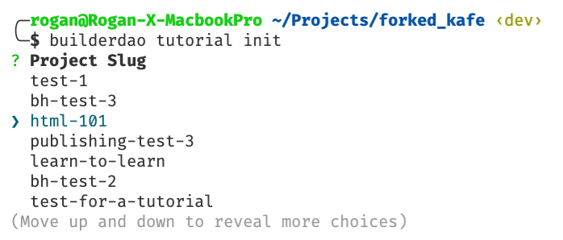

# Builder DAO

Welcome to the Kafé repo by [Builder DAO](https://builderdao.notion.site)!


## What is Kafé?

Kafé is a learning platform for developers to grow their web3 toolbox. Check out this short [demo](https://youtu.be/eYGO8irDl-g)!

## Who's building Kafé?

The current Core Members of Builder DAO are:

- [Arweave](https://arweave.org)
- [Ceramic](https://ceramic.network)
- [Figment](https://figment.io)
- [The Graph](https://thegraph.com)
- [Pyth](https://pyth.network)
- [Solana](https://solana.com)

More are joining us soon. If you're interested in helping us build, reach out on [Discord](https://discord.gg/r4vNRUTXY9)!

## What's inside?

This repo contains the [Kafé learning platform](https://dev.builderdao.io) including the web frontend, Solana programs and TypeScript SDK.

Click each heading below for details:

<details>
 <summary>/apps</summary>

- `/web` - Kafé by Builder DAO frontend
  - `/components` - ReactJS components
  - `/hooks` - React Hooks specific to Kafé
  - `/pages` - Next.js API & page routes
  - `/styles` - This project uses [TailwindCSS](https://tailwindcss.com/)
  </details>

<details>
 <summary>/dao-programs</summary>

- `/migrations/deploy.js` - Deployment script
- `/programs/<solana-program-name>` - Solana program
  - `/src/`: Rust source code for the program
  - `/tests/`: Rust tests for the program
  - `/ts-sdk/`: TypeScript SDK source code
  </details>

<details>
 <summary>/packages</summary>

- `/ui`- A stub React component library
- `/config` - `eslint` configurations (includes `eslint-config-next` and `eslint-config-prettier`)
- `/tsconfig` - TypeScript configuration used throughout the repo
- `/md-utils` - Utilities for parsing markdown files
</details>

<details>
 <summary>/templates</summary>

- `/multipage` - A template for longer guides
- `/simple` - A single page guide template
</details>

<details>
 <summary>/token-scripts</summary>

- `/keypairs` - Solana keypairs for token scripts
- `/token-list` - SPL token metadata directory
- `/token-list/logo/` - SPL token images directory
- `/token-list/token-registry.json` - SPL token metadata
- `/utils` - TypeScript SDK helpers
</details>

<details>
 <summary>/tutorials</summary>

- `/<guide-name>`
  - `/content/assets/` - Images used in the guide are stored here
  - `/content/index.mdx` - Main guide content
  - `/content/<filename>.mdx` - Additional pages, if required
  - `/builderdao.config.json` - Configuration file for the guide
  - `/builderdao.lock.json` - Autogenerated guide lockfile
  </details>

---

## How to use?

This repo is structured as a [monorepo](https://monorepo.tools) using [turborepo](https://turborepo.org), which keeps things modular and gives us the ability to build on top of the Builder DAO SDK independent of Kafé. We use [Yarn](https://yarnpkg.com/) as a package manager.

## Quick start for guide authors

Getting started is easy. Follow these steps and you'll be on your way to writing great guides for other web3 developers. Note that we elaborate on each of these steps in the next section, so if you're ever confused, please keep reading.

- Propose your guide on Kafé: [https://dev.builderdao.io/write](https://dev.builderdao.io/write)
- Once your proposal has enough votes to be funded, [Fork the Kafé repo](https://docs.github.com/en/get-started/quickstart/fork-a-repo) on GitHub
- Clone your fork of the repo to your local machine with `git clone`
- Install the dependencies with `yarn`
- Build the CLI package with `yarn run build:cli`
- Initialize the guide template with `builderdao tutorial init`

```text
git clone https://github.com/<YOUR_GITHUB_USERNAME>/kafe
cd kafe
yarn
yarn build:cli
builderdao tutorial init
```

## Proposing a guide on Kafé

Before you can write and submit a guide for review, it must be proposed and reach quorum on the [Kafé site](https://dev.builderdao.io/). Requirements for the proposal process:

- You must have a Solana wallet installed in the Chrome browser (we recommend the [Phantom](https://phantom.app) wallet)
- Your Solana wallet must be connected to the **testnet** cluster
- You must have at least one $KAFE token in your Solana wallet
- Don't have $KAFE and want to participate? Reach out to us on Discord

- Click on “Connect wallet” at the top right of the **[Write](https://dev.builderdao.io/write)** page on Kafé to connect your Solana wallet to the site.
  - The **title** of your proposal should be the title of your guide. Take a minute to think of what would attract readers to view your guide. Keep it short and sweet! _Examples_: “Build a payment dApp on Solana” - “Polygon p2p payment dApp” - “Ceramic schema cookbook”.
  - The **tags** field is useful to categorize your guide, and up to 5 can be selected. Don't see a tag you want to use? Reach out to us on [Discord](https://discord.gg/r4vNRUTXY9).
    Only select tags that are relevant to the topic of your proposed guide. Users will filter content on Kafé using these tags.
  - Select a **difficulty level** for your guide, either Beginner or Experienced. If there is a lot of code involved in your guide, or it contains advanced concepts, Experienced is the better choice. This is also used to filter content when users are looking at the list of available guides.
  - The **summary** of your proposal will be used as the description of the guide. The summary is limited to 480 characters, which is approximately 70 to 120 words including spaces. This is also used as a description when you generate the template to begin writing.
- When all the fields are complete, click on “submit proposal” on the right side of the page.

Once your guide has reached the vote quorum, it will classified as "funded" and you'll be ready to start writing.
Reviewers consisting of protocol DevRels and community stewards are assigned to your guide to help you take your guide draft to finished product in no time.

## Writing a guide for Kafé

<<<<<<< HEAD
Each guide has its own subdirectory below `tutorials`. The only files you need to edit when writing a guide are in the `content` directory of your guide. To prepare the guide directory, metadata and markdown template for your proposal, run the command:

```text
builderdao tutorial init
=======
Each guide has its own subdirectory below `guides`. The only files you need to edit when writing a guide are in the `content` directory of your guide. To prepare the guide directory, metadata and markdown template for your proposal, run the command:

```text
builderdao guide init
>>>>>>> dev
```

Complete the interactive prompts to prepare the template and checkout the correct branch.

First, you will need to select your guide by its **slug** which will match the title you gave your proposal, in lower-kebab-case. You can scroll through the list with the up and down arrow keys on your keyboard.

> For example, if your proposal title was “HTML 101”, you would select the slug `html-101`.



- “Are you sure you want to create a guide for `...` ?” - **Answer “y” for Yes**.
- “Are you sure you want to checkout the branch "`tutorials/<SLUG>`”? - **Answer "y" for Yes**.
- Select guide type (choose **single** or **multipage**)
- Guide Title - You can change the title of your guide _or_ press Enter to accept the Proposal title.
- Guide Description - You can change the description of your guide _or_ press Enter to accept the Proposal description.
- Select the keywords you would like to use (maximum of 5) - This list can be scrolled with the arrow keys, but unless you want to add any tags here it will already have the tags you added when submitting the proposal so you can press Enter to continue.
- Push changes? - **Answer "y" for Yes**.

When this is complete, a new directory will be created for your guide inside the `tutorials` directory, matching the guide slug.

Inside, you will find:

- `/content/` - Directory containing the guide markdown files
- `/content/index.mdx` - The main markdown file for your guide
- `/content/assets/` - Place any images used in your guide here, linking to images is explained in the guide template
- `/builderdao.config.json` - Guide metadata
- `/builderdao.lock.json` - Configuration lockfile

## Commit, Push, Create a PR

> If this is your first time pushing a commit to a guide branch, you will need to set the upstream and `git` will prompt you to do so, otherwise you can just `git push`.

Once you are finished writing the first draft of your guide, save your changes and then commit and push to your fork. Optionally, you can check the files being staged with `git status`:

```text
git status
git add .
git commit -m "<YOUR_GUIDE_TITLE>"
git push
```

> Remember to replace `<YOUR_GUIDE_TITLE>` and `<SLUG>` with the correct values for your guide. For example, if the title was "HTML 101", the slug would be "html-101".

Now go to your fork of the repo on GitHub (`https://github.com/<YOUR_GITHUB_USERNAME>/kafe`) and [create a Pull Request](https://docs.github.com/en/pull-requests/collaborating-with-pull-requests/proposing-changes-to-your-work-with-pull-requests/creating-a-pull-request). Make sure that the _base branch_ of your PR is the `dev` branch of the Kafè repo. What this means is that the changes you made will be coming from your fork of the repo, where you have the permissions to write - and going into the dev branch of the Kafé repo. This keeps everything nice and tidy.

## Publishing

Once your PR is active, your assigned reviewers will look it over carefully and make suggestions for improvement, point out errors and typos, and work with you to ensure a high quality guide.

After they have approved your guide, it will be merged and automatically published. Kafé will issue the publishing rewards directly to your wallet, and the guide will become available on the Kafé platform.

Your guide is now ready to share with the world!

## Contributing

If you're interested in contributing to this project, we'd love to have you! Please take a look at the contribution guidelines in [`CONTRIBUTING.md`](./CONTRIBUTING.md) and reach out.
