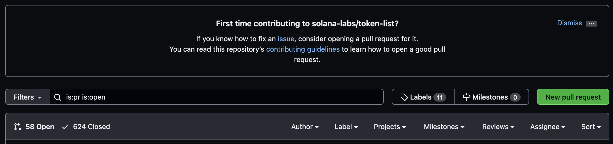
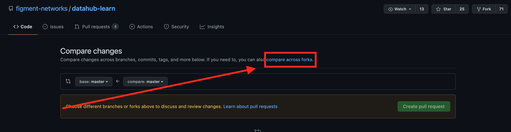

# Introduction

In this tutorial, we will be creating a token on the Solana blockchain with no coding needed. Tokens have many functionalities, such as a [social token](https://www.nasdaq.com/articles/social-tokens%3A-get-ready-for-the-next-massive-crypto-trend-2021-04-29), a [utility token](https://invao.org/token-classes-explained-coin-vs-utility-token-vs-security-token/), or a [coin](https://invao.org/token-classes-explained-coin-vs-utility-token-vs-security-token/).

Solana has a [Token Program](https://spl.solana.com/token), written in [Rust](https://www.rust-lang.org/), that will allow us to create our own token. We will only need to use a simple command-line interface to create and send our tokens around.

This tutorial will typically show a call to action in the form of a bullet point. Please note that if you need help with or would like to explore the usage of any command referenced in this tutorial, add the --help flag after the command.

*   For example:

<!---->

    solana --help

If you have any difficulty following this tutorial or simply want to discuss Solana tech with us you can [join our community today](https://discord.gg/fszyM7K)!

# Prerequisites

*   Basic familiarity with a [command-line interface](https://en.wikipedia.org/wiki/Command-line_interface)
*   Basic familiarity with Git & GitHub
*   Around $1 USD of [SOL](https://coinmarketcap.com/currencies/solana/) accessible. Get SOL through an exchange, such as [FTX](https://ftx.com/#a=13426316), or by swapping tokens on [Serum](https://projectserum.com/#/).
    *   **NOTE:** FTX and Solana are closely linked. FTX's sister company Alameda Research is an investor in Solana, and FTX also operates its own decentralized exchange called Serum on the Solana blockchain.

# Requirements

*   [GitHub account](https://github.com/)
*   [Git](https://git-scm.com/book/en/v2/Getting-Started-Installing-Git) installed
*   [Rust](https://rustup.rs/) installed
*   [Solana Tool Suite](https://docs.solana.com/cli/install-solana-cli-tools) installed

# Create a SOL wallet

First we are going to create a SOL wallet to handle our transactions, using the command line.

*   Create a new wallet, which will return the public key (pubkey):

<!---->

    solana-keygen new

If you already have a local Solana keypair already but want to generate a new one for this tutorial: **Be sure to back up any existing public keys & seed phrases before performing this step**, or you may lose access to assets on Solana! Check `~/.config/solana/id.json` for any public keys. Use the `--force` flag to generate over an existing keypair:

     solana-keygen new --force

The output should look like:

```text
Generating a new keypair

For added security, enter a BIP39 passphrase

NOTE! This passphrase improves security of the recovery seed phrase NOT the
keypair file itself, which is stored as insecure plain text

BIP39 Passphrase (empty for none):
```

You can enter a passphrase or leave it empty. The `solana-keygen` command will now output the pubkey and seed phrase:

```text
Wrote new keypair to /.config/solana/id.json
================================================================================
pubkey: 7UX2i7SucgLMQcfZ75s3VXmZZY4YRUyJN9X1RgfMoDUi
================================================================================
Save this seed phrase and your BIP39 passphrase to recover your new keypair:
still auto damp sphere silly remain first utility announce material luxury robe
================================================================================
```

The created JSON wallet file is located at `~/.config/solana/id.json` in your filesystem.

<Hint
  style="warning">
Write the seed phrase down somewhere safe!
</Hint>

# Fund the wallet

We will now use that public key (pubkey) to fund our wallet with SOL. The SOL is needed to pay for transactions and any changes we make to the blockchain, for example, the transaction that creates our token.

We will need to get SOL into this wallet from a wallet such as the [Sollet](https://chrome.google.com/webstore/detail/sollet/fhmfendgdocmcbmfikdcogofphimnkno?hl=en) browser wallet, after acquiring SOL from [FTX](https://ftx.com/#a=13426316) (or swapping tokens on [Serum](https://projectserum.com/#/)).

*   Send 0.1 SOL to our command-line wallet


*   Check the balance of the wallet with the public key in this input being **your** wallet's public key

```bash
solana balance 7UX2i7SucgLMQcfZ75s3VXmZZY4YRUyJN9X1RgfMoDUi
```

The returned balance should match the exact amount that you sent to the wallet.

# Create the token

*   Install the **spl-token** CLI

    ```bash
    cargo install spl-token-cli
    ```

*   Create the token, which will return the **tokenAddress**

    ```bash
    spl-token create-token
    ```

The command will output an address for the token and a transaction signature :

```text
Creating token B7kRCw1kiB4KxdSKveA3GW4gUc7N4PFiBZTKGRVNXtj6

Signature: 4ELSGXv7Eh6sFnzcM7XvVLmZUZrWbCsF7DoKYpj14qmMzohh9b79AqTXnUYTaLKUuFQLASBHrPMKhEbrM7h8cjMr
```

> If you do not have any SOL in your wallet to pay for the transaction, you will receive an error:

    Creating token AQoKYV7tYpTrFZN6P5oUufbQKAUr9mNYGe1TTJC9wajM
    Fee payer, 7UX2i7SucgLMQcfZ75s3VXmZZY4YRUyJN9X1RgfMoDUi,
     has insufficient balance: 0.0014716 required, 0 available

After running `create-token` above, we have created our own token on Solana. There is much more you can do with this.

*   Check the balance of the wallet with the public key input being **your** wallet's public key:

```bash
solana balance 7UX2i7SucgLMQcfZ75s3VXmZZY4YRUyJN9X1RgfMoDUi
```

Your balance will decrease, indicating the transaction fees and deployment cost have been paid.\
Congratulations, your token is officially created 👍

# Create an account to handle the tokens

Now we need to create an [account](https://docs.solana.com/developing/programming-model/accounts) that can work with the tokens.

*   Create an account, which will return the **accountAddress**, with the **token address** being your token's address:

For example:

```bash
spl-token create-account AQoKYV7tYpTrFZN6P5oUufbQKAUr9mNYGe1TTJC9wajM
```

The output will once again include an address and a transaction signature:

```bash
Creating account 7UX2i7SucgLMQcfZ75s3VXmZZY4YRUyJN9X1RgfMoDUi
Signature: 42Sa5eK9dMEQyvD9GMHuKxXf55WLZ7tfjabUKDhNoZRAxj9MsnN7omriWMEHXLea3aYpjZ862qocRLVikvkHkyfy
```

*   Check the balance of the wallet with the public key in this input being **your** wallet's public key:

```text
solana balance 7UX2i7SucgLMQcfZ75s3VXmZZY4YRUyJN9X1RgfMoDUi
```

# Mint the tokens

It's time to mint some tokens and practice transferring them around. For the **mintAmount**, you can specify any number. Why not try 💰 1,000,000 💰 just for fun? Normally this would be based on factors like how big you expect the tokens market cap to be and if you plan to airdrop any amount to users.

The **recipientAddress** would be the account you created to handle the tokens in the previous step.

*   Mint tokens:

```text
spl-token mint tokenAddress mintAmount recipientAddress
```

For example:

```bash
spl-token mint AQoKYV7tYpTrFZN6P5oUufbQKAUr9mNYGe1TTJC9wajM 100 7UX2i7SucgLMQcfZ75s3VXmZZY4YRUyJN9X1RgfMoDUi
```

The output should include a token address, the recipient address and a transaction signature:

```bash
Minting 100 tokens
  Token: AQoKYV7tYpTrFZN6P5oUufbQKAUr9mNYGe1TTJC9wajM
  Recipient: 7UX2i7SucgLMQcfZ75s3VXmZZY4YRUyJN9X1RgfMoDUi
Signature: 41mARH42fPkbYn1mvQ6hYLjmJtjW98NXwd6pHqEYg9p8RnuoUsMxVd16RkStDHEzcS2sfpSEpFscrJQn3HkHzLaa
```

> Remember, if you are lost or would like to to explore what any of these commands do or how to use them, it's always possible to use the `--help` flag with any of the Solana CLI tools to get more information.

```text
spl-token mint --help
```

Go ahead and check your wallet balance after this transaction if you'd like. Once the tokens have finished minting, it's time to think about security: "What's stopping me from minting an infinite amount of these tokens?"

# Limit supply to prevent unlimited minting

It is crucial to prevent infinite minting of our token, once enough have been created.

*   Disable minting:

```text
spl-token authorize tokenAddress mint --disable
```

*   Check token balance of existing accounts:

```text
spl-token accounts
```

The output should look like:

```bash
Token                                         Balance
------------------------------------------------------------
AQoKYV7tYpTrFZN6P5oUufbQKAUr9mNYGe1TTJC9wajM  1000000
```

Check the wallet balance too if you'd like. It will show the difference after the transaction.

# Transfer token to a browser wallet

*This step is optional*, but now we are going to send all of the token from our command-line-created wallet to our browser wallet. You must have some SOL in your browser wallet so it can automatically add the token.

*   Send token to browser wallet

```text
spl-token transfer --fund-recipient tokenAddress transferAmount recipientAddress
```

For example:

```bash
spl-token transfer AQoKYV7tYpTrFZN6P5oUufbQKAUr9mNYGe1TTJC9wajM 1000000 vines1vzrYbzLMRdu58ou5XTby4qAqVRLmqo36NKPTg
```

This time, the **recipientAddress** should be *your* browser wallet address.

The output should look like:

```bash
Transfer 50 tokens
  Sender: 7UX2i7SucgLMQcfZ75s3VXmZZY4YRUyJN9X1RgfMoDUi
  Recipient: vines1vzrYbzLMRdu58ou5XTby4qAqVRLmqo36NKPTg
  Recipient associated token account: F59618aQB8r6asXeMcB9jWuY6NEx1VduT9yFo1GTi1ks

Signature: 5a3qbvoJQnTAxGPHCugibZTbSu7xuTgkxvF4EJupRjRXGgZZrnWFmKzfEzcqKF2ogCaF4QKVbAtuFx7xGwrDUcGd
```

After the transaction is confirmed on the Solana cluster, you should see your new token in your browser wallet! However, there's an obvious problem! It has no name...

# Submit a pull request to Solana to register token

Our token is created and live on Solana, but is not yet officially recognized. We need to get all the required information for the token ready for submission.

*   Enter your user home directory, where you can clone the token list on your computer.

*   Clone the [Solana token list](https://github.com/solana-labs/token-list):

```text
git clone https://github.com/solana-labs/token-list
```

We now have the `token-list` cloned, so we can add our token's image and information for uploading.

*   You will need to create the directory matching the **tokenAddress** inside of `token-list/assets/mainnet/`.
*   Copy and paste your token's logo inside the cloned `token-list` , in the `token-list/assets/mainnet/<mint address>/`directory.

Go ahead and name the logo file `logo.png` for raster logos or `logo.svg`if you are using vector graphics. Solana prefers logos be either one of those file types.

*   Open the token list file at `token-list/src/tokens/solana.tokenlist.json` to add your token to the list like so:


This example token will be a social token, so be sure to not copy that unless your token is also a social token. The required information is:

```json
{
  "chainId": 101,
  "address": " ",
  "symbol": " ",
  "name": " ",
  "decimals": 0,
  "logoURI": "https://raw.githubusercontent.com/solana-labs/token-list/main/assets/mainnet/<ADDRESS/logo.png",
  "tags": [
    "social-token",
  ],
  "extensions": {
    "website": "https://<YOUR WEBSITE URL>.com"
  }
}
```

The link for the token image must point at the GitHub user content site; just change the token address to your token address, and the logo filename to your logo filename and type.

*   Save the `token-list/src/tokens/solana.tokenlist.json` file.
*   Fork the [token-list](https://github.com/solana-labs/token-list) repository to your own GitHub account by pressing the **Fork** button in the top right of the repository page.

This will add the `token-list` GitHub repository to your GitHub, which will enable you to upload your changes to the forked repository and then request the original repository to accept your changes.

*   While still inside your `token-list` folder in the command line, set the url of your local repository to **your** forked version on GitHub:

```text
git remote set-url origin https://github.com/<YOUR GITHUB USERNAME>/token-list
```

*   Add all the files from the `token-list` to your local repository:

```text
git add .
```

*   Commit the files:

```text
git commit -m "first commit for <YOUR TOKEN SYMBOL & NAME>"
```

*   Push the changes:

```text
git push origin main
```

You should now see the changes in your forked repository on GitHub.

*   Go to the token list [pull requests page](https://github.com/solana-labs/token-list/pulls)
*   Select the **New pull request** button



*   Select the highlighted **compare across forks** option in the subtitle below the **Compare changes** header



*   Select your forked repository from the **head repository** dropdown list


You should see 2 changed files; your token changes and the logo image.

*   Ensure these details are correct. For example, the directory containing the logo image should exactly match your token address in the token list.

We are now ready to create the pull request.

*   Go ahead and click the green **Create pull request** button.
*   Once finished adding a title and filling out the details, press the green **Create pull request** button again.

Congratulations! Your token is now on the way to being official. Only if we could actually trade the token though...

# BONUS: Add a market for your token on Serum

You've made it! Your token is live and has a name. It can now be sent around and used for whatever its utility may be. But, there is no trading pair for the token to be traded on. I did not make a market for my social token as I do not want it to be traded.

Note: It costs roughly **10-15 SOL** to create a market, which right now is around **$350 USD**.

*   Head over to [Serum](https://dex.projectserum.com/#/list-new-market) and connect your chosen wallet in the top right.
*   Fill out the form

The **Base Token Mint Address** will be your tokenAddress, and the **Quote Token Mint Address** will be what token you want your token paired to. I would use USDT for my example.

Once submitted, you should have a live market that can trade the tokens.

# Conclusion

Woohoo! If you made it through all the steps, you have successfully created your own token on the Solana blockchain. If you completed the bonus, you now have a tradable token 👍

# Next Steps

In this tutorial, we built our own token on the Solana blockchain using Solana's command-line interface or "CLI". Feel free to continue experimenting by attempting to mint more of the token, sending the token around to other wallets, creating a market for it, making a liquidity pool on [Raydium](https://raydium.io/liquidity/), etc. Check back in the future for a tutorial on how to make a [non-fungible token](https://www.blockchain-council.org/blockchain/a-quick-guide-to-fungible-vs-non-fungible-tokens/) on Solana as well.

# About the author

This tutorial was created by Jacob Makarsky. He can be found on [Github](https://github.com/jacobmakarsky).

# References

*   [Solana Token Program](https://spl.solana.com/token)
*   [Loop Creative Andy](https://www.youtube.com/watch?v=1cn-HnG_yns)
