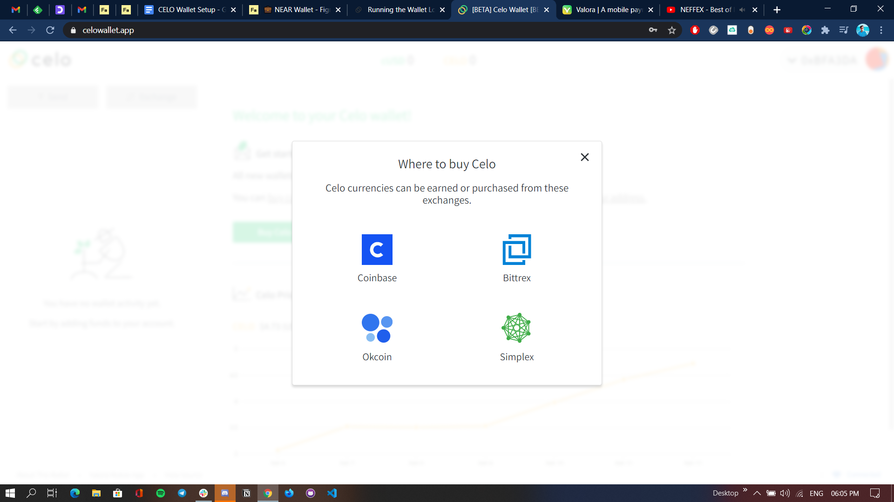

# Lorem

Culpa aute exercitation ea commodo reprehenderit aute incididunt labore nulla laboris et ullamco laboris. Ullamco incididunt cillum sunt incididunt sit deserunt velit anim. Ipsum incididunt minim ullamco duis non. Adipisicing culpa dolore enim eiusmod aute eiusmod exercitation deserunt Lorem magna incididunt. Excepteur anim ex quis veniam ut adipisicing. Officia et proident deserunt dolore nulla non eiusmod veniam amet deserunt commodo aute laboris non. Ad minim eu fugiat aliquip in voluptate incididunt pariatur dolore minim Lorem.

Deserunt cillum mollit pariatur nulla exercitation tempor dolore aliquip. Nulla magna quis magna irure. Fugiat nostrud dolor culpa velit do sunt occaecat duis qui nostrud est laborum. Aute amet laborum sit id eu aliqua qui labore reprehenderit cupidatat anim ipsum in.

 
## .gitignore the .env


Accounts in Solana are owned by programs. A program can only manipulate the data in an account that it owns, hence the need for generating a PDA account owned by our program as our user's account id.


### dotenv parser rules

```text
{MULTILINE: 'new
line'}
```




```typescript
const searchAddress = query && query[0];

if (searchAddress) {
  tags.push({ name: "Address", values: [searchAddress] });
}
```





Forget logins, now our users can connect to our app with their wallets!

<!-- 

```text
.env
```

 -->



Never share your mnemonic with anyone. Never commit it to a repo. **Remember! You can share your account address, but never your mnemonic.**
a

Sint dolor qui tempor in. Consectetur velit dolor et duis voluptate id. Sunt nulla consequat fugiat veniam do aliquip voluptate cillum fugiat aute nostrud cillum elit.

Fugiat id culpa esse anim exercitation est non. Est consectetur elit laboris sint anim nisi commodo irure excepteur fugiat dolore elit nisi aliqua. Nulla tempor qui laborum adipisicing cillum veniam reprehenderit consequat mollit labore pariatur irure nostrud tempor. Et aute magna ex aliqua elit cupidatat dolor proident labore velit anim fugiat aute. Proident ea culpa quis anim labore culpa exercitation eiusmod sunt.

In consequat elit ut consectetur commodo nisi aute dolore voluptate nulla ex reprehenderit. Eu ex ad enim consectetur nisi anim ut sint ipsum culpa consequat anim excepteur. Mollit reprehenderit amet est ut esse adipisicing in dolore ipsum aute culpa consectetur. Qui dolore adipisicing cillum aliquip eiusmod. Elit elit sit consectetur tempor fugiat aliqua. Sunt dolore magna ad et dolor amet. Laboris eu sunt sit est reprehenderit incididunt nostrud duis irure tempor esse nulla pariatur.


```javascript
function testConstructor() public {
    string[] memory nda = new string[](2);
    nda[0] = "US Election";
    nda[1] = "US presidential election";

    string[] memory candidates = new string[](2);
    candidates[0] = "Satoshi";
    candidates[1] = "Musk";

    Election election = new Election(nda, candidates);

    Assert.equal(election.name(), "US Election", "Name should be US Election");
    Assert.equal(election.description(), "US presidential election", "Name should be US presidential election");
}
```

