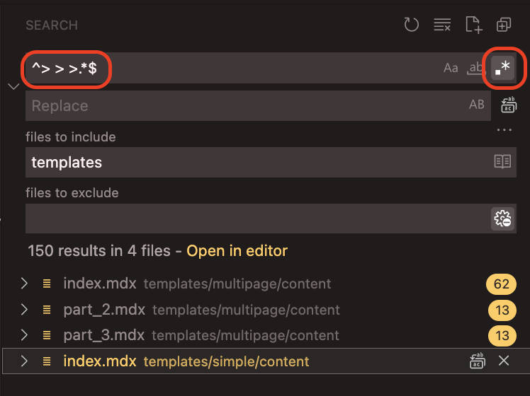

# {{title}}

{{description}}

## Introduction

> > > A well written introduction is key to drawing in your readers and motivating them to complete your guide. Keep it short and informative.

> > > ### Using this template

> > > You will likely copy this template using the `builderdao tutorial init` command, so it will be available for you to edit
> > > inside of your own directory (based on the slug from your proposal on Kafé), such as `tutorials/my-awesome-guide/content/index.mdx`.

> > > If you would like to easily trim out all of the explanations and begin filling in the template with your guide,
> > > we recommend you perform a regular expression search and replace for the string `^> > >.*$` within the `tutorials/<YOUR_SLUG>/content` directory,
> > > which will select the lines for removal. Removing them all will leave you with an empty guide template, ready for writing.

> > > 

---

## Prerequisites

> > > The Prerequisites section is where you can inform readers of any other learning they will find beneficial before attempting this tutorial.
> > > For example:

> > > To successfully complete this tutorial, you will need to have a basic understanding of X, Y & Z.

---

## Requirements

> > > The Requirements section is where you inform readers of any software or tokens they need to have before starting the tutorial.
> > > For example:

> > > - You will need Metamask installed in your browser. You can install it from <https://metamask.io/>
> > > - You need to have a recent version of Node.js installed. We recommend using v14.17.6 LTS for compatibility.

---

## Project setup

> > > The heading "Project setup" is an example only - You can use your own headings and subheadings for the body of your tutorial.
> > > All other headings in the template with the exception of this one are required headings.

> > > Following are examples for various types of content blocks and how to utilize the Markdown and MDX syntax.

> > > ## Code blocks

> > > If you want to display terminal commands to users, use a code block with `text` syntax.
> > > Always leave a blank line before and after the code block:

> > > ```text
> > > npm i -g yarn
> > > npm i -g @graphprotocol/graph-cli
> > > ```

> > > For other types of code highlighting, use the name of the language that the code block contains:

> > > Rust:

> > > ```rust
> > > let _desc: String = read!(\"{}\n\");
> > > println!("{}", _desc);
> > > ```

> > > TypeScript:

> > > ```typescript
> > > function filterByTerm(input: string, searchTerm: string) {
> > >   // TODO
> > > }
> > > ```

> > > Solidity:

> > > ```solidity
> > > event TokenMinted(address indexed owner, uint256 indexed tokenId, string indexed tokenURI);
> > > ```

> > > ### Image links

> > > You can include images in your guide easily by copying them into the `content/assets` directory,
> > > then adding a markdown image link to this document where you want the image to appear: ``

> > > 

> > > ### Hint callouts

> > > Since Kafé uses MDX files which mix markdown and ReactJS, you are able to use React components in your markdown, like this:

> > > <Hint type="info">
> > >   Valid hint callout types are success, warning, info, and tip.
> > > </Hint>

---

# Conclusion

> > > Use this section to provide a quick recap of what was learned by following the guide. You can also congratulate the reader here, for completing the guide.
> > > If there is any user generated content, images, NFTs or code you can prompt readers to display their accomplishments in the Kafé Forum or on Discord in
> > > the showcase channel.
> > > For example:

> > > Congratulations on finishing this guide! You have learned how to Q, R, and S. The NFT you created while completing this guide is special to you,
> > > and you can discuss it with other devs in the showcase channel of the Kafé Discord server.

---

# About the Author

> > > I'm <YOUR_GITHUB_USER_PROFILE>, a blockchain enthusiast with a few years of experience working with various blockchain protocols.
> > > If you enjoyed this guide, please connect with me on [GitHub](https://github.com/<YOUR_GITHUB_USER_PROFILE>).

---

# References

> > > If you've borrowed any content from existing guides, tutorials, documentation or other media you must add links in this section. Please use a bulleted list.
> > > For example:

> > > - [A Brief History of Vegetables in Web3](https://organicproduce.io/why-web3-vegetables-are-good-for-you)

> > > This is the end of the Kafé guide template. Remember to RegEx search for `^> > >.*$` and remove those lines to have a clean template for writing!
