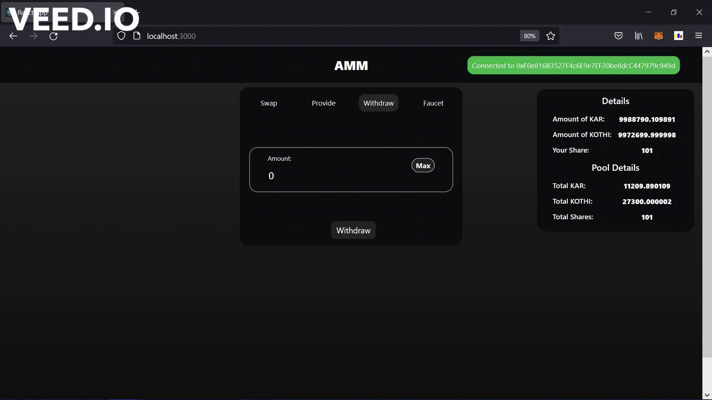

# Introduction

In this tutorial, we will learn how to build a very basic AMM having features namely Provide, Withdraw & Swap with no incentive mechanism like trading fees. Also, we will not deal with ERC20 tokens instead, we will maintain our own mapping storing the balance of the accounts to keep things simple! We will build the smart contract in Solidity and the frontend of our application with the help of ReactJS.

# Prerequisites

- Basic familiarity with ReactJS and Solidity
- Should've completed [Deploy a Smart Contract on Avalanche using Remix and MetaMask](https://learn.figment.io/network-documentation/avalanche/tutorials/deploy-a-smart-contract-on-avalanche-using-remix-and-metamask) tutorial

# Requirements

- [Node.js](https://nodejs.org/en/download/releases/) v10.18.0+
- [Metamask extension](https://metamask.io/download.html) on your browser

# What's an AMM?

Automated Market Maker(AMM) is a type of decentralized exchange which is based on a mathematical formula of price assets. It allows digital assets to be traded without any permissions and automatically by using liquidity pools instead of any traditional buyers and sellers which uses an order book that was used in traditional exchange, here assets are priced according to a pricing algorithm.

For example, Uniswap uses p \* q = k, where p is the amount of one token in the liquidity pool, and q is the amount of the other. Here “k” is a fixed constant which means the pool’s total liquidity always has to remain the same. For further explanation let us take an example if an AMM has coin A and Coin B, two volatile assets, every time A is bought, the price of A goes up as there is less A in the pool than before the purchase. Conversely, the price of B goes down as there is more B in the pool. The pool stays in constant balance, where the total value of A in the pool will always equal the total value of B in the pool. The size will expand only when new liquidity providers join the pool.

# Implementing the smart contract

Let's start with the boilerplate code. We create a contract named `AMM` and import the SafeMath library from OpenZeppelin to perform mathematical operations with proper checks.

```solidity
// SPDX-License-Identifier: MIT
pragma solidity >=0.7.0 <0.9.0;

import "@openzeppelin/contracts/utils/math/SafeMath.sol";

contract AMM {
    using SafeMath for uint256;
}
```

Next, we define the state variables needed to operate the AMM. We will be using the same mathematical formula as used by Uniswap to determine the price of the assets (**K = totalToken1 \* totalToken2**). For simplicity purposes, We are maintaining our own internal balance mapping (token1Balance & token2Balance) instead of dealing with the ERC-20 tokens. As Solidity doesn't support floating-point numbers, we will reserve the first six digits of an integer value to represent the decimal value after the dot. This is achieved by scaling the numbers by a factor of 10^6 (PRECISION).

```solidity
uint256 totalShares;  // Stores the total amount of share issued for the pool
uint256 totalToken1;  // Stores the amount of Token1 locked in the pool
uint256 totalToken2;  // Stores the amount of Token2 locked in the pool
uint256 K;            // Algorithmic constant used to determine price (K = totalToken1 * totalToken2)

uint256 constant PRECISION = 1_000_000;  // Precision of 6 decimal places

mapping(address => uint256) shares;  // Stores the share holding of each provider

mapping(address => uint256) token1Balance;  // Stores the available balance of user outside of the AMM
mapping(address => uint256) token2Balance;
```

Now we will define modifiers that will be used to check the validity of the parameters passed to the functions and restrict certain activities when the pool is empty.

```solidity
// Ensures that the _qty is non-zero and the user has enough balance
modifier validAmountCheck(mapping(address => uint256) storage _balance, uint256 _qty) {
    require(_qty > 0, "Amount cannot be zero!");
    require(_qty <= _balance[msg.sender], "Insufficient amount");
    _;
}

// Restricts withdraw, swap feature till liquidity is added to the pool
modifier activePool() {
    require(totalShares > 0, "Zero Liquidity");
    _;
}
```

The following functions are used to get the present state of the smart contract

```solidity
// Returns the balance of the user
function getMyHoldings() external view returns(uint256 amountToken1, uint256 amountToken2, uint256 myShare) {
    amountToken1 = token1Balance[msg.sender];
    amountToken2 = token2Balance[msg.sender];
    myShare = shares[msg.sender];
}

// Returns the total amount of tokens locked in the pool and the total shares issued corresponding to it
function getPoolDetails() external view returns(uint256, uint256, uint256) {
    return (totalToken1, totalToken2, totalShares);
}
```

As we are not using the ERC-20 tokens and instead, maintaining a record of the balance ourselves; we need a way to allocate tokens to the new users so that they can interact with the dApp. Users can call the faucet function to get some tokens to play with!

```solidity
// Sends free token(s) to the invoker
function faucet(uint256 _amountToken1, uint256 _amountToken2) external {
    token1Balance[msg.sender] = token1Balance[msg.sender].add(_amountToken1);
    token2Balance[msg.sender] = token2Balance[msg.sender].add(_amountToken2);
}
```

Now we will start implementing the three core functionalities - Provide, Withdraw and Swap.

## Provide

`provide` function takes two parameters - amount of token1 & amount of token2 that the user wants to lock in the pool. If the pool is initially empty then the equivalence rate is set as **\_amountToken1 : \_amountToken2** and the user is issued 100 shares for it. Otherwise, it is checked whether the two amounts provided by the user have equivalent value or not. This is done by checking if the two amounts are in equal proportion to the total number of their respective token locked in the pool i.e. **\_amountToken1 : totalToken1 :: \_amountToken2 : totalToken2** should hold.

```solidity
// Adding new liquidity in the pool
// Returns the amount of share issued for locking given assets
function provide(uint256 _amountToken1, uint256 _amountToken2) external validAmountCheck(token1Balance, _amountToken1) validAmountCheck(token2Balance, _amountToken2) returns(uint256 share) {
    if(totalShares == 0) { // Genesis liquidity is issued 100 Shares
        share = 100*PRECISION;
    } else{
        uint256 share1 = totalShares.mul(_amountToken1).div(totalToken1);
        uint256 share2 = totalShares.mul(_amountToken2).div(totalToken2);
        require(share1 == share2, "Equivalent value of tokens not provided...");
        share = share1;
    }

    require(share > 0, "Asset value less than threshold for contribution!");
    token1Balance[msg.sender] -= _amountToken1;
    token2Balance[msg.sender] -= _amountToken2;

    totalToken1 += _amountToken1;
    totalToken2 += _amountToken2;
    K = totalToken1.mul(totalToken2);

    totalShares += share;
    shares[msg.sender] += share;
}
```

<Hint type="danger">
  Carefully notice the order of balance update we are performing in the above
  function. We are first deducting the tokens from the users' account and in the
  very last step, we are updating her share balance. This is done to prevent a
  reentrancy attack.
</Hint>

The given functions help the user get an estimate of the amount of the second token that they need to lock for the given token amount. Here again, we use the proportion **\_amountToken1 : totalToken1 :: \_amountToken2 : totalToken2** to determine the amount of token1 required if we wish to lock given amount of token2 and vice-versa.

```solidity
// Returns amount of Token1 required when providing liquidity with _amountToken2 quantity of Token2
function getEquivalentToken1Estimate(uint256 _amountToken2) public view activePool returns(uint256 reqToken1) {
    reqToken1 = totalToken1.mul(_amountToken2).div(totalToken2);
}

// Returns amount of Token2 required when providing liquidity with _amountToken1 quantity of Token1
function getEquivalentToken2Estimate(uint256 _amountToken1) public view activePool returns(uint256 reqToken2) {
    reqToken2 = totalToken2.mul(_amountToken1).div(totalToken1);
}
```

## Withdraw

Withdraw is used when a user wishes to burn a given amount of share to get back their tokens. Token1 and Token2 are released from the pool in proportion to the share burned with respect to total shares issued i.e. **share : totalShare :: amountTokenX : totalTokenX**.

```solidity
// Returns the estimate of Token1 & Token2 that will be released on burning given _share
function getWithdrawEstimate(uint256 _share) public view activePool returns(uint256 amountToken1, uint256 amountToken2) {
    require(_share <= totalShares, "Share should be less than totalShare");
    amountToken1 = _share.mul(totalToken1).div(totalShares);
    amountToken2 = _share.mul(totalToken2).div(totalShares);
}

// Removes liquidity from the pool and releases corresponding Token1 & Token2 to the withdrawer
function withdraw(uint256 _share) external activePool validAmountCheck(shares, _share) returns(uint256 amountToken1, uint256 amountToken2) {
    (amountToken1, amountToken2) = getWithdrawEstimate(_share);

    shares[msg.sender] -= _share;
    totalShares -= _share;

    totalToken1 -= amountToken1;
    totalToken2 -= amountToken2;
    K = totalToken1.mul(totalToken2);

    token1Balance[msg.sender] += amountToken1;
    token2Balance[msg.sender] += amountToken2;
}
```

## Swap

To swap from Token1 to Token2 we will implement three functions - `getSwapToken1Estimate`, `getSwapToken1EstimateGivenToken2` & `swapToken1`. The first two functions only determine the values of swap for estimation purposes while the last one does the conversion.

`getSwapToken1Estimate` returns the amount of token2 that the user will get when depositing a given amount of token1. The amount of token2 is obtained from the equation **K = totalToken1 \* totalToken2** where the **K** should remain the same before/after the operation. This gives us **K = (totalToken1 + amountToken1) \* (totalToken2 - amountToken2)** and we get the value `amountToken2` from solving this equation. In the last line, we are ensuring that the pool is never drained completely from either side, which would make the equation undefined.

```solidity
// Returns the amount of Token2 that the user will get when swapping a given amount of Token1 for Token2
function getSwapToken1Estimate(uint256 _amountToken1) public view activePool returns(uint256 amountToken2) {
    uint256 token1After = totalToken1.add(_amountToken1);
    uint256 token2After = K.div(token1After);
    amountToken2 = totalToken2.sub(token2After);

    // To ensure that Token2's pool is not completely depleted leading to inf:0 ratio
    if(amountToken2 == totalToken2) amountToken2--;
}
```

`getSwapToken1EstimateGivenToken2` returns the amount of token1 that the user should deposit to get a given amount of token2. Amount of token1 is similarly obtained by solving the following equation **K = (totalToken1 + amountToken1) \* (totalToken2 - amountToken2)**.

```solidity
// Returns the amount of Token1 that the user should swap to get _amountToken2 in return
function getSwapToken1EstimateGivenToken2(uint256 _amountToken2) public view activePool returns(uint256 amountToken1) {
    require(_amountToken2 < totalToken2, "Insufficient pool balance");
    uint256 token2After = totalToken2.sub(_amountToken2);
    uint256 token1After = K.div(token2After);
    amountToken1 = token1After.sub(totalToken1);
}
```

`swapToken1` actually swaps the amount instead of just giving an estimate.

```solidity
// Swaps given amount of Token1 to Token2 using algorithmic price determination
function swapToken1(uint256 _amountToken1) external activePool validAmountCheck(token1Balance, _amountToken1) returns(uint256 amountToken2) {
    amountToken2 = getSwapToken1Estimate(_amountToken1);

    token1Balance[msg.sender] -= _amountToken1;
    totalToken1 += _amountToken1;
    totalToken2 -= amountToken2;
    token2Balance[msg.sender] += amountToken2;
}
```

Similarly for Token2 to Token1 swap we implement the three functions - `getSwapToken2Estimate`, `getSwapToken2EstimateGivenToken1` & `swapToken2` as below.

```solidity
// Returns the amount of Token2 that the user will get when swapping a given amount of Token1 for Token2
function getSwapToken2Estimate(uint256 _amountToken2) public view activePool returns(uint256 amountToken1) {
    uint256 token2After = totalToken2.add(_amountToken2);
    uint256 token1After = K.div(token2After);
    amountToken1 = totalToken1.sub(token1After);

    // To ensure that Token1's pool is not completely depleted leading to inf:0 ratio
    if(amountToken1 == totalToken1) amountToken1--;
}

// Returns the amount of Token2 that the user should swap to get _amountToken1 in return
function getSwapToken2EstimateGivenToken1(uint256 _amountToken1) public view activePool returns(uint256 amountToken2) {
    require(_amountToken1 < totalToken1, "Insufficient pool balance");
    uint256 token1After = totalToken1.sub(_amountToken1);
    uint256 token2After = K.div(token1After);
    amountToken2 = token2After.sub(totalToken2);
}

// Swaps given amount of Token2 to Token1 using algorithmic price determination
function swapToken2(uint256 _amountToken2) external activePool validAmountCheck(token2Balance, _amountToken2) returns(uint256 amountToken1) {
    amountToken1 = getSwapToken2Estimate(_amountToken2);

    token2Balance[msg.sender] -= _amountToken2;
    totalToken2 += _amountToken2;
    totalToken1 -= amountToken1;
    token1Balance[msg.sender] += amountToken1;
}
```

This completes the smart contract implementation part. Now we will deploy it on the Fuji C-Chain testnet.

# Deploying the smart contract

## Setting up Metamask

Log in to MetaMask -> Click the Network drop-down -> Select Custom RPC


**FUJI Testnet Settings:**

- **Network Name**: Avalanche FUJI C-Chain
- **New RPC URL**: <https://api.avax-test.network/ext/bc/C/rpc>
- **ChainID**: `43113`
- **Symbol**: `C-AVAX`
- **Explorer**: [https://cchain.explorer.avax-test.network](https://cchain.explorer.avax-test.network/)

Fund your address from the given [faucet](https://faucet.avax-test.network/).

## Deploy using Remix

Open [Remix](https://remix.ethereum.org/) -> Select Solidity


Create an `AMM.sol` file in the Remix file explorer, and paste the following code:

```solidity
// SPDX-License-Identifier: MIT
pragma solidity >=0.7.0 <0.9.0;

import "@openzeppelin/contracts/utils/math/SafeMath.sol";

contract AMM {
    using SafeMath for uint256;
    uint256 totalShares;  // Stores the total amount of share issued for the pool
    uint256 totalToken1;  // Stores the amount of Token1 locked in the pool
    uint256 totalToken2;  // Stores the amount of Token2 locked in the pool
    uint256 K;            // Algorithmic constant used to determine price

    uint256 constant PRECISION = 1_000_000;  // Precision of 6 digits

    mapping(address => uint256) shares;  // Stores the share holding of each provider

    // Stores the available balance of user outside of the AMM
    // For simplicity purpose, We are maintaining our own internal
    // balance mapping instead of dealing with ERC-20 tokens
    mapping(address => uint256) token1Balance;
    mapping(address => uint256) token2Balance;

    // Ensures that the _qty is non-zero and the user has enough balance
    modifier validAmountCheck(mapping(address => uint256) storage _balance, uint256 _qty) {
        require(_qty > 0, "Amount cannot be zero!");
        require(_qty <= _balance[msg.sender], "Insufficient amount");
        _;
    }

    // Restricts withdraw, swap feature till liquidity is added to the pool
    modifier activePool() {
        require(totalShares > 0, "Zero Liquidity");
        _;
    }

    // Sends free token(s) to the invoker
    function faucet(uint256 _amountToken1, uint256 _amountToken2) external {
        token1Balance[msg.sender] = token1Balance[msg.sender].add(_amountToken1);
        token2Balance[msg.sender] = token2Balance[msg.sender].add(_amountToken2);
    }

    // Returns the balance of the user
    function getMyHoldings() external view returns(uint256 amountToken1, uint256 amountToken2, uint256 myShare) {
        amountToken1 = token1Balance[msg.sender];
        amountToken2 = token2Balance[msg.sender];
        myShare = shares[msg.sender];
    }

    // Returns the total amount of tokens locked in the pool and the total shares issued corresponding to it
    function getPoolDetails() external view returns(uint256, uint256, uint256) {
        return (totalToken1, totalToken2, totalShares);
    }

    // Returns amount of Token1 required when providing liquidity with _amountToken2 quantity of Token2
    function getEquivalentToken1Estimate(uint256 _amountToken2) public view activePool returns(uint256 reqToken1) {
        reqToken1 = totalToken1.mul(_amountToken2).div(totalToken2);
    }

    // Returns amount of Token2 required when providing liquidity with _amountToken1 quantity of Token1
    function getEquivalentToken2Estimate(uint256 _amountToken1) public view activePool returns(uint256 reqToken2) {
        reqToken2 = totalToken2.mul(_amountToken1).div(totalToken1);
    }

    // Adding new liquidity in the pool
    // Returns the amount of share issued for locking given assets
    function provide(uint256 _amountToken1, uint256 _amountToken2) external validAmountCheck(token1Balance, _amountToken1) validAmountCheck(token2Balance, _amountToken2) returns(uint256 share) {
        if(totalShares == 0) { // Genesis liquidity is issued 100 Shares
            share = 100*PRECISION;
        } else{
            uint256 share1 = totalShares.mul(_amountToken1).div(totalToken1);
            uint256 share2 = totalShares.mul(_amountToken2).div(totalToken2);
            require(share1 == share2, "Equivalent value of tokens not provided...");
            share = share1;
        }

        require(share > 0, "Asset value less than threshold for contribution!");
        token1Balance[msg.sender] -= _amountToken1;
        token2Balance[msg.sender] -= _amountToken2;

        totalToken1 += _amountToken1;
        totalToken2 += _amountToken2;
        K = totalToken1.mul(totalToken2);

        totalShares += share;
        shares[msg.sender] += share;
    }

    // Returns the estimate of Token1 & Token2 that will be released on burning given _share
    function getWithdrawEstimate(uint256 _share) public view activePool returns(uint256 amountToken1, uint256 amountToken2) {
        require(_share <= totalShares, "Share should be less than totalShare");
        amountToken1 = _share.mul(totalToken1).div(totalShares);
        amountToken2 = _share.mul(totalToken2).div(totalShares);
    }

    // Removes liquidity from the pool and releases corresponding Token1 & Token2 to the withdrawer
    function withdraw(uint256 _share) external activePool validAmountCheck(shares, _share) returns(uint256 amountToken1, uint256 amountToken2) {
        (amountToken1, amountToken2) = getWithdrawEstimate(_share);

        shares[msg.sender] -= _share;
        totalShares -= _share;

        totalToken1 -= amountToken1;
        totalToken2 -= amountToken2;
        K = totalToken1.mul(totalToken2);

        token1Balance[msg.sender] += amountToken1;
        token2Balance[msg.sender] += amountToken2;
    }

    // Returns the amount of Token2 that the user will get when swapping a given amount of Token1 for Token2
    function getSwapToken1Estimate(uint256 _amountToken1) public view activePool returns(uint256 amountToken2) {
        uint256 token1After = totalToken1.add(_amountToken1);
        uint256 token2After = K.div(token1After);
        amountToken2 = totalToken2.sub(token2After);

        // To ensure that Token2's pool is not completely depleted leading to inf:0 ratio
        if(amountToken2 == totalToken2) amountToken2--;
    }

    // Returns the amount of Token1 that the user should swap to get _amountToken2 in return
    function getSwapToken1EstimateGivenToken2(uint256 _amountToken2) public view activePool returns(uint256 amountToken1) {
        require(_amountToken2 < totalToken2, "Insufficient pool balance");
        uint256 token2After = totalToken2.sub(_amountToken2);
        uint256 token1After = K.div(token2After);
        amountToken1 = token1After.sub(totalToken1);
    }

    // Swaps given amount of Token1 to Token2 using algorithmic price determination
    function swapToken1(uint256 _amountToken1) external activePool validAmountCheck(token1Balance, _amountToken1) returns(uint256 amountToken2) {
        amountToken2 = getSwapToken1Estimate(_amountToken1);

        token1Balance[msg.sender] -= _amountToken1;
        totalToken1 += _amountToken1;
        totalToken2 -= amountToken2;
        token2Balance[msg.sender] += amountToken2;
    }

    // Returns the amount of Token2 that the user will get when swapping a given amount of Token1 for Token2
    function getSwapToken2Estimate(uint256 _amountToken2) public view activePool returns(uint256 amountToken1) {
        uint256 token2After = totalToken2.add(_amountToken2);
        uint256 token1After = K.div(token2After);
        amountToken1 = totalToken1.sub(token1After);

        // To ensure that Token1's pool is not completely depleted leading to inf:0 ratio
        if(amountToken1 == totalToken1) amountToken1--;
    }

    // Returns the amount of Token2 that the user should swap to get _amountToken1 in return
    function getSwapToken2EstimateGivenToken1(uint256 _amountToken1) public view activePool returns(uint256 amountToken2) {
        require(_amountToken1 < totalToken1, "Insufficient pool balance");
        uint256 token1After = totalToken1.sub(_amountToken1);
        uint256 token2After = K.div(token1After);
        amountToken2 = token2After.sub(totalToken2);
    }

    // Swaps given amount of Token2 to Token1 using algorithmic price determination
    function swapToken2(uint256 _amountToken2) external activePool validAmountCheck(token2Balance, _amountToken2) returns(uint256 amountToken1) {
        amountToken1 = getSwapToken2Estimate(_amountToken2);

        token2Balance[msg.sender] -= _amountToken2;
        totalToken2 += _amountToken2;
        totalToken1 -= amountToken1;
        token1Balance[msg.sender] += amountToken1;
    }
}
```

Navigate to the Solidity compiler Tab on the left side navigation bar and click the blue button to compile the `AMM.sol` contract. Note down the `ABI` as it will be required in the next section.

Navigate to Deploy Tab and open the “ENVIRONMENT” drop-down. Select "Injected Web3" (make sure Metamask is loaded) and click the "Deploy" button.

Approve the transaction on Metamask pop-up interface. Once our contract is deployed successfully, make note of the `contract address`.

<Hint type="info">
  An Application Binary Interface (ABI) is a JSON object which stores the
  metadata about the methods of a contract like data type of input parameters,
  return data type & property of the method like payable, view, pure, etc. You
  can learn more about the ABI from the solidity documentation
</Hint>

# Creating a frontend in React

Now, we are going to create a react app and set up the front-end of the application. In the frontend, we represent token1 and token2 as KAR and KOTHI respectively.

Open a terminal and navigate to the directory where we will create the application.

```text
cd /path/to/directory
```

Now clone the github repository, move into the newly `avalance-amm` directory and install all the dependencies.

```text
git clone https://github.com/SayanKar/avalanche-amm.git
cd avalanche-amm
npm install
```

In our react application we keep all the React components in the `src/components` directory.

- **BoxTemplate** :-
  It renders the box containing the input field, its header, and the element on the right of the box, which can be a token name, a button, or is empty.

- **FaucetComponent** :-
  Takes amount of token1 (KAR) and token2 (KOTHI) as input and funds the user address with that much amount.

- **ProvideComponent** :-
  Takes amount of one token (KAR or KOTHI) fills in the estimated amount of the other token and helps provide liquidity to the pool.

- **SwapComponent** :-
  Helps swap a token to another. It takes the amount of token in input field _From_ and estimates the amount of token in input field _To_ and vise versa.

- **WithdrawComponent** :-
  Helps withdraw the share one has. Also enables to withdraw to his maximum limit.

- **ContainerComponent** :-
  This component renders the main body of our application which contains the center box containing the tabs to switch between the four components Swap, Provide, Faucet, Withdraw. And also renders the account details and pool details.

Now it's time to run our React app. Use the following command to start the React app.

```text
npm start
```

# Walkthrough

- Visit <http://localhost:3000> to interact with the AMM.

- Getting funds from the faucet to interact with the AMM


- Adding liquidity in the pool


- Swapping tokens


- Withdrawing liquidity from the pool



# Conclusion

Congratulations! We have successfully developed a working AMM model where users can swap tokens, provide & withdraw liquidity. As a next step, you can play around with the price formula, integrate the ERC20 standard, introduce fees as an incentive mechanism for providers or add slippage protection, and much more...

# Troubleshooting

**Transaction Failure**

- Check if your account has sufficient balance at [fuji block-explorer](https://cchain.explorer.avax-test.network/). You can fund your address from the given [faucet](https://faucet.avax-test.network/)


- Make sure that you have selected the correct account on Metamask if you have more than one account connected to the site.


# About the Author(s)

The tutorial was created by [Sayan Kar](https://github.com/SayanKar), [Yash Kothari](https://github.com/Yashkothari9), and [Nimish Agrawal](https://github.com/realnimish). You can reach out to them for any query regarding the tutorial.

# References

- [How Uniswap works](https://docs.uniswap.org/protocol/V2/concepts/protocol-overview/how-uniswap-works)

- [Deploy a Smart Contract on Avalanche using Remix and MetaMask](https://docs.avax.network/build/tutorials/smart-contracts/deploy-a-smart-contract-on-avalanche-using-remix-and-metamask)
