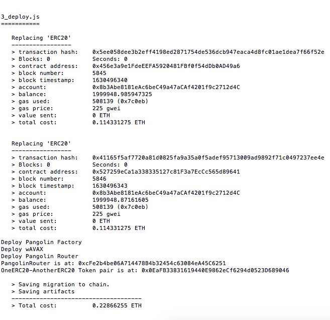

# Introduction

Whether you are looking to create your own token, provide liquidity for existing tokens or to trade on Pangolin that is deployed on Avalanche's c-chain, you will need to create a token pair on Pangolin.

However before that, we must familiarize ourselves with the functionality of token pairs, so that we can simulate a universe of token pairs and wallets, or even test our assumptions about contracts and tokenomics on a DEX. We will want to deploy a local testnet so that we can check our code for bugs and unintended interactions!

In this tutorial we will illustrate how to create your own Pangolin exchange locally and also create a trading pair from any arbitrary ERC20 tokens.

# Prerequisites

If you have completed the Avalanche tutorial on [Using Truffle with the Avalanche C-Chain](https://docs.avax.network/build/tutorials/smart-contracts/using-truffle-with-the-avalanche-c-chain), you will have completed most of the prerequisites.

You have to be mindful that `avalanchego` is being constantly improved and things may change from the time this tutorial is published (i.e. the address of the x/p/c chains used in the libraries above my differ from the current version of avalanchejs, private keys may change, etc. This means that you may need to modify the code when getting your local test net up and running).

In addition, you will need to:

- install pangolindex exchange contracts

```text
npm install --dev @pangolindex/exchange-contracts
```

- install openzepplin contracts

```text
npm install --dev @openzeppelin/contracts
```

# About Pangolin

Pangolin is a fork of Uniswap V2 and the first decentralized exchange (DEX) on Avalanche C-chain where users can swap their [ERC20](https://eips.ethereum.org/EIPS/eip-20) tokens.

# Copy OpenZeppelin ERC20 Contracts to build directory

We now need to make sure we have access to ERC20 token contracts that we will use help create our token pair when we deploy it to pangolin.

These contracts will be found in the `node_modules` directory

```text
cp node_modules/\@openzeppelin/contracts/build/contracts/ERC20.json build/contracts/
```

Similarly, we need to copy the IPangolinFactory and IPangolinPair interface contracts to our build directory.

```text
cp node_modules/\@pangolindex/exchange-contracts/artifacts/contracts/pangolin-core/interfaces/IPangolinPair.sol/IPangolinPair.json build/contracts/
cp node_modules/\@pangolindex/exchange-contracts/artifacts/contracts/pangolin-core/interfaces/IPangolinFactory.sol/IPangolinFactory.json build/contracts/
```

# Create a new Migration file

We now need to create a new migration file called `3_deploy.js` with the content, following this; we will step through what is going on below:

```javascript
const MockERC20 = artifacts.require('ERC20');
const PangolinFactoryBytecode =
  require('@pangolindex/exchange-contracts/artifacts/contracts/pangolin-core/PangolinFactory.sol/PangolinFactory.json').bytecode;
const PangolinRouter02Bytecode =
  require('@pangolindex/exchange-contracts/artifacts/contracts/pangolin-periphery/PangolinRouter.sol/PangolinRouter.json').bytecode;
const WAVAXBytecode =
  require('@pangolindex/exchange-contracts/artifacts/contracts/WAVAX.sol/WAVAX.json').bytecode;
const IPangolinFactory = artifacts.require('IPangolinFactory');
const IPangolinPair = artifacts.require('IPangolinPair');

module.exports = function (deployer, network, accounts) {
  deployer.then(async () => {
    const OneERC20 = await deployer.deploy(MockERC20);
    const AnotherERC20 = await deployer.deploy(MockERC20);

    console.log('Deploy Pangolin Factory');
    // We need an address arg to the contract
    let pangolinArg = '';
    for (let i = 0; i < 32; i++) {
      pangolinArg += '00';
    }

    const pangolinFactoryAddress = (
      await web3.eth.sendTransaction({
        from: accounts[0],
        gas: 8000000,
        data: PangolinFactoryBytecode + pangolinArg,
      })
    ).contractAddress;

    console.log('Deploy wAVAX');
    const wAVAXAddress = (
      await web3.eth.sendTransaction({
        from: accounts[0],
        gas: 8000000,
        data: WAVAXBytecode,
      })
    ).contractAddress;

    console.log('Deploy Pangolin Router');
    const PangolinRouterAddress = (
      await web3.eth.sendTransaction({
        from: accounts[0],
        gas: 8000000,
        data:
          PangolinRouter02Bytecode +
          web3.eth.abi
            .encodeParameters(
              ['address', 'address'],
              [pangolinFactoryAddress, wAVAXAddress],
            )
            .slice(2),
      })
    ).contractAddress;

    console.log('PangolinRouter is at: ' + PangolinRouterAddress);

    const PangoFactoryInstance = await IPangolinFactory.at(
      pangolinFactoryAddress,
    );
    const PangoPairTx = await PangoFactoryInstance.createPair(
      OneERC20.address,
      AnotherERC20.address,
    );
    const PangoPairAddress = PangoPairTx['logs'][0]['args']['pair'];
    const PangoPair = await IPangolinPair.at(PangoPairAddress);

    console.log('OneERC20-AnotherERC20 Token pair is at: ' + PangoPairAddress);
  });
};
```

# Import Required Contracts & Bytecode

The first thing we need do is to import the ERC20 contracts as well as the bytecode for the Pangolin Factory, Router, Pair Interface and Factory Interface and the Wrapped AVAX (wAVAX).

```javascript
const MockERC20 = artifacts.require('ERC20');
const PangolinFactoryBytecode =
  require('@pangolindex/exchange-contracts/artifacts/contracts/pangolin-core/PangolinFactory.sol/PangolinFactory.json').bytecode;
const PangolinRouter02Bytecode =
  require('@pangolindex/exchange-contracts/artifacts/contracts/pangolin-periphery/PangolinRouter.sol/PangolinRouter.json').bytecode;
const WAVAXBytecode =
  require('@pangolindex/exchange-contracts/artifacts/contracts/WAVAX.sol/WAVAX.json').bytecode;
const IPangolinFactory = artifacts.require('IPangolinFactory');
const IPangolinPair = artifacts.require('IPangolinPair');
```

# Deploy Mock Tokens

Next we need to deploy the mock ERC20 tokens.

These could be any other kind of ERC20 tokens, but for simplicity we simply deploy the same contract to different address.

```javascript
const OneERC20 = await deployer.deploy(MockERC20);
const AnotherERC20 = await deployer.deploy(MockERC20);
```

# Construct Zero Address Argument And Deploy Factory

In order to construct any token pair on Pangolin, you will need to interact with the Factory contract and that means we need to deploy it to our local testnet first.

By appending a zero address to the bytecode of the contract, we make a transaction with the data to store it on chain.

```javascript
let pangolinArg = '';
for (let i = 0; i < 32; i++) {
  pangolinArg += '00';
}
const pangolinFactoryAddress = (
  await web3.eth.sendTransaction({
    from: accounts[0],
    gas: 8000000,
    data: PangolinFactoryBytecode + pangolinArg,
  })
).contractAddress;
```

# WAVAX

As with ETH, AVAX is not ERC20 compliant and since it's the native token on avalanche, it must be wrapped.

It is also needed to deploy the router (a hold over from the Uniswap V1 architecture that required ERC20 tokens be swapped for ETH before being swapped for another ERC20 token).

We need to create a transaction where we send the WAVAX bytecode and get back the address.

```javascript
const wAVAXAddress = (
  await web3.eth.sendTransaction({
    from: accounts[0],
    gas: 8000000,
    data: WAVAXBytecode,
  })
).contractAddress;
```

# Router

After we have deployed the bytecode for both the factory and WAVAX, we will take the address and append them as arguments to the router bytecode.

In doing this, we will then be able to interact all the router functions of the exchange in downstream applications.

Not too different from what we have done for the router and WAVAX, we will create a transaction and get the address of the deploy bytecode.

```javascript
const PangolinRouterAddress = (
  await web3.eth.sendTransaction({
    from: accounts[0],
    gas: 8000000,
    data:
      PangolinRouter02Bytecode +
      web3.eth.abi
        .encodeParameters(
          ['address', 'address'],
          [pangolinFactoryAddress, wAVAXAddress],
        )
        .slice(2),
  })
).contractAddress;
```

# Interfaces: IPangolinFactory & IPangolinPair

The interface for the factory and pair token contracts isn’t necessarily needed here because we are deploying both contracts themselves and we could use the contract ABI directly.

However if we were going to access these through another contract, they would allow us to be able to still call the methods defined on PangolinFactory and PangolinPair even if those underlying contracts changed in the future if while only needing to change the address.

For example, if you wanted to modify PangolinPair and PangolinRouter without changing the contracts you may have already deployed (assuming they have a way to pull in the new address), then you will easily be able to do this if you deployed your contracts with the interfaces.

# Create Pair with router and pair interfaces

For the final step, we need to access the instance of the factory address through the interface.

Once that is done, we will call `createPair` on the instance with our ERC20 token address as arguments.

This will generate a transaction that we will need to parse the logs and get the pair address from.

Then if you wanted to later call functions on the pair address, you need to access the address through the pair interface.

```javascript
const PangoFactoryInstance = await IPangolinFactory.at(pangolinFactoryAddress);
const PangoPairTx = await PangoFactoryInstance.createPair(
  OneERC20.address,
  AnotherERC20.address,
);
const PangoPairAddress = PangoPairTx['logs'][0]['args']['pair'];
const PangoPair = await IPangolinPair.at(PangoPairAddress);
```

# Deployment

Run `truffle deploy`

This is what your deployment should look like if it is succesful:



# Conclusion

In this tutorial we have covered:

- Gathering the needed contract files
- Creating a new migration file
- Importing the contract files and bytecode
- Deploying mock ERC20 Tokens
- Deploying Pangolin Factory
- Deploying WAVAX
- Deploying Pangolin Router
- Creating a token pair with our mock ERC20 Tokens

You have now deployed Pangolin to your local testnet with your two ERC20 tokens, created a pair token of from the ERC20 tokens and now are ready to interact with pangolin throught the router as you would on uniswap v2.
