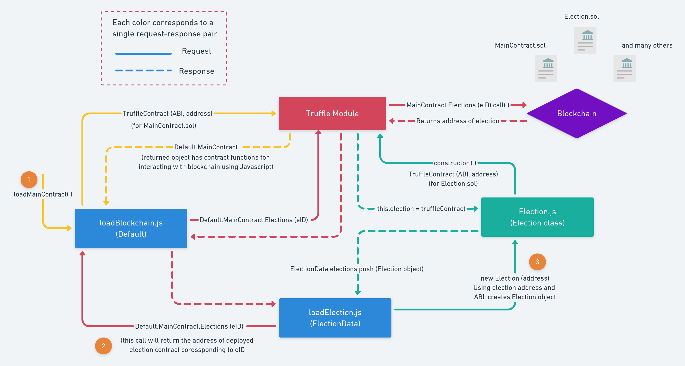
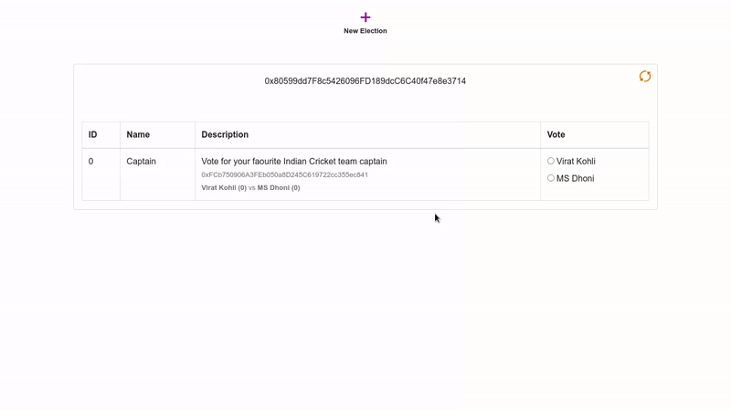

## Introduction

In the last tutorial on [Make an e-Voting dApp on Avalanche Fuji testnet](https://learn.figment.io/tutorials/making-evoting-dapp-on-avalanche-c-chain-using-truffle), we learned how to deploy a smart contract on Avalanche's Fuji C-Chain using Trufflesuite. Along with that we have also coded the client-side application, to easily interact with smart contracts.

In this tutorial, we will be building a more advanced e-voting dApp, in which we will interact with pre-deployed smart contracts, deploy our own smart contracts, and interact with them using their contract address. For developing this dApp we will continue to use the Trufflesuite framework.

For your information, [Trufflesuite](https://www.trufflesuite.com) is a toolkit for launching decentralized applications (dApps) on EVM compatible blockchains. With Truffle you can write and compile smart contracts, run migrations to deploy contracts and interact with deployed contracts. This tutorial illustrates how Truffle can be used with Avalanche's C-Chain, which is an instance of the EVM (Ethereum Virtual Machine).

## Prerequisites

This tutorial assumes you are familiar with [Avalanche's architecture](https://docs.avax.network/learn/platform-overview). Also that you have followed the tutorial [Make an e-Voting dApp on Avalanche Fuji testnet](https://learn.figment.io/tutorials/making-evoting-dapp-on-avalanche-c-chain-using-truffle).

## Requirements

- [NodeJS](https://nodejs.org/en) v8.9.4 or later.
- Truffle, which you can install with `npm install -g truffle`
- Metamask extension added to the browser, which you can install from [metamask.io](https://metamask.io/download.html).
- You need to have a [DataHub](https://datahub.figment.io/sign_up?service=avalanche) account and an Avalanche API key.
- `express`, `dotenv` and `@truffle/hdwallet-provider` (instructions to install these are below).

## Project setup

Open a new terminal so that we can create an `advanced-evoting` directory and install the package dependencies.

First, navigate to the directory within which you intend to create your `advanced-evoting` working directory:

```text
cd /path/to/directory
```

Create and enter a new directory named `advanced-evoting`:

```text
mkdir advanced-evoting
cd advanced-evoting
```

Initialize the folder with `npm`:

```text
npm init
```

This command would prompt the user to enter the details about the project like `name`, `description`, `author` etc. You may either enter details as directed and press enter, or accept defaults & move ahead by pressing enter.

Now use `npm` to install other dependencies

```text
npm install express dotenv @truffle/hdwallet-provider --save
```

Lastly, create a boilerplate Truffle project with:

```text
truffle init
```

This will setup our initial project structure. Smart contracts will be stored in the `contracts` folder, deployment functions for migrating smart contracts to the network will be stored in the `migrations` folder. And `build/contracts` folder would contain information about the deployed contract, ABI etc.

**Update truffle-config.js**

One of the files created when you ran `truffle init` is `truffle-config.js`. Replace the existing contents of that file with the following code :

```javascript
require('dotenv').config();
const HDWalletProvider = require('@truffle/hdwallet-provider');

//Account credentials from which our contract will be deployed
const mnemonic = process.env.MNEMONIC;

//API key of your Datahub account for Avalanche Fuji test network
const APIKEY = process.env.APIKEY;

module.exports = {
  networks: {
    development: {
      host: '127.0.0.1',
      port: 7545,
      network_id: '*',
    },
    fuji: {
      provider: function () {
        return new HDWalletProvider({
          mnemonic,
          providerOrUrl: `https://avalanche--fuji--rpc.datahub.figment.io/apikey/${APIKEY}/ext/bc/C/rpc`,
          chainId: '0xa869',
        });
      },
      network_id: '*',
      gas: 3000000,
      gasPrice: 470000000000,
      skipDryRun: true,
    },
  },
  solc: {
    optimizer: {
      enabled: true,
      runs: 200,
    },
  },
};
```

Note that we're setting the `gasPrice` and `gas` to the appropriate values for the Avalanche C-Chain.

**Add .env file**

- First of all, we need to create an account on Avalanche network. Please visit [Avalanche Wallet](https://wallet.avax.network/) to create your account and save your mnemonics in the .env file.
- Now copy your Datahub's Avalanche Fuji testnet API key in the .env file as shown below.
- Never share or commit your `.env` file. It contains your credentials like `mnemonics` and `API` key. Therefore, it is advised to add `.env` to your `.gitignore` file.

```text
MNEMONIC="<avalanche-wallet-mnemonic>"
APIKEY=<your-api-key>
```

## Add Election.sol

> **References** : Few parts of this tutorial has been made by taking reference from [Dapp University](https://github.com/dappuniversity/election).

In the `contracts` directory add a new file called `Election.sol` and add the following block of code:

```javascript
pragma solidity >=0.4.21 <0.6.0;
pragma experimental ABIEncoderV2;

contract Election {
  //Election details will be stored in these variables
  string public name;
  string public description;

  //Structure of candidate standing in the election
  struct Candidate {
    uint id;
    string name;
    uint voteCount;
  }

  //Storing candidates in a map
  mapping(uint => Candidate) public candidates;

  //Storing address of those voters who already voted
  mapping(address => bool) public voters;

  //Number of candidates in standing in the election
  uint public candidatesCount = 0;

  //Setting of variables and data, during the creation of election contract
  constructor (string[] memory _nda, string[] memory _candidates) public {
    require(_candidates.length > 0, "There should be atleast 1 candidate.");
    name = _nda[0];
    description = _nda[1];
    for(uint i = 0; i < _candidates.length; i++) {
      addCandidate(_candidates[i]);
    }
  }

  //Private function to add a candidate
  function addCandidate (string memory _name) private {
    candidates[candidatesCount] = Candidate(candidatesCount, _name, 0);
    candidatesCount ++;
  }

  //Public vote function for voting a candidate
  function vote (uint _candidate) public {
    require(!voters[msg.sender], "Voter has already Voted!");
    require(_candidate < candidatesCount && _candidate >= 0, "Invalid candidate to Vote!");
    voters[msg.sender] = true;
    candidates[_candidate].voteCount++;
  }
}
```

`Election` is a solidity smart contract which lets us view the name, description, about the candidates standing in an election and voting them. In this DApp, we will be accessing these runtime deployed election smart contracts using their `address` and `ABI`. This smart contract will be deployed to the blockchain, each time we create a new election.

## Understanding the smart contract

Solidity smart contracts are defined by the `contract` keyword, which is very similar to a function signature. Therefore, the code for this smart contract is everything within `contract Election { }`.

- **Basic details about election** - This block of code would be storing basic details of each `Election` contract. Details include `name` and `description`.

```javascript
  //Election details will be stored in these variables
  string public name;
  string public description;
```

- **Storing candidate details** - Candidate details would be stored in a mapping between an unsigned integer to the `Candidate` structure. `Candidate` structure would consists of data like `id`, `name` (candidate's name) and `voteCount` (number of times they are voted).

```javascript
  //Structure of candidate standing in the election
  struct Candidate {
    uint id;
    string name;
    uint voteCount;
  }

  //Storing candidates in a map
  mapping(uint => Candidate) public candidates;
```

- **Storing details of voters which have already voted and number of candidates** - `voters` is a mapping between the address of voter and a boolean. In Solidity, the default boolean value is `false`, so if the returned value of `voters(address)` is `false` we can understand that the voters is voting for the first time in this election, and vice-versa for `true`.

```javascript
  //Storing address of those voters who already voted
  mapping(address => bool) public voters;

  //Number of candidates in standing in the election
  uint public candidatesCount = 0;
```

- **Constructor call and adding candidates to the election** - When a smart contract is deployed on a network, the first thing to be called is a `constructor()` function. Whatever we want to initialize in a smart contract, we do it inside the `constructor()` function. Like here, we will be adding a name, description, and candidates to the election. Here, `addCandidate()` is a private function, so that, it cannot be called publicly. This function takes `name` and `description` as a single array named `_nda` in the first argument and candidates' name as an array in the second argument.

```javascript
  //Setting of variables and data, during the creation of election contract
  constructor (string[] memory _nda, string[] memory _candidates) public {
    require(_candidates.length > 0, "There should be atleast 1 candidate.");
    name = _nda[0];
    description = _nda[1];
    for(uint i = 0; i < _candidates.length; i++) {
      addCandidate(_candidates[i]);
    }
  }

  //Private function to add a candidate
  function addCandidate (string memory _name) private {
    candidates[candidatesCount] = Candidate(candidatesCount, _name, 0);
    candidatesCount ++;
  }
```

- **Voting candidates in an election** - We made a `vote()` function. It takes `candidateId` as an argument and increments vote of the respective candidate. It requires two things, viz. voter should not have voted in the particular election by checking boolean accross the `voters` mapping and `candidateId` should be a valid one, i.e. `0 <= candidateId < candiatesCount`.

```javascript
  //Public vote function for voting a candidate
  function vote (uint _candidate) public {
    require(!voters[msg.sender], "Voter has already Voted!");
    require(_candidate < candidatesCount && _candidate >= 0, "Invalid candidate to Vote!");
    voters[msg.sender] = true;
    candidates[_candidate].voteCount++;
  }
```

## Add MainContract.sol

In the `contracts` directory add a new file called `MainContract.sol` and add the following block of code:

```javascript
pragma solidity >=0.4.21 <0.6.0;
pragma experimental ABIEncoderV2;

import './Election.sol';

contract MainContract {
    uint public electionId = 0;
    mapping (uint => address) public Elections;

    function createElection (string[] memory _nda, string[] memory _candidates) public {
        Election election = new Election(_nda, _candidates);
        Elections[electionId] = address(election);
        electionId++;
    }
}
```

`MainContract.sol` is the main entry point of our e-voting DApp. It will maintain the number of election contracts deployed, their address on the network and will also help in deploying them. We have also imported `Election.sol` contract, for using it in the `MainContract`.

- Here `electionId` is used for assigning ID's to each each election that a user creates and is incremented for using it while creating the next election. Also, `Elections` is a public mapping between `electionId` and address of the deployed election contract.

```javascript
    uint public electionId = 0;
    mapping (uint => address) public Elections;
```

- We have made a `createElection()` function which will be used to deploy our `Election` smart contract. This function takes `name` and `description` as a single array named `_nda` in the first argument and candidates' name as an array in the second argument.

```javascript
    function createElection (string[] memory _nda, string[] memory _candidates) public {
        Election election = new Election(_nda, _candidates);
        Elections[electionId] = address(election);
        electionId++;
    }
```

Here you can see that, new `Election` contract is deployed on the network using the `new` keyword. And address for the deployed smart contract is stored in the `Elections` mapping. Once the election contract is deployed successfully, `electionId` is incremented.

## Add new migration

Create a new file in the `migrations` directory named `2_deploy_contracts.js`, and add the following block of code. This handles deploying the `MainContract` and `Election` smart contract to the blockchain.

```javascript
const MainContract = artifacts.require('MainContract');
const Election = artifacts.require('Election');

module.exports = function (deployer) {
  deployer.deploy(MainContract);
};
```

Here, you can see that, we are only deploying `MainContract` smart contract, because `Election` contract will be deployed by the `MainContract` itself during the runtime, using the function `createElection()`.

## Compile Contracts with Truffle

Any time you make a change to `.sol` files, you need to run `truffle compile`.

```text
truffle compile
```

You should see:

```text
Compiling your contracts...
===========================
> Compiling ./contracts/Election.sol
> Compiling ./contracts/MainContract.sol
> Compiling ./contracts/Migrations.sol

> Artifacts written to /home/guest/blockchain/advanced-evoting/build/contracts
> Compiled successfully using:
   - solc: 0.5.16+commit.9c3226ce.Emscripten.clang
```

> **Note** : There might be an error `Error: Cannot find module 'pify'`, if the `pify` module is somehow not installed automatically while installing `truffle`. So, this issue can be resolved by separately installing `pify`, using the command `npm install pify --save`

Compiling the smart contracts would create `.json` file in the `build/contracts` directory. It stores the ABI and other necessary metadata. ABI refers to _Application Binary Interface_, which is a standard for interacting with the smart contracts from outside the blockchain as well as contract-to-contract interaction. Please refer to the [Solidity documentation about ABIs](https://docs.soliditylang.org/en/latest/abi-spec.html) to learn more.

## Fund the account and run migrations on the C-Chain

When deploying smart contracts to the C-Chain, it will require some deployment cost. As you can see inside `truffle-config.js`, HDWallet Provider will help us in deploying on Fuji C-chain and the deployment cost will be managed by the account whose mnemonic has been stored in the `.env` file. Therefore we need to fund the account.

**Fund your account**

Fund your account using the the faucet link <https://faucet.avax-test.network/> and pasting your Fuji's C-Chain address in the input field. You'll need to send at least `135422040` nAVAX to the account to cover the cost of contract deployments. Here nAVAX refers to nano AVAX, which is one-billionth of an AVAX token. Minimum AVAX required for deployment, will vary from contract to contract, depending upon what variables and data structures our contract is using. Though funding through faucet would give you enough `AVAX` to run multiple deployments and transactions on the network.

## Run Migrations

Now everything is in place to run migrations and deploy the `MainContract`:

```text
truffle migrate --network fuji
```

This might take a while depending upon your internet connection or traffic on the network.

Note - For development purpose, we may deploy our contracts on local network, by running Ganache (Truffle's local blockchain tool) using the command:

```text
truffle migrate --network development
```

On successful execution of this command, you should see:

```text
Starting migrations...
======================
> Network name:    'fuji'
> Network id:      1
> Block gas limit: 8000000 (0x7a1200)


1_initial_migration.js
======================

   Deploying 'Migrations'
   ----------------------
   > transaction hash:    0x094a9c0f12ff3158bcb40e266859cb4f34a274ea492707f673b93790af40e9e9
   > Blocks: 0            Seconds: 0
   > contract address:    0x0b1f00d0Af6d5c864f86E6b96216e0a2Da111055
   > block number:        40
   > block timestamp:     1620393171
   > account:             0x80599dd7F8c5426096FD189dcC6C40f47e8e3714
   > balance:             39.71499696
   > gas used:            173118 (0x2a43e)
   > gas price:           20 gwei
   > value sent:          0 ETH
   > total cost:          0.00346236 ETH


   > Saving migration to chain.
   > Saving artifacts
   -------------------------------------
   > Total cost:          0.00346236 ETH


2_deploy_contracts.js
=====================

   Deploying 'MainContract'
   ------------------------
   > transaction hash:    0xbeb13fc6bbee250eea9151faf02bfe247ec497294acc84c9b8319ed609ced086
   > Blocks: 0            Seconds: 0
   > contract address:    0xf30D372A6911CCF6BBa1e84c3CEd51cC0F3D7769
   > block number:        42
   > block timestamp:     1620393172
   > account:             0x80599dd7F8c5426096FD189dcC6C40f47e8e3714
   > balance:             39.69235442
   > gas used:            1090212 (0x10a2a4)
   > gas price:           20 gwei
   > value sent:          0 ETH
   > total cost:          0.02180424 ETH


   > Saving migration to chain.
   > Saving artifacts
   -------------------------------------
   > Total cost:          0.02180424 ETH


Summary
=======
> Total deployments:   2
> Final cost:          0.0252666 ETH
```

If you didn't create an account on the C-Chain you'll see this error:

```text
Error: Expected parameter 'from' not passed to function.
```

If you didn't fund the account, you'll see this error:

```text
Error:  *** Deployment Failed ***

"Migrations" could not deploy due to insufficient funds
   * Account:  0x090172CD36e9f4906Af17B2C36D662E69f162282
   * Balance:  0 wei
   * Message:  sender doesn't have enough funds to send tx. The upfront cost is: 1410000000000000000 and the sender's account only has: 0
   * Try:
      + Using an adequately funded account
```

The information and ABI of the deployed contract is present in the `/build/contract` directory as `Election.json`. Information like the contract address, network info, etc. could be found here.

## Building the UI for interacting with the blockchain

- Make a `src` directory where we will keep all our files for interacting with the blockchain.
- Go to the `src` directory using `cd src`
- Make a new file `server.js` . Put the following code inside the file.

```javascript
var express = require('express');
var app = express();

//JSON file for deployed contract and network information
const mainContractJSON = require('../build/contracts/MainContract.json');
const electionJSON = require('../build/contracts/Election.json');

require('dotenv').config();

app.use(express.static('./'));

app.get('/', (req, res) => {
  res.sendFile('index.html');
});

//Sending MainContract JSON file for its interaction using Truffle
app.get('/mainContractJSON', (req, res) => {
  res.send(mainContractJSON);
});

//Sending ABI object directly for Election contract, since only ABI will be used
app.get('/electionJSON', (req, res) => {
  res.send(electionJSON.abi);
});

app.listen(process.env.PORT || 3000, () => {
  console.log('Server started at 3000');
});
```

- Now make a new file `index.html` and put the following code inside the file. Everything is well commented, for your comprehension:

```markup
<!DOCTYPE html>

<html lang="en">
  <head>
    <title>Election</title>
  </head>

  <link href="https://stackpath.bootstrapcdn.com/bootstrap/4.4.1/css/bootstrap.min.css" rel="stylesheet">
  <link href="/index.css" rel="stylesheet">

  <body>
    <!-- This component will be used to create a new election -->
    <center id="newElectionButton">
      <div onclick="toggleNewElectionForm()">
        <br>

        <font size = 2>
          <b>New Election</b>
        </font>
      </div>
    </center>

    <!-- This component contains form to create election -->
    <div id="newElectionForm" class="card">
      <!-- Cross image to hide form -->
      <span>
        
      </span>

      <!-- This form will take details of new election and submit a transaction to the network -->
      <form id="formData" onsubmit="submitNewElection(); return false;">
        <font size = 2><b>Election title</b></font><br>
        <input name="details[]" placeholder="Name your election" required><br><br>

        <font size = 2><b>Election description</b></font><br>
        <input name="details[]" placeholder="Describe something about this election" required style="width: 80%;"><br><br>

        <div>
          <span>
            <font size = 2><b>1st Candidate name</b></font><br>
            <input name="candidates[]" placeholder="Candidate name" required>
          </span>

          <span>
            <font size = 2><b>2nd Candidate name</b></font><br>
            <input name="candidates[]" placeholder="Candidate name" required>
          </span>
        </div>

        <br><br>

        <input type="submit" class="btn btn-primary">
      </form>
    </div>

    <!-- List of elections on the network will appear here -->
    <div id="electionContainer" class="card">
      <!-- Account address will be rendered here -->
      <center id="account"></center>

      <!-- Loading will appear until blockchain data is loaded -->
      <center id='loader'>
        <span class="spinner-border text-primary"></span>
      </center>

      <!-- Button to synchronize the list of elections on the network -->
      <span>
        
      </span>

      <br><br>

      <!-- Election data will appear here -->
      <div id="elections" class="container">
        <table class="table table-bordered">
          <tr>
            <td><b>ID</b></td>
            <td><b>Name</b></td>
            <td><b>Description</b></td>
            <td><b>Vote</b></td>
          </tr>

          <tbody id="electionDetails">

          </tbody>
        </table>
      </div>
    </div>
  </body>

  <!--jQuery CDN-->
  <script src="https://ajax.googleapis.com/ajax/libs/jquery/1.12.4/jquery.min.js"></script>

  <!--web3 module for interacting with blockchain-->
  <script language="javascript" type="text/javascript" src="https://cdn.jsdelivr.net/gh/ethereum/web3.js@1.0.0-beta.34/dist/web3.js"></script>

  <!--Truffle Contract module for interacting with smart contract in javascript-->
  <script src="https://rajranjan0608.github.io/ethereum-electionVoting/src/contract.js"></script>

  <!--Our custom javascript code for interaction-->
  <script type="module" language="javascript" src="/loadBlockchain.js"></script>
  <script type="module" language="javascript" src="/loadElections.js"></script>
  <script type="text/javascript" language="javascript" src="/index.js"></script>
</html>
```

- In order to add some design to our basic HTML page, we will also need an `index.css` stylesheet file. Make a file named `index.css` with the following code:

```css
#newElectionButton {
  margin-top: 20px;
}

#newElectionButton > div {
  width: 100px;
  cursor: pointer;
}

img {
  width: 25px;
  height: 25px;
}

#formData {
  margin: 20px 20px;
}

#formData > input:nth-child(2) {
  width: 100%;
}

#formData > div {
  margin-bottom: 30px;
}

#formData > div > span {
  float: left;
}

#formData > div > span:nth-child(2) {
  margin-left: 30px;
}

#newElectionForm {
  width: 40%;
  margin: 50px auto;
  display: none;
}

#newElectionForm > span {
  position: absolute;
  top: 10px;
  right: 10px;
}

#newElectionForm > span > img {
  cursor: pointer;
}

#account {
  margin-top: 20px;
}

#loader {
  margin-top: -8px;
}

#elections {
  margin-top: 15px;
}

#electionContainer {
  width: 80%;
  margin: 50px auto;
}

#electionContainer > span {
  position: absolute;
  top: 10px;
  right: 10px;
}

#electionContainer > span > img {
  cursor: pointer;
}
```

- In order to make this dApp more structured, we will make two small javascript functions, in a separate file named `index.js`. These functions are `toggleNewElectionForm()` for showing and hiding the new election form and `submitNewElection()`, for creating new elections. So, create a file named `index.js` and add the following code into it:

```javascript
var isFormVisible = false;

function toggleNewElectionForm() {
  if (isFormVisible) {
    $('#newElectionButton').show();
    $('#newElectionForm').hide();
    isFormVisible = false;
  } else {
    $('#newElectionButton').hide();
    $('#newElectionForm').show();
    isFormVisible = true;
  }
}

async function submitNewElection() {
  var details = document.getElementsByName('details[]');
  var candidates = document.getElementsByName('candidates[]');
  toggleNewElectionForm();
  try {
    await ElectionData.createElection(
      [details[0].value, details[1].value],
      [candidates[0].value, candidates[1].value],
    );
    document.getElementById('formData').reset();
  } catch (e) {
    document.getElementById('formData').reset();
  }
}
```

- We will be interacting with smart contracts using their ABIs. The ABI for `MainContract` and `Election` would be available in `/mainContractJSON` and `/electionJSON` respectively.
- For interaction purposes, there will be 3 modules: `loadBlockchain.js`, `Election.js` and `loadElection.js`. Please refer to the below image to learn about the use of each file.



- loadBlockchain.js (Default) - This would load `web3`, `account details` and `MainContract`'s javascript equivalent. Now create a `loadBlockchain.js` file in the `src` directory and add the following code:

  ```javascript
  import { ElectionData } from './loadElections.js';

  // Default would contain all the necessary functions for interaction
  export var Default = {
    loading: false,
    contracts: {},

    // Main function to be called first
    load: async () => {
      await Default.loadWeb3();
      await Default.loadAccount();
      await Default.loadMainContract();
      await ElectionData.get();
      await Default.render();
    },

    // Loading web3 on the browser
    loadWeb3: async () => {
      if (typeof web3 !== 'undefined') {
        web3 = new Web3(web3.currentProvider);
        Default.web3Provider = web3.currentProvider;
      } else {
        window.alert('Please connect to Metamask');
      }

      if (window.ethereum) {
        window.web3 = new Web3(ethereum);
        try {
          await ethereum.enable();
        } catch (error) {
          console.log(error);
        }
      } else if (window.web3) {
        Default.web3Provider = web3.currentProvider;
        window.web3 = new Web3(web3.currentProvider);
      } else {
        console.log('Non-Ethereum Browser detected');
      }
    },

    // This function would load account from Metamask to our dDefault
    loadAccount: async () => {
      await web3.eth.getAccounts().then(result => {
        Default.account = result[0];
      });
    },

    // This function would help in loading contract to Default.MainContract
    loadMainContract: async () => {
      // Static pre-deployed contracts should be handled like this
      const MainContract = await $.getJSON('/mainContractJSON');
      Default.contracts.MainContract = TruffleContract(MainContract);
      Default.contracts.MainContract.setProvider(Default.web3Provider);
      Default.MainContract = await Default.contracts.MainContract.deployed();
    },

    // This function will be called after the browser is ready for blockchain interaction
    render: async () => {
      if (Default.loading) {
        return;
      }
      Default.setLoading(true);
      $('#account').html(Default.account);
      Default.setLoading(false);
    },

    // This will facilitate loading feature according to the blockchain data
    setLoading: boolean => {
      Default.loading = boolean;
      const loader = $('#loader');
      const content = $('#content');
      if (boolean) {
        loader.show();
        content.hide();
      } else {
        loader.hide();
        content.show();
      }
    },
  };

  // Function to initiate the blockchain interaction
  $(() => {
    window.addEventListener('load', () => {
      Default.load();
    });
  });

  window.Default = Default;
  ```

- Election.js (Election) - This would be a `Election` class, for maintaining separate states for each election (corresponding to electionId). We would interact with every election by creating an object of `Election` class. Its `constructor()` function would load the `Election` contract's JavaScript equivalent. Now create an `Election.js` file in the `src` directory and add the following code:

  ```javascript
  import { Default } from './loadBlockchain.js';
  import { ElectionData } from './loadElections.js';

  // Election class for maintaining separate states for each election contract
  export class Election {
    constructor(address) {
      this.address = address;
    }

    init = async () => {
      await this.loadElectionContract();
    };

    // Loading election contract's javascript equivalent in the this.election variable
    loadElectionContract = async () => {
      // Dynamic contracts whose address is not known should be handled like this
      var electionABI = await $.getJSON('/electionJSON');
      this.election = await new web3.eth.Contract(electionABI, this.address);
      await this.election.setProvider(web3.currentProvider);
    };

    // Get details of the election
    getDetails = async () => {
      var details = {};

      // Fetching details from blockchain and storing it in details object
      details.candidates = [];
      details.address = this.address;
      details.candidatesCount = await this.election.methods
        .candidatesCount()
        .call();
      details.name = await this.election.methods.name().call();
      details.description = await this.election.methods.description().call();
      details.hasVoted = await this.election.methods
        .voters(Default.account)
        .call();

      // Fetching candidate details along with their vote count
      for (var i = 0; i < details.candidatesCount; i++) {
        var candidate = await this.election.methods.candidates(i).call();

        details.candidates.push({
          name: candidate.name,
          voteCount: candidate.voteCount,
        });
      }

      return details;
    };

    // This function will call vote() on Fuji testnet
    castVote = async candidateId => {
      await this.election.methods
        .vote(candidateId)
        .send({ from: Default.account });
      await ElectionData.get();
    };
  }
  ```

- `loadElection.js` (ElectionData) - This would create an `Election` object for each available deployed election and load the election data on the UI. Now create `loadBlockchain.js` file in the `src` directory and add the following code:

  ```javascript
  import { Default } from './loadBlockchain.js';
  import { Election } from './Election.js';

  export var ElectionData = {
    // get() is a loader function, to run loadElections() function.
    get: async () => {
      await ElectionData.loadElections();
      await ElectionData.loadElectionDetails();
    },

    // Loading deployed election contracts in Default.election array
    loadElections: async () => {
      ElectionData.elections = [];
      ElectionData.electionCount = await Default.MainContract.electionId();
      for (var i = 0; i < ElectionData.electionCount; i++) {
        var electionAddress = await Default.MainContract.Elections(i);
        var election = await new Election(electionAddress);
        await election.init();
        ElectionData.elections.push(election);
      }
    },

    // This function will update the page with election details
    loadElectionDetails: async () => {
      $('#electionDetails').html('');
      for (var i = 0; i < ElectionData.electionCount; i++) {
        var details = await ElectionData.elections[i].getDetails();
        var votingForm;
        // Showing voting forms to only non-voted elections
        if (details.hasVoted) {
          votingForm = `<td>
                                <font size = 2 color = 'green'><b>Voted</b></font>
                              </td>`;
        } else {
          votingForm = `<td>
                                <span>
                                  <input type='radio' name=${details.address} id="${details.address}0" onclick="ElectionData.elections[${i}].castVote(0)"> 
                                  <label for="${details.address}0"> ${details.candidates[0].name}</label>
                          </span> <br>
                                <span>
                                  <input type='radio' name=${details.address} id="${details.address}1" onclick="ElectionData.elections[${i}].castVote(1)"> 
                                  <label for="${details.address}1"> ${details.candidates[1].name}</label>
                          </span>
                              </td>`;
        }
        var electionComponent = `<tr>
                                        <td>${i}</td>
                                        <td>${details.name}</td>
                                        <td>
                                            ${details.description}<br>
                                            <font size = 2 class='text-muted'>
                                                ${details.address}<br>
                                                <b>${details.candidates[0].name} (${details.candidates[0].voteCount})</b> vs
                                                <b>${details.candidates[1].name} (${details.candidates[1].voteCount})</b>
                                            </font>
                                        </td>
                                        ${votingForm}
                                    </tr>`;
        $('#electionDetails').append(electionComponent);
      }
    },

    // Function to create (deploy) election on the network
    createElection: async (details, candidates) => {
      await Default.MainContract.createElection(details, candidates, {
        from: Default.account,
      });
      ElectionData.get();
    },
  };

  window.ElectionData = ElectionData;
  ```

Now run the command `node server.js` in the `src` directory to start the server!

- Visit <http://localhost:3000> to interact with the dApp.
- Don't forget to setup Metamask with the `Fuji` testnet and also fund the account with Fuji C-Chain test tokens in order to vote. Please refer to this tutorial on [Connecting Datahub to Metamask](https://learn.figment.io/tutorials/connect-datahub-to-metamask). You may change to a different address in the Metamask wallet and fund it in order to vote again.



## Conclusion

Congratulations! You have successfully built a complete dApp and deployed the smart contract on Fuji testnet using Trufflesuite. Along with that, you have also built the client side application for interacting with the network.

## Next Steps

The dApp which we built in this tutorial is an e-Voting application, used to make new elections, give them titles and descriptions & vote on them separately.

For further learning, we recommend that you experiment and add a few more interesting features to it, like having start and end dates for elections, declaring winners after the election has ended or any other functionality you can think of!

## About the author

This tutorial was created by [Raj Ranjan](https://www.linkedin.com/in/iamrajranjan). You can get in touch with the author on [GitHub](https://github.com/rajranjan0608)

If you had any difficulties following this tutorial or simply want to discuss Avalanche tech with us you can [**join our community today**](https://discord.gg/fszyM7K)!

## References

- [Make an e-Voting dApp on Avalanche Fuji testnet](https://learn.figment.io/tutorials/making-evoting-dapp-on-avalanche-c-chain-using-truffle)
