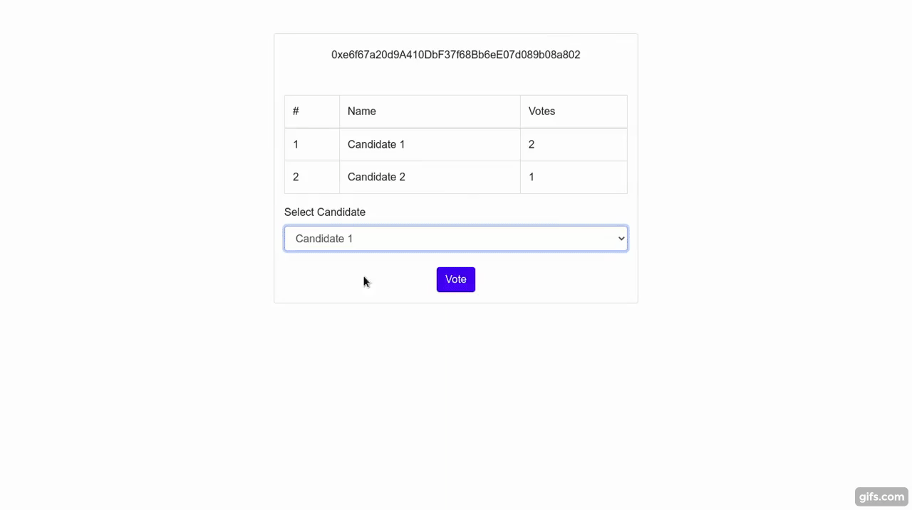

# Introduction

Today we will be learning how to code a decentralized application on Avalanche's Fuji network from scratch. It will be a simple application, in which we will be holding an election between the candidates. Users will be able to vote for their chosen candidate. So, to vote easily and efficiently using the browser, we also need a client-side application to interact with the blockchain. For developing this project we will be using [Trufflesuite](https://www.trufflesuite.com), which is a toolkit for launching decentralized applications (dApps) on [EVM](https://en.wikipedia.org/wiki/Ethereum#Virtual_machine) compatible blockchains. With Truffle you can write and compile smart contracts, build artifacts, run migrations and interact with deployed contracts. This tutorial illustrates how Truffle can be used with Avalanche's C-Chain, which is an instance of the EVM.

# Prerequisites

You will need a [DataHub](https://datahub.figment.io/sign_up?service=avalanche) account and an API key for the Avalanche service.
This tutorial assumes that you are familiar with [Avalanche's architecture](https://docs.avax.network/learn/platform-overview).

# Requirements

- [NodeJS](https://nodejs.org/en) v8.9.4 or later.
- Truffle, which you can install with `npm install -g truffle`
- Metamask extension added to the browser, which you can add from [here](https://metamask.io/download.html)
- Express.js, dotenv and @truffle/hdwallet-provider (instructions to install these are below)
- You will also need to have performed a cross-chain swap via the [Transfer AVAX Between X-Chain and C-Chain](https://docs.avax.network/build/tutorials/platform/transfer-avax-between-x-chain-and-c-chain) tutorial to get funds to your C-Chain address on the Fuji testnet.

# Project setup

Open a new terminal tab, so that we can create a `evoting` directory and install some further dependencies.

First, navigate to the directory within which you intend to create your `evoting` working directory:

```text
cd /path/to/directory
```

Create and enter a new directory named `evoting`:

```text
mkdir evoting
cd evoting
```

Initialize your working directory using `npm` for making your project more organized.

```text
npm init
```

This command would prompt the user to enter the details about the project like `name`, `description`, `author` etc. You may either enter details as directed and press enter, or directly move ahead by hitting enter (it will take default values). You may use the command `npm init -y`, to skip all prompts at once.

Use `npm` to install other dependencies

```text
npm install express dotenv @truffle/hdwallet-provider --save
```

Then create a boilerplate truffle project:

```text
truffle init
```

This will setup our initial project structure. Smart contracts will be stored in the `contracts` folder, deployment functions for migrating smart contracts to the network will be stored in the `migrations` folder. And `build/contracts` folder would contain information about the deployed contract, ABI etc.

**Update truffle-config.js**

One of the files created when you ran `truffle init` is `truffle-config.js`. Replace all of it with the following.

```javascript
require('dotenv').config();
const HDWalletProvider = require('@truffle/hdwallet-provider');

//Account credentials from which our contract will be deployed
const mnemonic = process.env.MNEMONIC;

//API key of your Datahub account for Avalanche Fuji test network
const APIKEY = process.env.APIKEY;

module.exports = {
  networks: {
    fuji: {
      provider: function () {
        return new HDWalletProvider({
          mnemonic,
          providerOrUrl: `https://avalanche--fuji--rpc.datahub.figment.io/apikey/${APIKEY}/ext/bc/C/rpc`,
          chainId: '0xa869',
        });
      },
      network_id: '*',
      gas: 3000000,
      gasPrice: 470000000000,
      skipDryRun: true,
    },
  },
  solc: {
    optimizer: {
      enabled: true,
      runs: 200,
    },
  },
};
```

Note that we're setting the `gasPrice` and `gas` to the appropriate values for the Avalanche C-Chain.

**Add .env file**

- First of all, we need to create an account on Avalanche network. Please visit [Avalanche Wallet](https://wallet.avax.network/) to create your account and save your mnemonics in the .env file.
- Now copy your Datahub's Avalanche Fuji testnet API key in the .env file as shown below.
- Never share or commit your `.env` file! It may contain sensitive information such as credentials and API keys. Therefore, it is advised to always add `.env` to your `.gitignore` file.

```text
MNEMONIC="<avalanche-wallet-mnemonic>"
APIKEY=<your-api-key>
```

# Add Election.sol

In the `contracts` directory add a new file called `Election.sol` and add the following block of code:

```javascript
pragma solidity >=0.4.21 <0.6.0;

contract Election {
  //Structure of candidate standing in the election
  struct Candidate {
    uint id;
    string name;
    uint voteCount;
  }

  //Storing candidates in a map
  mapping(uint => Candidate) public candidates;

  //Storing address of those voters who already voted
  mapping(address => bool) public voters;

  //Number of candidates in standing in the election
  uint public candidatesCount;

  //Adding 2 candidates during the deployment of contract
  constructor () public {
    addCandidate("Candidate 1");
    addCandidate("Candidate 2");
  }

  //Private function to add a candidate
  function addCandidate (string memory _name) private {
    candidatesCount ++;
    candidates[candidatesCount] = Candidate(candidatesCount, _name, 0);
  }

  //Public vote function for voting a candidate
  function vote (uint _candidate) public {
    require(!voters[msg.sender], "Voter has already Voted!");
    require(_candidate <= candidatesCount && _candidate >= 1, "Invalid candidate to Vote!");
    voters[msg.sender] = true;
    candidates[_candidate].voteCount++;
  }
}
```

`Election` is a solidity smart contract which lets us view candidates standing in an election and voting them. This is a basic contract for election and we will advance to more sophisticated smart contract, in which we can even create new elections, add new candidates etc. in the next tutorial of this series.

# Understanding the smart contract

- **Structure to store candidates** - We are using `struct` to store the details of candidates like `name`, `id` and `voteCount`. And further store each candidate in a mapping between candidate's id and their structure.

```javascript
  //Structure of candidate standing in the election
  struct Candidate {
    uint id;
    string name;
    uint voteCount;
  }

  //Storing candidates in a map
  mapping(uint => Candidate) public candidates;
```

- **Voter details** - In an election, a voter should not vote more than once. So, we are storing the voters' addresses in the mapping between voter's address and a boolean representing wether they have voted or not.

```javascript
  //Storing address of those voters who already voted
  mapping(address => bool) public voters;
```

- **Adding candidates** - The candidates are added in an election (smart contract) using the function `addCandidate()`.

```javascript
  //Adding 2 candidates during the deployment of contract
  constructor () public {
    addCandidate("Candidate 1");
    addCandidate("Candidate 2");
  }

  //Private function to add a candidate
  function addCandidate (string memory _name) private {
    candidatesCount ++;
    candidates[candidatesCount] = Candidate(candidatesCount, _name, 0);
  }
```

- **Voting the candidates** - We made a vote() function. It takes candidateId as an argument and increments vote of the respective candidate. It requires two things, viz. voter should not have voted in the particular election by checking `boolean` across the `voters` mapping and `candidateId` should be a valid one, i.e. `1 <= candidateId <= candidatesCount`.

```javascript
  //Public vote function for voting a candidate
  function vote (uint _candidate) public {
    require(!voters[msg.sender], "Voter has already Voted!");
    require(_candidate <= candidatesCount && _candidate >= 1, "Invalid candidate to Vote!");
    voters[msg.sender] = true;
    candidates[_candidate].voteCount++;
  }
```

# Add new migration

Create a new file in the `migrations` directory named `2_deploy_contracts.js`, and add the following block of code. This handles deploying the `Election` smart contract to the blockchain.

```javascript
const Election = artifacts.require('./Election.sol');

module.exports = function (deployer) {
  deployer.deploy(Election);
};
```

# Compile Contracts with Truffle

Any time you make a change to `Election.sol` you need to run `truffle compile`.

```text
truffle compile
```

You should see:

```text
Compiling your contracts...
===========================
> Compiling ./contracts/Migrations.sol
> Compiling ./contracts/Election.sol
> Artifacts written to /path/to/build/contracts
> Compiled successfully using:
   - solc: 0.5.16+commit.9c3226ce.Emscripten.clang
```

> **Note** : There might be an error `Error: Cannot find module 'pify'`, if the `pify` module is somehow not installed automatically while installing `truffle`. Resolve this by installing `pify` manually, using the command `npm install pify --save`

# Fund the account and run migrations on the C-Chain

When deploying smart contracts to the C-Chain, it will require some deployment cost. As you can see inside `truffle-config.js`, HDWallet Provider will help us in deploying on Fuji C-chain and deployment cost will be managed by account whose mnemonic has been stored in the `.env` file. Therefore we need to fund the account.

**Fund your account**

Fund your account using the the faucet link <https://faucet.avax-test.network/> and pasting your Fuji's C-Chain address in the input field. You'll need to send at least `135422040` nAVAX to the account to cover the cost of contract deployments. Here `nAVAX` refers to nano AVAX, which is one-billionth of an AVAX token. Minimum AVAX required for deployment, will vary from contract to contract, depending upon what variables and data structures our contract is using. Though faucet will give you enough `AVAX` to deploy and transact multiple times on Avalanche's Fuji network.

# Run Migrations

Now everything is in place to run migrations and deploy the `Election` contract:

```text
truffle migrate --network fuji
```

This might take a while depending upon your internet connection or traffic on the network.

On successful execution of this command, you should see:

```text
Compiling your contracts...
===========================
> Everything is up to date, there is nothing to compile.

Migrations dry-run (simulation)
===============================
> Network name:    'development-fork'
> Network id:      1
> Block gas limit: 99804786 (0x5f2e672)


1_initial_migration.js
======================

   Deploying 'Migrations'
   ----------------------
   > block number:        4
   > block timestamp:     1607734632
   > account:             0x34Cb796d4D6A3e7F41c4465C65b9056Fe2D3B8fD
   > balance:             1000.91683679
   > gas used:            176943 (0x2b32f)
   > gas price:           470 gwei
   > value sent:          0 ETH
   > total cost:          0.08316321 ETH

   -------------------------------------
   > Total cost:          0.08316321 ETH

2_deploy_contracts.js
=====================

   Deploying 'Election'
   -------------------
   > block number:        6
   > block timestamp:     1607734633
   > account:             0x34Cb796d4D6A3e7F41c4465C65b9056Fe2D3B8fD
   > balance:             1000.8587791
   > gas used:            96189 (0x177bd)
   > gas price:           470 gwei
   > value sent:          0 ETH
   > total cost:          0.04520883 ETH

   -------------------------------------
   > Total cost:          0.04520883 ETH

Summary
=======
> Total deployments:   2
> Final cost:          0.13542204 ETH
```

If you didn't create an account on the C-Chain you'll see this error:

```text
Error: Expected parameter 'from' not passed to function.
```

If you didn't fund the account, you'll see this error:

```text
Error:  *** Deployment Failed ***

"Migrations" could not deploy due to insufficient funds
   * Account:  0x090172CD36e9f4906Af17B2C36D662E69f162282
   * Balance:  0 wei
   * Message:  sender doesn't have enough funds to send tx. The upfront cost is: 1410000000000000000 and the sender's account only has: 0
   * Try:
      + Using an adequately funded account
```

The information and ABI of the deployed contract is present in the `/build/contract` directory as `Election.json`. Information like contract address, network info etc. could be found here.

# Building the UI for interacting with the blockchain

- Make a `src` directory where we will keep all our files for interacting with the blockchain.
- Go to the `src` directory using `cd src`
- Make a new file `server.js` . Put the following code inside the file.

```javascript
var express = require('express');
var app = express();

//JSON file for deployed contract and network information
const electionJSON = require('../build/contracts/Election.json');

require('dotenv').config();

app.use(express.static('./'));

app.get('/', (req, res) => {
  res.send('index.html');
});

app.get('/electionJSON', (req, res) => {
  res.send(electionJSON);
});

app.listen(process.env.PORT || 3000, () => {
  console.log('Server started at 3000');
});
```

- Now make new file `index.html` and add the following code inside the file:

```markup
<!DOCTYPE html>

<html lang="en">
  <head>
    <title>Election</title>
  </head>

  <link href="https://stackpath.bootstrapcdn.com/bootstrap/4.4.1/css/bootstrap.min.css" rel="stylesheet">

  <body>
    <div style="width: 40%; margin: 50px auto" class="card">
            <!-- Account address will be rendered here -->
            <center id="account" style="margin-top: 20px"></center>

            <!-- Loading will appear until blockchain data is loaded -->
            <center id='loader' style="margin:20px;">Loading...</center>

            <br><br>

            <!-- Blockchain data would appear here -->
            <div id="content" style="display:none" class="container" style="margin-top:30px;">
                <!-- Table for fetching election data of the candidates -->
                <table class="table table-bordered">
                    <tr>
                        <td>#</td>
                        <td>Name</td>
                        <td>Votes</td>
                    </tr>
                    <tbody id="candidateResults">

                    </tbody>
                </table>

                <!-- Form to submit vote to a candidate -->
                <form onSubmit="App.castVote(); return false;" style="display:none">
                    <div class="form-group">
                        <label>Select Candidate</label>
                        <center>
                            <select class="form-control" id="candidatesSelect">
                                <option>Select here...</option>
                            </select><br>
                            <input type="submit" class="btn btn-primary" value="Vote">
                        </center>
                    </div>
                </form>

                <!-- This would appear and form will be hidden if the address has already voted -->
                <div id="hasVoted" style="display:none; text-align: center">
                    <b>Thank you for voting !!!</b>
                </div>
            </div>
        </div>
  </body>

  <!--jQuery CDN-->
  <script src="https://ajax.googleapis.com/ajax/libs/jquery/1.12.4/jquery.min.js"></script>

  <!--web3 module for interacting with blockchain-->
  <script language="javascript" type="text/javascript" src="https://cdn.jsdelivr.net/gh/ethereum/web3.js@1.0.0-beta.34/dist/web3.js"></script>

  <!--Truffle Contract module for interacting with smart contract in javascript-->
  <script src="https://rajranjan0608.github.io/ethereum-electionVoting/src/contract.js"></script>

  <!--Our custom javascript code for interaction-->
  <script type="module" language="javascript" src="index.js"></script>
</html>
```

- Now make new file `index.js` and put the following code inside the file. The code is well commented for you to understand.

```javascript
// App would contain all the necessary functions for interaction
var App = {
  loading: false,
  contracts: {},

  // Main function to be called first
  load: async () => {
    await App.loadWeb3();
    await App.loadAccount();
    await App.loadContract();
    await App.render();
  },

  // Loading web3 on the browser
  loadWeb3: async () => {
    if (typeof web3 !== 'undefined') {
      web3 = new Web3(web3.currentProvider);
      App.web3Provider = web3.currentProvider;
    } else {
      window.alert('Please connect to Metamask');
    }

    if (window.ethereum) {
      window.web3 = new Web3(ethereum);
      try {
        await ethereum.enable();
      } catch (error) {
        console.log(error);
      }
    } else if (window.web3) {
      App.web3Provider = web3.currentProvider;
      window.web3 = new Web3(web3.currentProvider);
    } else {
      console.log('Non-Ethereum Browser detected');
    }
  },

  // This function would load account from Metamask to our dApp
  loadAccount: async () => {
    await web3.eth.getAccounts().then(result => {
      App.account = result[0];
      console.log(App.account);
    });
  },

  // This function would help in loading contract to App.election
  loadContract: async () => {
    // Static pre-deployed contracts should be handled like this
    const election = await $.getJSON('/electionJSON');
    App.contracts.election = TruffleContract(election);
    App.contracts.election.setProvider(App.web3Provider);
    App.election = await App.contracts.election.deployed();
  },

  // This function will be called after the browser is ready for blockchain interaction
  render: async () => {
    if (App.loading) {
      return;
    }
    App.setLoading(true);
    $('#account').html(App.account);
    App.renderCandidates();
    App.setLoading(false);
  },

  // This will render blockchain data to the frontend.
  renderCandidates: async () => {
    var candidatesCount = await App.election.candidatesCount();

    $('#candidateResults').html('');
    $('#candidatesSelect').html('');

    for (var i = 1; i <= candidatesCount; i++) {
      const candidate = await App.election.candidates(i);

      const id = candidate[0];
      const name = candidate[1];
      const voteCount = candidate[2];

      var candidateTemplate1 =
        '<tr>' +
        '<td>' +
        id +
        '</td>' +
        '<td>' +
        name +
        '</td>' +
        '<td>' +
        voteCount +
        '</td>' +
        '</tr>';
      $('#candidateResults').append(candidateTemplate1);

      var hasVoted = await App.election.voters(App.account);
      if (!hasVoted) {
        $('form').show();
        $('#hasVoted').hide();
      } else {
        $('#hasVoted').show();
        $('form').hide();
      }

      var candidateTemplate2 =
        "<option value='" + i + "'>" + name + '</option>';
      $('#candidatesSelect').append(candidateTemplate2);
    }
  },

  // This function will call vote() on Fuji testnet
  castVote: async () => {
    const candidateID = $('#candidatesSelect').val();
    await App.election.vote(candidateID, { from: App.account });
    App.renderCandidates();
  },

  setLoading: boolean => {
    App.loading = boolean;
    const loader = $('#loader');
    const content = $('#content');
    if (boolean) {
      loader.show();
      content.hide();
    } else {
      loader.hide();
      content.show();
    }
  },
};

// Driver function to initiate the blockchain interaction
$(() => {
  window.addEventListener('load', () => {
    App.load();
  });
});

window.App = App;
```

Now run `node server.js` in the `src` directory.

- Visit <http://localhost:3000> to interact with the dApp.
- Don't forget to setup Metamask with the `Fuji` testnet and also fund the account with Fuji C-Chain test tokens in order to vote. Please refer to this tutorial on [Connecting DataHub to Metamask](https://learn.figment.io/tutorials/connect-datahub-to-metamask). You may change to a different address in the Metamask wallet and fund it in order to vote again.



# Conclusion

Congratulations! You have successfully built a complete dApp and deployed the smart contract on the Fuji testnet using Trufflesuite. Along with that, you have also built the client side application for interacting with the network.

# Next Steps

The dapp which we built just now is a very simple e-voting application, where for every new election, we need to update the smart contract with new candidates and deploy it on the Avalanche network. In order make it more scalable and sophisticated, you could add more features like creating custom elections, adding new candidates, setting up starting and ending dates for each election and much more.

# About the author

This tutorial was created by [Raj Ranjan](https://www.linkedin.com/in/iamrajranjan), You can get in touch with the author on [GitHub](https://github.com/rajranjan0608)

If you had any difficulties following this tutorial or simply want to discuss Avalanche tech with us you can [**join our community today**](https://discord.gg/fszyM7K)!

# References

This tutorial has been made by taking reference from [Dapp University](https://github.com/dappuniversity/election).
