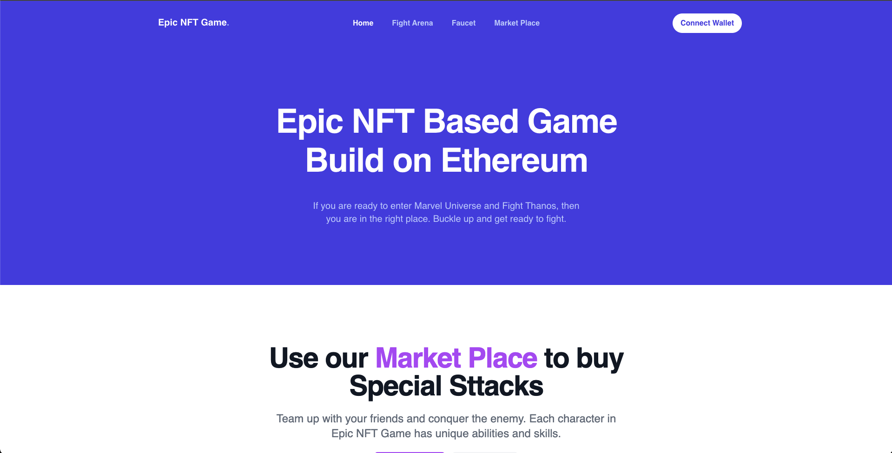

# Introduction

In this tutorial, we will learn how to create an NFT game with a Solidity smart contract deployed on Avalanche Network and a NextJS front-end to interact with the game.

We will be creating an Avengers-themed NFT game with an ERC20 token, which can be used to mint characters in the game and buy special powers from the marketplace. Yes, we will be creating a marketplace where players can buy additional powers for their character. The game will have the following features -

- Each user can mint a character of their choice using the EPIC token.
- One can get the EPIC tokens from the faucet we will be creating in the dApp.
- Once the user has a character, they can enter the fight arena to fight against the boss (Thanos).
- Each character will have Health Points(HP), Damage Points, and Attack Modes (Kick, Punch, etc...).
- Users can buy special attacks from the marketplace for their character using EPIC tokens.
- Each time a character hits the boss, the boss hits back and reduces the HP of the player.
- Users can claim more health over time using EPIC tokens.
- If a character's health reaches 0, they cannot play the game until they claim new health.
- Boss will have very high HP, but boss's HP does not increase over time.
- The boss character will be the same for all the players with the same HP and everyone has to collectively try to defeat the boss.

Sounds interesting? This is what the game we will be creating looks like:


# Prerequisites

To successfully follow along with this tutorial, you will need a good understanding of [ERC721 standards](https://eips.ethereum.org/EIPS/eip-721), [Solidity language](https://docs.soliditylang.org/en/v0.8.11/), the [Hardhat framework](https://hardhat.org/), and the [Next.js framework](https://nextjs.org/).

We will be using [ethers.js](https://docs.ethers.io/v5/) library to interact with the smart contract and Next.js for the frontend.

# Requirements

- [Hardhat](https://hardhat.org/) - Hardhat provides a local development environment for creating and testing blockchain applications.
- [Metamask](https://metamask.io/) - You will need a Metamask wallet installed in your browser.
- [Next.js](https://nextjs.org/) - A web framework to create a user interface.
- [Arweave](https://www.arweave.org/) - We will store images related to a proposal on Arweave.
- [TailwindCSS](https://tailwindcss.com/) - A CSS utility framework.

# Project Setup

We will be using [nextjs-hardhat-tailwind-starter](https://github.com/viral-sangani/nextjs-hardhat-tailwind-starter) to get the initial setup. Run the following code to get started with boilerplate code.

```text
git clone https://github.com/viral-sangani/nextjs-hardhat-tailwind-starter
mv nextjs-hardhat-tailwind-starter epic-nft-game
cd epic-nft-game
```

This starter kit comes with all the packages you will need to get started with a dApp. You can see the list of the package in the starter kit [here](https://github.com/viral-sangani/nextjs-hardhat-tailwind-starter/blob/main/package.json).

We will need a few more packages to create awesome UI for our game. Run the following code to add additional packages.

```text
yarn add @headlessui/react dotenv react-lottie react-spring react-step-progress-bar react-toastify react-tooltip
```

# Creating EPIC ERC20 Token

Rename `contracts/ERC20Token.sol` to `EPICToken.sol` and paste the following code.

```solidity
// SPDX-License-Identifier: UNLICENSED

pragma solidity ^0.8.0;
import "@openzeppelin/contracts/token/ERC20/ERC20.sol";

contract EPICToken is ERC20 {
    constructor(string memory name, string memory symbol) ERC20(name, symbol) {
        _mint(msg.sender, 100000 * (10**18));
    }

    function faucet(address recipient, uint256 amount) external {
        require(amount <= 20 ether, "Amount must be less than 20 ether");
        _mint(recipient, amount);
    }
}
```

In the `EPICToken` contract, we will accept the token name and token symbol from the constructor and mint some tokens for the contract owner.

We also have a faucet method that will airdrop up to 20 EPIC tokens in the caller's account. Note that the method call will revert if more than 20 tokens are requested.

# Creating NFTEpicGame smart contract

Create a file called `NFTEpicGame.sol` in the contracts folder and write the following code -

[NFTEpicGame.sol](https://github.com/viral-sangani/epic-nft-game/blob/main/contracts/NFTEpicGame.sol)

I know it's a lot to take in, let's go ahead and see what's happening in the smart contract.

```solidity
import "@openzeppelin/contracts/token/ERC721/ERC721.sol";
import "@openzeppelin/contracts/token/ERC20/IERC20.sol";
import "@openzeppelin/contracts/utils/Counters.sol";
import "@openzeppelin/contracts/utils/math/SafeMath.sol";
import "@openzeppelin/contracts/utils/Strings.sol";
import "@openzeppelin/contracts/access/Ownable.sol";
import "@openzeppelin/contracts/security/ReentrancyGuard.sol";
import "./libraries/Base64.sol";
import "hardhat/console.sol";
```

Here we are importing all the necessary Openzeppelin contracts. We need ERC721 to mint character NFTs and IERC20 to call ERC20 methods on our EPIC token. We will be using some utility contracts like `Counters.sol`, `SafeMath.sol`, `Strings.sol`, `Ownable.sol`, `ReentrancyGuard.sol` and `Base64.sol`.

`console.sol` is provided by hardhat, used to add some debug statements in the smart contract which will be removed when the contract is compiled for deployment.

```solidity
contract NFTEpicGame is ERC721, ReentrancyGuard, Ownable {
    using Counters for Counters.Counter;
    using SafeMath for uint256;

    Counters.Counter private _tokenIds;
    address epicToken;
    uint256 regenTime = 60;
}
```

We will inherit from ERC721, ReentrancyGuard, and Ownable contract in our NFTEpicGame. ERC721 is used to mint NFT characters for our users. ReentrancyGuard is a modifier that can prevent reentrancy during certain functions (read more about ReentrancyGuard [here](https://docs.openzeppelin.com/contracts/4.x/api/security#ReentrancyGuard)). Ownable provides a basic access control mechanism where an owner account can be granted exclusive access to specific functions.

`_tokenIds` is used to keep track of all NFTs, `epicToken` is the contract address of our ERC20 token, and `regenTime` is the time in seconds user have to wait to reclaim the health (briefly explained below).

```solidity
    struct CharacterAttributes {
        uint256 characterIndex;
        string name;
        string imageURI;
        uint256 hp;
        uint256 maxHp;
        uint256[] attacks;
        uint256[] specialAttacks;
        uint256 lastRegenTime;
    }

    struct AttackType {
        uint256 attackIndex;
        string attackName;
        uint256 attackDamage;
        string attackImage;
    }

    struct SpecialAttackType {
        uint256 price;
        uint256 specialAttackIndex;
        string specialAttackName;
        uint256 specialAttackDamage;
        string specialAttackImage;
    }

    AttackType[] allAttacks;
    SpecialAttackType[] allSpecialAttacks;

    struct BigBoss {
        string name;
        string imageURI;
        uint256 hp;
        uint256 maxHp;
        uint256 attackDamage;
    }

    BigBoss public bigBoss;

    CharacterAttributes[] defaultCharacters;

    mapping(uint256 => CharacterAttributes) public nftHolderAttributes;
    mapping(address => uint256) public nftHolders;
```

- `CharacterAttributes` struct is used to store all the character attributes of a player. An instance of `CharacterAttributes` is created when the user mints the character for the first time.
- `CharacterAttributes` also has `lastRegenTime` which stores that last time player has requested to regenerate the health for their character.
- `AttackType` stores the data related to each attack. It includes attack name, attack damage, and attack image displayed in the game.
- `SpecialAttackType` is similar to `AttackType` but has one extra attribute i.e. - `price`. Since players have to buy special attacks from the marketplace, each special attack has a price marked.
- `allAttacks` and `allSpecialAttacks` keeps the track of all the attacks and special attacks in the game. Keeping these in a map helps in reducing contract size as we will not store all the data associated with an attack multiple times for each character but we will store only the attack index which in effect reduces the contract transaction costs.
- `BigBoss` struct contains all the data for the boss character.
- `defaultCharacters` array contains the array of all the mintable characters that the player can choose from.
- `nftHolders` is a map that holds the token ID for each address/player.
- `nftHolderAttributes` holds the `CharacterAttributes` struct for each token ID minted by the players.

```solidity
    event CharacterNFTMinted(
        address sender,
        uint256 tokenId,
        uint256 characterIndex
    );
    event AttackComplete(uint256 newBossHp, uint256 newPlayerHp);
    event RegenCompleted(uint256 newHp);
```

`CharacterNFTMinted` is an event that is emitted when a new character is minted by the player. `AttackComplete` is emitted when a player performs a normal attack or a special attack and `RegenCompleted` is emitted when a user has successfully called the `claimHealth` method.

```solidity
    constructor(
        string[] memory characterName,
        string[] memory characterImageURI,
        uint256[] memory characterMaxHp,
        uint256[][] memory characterAttacks,
        string memory bossName,
        string memory bossImageURI,
        uint256 bossHp,
        uint256 bossAttackDamage,
        address epicTokenAddress
    ) ERC721("Heroes", "HERO") {
        epicToken = epicTokenAddress;
        for (uint256 i = 0; i < characterName.length; i++) {
            CharacterAttributes memory charAttribute;
            charAttribute.characterIndex = i;
            charAttribute.name = characterName[i];
            charAttribute.imageURI = characterImageURI[i];
            charAttribute.hp = characterMaxHp[i];
            charAttribute.maxHp = characterMaxHp[i];
            charAttribute.attacks = characterAttacks[i];
            defaultCharacters.push(charAttribute);
        }
        _tokenIds.increment();
        bigBoss = BigBoss({
            name: bossName,
            imageURI: bossImageURI,
            hp: bossHp,
            maxHp: bossHp,
            attackDamage: bossAttackDamage
        });
    }
```

- In the constructor we are accepting arrays of `characterName`, `characterImageURI`, `characterMaxHp` and `characterAttacks`.
- We will loop over these arrays and create `CharacterAttributes` instances and add them to the `defaultCharacters` array.
- Note that the size/length of all these arrays should be the same.
- We also accepts boss attributes like `bossName`, `bossImageURI`, `bossHp`, `bossAttackDamage` and create an instance of `BigBoss` struct.
- We increment the `_tokenIds` so that it starts from 1.
- At last, we need to accept the EPIC token address so that we can accept that token when the user mints the NFT or made any purchase from the marketplace.
- Since we are accepting the EPIC token address in the `NFTEpicGame` contract, we have to deploy the token first and then use that address to deploy `NFTEpicGame`.

```solidity
    function addAttacks(
        // All the attacks for each character
        string[] memory attackNames,
        string[] memory attackImages,
        uint256[] memory attackDamages,
        uint256[] memory attackIndexes
    ) public onlyOwner {
        for (uint256 j = 0; j < attackIndexes.length; j++) {
            allAttacks.push(
                AttackType(
                    attackIndexes[j],
                    attackNames[j],
                    attackDamages[j],
                    attackImages[j]
                )
            );
        }
    }

    function addSpecialAttacks(
        // All the special attacks for each character
        string[] memory specialAttackNames,
        string[] memory specialAttackImages,
        uint256[] memory specialAttackDamages,
        uint256[] memory specialAttackPrices,
        uint256[] memory specialAttackIndexes
    ) public onlyOwner {
        for (uint256 j = 0; j < specialAttackIndexes.length; j++) {
            allSpecialAttacks.push(
                SpecialAttackType(
                    specialAttackPrices[j],
                    specialAttackIndexes[j],
                    specialAttackNames[j],
                    specialAttackDamages[j],
                    specialAttackImages[j]
                )
            );
        }
    }
```

- Both `addAttacks` and `addSpecialAttacks` are used to add attacks and special attacks to the game.
- Note that both these methods have an `onlyOwner` modifier, which means only the deploying address can call these methods and add new attacks and special attacks.
- Both these methods accept arrays of data like name, image, damage, indexes, and loop over them to create respective struct instances and add them to the `allAttacks` array or the `allSpecialAttacks` array.

```solidity
    function mintCharacterNFT(uint256 _characterIndex) external payable {
        require(
            _characterIndex < defaultCharacters.length,
            "Character index out of bounds"
        );
        require(
            IERC20(epicToken).allowance(msg.sender, address(this)) >= 10 ether,
            "Please approve the required token transfer before minting"
        );
        IERC20(epicToken).transferFrom(msg.sender, address(this), 10 ether);
        uint256 newItemId = _tokenIds.current();
        _safeMint(msg.sender, newItemId);
        nftHolderAttributes[newItemId] = CharacterAttributes({
            characterIndex: _characterIndex,
            name: defaultCharacters[_characterIndex].name,
            imageURI: defaultCharacters[_characterIndex].imageURI,
            hp: defaultCharacters[_characterIndex].hp,
            maxHp: defaultCharacters[_characterIndex].maxHp,
            attacks: defaultCharacters[_characterIndex].attacks,
            specialAttacks: defaultCharacters[_characterIndex].specialAttacks,
            lastRegenTime: block.timestamp
        });
        nftHolders[msg.sender] = newItemId;
        _tokenIds.increment();
        emit CharacterNFTMinted(msg.sender, newItemId, _characterIndex);
    }
```

`mintCharacterNFT` is called by all the players once they join the game. In `mintCharacterNFT` we have defined that to mint a new character user has to pay 10 EPIC tokens. This is what happens in the `mintCharacterNFT` method -

- `mintCharacterNFT` accepts the character index that the player wants to mint and makes sure that the index is not out of bounds.
- Next, it checks the `allowance` of `epicToken` is greater than or equal to 10 EPIC tokens, if not methods revert with an error message.
- If the contract has allowance then we call the `transferFrom` method of ERC20 token and transfer 10 EPIC tokens from the player's account to the contract address.
- Once all the checks are completed, we get the current token ID and call the `_safeMint` method of the `ERC721` contract with `msg.sender` and token Id. This call will essentially mint a new NFT for the player.
- After minting a new NFT character we have to create a new `CharacterAttributes` instance and use the `defaultCharacters` to fetch the metadata of that player.
- Now that we have a new instance of `CharacterAttributes` we have to add it to `nftHolderAttributes` corresponding to the current token ID.
- Finally, we can map the player's address to the token ID in the `nftHolders` map and increment the `_tokenIds`.

```solidity
    function claimHealth() external {
        require(
            nftHolders[msg.sender] != 0,
            "You don't have a character to claim health"
        );
        require(
            IERC20(epicToken).allowance(msg.sender, address(this)) >= 0.1 ether,
            "Please approve the required token transfer before minting"
        );
        IERC20(epicToken).transferFrom(msg.sender, address(this), 0.1 ether);
        uint256 tokenId = nftHolders[msg.sender];
        CharacterAttributes memory character = nftHolderAttributes[tokenId];
        uint256 currentTime = block.timestamp;
        uint256 timeSinceLastRegen = currentTime - character.lastRegenTime;

        if (timeSinceLastRegen > regenTime) {
            uint256 newHp = character.hp + timeSinceLastRegen.div(60);
            if (newHp > character.maxHp) {
                newHp = character.maxHp;
            }
            character.hp = newHp;
            character.lastRegenTime = currentTime;
            nftHolderAttributes[tokenId] = character;
            emit RegenCompleted(newHp);
        }
    }
```

`claimHealth` can be called by any character holder to gain some health for their player. `claimHealth` provides 1 HP for each minute since the player has called the `claimHealth` method. This means if the user has last called the `claimHealth` method after 20 minutes, then the player's character will have 20 new HP points. Note that the addition of these new HP points cannot go more than the `maxHp` of that character.

Each time a player wants to call the `claimHealth` method they have to pay a fee of 0.1 EPIC tokens.

- In `claimHealth` first, we make sure that the calling player has a character minted and the player has approved the 0.1 EPIC token for the contract.
- We have to call the `transferFrom` method of the ERC20 token to transfer 0.1 EPIC tokens from the player's wallet to the contract address. Once the tokens are transferred we have to retrieve the tokenId of the player from the `nftHolders` map.
- Using `tokenId` we can fetch the `character` struct from `nftHolderAttributes` map. `character` has `lastRegenTime` which can be used to calculate the time elapsed since the player has called the `claimHealth` method.
- If it's been more than `regenTime` which is 60 seconds in our case, we allow them to claim the health.
- To calculate the new HP for the character we have to divide `timeSinceLastRegen` by 60 since `timeSinceLastRegen` is the seconds elapsed since the player has claimed the health and add that number to the current HP of the player.
- If the `newHp` is more than the `maxHp` of that player we give `maxHp` to that character. At the end we have to update the `lastRegenTime` to `currentTime` and update `nftHolderAttributes` with current `character`.

```solidity
    function attackBoss(uint256 attackIndex) public {
        uint256 nftTokenIdOfPlayer = nftHolders[msg.sender];
        CharacterAttributes storage player = nftHolderAttributes[
            nftTokenIdOfPlayer
        ];
        require(player.hp > 0, "Error: character must have HP to attack boss.");
        require(bigBoss.hp > 0, "Error: boss is already dead");
        uint256 attackDamage = 0;
        for (uint256 i = 0; i < player.attacks.length; i++) {
            if (attackIndex == player.attacks[i]) {
                attackDamage = allAttacks[attackIndex].attackDamage;
            }
        }
        require(attackDamage > 0, "Error: attack must have damage.");
        if (bigBoss.hp < attackDamage) {
            bigBoss.hp = 0;
        } else {
            bigBoss.hp = bigBoss.hp - attackDamage;
        }

        if (player.hp < bigBoss.attackDamage) {
            player.hp = 0;
        } else {
            player.hp = player.hp - bigBoss.attackDamage;
        }
        emit AttackComplete(bigBoss.hp, player.hp);
    }
```

`attackBoss` is called when a player uses any normal attack on the boss. Any player can only attack the boss if the player and boss both have more than 0 HP points.

- First, we retrieve the current character instance of `nftHolderAttributes` and check all the requirements.
- `attackBoss` accepts the `attackIndex` which corresponds to the attack player wants to perform on the boss.
- To get the `attackDamage` from `attackIndex` we have to loop over all the available attacks of that character and make sure that the player has called the method with the correct `attackIndex`.
- Once we have `attackDamage` we have to make sure that `attackDamage` is more than 0 or else revert the method call.
- The only condition `attackDamage` can be 0 is when `attackIndex` is not present in allAttacks.
- In the end, reduce `attackDamage` from the boss's HP and reduce the boss's attack damage from the character's HP.

`attackSpecialBoss` is similar to `attackBoss`. Only difference is instead of fetching `attackDamage` from `allAttacks`, we fetch it from `allSpecialAttacks`

```solidity
    function buySpecialAttack(uint256 specialAttackIndex) public payable {
        uint256 nftTokenIdOfPlayer = nftHolders[msg.sender];
        require(
            nftTokenIdOfPlayer > 0,
            "Error: must have NFT to buy special attack."
        );

        CharacterAttributes storage player = nftHolderAttributes[
            nftTokenIdOfPlayer
        ];
        require(
            IERC20(epicToken).allowance(msg.sender, address(this)) >=
                allSpecialAttacks[specialAttackIndex].price,
            "Error: user must provide enough token to buy special attack."
        );
        IERC20(epicToken).transferFrom(
            msg.sender,
            address(this),
            allSpecialAttacks[specialAttackIndex].price
        );
        player.specialAttacks.push(specialAttackIndex);
        emit AttackComplete(bigBoss.hp, player.hp);
    }
```

`buySpecialAttack` is the method called from the marketplace, where the player can buy and special attack for their character. Each special attack has a price associated with it in EPIC tokens and the player has to approve that price to purchase the special attack.

Once we confirm that the user has approved the special attack's price we make a `transferFrom` call to transfer the token and push the special attack index in the `specialAttacks` array of the player's character.

```solidity
    function checkIfUserHasNFT()
        public
        view
        returns (CharacterAttributes memory)
    {
        uint256 userNftTokenId = nftHolders[msg.sender];
        if (userNftTokenId > 0) {
            return nftHolderAttributes[userNftTokenId];
        } else {
            CharacterAttributes memory emptyStruct;
            return emptyStruct;
        }
    }

    function getAllDefaultCharacters()
        public
        view
        returns (CharacterAttributes[] memory)
    {
        return defaultCharacters;
    }

    function getAllAttacks() public view returns (AttackType[] memory) {
        return allAttacks;
    }

    function getAllSpecialAttacks()
        public
        view
        returns (SpecialAttackType[] memory)
    {
        return allSpecialAttacks;
    }

    function getBigBoss() public view returns (BigBoss memory) {
        return bigBoss;
    }
```

These all are the helper functions to read the data from the contract:

`checkIfUserHasNFT` checks if the player has minted NFT before, if yes then it returns the `CharacterAttributes` instance of the minted NFT or else returns an empty instance of `CharacterAttributes`.
`getAllDefaultCharacters` method returns an array of all the available characters that the user can mint.
`getAllAttacks` and `getAllSpecialAttacks` returns arrays of `allAttacks` and `allSpecialAttacks` respectively.
`getBigBoss` simply returns the `bigBoss` variable.

```solidity
function tokenURI(uint256 _tokenId)
        public
        view
        override
        returns (string memory)
    {
        CharacterAttributes memory charAttributes = nftHolderAttributes[
            _tokenId
        ];
        string memory strHp = Strings.toString(charAttributes.hp);
        string memory strMaxHp = Strings.toString(charAttributes.maxHp);

        string memory specialAttacksStr = "";
        string memory attacksStr = "";

        for (uint256 i = 0; i < charAttributes.specialAttacks.length; i++) {
            uint256 index = charAttributes.specialAttacks[i];
            specialAttacksStr = string(
                abi.encodePacked(
                    specialAttacksStr,
                    ', {"trait_type": "Special Attack - ',
                    allSpecialAttacks[index].specialAttackName,
                    '", "value": ',
                    Strings.toString(
                        allSpecialAttacks[index].specialAttackDamage
                    ),
                    "}"
                )
            );
        }

        for (uint256 i = 0; i < charAttributes.attacks.length; i++) {
            uint256 index = charAttributes.attacks[i];
            attacksStr = string(
                abi.encodePacked(
                    attacksStr,
                    ', {"trait_type": "',
                    allAttacks[index].attackName,
                    '", "value": ',
                    Strings.toString(allAttacks[index].attackDamage),
                    "}"
                )
            );
        }

        string memory json = Base64.encode(
            bytes(
                string(
                    abi.encodePacked(
                        '{"name": "',
                        charAttributes.name,
                        " -- NFT #: ",
                        Strings.toString(_tokenId),
                        '", "description": "This is an NFT that lets people play in the Epic NFT Game!", "image": "',
                        charAttributes.imageURI,
                        '", "attributes": [{"trait_type": "Health Points", "value": ',
                        strHp,
                        ', "max_value": ',
                        strMaxHp,
                        "}",
                        specialAttacksStr,
                        attacksStr,
                        "]}"
                    )
                )
            )
        );

        string memory output = string(
            abi.encodePacked("data:application/json;base64,", json)
        );
        return output;
    }
```

The tokenURI on an NFT is a unique identifier of what the token "looks" like. A URI could be an API call over HTTPS, an IPFS hash, or anything else unique. `tokenURI` will return something like this -

```json
{
  "name": "Spider Man -- NFT #: 1",
  "description": "This is an NFT that lets people play in the Epic NFT Game!",
  "image": "https://cdezqunbfyr4dwr4jcbtgjvgnzzo32xau4lkw52jkiz73phudu7a.arweave.net/EMmYUaEuI8HaPEiDMyambnLt6uCnFqt3SVIz_bz0HT4",
  "attributes": [
    {
      "trait_type": "Health Points",
      "value": 300,
      "max_value": 300
    },
    {
      "trait_type": "Special Attack - Bomb Attack",
      "value": 80
    },
    {
      "trait_type": "Special Attack - Explosion Attack",
      "value": 100
    },
    {
      "trait_type": "Punch",
      "value": 50
    },
    {
      "trait_type": "Spider Attack",
      "value": 55
    },
    {
      "trait_type": "Web Shooter",
      "value": 65
    }
  ]
}
```

The JSON show what an NFT looks like and its attributes. The image section points to a URI of what the NFT looks like. In our case, we will be using Arweave to store all the images and use the URI provided by Arweave. This makes it easy for NFT marketplace platforms like Opensea, Rarible, and Mintable to render NFTs on their platform and show all the attributes of those NFTs since they are all looking for this metadata.

In this function, we do string manipulation magic to create a JSON string and then convert it to Base64 and attach `data:application/json;base64,` at the from so that our browser knows how to handle the base64 string. Note that this format is recommended by big NFT marketplaces to render the NFT with all the metadata.

In the end, we will quickly deploy this contract on Rinkby Testnet, mint a new character, and check the NFT on the Opensea marketplace.

This is all we need to do in `NFTEpicGame.sol`. Now let's write a script for hardhat to deploy this contract in a local blockchain to develop the frontend app.

# Compiling and deploying with Hardhat

Open `scripts/run.ts`, delete all the contracts and paste the following code -

[run.ts](https://github.com/viral-sangani/epic-nft-game/blob/main/scripts/run.ts)

In run.ts we will deploy out both contracts on local blockchain for development.

```typescript
const epicTokenFactory = await ethers.getContractFactory('EPICToken');
const epicToken = await epicTokenFactory.deploy('EPIC Token', 'EPIC');

const gameContractFactory = await ethers.getContractFactory('NFTEpicGame');
```

First, we get the Contract Factory for `EPICToken` and then call the deploy method and pass-in token name and token symbol in the constructor. Once the EPIC token is deployed we can start the deployment process of `NFTEpicGame` since `NFTEpicGame` requires `EPICToken` contract address.

In the `const gameContract = await gameContractFactory.deploy()` call we are passing all the required data we need in the constructor of the `NFTEpicGame` contract. If you notice for `characterImageURI` we are using `arweave.net` URLs. In the next section, we will cover how to upload images in arweave and get the image URLs.

Once `NFTEpicGame` is deployed we need to make two contract calls before anyone can use this contract. We need to add attacks and special attacks. You might think we should have accepted this data in the contract constructor, but solidity only accepts up to 15 arguments in the contract constructor, hence we have created two separate methods to add attacks and special attacks. Doing so gives us the flexibility of updating special attacks in the marketplace anytime we want.

That's all we are doing in `run.ts`, deploying two smart contracts and calling `addAttacks` and `addSpecialAttacks` which sets up the game characters.

# Uploading images to Arweave

All the assets used in this game can be found [here](https://github.com/viral-sangani/epic-nft-game/tree/main/assets).

We will use [ArDrive](https://ardrive.io/) to upload images manually on the Arweave network and use the URLs provided ArDrive in our contracts. To use ArDrive, you will need an Arweave account and Arweave keys json file. If you don't have an Arweave account, go to [faucet.arweave.net](https://faucet.arweave.net/) and create an account. You will have to upload the keys in `ArDrive` to log in and start uploading images.

When you use Arweave Faucet to create an account you also get 0.2 AR tokens which are more than enough to upload more than 2000 Images on ArDrive.

Login to ArDrive, if you are a new user it will ask for username and password. Once you have access to the dashboard you can upload the image in the dashboard and click on the preview button to get the image URL. Use these URLs in the `run.ts` for characters and attacks.

# Running contracts locally

To run the contracts locally run the following command.

```text
npx hardhat node
```

This will start a local blockchain and print out 20 testing account addresses and their private keys.

Copy one of these private keys, go to Metamask and click on the `Import Account` button and paste the private key. Make sure you are connected to the `localhost:8454` blockchain in Metamask.

Note: chain id of hardhat blockchain is `31337` and default chain id for `localhost:8454` in Metamask is `1337`. To change the chain id, go to Setting > Networks > Localhost 8454. There you can change `1337` to `31337`.

To deploy the contacts on the hardhat local blockchain, we need to run the `run.ts`.

```text
npx hardhat run scripts/run.ts --network localhost
```

This will deploy both contracts and print the contract address in the terminal. Note these addresses.

# Building Frontend

In our game, we will have four pages.

`/` - `pages/index.tsx` is the home page that shows features and some information about the game. Nothing much is happening here.
`/faucet` - `pages/faucet.tsx` is the faucet page where players can mint new tokens.
`/market-place` - `pages/market-place.tsx` is the place where players can buy new special attacks for their characters.
`/play` - `pages/play.tsx` is the game arena where if the user has character minted they can fight with the boss or else they can mint a new character.

In this tutorial, we will try to separate business logic with our frontend UI code. We will create a global context that will have all the necessary data fetched from the `NFTEpicGame` contract as well as all the method calls.

## Business Logic

Create a file `contexts/DappContext.tsx` and paste the following code -

[DappContext.tsx](https://github.com/viral-sangani/epic-nft-game/blob/main/contexts/DappContext.tsx)

Typescript might be yelling for some imports errors, but bear with me, we will solve all the errors. Let's break the `DappContext` and see what's happening -

```typescript
const checkIfWalletIsConnected = useCallback(async () => {
  try {
    const { ethereum } = window;
    if (!ethereum) {
      console.log('Make sure you have MetaMask!');
      setIsLoading(false);
      return;
    } else {
      console.log('We have the ethereum object', ethereum);
      const accounts = await ethereum.request({
        method: 'eth_requestAccounts',
      });
      if (accounts.length !== 0) {
        const account = accounts[0];
        console.log('Found an authorized account:', account);
        setCurrentAccount(account);
      } else {
        console.log('No authorized account found');
      }
    }
    checkNetwork();
  } catch (err) {
    console.log(err);
  }
}, []);
```

`checkIfWalletIsConnected`check if the metamask is installed in the user's browser and if it does then get the account and set the `currentAccount` state variable.

```typescript
const connectWalletAction = async () => {
  try {
    const { ethereum } = window;
    if (!ethereum) {
      alert('Get MetaMask!');
      return;
    }
    const accounts = await ethereum.request({
      method: 'eth_requestAccounts',
    });
    console.log('Connected', accounts[0]);
    setCurrentAccount(accounts[0]);
  } catch (err) {
    console.log(`err`, err);
  }
};
```

`connectWalletAction` is used when the user has rejected to connect the wallet when the website opens and then chooses to connect the wallet from the `Connect Wallet` button.

```typescript
const fetchBalance = async () => {
  var balance: string;
  if (tokenContract) {
    balance = await tokenContract.balanceOf(currentAccount);
  } else {
    const provider = new ethers.providers.Web3Provider(window.ethereum);
    const signer = provider.getSigner();
    const contract = new ethers.Contract(
      TOKEN_CONTRACT_ADDRESS,
      epicToken.abi,
      signer,
    );
    balance = await contract.balanceOf(currentAccount);
    setTokenContract(contract);
  }
  console.log('Balance is : ', balance.toString());
  setCurrentBalance(balance.toString());
};
```

`fetchBalance` is used to fetch the EPIC token balance of the user. In the function, we will check if the token contract is present in the state variable or not. If we found a token contract instance then we will use it and make a `balanceOf` call to fetch the user's balance or else we will create a new instance of token contract, set the state variable and then fetch the token balance. Once we have the token balance we can set the `currentBalance` state variable.

```typescript
const fetchData = async () => {
  var data = await gameContract.checkIfUserHasNFT();
  var character = parseDefaultCharacter(data);

  if (character.name == '') {
    setHasCharacter(false);
    var allDefaultCharacters = await gameContract.getAllDefaultCharacters();
    var characterList: CharacterProps[] = [];
    allDefaultCharacters.forEach(element => {
      characterList.push(parseDefaultCharacter(element));
    });
    setDefaultCharactersList(characterList);
  } else {
    setHasCharacter(true);
    setCurrentCharacter(parseDefaultCharacter(data));
  }

  var bossData = await gameContract.getBigBoss();
  var boss = parseBigBoss(bossData);

  setBigBoss(boss);

  // Fetch all the attacks and special attacks
  var data = await gameContract.getAllAttacks();
  var attacks = [];
  data.forEach(element => {
    attacks.push(parseAttacks(element));
  });
  setAllAttacks(attacks);

  var data = await gameContract.getAllSpecialAttacks();

  var specialAttacks = [];
  data.forEach(element => {
    specialAttacks.push(parseSpecialAttacks(element));
  });
  setAllSpecialAttacks(specialAttacks);
  setIsLoading(false);
};
```

`fetchData` is used to fetch all the necessary data from the `NFTEpicGame` contract. This is what's happening here -

- Make a contract call to `checkIfUserHasNFT` to check if the user has minted character NFT or not.
- If `checkIfUserHasNFT` returns empty struct then we fetch the default characters by making method call to `getAllDefaultCharacters`.
- If we get a valid struct from `checkIfUserHasNFT` then we send the returned data to `parseDefaultCharacter` which takes the raw data and returns the object with the `CharacterProps` type. We are doing this just to make typescript happy.
- Next, fetch the attributes of the boss by making a method call to `getBigBoss`.
- At the end we fetch all the attacks and special attacks via respective contract method calls, parse the objects, and set the state variables.
- Don't worry, we will write all the parse functions shortly.

```typescript
const faucet = async () => {
  if (BigNumber.from(currentBalance).gte(ethers.utils.parseEther('20'))) {
    toast(
      `You already have ${ethers.utils.formatEther(
        BigNumber.from(currentBalance),
      )} tokens. Please use that first.`,
      {
        draggable: true,
        closeOnClick: true,
        autoClose: 3500,
        progress: undefined,
        type: 'error',
      },
    );
  } else {
    const id = toast.loading('Please wait...');
    var txn = await tokenContract.faucet(
      currentAccount,
      ethers.utils.parseEther('20'),
    );
    await txn.wait();

    await fetchBalance();
    toast.update(id, {
      render: '20 EPIC token added to your wallet',
      type: 'success',
      isLoading: false,
      draggable: true,
      closeOnClick: true,
      autoClose: 3500,
    });
  }
};
```

`faucet` method is used to call the `faucet` method of EPIC token. Before making a call, we have to make sure that the user has less than 20 EPIC tokens in their wallet, or else the method call to the contract will revert with an error.

Here we will show a toast notification until new tokens are minted and once tokens are minted we make a call to `fetchBalance`, which will fetch the balance again and update the state variable.

```typescript
const mintCharacterNFT = async (characterIndex: BigNumber) => {
  if (BigNumber.from(currentBalance) < ethers.utils.parseEther('10')) {
    toast(
      `You don't have enough tokens to mint a character. Please get more tokens.`,
      {
        draggable: true,
        closeOnClick: true,
        autoClose: 3500,
        progress: undefined,
        type: 'error',
      },
    );
  } else {
    var txn = await tokenContract.approve(
      gameContract.address,
      ethers.utils.parseEther('10'),
    );
    await txn.wait();
    txn = await gameContract.mintCharacterNFT(characterIndex.toNumber());
    await txn.wait();
    setIsLoading(true);
    toast(`AVENGERS....`, {
      draggable: true,
      closeOnClick: true,
      autoClose: 3000,
      progress: undefined,
      type: 'success',
    });
    setTimeout(async () => {
      toast(`ASSEMBLE....`, {
        draggable: true,
        closeOnClick: true,
        autoClose: 3000,
        progress: undefined,
        type: 'success',
      });
    }, 3000);
    setTimeout(async () => {
      await fetchData();
      setIsLoading(false);
    }, 6000);
  }
};
```

- `mintCharacterNFT` is used to mint new character NFT for users on the `/play` page.
- Each time a user mints an NFT they have to pay 10 EPIC tokens, hence we verify that the user has more than 10 EPIC tokens present in their wallet.
- Since the EPIC token is an ERC20 token, we will have to call approve a method for 10 EPIC tokens, so that our contract can call the `transferFrom` method and accept these tokens. If you are confused about how this works, refer to this [video](https://www.youtube.com/watch?v=-5j6Ho0Bkfk).
- After approving the tokens, we have to make and call to `mintCharacterNFT` method from the `NftEpicGame` contract and pass in the `characterIndex` from `defaultCharactersList`.
- After the method call, we have minted a new NFT for that user, so we need to make a call to `fetchData` which will fetch all the data again, and set the necessary state variable which allows us to change the UI dynamically for better user experience.

```typescript
const attackBoss = async (attackIndex: BigNumber) => {
  var txn = await gameContract.attackBoss(attackIndex.toNumber());
  txn.wait().then(async () => {
    await fetchData();
  });
};

const attackBossWithSpecialAttack = async (attackSpecialIndex: BigNumber) => {
  var txn = await gameContract.attackSpecialBoss(attackSpecialIndex.toNumber());
  txn.wait().then(async () => {
    await fetchData();
  });
};
```

`attackBoss` and `attackBossWithSpecialAttack` both accepts the attack index and call the `attackBoss` or `attackSpecialBoss` respectively to perform attack action. Note that we are making a call to `fetchData` because we need to update the HP point of both player's character and boss.

```typescript
const claimHealth = async () => {
  const id = toast.loading('Please wait...');
  var txn = await tokenContract.approve(
    gameContract.address,
    ethers.utils.parseEther('0.1'),
  );
  await txn.wait();
  txn = await gameContract.claimHealth();
  await txn.wait();
  toast.update(id, {
    render: 'Successfully Recovered Health',
    type: 'success',
    isLoading: false,
    draggable: true,
    closeOnClick: true,
    autoClose: 3000,
  });
  fetchData();
};
```

The `claimHealth` method does two things, make an `approve` call for 0.1 EPIC token and then call the `claimHealth` method call from the `NFTEpicGame` contract. In the end, we need to call `fetchData` again since the HP of the user is updated and we have to update the UI.

```typescript
const fetchSpecialAttacks = async () => {
  const data = await gameContract.getAllSpecialAttacks();
  const specialAttacks: SpecialAttackProps[] = [];
  data.forEach(element => {
    specialAttacks.push(parseSpecialAttacks(element));
  });
  return specialAttacks;
};

const buySpecialAttack = async (price: BigNumber, index: BigNumber) => {
  if (BigNumber.from(currentBalance).lt(price)) {
    toast(
      `You don't have enough tokens to mint a character. Please get more tokens.`,
      {
        draggable: true,
        closeOnClick: true,
        autoClose: 3500,
        progress: undefined,
        type: 'error',
      },
    );
  } else {
    const id = toast.loading('Please wait...');
    var txn = await tokenContract.approve(gameContract.address, price);
    await txn.wait();
    txn = await gameContract.buySpecialAttack(index);
    await txn.wait();
    toast.update(id, {
      render: 'Successfully bought special attack',
      type: 'success',
      isLoading: false,
      draggable: true,
      closeOnClick: true,
      autoClose: 3000,
    });
  }
};
```

`fetchSpecialAttacks` and `buySpecialAttack` are used on the marketplace screen.

- `fetchSpecialAttacks` makes a call to the `getAllSpecialAttacks` method and returns the parsed data.
- `buySpecialAttack` accepts the price and index of the special attack user wishes to buy and checks if the user has enough EPIC tokens to make the purchase.
- If the user has enough balance, we have to make an `approve` call for the attack's price and then call `buySpecialAttack` with the `index` value to add the special attack for that player's character.

```typescript
useEffect(() => {
  setIsLoading(true);
  checkIfWalletIsConnected();
}, [checkIfWalletIsConnected]);

useEffect(() => {
  const getGameContract = async () => {
    const provider = new ethers.providers.Web3Provider(window.ethereum);
    const signer = provider.getSigner();
    const contract = new ethers.Contract(
      GAME_CONTRACT_ADDRESS,
      nftEpicGame.abi,
      signer,
    );
    setGameContract(contract);
  };

  if (currentAccount) {
    getGameContract();
    fetchBalance();
  }
}, [currentAccount, hasCharacter]);
```

`useEffect` is called when the webpage is loaded or when a specific variable changes its value. Here in the first `useEffect` will run when the page is loaded and calls `checkIfWalletIsConnected`. `checkIfWalletIsConnected` will fetch the user account from metamask and set the state variable. The second `useEffect` will only run when we have the `currentAccount` variable set. In this, we get create an instance of the game contract and fetch the EPIC token balance.

```typescript
useEffect(() => {
  if (gameContract) {
    fetchData();
  }
}, [gameContract, hasCharacter]);
```

Lastly, this `useEffect` will only run when we have `gameContract` or when `hasCharacter` value changes. We need to check `hasCharacter` because when the user has minted a new character then `hasCharacter` changes and we need to fetch all the new data.

That's all the business logic we need. Let's look at some helper functions and types needed in our context.

```typescript
// /utils/helper.ts
import { BigNumber } from 'ethers';
import attackAnimationOne from '../utils/attack-animation-1.json';
import attackAnimationTwo from '../utils/attack-animation-2.json';
import attackAnimationThree from '../utils/attack-animation-3.json';
import {
  AttackProps,
  BigBoss,
  CharacterProps,
  SpecialAttackProps,
} from './contracts';

export const parseDefaultCharacter = (data: any): CharacterProps => {
  var res: CharacterProps = {
    attacks: data.attacks,
    characterIndex: data.characterIndex,
    hp: data.hp,
    imageURI: data.imageURI,
    maxHp: data.maxHp,
    name: data.name,
    specialAttacks: data.specialAttacks,
    lastRegenTime: data.lastRegenTime,
  };
  return res;
};

export const parseAttacks = (data: any): AttackProps => {
  var res: AttackProps = {
    attackDamage: data.attackDamage,
    attackIndex: data.attackIndex,
    attackImage: data.attackImage,
    attackName: data.attackName,
  };
  return res;
};

export const parseSpecialAttacks = (data: any): SpecialAttackProps => {
  var res: SpecialAttackProps = {
    price: data.price,
    specialAttackDamage: data.specialAttackDamage,
    specialAttackIndex: data.specialAttackIndex,
    specialAttackImage: data.specialAttackImage,
    specialAttackName: data.specialAttackName,
  };
  return res;
};

export const parseBigBoss = (data: any): BigBoss => {
  var res: BigBoss = {
    attackDamage: data.attackDamage,
    imageURI: data.imageURI,
    hp: data.hp,
    maxHp: data.maxHp,
    name: data.name,
  };
  return res;
};

export const getAttackAnimation = (attackIndex: BigNumber) => {
  if (attackIndex.toNumber() == 0) {
    return attackAnimationOne;
  } else if (attackIndex.toNumber() == 1) {
    return attackAnimationTwo;
  } else if (attackIndex.toNumber() == 2) {
    return attackAnimationThree;
  } else if (attackIndex.toNumber() == 3) {
    return attackAnimationOne;
  } else if (attackIndex.toNumber() == 4) {
    return attackAnimationTwo;
  } else if (attackIndex.toNumber() == 5) {
    return attackAnimationThree;
  } else if (attackIndex.toNumber() == 6) {
    return attackAnimationOne;
  } else if (attackIndex.toNumber() == 7) {
    return attackAnimationTwo;
  } else if (attackIndex.toNumber() == 8) {
    return attackAnimationThree;
  }
};
```

Here `parseDefaultCharacter`, `parseAttacks`, `parseSpecialAttacks`, and `parseBigBoss` are used to convert the raw data from contract call into typed objects for typescript. `getAttackAnimation` is used to get the Lottie animation file that we show when the user performs any action.

> [Lottie](https://lottiefiles.com/) is an open-source animation file format that's tiny, high quality, interactive, and can be manipulated at runtime.

```typescript
// /utils/contracts.ts
import { BigNumber, ethers } from 'ethers';
export interface DappContextProps {
  currentAccount: string | null;
  isLoading: boolean;
  currentBalance: string;
  currentCharacter: CharacterProps;
  defaultCharactersList: CharacterProps[];
  hasCharacter: boolean;
  gameContract: ethers.Contract | null;
  allAttacks: AttackProps[];
  allSpecialAttacks: SpecialAttackProps[];
  bigBoss: BigBoss;
  connectWalletAction: () => Promise<void>;
  faucet: () => Promise<void>;
  mintCharacterNFT: (characterIndex: BigNumber) => Promise<void>;
  attackBoss: (attackIndex: BigNumber) => Promise<void>;
  attackBossWithSpecialAttack: (attackSpecialIndex: BigNumber) => Promise<void>;
  claimHealth: () => Promise<void>;
  fetchSpecialAttacks: () => Promise<SpecialAttackProps[]>;
  buySpecialAttack: (price: BigNumber, index: BigNumber) => Promise<void>;
}

export interface AttackProps {
  attackIndex: BigNumber;
  attackName: string;
  attackDamage: BigNumber;
  attackImage: string;
}

export interface SpecialAttackProps {
  price: BigNumber;
  specialAttackIndex: BigNumber;
  specialAttackName: string;
  specialAttackDamage: BigNumber;
  specialAttackImage: string;
}

export interface CharacterProps {
  characterIndex: BigNumber;
  name: string;
  imageURI: string;
  hp: BigNumber;
  maxHp: BigNumber;
  attacks: BigNumber[];
  specialAttacks: BigNumber[];
  lastRegenTime: BigNumber;
}

export interface BigBoss {
  name: string;
  imageURI: string;
  hp: BigNumber;
  maxHp: BigNumber;
  attackDamage: BigNumber;
}
```

This file contains all the interfaces we will need in our code.

```typescript
// /utils/constants.ts
// Add your smart contract address here
export const GAME_CONTRACT_ADDRESS =
  '0x6901351923a0cd5312776498CE750fe821De4fC0';
export const TOKEN_CONTRACT_ADDRESS =
  '0x870AF25D3AD800a19b03e071467b94E8a9717383';
```

This is where we store our contract addresses. When we deploy to either local blockchain or mainnet/testnet, we have to update the contract address in this file.

## Fontend Logic

Before we start, we will have t use the DappContext that we have created on our game. Open `_app.tsx` and paste the following code.

```typescript
import type { AppProps } from 'next/app';
import { useRouter } from 'next/router';
import { ToastContainer } from 'react-toastify';
import 'react-toastify/dist/ReactToastify.css';
import { DappProvider } from '../contexts/DappContext';
import '../styles/globals.css';

function MyApp({ Component, pageProps }: AppProps) {
  var { route } = useRouter();
  if (route != '/') {
    return (
      <DappProvider>
        <ToastContainer
          position="top-right"
          autoClose={5000}
          hideProgressBar={false}
          newestOnTop={false}
          closeOnClick
          rtl={false}
          pauseOnFocusLoss
          draggable
          pauseOnHover
          limit={1}
        />
        {/* Same as */}
        <ToastContainer />
        <Component {...pageProps} />
      </DappProvider>
    );
  } else return <Component {...pageProps} />;
}

export default MyApp;
```

In `_app.tsx` we are wrapping our `Component` with `DappProvider` as we need all the variables and functions from our `DappContext`. Notice that we are only wrapping with `DappProvider` if the current route is not `/`, i.e current page is not the home page. As we are not doing anything except showing some images and data about the website on the home page we don't need any data from the context there.

`index.tsx`

[/pages/index.tsx](https://github.com/viral-sangani/epic-nft-game/blob/main/pages/index.tsx)



Nothing cool happening here, just loading some UI components.

`Navbar.tsx`

[/components/Navbar.tsx](https://github.com/viral-sangani/epic-nft-game/blob/main/components/Navbav.tsx)

Here, we are making a common UI for the navbar and a container to show the current account address connected with the website.

`faucet.tsx`

[/pages/faucet.tsx](https://github.com/viral-sangani/epic-nft-game/blob/main/pages/faucet.tsx)


The faucet page is used to get some EPIC tokens. On this page, we show the user their EPIC token balance and a button to request more. Users can only request new EPIC tokens if they have less than 20 tokens. With the click of the Mint button, we are calling the `faucet` function from `DappContext`.

> Note that we are fetching this function from a custom hook `useDapp`, which we have created in `DappContext`.

`market-place.tsx`

[/pages/market-place.tsx](https://github.com/viral-sangani/epic-nft-game/blob/main/pages/market-place.tsx)


On the marketplace, we are just fetching all the special attack lists, rendering the UI for each attack, and making a `buySpecialAttack` call from the `useDapp` hook to approve and buy the special attack. Nothing fancy here.

`play.tsx`

```typescript
// pages/play.tsx
import Head from 'next/head';
import React from 'react';
import 'react-step-progress-bar/styles.css';
import GameArena from '../components/GameArena';
import { Loader } from '../components/Loader';
import MintCharacter from '../components/MintCharacter';
import { useDapp } from '../contexts/DappContext';

function Play() {
  const { currentAccount, hasCharacter, connectWalletAction, isLoading } =
    useDapp();

  if (isLoading) {
    return <Loader />;
  }

  return (
    <>
      <Head>
        <title>Epic NFT Game</title>
        <meta name="description" content="Epic NFT Game" />
        <link rel="icon" href="/favicon.ico" />
      </Head>
      {!currentAccount ? (
        <div className="h-screen bg-gray-800 text-center overflow-auto">
          <div className="mx-auto max-w-7xl">
            <div className="h-screen flex justify-center items-center">
              <button
                className="font-game text-6xl text-pink-600 hover:text-yellow-600"
                onClick={() => {
                  connectWalletAction();
                }}
              >
                Connect wallet to play
              </button>
            </div>
          </div>
        </div>
      ) : hasCharacter ? (
        <GameArena />
      ) : (
        <MintCharacter />
      )}
    </>
  );
}
export default Play;
```

`play.ts` is the game arena where players can mint a new character and fight against the boss. On this page, if the user has minted a character then we will show them `GameArena` or else we will show them the `MintCharacter` component.

`MintCharacter.tsx`

[/components/MintCharacter.tsx](https://github.com/viral-sangani/epic-nft-game/blob/main/components/MintCharacter.tsx)


On this page, we have two components, `MintCharacter` and `CharacterItem`. `MintCharacter` just has the UI for the background and faucet button. We are fetching the `defaultCharactersList`, looping over it, and rendering the `CharacterItem` component.

`CharacterItem` returns the image of that character and the name. In this component, we are also adding a confirmation modal for each character, which will show the price of that character and allow the user to call the mint method of the smart contract.

`MintConfirmationModal.tsx`

[/components/Modal/MintConfirmationModal.tsx](https://github.com/viral-sangani/epic-nft-game/blob/main/components/modals/MintConfirmationModal.tsx)

In `MintConfirmationModal` we show a button to mint the character and on click of that button, we call the `mintCharacterNFT` method from out `DappContext`.

[/components/GameArena.tsx](https://github.com/viral-sangani/epic-nft-game/blob/main/components/GameArena.tsx)


`GameArena` is the main page where all the magic happens. We have four components here - `GameArena`, `AttackAnimation`, `AttackItem` and `SpecialAttackItem`.

- `GameArena` renders the background, health bar, title, and claim health button.
- `AttackAnimation` is the animation that is shown when an attack is in progress.
- `AttackItem` and `SpecialAttackItem` are just attack buttons that users can click on and make respective contract calls to act.

Let's break this down. When a player performs an attack action, we have to do two things, make a method call to contract and show the animation on top of characters. We have developed our attack method in such a way that when a player attacks the boss, the boss will attack the character in the same transaction to remove that extra transaction and save on transaction fees. This means we first have to show an attack animation on the boss and then show it on the player as well.

To handle this animation display logic, we have three state variables, `attackOnBoss`, `attackOnCharacter`, and `attackIndex`.

- `attackOnBoss` and `attackOnCharacter` are boolean variables then will be set when we want to show the animation. By default both of these variables are false.
- When we make an api call, we make the `attackOnBoss` true, and in our UI, we have made a check that if `attackOnBoss` is `true` we will render the Lottie animation.
- Each attack can have a different animation. We will be using the `getAttackAnimation` method from our `helper.ts` file to get the relevant animation for that attack.
- Once the contract call is completed we can set the `attackOnBoss` to `false` and set `attackOnCharacter` to `true` for a few seconds. This will essentially remove the Lottie animation from the boss and show it on the character.
- We are also maintaining the `attackIndex` which will be used to get the relevant Lottie animation for the attack.

When an attack is in progress we give a little shake effect on the boss, and for that, we are using `react-spring`. You can learn more about `react-spring` and small animations [here](https://blog.viralsangani.me/animations-that-matters/).

`HealthBar.tsx`

[/components/HealthBar.tsx](https://github.com/viral-sangani/epic-nft-game/blob/main/components/HealthBar.tsx)

`HealthBar` simply shows a progress bar for the HP point of character and boss. We are using `react-step-progress-bar` for rendering the bar.

`ClaimHealthModal.tsx`

[/components/modals/ClaimHealthModal.tsx](https://github.com/viral-sangani/epic-nft-game/blob/main/components/modals/ClaimHealthModal.tsx)


`ClaimHealthModal` is a modal, that shows the HP that can be claimed by the player. To calculate the claimable HP, we have to subtract the current timestamp with the `lastRegenTime` of that character and convert it to minutes. The minutes that have been passed since the user has claimed the health is the claimable HP. Once the user chooses to claim the health we can make a `claimHealth` call, which will approve 0.1 EPIC token and call the `claimHealth` method of our contract.

The last component that we have is the `Loader` component. Create a file called `Loader.tsx` in the components folder and add the following code.

```typescript
// /components/Loader.tsx
import React from 'react';
import Lottie from 'react-lottie';
import loaderAnimation from '../utils/loader.json';

export const Loader = () => {
  const defaultOptions = {
    loop: true,
    autoplay: true,
    animationData: loaderAnimation,
    rendererSettings: {
      preserveAspectRatio: 'xMidYMid slice',
    },
  };

  return (
    <>
      <div className="h-screen bg-gray-800 text-center">
        <div className="w-full h-full flex justify-center items-center">
          <Lottie options={defaultOptions} height={400} width={400} />
        </div>
      </div>
    </>
  );
};
```

In `Loader.tsx` we are simply rendering a Lottie animation in the center of the page.

This sums up our UI code. Let's deploy our contract on \`\`Avalanche FUJI C-Chain.

# Deploy contract on Avalanche

Create a file called `deploy.ts` in the `scripts` folder and paste the following code.

[/scripts/deploy.ts](https://github.com/viral-sangani/epic-nft-game/blob/main/scripts/deploy.ts)

We already have a `run.ts` script with almost the same code but it's always a better idea to create a separate script for deployment and local development.

Next this is to add **Avalanche FUJI C-Chain** in the metamask. Follow this [article](https://docs.avax.network/build/tutorials/smart-contracts/deploy-a-smart-contract-on-avalanche-using-remix-and-metamask/) if you are facing difficulty adding network in metamask.

Now we need to export our metamask account's private key. Create a new file called `.env` in the root folder and paste the private key as shown below.

```text
ACCOUNT_PRIVATE_KEY="0x701b615......"
```

Next, we need to configure `hardhat.config.ts` to point to Avalanche testnet. Open `hardhat.config.ts` and paste the following code.

```typescript
import '@nomiclabs/hardhat-waffle';
import dotenv from 'dotenv';

dotenv.config({ path: '.env' });

export default {
  solidity: {
    version: '0.8.0',
    settings: {
      optimizer: {
        enabled: true,
        runs: 200,
      },
    },
  },
  networks: {
    hardhat: {
      allowUnlimitedContractSize: true,
    },
    avaxFujiTestnet: {
      allowUnlimitedContractSize: true,
      url: 'https://api.avax-test.network/ext/bc/C/rpc',
      accounts: [process.env.ACCOUNT_PRIVATE_KEY],
    },
    rinkby: {
      allowUnlimitedContractSize: true,
      url: 'https://rinkeby.infura.io/v3/9aa3d95b3bc440fa88ea12eaa4456161',
      accounts: [process.env.ACCOUNT_PRIVATE_KEY],
    },
  },
};
```

Here we have configured Avalanche and Ethereum testnet for deployment. If you wish to test your NFTs on Opensea, you can deploy our contract on the Rinkby network, mint a character and check the Opensea for the NFT details. Here is an [example](https://testnets.opensea.io/assets/0x6901351923a0cd5312776498ce750fe821de4fc0/1) for you.


> Note that we are adding an `allowUnlimitedContractSize: true` flag because by default hardhat does not allow us to deploy such a big contract.

To deploy the contract on Avalanche testnet, run the following code in the terminal.

```text
npx hardhat run scripts/deploy.ts --network avaxFujiTestnet
```

> Make sure you have some AVAX token in your wallet to pay transaction fees. Since we are deploying on testnet, we can use the [AVAX faucet](https://faucet.avax-test.network/) to get the free tokens.

This command will print the contract address for both our contracts. Copy these addresses and update `utils/constants.ts` for the contract to work in the desired network.

Here comes the end of this long tutorial. Here is our game in action.

<Embed
  url="https://www.loom.com/embed/622a6a7d42c14d0eb569256154cc1b35"
  caption="The Epic Nft Game Demo"
/>

You can find the source code of the game [here](https://github.com/viral-sangani/epic-nft-game).

# Conclusion

Congratulation on making it to the end of this very long tutorial and thank you for taking this journey with me. In this tutorial, we have learned how to create NFT based gaming contract. how to create an ERC20 token, how to create a beautiful UI for the game, and deploy our contract on Avalanche testnet.

Keep building on Web3. #WAGMI

# About the Author

I'm Viral Sangani, a tech enthusiast working on blockchain projects & love the Web3 community. Feel free to connect with me on [Github](https://github.com/viral-sangani).
