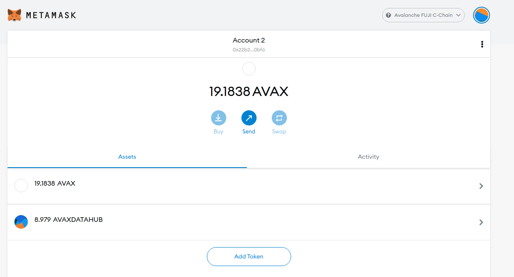

# Introduction

Continuing with the theme of token transfers, in this tutorial we are going to learn how to programmatically transfer ERC-20 tokens from the Avalanche C-Chain to a Metamask wallet.

# Prerequisites

- [Create an Avalanche wallet](https://wallet.avax.network/create)
- [Fund your Avalanche wallet with the FUJI Faucet](https://docs.avax.network/build/tutorials/platform/fuji-workflow#get-a-drip-from-the-fuji-faucet)
- [Transfer FUJI Avax tokens from X-Chain to C-Chain](https://docs.avax.network/build/tutorials/platform/transfer-avax-between-x-chain-and-c-chain)
- Having an integrated development environment, such as [Visual Studio Code](https://code.visualstudio.com/download)
- Familiarity with the use of a DEX such as Pangolin and [the concept of token swap](https://www.youtube.com/watch?v=kNQp4t03lOQ)

# Requirements

- [NodeJS](https://nodejs.org/en)
- [Ethers](https://docs.ethers.io/v5/) , which you can install with `npm install ethers`
- Install [Metamask extension](https://metamask.io/download.html) in your browser.
- [Configure your Metamask to add Avalanche FUJI testnet](https://docs.avax.network/build/tutorials/smart-contracts/deploy-a-smart-contract-on-avalanche-using-remix-and-metamask#step-1-setting-up-metamask)

# Getting started

For the purpose of this tutorial, I have created an ERC-20 token named AVAXDATAHUB and created an AVAXDATAHUB - AVAX liquidity pool on [Pangolin](https://app.pangolin.exchange/#/swap) on the Fuji testnet. Pangolin is a decentralized exchange built on Avalanche and it is compatible with the Fuji testnet as well, for testing purposes.

We will go on Pangolin and swap AVAX for some AVAXDATAHUB tokens. The token contract address is `0x6089f3b5f97eCDc8d31f317C7b442580E4258ef7`.

Go on [Pangolin](https://app.pangolin.exchange/#/swap) and swap AVAX on your Metamask for some AVAXDATAHUB, as outlined in the image below.


After the swap, go back to Metamask, click on "Add Token" and type in the contract address as shown in the image below. Without manually adding the AVAXDATAHUB token, it will not show up on your Metamask.


The AVAXDATAHUB tokens you got from Pangolin should now show up on your Metamask wallet, as shown below (8.979 AVAXDATAHUB tokens).



For the sake of the tutorial, let's send some of those AVAXDATAHUB tokens from Metamask to your Avalanche private wallet. Refer to the image below if you are confused about how to do this.


In the image above, it is shown that 4 AVAXDATAHUB tokens have been sent to the C-Chain of the Avalanche wallet.

However, when logging into your Avalanche wallet, you will not be able to see the tokens yet.


In order to view those tokens, you have to add the token contract address.

Click on "Add Token" below the coin list of the wallet and type in the AVAXDATAHUB contract address, then the rest of the information should automatically be loaded, as shown in the image below.


Then, you should be able to see the tokens show up on your list, as shown in the image below.


What we have done up to this point has taught you that any ERC-20 token can be stored on the C-Chain of your Avalanche wallet.

## Transfer of ERC-20 tokens from C-Chain to ETH address

We are going to create a new file called `ERC20_fromC_to_ETH_address.js` in the root directory of your project. Once you create a .js file under the specified name, we will type in the following blocks of code in.

First, we need to import the `ethers` library to interact with the Avalanche C chain

```javascript
const { ethers } = require('ethers');
```

The mnemonic key from your AVAX wallet needs to go between the quotation marks below. This is later used to extract the C chain wallet address.

```javascript
const mnemonic = '';
```

The code below is pointing to AVAX mainnet.

```javascript
const provider = new ethers.providers.JsonRpcProvider(
  'https://api.avax-test.network/ext/bc/C/rpc',
);
```

With the mnemonic phrase provided earlier, we can extract the corresponding ETH wallet private key. With this, we can unlock the Avalanche C-Chain wallet and sign transactions, which is accomplished with the code below.

```javascript
const walletMnemonic = new ethers.Wallet.fromMnemonic(mnemonic);
const pvtKey = walletMnemonic.privateKey;
const wallet = new ethers.Wallet(pvtKey, provider);
```

Transferring tokens from one wallet to another is a transaction. In order to perform a transaction, certain information needs to be provided. The token address (also known as contract address) of the ERC-20 token (AVAXDATAHUB in this case) needs to be provided. So, we are going to store the contract address and the ticker below. The token ticker is not needed, but we are adding it for our own use. A lot of the token contract addresses for Avalanche can be found [here](https://github.com/pangolindex/tokenlists/blob/main/aeb.tokenlist.json).

```javascript
const tknAddr = '0x6089f3b5f97eCDc8d31f317C7b442580E4258ef7';
const token_name = 'AVAXDATAHUB';
```

Logically, we also need provide the destination address. Put the destination address between the quotation marks.

```javascript
const toAddr = '';
```

Another piece needed for issuing a transaction is what's called the ABI. The Contract Application Binary Interface (ABI) is the standard way to interact with contracts in the Ethereum ecosystem. The format of the ABI is provided [here](https://docs.ethers.io/v5/getting-started/#getting-started--contracts).

```javascript
const tknAbi = [
  // Some details about the token
  'function name() view returns (string)',
  'function symbol() view returns (string)',

  // Get the account balance
  'function balanceOf(address) view returns (uint)',

  // Send some of your tokens to someone else
  'function transfer(address to, uint amount)',

  // An event triggered whenever anyone transfers to someone else
  'event Transfer(address indexed from, address indexed to, uint amount)',
];
```

Although it is not necessary to print the AVAXDATAHUB balance of the destination wallet address to perform a transfer, we will show here how to read the balance of a certain token.

```javascript
const getBalance = async () => {
  // Create Contract object connected to provider
  const tknContract = new ethers.Contract(tknAddr, tknAbi, provider);

  // Get balance as BigNumber and convert to Number
  const balanceBigNum = await tknContract.balanceOf(toAddr);
  const balanceNum = Number(ethers.utils.formatEther(balanceBigNum));

  // Set precision and convert to string
  const precision = 4;
  const balanceStr = balanceNum.toFixed(precision).toString();

  return balanceStr;
};
```

Now, we are going to define the `sendToken` function, which will execute a transfer of 1 AVAXDATAHUB token from the C-Chain of the Avalanche wallet to the ETH destination address.

```javascript
const sendToken = async () => {
  if (provider === null || wallet === null) {
    console.error('Encountered null object, unable to send token.');
    return;
  }

  // Create Contract object connected to wallet
  const tknContract = new ethers.Contract(tknAddr, tknAbi, wallet);

  // Specify amount to send (e.g. 1 ERC20 token)
  const amt = ethers.utils.parseEther('1.0');

  // Send amount to destination
  const tx = tknContract.transfer(toAddr, amt);

  return tx;
};
```

Now that we have the functions to read the balance and execute a transfer, we are ready to implement them. The code below reads the balance before and after the transfer of 1 AVAXDATAHUB token.

```javascript
getBalance()
  .then(initBalance => {
    console.log('Initial destination balance: ', initBalance);

    // Send ERC20 token from AVAX wallet C-Chain to ETH address
    sendToken()
      .then(_tx => {
        console.log('Transfer successful!');
      })
      .catch(console.error);
  })
  .catch(console.error);
```

At this point, you have gone through the entire script.

The finished script should look as follows:

```javascript
const { ethers } = require('ethers');
const mnemonic = '';
const provider = new ethers.providers.JsonRpcProvider(
  'https://api.avax-test.network/ext/bc/C/rpc',
);

const walletMnemonic = new ethers.Wallet.fromMnemonic(mnemonic);
const pvtKey = walletMnemonic.privateKey;
const wallet = new ethers.Wallet(pvtKey, provider);

const tknAddr = '0x6089f3b5f97eCDc8d31f317C7b442580E4258ef7';
const token_name = 'AVAXDATAHUB';
const toAddr = '';

const tknAbi = [
  // Some details about the token
  'function name() view returns (string)',
  'function symbol() view returns (string)',

  // Get the account balance
  'function balanceOf(address) view returns (uint)',

  // Send some of your tokens to someone else
  'function transfer(address to, uint amount)',

  // An event triggered whenever anyone transfers to someone else
  'event Transfer(address indexed from, address indexed to, uint amount)',
];

const getBalance = async () => {
  // Create Contract object connected to provider
  const tknContract = new ethers.Contract(tknAddr, tknAbi, provider);

  // Get balance as BigNumber and convert to Number
  const balanceBigNum = await tknContract.balanceOf(toAddr);
  const balanceNum = Number(ethers.utils.formatEther(balanceBigNum));

  // Set precision and convert to string
  const precision = 4;
  const balanceStr = balanceNum.toFixed(precision).toString();

  return balanceStr;
};

const sendToken = async () => {
  if (provider === null || wallet === null) {
    console.error('Encountered null object, unable to send token.');
    return;
  }

  // Create Contract object connected to wallet
  const tknContract = new ethers.Contract(tknAddr, tknAbi, wallet);

  // Specify amount to send (e.g. 1 ERC20 token)
  const amt = ethers.utils.parseEther('1.0');

  // Send amount to destination
  const tx = tknContract.transfer(toAddr, amt);

  return tx;
};

getBalance()
  .then(initBalance => {
    console.log('Initial destination balance: ', initBalance);

    // Send ERC20 token from AVAX wallet C-Chain to ETH address
    sendToken()
      .then(_tx => {
        console.log('Transfer successful!');
      })
      .catch(console.error);
  })
  .catch(console.error);
```

To run the script `ERC20_fromC_to_ETH_address.js`, type `node ERC20_fromC_to_ETH_address.js` and run it in your terminal (node before the file name is the way to invoke the NodeJS runtime environment).

The output of the script in the terminal should look similar to what is shown below.


You can confirm the result by looking at the change of the balance on Metamask as well.

As you can see in the image below, the balance did change from 4.97 to 5.97.


# Troubleshooting

## Transaction Failure

If you have enough AVAX on the C-Chain but not enough AVAXDATAHUB token (or any ERC20 token that you intend to transfer), you may end up getting an error in the terminal. Such an error message would be as shown below.


Although the error message says something along the lines of gas cost estimate issues, the issue is not having sufficient balance of AVAXDATAHUB. Make sure that you have enough ERC20 token balance on the C-Chain of your AVAX wallet.

Conversely, if you have enough AVAXDATAHUB balance, but not enough AVAX token to pay for the transaction, the same error message is produced. Similarily, make sure that you have sufficient AVAX balance to pay for the transaction.

# Conclusion

This tutorial has taught you how to transfer ERC-20 tokens from the C-Chain to a Metamask wallet. Note that the C-Chain uses the Ethereum Virtual Machine and is compatible with all of the key Ethereum tools.

# About the Author

This tutorial was created by [Seongwoo Oh](https://github.com/blackwidoq). He is a student and an Avalanche novice.
