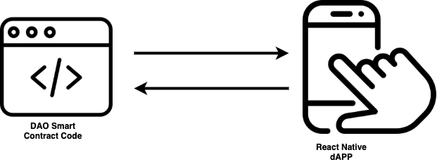
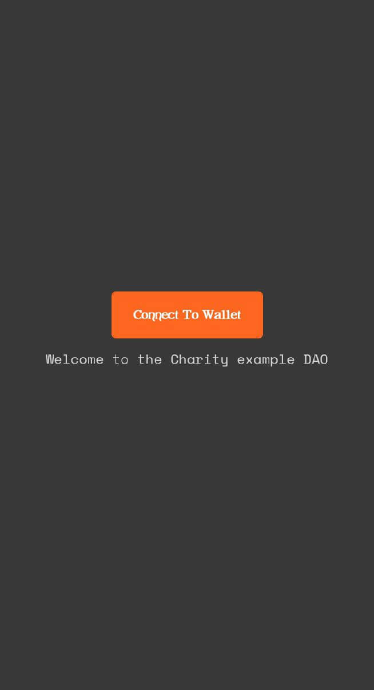
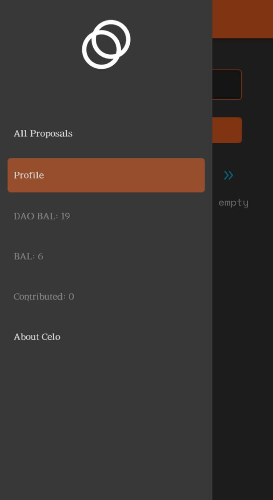
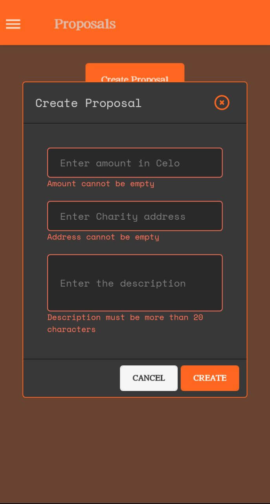
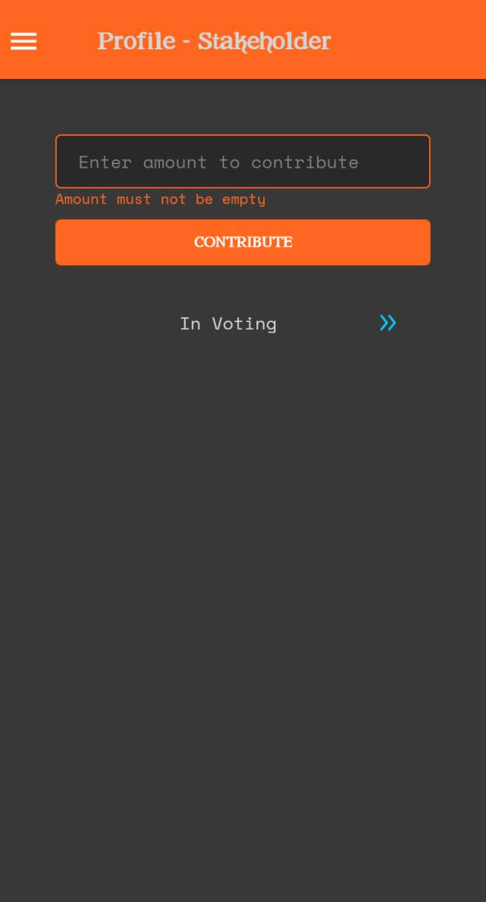
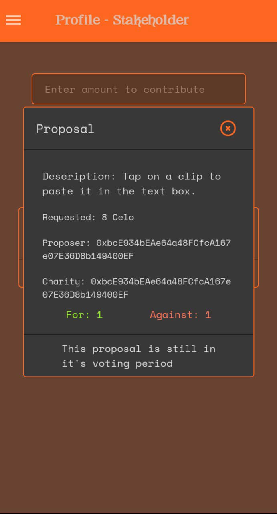

# Introduction

In this tutorial, we will build a functioning DAO (Distributed Autonomous Organization) by first writing the Solidity smart contract code which will be deployed on the Celo network and then building a React Native App to interact with the smart contract.

[Wikipedia](https://en.wikipedia.org/wiki/Decentralized_autonomous_organization) defines DAO (Decentralized Autonomous Organization) as an organization represented as rules encoded as a computer program that is transparent, controlled by the organization members, and not influenced by a central government. It decides which decision will be made by a decentralized organization.

In non-technical terms: DAOs are an effective and safe way to work with like-minded folks around the globe.

Think of DAOs like an internet-native business that’s collectively owned and managed by its members. They have built-in treasuries that no one has the authority to access without the approval of the group. Decisions are governed by proposals and voting to ensure everyone in the organization has a voice.

There’s no CEO who can authorize spending based on their own whims and no chance of a dodgy CFO manipulating the books. Everything is out in the open and the rules around spending are baked into the DAO via its code.

Read more [here](https://ethereum.org/en/dao/).

In this tutorial, you will learn how to build a functioning Charity DAO. The smart contract code is deployed on the Alfajores testnet of the Celo network. The contract allows its members to contribute to the DAO. Members can initiate charity proposals which Stakeholders will have to vote on within a specified period of time. After that time has elapsed, the DAO contract will disburse the pooled funds.

# Prerequisites

These tutorials assume that you have basic knowledge of Solidity, JavaScript/TypeScript, and also how to start a React Native App using [expo](https://expo.io/). It is also assumed that you have read the expo documentation and have basic knowledge of the Celo Wallet.

- [Expo](https://docs.expo.io/) is a framework and a platform for universal React applications.
- Learn about the Celo [mobile wallet](https://docs.celo.org/getting-started/alfajores-testnet/using-the-mobile-wallet).
- React Native using [expo](https://docs.expo.io/).
- The Celo dAppKit [documentation](https://docs.celo.org/developer-guide/dappkit/setup) is also going to be useful.
- Learn about [Redux](https://redux.js.org/introduction/getting-started) as well.

# Requirements

For this tutorial, following software needs to be installed:

- React Native
- NodeJS v12 and above
- [Truffle](https://www.trufflesuite.com/)
- The Alfajores Wallet, which will need to be funded using the [faucet](https://celo.org/developers/faucet)

We will cover the project in three parts:

- Solidity smart contracts on Celo
- Create a React Native app
- Bringing it together with Redux

We will begin by outlining a visual representation of the dApp, its features, and the various screens used in interacting with the smart contract.



# Features

The functionality of the dApp includes:

- Users connect their Celo Wallet to join the Charity DAO.
- Users send Celo tokens to the DAO to become Contributors.
- Contributors that have made 200 or more total contributions are automatically made Stakeholders.
- Only a Stakeholder of the DAO can vote on proposals.
- Contributors and/or Stakeholders can create a new proposal.
- A newly created proposal has an ending date, when voting will conclude.
- Stakeholders can upvote or downvote a proposal.
- Once a Proposal's expiry date passes, a Stakeholder then pays out the requested amount to the specified Charity.

Writing the DAO Smart Contract in Solidity, where we will go over the methods used.

Building the React Native App, in which we show you how to quickly put together a mobile app interface.

Connecting the React Native App to the Smart Contract using Redux, which brings it all together and allows our mobile dApp to utilize Celo efficiently.

# Writing the DAO Smart Contract in Solidity

In this tutorial, we are going to build the foundations of a functional DAO by writing the smart contract.

The smart contract is written using the [Solidity programming language](https://docs.soliditylang.org/en/v0.8.7/). Solidity is used on Ethereum as well as other Ethereum Virtual Machine (EVM) compatible blockchains like Celo.

## Initial Setup

The first task is to initialize a basic Solidity project using Truffle. Most commonly, an empty directory somewhere under the users home directory is a good place to create the project files. Running the command `truffle init` in an empty directory will install the default files for the project.

The terminal output from `truffle init` (the project files will be copied to the directory where you run the command):

```text
Starting init...
================

> Copying project files to /Users/username/CeloDao

Init successful, sweet!

Try our scaffold commands to get started:
  $ truffle create contract YourContractName # scaffold a contract
  $ truffle create test YourTestName         # scaffold a test

http://trufflesuite.com/docs
```

## Overview

Here is an look at the full code for the DAO contract, we’ll go over the different functions below to look at what they do and why they are needed.

```javascript
// SPDX-License-Identifier: MIT
pragma solidity ^0.8.0;

import "@openzeppelin/contracts/access/AccessControl.sol";
import "@openzeppelin/contracts/security/ReentrancyGuard.sol";

contract CharloDAO is ReentrancyGuard, AccessControl {
    bytes32 public constant CONTRIBUTOR_ROLE = keccak256("CONTRIBUTOR");
    bytes32 public constant STAKEHOLDER_ROLE = keccak256("STAKEHOLDER");
    uint32 constant minimumVotingPeriod = 1 weeks;
    uint256 numOfProposals;

    struct CharityProposal {
        uint256 id;
        uint256 amount;
        uint256 livePeriod;
        uint256 votesFor;
        uint256 votesAgainst;
        string description;
        bool votingPassed;
        bool paid;
        address payable charityAddress;
        address proposer;
        address paidBy;
    }

    mapping(uint256 => CharityProposal) private charityProposals;
    mapping(address => uint256[]) private stakeholderVotes;
    mapping(address => uint256) private contributors;
    mapping(address => uint256) private stakeholders;

    event ContributionReceived(address indexed fromAddress, uint256 amount);
    event NewCharityProposal(address indexed proposer, uint256 amount);
    event PaymentTransfered(
        address indexed stakeholder,
        address indexed charityAddress,
        uint256 amount
    );

    modifier onlyStakeholder(string memory message) {
        require(hasRole(STAKEHOLDER_ROLE, msg.sender), message);
        _;
    }

    modifier onlyContributor(string memory message) {
        require(hasRole(CONTRIBUTOR_ROLE, msg.sender), message);
        _;
    }

    function createProposal(
        string calldata description,
        address charityAddress,
        uint256 amount
    )
        external
        onlyStakeholder("Only stakeholders are allowed to create proposals")
    {
        uint256 proposalId = numOfProposals++;
        CharityProposal storage proposal = charityProposals[proposalId];
        proposal.id = proposalId;
        proposal.proposer = payable(msg.sender);
        proposal.description = description;
        proposal.charityAddress = payable(charityAddress);
        proposal.amount = amount;
        proposal.livePeriod = block.timestamp + minimumVotingPeriod;

        emit NewCharityProposal(msg.sender, amount);
    }

    function vote(uint256 proposalId, bool supportProposal)
        external
        onlyStakeholder("Only stakeholders are allowed to vote")
    {
        CharityProposal storage charityProposal = charityProposals[proposalId];

        votable(charityProposal);

        if (supportProposal) charityProposal.votesFor++;
        else charityProposal.votesAgainst++;

        stakeholderVotes[msg.sender].push(charityProposal.id);
    }

    function votable(CharityProposal storage charityProposal) private {
        if (
            charityProposal.votingPassed ||
            charityProposal.livePeriod <= block.timestamp
        ) {
            charityProposal.votingPassed = true;
            revert("Voting period has passed on this proposal");
        }

        uint256[] memory tempVotes = stakeholderVotes[msg.sender];
        for (uint256 votes = 0; votes < tempVotes.length; votes++) {
            if (charityProposal.id == tempVotes[votes])
                revert("This stakeholder already voted on this proposal");
        }
    }

    function payCharity(uint256 proposalId)
        external
        onlyStakeholder("Only stakeholders are allowed to make payments")
    {
        CharityProposal storage charityProposal = charityProposals[proposalId];

        if (charityProposal.paid)
            revert("Payment has been made to this charity");

        if (charityProposal.votesFor <= charityProposal.votesAgainst)
            revert(
                "The proposal does not have the required amount of votes to pass"
            );

        charityProposal.paid = true;
        charityProposal.paidBy = msg.sender;

        emit PaymentTransfered(
            msg.sender,
            charityProposal.charityAddress,
            charityProposal.amount
        );

        return charityProposal.charityAddress.transfer(charityProposal.amount);
    }

    receive() external payable {
        emit ContributionReceived(msg.sender, msg.value);
    }

    function makeStakeholder(uint256 amount) external {
        address account = msg.sender;
        uint256 amountContributed = amount;
        if (!hasRole(STAKEHOLDER_ROLE, account)) {
            uint256 totalContributed =
                contributors[account] + amountContributed;
            if (totalContributed >= 5 ether) {
                stakeholders[account] = totalContributed;
                contributors[account] += amountContributed;
                _setupRole(STAKEHOLDER_ROLE, account);
                _setupRole(CONTRIBUTOR_ROLE, account);
            } else {
                contributors[account] += amountContributed;
                _setupRole(CONTRIBUTOR_ROLE, account);
            }
        } else {
            contributors[account] += amountContributed;
            stakeholders[account] += amountContributed;
        }
    }

    function getProposals()
        public
        view
        returns (CharityProposal[] memory props)
    {
        props = new CharityProposal[](numOfProposals);

        for (uint256 index = 0; index < numOfProposals; index++) {
            props[index] = charityProposals[index];
        }
    }

    function getProposal(uint256 proposalId)
        public
        view
        returns (CharityProposal memory)
    {
        return charityProposals[proposalId];
    }

    function getStakeholderVotes()
        public
        view
        onlyStakeholder("User is not a stakeholder")
        returns (uint256[] memory)
    {
        return stakeholderVotes[msg.sender];
    }

    function getStakeholderBalance()
        public
        view
        onlyStakeholder("User is not a stakeholder")
        returns (uint256)
    {
        return stakeholders[msg.sender];
    }

    function isStakeholder() public view returns (bool) {
        return stakeholders[msg.sender] > 0;
    }

    function getContributorBalance()
        public
        view
        onlyContributor("User is not a contributor")
        returns (uint256)
    {
        return contributors[msg.sender];
    }

    function isContributor() public view returns (bool) {
        return contributors[msg.sender] > 0;
    }
}
```

Let’s go ahead and dissect the different parts of the Solidity smart contract.

```javascript
// SPDX-License-Identifier: MIT
pragma solidity ^0.8.0;
```

The opening line of a Solidity file should contain the [SPDX licence](https://spdx.org/licenses/) identifier of the relevant open source license - commonly this will be MIT or The Unlicense. The next line will specify the Solidity version needed to compile the contract, using the `pragma` [compiler directive](https://docs.soliditylang.org/en/v0.5.8/layout-of-source-files.html#version-pragma). Be aware of the [semantic versioning](https://semver.org/).

```javascript
import '@openzeppelin/contracts/access/AccessControl.sol';
import '@openzeppelin/contracts/security/ReentrancyGuard.sol';
```

We’ll be relying on [OpenZepellin's](https://openzeppelin.com/) ReentrancyGuard and AccessControl here so we should go ahead and import those. These are important security features and should not be overlooked.

```javascript
bytes32 public constant CONTRIBUTOR_ROLE = keccak256("CONTRIBUTOR");
bytes32 public constant STAKEHOLDER_ROLE = keccak256("STAKEHOLDER");
```

Users of the DAO will be of two types - Contributors and Stakeholders. We need to declare two constants here, which are the [keccak256 hash](https://docs.soliditylang.org/en/v0.8.6/units-and-global-variables.html#mathematical-and-cryptographic-functions) of the words themselves. These constants will be used later to register and differentiate users.

```javascript
uint32 constant minimumVotingPeriod = 1 weeks;
```

The `minimumVotingPeriod` variable holds the number of days a proposal can be voted on in UNIX time. The [time unit](https://docs.soliditylang.org/en/v0.8.6/units-and-global-variables.html#time-units) weeks is a suffix provided by Solidity, 1 weeks here translates to the total seconds of [UNIX time](https://en.wikipedia.org/wiki/Unix_time) a week from now. The value of UNIX time can be displayed with the command `date +%s.%N` in Linux. macOS users need to run `brew install coreutils` to enable microseconds display and use the command`gdate +%s.%N` instead.

```javascript
uint256 numOfProposals;
```

`numOfProposals` is incremented every time a new charity proposal is added. This lets us iterate through the charity proposals in the mapping data type, as Solidity doesn’t provide a way to step through mappings.

```javascript
struct CharityProposal {
    uint256 id;
    uint256 amount;
    uint256 livePeriod;
    uint256 votesFor;
    uint256 votesAgainst;
    string description;
    bool votingPassed;
    bool paid;
    address payable charityAddress;
    address proposer;
    address paidBy;
}
```

The `CharityProposal` struct definition holds the necessary data that makes up each proposal object.

```javascript
mapping(uint256 => CharityProposal) private charityProposals;
mapping(address => uint256[]) private stakeholderVotes;
mapping(address => uint256) private contributors;
mapping(address => uint256) private stakeholders;
```

There are four mappings used:

- `charityProposals` maps a uint256 value and a CharityProposal as key and value respectively. This holds the list of Proposals in the DAO. It uses the id of the Proposal as key and the Proposal itself as the value.
- `stakeholderVotes` maps the `address` of a Stakeholder to a list of the Proposals that address has voted on.
- `contributors` maps the Contributor addresses and the amounts they have sent into the DAO treasury.
- `stakeholders` maps the addresses and balances of Stakeholders.

```javascript
event ContributionReceived(address indexed fromAddress, uint256 amount);
event NewCharityProposal(address indexed proposer, uint256 amount);
event PaymentTransfered(
    address indexed stakeholder,
    address indexed charityAddress,
    uint256 amount
);
```

These events are emitted for every new proposal, new contribution and new payment transfer. This is for logging purposes and to make filtering these events simpler. The indexed attribute causes the respective arguments to be treated as log topics instead of data.

```javascript
modifier onlyStakeholder(string memory message) {
    require(hasRole(STAKEHOLDER_ROLE, msg.sender), message);
    _;
}

modifier onlyContributor(string memory message) {
    require(hasRole(CONTRIBUTOR_ROLE, msg.sender), message);
    _;
}
```

These two modifiers will be used to control access to specific functions.

```javascript
function createProposal(
    string calldata description,
    address charityAddress,
    uint256 amount
)
    external
    onlyStakeholder("Only stakeholders are allowed to create proposals")
{
    uint256 proposalId = numOfProposals++;
    CharityProposal storage proposal = charityProposals[proposalId];
    proposal.id = proposalId;
    proposal.proposer = payable(msg.sender);
    proposal.description = description;
    proposal.charityAddress = payable(charityAddress);
    proposal.amount = amount;
    proposal.livePeriod = block.timestamp + minimumVotingPeriod;
    emit NewCharityProposal(msg.sender, amount);
}
```

`createProposal` is a function that interacts with blockchain state, which we can call in our dApp to add a new Proposal, it accepts three parameters: `description`, `charityAddress` and `amount`.

The function visibility is specified as external for economy of gas, which is also why the description will be contained in `calldata`. Memory allocation is expensive in terms of gas used, while reading from calldata is not. Also notice the `onlyStakeholder` modifier in use here, only accounts listed as Stakeholders can successfully call this function.

First a new identifier is set - the `proposalId`, which will be the existing number of proposals incremented by one. Next, we declare a proposal variable of the CharityProposal type using the storage keyword to make sure the state variable is maintained, then assign its reference to one of the buckets in the `charityProposals` mapping. The remainder of the function assigns the necessary values to their counterparts in the CharityProposal object. payable() helps us by [converting the address literal](https://docs.soliditylang.org/en/v0.8.6/080-breaking-changes.html?highlight=payable#new-restrictions) into a payable address.

Finally, the `NewCharityProposal` event is emitted.

```javascript
function vote(uint256 proposalId, bool supportProposal)
    external
    onlyStakeholder("Only stakeholders are allowed to vote")
{
    CharityProposal storage charityProposal = charityProposals[proposalId];


    votable(charityProposal);


    if (supportProposal) charityProposal.votesFor++;
    else charityProposal.votesAgainst++;


    stakeholderVotes[msg.sender].push(charityProposal.id);
}
```

The `vote()` function is an external function that allows voting on proposals when called with the proposal’s id and a second true/false argument depending on whether the vote is in support or against the proposal.

```javascript
function votable(CharityProposal storage charityProposal) private {
    if (
        charityProposal.votingPassed ||
        charityProposal.livePeriod <= block.timestamp
    ) {
        charityProposal.votingPassed = true;
        revert("Voting period has passed on this proposal");
    }


    uint256[] memory tempVotes = stakeholderVotes[msg.sender];
    for (uint256 votes = 0; votes < tempVotes.length; votes++) {
        if (charityProposal.id == tempVotes[votes])
            revert("This stakeholder already voted on this proposal");
    }
}
```

`votable()` is called within the `vote()` function. It is used to verify if a proposal can be voted on.

```javascript
function payCharity(uint256 proposalId)
    external
    onlyStakeholder("Only stakeholders are allowed to make payments")
{
    CharityProposal storage charityProposal = charityProposals[proposalId];
    if (charityProposal.paid)
        revert("Payment has been made to this charity");
    if (charityProposal.votesFor <= charityProposal.votesAgainst)
        revert(
            "The proposal does not have the required amount of votes to pass"
        );
    charityProposal.paid = true;
    charityProposal.paidBy = msg.sender;
    emit PaymentTransfered(
        msg.sender,
        charityProposal.charityAddress,
        charityProposal.amount
    );
    return charityProposal.charityAddress.transfer(charityProposal.amount);
}
```

`payCharity` handles payment to the specified address after the voting period of the proposal has ended. It takes the proposalId as an argument and retreives that proposal from the mapping. We check whether the charity has already been paid or if the number of supporting votes is less than those against. If either of these conditions are true then the transaction will be reverted with an error message. If not, the paid property of the proposal is set true, the address of the stakeholder making the payment is set, and finally emit the PaymentTransfered event for logging purposes and transfer the payment to the charity address.

```javascript
receive() external payable {
        emit ContributionReceived(msg.sender, msg.value);
}
```

This is needed so the contract can receive contributions without throwing an error. The function emits the ContributionReceived event previously declared in the upper scope.

```javascript
function makeStakeholder(uint256 amount) external {
    address account = msg.sender;
    uint256 amountContributed = amount;
    if (!hasRole(STAKEHOLDER_ROLE, account)) {
        uint256 totalContributed =
            contributors[account] + amountContributed;
        if (totalContributed >= 5 ether) {
            stakeholders[account] = totalContributed;
            contributors[account] += amountContributed;
            _setupRole(STAKEHOLDER_ROLE, account);
            _setupRole(CONTRIBUTOR_ROLE, account);
        } else {
            contributors[account] += amountContributed;
            _setupRole(CONTRIBUTOR_ROLE, account);
        }
    } else {
        contributors[account] += amountContributed;
        stakeholders[account] += amountContributed;
    }
}
```

This function adds a new Stakeholder to the DAO if the total contribution of the user is more than or equal to 5 Celo. If the total contribution is less than 5 then the user is made a Contributor instead.

```javascript
function getProposals() public view returns (CharityProposal[] memory props) {
    props = new CharityProposal[](numOfProposals);

    for (uint256 index = 0; index < numOfProposals; index++) {
     props[index] = charityProposals[index];
    }
}
```

We are returning a list of all the proposals in the DAO here. Solidity doesn’t have iterators for the mapping type so we declare a fixed-size array, used the `numOfProposals` variable as the upper limit of our loop. For each iteration, we assign the proposal at the current index to the index in our fixed-size array then return the array. Essentially, this fetches our proposals and returns them as an array.

```javascript
function getProposal(uint256 proposalId)
        public
        view
        returns (CharityProposal memory)
{
    return charityProposals[proposalId];
}
```

The `getProposal()` function takes a proposal id as an argument to get the proposal from the mapping, then return the proposal.

```javascript
function getStakeholderVotes()
        public
        view
        onlyStakeholder("User is not a stakeholder")
        returns (uint256[] memory)
{
    return stakeholderVotes[msg.sender];
}
```

The `getStakeholderVotes()` gets and returns a list containing the id of all the proposals that a particular stakeholder has voted on.

```javascript
function getStakeholderBalance()
        public
        view
        onlyStakeholder("User is not a stakeholder")
        returns (uint256)
{
    return stakeholders[msg.sender];
}
```

As the name suggests, the `getStakeholderBalance()` functions return the total amount of contribution a stakeholder has contributed to the DAO.

```javascript
function isStakeholder() public view returns (bool) {
    return stakeholders[msg.sender] > 0;
}
```

The `isStakeholder()` function returns true/false depending on whether the caller is a stakeholder or not

```javascript
function getContributorBalance()
        public
        view
        onlyContributor("User is not a contributor")
        returns (uint256)
{
    return contributors[msg.sender];
}
```

As the name suggests, this function returns the total balance of a contributor.

```javascript
function isContributor() public view returns (bool) {
    return contributors[msg.sender] > 0;
}
```

The `isContributor()` function returns true/false depending on whether the caller is a contributor or not.

## Next Steps

Now that we have written the smart contract code, the next step is to build the React Native App!

# Building the React Native App

Note: If you have never built an app using React Native to connect to the Celo wallet before, you can follow the guide [here](https://learn.figment.io/tutorials/how-to-successfully-connect-to-a-celo-wallet-with-a-react-native-dapp#project-setup).

In this tutorial, we will continue building a functional DAO by making a React Native app to communicate with the Solidity smart contract on Celo. We will make use of the [UI Kitten](https://akveo.github.io/react-native-ui-kitten/) library to style the dApp.

This is an outline of the Pages and Components that make up the dApp. The next section on Redux will be a deep dive into how to connect the dApp to the smart contract.

First, we will outline the UI and then write out the code for building each of the views:

- Welcome Screen (Connect Wallet)
- Side Menu Navigation
- All Proposals Screen
- Votable Proposals \[List]
- Create Proposal \[Modal, Form]
- View Proposal \[Modal]
- Upvote \[Button]
- Downvote \[Button]
- Profile Screen
- Contribute to the DAO \[Modal, Form]
- Proposals voted on \[List]
- View Proposal \[Modal]
- Payable Proposals \[List]
- View Proposal \[Modal]
- Make Payment \[Button]
- Paid Proposals \[List]
- View Proposal \[Modal]
- About

At this stage of making the dApp, we will outline how the actions of the smart contract are carried out with a connection to the dApp. First, let’s put the code in place for all the screens. The screens at this point do not yet interact with the smart contract.

## Initialize the dApp

This section assumes that you already know how to initialize and start a React Native App. This will serve as a high level overview on how to start your React Native app.

## Setting up UI Kitten

UI Kitten is a customizable React Native UI Library based on Eva Design System specifications, it is a framework of UI components that can easily be added to a React Native app.\
Initializing the app with the `expo init` command and the blank managed workflow as the selected template sets up a basic @ui-kitten/components configuration for us. If this does not work for you, install UI Kitten using the following command instead:

```text
yarn add @ui-kitten/components @eva-design/eva react-native-svg
```

Once the installation process is complete, you can use any of the components available in the UI Kitten library. First, we have to configure the UI Kitten library at the root of the application, before its components can be called anywhere in the dApp.

Open the `App.js` file and wrap the project in UI Kitten’s `ApplicationProvider` module and also add the `IconRegistry` module so we can use @ui-kitten/eva-icons Icons.

```javascript
// App.js
import './global';
import * as eva from '@eva-design/eva';
import { ApplicationProvider, IconRegistry } from '@ui-kitten/components';
import { EvaIconsPack } from '@ui-kitten/eva-icons';
import { StatusBar } from 'expo-status-bar';
import React from 'react';
import { Navigation } from './navigation';

export default function App() {
  const isLoadingComplete = useCachedResources();
  const colorScheme = useColorScheme();

  if (!isLoadingComplete) {
    return null;
  } else {
    return (
      <ApplicationProvider
        {...eva}
        theme={{ ...eva.dark, ...theme }}
        customMapping={mapping}
      >
        <IconRegistry icons={EvaIconsPack} />
        <Navigation coloScheme={colorScheme} />
        <StatusBar />
      </ApplicationProvider>
    );
  }
}
```

We are making use of the eva dark theme and we have configured `IconRegistry` to use the `EvaIconsPack`. Now that we have UI Kitten set up, we can style our dApp as we build. Now let’s go ahead and build out the screens!

## Screens

### Welcome Screen

The Welcome screen is the first thing users will see when loading the dApp. The UI is only one button which the user must click to connect to the DAO. Since our app is making use of the Celo protocol, we will have to connect to the Alfajores/Valora wallet.



Below is the code needed to create the **Welcome** screen:

```jsx
export const WelcomePage = ({ navigation }) => {
  return (
    <Layout style={styles.container}>
      <Button
        raised="true"
        accessoryLeft={profile.loading ? loadingIndicator : ''}
      >
        Connect To Wallet
      </Button>
      <Text style={styles.text}>Welcome to the Charity DAO example</Text>
    </Layout>
  );
};

const styles = StyleSheet.create({
  container: {
    flex: 1,
    alignItems: 'center',
    justifyContent: 'center',
    padding: 20,
  },
  text: {
    paddingTop: 10,
  },
  indicator: {
    justifyContent: 'center',
    alignItems: 'center',
  },
});
```

> Notice anything missing? Don't worry, we will add the functionality to connect this screen to the Wallet and carry out user actions in the Redux tutorial.

### Side Menu Navigation

This is based on React Navigation’s Drawer Navigation. To use the React Drawer navigation, you have to install and set up React Navigation following the instructions in the [docs](https://reactnavigation.org/docs/getting-started). The instructions for designing a Drawer based navigation can be found [here](https://reactnavigation.org/docs/drawer-based-navigation).



### All Proposals Screen

The All Proposals screen contains all the DAO proposals that have been created. The UI is a button at the top which will open a modal window containing a form to be filled out by the user creating the proposal.


This is the code to create the All Proposals screen:

```javascript
export const ProposalsPage = ({ navigation }) => {
  const theme = useTheme();
  const chaFooter = (props, info) => {
    return (
      <View
        {...props}
        style={{
          ...props.style,
          flexDirection: 'row',
          justifyContent: 'space-evenly',
          padding: 8,
        }}
      >
        <Text style={{ color: theme['color-info-default'] }}>
          For: {info.for}
        </Text>
        <Text style={{ color: theme['color-danger-default'] }}>
          Against: {info.against}
        </Text>
      </View>
    );
  };
  const cardItem = info => {
    return (
      <Card
        style={{
          borderColor: theme['color-primary-default'],
          marginVertical: 4,
        }}
        footer={props => chaFooter(props, { for: 10, against: 3 })}
      >
        <Text category="s2" numberOfLines={4} ellipsizeMode="tail">
          {info.item.desc}
        </Text>
      </Card>
    );
  };

  return (
    <SafeAreaView style={{ flex: 1 }}>
      <Layout style={{ flex: 1, padding: 16 }}>
        <Card
          disabled="true"
          style={{
            borderColor: theme['color-primary-default'],
            margin: 8,
            padding: 8,
          }}
        >
          <Button size="medium">Create Proposal</Button>
        </Card>
        <List
          contentContainerStyle={{ paddingHorizontal: 8, paddingVertical: 4 }}
          renderItem={cardItem}
        />
      </Layout>
    </SafeAreaView>
  );
};
```

### Create Proposal Modal

The Create Proposal modal component is imported into the Proposals page and is displayed when the Create proposal Button is clicked.



Below is the code snippet to create the modal:

```javascript
export const CreateProposalModal = ({ setVisible, visible }) => {
  const theme = useTheme();
  const cardHeader = props => {
    return (
      <View
        {...props}
        style={{
          ...props.style,
          flex: 1,
          flexDirection: 'row',
          justifyContent: 'space-between',
        }}
      >
        <Text style={{ margin: 16 }} category="h6">
          Create Proposal
        </Text>
        <Button
          size="large"
          onPress={() => setVisible(false)}
          appearance="ghost"
          accessoryLeft={closeIcon}
        />
      </View>
    );
  };
  const cardFooter = props => {
    return (
      <View
        {...props}
        style={{
          ...props.style,
          flexDirection: 'row',
          justifyContent: 'flex-end',
          padding: 8,
        }}
      >
        <Button
          style={{ marginHorizontal: 2 }}
          size="small"
          status="basic"
          onPress={() => setVisible(false)}
        >
          CANCEL
        </Button>
        <Button style={{ marginHorizontal: 2 }} size="small">
          CREATE
        </Button>
      </View>
    );
  };

  return (
    <Modal
      visible={visible}
      backdropStyle={{
        backgroundColor: theme['color-primary-transparent-300'],
      }}
      onBackdropPress={() => setVisible(false)}
    >
      <Card
        disabled="true"
        style={{
          flex: 1,
          borderColor: theme['color-primary-default'],
          margin: 2,
        }}
        header={cardHeader}
        footer={cardFooter}
      >
        <Layout style={{ flex: 1, padding: 8, width: 250 }}>
          <Input
            size="medium"
            style={{ marginVertical: 8 }}
            status="primary"
            keyboardType="numeric"
            placeholder="Enter amount"
          />
          <Input
            size="medium"
            style={{ marginVertical: 8 }}
            status="primary"
            placeholder="Enter Charity address"
          />
          <Input
            multiline={true}
            textStyle={{ minHeight: 64 }}
            style={{ marginVertical: 8 }}
            status="primary"
            placeholder="Enter the description"
          />
        </Layout>
      </Card>
    </Modal>
  );
};

const closeIcon = props => {
  return <Icon {...props} name="close-circle-outline" />;
};
```

Before we move on to the Create Proposal screen, we can add data input and validation logic for the input fields on the form.

Add the following code snippet after `useTheme()`;

```javascript
const descriptionInput = useInputState('Description');
const charityAddressInput = useInputState('Address');
const amountInput = useInputState('Amount');
const addItem = () => {
  if (
    amountInput.value == '' ||
    descriptionInput.value.length < 20 ||
    charityAddressInput.value == ''
  ) {
    return;
  }
  let newData = [...data];
  newData.push({
    amount: amountInput.value,
    desc: descriptionInput.value,
    chaAdd: charityAddressInput.value,
  });
  amountInput.setValue('');
  descriptionInput.setValue('');
  charityAddressInput.setValue('');
  setData(newData);
  setVisible(false);
};
```

On the Create Button, we can call the `addItem` function in the Button's `onPress` property to add an item.

```javascript
<Button onPress={addItem}>CREATE</Button>
```

On the input fields, pass the relevant variable using [spread syntax](https://developer.mozilla.org/en-US/docs/Web/JavaScript/Reference/Operators/Spread_syntax) to set the Input items:

```javascript
<Input
     ...
     placeholder='Enter amount'
     {...amountInput}/>
<
     ...
     placeholder='Enter Charity address'
     {...charityAddressInput}/>
 <Input
      ...
      placeholder='Enter the description'
      {...descriptionInput}/>
```

The `useInputState()` method which the input fields were assigned is used for Data Validation. Add the code below after the close of the return block, before the `closeIcon()` function:

```javascript
const useInputState = (name, initialValue = '') => {
  const [value, setValue] = React.useState(initialValue);

  let caption;
  if (value === '') {
    caption = `${name} cannot be empty`;
  }

  if (name === 'Description' && value.length < 20) {
    caption = `${name} must be more than 20 characters`;
  }

  return { value, onChangeText: setValue, caption, setValue };
};
```

After creating the Modal, we can then import it into the Create Proposal screen and establish the state of the modal, by adding states to toggle between `“visible”` and `“hidden”`. Here is how:

First import the `CreateProposal` module into the Proposal page:

```javascript
import { CreateProposalModal, ViewProposalModal } from '../components';
```

Using React's [useState hook](https://reactjs.org/docs/hooks-state.html), the state of the Create modal can be set to visible when it is clicked.

```javascript
const [createVisible, setCreateVisible] = React.useState(false);
```

In the return statement inside of `Layout` add the CreateProposalModal Component and set the state of the component.

```javascript
<CreateProposalModal setVisible={setCreateVisible} visible={createVisible} />
```

### Profile Screen

The Profile screen contains an input field through which users can contribute some Celo tokens (at least 5 Celo) to become a Contributor. Below are the static elements of the Profile screen. We will be adding the user actions in the Redux tutorial ahead.



The Profile screen is completely styled and makes use of cards for the different sections. Examine the code below:

```javascript
import * as React from 'react';
import { View, SafeAreaView } from 'react-native';
import {
  Button,
  Card,
  Input,
  Layout,
  List,
  useTheme,
  Text,
  Spinner,
  ViewPager,
  Icon,
} from '@ui-kitten/components';

export const ProfilePage = ({ navigation }) => {
  const theme = useTheme();
  const cardItem = info => {
    return (
      <Card
        style={{
          borderColor: theme['color-primary-default'],
          marginVertical: 4,
        }}
        footer={props =>
          cardFooter(props, { for: info.item[3], against: info.item[4] })
        }
        onPress={() => getProposal(info.item[0])}
      >
        <Text category="s2" numberOfLines={4} ellipsizeMode="tail">
          {info.item[5]}
        </Text>
      </Card>
    );
  };

  const cardFooter = (props, info) => {
    return (
      <View
        {...props}
        style={{
          ...props.style,
          flexDirection: 'row',
          justifyContent: 'space-evenly',
          padding: 8,
        }}
      >
        <Text style={{ color: theme['color-info-default'] }}>
          For: {info.for}
        </Text>
        <Text style={{ color: theme['color-danger-default'] }}>
          Against: {info.against}
        </Text>
      </View>
    );
  };

  const page = () => {
    return (
      <>
        <Layout
          style={{ flexDirection: 'row', justifyContent: 'space-around' }}
        >
          <Button
            appearance="ghost"
            status="info"
            accessoryLeft={leftIcon}
            onPress={handleLeftClick}
          />
          <Text style={{ alignSelf: 'center', marginVertical: 16 }}>
            {selectedIndex == 0
              ? 'In Voting'
              : selectedIndex == 1
              ? 'Payable Proposals'
              : 'Paid Proposals'}
          </Text>
          <Button
            appearance="ghost"
            status="info"
            accessoryRight={rightIcon}
            onPress={handleRightClick}
          />
        </Layout>
        {profile.loading || !profile.isStakeholder ? (
          <Text style={{ backgroundColor: theme['color-basic-800'] }}>
            {selectedIndex == 0
              ? 'The list of "in voting" proposal is empty'
              : selectedIndex == 1
              ? 'The list of "payable" proposal is empty'
              : 'The list of "paid" proposal is empty'}
          </Text>
        ) : (
          <List
            style={{ backgroundColor: theme['color-basic-800'] }}
            contentContainerStyle={{ paddingHorizontal: 8, paddingVertical: 4 }}
            data={
              selectedIndex == 0
                ? inVotingVotes
                : selectedIndex == 1
                ? payableVotes
                : paidVotes
            }
            renderItem={cardItem}
          />
        )}
      </>
    );
  };

  const rightIcon = props => {
    if (selectedIndex != 2) {
      return <Icon {...props} name="arrowhead-right-outline" />;
    }

    return null;
  };

  const leftIcon = props => {
    if (selectedIndex != 0) {
      return <Icon {...props} name="arrowhead-left-outline" />;
    }

    return null;
  };

  return (
    <SafeAreaView style={{ flex: 1 }}>
      <Layout style={{ flex: 1, padding: 16 }}>
        <Card
          style={{
            flexDirection: 'column',
            justifyContent: 'space-between',
            borderColor: theme['color-basic-800'],
          }}
        >
          <Input
            style={{ marginVertical: 8 }}
            size="medium"
            status="primary"
            keyboardType="numeric"
            placeholder="Enter amount to contribute"
            {...amountInput}
          />

          <Button
            size="small"
            onPress={contribute}
            accessoryLeft={profile.loading ? loadingIndicator : ''}
          >
            CONTRIBUTE
          </Button>
        </Card>

        <ViewPager
          style={{ height: 480 }}
          selectedIndex={selectedIndex}
          shouldLoadComponent={shouldLoadComponent}
          onSelect={setSelectedIndex}
        >
          <Layout level="2">{page()}</Layout>

          <Layout level="2">{page()}</Layout>

          <Layout level="2">{page()}</Layout>
        </ViewPager>
      </Layout>
    </SafeAreaView>
  );
};
```

### View Proposal Modal

The View Proposal modal component is imported into the Profile page and is displayed when a Proposal Card is clicked.



Below is the code snippet to create the modal:

```javascript
import * as React from 'react';
import { View } from 'react-native';
import {
  Button,
  Card,
  Icon,
  Input,
  Layout,
  Modal,
  Text,
  useTheme,
  Spinner,
} from '@ui-kitten/components';

export const ViewProposalModal = ({ setVisible, visible }) => {
  const theme = useTheme();
  const cardHeader = props => {
    return (
      <View
        {...props}
        style={{
          ...props.style,
          flex: 1,
          flexDirection: 'row',
          justifyContent: 'space-between',
        }}
      >
        <Text style={{ margin: 16 }} category="h6">
          Proposal
        </Text>
        <Button
          size="large"
          onPress={() => setVisible(false)}
          appearance="ghost"
          accessoryLeft={closeIcon}
        />
      </View>
    );
  };

  const cardFooter = props => {
    return (
      <View
        {...props}
        style={{
          ...props.style,
          flexDirection: 'row',
          justifyContent: 'space-around',
          padding: 8,
        }}
      >
        <Button style={{ marginHorizontal: 2 }} size="small" status="success">
          UPVOTE
        </Button>
        <Button style={{ marginHorizontal: 2 }} size="small" status="warning">
          DOWNVOTE
        </Button>
      </View>
    );
  };

  return (
    <Modal
      visible={visible}
      backdropStyle={{
        backgroundColor: theme['color-primary-transparent-300'],
      }}
      onBackdropPress={() => setVisible(false)}
    >
      <Card
        disabled="true"
        style={{
          flex: 1,
          borderColor: theme['color-primary-default'],
          margin: 2,
        }}
        header={cardHeader}
        footer={cardFooter}
      >
        <>
          <Layout style={{ flex: 1, width: 250 }}>
            <Text style={{ marginVertical: 8 }}>Description: </Text>
            <Text style={{ marginVertical: 8 }} category="p2">
              Requested: Celo
            </Text>
            <Text style={{ marginVertical: 8 }} category="p2">
              Proposer:{' '}
            </Text>
            <Text style={{ marginVertical: 8 }} category="p2">
              Charity:{' '}
            </Text>
          </Layout>
          <Layout
            style={{
              flex: 1,
              flexDirection: 'row',
              justifyContent: 'space-around',
            }}
          >
            <Text style={{ color: theme['color-success-default'] }}>For: </Text>
            <Text style={{ color: theme['color-danger-default'] }}>
              Against:{' '}
            </Text>
          </Layout>
        </>
      </Card>
    </Modal>
  );
};

const closeIcon = props => {
  return <Icon {...props} name="close-circle-outline" />;
};
```

## Next Steps

All of our app pages are now complete!

To be able to interact with the smart contract on Celo, we will use Redux actions and reducers to connect with the functions in the smart contract. The next tutorial covers Redux and how to make these connections between actions performed by users and the smart contract functionality.

# Bringing it together with Redux

In this tutorial, we will complete our DAO and its dApp interface, writing the Redux code to connect our React Native app to the smart contract on Celo. We will look into how to connect the mobile app to the smart contract on the Celo network. This section contains Redux action creators for connecting to the contract, contributing to the DAO and so forth.

If you are unfamiliar with Redux, please read their [Getting Started](https://redux.js.org/introduction/getting-started) guide.

Here’s the action creator to contribute some certain amount of Celo to the dApp:

```javascript
function contribute(amount) {
  return async dispatch => {
    dispatch(request());

    try {
      const goldToken = await kit.contracts.getGoldToken();
      const contractAddress = await (await contractInstance).options.address;
      const requestedAmount = web3.utils.toWei(amount, 'ether');
      const txObject = goldToken.transfer(contractAddress, requestedAmount).txo;

      const requestId = 'contribution';
      const dappName = 'Charlo';
      const callback = Linking.makeUrl('ProfilePage');

      requestTxSig(
        kit,
        [
          {
            tx: txObject,
            from: kit.defaultAccount,
            to: goldToken.contract.options.address,
            feeCurrency: FeeCurrency.cUSD,
          },
        ],
        { requestId, dappName, callback },
      );

      const response = await waitForSignedTxs(requestId);
      const rawTx = response.rawTxs[0];

      const tx = await kit.connection.sendSignedTransaction(rawTx);
      const receipt = await tx.waitReceipt();

      receipt.daoBalance = web3.utils.fromWei(
        (await goldToken.balanceOf(contractAddress)).toString(),
        'ether',
      );
      receipt.userBalance = web3.utils.fromWei(
        (await goldToken.balanceOf(kit.defaultAccount)).toString(),
        'ether',
      );

      dispatch(success(receipt));
      dispatch(alertActions.success('Contribution successful'));
    } catch (err) {
      dispatch(alertActions.error(err.toString()));
      dispatch(failed());
    }
  };

  function request() {
    return { type: profileConstants.CONTRIBUTION_REQUEST };
  }
  function success(res) {
    return { type: profileConstants.CONTRIBUTION_SUCCESS, res };
  }
  function failed() {
    return { type: profileConstants.CONTRIBUTION_FAILED };
  }
}
```

This is an asynchronous action that is made up of multiple sub actions. This is because we have to make an http request and wait for the response before completing. Async actions typically dispatch a request action before performing an async task (e.g. an http request), and then dispatch a success or error action based on the result of the async task.

For example the `contribute()` action creator performs the following steps:

- Dispatches a `CONTRIBUTION_REQUEST` action with `dispatch(request());`
- Wire up the necessary calls to setup the transaction
- Sends the transaction with an async call to `sendSignedTransaction(rawTx)`
- Dispatches a `CONTRIBUTION_SUCCESS` action with `dispatch(success(receipt));` if contribution was successful, or dispatches a `CONTRIBUTION_FAILED` action with `dispatch(failed());` if login failed.

To keep the code tidy, sub action creators are nested within each async action creator function.\
For example the `contribute()` function contains 3 nested action creator functions for `request()`, `success()` and `failure()` that return the actions `CONTRIBUTION_REQUEST`, `CONTRIBUTION_SUCCESS` and `CONTRIBUTION_FAILURE` respectively.\
Putting the sub action creators into nested functions also allows us to give them standard names like request, success and failure without clashing with other function names because they only exist within the scope of the parent function.

All other action creators for this project follow the same process as the one explained above.

## Connecting Action Creators with The UI

<Hint type="info">
  Three dots ... on a line by themselves indicate the presence of other code
  which we have trimmed for display purposes.
</Hint>

```javascript
import * as React from 'react';
...
import { profileActions } from '../store/actions';
...

export const ProfilePage = ({ navigation }) => {
...
  const dispatch = useDispatch();
  const profile = useSelector(state => state.profile);
...

  const contribute = async () => {
    const contributed = amountInput.value;
    if (contributed === '') {
      return;
    }

    await dispatch(profileActions.contribute(contributed));
...

  };

...
  return (
    ...

          <Button
            size='small'
            onPress={contribute}
            accessoryLeft={profile.loading ? loadingIndicator : ''}
            >
            CONTRIBUTE
          </Button>
...

  );
}
```

# Conclusion

In this tutorial, you learned how to build a complete Charity DAO. We covered the complete smart contract code using the Solidity programming language. We scaffolded the App using React Native and then used Redux to tie the actions together!

The Smart Contract code is deployed on the Alfajores testnet. The contract allows the members to contribute to the DAO.

The App is available in an Open Source code repository on [Github](https://github.com/PhoenixTechAfrica/Tutorials/tree/dev/projects/charlo). You are encouraged to fork it and use it as a starting point for your own DAO.

Congratulations for completing these tutorials. There are no limits to what you can build using the tools and techniques we have discussed.

# About the Authors

This tutorial was created by [Segun Ogundipe](https://github.com/Segun-Ogundipe) and [Emmanuel Oaikhenan](https://github.com/emmaodia).
