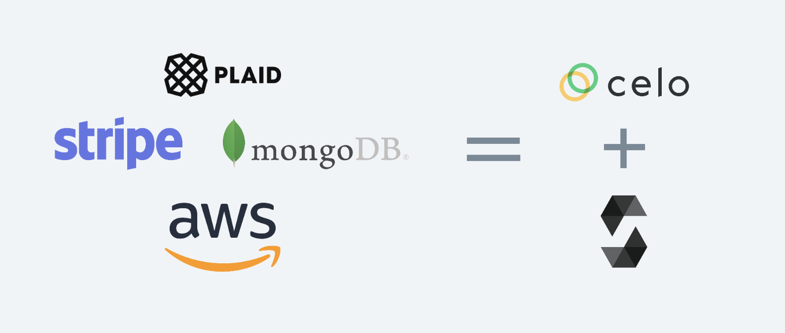
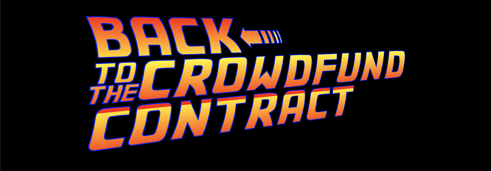

This tutorial has three parts:

1.  Building a Crowdfunding Smart Contract in Celo
2.  Deploying a Crowdfunding Smart Contract in Celo
3.  Interacting with the Crowdfunding Smart Contracts

# Building a Crowdfunding Smart Contract in Celo

We're going to write a smart contract in Solidity which facilitates crowdfunding (like GoFundMe, Kickstarter, and Indiegogo) on Celo in 172 lines of code.

Our contract will be able to create fundraisers, let people donate to them, and payout the money raised to the project creator. And it will do this all in cUSD (the Celo stablecoin).

The usual way of doing this might involve Plaid (banking), Stripe (payments), a database (for storing data), and AWS (for hosting):



Solidity and Celo make building the backend for this easy! Not to mention, 🌎 from day one.

This three part tutorial series will take us through writing the smart contract, deploying it, and interacting with it using Javascript.

# Prerequisites

Click the image below in order to watch the Youtube video for "Building a Crowdfunding Smart Contract in Celo".

<Embed
  url="https://youtu.be/uOso0av9gj4"
  caption="Building a Crowdfunding Smart Contract in Celo"
/>

This tutorial is meant for intermediate Web 3 developers. It assumes you have some experience programming in Javascript and Solidity, and an understanding of basic Ethereum and object oriented programming concepts.

Before we continue, make sure you have truffle installed. If you don't, run the following line of code in your terminal:

`npm install -g truffle@5.3.12`

**Note:** This tutorial uses Node v14.16.1

# Project setup

First, open the terminal and make a new project folder. We’ll call it celo-crowdfunding:

```text
mkdir celo-crowdfunding && cd celo-crowdfunding
```

Next, let’s initialize the project directory with the Node package manager `npm`:

```text
npm init -y
```

After it has been initialized, we’ll need to install some additional packages for interacting with the smart contract in the next tutorial:

- [ContractKit](https://docs.celo.org/developer-guide/contractkit) is a package created by the Celo team to aid in development
- [dotenv](https://www.npmjs.com/package/dotenv) is used for reading environment variables in our code
- [web3.js](https://github.com/ChainSafe/web3.js) is a library which facilitates our interactions with the blockchain
- [OpenZeppelin contracts](https://www.npmjs.com/package/@openzeppelin/contracts) is a library of well-tested Solidity code that we will reuse

Install all of the above using `npm`:

```text
npm install -—save @celo/contractkit dotenv web3@1.3.6 @openzeppelin/contracts
```

After all the `npm` packages have installed, run `truffle init` in the terminal to initialize Truffle.

Here's what a successful run of `truffle init` will look like:


# Writing the Contract

First things first, open the newly created project in your favorite code editor and create a file called **CeloCrowdfund.sol** in your `contracts/` folder.

At the top of the file, add the Solidity version and import the SafeMath contract and the [ERC-20](https://ethereum.org/en/developers/docs/standards/tokens/erc-20/) interface from OpenZeppelin:

```javascript
pragma solidity >=0.4.22 <0.9.0;

// Importing OpenZeppelin's SafeMath Implementation
import "@openzeppelin/contracts/utils/math/SafeMath.sol";

// IERC-20 contract
import "@openzeppelin/contracts/token/ERC20/IERC20.sol";
```

SafeMath is a wrapper for `uint256` in Solidity. We use SafeMath because integers in Solidity are vulnerable to overflow errors which can cause significant problems for our smart contracts.

We also import the `ERC-20` contract interface since it implements the basic `ERC-20` functions, and cUSD uses the ERC-20 standard.

Next, we're going to initialize our contract:

```javascript
contract CeloCrowdfund {
  // SafeMath for safe integer operations
  using SafeMath for uint256;

  // List of all the projects
  Project[] private projects;
}
```

This is the start of the CeloCrowdfund contract. It includes a line to use SafeMath and an array of the `Project` type. Next, we'll create a contract named `Project` which will handle each project users create.

In the same file as the `CeloCrowdfund` contract, create a `Project` contract and an `enum` called `ProjectState`:

```javascript
contract CeloCrowdfund {
  // SafeMath for safe integer operations
  using SafeMath for uint256;

  // List of all the projects
  Project[] private projects;
}

contract Project {
  using SafeMath for uint256;

  enum ProjectState {
    Fundraising,
    Expired,
    Successful
  }
  IERC20 private cUSDToken;
}
```

We use the `enum` named `ProjectState` in order to keep track of a project's current state. A project can be in the fundraising, expired, or successful state. We use `enum` because it creates a custom type for `ProjectState`.

We also create a private variable named `cUSDToken` which is of type `IERC20`. This is the variable we'll use to interface with the cUSD tokens.

# Expanding the Project contract

Next, we'll add some public variables which describe a `Project`. Public variables in Solidity can be accessed by any other contract or dApp. We make these variables public in our contract because we will need it when we interact with the contract in order to get details about the `Project`. For more info on Solidity variable types, be sure to check out [this guide](https://www.bitdegree.org/learn/solidity-variables#control-variable-visibility).

It should look like this:

```javascript
contract Project {
  using SafeMath for uint256;

  enum ProjectState {
    Fundraising,
    Expired,
    Successful
  }

  IERC20 private cUSDToken;

  // Initialize public variables
  address payable public creator;
  uint public goalAmount;
  uint public completeAt;
  uint256 public currentBalance;
  uint public raisingDeadline;
  string public title;
  string public description;
  string public imageLink;

  // Initialize state at fundraising
  ProjectState public state = ProjectState.Fundraising;

  mapping (address => uint) public contributions;
}
```

After initializing the variables, we create a `state` variable to start as the fundraising state when the `Project` contract is initialized. Next, we create a [mapping](https://docs.soliditylang.org/en/latest/types.html#mapping-types) from user addresses to to the amount they donate as a `uint` to keep track of the contributions made to the `Project`. In Solidity, a mapping is like a hash table or a dictionary.

Now, we'll add add some [events](https://docs.soliditylang.org/en/latest/contracts.html#events) and a `modifier` after the `mapping`:

```javascript
  // Event when funding is received
  event ReceivedFunding(address contributor, uint amount, uint currentTotal);

  // Event for when the project creator has received their funds
  event CreatorPaid(address recipient);

  modifier theState(ProjectState _state) {
    require(state == _state);
   _;
  }
```

We will use the `ReceivedFunding` and `CreatorPaid` events later on in our contract to store transaction logs on the blockchain. This is helpful for having a record of timestamps and transactions being made by our contract.

We also use a [function modifier](https://docs.soliditylang.org/en/latest/contracts.html#function-modifiers) in the contract to check that the state of the project is always of type `state`. Modifiers are a reusable way to check a condition before executing a function in Solidity. We'll use the modifier in a couple of functions later in our smart contract.

Next, we'll add a constructor for the `Project` contract after the modifier:

```javascript
constructor
(
  IERC20 token,
  address payable projectCreator,
  string memory projectTitle,
  string memory projectDescription,
  string memory projectImageLink,
  uint fundRaisingDeadline,
  uint projectGoalAmount
) {
  cUSDToken = token;
  creator = projectCreator;
  title = projectTitle;
  description = projectDescription;
  imageLink = projectImageLink;
  goalAmount = projectGoalAmount;
  raisingDeadline = fundRaisingDeadline;
  currentBalance = 0;
}
```

If you've done some object oriented programming in the past, constructors should be familiar to you. They're essentially the parameters we need to create a `Project` object.

**The contribute() function**

Next, let's create a function in the `Project` contract for contributing money to a project:

```javascript
// Fund a project
function contribute(uint256 amount) external theState(ProjectState.Fundraising) payable {
  cUSDToken.transferFrom(msg.sender, address(this), amount);

  contributions[msg.sender] = contributions[msg.sender].add(amount);
  currentBalance = currentBalance.add(amount);
  emit ReceivedFunding(msg.sender, amount, currentBalance);

  checkIfFundingExpired();
}
```

The `contribute()` function is an external function. This means it can only be called from other smart contracts or transactions.

The first thing the `contribute()` function does is use the IERC20 `transferFrom()` function in order to send the amount passed in the parameter from `msg.sender` (the caller) to `address(this)` (the contract):

`cUSDToken.transferFrom(msg.sender, address(this), amount);`

Next, it adds the user's address to the mapping of `contributions` with the user's address as the key and the funding amount as the value:

`contributions[msg.sender] = contributions[msg.sender].add(amount);`

Then the function updates the project's current balance and emits a `ReceivedFunding()` event:

```javascript
currentBalance = currentBalance.add(amount);

emit ReceivedFunding(msg.sender, amount, currentBalance);
```

**The checkIfFundingCompleteOrExpired() function**

At the bottom of `contribute()`, the function calls `checkIfFundingCompleteOrExpired();` which doesn't exist yet. Let's create that now!

Write the following function in the `Project` contract:

```javascript
// check project state
function checkIfFundingExpired() public {
  if (block.timestamp > raisingDeadline) {
    state = ProjectState.Expired;
  }
}
```

This function checks if the deadline is past the `block.timestamp` (the current time of the most recent block). If the project has expired, the state is updated.

Next, let's make the `payOut()` function.

**The payOut() function**

Below the `checkIfFundingCompleteOrExpired()` function, add the following for `payOut()`:

```javascript
function payOut() external returns (bool result) {
  require(msg.sender == creator);

  uint256 totalRaised = currentBalance;
  currentBalance =  0;

  if (cUSDToken.transfer(msg.sender, totalRaised)) {
    emit CreatorPaid(creator);
    state = ProjectState.Successful;
    return  true;
  }
  else {
    currentBalance = totalRaised;
    state = ProjectState.Successful;
  }

  return  false;
}
```

The first thing the `payOut()` function does is it checks that the address calling the function is the same as the project creator by using `require()`. We do this to make sure only the project creator can withdraw their funds.

Next, the `payOut()` function will send the full amount raised by a project back to the project creator. It does this by calling the `tranfer()` function from the `IERC20` interface.

`transfer()` returns a boolean value. If it works, then the `CreatorPaid()` event is emitted and the state is updated. If not, we reset the `currentBalance` variable and update the state anyway.

**The getDetails() function**

Finally, we're going to add the last function in our `Project` contract, the `getDetails()` function.

```javascript
function  getDetails() public  view  returns
(
  address payable projectCreator,
  string memory projectTitle,
  string memory projectDescription,
  string memory projectImageLink,
  uint fundRaisingDeadline,
  ProjectState currentState,
  uint256 projectGoalAmount,
  uint256 currentAmount
) {
  projectCreator = creator;
  projectTitle = title;
  projectDescription = description;
  projectImageLink = imageLink;
  fundRaisingDeadline = raisingDeadline;
  currentState = state;
  projectGoalAmount = goalAmount;
  currentAmount = currentBalance;
}
```

This function returns information about the project by returning the public variables we set at the start of the `Project` contract.

That's it for the `Project` contract!

# Back to the crowdfund contract



It's time to get back to the `CeloCrowdfund` contract now that we've finished the `Project` contract. Scroll back up to the top of the file where your `CeloCrowdfund` contract is.

We'll start by adding an `event` for when a project is started:

```javascript
contract CeloCrowdfund {
  // SafeMath for safe integer operations
  using SafeMath for uint256;

  // List of all the projects
  Project[] private projects;

  // event for when new project starts
  event ProjectStarted(
    address contractAddress,
    address projectCreator,
    string title,
    string description,
    string imageLink,
    uint256 fundRaisingDeadline,
    uint256 goalAmount
  );
}
```

We've used `events` in a couple of places in the contract so far. We're going to use this `event` to log when a project is created to the blockchain. It will take parameters which contain all the `Project` data we use to create a new `Project`.

Next, let's make the `startProject()` function to start a project:

```javascript
function startProject(
  IERC20 cUSDToken,
  string calldata title,
  string calldata description,
  string calldata imageLink,
  uint durationInDays,
  uint amountToRaise
) external {
  uint raiseUntil = block.timestamp.add(durationInDays.mul(1 days));

  Project newProject = new Project(cUSDToken, payable(msg.sender), title, description, imageLink, raiseUntil, amountToRaise);
  projects.push(newProject);

  emit ProjectStarted(
    address(newProject),
    msg.sender,
    title,
    description,
    imageLink,
    raiseUntil,
    amountToRaise
  );
}
```

The `startProject()` function takes in some basic info for creating a project like the `title`, `description`, `imageLink`, `duration`, and `amount` to raise.

It then makes the `raiseUntil` variable use days by multiplying the `durationInDays` by `1 days`. This turns the `durationInDays` variable from a `uint` to something `block.timestamp` will accept.

Next, our `startProject()` function creates a `newProject` of type `Project` (from our `Project` contract) with the parameters the `Project` contract constructor takes.

Finally, the function emits a `ProjectStarted()` log.

One last thing for our `CeloCrowdfund` contract: we'll add a function to return the list of `Projects` created:

```text
function returnProjects() external view returns(Project[] memory) {
  return projects;
}
```

And that's it for our two contracts!

# Conclusion

Just like that, we've created two smart contracts which will allow for crowdfunding in Celo.

Hopefully creating this smart contract has given you a sense of what's possible. Without too much hassle and infrastructure setup, we're able to use this contract to accept payments and help users coordinate towards raising money for a project they want to support. And all things considered, it wasn't too long or complex for an entire project backend.

In the next section, we will discuss deploying the contracts we've written to the Celo network!

**Note**: This tutorial and smart contract is based on the [contracts for Coperacha](https://github.com/Alex-Neo-Projects/Coperacha-contracts), an app built by the tutorial author. If you want to see these contracts being used in a mobile app, you can see an example of that [here](https://github.com/Alex-Neo-Projects/Coperacha-app).
