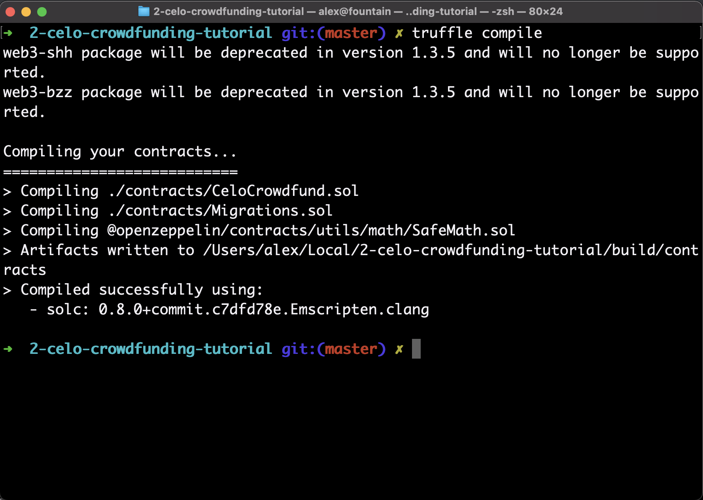
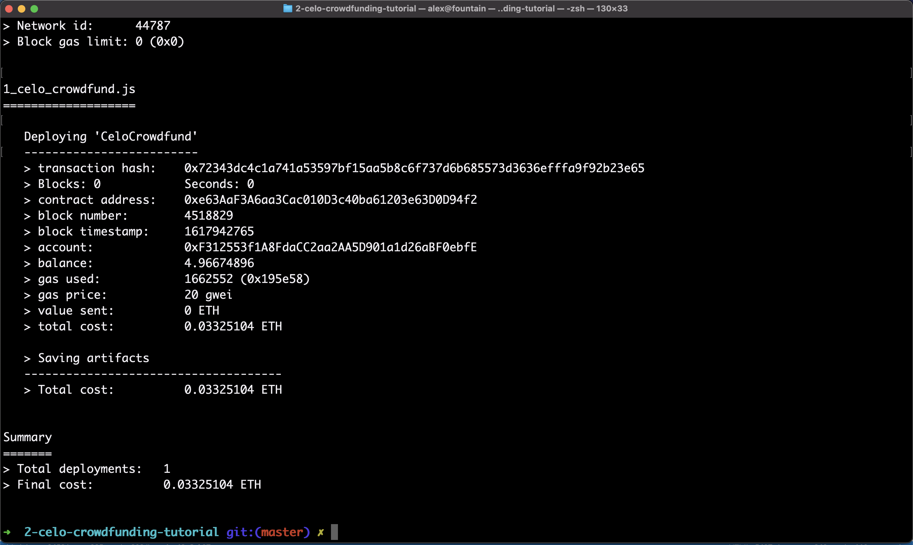
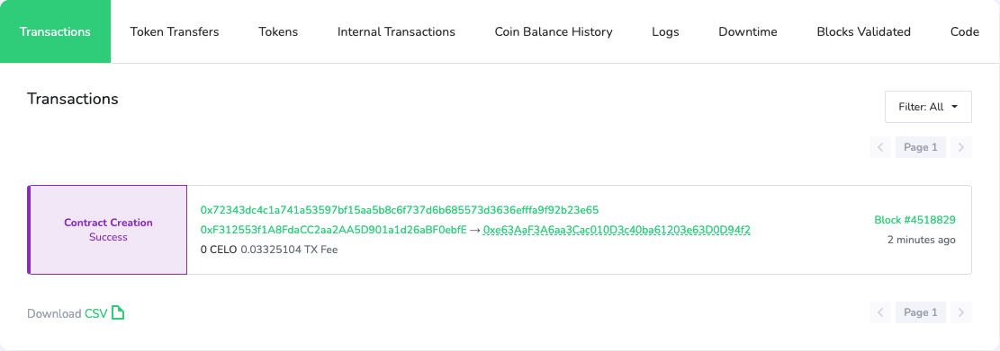
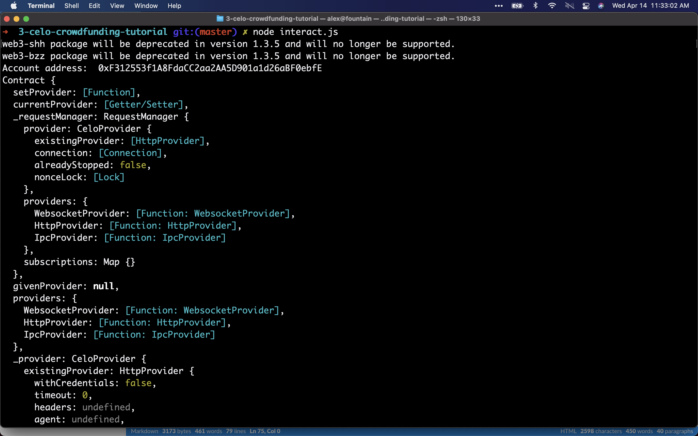

This tutorial has three parts:

1.  Building a Crowdfunding Smart Contract in Celo
2.  Deploying a Crowdfunding Smart Contract in Celo
3.  Interacting with the Crowdfunding Smart Contracts

# Building a Crowdfunding Smart Contract in Celo

We're going to write a smart contract in Solidity which facilitates crowdfunding (like GoFundMe, Kickstarter, and Indiegogo) on Celo in 172 lines of code.

Our contract will be able to create fundraisers, let people donate to them, and payout the money raised to the project creator. And it will do this all in cUSD (the Celo stablecoin).

The usual way of doing this might involve Plaid (banking), Stripe (payments), a database (for storing data), and AWS (for hosting):


Solidity and Celo make building the backend for this easy! Not to mention, 🌎 from day one.

This three part tutorial series will take us through writing the smart contract, deploying it, and interacting with it using Javascript.

## Prerequisites

Click the image below in order to watch the Youtube video for "Building a Crowdfunding Smart Contract in Celo".

<Embed
  url="https://youtu.be/uOso0av9gj4"
  caption="Building a Crowdfunding Smart Contract in Celo"
/>

This tutorial is meant for intermediate Web 3 developers. It assumes you have some experience programming in Javascript and Solidity, and an understanding of basic Ethereum and object oriented programming concepts.

Before we continue, make sure you have truffle installed. If you don't, run the following line of code in your terminal:

`npm install -g truffle@5.3.12`

**Note:** This tutorial uses Node v14.16.1

## Project setup

First, open the terminal and make a new project folder. We’ll call it celo-crowdfunding:

```text
mkdir celo-crowdfunding && cd celo-crowdfunding
```

Next, let’s initialize the project directory with the Node package manager `npm`:

```text
npm init -y
```

After it has been initialized, we’ll need to install some additional packages for interacting with the smart contract in the next tutorial:

- [ContractKit](https://docs.celo.org/developer-guide/contractkit) is a package created by the Celo team to aid in development
- [dotenv](https://www.npmjs.com/package/dotenv) is used for reading environment variables in our code
- [web3.js](https://github.com/ChainSafe/web3.js) is a library which facilitates our interactions with the blockchain
- [OpenZeppelin contracts](https://www.npmjs.com/package/@openzeppelin/contracts) is a library of well-tested Solidity code that we will reuse

Install all of the above using `npm`:

```text
npm install -—save @celo/contractkit dotenv web3@1.3.6 @openzeppelin/contracts
```

After all the `npm` packages have installed, run `truffle init` in the terminal to initialize Truffle.

Here's what a successful run of `truffle init` will look like:


## Writing the Contract

First things first, open the newly created project in your favorite code editor and create a file called **CeloCrowdfund.sol** in your `contracts/` folder.

At the top of the file, add the Solidity version and import the SafeMath contract and the [ERC-20](https://ethereum.org/en/developers/docs/standards/tokens/erc-20/) interface from OpenZeppelin:

```javascript
pragma solidity >=0.4.22 <0.9.0;

// Importing OpenZeppelin's SafeMath Implementation
import "@openzeppelin/contracts/utils/math/SafeMath.sol";

// IERC-20 contract
import "@openzeppelin/contracts/token/ERC20/IERC20.sol";
```

SafeMath is a wrapper for `uint256` in Solidity. We use SafeMath because integers in Solidity are vulnerable to overflow errors which can cause significant problems for our smart contracts.

We also import the `ERC-20` contract interface since it implements the basic `ERC-20` functions, and cUSD uses the ERC-20 standard.

Next, we're going to initialize our contract:

```javascript
contract CeloCrowdfund {
  // SafeMath for safe integer operations
  using SafeMath for uint256;

  // List of all the projects
  Project[] private projects;
}
```

This is the start of the CeloCrowdfund contract. It includes a line to use SafeMath and an array of the `Project` type. Next, we'll create a contract named `Project` which will handle each project users create.

In the same file as the `CeloCrowdfund` contract, create a `Project` contract and an `enum` called `ProjectState`:

```javascript
contract CeloCrowdfund {
  // SafeMath for safe integer operations
  using SafeMath for uint256;

  // List of all the projects
  Project[] private projects;
}

contract Project {
  using SafeMath for uint256;

  enum ProjectState {
    Fundraising,
    Expired,
    Successful
  }
  IERC20 private cUSDToken;
}
```

We use the `enum` named `ProjectState` in order to keep track of a project's current state. A project can be in the fundraising, expired, or successful state. We use `enum` because it creates a custom type for `ProjectState`.

We also create a private variable named `cUSDToken` which is of type `IERC20`. This is the variable we'll use to interface with the cUSD tokens.

## Expanding the Project contract

Next, we'll add some public variables which describe a `Project`. Public variables in Solidity can be accessed by any other contract or dApp. We make these variables public in our contract because we will need it when we interact with the contract in order to get details about the `Project`. For more info on Solidity variable types, be sure to check out [this guide](https://www.bitdegree.org/learn/solidity-variables#control-variable-visibility).

It should look like this:

```javascript
contract Project {
  using SafeMath for uint256;

  enum ProjectState {
    Fundraising,
    Expired,
    Successful
  }

  IERC20 private cUSDToken;

  // Initialize public variables
  address payable public creator;
  uint public goalAmount;
  uint public completeAt;
  uint256 public currentBalance;
  uint public raisingDeadline;
  string public title;
  string public description;
  string public imageLink;

  // Initialize state at fundraising
  ProjectState public state = ProjectState.Fundraising;

  mapping (address => uint) public contributions;
}
```

After initializing the variables, we create a `state` variable to start as the fundraising state when the `Project` contract is initialized. Next, we create a [mapping](https://docs.soliditylang.org/en/latest/types.html#mapping-types) from user addresses to to the amount they donate as a `uint` to keep track of the contributions made to the `Project`. In Solidity, a mapping is like a hash table or a dictionary.

Now, we'll add add some [events](https://docs.soliditylang.org/en/latest/contracts.html#events) and a `modifier` after the `mapping`:

```javascript
  // Event when funding is received
  event ReceivedFunding(address contributor, uint amount, uint currentTotal);

  // Event for when the project creator has received their funds
  event CreatorPaid(address recipient);

  modifier theState(ProjectState _state) {
    require(state == _state);
   _;
  }
```

We will use the `ReceivedFunding` and `CreatorPaid` events later on in our contract to store transaction logs on the blockchain. This is helpful for having a record of timestamps and transactions being made by our contract.

We also use a [function modifier](https://docs.soliditylang.org/en/latest/contracts.html#function-modifiers) in the contract to check that the state of the project is always of type `state`. Modifiers are a reusable way to check a condition before executing a function in Solidity. We'll use the modifier in a couple of functions later in our smart contract.

Next, we'll add a constructor for the `Project` contract after the modifier:

```javascript
constructor
(
  IERC20 token,
  address payable projectCreator,
  string memory projectTitle,
  string memory projectDescription,
  string memory projectImageLink,
  uint fundRaisingDeadline,
  uint projectGoalAmount
) {
  cUSDToken = token;
  creator = projectCreator;
  title = projectTitle;
  description = projectDescription;
  imageLink = projectImageLink;
  goalAmount = projectGoalAmount;
  raisingDeadline = fundRaisingDeadline;
  currentBalance = 0;
}
```

If you've done some object oriented programming in the past, constructors should be familiar to you. They're essentially the parameters we need to create a `Project` object.

**The contribute() function**

Next, let's create a function in the `Project` contract for contributing money to a project:

```javascript
// Fund a project
function contribute(uint256 amount) external theState(ProjectState.Fundraising) payable {
  cUSDToken.transferFrom(msg.sender, address(this), amount);

  contributions[msg.sender] = contributions[msg.sender].add(amount);
  currentBalance = currentBalance.add(amount);
  emit ReceivedFunding(msg.sender, amount, currentBalance);

  checkIfFundingExpired();
}
```

The `contribute()` function is an external function. This means it can only be called from other smart contracts or transactions.

The first thing the `contribute()` function does is use the IERC20 `transferFrom()` function in order to send the amount passed in the parameter from `msg.sender` (the caller) to `address(this)` (the contract):

`cUSDToken.transferFrom(msg.sender, address(this), amount);`

Next, it adds the user's address to the mapping of `contributions` with the user's address as the key and the funding amount as the value:

`contributions[msg.sender] = contributions[msg.sender].add(amount);`

Then the function updates the project's current balance and emits a `ReceivedFunding()` event:

```javascript
currentBalance = currentBalance.add(amount);

emit ReceivedFunding(msg.sender, amount, currentBalance);
```

**The checkIfFundingCompleteOrExpired() function**

At the bottom of `contribute()`, the function calls `checkIfFundingCompleteOrExpired();` which doesn't exist yet. Let's create that now!

Write the following function in the `Project` contract:

```javascript
// check project state
function checkIfFundingExpired() public {
  if (block.timestamp > raisingDeadline) {
    state = ProjectState.Expired;
  }
}
```

This function checks if the deadline is past the `block.timestamp` (the current time of the most recent block). If the project has expired, the state is updated.

Next, let's make the `payOut()` function.

**The payOut() function**

Below the `checkIfFundingCompleteOrExpired()` function, add the following for `payOut()`:

```javascript
function payOut() external returns (bool result) {
  require(msg.sender == creator);

  uint256 totalRaised = currentBalance;
  currentBalance =  0;

  if (cUSDToken.transfer(msg.sender, totalRaised)) {
    emit CreatorPaid(creator);
    state = ProjectState.Successful;
    return  true;
  }
  else {
    currentBalance = totalRaised;
    state = ProjectState.Successful;
  }

  return  false;
}
```

The first thing the `payOut()` function does is it checks that the address calling the function is the same as the project creator by using `require()`. We do this to make sure only the project creator can withdraw their funds.

Next, the `payOut()` function will send the full amount raised by a project back to the project creator. It does this by calling the `tranfer()` function from the `IERC20` interface.

`transfer()` returns a boolean value. If it works, then the `CreatorPaid()` event is emitted and the state is updated. If not, we reset the `currentBalance` variable and update the state anyway.

**The getDetails() function**

Finally, we're going to add the last function in our `Project` contract, the `getDetails()` function.

```javascript
function  getDetails() public  view  returns
(
  address payable projectCreator,
  string memory projectTitle,
  string memory projectDescription,
  string memory projectImageLink,
  uint fundRaisingDeadline,
  ProjectState currentState,
  uint256 projectGoalAmount,
  uint256 currentAmount
) {
  projectCreator = creator;
  projectTitle = title;
  projectDescription = description;
  projectImageLink = imageLink;
  fundRaisingDeadline = raisingDeadline;
  currentState = state;
  projectGoalAmount = goalAmount;
  currentAmount = currentBalance;
}
```

This function returns information about the project by returning the public variables we set at the start of the `Project` contract.

That's it for the `Project` contract!

## Back to the crowdfund contract


It's time to get back to the `CeloCrowdfund` contract now that we've finished the `Project` contract. Scroll back up to the top of the file where your `CeloCrowdfund` contract is.

We'll start by adding an `event` for when a project is started:

```javascript
contract CeloCrowdfund {
  // SafeMath for safe integer operations
  using SafeMath for uint256;

  // List of all the projects
  Project[] private projects;

  // event for when new project starts
  event ProjectStarted(
    address contractAddress,
    address projectCreator,
    string title,
    string description,
    string imageLink,
    uint256 fundRaisingDeadline,
    uint256 goalAmount
  );
}
```

We've used `events` in a couple of places in the contract so far. We're going to use this `event` to log when a project is created to the blockchain. It will take parameters which contain all the `Project` data we use to create a new `Project`.

Next, let's make the `startProject()` function to start a project:

```javascript
function startProject(
  IERC20 cUSDToken,
  string calldata title,
  string calldata description,
  string calldata imageLink,
  uint durationInDays,
  uint amountToRaise
) external {
  uint raiseUntil = block.timestamp.add(durationInDays.mul(1 days));

  Project newProject = new Project(cUSDToken, payable(msg.sender), title, description, imageLink, raiseUntil, amountToRaise);
  projects.push(newProject);

  emit ProjectStarted(
    address(newProject),
    msg.sender,
    title,
    description,
    imageLink,
    raiseUntil,
    amountToRaise
  );
}
```

The `startProject()` function takes in some basic info for creating a project like the `title`, `description`, `imageLink`, `duration`, and `amount` to raise.

It then makes the `raiseUntil` variable use days by multiplying the `durationInDays` by `1 days`. This turns the `durationInDays` variable from a `uint` to something `block.timestamp` will accept.

Next, our `startProject()` function creates a `newProject` of type `Project` (from our `Project` contract) with the parameters the `Project` contract constructor takes.

Finally, the function emits a `ProjectStarted()` log.

One last thing for our `CeloCrowdfund` contract: we'll add a function to return the list of `Projects` created:

```text
function returnProjects() external view returns(Project[] memory) {
  return projects;
}
```

And that's it for our two contracts!

## Conclusion

Just like that, we've created two smart contracts which will allow for crowdfunding in Celo.

Hopefully creating this smart contract has given you a sense of what's possible. Without too much hassle and infrastructure setup, we're able to use this contract to accept payments and help users coordinate towards raising money for a project they want to support. And all things considered, it wasn't too long or complex for an entire project backend.

In the next section, we will discuss deploying the contracts we've written to the Celo network!

**Note**: This tutorial and smart contract is based on the [contracts for Coperacha](https://github.com/Alex-Neo-Projects/Coperacha-contracts), an app built by the tutorial author. If you want to see these contracts being used in a mobile app, you can see an example of that [here](https://github.com/Alex-Neo-Projects/Coperacha-app).

# Deploying a Crowdfunding Smart Contract in Celo

If you've done part 1 of this tutorial series, you have a crowdfunding contract written in Solidity. Now that we've got a crowdfunding contract, we'll need to deploy it to the Celo test network in order to interact with it. Let's do that now!

## Prerequisites

This tutorial assumes that you have followed and completed part 1 (Building a Crowdfunding Smart Contract in Celo). If you have not, please go back and follow that tutorial first.

Click the image below in order to watch the YouTube video for "Deploying a Crowdfunding Smart Contract in Celo".

<Embed url="https://youtu.be/HShFGDvBgNk" />

## Deployment Setup

First, open the terminal and `cd` into the Celo crowdfunding project folder.

`cd celo-crowdfunding`

## The migrations folder

If there is already the `1_initial_migration.js` file in the folder, delete it.

Next, create a new file named `1_celo_crowdfund.js` and write the following:

```js
const CeloCrowdfund = artifacts.require('CeloCrowdfund');

module.exports = function (deployer) {
  deployer.deploy(CeloCrowdfund);
};
```

Migrations in Truffle are essentially deployment scripts. What we have written is a very simple deployment script which takes our contract (`CeloCrowdfund`) and deploys it.

## Connecting to a Testnet node

We're going to use DataHub to connect to the Celo test network. If you don't have an account, sign up on the [DataHub](https://datahub.figment.io) website and resume this tutorial once you have your Celo API key.

Now that we have an API key for the DataHub node, we'll want to secure it. Anyone who obtains your API key will be able to use your DataHub account's node. To secure it, let's create a `.env` file in the **root directory** of the `celoSmartContract` folder. The `.env` file is used for environment secrets, which means its the perfect place to store the DataHub API key.

To create this `.env` file, navigate to the root directory of the project and type the following command into the terminal:

`touch .env`

Next, open the `.env` file in a text editor and add the following variable, making sure to enter the API key between the `/`'s:

`REST_URL=https://celo-alfajores--rpc.datahub.figment.io/apikey/<YOUR API KEY>/`

**Note:** there needs to be a trailing `/` at the end of the URL for it to work!

**Note:** If the plan is to commit this repo into Github, you won't want to upload the contents of the `.env` file. To get Git to ignore the `.env` file, create a `.gitignore` file from the terminal like so:

`touch .gitignore`

Inside the `.gitignore`, put the following in a new line:

```text
.env
```

And that's it! The `.env` file will now be ignored by Git.

## Getting a Celo account

Next, we’re going to need a Celo account to deploy from. We will need three things for deployment:

- A Celo account address
- A Celo account private key
- A Celo account [loaded with testnet funds](https://celo.org/developers/faucet)​

First things first, let's get an account and a private key. Create a file named **getAccount.js** in the project folder. In that file, write the following:

```javascript
const ContractKit = require('@celo/contractkit');

const Web3 = require('web3');

require('dotenv').config();

const main = async () => {
  const web3 = new Web3(process.env.REST_URL);
  const client = ContractKit.newKitFromWeb3(web3);

  const account = web3.eth.accounts.create();

  console.log('address: ', account.address);
  console.log('privateKey: ', account.privateKey);
};

main().catch(err => {
  console.error(err);
});
```

Let's break this down.

First, the script imports `ContractKit`, `Web3`, and `dotenv`. Next, it connects to the Celo network via the REST_URL in the `.env` file using the following line:

```js
const web3 = new Web3(process.env.REST_URL);
```

Then it creates an account on that same testnet connection with the following line:

```js
const account = web3.eth.accounts.create();
```

After that, we just print out the address and private key for future use.

**Note:** The above code is from [#2. Create your first Celo account](https://learn.figment.io/network-documentation/celo/tutorial/intro-pathway-celo-basics/2.account), so feel free to rewind if you need a review.

Next, run the script in the terminal with the command `node getAccount.js`.

The output should print out the address and private key for you new Celo account. It will look like this:

​[​​](https://camo.githubusercontent.com/85e62204e4c406103e375245afef4c7ee1fb83998bf2b08e168044c4863fd42b/68747470733a2f2f692e696d6775722e636f6d2f7571314c5854662e706e67)​

**Note:** It is important to keep your private key secure! Whoever has it can access all your funds on Celo.

Copy the privateKey into the `.env` file by adding a line with `PRIVATE_KEY=YOUR-PRIVATE-KEY` - Where **YOUR-PRIVATE-KEY** is the private key you got from the script output.

Now that you have a Celo account, take the address and paste it into the [Celo developer faucet](https://celo.org/developers/faucet). This will give you testnet funds you can use to deploy the smart contract. Fill out the form and wait a couple of seconds, and your account should be loaded up and ready to go.

​[​​](https://camo.githubusercontent.com/0c74bcb5251da3397bae2c6901c25218a6ff73befb825a53c546181e95e0db06/68747470733a2f2f692e696d6775722e636f6d2f7a5074575748572e706e67)​

## Truffle config

The **truffle-config.js** is used in order to tell truffle how you want to deploy the contract.

For our purposes, we will need to add the following code to the project truffle-config file:

```javascript
const ContractKit = require('@celo/contractkit');
const Web3 = require('web3');

require('dotenv').config({ path: '.env' });

// Create connection to DataHub Celo Network node
const web3 = new Web3(process.env.REST_URL);

const client = ContractKit.newKitFromWeb3(web3);

// Initialize account from our private key
const account = web3.eth.accounts.privateKeyToAccount(process.env.PRIVATE_KEY);

// We need to add private key to ContractKit in order to sign transactions
client.addAccount(account.privateKey);

module.exports = {
  compilers: {
    solc: {
      version: '0.8.0', // Fetch exact version from solc-bin (default: truffle's version)
    },
  },
  networks: {
    test: {
      host: '127.0.0.1',
      port: 7545,
      network_id: '*',
    },
    alfajores: {
      provider: client.connection.web3.currentProvider, // CeloProvider
      network_id: 44787, // latest Alfajores network id
    },
  },
};
```

First, the config file imports `ContractKit`, `Web3`, and `dotenv` just like the `getAccounts.js` file.

It connects to our Celo node by getting the `REST_URL` from `.env`:

```js
const web3 = new Web3(process.env.REST_URL);
```

Then it gets the account from the private key in the `.env` file in order to deploy from your account:

```js
const account = web3.eth.accounts.privateKeyToAccount(process.env.PRIVATE_KEY);
```

We also add the private key to `ContractKit` in order to sign transactions with:

```js
client.addAccount(account.privateKey);
```

And finally, in the `module.exports` function, we set the Solidity version we want to use under `compilers: {` and the network we want to deploy to under `networks: {`.

The following block of code is what tells truffle to deploy to Alfajores (Celo's testnet):

```javascript
alfajores: {
    provider: client.connection.web3.currentProvider, // CeloProvider
    network_id: 44787  // latest Alfajores network id
}
```

## Deployment

We’re almost there! Run `truffle compile` to check that you did everything correctly. If things are working, you should see the following output:



Now that we’ve compiled the smart contract, the last step is to deploy it. Run the following to deploy to the Alfajores testnet:

```text
truffle migrate --network alfajores
```

You should see the following deployment output:



If you see something like the above, the code works! To see the smart contract on the Celo network, open the [Alfajores block explorer](https://alfajores-blockscout.celo-testnet.org/) & paste in the address on the contract address line from the Truffle output:

`> contract address: YOUR-CELO-ADDRESS`

You should see a successful contract deployment at that address in the block explorer:



## Next Steps

Now that we've deployed our Celo crowdfunding smart contract on Celo, we can move on to interacting with it. In the next tutorial, we'll interact with our smart contract by creating new crowdfunding projects and donating to them.

## Potential Errors & Solutions

If you run into any problems, feel free to ask on the [Figment Learn Discord](https://discord.gg/f5YuEsQTAx). You can also view the source code [on GitHub](https://github.com/alexreyes/Celo-Crowdfunding-Tutorial-2). In any case, here are some common errors you may encounter.

If you get the following error:

`Error: Invalid JSON RPC response: {"message":"no Route matched with those values"}`

​[​​](https://camo.githubusercontent.com/b10c13fb11358a60891ccd1e3191e40ffe54d19ffef9b3f0b127e3e567eed1b6/68747470733a2f2f692e696d6775722e636f6d2f42384c657272552e706e67)​

Then it's a problem with the **REST_URL** in the **.env** file.

Make sure the URL has a trailing **/** at the end! It should look like this:

`REST_URL = https://celo-alfajores--rpc.datahub.figment.io/apikey/YOUR-API-KEY/`

If the contract didn't deploy to the test network, the output might look like this:

​[​​](https://camo.githubusercontent.com/a59c20e99081c85f182da44f68a167aec86a58da7c690367b4dbe35f57673943/68747470733a2f2f692e696d6775722e636f6d2f703637645a444d2e706e67)​

Where the contracts were compiled but it didn't give you an address for where it was deployed to.

To fix this, make sure you have your account loaded up with [testnet funds from the faucet](https://celo.org/developers/faucet).

If you want to double-check that your account received the funds, go to the [Alfajores block explorer](https://alfajores-blockscout.celo-testnet.org/) and search for your account's address.

Make sure your account isn't empty like this one!

​[​](https://camo.githubusercontent.com/60a2da1b381d2d9f9c21ade38e54f3793ead7bf2162d4eb7ccb8297733494cbc/68747470733a2f2f692e696d6775722e636f6d2f795055594353442e706e67)

# Interacting with the Crowdfunding Smart Contracts

Welcome to the last tutorial in this three part series on creating a crowdfunding smart contract on Celo. In this last part, we're going to write Javascript code in order to interact with the smart contract we wrote and deployed in the previous two parts.

Now that we have our smart contract on the Celo test network, it's time to use it!

## Prerequisites

You will need the smart contracts we wrote in part 1, and the deployments you made in part 2. Therefore, for the code in this tutorial to work you will need to have completed the prior two tutorials.

Click the image below in order to watch the YouTube video for "Interacting with the Crowdfunding Smart Contracts".

<Embed
  url="https://youtu.be/C24prS3bk_I"
  caption="Interacting with the Crowdfunding Smart Contracts"
/>

## Setup

The first step is to create a Javascript file to write our smart contract interactions in. In the root of the `celo-crowdfunding` folder, create a file named `interact.js`.

We will use the packages we installed via NPM in the first tutorial here. We will also need one additional module, BigNumber, in order to work with the large numbers the Celo blockchain uses.

In the terminal, run `npm install bignumber.js`. That's it for the setup of this step!


## Importing our modules

The first step for interacting with our smart contracts is importing the modules we'll need for our script.

At the top of the `interact.js` file, write the following:

```js
const Web3 = require('web3');
const ContractKit = require('@celo/contractkit');
const web3 = new Web3('https://alfajores-forno.celo-testnet.org');
const kit = ContractKit.newKitFromWeb3(web3);
const CeloCrowdfund = require('./build/contracts/CeloCrowdfund.json');
const Project = require('./build/contracts/Project.json');
const BigNumber = require('bignumber.js');

require('dotenv').config({ path: '.env' });
```

We will use all of these modules later on in order to interact with the crowdfunding contracts we previously made.

## Getting our contract

The next thing we want to go is get our smart contract as a variable we can use. We'll also need to get our Celo account because we'll be sending transactions to the network.

After the imports, write the following:

```js
// Get Celo account info

let account = web3.eth.accounts.privateKeyToAccount(process.env.PRIVATE_KEY);
kit.connection.addAccount(account.privateKey);
```

The above code imports your private key we set in the second tutorial from the `.env` file and puts it into the account variable. It also adds the Celo account to contractKit.

Next, let's create an async function where we will write our interactions with the smart contract:

```javascript
async function interact() {
  // Check the Celo network ID
  const networkId = await web3.eth.net.getId();

  // Get the contract associated with the current network
  const deployedNetwork = CeloCrowdfund.networks[networkId];

  // Create a new contract instance from the celo crowdfund contract
  let celoCrowdfundContract = new kit.web3.eth.Contract(
    CeloCrowdfund.abi,
    deployedNetwork && deployedNetwork.address,
  );

  console.log('Account address: ', account.address);
  console.log(celoCrowdfundContract);
}

interact();
```

Let's run this. In the terminal, type: `node interact.js`. The result should be something like the following:



If all goes well, the output should show the account address, and the contract that we created. The contract output looks different than regular solidity code because it is a [contract ABI](https://docs.soliditylang.org/en/v0.5.3/abi-spec.html).

Great! So we've verified that the contract is getting imported correctly and our account works.

Next, comment out the `console.log` of the `celoCrowdfundContract` variable since we won't use it anymore.

The next step is to create a new `Project`. Create a new function outside of `interact()` called `createProject()`:

```javascript
async function createProject(celoCrowdfundContract, stableToken, gasPrice) {
  var projectGoal = BigNumber(1e18);
  await celoCrowdfundContract.methods
    .startProject(
      stableToken.address,
      'Test project',
      'We are testing the create project function',
      'https://i.imgur.com/Flfo4hJ.png',
      5,
      projectGoal,
    )
    .send({
      from: account.address,
      feeCurrency: stableToken.address,
      gasPrice: gasPrice,
    });
  console.log('Created new project');
}
```

This function takes in the `celoCrowdfunding`, `stableToken`, and `gasPrice` as parameters. It then creates a `projectGoal` using `BigNumber`.

We create a number that's of size 1,000,000,000,000,000,000 or 1^18 because cUSD has a size of 18 decimals. Solidity doesn't have support for floating point numbers, so the workaround is to make really large numbers. 1^18 cUSD is equal to $1 cUSD.

Next, we call the `startProject()` method in our crowdfunding contract and pass in the parameters it requires. If we go back to the `CeloCrowdfund.sol` contract, we'll see the `createProject()` method takes in the following:

```javascript
function startProject(
  IERC20 cUSDToken,
  string calldata title,
  string calldata description,
  string calldata imageLink,
  uint durationInDays,
  uint amountToRaise
)
```

These are the parameters we supply when we call the function.

Now that we have that, we will create a stableToken variable which uses the `ContractKit` stabletoken wrapper in order to get a reference to the cUSD coin.

We will also get the gas price to pass in to our functions. We'll set the gas higher than the recommended minimums in order to get our transactions confirmed faster. For a primer on gas fees in Celo, feel free to check out [this post](https://consensys.net/blog/metamask/what-is-a-gas-fee-on-ethereum/).

After getting those two variables, we will call the `createProject()` helper function inside `interact()`. We'll also return all the projects in our contract using the `returnProjects()` function in our `CeloCrowdfund` contract, to verify that it worked:

```javascript
// Print wallet address so we can check it on the block explorer
console.log('Account address: ', account.address);

// Get the cUSD ContractKit wrapper
var stableToken = await kit.contracts.getStableToken();

// Get the gas price minimum and set the new gas price to be double
const gasPriceMinimumContract = await kit.contracts.getGasPriceMinimum();
const gasPriceMinimum = await gasPriceMinimumContract.getGasPriceMinimum(
  stableToken.address,
);
const gasPrice = Math.ceil(gasPriceMinimum * 2); // This should be much higher than the current average, so the transaction will confirm faster

await createProject(celoCrowdfundContract, stableToken, gasPrice);

// Return projects inside the celo crowdfund contract
var result = await celoCrowdfundContract.methods.returnProjects().call();

console.log('List of addressses for each of the projects created:', result);
```

After running the code, you should see the new project created.

## Sending money to a project

Now that we've created a project, we'll need to send some money to it.

Just like how we created a variable called `celoCrowdfundContract` to access our `CeloCrowdfund` contract, we'll need to create a variable to access the `Project` contract.

To do this we can write the following:

```javascript
var projectInstanceContract = new web3.eth.Contract(
  Project.abi,
  deployedNetwork && result[result.length - 1], // Get the most recently deployed Project
);
```

This will create a variable to access the most recently created Project contract instance from the array returned by the `returnProjects()` function.

Now that we can access our project, we'll need to do two things in order to send cUSD to the contract. Since cUSD follows the [ERC-20](https://ethereum.org/en/developers/docs/standards/tokens/erc-20/) standard, we'll need to approve sending cUSD to the contract prior to sending money. After it's approved, we can send cUSD to our contract.

We'll approve a large amount of cUSD for the contract as an example. To approve 500 cUSD to be sent, write the following:

```javascript
// Approve the project to spend up to 500 cUSD from wallet
var approveAmount = BigNumber(500e18);
await stableToken
  .approve(projectInstanceContract._address, approveAmount)
  .sendAndWaitForReceipt({ from: account.address });
```

Great! Now we have approved our contract to receive 500 cUSD. The next step is to actually send some money.

Outside of the `interact()` function, create a new function called `contribute()`:

```javascript
async function contribute(stableToken, projectInstanceContract, gasPrice) {
  var sendAmount = BigNumber(2e18);

  // Call contribute() function with 2 cUSD
  await projectInstanceContract.methods
    .contribute(sendAmount)
    .send({
      from: account.address,
      feeCurrency: stableToken.address,
      gasPrice: gasPrice,
    });

  console.log('Contributed to the project\n');
}
```

In the `contribute()` function, we create a variable called `sendAmount` which is set to 2E18. This is equivalent to 2 cUSD. Next, we use our `projectInstanceContract` variable to call the `contribute()`function in our `Project()` contract.

Back in our `interact()` function, let's call the `contribute()` helper function we created:

```javascript
await contribute(stableToken, projectInstanceContract, gasPrice);
```

## Displaying our balances

There are now two cUSD balances we care about: the balance of our Celo wallet, and the balance of our Project which the `contribute()` function sent 2 cUSD to.

Outside the `interact()` function, create a helper function called `createBalances()` to print this all out:

```javascript
async function printBalances(stableToken, projectInstanceContract) {
  var balanceOfUser = (await stableToken.balanceOf(account.address)).toString();

  console.log("User's address: ", account.address);
  console.log("User's cUSD balance: ", balanceOfUser / 1e18, ' cUSD\n');

  var balanceOfContract = (
    await stableToken.balanceOf(projectInstanceContract._address)
  ).toString();

  console.log('Contract address: ', projectInstanceContract._address);
  console.log('Contract cUSD balance: ', balanceOfContract / 1e18, ' cUSD\n');
}
```

The `printBalances()` function uses the `stableToken` variable's `balanceOf()` function in order to get our Celo wallet's cUSD balance. We then use that same `balanceOf()` function in order to get the balance of the contract, and then we print it all out.

Next, inside the `interact()` function just call the `printBalances()` function after `contribute()`:

```javascript
await printBalances(stableToken, projectInstanceContract);
```

## Paying out from our Project contract

So far we're able to create a Project, and fund it. The final step is paying out from our contract!

Outside the `interact()` function, create a helper function called `payOut()`:

```javascript
async function payOut(stableToken, projectInstanceContract, gasPrice) {
  var payOut = await projectInstanceContract.methods
    .payOut()
    .send({
      from: account.address,
      feeCurrency: stableToken.address,
      gasPrice: gasPrice,
    });
  console.log('Paying out from project');
}
```

The `payOut()` function calls the `payOut()` function inside our `Project` smart contract. This will send all the funds sent back to the project creator.

Finally, let's call the `payOut()` helper function inside our `interact()` function:

```javascript
await contribute(stableToken, projectInstanceContract, gasPrice);
await printBalances(stableToken, projectInstanceContract);

await payOut(stableToken, projectInstanceContract, gasPrice);

console.log('After pay out: ');
await printBalances(stableToken, projectInstanceContract);
```

We'll want to wait 5 seconds before printing just to make sure the `payOut()` transaction has been confirmed on the blockchain.

Now let's run the code! In your terminal, type: `node interact.js`

The output should look something like this:


Awesome! As we can see from the terminal output, our script creates a new project, contributes 2 cUSD to it, waits 5 seconds, and then pays out from the project. We can see the flow of the 2 cUSD going from the Celo wallet --> the contract --> back to the wallet.

It works!

## Conclusion

This three part series has shown you how to write a smart contract for Celo, deploy it, and then interact with the smart contract we created.

You can use this third tutorial as a jumping off point for interacting with any smart contract you make using Javascript. Whether you're creating a web dApp or a mobile dApp, you can use this code in order to interact with your contracts.

If you run into any problems, feel free to ask on the [Figment Learn Discord](https://discord.gg/f5YuEsQTAx). You can also view the source code [here](https://github.com/alexreyes/Celo-Crowdfunding-Tutorial-3)

# About the Authors

The written tutorials were created by [Alex Reyes](https://www.linkedin.com/in/alexreyes-tech). Alex is a student (BS, Computer Science) and crypto enthusiast who's learning all about the world of web3 one day at a time and he's contributing to Web3 communities actively. He previously completed internships at Facebook and Microsoft.

The videos were created by [Neo Cho](https://www.linkedin.com/in/neocho/). Neo is a student (BS, Computer Science) at the University of Central Florida. He enjoys learning about crypto and is excited about the future of web3.
