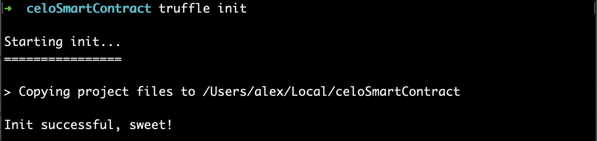
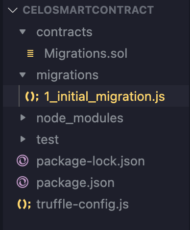
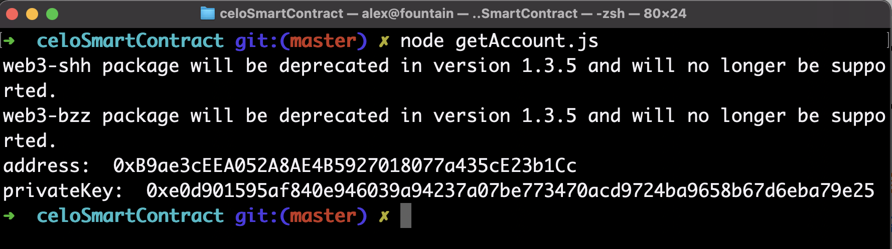
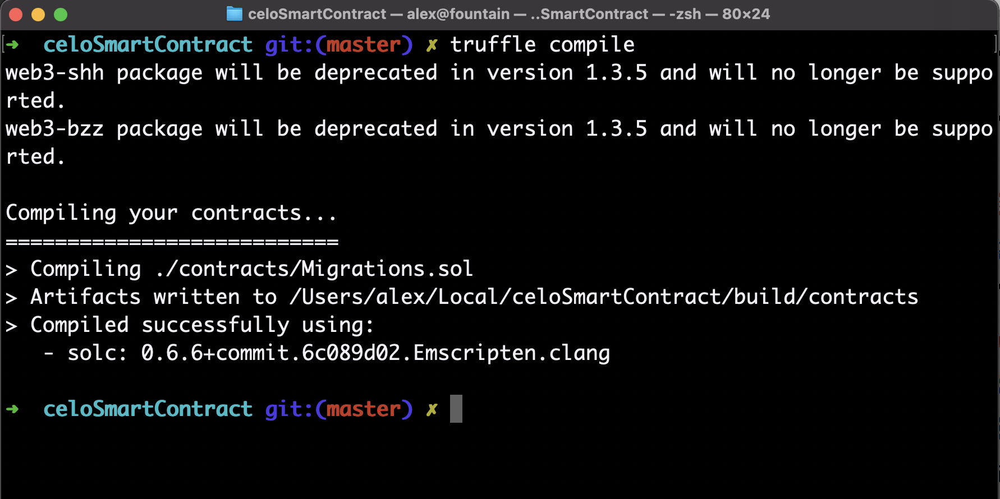
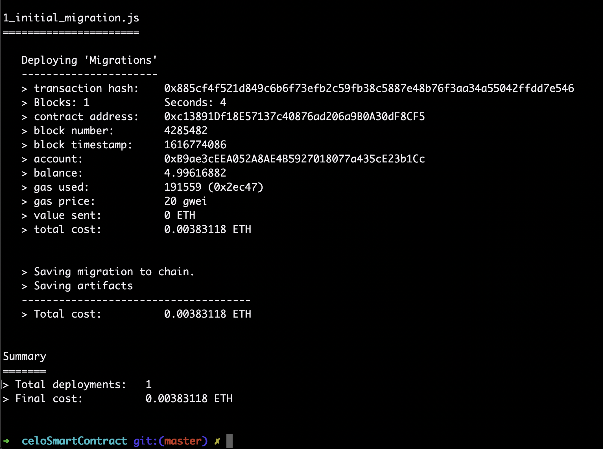
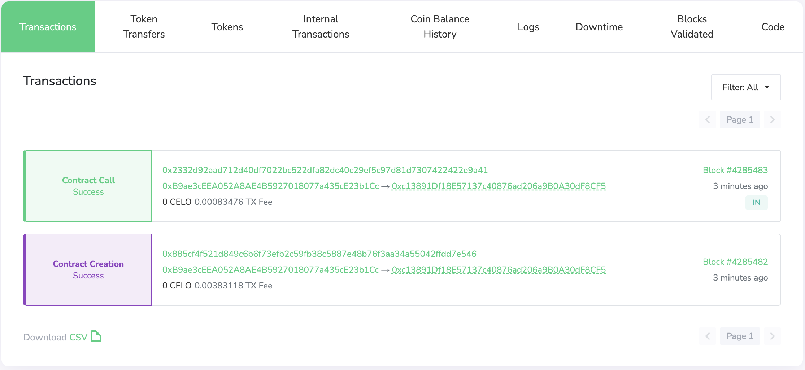

# Introduction

How would you go about deploying an existing Solidity smart contract on the Celo network? One answer is that you could do it with the help of Truffle -- a development environment that is designed to make deploying smart contracts much easier.

Read on to learn how to deploy smart contracts on Celo with Truffle!

# Prerequisites

This tutorial would be most helpful if you have a smart contract you've written which you'd like to deploy on Celo. If not, that's okay as we will be deploying the default Truffle Migrations contract.

Before you continue, make sure you have Truffle installed. If you don't, run the following line of code in your terminal:

`npm install -g truffle`

# Project setup

First, open the terminal and make a new project folder. We’ll call it celoSmartContract:

`mkdir celoSmartContract && cd celoSmartContract`

Next, let’s initialize the project directory with NPM, the [Node Package Manager](https://npmjs.com/), using the -y flag to accept default parameters:

`npm init -y`

After NPM has initialized the project directory, we’ll need to install some additional packages. Here’s an overview of what we need to install:

- [ContractKit](https://www.npmjs.com/package/@celo/contractkit) - this is a package created by the Celo team to aid in Celo development
- [dotenv](https://www.npmjs.com/package/dotenv) - for reading environment variables stored in a .env file in our code
- [web3.js](https://github.com/ChainSafe/web3.js) - the Ethereum JavaScript API

Install all of the above dependencies for this project using NPM:

`npm install --save @celo/contractkit dotenv web3`

After the NPM packages have installed, we will need to initialize Truffle in our project directory:

`truffle init`

Here's what a successful run of truffle initialization would look like:

[](https://camo.githubusercontent.com/96639b87ce3a287a678cff74b466d840f84b83a42403fae9b23287163e275cee/68747470733a2f2f692e696d6775722e636f6d2f4a46367a646f542e706e67)

# A simple smart contract

Now that we've initialized Truffle, we'll move on to the smart contract we'll be deploying.

For reference, your project structure should now look like this:

[](https://camo.githubusercontent.com/089cdaddf4682328e54509cbe1b127fb6c2a9e8f4df9ed7ac82d6ed3cefaede1/68747470733a2f2f692e696d6775722e636f6d2f4a705471574c4a2e706e67)

In this tutorial, the **Migrations.sol** contract which is initialized by Truffle is what we will be deploying.

**Note**: If you want to deploy a smart contract you've written, replace the **Migrations.sol** file in the **contracts/** folder with your own Solidity file. Here's what the default **Migrations.sol** file looks like:

```javascript
// SPDX-License-Identifier: MIT
pragma  solidity >=0.4.22 <0.9.0;

contract Migrations {

  address public owner =  msg.sender;
  uint  public last_completed_migration;

  modifier restricted() {
    require(
	  msg.sender == owner,"This function is restricted to the contract's owner");
	  _;
  }

  function setCompleted(uint completed) public restricted {
	last_completed_migration = completed;
  }
}
```

We won't be going over this smart contract in this tutorial, but if you want to learn Solidity feel free to go through the other tutorials on Figment Learn!

# The migrations folder

Files in the migrations folder are used as deployment scripts. In Truffle, these deployment scripts are called migrations. For each Solidity file you want to deploy, you'll need a corresponding migration.

At its simplest, a migration will look like the `1_initial_migration.js` file you see below:

```javascript
const Migrations = artifacts.require('Migrations');

module.exports = function (deployer) {
  deployer.deploy(Migrations);
};
```

Let's break this down a bit.

At the top of the file, the artifacts.require() line is what fetches the contract we'll be deploying. The name should always match the Solidity contract definition. In our migrations contract, the contract definition looks like this:

`contract Migrations {`

Next, the script exports a function via the `module.exports()` syntax which takes in a `deployer` object. The deployer object is used for managing some of Truffle's deployment duties, and is what will be used to deploy the contract from Truffle's side of things.

And that's it! At its simplest, migrations are short like this.

**Note:** If you want to deploy your custom Solidity contract, create a new file using the numbered migrations convention, and replace YOUR_CONTRACT_NAME with your contract definition:

```javascript
const YOUR_CONTRACT_NAME = artifacts.require('YOUR_CONTRACT_NAME');

module.exports = function (deployer) {
  deployer.deploy(YOUR_CONTRACT_NAME);
};
```

# Connecting to a testnet node

Now we're going to need to connect to a Celo testnet node, which will be how we communicate with the Celo blockchain.

First, create a .env file in the **root directory** of the `celoSmartContract` folder. To do so, navigate to the top of your project folder and type the following command into your terminal:

`touch .env`

Great! You've made a .env file which will hold the environment secrets. Make sure you do not commit this file to GitHub! Add `.env` to a line in your `.gitignore` file to prevent it from being sent to GitHub if you were to commit.

We're going to use [DataHub](https://figment.io/datahub/) to connect to the Celo test network. If you don't have an account, sign up on the [DataHub](https://datahub.figment.io/) website and then resume this tutorial.

Next, open the .env file you created in your code editor and add the following variable, where is the API key from DataHub:

`REST_URL=https://celo-alfajores--rpc.datahub.figment.io/apikey/<INSERT_API_KEY>/`

**Note:** there needs to be a trailing / at the end of the line for this to work!

Now we have the URL we'll use to connect to the Celo testnet saved.

# Getting a Celo account

Next, we’re going to need a Celo account to deploy from. We will need a few things for deployment:

- A Celo account address and corresponding private key
- A Celo account [loaded with testnet funds](https://celo.org/developers/faucet).

First things first, let's get an account and a private key. Create a file named `getAccount.js` in your project root directory. In that file, write the following code:

```javascript
const ContractKit = require('@celo/contractkit');

const Web3 = require('web3');

require('dotenv').config();

const main = async () => {
  const web3 = new Web3(process.env.REST_URL);
  const client = ContractKit.newKitFromWeb3(web3);

  const account = web3.eth.accounts.create();

  console.log('address: ', account.address);
  console.log('privateKey: ', account.privateKey);
};

main().catch(err => {
  console.error(err);
});
```

Let's break this down.

First, the script imports ContractKit, Web3, and dotenv. Next, it connects to the Celo network via the REST_URL in your `.env` file using the following:

`const web3 = new Web3(process.env.REST_URL);`

Then it creates an account on that same testnet connection with the following line:

`const account = web3.eth.accounts.create();`

After that, we just print out the address and private key for future use.

**Note:** The above code is from [#2. Create your first Celo account](https://learn.figment.io/network-documentation/celo/tutorial/intro-pathway-celo-basics/2.account), so feel free to rewind if you need a review.

Next, run the script in your terminal:

`node getAccount.js`

Your output should print out the address and private key for you new Celo account. It will look like this:

[](https://camo.githubusercontent.com/85e62204e4c406103e375245afef4c7ee1fb83998bf2b08e168044c4863fd42b/68747470733a2f2f692e696d6775722e636f6d2f7571314c5854662e706e67)

**Note:** It is important to keep your private key secure! Whoever has it can access all your funds on Celo.

Copy the privateKey into your .env file by adding a line with the following:

`PRIVATE_KEY=YOUR-PRIVATE-KEY`

Where **YOUR-PRIVATE-KEY** is the private key you got from the script output.

Now that you have a Celo account, take the address and paste it into the [Celo developer faucet](https://celo.org/developers/faucet). This will give you testnet funds you can use to deploy your smart contract. Fill out the form and wait a couple of seconds, and your account should be loaded up and ready to go.

[](https://camo.githubusercontent.com/0c74bcb5251da3397bae2c6901c25218a6ff73befb825a53c546181e95e0db06/68747470733a2f2f692e696d6775722e636f6d2f7a5074575748572e706e67)

# Truffle config

The **truffle-config.js** is used in order to tell truffle how you want to deploy your contract.

For our purposes, we will need to add the following code to the project truffle-config file:

```javascript
const ContractKit = require('@celo/contractkit');
const Web3 = require('web3');

require('dotenv').config({ path: '.env' });

// Create connection to DataHub Celo Network node
const web3 = new Web3(process.env.REST_URL);

const client = ContractKit.newKitFromWeb3(web3);

// Initialize account from our private key
const account = web3.eth.accounts.privateKeyToAccount(process.env.PRIVATE_KEY);

// We need to add private key to ContractKit in order to sign transactions
client.addAccount(account.privateKey);

module.exports = {
  compilers: {
    solc: {
      version: '0.6.6', // Fetch exact version from solc-bin (default: truffle's version)
    },
  },
  networks: {
    test: {
      host: '127.0.0.1',
      port: 7545,
      network_id: '*',
    },
    alfajores: {
      provider: client.connection.web3.currentProvider, // CeloProvider
      network_id: 44787, // latest Alfajores network id
    },
  },
};
```

First, the config file imports ContractKit, Web3, and dotenv just like the `getAccounts.js` file.

It connects to our Celo node by getting the REST_URL from .env:

`const web3 = new Web3(process.env.REST_URL);`

Then it gets your account from the private key in the `.env` file in order to deploy from your account:

`const account = web3.eth.accounts.privateKeyToAccount(process.env.PRIVATE_KEY);`

We also add the private key to ContractKit in order to sign transactions with the following:

`client.addAccount(account.privateKey);`

And finally, in the `module.exports` function, we set the Solidity version we want to use under `compilers: {` and the network we want to deploy to under `networks: {`.

The following block of code is what tells truffle to deploy to alfajores (Celo's test network):

```javascript
alfajores: {
    provider: client.connection.web3.currentProvider, // CeloProvider
    network_id: 44787  // latest Alfajores network id
}
```

# Deployment

We’re almost there! Run the following to check that you did everything correctly:

`truffle compile`

If things are working, you should see the following output:

[](https://camo.githubusercontent.com/c132bce955dd7c13ee2b89d5b9ac1164f99da53830b11a64096b752278735ad9/68747470733a2f2f692e696d6775722e636f6d2f6835593672636f2e706e67)

Now that we’ve compiled the smart contract, the last step is to deploy it. Run the following to deploy to the Alfajores testnet:

`truffle migrate --network alfajores`

You should see the following deployment output:

[](https://camo.githubusercontent.com/c0fd0be76786e0c102b0ee445dbd77113f3f626853b3bad4827575250ed61788/68747470733a2f2f692e696d6775722e636f6d2f683757777161442e706e67)

If you see something like the above, you did it correctly! To see your smart contract on the Celo network, open the [Alfajores block explorer](https://alfajores-blockscout.celo-testnet.org/) and paste in the address on the contract address line of your truffle output:

`> contract address: 0xc13891Df18E57137c40876ad206a9B0A30dF8CF5`

You should see a successful contract deployment at that address!

[](https://camo.githubusercontent.com/2d23c68351d5f73727daf04dad01cc6efd9a82e5678789d61436c608865036eb/68747470733a2f2f692e696d6775722e636f6d2f6e6c32383869612e706e67)

# Conclusion

Congratulations! You've just deployed a smart contract on the Celo network using Truffle!

Now that you've finished the tutorial, you should have a basic understanding of deploying smart contracts on the Celo network. The possibilities are endless for what you can create! It's still early. You can use this tutorial as a jumping off point for deploying the smart contracts of your dreams🥳

The complete source code for this tutorial can be found on [GitHub](https://github.com/alexreyes/Celo-Deploying-With-Truffle).

# Next Steps

Now that you've learned how to deploy smart contracts on Celo using Truffle, you can build new use cases for the cryptoeconomy on Celo! To learn more Solidity, check out Solidity by Example. You can also continue with the other tutorials on [Figment Learn](https://learn.figment.io/tutorials/).

# Common Errors & Solutions

If you run into errors at any point, feel free to ask on the Celo channel on the Figment Learn discord server. In any case, here are some common errors you may encounter.

If you get the following error:

`Error: Invalid JSON RPC response: {"message":"no Route matched with those values"}`

[](https://camo.githubusercontent.com/b10c13fb11358a60891ccd1e3191e40ffe54d19ffef9b3f0b127e3e567eed1b6/68747470733a2f2f692e696d6775722e636f6d2f42384c657272552e706e67)

Then it's a problem with the **REST_URL** in your **.env** file.

Make sure the URL has a trailing **/** at the end! It should look like this:

`REST_URL = https://celo-alfajores--rpc.datahub.figment.io/apikey/YOUR-API-KEY/`

If your contract didn't deploy to the test network, your output might look like this:

[](https://camo.githubusercontent.com/a59c20e99081c85f182da44f68a167aec86a58da7c690367b4dbe35f57673943/68747470733a2f2f692e696d6775722e636f6d2f703637645a444d2e706e67)

Where the contracts compiled but it didn't give you an address for where it was deployed to.

To fix this, make sure you have your account loaded up with [testnet funds](https://celo.org/developers/faucet).

If you want to double check that your account received the funds, go to the [Alfajores block explorer](https://alfajores-blockscout.celo-testnet.org/) and paste in your account's address.

Make sure your account isn't empty like this one!

[](https://camo.githubusercontent.com/60a2da1b381d2d9f9c21ade38e54f3793ead7bf2162d4eb7ccb8297733494cbc/68747470733a2f2f692e696d6775722e636f6d2f795055594353442e706e67)

# About the author

This tutorial was created by [Alex Reyes](https://www.linkedin.com/in/alexreyes-tech). Alex is a student (BS, Computer Science) and crypto enthusiast who's learning all about the world of web3 one day at a time and he's contributing to Web3 communities actively. He completed his previous internships at Facebook and Microsoft.
