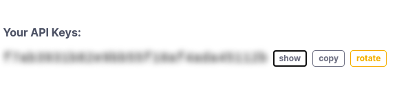
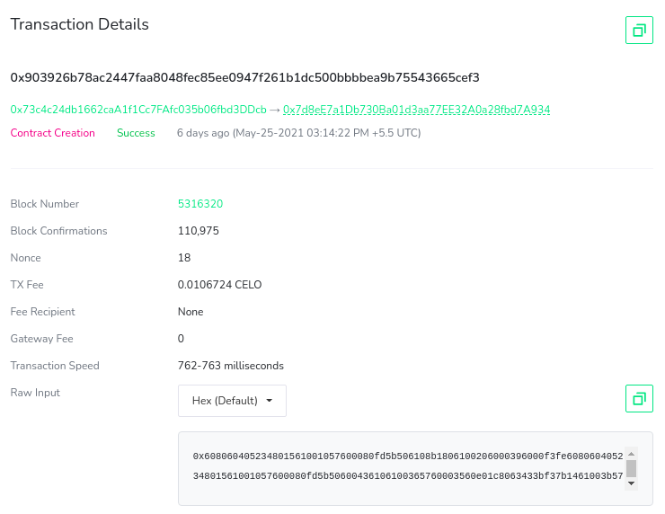
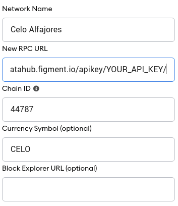

# Introduction

In this tutorial we will be making a **Distributed File Manager** using the **IPFS** protocol for storing our files, **Celo** network for storing the file references of each address to their uploaded files and **ReactJS** for the frontend code. For compiling and deploying our smart contracts, we will be using **Truffle Suite**.

For your information, [Truffle Suite](https://www.trufflesuite.com) is a toolkit for launching decentralized applications dApps on the EVM. With Truffle you can write and compile smart contracts, build artifacts, run migrations and interact with deployed contracts. This tutorial illustrates how Truffle can be used with the Celo network, which is an instance of the EVM.

# Prerequisites

- You've created an account on [DataHub](https://datahub.figment.io/sign_up?service=celo)
- Basic familarity with [Celo's architecture](https://docs.celo.org/) and smart contracts.
- Basic familarity with [ReactJS](https://reactjs.org)

# Requirements

- [NodeJS](https://nodejs.org/en). You’ll need to have Node >= 10.16 and npm >= 5.6 on your machine.
- [Truffle](https://www.trufflesuite.com/truffle), which you can install with `npm install -g truffle`
- [Metamask](https://metamask.io) extension added to the browser, which must only be obtained from the official Metamask website : <https://metamask.io>. Do not download Metamask from an unofficial source.

# Understanding the project

From the title, **Distributed File Manager**, you have got an idea that it's about making a dApp that will allow us to upload and manage files in a so-called **distributed** fashion. But you might be wondering, that what is **IPFS** and how will our files be distributed!!! Nothing to worry about, just go through the text, and all your doubts will be resolved.

# Decoding IPFS and how is it different?

**IPFS** is an acronym that stands for **I**nter**P**lanetary **F**ile **S**ystem. It is a communication protocol and network for storing and sharing data. Theoretically, it aims to make a file-sharing system that can communicate among the planets, someday. Check out [Awesome IPFS](https://awesome.ipfs.io/) to learn more about projects built on IPFS.

Currently, we are dominated by the **client-server** model of communication which is following **HTTP** aka **Hypertext Transfer Protocol**. This means that, in between the communication between two devices, one has to be the server (which will serve or respond with data) and the other should be the client (which will receive or request data). The major problem with this client-server model is that the client would have to request data from the server, far away from it, even if the same data was previously received by its neighbour or was available somewhere closer. This would cause high latency (delay in receiving data) and low bandwidths (speed of data transfer).


**IPFS** is a relatively new protocol, which aims to resolve these issues. It follows the **peer-to-peer** model of communication, in which there could be an arbitrary number of servers responding to the client with the required data. Once the client has the data (or even just bits of other data), it can then act as a server. Every node connected to the network can act as a server if it has the required software installed. Sending data from multiple servers may seem inefficient, however, the protocol is designed this way. The data is hashed and divided into pieces that can be transmitted and stored separately, but given sufficient, information can be re-joined later. Once all the pieces are in place, it makes the whole file.


**IPFS** is a large swarm of such nodes, which chose to serve data. We need IPFS clients to connect to those nodes and upload data. We can also connect to the network using the available javascript client libraries like `ipfs-http-client`. There are several providers like **Infura**, which provides an HTTP portal to view the files on the IPFS. More technical details are provided ahead in the tutorial.

# Initializing the working directory

Our application's client-side is made using **ReactJS**. Smart contracts will be made using the **Solidity** language and will be deployed on the **Celo** network with **Trufflesuite**. Therefore, we need to set up our working directory according to ReactJS and Trufflesuite, for making our development process smoother.

Open a terminal and navigate to the directory where we will create the application. Usually, this will be inside our user home directory but can be located wherever is practical. On most Linux distributions this will change into /home/ . On macOS, it will be /Users/. On Windows, the user directories are located in C:\Users.

```bash
cd ~
```

# Setting up the ReactJS project

Create a new react app using npx. npx is a npm package runner (x stands for eXecute). The typical use is to download and run a package temporarily or for trials. You can learn more about npx [here](https://www.npmjs.com/package/npx).

```bash
npx create-react-app dfm-celo-react
```

Move to the newly created directory and install the basic dependencies.

```bash
cd dfm-celo-react
npm install --save web3 ethers @truffle/contract @celo/contractkit
```

Open the file `index.html` file inside of the `public` directory and replace the existing code with the following HTML :

```markup
<!DOCTYPE html>
<html lang="en">
  <head>
    <meta charset="utf-8" />
    <meta name="viewport" content="width=device-width, initial-scale=1" />
    <title>Distributed File Manager</title>
    <link
      rel="stylesheet"
      href="https://cdn.jsdelivr.net/npm/bootstrap@4.6.0/dist/css/bootstrap.min.css"
    />
  </head>

  <body>
    <div id="root"></div>
  </body>
</html>
```

Open the file `App.js` inside of the `src` directory and replace the existing code with the following code:

```javascript
import React from 'react';

// 1. Importing other modules

class App extends React.Component {
  constructor(props) {
    super(props);
    this.state = {
      web3: null,
      account: null,
      contract: null,
    };
  }

  componentDidMount() {
    this.init();
  }

  async init() {
    // 2. Load web3
    // 3. Load Account
    // 4. Load Smart-Contract instance
  }

  render() {
    return (
      <div>
        <font color="white">Distributed File Manager</font>
        {/* 5. Navbar */}

        {/* 6. IPFS Viewer component */}

        {/* 7. IPFS Uploader component */}
      </div>
    );
  }
}
export default App;
```

This `App` component will maintain a state with `web3` instance of the `Metamask` provider for interacting with the Celo network, `account` address and instance of the deployed smart contract.

Open the file `index.js` inside of the `src` directory and replace the existing code with the following code:

```javascript
import React from 'react';
import ReactDOM from 'react-dom';
import App from './App';

ReactDOM.render(
  <React.StrictMode>
    <App />
  </React.StrictMode>,
  document.getElementById('root'),
);
```

React project setup is now complete.

# Setting up the Truffle project

Run the following command in the root directory, to create a boilerplate for the `Truffle` project.

```bash
truffle init
```

This will set up Truffle's initial project structure. Smart contracts will be stored in the `contracts` folder, deployment functions for migrating smart contracts to the network will be stored in the `migrations` folder. By default, the `/build/contracts` folder would contain information about the compiled and deployed contract, ABI etc in the `.json` format and these files are known as `artifacts`.

There is also 1 **config** file created by the above command, which is, **truffle-config.js**. In this file, there is a lot of information regarding how to deploy contracts, how to choose a network to deploy them, and many others. Therefore, we should preserve this file for reference. So, use the below command to make a copy of this file. This would create a copy named `truffle-config-default.js`.

```bash
cp truffle-config.js truffle-config-default.js
```

Now we can update the `truffle-config.js` file with the following code, to deploy the smart contract on Celo's Alfajores test network. This file is where we define the connection to the Alfajores network. An account on Celo with a valid mnemonic is required to deploy the contract to the network.

```javascript
const Web3 = require('web3');
const ethers = require('ethers');
const ContractKit = require('@celo/contractkit');
require('dotenv').config();

const MNEMONIC = process.env.MNEMONIC;
const DATAHUB_CELO_API = process.env.DATAHUB_CELO_API;

const DATAHUB_API_URL = `https://celo-alfajores--rpc.datahub.figment.io/apikey/${DATAHUB_CELO_API}/`;

const web3 = new Web3(DATAHUB_API_URL);
const kit = ContractKit.newKitFromWeb3(web3);

async function awaitWrapper() {
  let account = ethers.Wallet.fromMnemonic(MNEMONIC, "m/44'/52752'/0'/0/0");
  let celoToken = await kit.contracts.getGoldToken();

  let celoBalance = await celoToken.balanceOf(account.address);
  console.log('Account address: ', account.address);
  console.log(`CELO Balance: ${celoBalance / 10 ** 18}`);

  if (celoBalance / 10 ** 18 < 0.4) {
    console.log(
      'Balance too low to deploy contracts. Please fund your account here at https://celo.org/developers/faucet\n',
    );
  }
  kit.connection.addAccount(account.privateKey);
}

awaitWrapper();

module.exports = {
  contracts_build_directory: './src/build/contracts',
  networks: {
    development: {
      host: '127.0.0.1',
      port: 7545,
      network_id: '*',
    },
    alfajores: {
      provider: kit.connection.web3.currentProvider,
      network_id: 44787,
    },
  },
  compilers: {
    solc: {
      version: '0.8.0',
    },
  },
};
```

Here, you can see that we have used `contracts_build_directory` to change the default location of `artifacts` from the project root directory to the `src` folder. This is because React cannot access files that are present outside the `src` folder.

In the Truffle configuration file, you might have noticed a lot of jargon like wallet, mnemonic, address and string like "m/44'/527...", and all of that in the same line. Let's understand this line of code in more detail.

```javascript
let account = ethers.Wallet.fromMnemonic(MNEMONIC, "m/44'/52752'/0'/0/0");
```

Before the concept of **wallets** or more specifically **Hierarchical Deterministic (HD) Wallets**, there were standalone Private-Public key pairs. HD wallets on the other hand are a tree of these key pairs, in which one key pair can generate multiple child key pairs.

In HD wallets, first, a random 128 - 256 bit number is generated, also known as **entropy** or the **root seed** or **private key**. This entropy is then appended with few bits of its checksum, to make the number of bits in entropy, a multiple of 11. Then this sequence of bits is divided into sections of 11 bits each. Each section represents the index of a word in a [list](https://github.com/bitcoin/bips/blob/master/bip-0039/english.txt) of 2048 words. This sequence of words represents our wallet's **mnemonic**.

<Hint type="info">
  Checksum is a few bits of the hash of data to detect errors that may have been
  introduced during its transmission or storage. Errors are verified by hashing
  the actual data and comparing it with its appended checksum. If the checksum
  matches with the hashed data then there is no error.
</Hint>

Then the root seed is passed to a one-way hash function to generate a 512-bit seed. The left 256 bits will make the **master private key** and the right 256 bits will make the **master chain code**. Chain codes are used to introduce randomness in the child keys. HD wallets use the **child key derivation (CKD)** function to derive children keys from parent keys. The child key derivation functions are based on a one-way hash function that combines:

- A parent private or public key
- A seed called a chain code (256 bits)
- An index number (32 bits)


The index number can range from 0 to 2^32 - 1. Thus using a parent with a given private key and chain code we can generate 2^32 or around 4 Billion child key pairs. In a normal derivation, we use parent public key and chain code to generate children. But this could be vulnerable to security threats and hence we can make derivation hard by using the parent's private key instead of the public key for CKD. This process is known as **Hardened child key derivation**. And to distinguish it from normal derivation, we use different index numbers. For normal derivation index number is from 0 to 2^31 - 1 and for hardened derivation, it is from 2^31 to 2^32 - 1. Hardened index number start from 2 Billion which make it difficult to read, so we use i' to represent index 2^31 + i, where 0 <= i <= 2^32 - 1.


Master keys along with master chain code can create child keys which can further create grandchild keys and so on. Each generation is known as a tree level. Keys in an HD wallet are identified using a **path** naming convention, with each level of the tree separated by a slash (/) character. Private keys derived from the master private key start with **m**. Public keys derived from the master public key start with **M**. An HD path `m/0` represents the 0th or first child private key derived from the master. Similarly, `m/3'/1` denotes the 2nd child private key of the 4th or (2^31 + 3)th hardened child derived from the master.


There are various Bitcoin Improvement Proposals (BIP) that proposes the standard way of deriving paths. BIP0044 (44th proposal) specifies the structure as consisting of five predefined tree levels:

`m / purpose' / coin_type' / account' / change / address_index`

- **purpose** - Always set to 44'.
- **coin_type** - Specifies the type of cryptocurrency coin, allowing for multicurrency HD wallets where each currency has its subtree under the second level.
- **account** - Allows users to subdivide their wallets into separate logical subaccounts, for accounting or organizational purposes.
- **change** - It has 2 subtrees, one normal receiving address and the other for receiving change tokens which are reverted when you supplied more than the required transaction cost.
- **address_index** - We can use all the 4 Billion child keys as our address, but this index would set the primary address for our wallet.

Celo wallets like **celowallet.app** use the path `m/44'/52752'/0'/0/0` for its key derivation, since the coin type of Celo is **52752**. The list of different crypto coins along with their type can be found [here](https://github.com/satoshilabs/slips/blob/master/slip-0044.md). The coin types have nothing to do with the blockchain architecture and is chosen randomly. By default `ethers.Wallet.fromMnemonic()` function uses Ethereum's default path which has a coin type of **60**. That's why we need to manually set the path in this function. Using a different path would give a different address derived from the same mnemonic. So, if we want to use our manual paths, we should remember them, otherwise, we can't derive the address without a path.

<Hint type="info">
  I would recommend you to read more about these keys, addresses and wallets on
  O'Reilly.
</Hint>

# Get Celo credentials

For deploying smart contracts we need two things: a node connected to the **Celo** network and an account with few **CELO** tokens. **Datahub** provides a Celo remote node, and to connect to the Datahub node, we need an API key. Visit [Celo Services Dashboard](https://datahub.figment.io/services/celo) on Datahub to get a Celo specific API key.



Now we need a **Celo** wallet, where we would keep our funds, required for all the transactions on the network. Visit the [Celo Wallet](https://celowallet.app/) and create an account. While creating your account you will see your public address and mnemonic. This public address will be required to transfer funds. Save the **mnemonic** in a secure place, we will need it later. Instructions to add funds will be provided later in the tutorial.

# Add .env file

Create a `.env` file in the project root folder. Please take a note that dot (.) is necessary for the `.env` file name. Now copy your Celo wallet's mnemonic in the .env file as shown below. In the .env file, **MNEMONIC** should be enclosed within double-quotes (" "). If you are facing any difficulty in setting up .env file then please refer to **Extra Guides** on [dotenv and .env](https://docs.figment.io/network-documentation/extra-guides/dotenv-and-.env).

```bash
DATAHUB_CELO_API=<your_datahub_api>
MNEMONIC="<celo-wallet-mnemonic>"
```

<Hint type="warning">
  Never share or commit your .env file. It contains your credentials like
  mnemonics. Therefore, it is advised to add .env to your .gitignore file.
</Hint>

Our project setup is now complete.

To confirm that we are on the same page, run the following command in the project root folder.

```bash
npm start
```

It might take few seconds, to show output as in the image below.


In a web browser, visit the URL <http://localhost:3000>. If npm start has not encountered any errors, we will see the text "Distributed File Manager" at the top of the page as shown in this image :


# Create the FileManager contract

Create the file `FileManager.sol` (`.sol` stands for Solidity) inside of the `contracts` directory and paste the following code:

```text
// SPDX-License-Identifier: UNLICENSED
pragma solidity >=0.8.0;

contract FileManager {
  // Structure of each File
  struct File {
    string fileName;
    string fileType;
    string cid;
  }

  // Mapping of each user's address with the array of files they are storing
  mapping(address => File[]) files;

  function addFile(string[] memory _fileInfo, string  memory _cid) public {
    files[msg.sender].push(File(_fileInfo[0], _fileInfo[1], _cid));
  }

  function getFiles(address _account) public  view  returns (File[] memory) {
    return files[_account];
  }
}
```

`FileManager` is a solidity smart contract that lets us store and view the meta details of file which we upload on the IPFS network. IPFS uses content addressing rather than location addressing. To identify files on the network, IPFS uses a cryptographic hash for each file. This hash is known as a content identifier or cid. Whatever the size of the file, the length of this hash would be the same and is enough to identify every file uniquely. After uploading the file to IPFS, we get a cid that acts as a reference to that file on the network, and we store this cid on the Celo blockchain.

Now IPFS generates a unique content identifier, the "cid" which can be used to reference this file on the network. cid's look similar to `QmVwyUH96NeQPwLN5jDkgNxM41xGCB1EVjnBYX7NoWWmKH`, a long string of upper- and lower-case letters and numbers. This is the hashed representation of the content. More information about IPFS content identifiers can be found on the [IPFS docs](https://docs.ipfs.io/concepts/content-addressing/#content-addressing-and-cids).

**Let's understand this smart contract**

The code for smart contract is everything within `contract FileManager { }`.

**Basic structure about Files** - `File` is a struct that is a skeleton to store the details of each file. We are having three attributes of each file: `fileName`, `fileType` i.e. whether it is image, audio, video or an application and finally `cid`. Here, `files` is a mapping between the owner (address) of the files and the array of those `File` structures which they uploaded.

```text
// Structure of each File
struct File {
  string fileName;
  string fileType;
  string cid;
}

// Mapping of each user's address with the array of files they are storing
mapping(address => File[]) files;
```

**Adding files** - `addFile()` function is used to add details of file to the array of `File` structures corresponding to each address. `files[msg.sender]` refers to the array of file structures, belonging to the caller of this function i.e. address `msg.sender`. Function's arguments are `_fileInfo[]` which is an array of 2 parameters (file name and file type respectively) and the second argument is `cid` which is the content id for the uploaded file.

```text
function addFile(string[] memory _fileInfo, string  memory _cid) public {
  files[msg.sender].push(File(_fileInfo[0], _fileInfo[1], _cid));
}
```

**Viewing stored files** - `getFiles()` is a function that returns the array of file structures corresponding to the account address. It returns the details of all the files as an array that is being uploaded by the address (passed in the argument of this function) on the IPFS network.

```text
function getFiles(address _account) public  view  returns (File[] memory) {
  return files[_account];
}
```

**Make a new file for migrating smart contracts**

Create a new file in the `migrations` directory named `2_deploy_contracts.js`, and add the following block of code. This handles deploying the `FileManager` smart contract to the blockchain.

```javascript
const FileManager = artifacts.require('FileManager');

module.exports = function (deployer) {
  deployer.deploy(FileManager);
};
```

# Compile Contracts with Truffle

If we have altered the code within our Solidity source files or made new ones (like `FileManager.sol`), we need to run `truffle compile` in the terminal, from inside the project root directory.

```bash
truffle compile
```

You should see:

```bash
Compiling your contracts...
===========================
> Compiling ./contracts/FileManager.sol
> Artifacts written to /home/guest/blockchain/dfm-celo-react/src/build/contracts
> Compiled successfully using:
   - solc: 0.8.0+commit.c7dfd78e.Emscripten.clang
```

<Hint type="warning">
  There might be an error Error: Cannot find module 'pify', if the pify module
  is not installed automatically while installing truffle. So, this issue can be
  resolved by separately installing pify, using the command below
</Hint>

```text
npm install pify --save
```

Compiling the smart contracts would create `.json` file in the `src/build/contracts` directory. It stores `ABI` and other necessary metadata.

<Hint type="info">
  ABI refers to Application Binary Interface, which is a standard for
  interacting with the smart contracts from outside the blockchain as well as
  contract-to-contract interaction. Please refer to the Solidity's documentation
  about ABI's here to learn more.
</Hint>

**Fund the account and run migrations on Celo's Alfjores test network.**

When deploying smart contracts to the Celo network, it will require some deployment cost. As you can see inside `truffle-config.js`, `@celo/contractkit` will help us in deploying on Celo and deployment cost will be managed by an account whose mnemonic has been stored in the `.env` file. Therefore we need to fund the account.

**Fund your account**

Fund your account using the faucet link <https://celo.org/developers/faucet> and pasting your Celo's wallet address in the input field. You'll need to send at least `0.4 CELO`. Minimum CELO required for deployment, will vary from contract to contract, depending upon what variables and data structures our contract is using. Though funding through faucet would give you enough `CELO` to run multiple deployments and transactions on the network.

# Run Migrations

Now everything is in place to run migrations and deploy the `FileManager`:

```bash
truffle migrate --network alfajores
```

This might take a while depending upon your internet connection or traffic on the CELO network.

Note - For development purpose, we may deploy our contracts on a local network, by running Ganache (Truffle's local blockchain simulation) and using the command

```bash
truffle migrate --network development
```

On successful execution of this command, you should see:

```bash
Compiling your contracts...
===========================
> Everything is up to date, there is nothing to compile.

Account address:  0x73c4c24db1662caA1f1Cc7FAfc035b06fbd3DDcb
CELO Balance: 4.11118206


Starting migrations...
======================
> Network name:    'alfajores'
> Network id:      44787
> Block gas limit: 0 (0x0)


1_initial_migration.js
======================

   Replacing 'Migrations'
   ----------------------
   > transaction hash:    0x77b8e8c431e9de6a6880921a7edcf4c686ed15d5d6db39ef81402f0363c32c88
   > Blocks: 0            Seconds: 0
   > contract address:    0x13fE0e50a923E237E14148CfcdbeAcDBbB35c7CB
   > block number:        5316318
   > block timestamp:     1621935852
   > account:             0x73c4c24db1662caA1f1Cc7FAfc035b06fbd3DDcb
   > balance:             4.10812426
   > gas used:            152890 (0x2553a)
   > gas price:           20 gwei
   > value sent:          0 ETH
   > total cost:          0.0030578 ETH


   > Saving migration to chain.
   > Saving artifacts
   -------------------------------------
   > Total cost:           0.0030578 ETH


2_deploy_contracts.js
=====================

   Replacing 'FileManager'
   -----------------------
   > transaction hash:    0x903926b78ac2447faa8048fec85ee0947f261b1dc500bbbbea9b75543665cef3
   > Blocks: 0            Seconds: 0
   > contract address:    0x7d8eE7a1Db730Ba01d3aa77EE32A0a28fbd7A934
   > block number:        5316320
   > block timestamp:     1621935862
   > account:             0x73c4c24db1662caA1f1Cc7FAfc035b06fbd3DDcb
   > balance:             4.09661876
   > gas used:            533620 (0x82474)
   > gas price:           20 gwei
   > value sent:          0 ETH
   > total cost:          0.0106724 ETH


   > Saving migration to chain.
   > Saving artifacts
   -------------------------------------
   > Total cost:           0.0106724 ETH


Summary
=======
> Total deployments:   2
> Final cost:          0.0137302 ETH
```

Deploying smart contracts is a transaction on the blockchain network. Therefore, in the above output, you can see a **transaction hash** which starts with a `0x`. Using this transaction hash you can verify your transaction on the Celo's Alfajores network, using their blockchain explorer [here](https://alfajores-blockscout.celo-testnet.org/) by searching your transaction hash. You would see something like the image shown below.



You may also view your deployed smart contracts using their contract address as provided in the above output of `truffle migrate`.

# Possible Errors and Troubleshooting

If you have not created an account on `CELO`, you would see this error :

```bash
Error: Expected parameter 'from' not passed to function.
```

If you have not funded the account, you'll see this error:

```bash
Compiling your contracts...
===========================
> Everything is up to date, there is nothing to compile.

Account address:  0xE23cBDb396b7BE479Dd3eD417B22D038DeB84E83
CELO Balance: 0
Balance too low to deploy contracts. Please fund your account here at https://celo.org/developers/faucet

Starting migrations...
======================
> Network name:    'alfajores'
> Network id:      44787
> Block gas limit: 0 (0x0)

1_initial_migration.js
======================

   Replacing 'Migrations'
   ----------------------

Error:  *** Deployment Failed ***

"Migrations" could not deploy due to insufficient funds
   * Account:  0xE23cBDb396b7BE479Dd3eD417B22D038DeB84E83
   * Balance:  0 wei
   * Message:  insufficient funds for gas * price + value + gatewayFee
   * Try:
      + Using an adequately funded account
      + If you are using a local Geth node, verify that your node is synced.
```

The information like contract address and ABI of the deployed contract is present in the `src/build/contract` directory as `FileManager.json`.

# Building the user interface

We have already set up our React project directory. The client-side files to interact with the Celo blockchain are present in the `src` folder. First, we will make a ReactJS component with of a couple of functions to connect our browser with the Avalanche network. These functions will be kept in a separate file named `BlockchainUtil.js`.

# BlockchainUtils Component

Create the file `BlockchainUtil.js` inside of the project `src` directory and paste the following code:

```javascript
import React from 'react';
import Web3 from 'web3';
import TruffleContract from '@truffle/contract';

// For connecting our web application with Metamask Web3 Provider
export class GetWeb3 extends React.Component {
  async getWeb3() {
    let web3 = window.web3;
    if (typeof web3 !== 'undefined') {
      // Setup Web3 Provider
      this.web3Provider = web3.currentProvider;
      this.web3 = new Web3(web3.currentProvider);
      return this.web3;
    } else {
      this.isWeb3 = false;
    }
  }
}

// For getting our Smart-Contract's instance to interact with it using javascript
export class GetContract extends React.Component {
  async getContract(web3, contractJson) {
    // Setup Contract
    this.contract = await TruffleContract(contractJson);
    this.contract.setProvider(web3.currentProvider);
    return await this.contract.deployed();
  }
}

// For getting our account address from the Metamask
export class GetAccount extends React.Component {
  async getAccount(web3) {
    return await web3.eth.getAccounts();
  }
}
```

**Updating App.js** - `App.js` is the entry point of any React application. Therefore we need to update `App.js` regularly with the components which we want to show in our application. As we move further, build all components, we will also update `App.js` in the end.

## IPFSUploader Component

Now let's make a component that will upload the files from our system to the IPFS network. So, make a file named `IPFSUploader.js` in the `src` directory and paste the following code inside it.

```jsx
import React from 'react';
import Compressor from 'compressorjs';
import { Loader } from 'rimble-ui';

const { create } = require('ipfs-http-client');
const ipfs = create({ host: 'ipfs.infura.io', port: 5001, protocol: 'https' });

class IPFSUploader extends React.Component {
  constructor(props) {
    super(props);
    this.state = {
      buffer: null,
      fileName: null,
      fileType: null,
      cid: null,
      account: this.props.state.account,
      loading: false,
      loadingReason: '',
    };
  }

  captureFile = event => {
    event.preventDefault();
    const file = event.target.files[0];
    var type = file.type.split('/');

    if (type[0] === 'image') {
      new Compressor(file, {
        quality: 0.2,
        success: compressedResult => {
          const reader = new window.FileReader();
          reader.readAsArrayBuffer(compressedResult);
          reader.onloadend = () => {
            this.setState({
              buffer: Buffer(reader.result),
              fileName: file.name,
              fileType: file.type,
            });
          };
        },
      });
    } else {
      const reader = new window.FileReader();
      reader.readAsArrayBuffer(file);
      reader.onloadend = () => {
        this.setState({
          buffer: Buffer(reader.result),
          fileName: file.name,
          fileType: file.type,
        });
      };
    }
  };

  onSubmit = async event => {
    event.preventDefault();

    this.setState({ loading: true, loadingReason: 'Uploading to IPFS' });
    const { cid } = await ipfs.add(this.state.buffer);
    this.setState({ cid: cid.string, loadingReason: 'Waiting for approval' });

    try {
      await this.props.state.contract.addFile(
        [this.state.fileName, this.state.fileType],
        this.state.cid,
        { from: this.props.state.account, gas: 20000000 },
      );
    } catch (e) {
      console.log('Transaction failed');
    }

    this.setState({ loading: false });
  };

  render() {
    return (
      <div>
        <center style={{ margin: '50px auto' }}>
          <form onSubmit={this.onSubmit}>
            <input
              className="text-light bg-dark"
              type="file"
              onChange={this.captureFile}
            />
            <br />
            <br />

            {this.state.loading ? (
              <center>
                <Loader size="40px" color="white" />
                <br />
                <font size="2" color="white" style={{ marginTop: '-10px' }}>
                  {this.state.loadingReason}
                </font>
              </center>
            ) : (
              <input className="btn btn-dark" type="submit" />
            )}
          </form>
        </center>
      </div>
    );
  }
}

export default IPFSUploader;
```

Let's understand this component block by block.

**IPFS Client** - First we need to make a connection to IPFS client using the `ipfs-http-client` module. This has to be done by some IPFS provider like `Infura`. So, the following line would create an IPFS client -

```javascript
const ipfs = create({ host: 'ipfs.infura.io', port: 5001, protocol: 'https' });
```

**state** - **IPFSUploader** component will maintain a state of file properties like `fileName`, `fileType`, `buffer` of each file, `account` address and `cid` of the uploaded file. These state variables will be updated whenever there is a change in the input field of file type.

**captureFile()** - This function will be called whenever there is an `onChange` event in the input field. This will update the state with necessary file information. In this function, we will be having a `Compressor` instance which will compress the file of `image` type.

**onSubmit()** - This function would be called when the user will submit the form containing the file as an input. This function would first invoke the `add()` function of the IPFS client and upload the `buffer` of this file which was previously stored in the `state` of this component. Once the file is uploaded, it will return a `cid`. After that, we will add this file information along with `cid` to the smart contract using the `addFile()` contract function.

Since we have used new libraries like `compressorjs`, `ipfs-http-client` and `rimble-ui` which we did not install previously, therefore please install these libraries using the below command.

```bash
npm install --save ipfs-http-client compressorjs rimble-ui --force
```

<Hint type="info">
  Rimble UI library comes with a peer dependency of react@16.9.0 which is not
  the latest version of React that we are using i.e. react@17.0.2. Running the
  npm install command without the --force tag would cause an unable to resolve
  dependency tree conflict. Thus, the --force tag is used to override any type
  of conflicts and proceeds with the installation anyway. Another way to resolve
  this conflict is by using the --legacy-peer-deps tag instead, but this would
  ignore all peer dependencies which we do not require, as the conflict is only
  between react and rimble-ui.
</Hint>

## IPFSViewer Component

Now make a new file named `IPFSViewer.js`. This component would be used to fetch file information from the deployed smart contract and display it on the website. Add the following code inside it.

```jsx
import React from 'react';
import App from './App';
import IPFSViewerCSS from './IPFSViewerCSS.css';

class IPFSViewer extends React.Component {
  constructor(props) {
    super(props);
    this.state = {
      imageFiles: [],
      videoFiles: [],
      applicationFiles: [],
      audioFiles: [],
      otherFiles: [],
    };
  }

  app = null;

  async componentDidMount() {
    this.app = new App();
    await this.app.init();
    await this.loadFiles();
  }

  loadFiles = async () => {
    const files = await this.app.contract.getFiles(this.app.account[0]);
    var imageFiles = [],
      videoFiles = [],
      audioFiles = [],
      applicationFiles = [],
      otherFiles = [];

    files.forEach(file => {
      var type = file[2].split('/');
      if (type[0] === 'image') {
        imageFiles.push(file);
      } else if (type[0] === 'video') {
        videoFiles.push(file);
      } else if (type[0] === 'audio') {
        audioFiles.push(file);
      } else if (type[0] === 'application') {
        applicationFiles.push(file);
      } else {
        otherFiles.push(file);
      }
    });

    this.setState({
      imageFiles,
      videoFiles,
      audioFiles,
      applicationFiles,
      otherFiles,
    });
  };

  showImageFiles = () => {
    var fileComponent = [];

    this.state.imageFiles.forEach(file => {
      var fileName;
      if (file[1].length < 12) {
        fileName = file[1];
      } else {
        fileName =
          file[1].substring(0, 6) +
          '...' +
          file[1].substring(file[1].length - 8, file[1].length);
      }

      fileComponent.push(
        <a href={`https://ipfs.infura.io/ipfs/${file[3]}`}>
          
          <center>{fileName}</center>
        </a>,
      );
    });
    return fileComponent;
  };

  showVideoFiles = () => {
    var fileComponent = [];
    this.state.videoFiles.forEach(file => {
      var fileName;
      if (file[1].length < 12) {
        fileName = file[1];
      } else {
        fileName =
          file[1].substring(0, 6) +
          '...' +
          file[1].substring(file[1].length - 8, file[1].length);
      }
      fileComponent.push(
        <div>
          <video
            src={`https://ipfs.infura.io/ipfs/${file[3]}#t=0.1`}
            controls
            style={{
              margin: '5px',
              width: '290px',
              height: '200px',
              border: 'solid white 2px',
              borderRadius: '5px',
            }}
          />
          <center>{fileName}</center>
        </div>,
      );
    });
    return fileComponent;
  };

  showAudioFiles = () => {
    var fileComponent = [];
    this.state.audioFiles.forEach(file => {
      var fileName;
      if (file[1].length < 12) {
        fileName = file[1];
      } else {
        fileName =
          file[1].substring(0, 6) +
          '...' +
          file[1].substring(file[1].length - 8, file[1].length);
      }
      fileComponent.push(
        <div>
          <audio
            src={`https://ipfs.infura.io/ipfs/${file[3]}#t=0.1`}
            controls
            style={{ margin: '10px' }}
          />
          <center>{fileName}</center>
        </div>,
      );
    });
    return fileComponent;
  };

  showApplicationFiles = () => {
    var fileComponent = [];
    this.state.applicationFiles.forEach(file => {
      var fileName;
      if (file[1].length < 12) {
        fileName = file[1];
      } else {
        fileName =
          file[1].substring(0, 6) +
          '...' +
          file[1].substring(file[1].length - 8, file[1].length);
      }
      fileComponent.push(
        <div style={{ width: '120px' }}>
          <center
            style={{ cursor: 'pointer' }}
            onClick={() => {
              window.location.href = `https://ipfs.infura.io/ipfs/${file[3]}`;
            }}
          >
            <a href={`https://ipfs.infura.io/ipfs/${file[3]}`}>
              
              <br />
              {fileName}
            </a>
          </center>
        </div>,
      );
    });
    return fileComponent;
  };

  showOtherFiles = () => {
    var fileComponent = [];
    this.state.otherFiles.forEach(file => {
      var fileName;
      if (file[1].length < 12) {
        fileName = file[1];
      } else {
        fileName =
          file[1].substring(0, 6) +
          '...' +
          file[1].substring(file[1].length - 8, file[1].length);
      }
      fileComponent.push(
        <div style={{ width: '120px' }}>
          <center style={{ cursor: 'pointer' }}>
            <a href={`https://ipfs.infura.io/ipfs/${file[3]}`}>
              
              <br />
              {fileName}
            </a>
          </center>
        </div>,
      );
    });
    return fileComponent;
  };

  render() {
    var imageFiles = this.showImageFiles(),
      videoFiles = this.showVideoFiles(),
      audioFiles = this.showAudioFiles(),
      applicationFiles = this.showApplicationFiles(),
      otherFiles = this.showOtherFiles();

    return (
      <div style={{ margin: '20px' }}>
        <b style={{ color: 'white' }}>Images</b> <br />
        <br />
        <div
          className={'imageViewer'}
          style={{
            color: 'white',
            height: '200px',
            display: 'flex',
            overflowX: 'scroll',
          }}
        >
          {imageFiles.length === 0 ? 'No files to show' : imageFiles}
        </div>{' '}
        <br />
        <br />
        <b style={{ color: 'white' }}>Videos</b> <br />
        <br />
        <div
          className={'imageViewer'}
          style={{
            color: 'white',
            height: '250px',
            display: 'flex',
            overflowX: 'scroll',
          }}
        >
          {videoFiles.length === 0 ? 'No files to show' : videoFiles}
        </div>{' '}
        <br />
        <br />
        <b style={{ color: 'white' }}>Audio</b> <br />
        <br />
        <div
          className={'imageViewer'}
          style={{
            color: 'white',
            height: '250px',
            display: 'flex',
            overflowX: 'scroll',
          }}
        >
          {audioFiles.length === 0 ? 'No files to show' : audioFiles}
        </div>{' '}
        <br />
        <br />
        <b style={{ color: 'white' }}>Applications</b> <br />
        <br />
        <div
          className={'imageViewer'}
          style={{
            color: 'white',
            height: '150px',
            display: 'flex',
            overflowX: 'scroll',
          }}
        >
          {applicationFiles.length === 0
            ? 'No files to show'
            : applicationFiles}
        </div>{' '}
        <br />
        <br />
        <b style={{ color: 'white' }}>Others</b> <br />
        <br />
        <div
          className={'imageViewer'}
          style={{
            color: 'white',
            height: '150px',
            display: 'flex',
            overflowX: 'scroll',
          }}
        >
          {otherFiles.length === 0 ? 'No files to show' : otherFiles}
        </div>
      </div>
    );
  }
}

export default IPFSViewer;
```

Let's understand the above component block by block.

**state** - The state of this component would contain an array of different types of files like `imageFiles`, `audioFiles` etc.

**loadFiles()** - This function would be called after the component is mounted and would load the state with all the files which are uploaded by the account address Using the `getFiles()` function of the smart contract, it can easily fetch all file information from the blockchain. It will separate the different types of files like images, videos, audios etc. accordingly and update the state.

**showImageFiles()** - This function would return components with all image files composed with proper `img` tag, as an array, to the caller of this function.

Similarly, there are different functions for each file type.

## IPFSViewer stylesheet

`IPFSViewerCSS.css` file has been imported to add few designs to the page like decreasing the width of the scroll bar, colour changes etc. So, make a new file named `IPFSViewerCSS.css` and add the following code inside it.

```css
.imageViewer::-webkit-scrollbar {
  height: 2px;
}

.imageViewer::-webkit-scrollbar-track {
  box-shadow: inset 0 0 5px rgb(94, 94, 94);
  border-radius: 50px;
}

.imageViewer::-webkit-scrollbar-thumb {
  background: rgb(0, 0, 0);
  border-radius: 50px;
}

a {
  color: white;
}
```

Now we need to update our `App.js` file with all the components that we have made so far.

**Import Modules** - First import all the modules and components into the `App.js` file by appending the following code under the `//1 Importing...` section.

```javascript
// 1. Importing other modules
import { GetWeb3, GetContract, GetAccount } from './BlockchainUtil';
import IPFSUploader from './IPFSUploader';
import IPFSViewer from './IPFSViewer';

import contractJson from './build/contracts/FileManager.json';
```

**Load Web3** - Now put the following code under the `//2. Load web3...` section. This would set the state with web3 instance.

```javascript
// 2. Load web3
const Web3 = new GetWeb3();
this.web3 = await Web3.getWeb3();
this.setState({ web3: this.web3 });
```

**Load Account** - Put the following code under the `//3. Load Account...` section. This would set the state with Metamask wallet's first connected address.

```javascript
// 3. Load Account
const Account = new GetAccount();
this.account = await Account.getAccount(this.web3);
this.setState({ account: this.account[0] });
```

**Load Smart contract** - Put the following code under the `//4. Load smart...` section. This would set the state with deployed smart contract's instance for the contract's interaction using Javascript.

```javascript
// 4. Load Contract
const Contract = new GetContract();
this.contract = await Contract.getContract(this.web3, contractJson);
this.setState({ contract: this.contract });
```

**Load components** - Inside the `<div>` tag of `return()` function, replace the existing sample text `Distributed File Manager` with the code of the following components.

```jsx
{
  /* 5. Navbar */
}
<nav
  className="navbar navbar-dark shadow"
  style={{ backgroundColor: '#1b2021', height: '60px', color: 'white' }}
>
  <b>Distributed File Manager</b>
  <span style={{ float: 'right' }}>{this.state.account}</span>
</nav>;

{
  /* 6. IPFS Viewer com  ponent */
}
<IPFSViewer state={this.state} />;

{
  /* 7. IPFS Uploader component */
}
<IPFSUploader state={this.state} />;
```

Now go to the project root directory of the project, i.e. `dfm-celo-react` directory, and run the command `npm start`. The ReactJS server would start automatically. Visit <http://localhost:3000> to interact with the built dApp.

Don't forget to set up Metamask with `Celo` Alfajores testnet and also fund the account with Alfajores test tokens to upload files.

In the Metamask extension, add a custom RPC by clicking at the network dropdown in the centre of the extension. Fill in the details as shown in the below image. Put your Celo specific Datahub's API key against **New RPC URL** field in place of `YOUR_API_KEY`.



| Info            | Value                                                                 |
| :-------------- | :-------------------------------------------------------------------- |
| Network Name    | Celo Alfajores                                                        |
| New RPC URL     | <https://celo-alfajores--rpc.datahub.figment.io/apikey/YOUR_API_KEY/> |
| Chain ID        | 44787                                                                 |
| Currency Symbol | CELO                                                                  |

<Hint type="info">
  If you find any difficulty in setting up the project, then feel free to clone
  this repository https://github.com/rajranjan0608/dfm, and follow the steps in
  the README.md file of this repo in order to run the application.
</Hint>


# Conclusion

Congratulations! You have successfully built a Distributed File Manager by deploying the smart contract on **Celo** Alfajores test network using **Trufflesuite** and connecting your client-side made with **ReactJS**. The most interesting part is that we have used the **IPFS** protocol for uploading our files on the distributed network.

# Next Steps

We have built a Distributed File Manager with basic upload and view features. I want to encourage you to make a more scalable and sophisticated application by adding few more features like encrypting files before uploading by using the receiver's public key or their account address. Or if you want to keep the file to yourself, you might encrypt the file using your account address. Learn more on how to encrypt files before uploading them to IPFS [here](https://mycoralhealth.medium.com/learn-to-securely-share-files-on-the-blockchain-with-ipfs-219ee47df54c).

# About the author

This tutorial was created by [Raj Ranjan](https://www.linkedin.com/in/iamrajranjan), You can get in touch with the author on [GitHub](https://github.com/rajranjan0608)

If you had any difficulties following this tutorial or simply want to discuss Celo's tech with us you can [**join our community today**](https://discord.gg/fszyM7K)!
