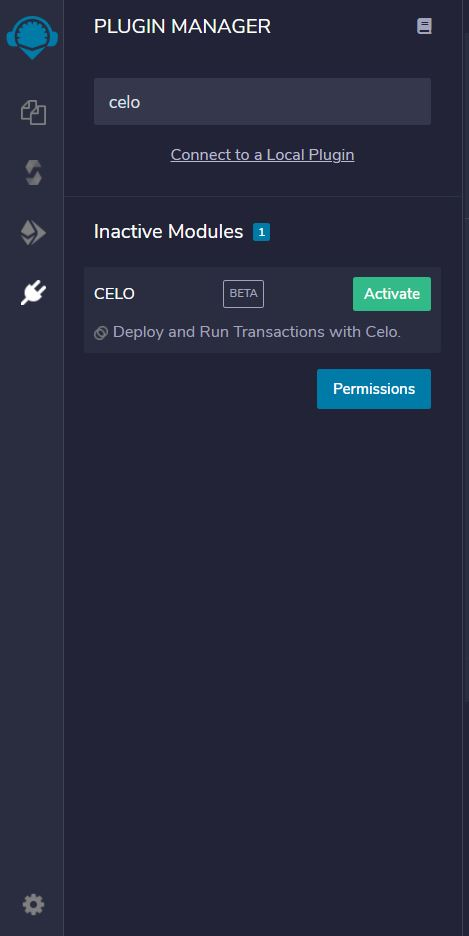
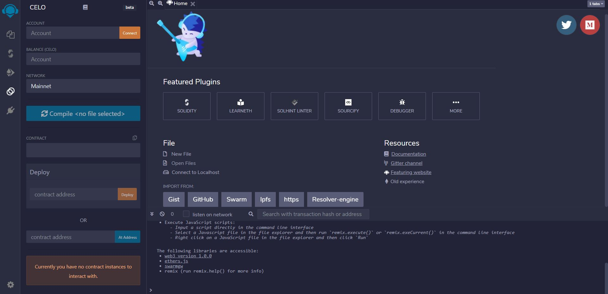

# Introduction

Remix is an in-browser Solidity IDE that’s used to write, compile and debug Solidity code. Solidity is a high-level, contract-oriented programming language for writing smart contracts. Celo is a close cousin of Ethereum so Celo developers can use many of the resources available for ethereum, Remix being one of them. In this tutorial, we will learn how to set up our development environment on Remix so that we can deploy and interact with celo smart contracts on Alfajores testnet and mainnet directly from Remix.

# Prerequisites

1.  Chromium based browser (Example- Google Chrome and Brave)
2.  Celo Extension Wallet can be downloaded from [here](https://chrome.google.com/webstore/detail/celoextensionwallet/kkilomkmpmkbdnfelcpgckmpcaemjcdh?hl=en).
3.  Funds to deploy contracts on the blockchain. Faucet for Alfajores Testnet can be reached from [here](https://celo.org/developers/faucet).
4.  Some previous experience of working with Metamask, Solidity and Remix.

# Adding Celo extension to Remix

Head over to [Remix](https://remix.ethereum.org/) and click on `Plugin Manger`. Here search for **Celo** Plugin and click on **Activate**.



Now we should be able to see **Celo** icon in Icon Tray.

Our development area should look like this.



# Connecting Celo Extension Wallet to Remix

After making sure we have selected Alfajores testnet account in Celo Extension Wallet 1. Click on the **Connect** button in the account tab. 2. Allow celo-extension-wallet to connect to Remix.

Now we will be able to see our Celo Balance in the Balance tab.

**MAKE SURE NETWORK SELECTED IS `Alfajores`**

# Deploying Smart Contract on Alfajores Testnet

We will deploy a very simple smart contract for this tutorial.

Create a new file named `simple_contract.sol` from file explorer and copy the following content.

```solidity
// SPDX-License-Identifier: GPL-3.0

pragma solidity >=0.7.0 <0.8.0;

/**
 * @title Storage
 * @dev Store & retrieve value in a variable
 */
contract Storage {

    uint256 number;

    /**
     * @dev Store value in variable
     * @param num value to store
     */
    function store(uint256 num) public {
        number = num;
    }

    /**
     * @dev Return value
     * @return value of 'number'
     */
    function retrieve() public view returns (uint256){
        return number;
    }
}
```

Let's go back to Celo Plugin and click on **Compile**.

After compiling the successfully, we are ready to deploy our contract.

Click on the **Deploy** button and sign the transaction using your wallet.


Yay! we have successfully deployed our contract to the Alfajores Testnet. We can check the status of the transaction on [Alfajores Blockscout](https://alfajores-blockscout.celo-testnet.org/) by pasting the transaction hash.

Now try playing around with the store and retrieve the functionality of our smart contract. We can use similar instructions for deploying contracts on mainnet by selecting **Celo Main Network** in celo-extension-wallet but we will need real celo in that case.

# Troubleshooting

## Connect button in Celo extension connects to Metamask.

If you have both metamask and Celo extension wallet installed then this problem can arise. You can uninstall metamask and everything will work fine. If you don't want to remove metamask extension then you can work with celo extension wallet in incognito mode. Just click on the Extensions icon on the chrome extension tray, select celo extension wallet and click on options, and select manage extension, Here click on allow In Incognito. Now you are all set to go.

## Celo extension doesn't work on incognito mode

Celo extension requires your cookie permissions to work properly which is not given by default in incognito mode. Head over to `chrome://settings/content/cookies` and select allow all cookies option in general settings.
