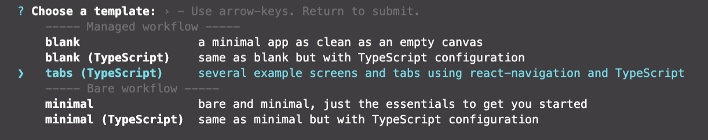
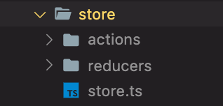
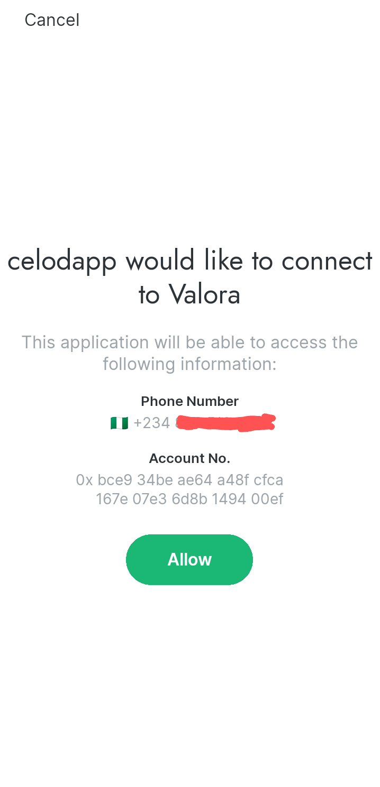

# Introduction

In this tutorial, you will learn how to successfully connect your React Native App to use the Celo Wallet and return a Wallet Address from the Alfajores Wallet.

_To carry out transactions on the Celo Network, you have to connect your Wallet to be able to carry out transactions. When you start out building a dAPP using React Native, you will need this guide to demonstrate how you can install the required libraries to get your dApp up and running._

# Prerequisites

This article assumes that you have basic knowledge of JavaScript (TypeScript) and how to start a React Native App using expo. It is also assumed that you have read the expo documentation and have basic knowledge of the Celo Wallet.

1.  [Celo Wallet](https://docs.celo.org/getting-started/alfajores-testnet/using-the-mobile-wallet)
2.  [React Native using expo](https://docs.expo.io/)
3.  [DappKit](https://docs.celo.org/developer-guide/dappkit/setup)

# Project Setup

You will need node version `^10.13.0`\
Open the Celo documentation and follow the setup instructions:

`expo init $YOUR_APP_NAME`\
We will use the `TypeScript Template >> Tabs`



To use the Celo DappKit, install using: `yarn add @celo/dappkit`\
DAppKit's dependencies require a bit of adjustment to use vanilla Expo. The first are a lot of the Node.js modules that are expected. You can get those mostly by using the following modules:`yarn add node-libs-react-native vm-browserify`

**Important Note!**

The default React Native library that is installed with the expo package will cause your app to break. To fix this, go to the `package.json` file and replace the `react-native` version value:

with this: `^0.63.4` at the time of writing this tutorial. You can always use the most recent version of React Native.

**A Note on the installed Packages**

_node-libs-react-native_: This package provides React Native compatible implementations of Node core modules like stream and http. This is a fork of node-libs-browser with a few packages swapped to be compatible in React Native.

_vm-browserify_ is used to emulate node's vm module for the browser.

**A couple of points to note:**

_The metro.config.js file_

```javascript
const crypto = require.resolve('crypto-browserify');
const url = require.resolve('url/');
module.exports = {
  resolver: {
    extraNodeModules: {
      crypto,
      url,
      fs: require.resolve('expo-file-system'),
      http: require.resolve('stream-http'),
      https: require.resolve('https-browserify'),
      net: require.resolve('react-native-tcp'),
      os: require.resolve('os-browserify/browser.js'),
      path: require.resolve('path-browserify'),
      stream: require.resolve('readable-stream'),
      vm: require.resolve('vm-browserify'),
    },
  },
};
```

This should allow you to build the project, however some dependencies might expect certain invariants on the global environment. For that you should create a file `global.ts` with the content below:

```typescript
export interface Global {
  btoa: any;
  self: any;
  Buffer: any;
  process: any;
  location: any;
}

declare var global: Global;
if (typeof global.self === 'undefined') {
  global.self = global;
}

if (typeof btoa === 'undefined') {
  global.btoa = function (str: string) {
    return new Buffer(str, 'binary').toString('base64');
  };
}

global.Buffer = require('buffer').Buffer;
global.process = require('process');
global.location = {
  protocol: 'https',
};
```

And then add `import './global'` at the top of your `App.js/tsx` file

**Set up Redux**

Install the Redux libraries using the following command:

`yarn add redux redux-thunk redux-logger react-redux`

For TypeScript to run redux logger locally without any errors, you have to add the library `@types/redux-logger` to the devDependencies using the command:

`yarn add @types/redux-logger --dev`

Run the app using: `expo start`

Find documentation how to run your app [here](how-to-successfully-connect-to-a-celo-wallet-with-a-react-native-dapp.md)

# Code

After installing the required libraries, we can then build 2 simple screens in the React Native app.\
The first screen will have one button. The button will be used to sign a User into the dApp.\
The second screen will be the screen that proves that the user has successfully authenticated. The second screen will return the user's wallet address.

**Let's build the Screens:**

```javascript
export default function LoginScreen() {
  return (
    <View style={styles.container}>
      <Button>Connect Wallet</Button>
    </View>
  );
}
```


```javascript
export default function HomeScreen() {
  return (
    <View>
      <Text>wallet address</Text>
      <Text>wallet phone</Text>
    </View>
  );
}
```

**Let's implement the Logic to connect to the Wallet:**

We will use Redux to manage the app state, we have to set up redux actions to make a call to the Celo Wallet and return the result which is then saved in the app global state. To keep your directory devoid of clutter, open a directory to hold the files for the Redux logic:



You can add a file called `constants.js` to the Redux Store Directory. The constants will be used to track the wallet connection process by having the constants as the type of action that was dispatched and then update the state accordingly using a reducer.

```javascript
export const walletConstants = {
  CONNECT_REQUEST: 'WALLET_CONNECT_REQUEST',
  CONNECT_SUCCESS: 'WALLET_CONNECT_SUCCESS',
  CONNECT_FAILURE: 'WALLET_CONNECT_FAILURE',
};
```

Create a `walletsAction.ts` file in the actions folder

```javascript
/*
 The export statement is used to export the only function in the file so that the function can be called using `walletsActions.connect()`
 */
export const walletActions = {
  connect,
};

/*
This function is a simple method provided by Celo to connect to the Valora or Alfajores (for testing) wallet. The `dispatch()` is a redux function which is used to emit actions which we can then listen for in the reducer and update the state accordingly.
*/
function connect() {
  return (dispatch: any) => {
    // This dispatch calls a function that is declared later on in the code.
    dispatch(request('Connecting to wallet'));

    // These variables are needed to connect to the wallet
    // requestId is used to identify the request so we can listen for the same request using the waitForAccoutAuth() function
    // dappName holds the name of the App the wallet will expose as requesting for the detaila
    // callback is the screen we want to send the user to after a successfull connection is made
    const requestId = 'dapplogin';
    const dappName = 'celodapp';
    const callback = Linking.makeUrl('two');

    //T his is from the Celo DappKit library, it fires up the wallet and gets the neccessary information
    requestAccountAddress({
      requestId,
      dappName,
      callback,
    });

    //This function listens for the request above and fire up an action to be handled by a reducer.
    waitForAccountAuth(requestId)
      .then(res => {
        dispatch(success(res));
      })
      .catch(err => {
        dispatch(failure(err));
        dispatch(alertActions.error(err.toString()));
      });
  };

  //These are the function calls which are dispatched when the user makes a request. The state of the app changes with the status of the request response.
  function request(message: string) {
    return { type: walletConstants.CONNECT_REQUEST, message };
  }
  function success(res: object) {
    return { type: walletConstants.CONNECT_SUCCESS, res };
  }
  function failure(error: any) {
    return { type: walletConstants.CONNECT_FAILURE, error };
  }
}
```

The above file is the `walletAction.ts` It contains the logic to connect to the Wallet and saves the response in the global redux state which is accessible to any part of the codebase. The next thing will be to write the reducer logic to handle the app state modification.

Create a `walletReducer.ts` file in the reducers folder

```javascript
//T he initial state of the wallet
const initialState = {
  failed: true,
  connecting: false,
  message: '',
  address: '',
  phone: '',
};

// This is the wallet reducer which takes the state and action as parameters.
// It modifies the state accordingly based on the type of action that it receives from the dispatch calls in the `walletAction.ts` file
export function wallet(state = initialState, action: any) {
  switch (action.type) {
    case walletConstants.CONNECT_REQUEST:
      return {
        connecting: true,
        message: action.message,
      };
    case walletConstants.CONNECT_SUCCESS:
      return {
        failed: false,
        address: action.res.address,
        phone: action.res.phoneNumber,
      };
    case walletConstants.CONNECT_FAILURE:
      return {
        error: action.error,
      };
    default:
      return state;
  }
}
```

Create a `store.ts` file in the store folder

```javascript
// This is where the store is setup. This is where redux updates the state of the store based on the user actions.
import { createStore, applyMiddleware } from 'redux';
import thunkMiddleware from 'redux-thunk';
import { createLogger } from 'redux-logger';

import { rootReducer } from './reducers';

const loggerMiddleware = createLogger();

export const store = createStore(
  rootReducer,
  applyMiddleware(thunkMiddleware, loggerMiddleware),
);
```

Let's update the `App.tsx` file with the Redux Provider.

```javascript
//The Redux Provider wraps around the entire application
export default function App() {
  return <Provider store={store}>...</Provider>;
}
```

Time to update the LoginScreen and the HomeScreen with the Redux Actions:

```javascript
//The useDispatch is a React Redux Hook to dispatch an action creator.
export default function HomeScreen() {
  const dispatch = useDispatch();

  // This function calls up the connect function from the walletAction Action
  const login = () => {
    dispatch(walletActions.connect());
  };

  return (
    <View style={styles.container}>
      <Button onPress={login}>Connect Wallet</Button>
    </View>
  );
}
```

Also update the HomeScreen and the HomeScreen with the Redux Actions:

```javascript
// Here, we connect to the global state with useSelector hook
export default function HomeScreen() {
  const wallet = useSelector((state: any) => state.wallet);

  // We make sure to handle instances where a user tries to navigate to this page without connecting the app to their wallet by making sure to navigate back to the loginscreen if a connection to the wallet hasn't been made yet
  React.useEffect(() => {
    if (wallet.failed) {
      navigation.navigate('Root');
    }
  }, []);

  return (
    <View>
      <Text>{wallet.address}</Text>
      <Text>{wallet.phone}</Text>
    </View>
  );
}
```

Run your app and Login to see the Wallet and Phone number returned to the Home Screen.




# Conclusion

This was a very interesting tutorial. In this tutorial, we learned: How to successfully connect your Redux based React Native App to use the Celo Wallet and return a Wallet Address from the Valora/Alfajores Wallet.

# About the Authors

This tutorial was created by [Segun Ogundipe](https://www.linkedin.com/in/segun-ogundipe) and [Emmanuel Oaikhenan](https://github.com/emmaodia).
