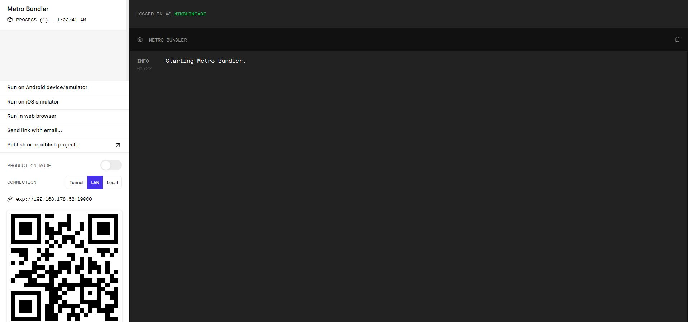
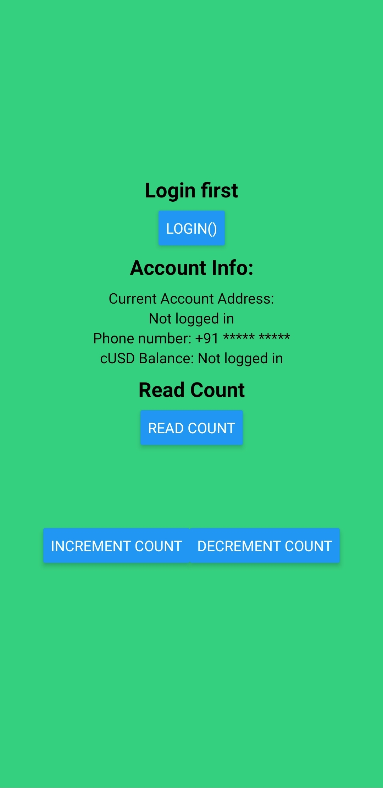
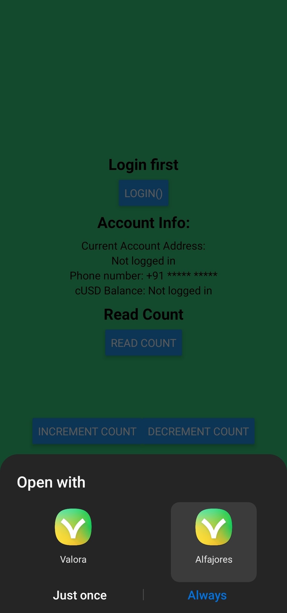
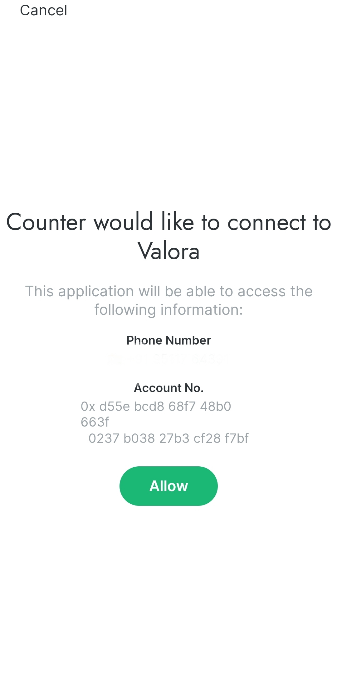
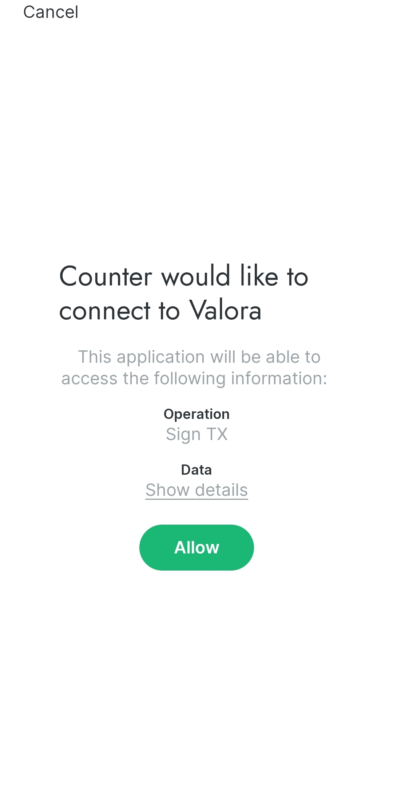
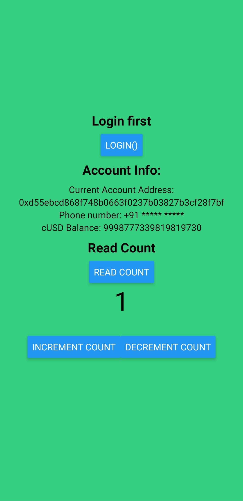

## Introduction

Celo offers mobile friendly development environment which includes mainnet and testnet wallet, mobile SDK. In this tutorial we are going to make counter dapp with expo (react native). This dapp will be able to do following things:

- Get account, phone number from mobile wallet
- Create transaction
- Sign transaction

## Prerequisite

You should have some basic knowledge of javascript, react and solidity. Also, have following requirements installed:

- Node.js
- Yarn Package Manager
- Truffle
- Expo ([cli](https://docs.expo.io/get-started/installation/#1-expo-cli) on your computer and [expo client](https://docs.expo.io/get-started/installation/#2-expo-go-app-for-ios-and) in your mobile)
- Celo mobile wallet (Alfajores)

As we are going to work with mobile app you should install expo mobile client and alfajores (celo testnet wallet for mobile devices). Make sure to fund your wallet with faucet.

## Setup

For setting up our development environment, create a new folder and run following command in that folder:

```bash
truffle unbox critesjosh/celo-dappkit
```

This will download truffle box created by celo team. You can take a look at it [here](https://github.com/critesjosh/celo-dappkit).

Now, we need to install all the dependencies of our smart contract and mobile app.

```javascript
yarn // installs dependencies for truffle
cd client
yarn // isntalls dependencies for expo
```

## Smart Contract

Copy the following smart contract code into `HelloWorld.sol` file inside of `contracts` folder and then rename the file to `Counter.sol`. We will not cover writing smart contracts or the Solidity language in this tutorial. The [Solidity documentation](https://docs.soliditylang.org/) is available as a resource to get started.

```javascript
//SPDX-License-Identifier: MIT

pragma solidity >=0.5.0;
// Above statement specifies the compatible compiler versions
// Learn more about Solidity here: https://docs.soliditylang.org/en/v0.8.3/

// Declare a contract called HelloWorld
contract Counter {

  // Define a unsigned integer called name, initialize it to 'Celo'
  uint256 count = 0;

// Declare a function called getCount.
// The 'public' label means the function can be called internally, by transactions or other contracts.
// The 'view' label indicates that the function does not change the state of the contract.
// The function returns the value of count variable which is of type uint256
  function getCount()
  public
  view returns (uint256) {
    return count;
  }

// Declare a function called incrementCount
// The function increments value of count by 1.
// The 'external' label means the function can only be called from an external source
  function incrementCount()
  external {
      count += 1;
  }

// Declare a function called decrementCount
// The function decrements value of count by 1.
// The 'external' label means the function can only be called from an external source
  function decrementCount()
  external {
      require(count > 0, "Count is zero");
      count -= 1;
  }
}
```

## Deploy smart contract

For deployment, we need to create a migration for the counter smart contract. Inside of the `migrations` folder go to `2_deploy_contracts.js` and change every `HelloWorld` to `Counter`.

Run following command in terminal:

```javascript
yarn account
```

This will display the account address from which we will deploy the Solidity smart contract.

```javascript
xQc@RecycleBin MINGW64 ~/Documents/blockchain/celoDappCounter
$ yarn account
yarn run v1.22.4
$ node utils/createAccount.js
Account address: 0xbF0eC2F761F2C3303AE5f9695eE79d2EECdb2579
Done in 2.78s.
```

To be able to afford the deployment costs, it will be necessary to visit the [Celo developers faucet](https://celo.org/developers/faucet) and request some tokens.

We need to make one more change in `truffle-config.js`. Change `web3` that file to following:

```javascript
const web3 = new Web3(
  'https://celo-alfajores--rpc.datahub.figment.io/apikey/<YOUR_API_KEY>/',
);
```

Now, we can run Truffle to deploy the smart contract to Celo.

```javascript
truffle migrate --network alfajores
```

After the deployment is completed, you will see similar output in the terminal:

```javascript
xQc@RecycleBin MINGW64 ~/Documents/blockchain/celoDappCounter
$ truffle migrate --network alfajores

Compiling your contracts...
===========================
Account address: 0xbF0eC2F761F2C3303AE5f9695eE79d2EECdb2579
> Compiling .\contracts\HelloWorld.sol
> Compiling .\contracts\Migrations.sol
> Artifacts written to C:\Users\xQc\Documents\blockchain\celoDappCounter\client\contracts
> Compiled successfully using:
   - solc: 0.5.16+commit.9c3226ce.Emscripten.clang


Starting migrations...
======================
> Network name:    'alfajores'
> Network id:      44787
> Block gas limit: 0 (0x0)


1_initial_migration.js
======================

   Deploying 'Migrations'
   ----------------------
   > transaction hash:    0x0e801fb8dd2178d5affe2a149282d2b2501a4a31b01c9abd2d2582e3154972e1
   > Blocks: 1            Seconds: 5
   > contract address:    0x9be45eb8F9d51F52a79368429A250C64E553a04E
   > block number:        4607994
   > block timestamp:     1618390036
   > account:             0xbF0eC2F761F2C3303AE5f9695eE79d2EECdb2579
   > balance:             9.9874644
   > gas used:            163575 (0x27ef7)
   > gas price:           20 gwei
   > value sent:          0 ETH
   > total cost:          0.0032715 ETH


   > Saving migration to chain.
   > Saving artifacts
   -------------------------------------
   > Total cost:           0.0032715 ETH


2_deploy_contracts.js
=====================

   Deploying 'Counter'
   ----------------------
   > transaction hash:    0x02bda4034198353421bc141d89e7b4437e4ac7d0eb2590b1887bb169e3af707d
   > Blocks: 1            Seconds: 5
   > contract address:    0xCb218976Ec0Dd771d69a559AffDb3FeEfE095ADa
   > block number:        4607997
   > block timestamp:     1618390051
   > account:             0xbF0eC2F761F2C3303AE5f9695eE79d2EECdb2579
   > balance:             9.98410176
   > gas used:            126391 (0x1edb7)
   > gas price:           20 gwei
   > value sent:          0 ETH
   > total cost:          0.00252782 ETH


   > Saving migration to chain.
   > Saving artifacts
   -------------------------------------
   > Total cost:          0.00252782 ETH


Summary
=======
> Total deployments:   2
> Final cost:          0.00579932 ETH
```

There should be two additional files now, inside of the `contracts` subdirectory of `client`: `Counter.json` and `Migrations.json`.

## Mobile Dapp

As we have completed our smart contract part of tutorial, we can move to creating mobile dapp.

Run

```javascript
cd client
```

Before starting on the UI of our dapp, we will need to change some files.

Delete `assets` folder in `client` and remove `icon` and `splash` field from `app.json`

Go to `root.js` and change the `provide` to include a valid DataHub API key and RPC endpoint URL. Make sure the URL contains the trailing forward slash after the API key has been inserted

```javascript
export const provider =
  'https://celo-alfajores--rpc.datahub.figment.io/apikey/<YOUR_API_KEY>/';
```

We will go over the React Native portions of the code, but first you need to clear the contents of `App.js` and replace it with the following:

```javascript
import React from 'react';
import './global';
import { web3, kit } from './root';
import { StyleSheet, Text, Button, View } from 'react-native';
import {
  requestTxSig,
  waitForSignedTxs,
  requestAccountAddress,
  waitForAccountAuth,
  FeeCurrency,
} from '@celo/dappkit';
import { toTxResult } from '@celo/connect';
import * as Linking from 'expo-linking';
import CounterContract from './contracts/Counter.json';

export default class App extends React.Component {
  // Set the defaults for the state
  state = {
    address: 'Not logged in',
    phoneNumber: 'Not logged in',
    cUSDBalance: 'Not logged in',
    CounterContract: {},
    count: '',
  };

  // This function is called when the page successfully renders
  componentDidMount = async () => {
    // Check the Celo network ID
    const networkId = await web3.eth.net.getId();

    // Get the deployed HelloWorld contract info for the appropriate network ID
    const deployedNetwork = CounterContract.networks[networkId];

    // Create a new contract instance with the HelloWorld contract info
    const instance = new web3.eth.Contract(
      CounterContract.abi,
      deployedNetwork && deployedNetwork.address,
    );
    // Save the contract instance
    this.setState({ CounterContract: instance });
  };

  login = async () => {
    // A string you can pass to DAppKit, that you can use to listen to the response for that request
    const requestId = 'login';

    // A string that will be displayed to the user, indicating the DApp requesting access/signature
    const dappName = 'Counter';

    // The deeplink that the Celo Wallet will use to redirect the user back to the DApp with the appropriate payload.
    const callback = Linking.makeUrl('/my/path');

    // Ask the Celo Alfajores Wallet for user info
    requestAccountAddress({
      requestId,
      dappName,
      callback,
    });

    // Wait for the Celo Wallet response
    const dappkitResponse = await waitForAccountAuth(requestId);

    // Set the default account to the account returned from the wallet
    kit.defaultAccount = dappkitResponse.address;

    // Get the stabel token contract
    const stableToken = await kit.contracts.getStableToken();

    // Get the user account balance (cUSD)
    const cUSDBalanceBig = await stableToken.balanceOf(kit.defaultAccount);

    // Convert from a big number to a string
    let cUSDBalance = cUSDBalanceBig.toString();

    // Update state
    this.setState({
      cUSDBalance,
      isLoadingBalance: false,
      address: dappkitResponse.address,
      phoneNumber: dappkitResponse.phoneNumber,
    });
  };

  getCount = async () => {
    // Read the count stored in the Counter contract
    let _count = await this.state.CounterContract.methods.getCount().call();

    // Update state
    this.setState({ count: _count });
  };

  increment = async () => {
    const requestId = 'increment_count';
    const dappName = 'Counter';
    const callback = Linking.makeUrl('/my/path');

    // Create a transaction object to increment count
    const txObject = await this.state.CounterContract.methods.incrementCount();

    // Send a request to the Celo wallet to send an update transaction to the Counter contract
    requestTxSig(
      kit,
      [
        {
          from: this.state.address,
          to: this.state.CounterContract.options.address,
          tx: txObject,
          feeCurrency: FeeCurrency.cUSD,
        },
      ],
      { requestId, dappName, callback },
    );

    // Get the response from the Celo wallet
    const dappkitResponse = await waitForSignedTxs(requestId);
    const tx = dappkitResponse.rawTxs[0];

    // Get the transaction result, once it has been included in the Celo blockchain
    let result = await toTxResult(
      kit.web3.eth.sendSignedTransaction(tx),
    ).waitReceipt();

    console.log(
      `Counter contract increment count transaction receipt: `,
      result,
    );

    // Update count on UI
    await this.getCount();
  };

  decrement = async () => {
    const requestId = 'increment_count';
    const dappName = 'Counter';
    const callback = Linking.makeUrl('/my/path');

    // Create a transaction object to decrement the count
    const txObject = await this.state.CounterContract.methods.decrementCount();

    // Send a request to the Celo wallet to send an update transaction to the Counter contract
    requestTxSig(
      kit,
      [
        {
          from: this.state.address,
          to: this.state.CounterContract.options.address,
          tx: txObject,
          feeCurrency: FeeCurrency.cUSD,
        },
      ],
      { requestId, dappName, callback },
    );

    // Get the response from the Celo wallet
    const dappkitResponse = await waitForSignedTxs(requestId);
    const tx = dappkitResponse.rawTxs[0];

    // Get the transaction result, once it has been included in the Celo blockchain
    let result = await toTxResult(
      kit.web3.eth.sendSignedTransaction(tx),
    ).waitReceipt();

    console.log(
      `Counter contract decrement count transaction receipt: `,
      result,
    );

    // Update count on UI
    await this.getCount();
  };

  render() {
    return (
      <View style={styles.container}>
        <Text style={styles.title}>Login first</Text>
        <Button title="login()" onPress={() => this.login()} />
        <Text style={styles.title}>Account Info:</Text>
        <Text>Current Account Address:</Text>
        <Text>{this.state.address}</Text>
        <Text>Phone number: +91 ***** *****</Text>
        <Text>cUSD Balance: {this.state.cUSDBalance}</Text>

        <Text style={styles.title}>Get Count</Text>
        <Button title="Get Count" onPress={() => this.getCount()} />
        <Text style={styles.count}>{this.state.count}</Text>
        <View style={styles.buttonContainer}>
          <Button
            style={styles.button}
            title="Increment count"
            onPress={() => this.increment()}
          />
          <Button
            style={styles.button}
            title="Decrement count"
            onPress={() => this.decrement()}
          />
        </View>
      </View>
    );
  }
}

const styles = StyleSheet.create({
  container: {
    flex: 1,
    backgroundColor: '#35d07f',
    alignItems: 'center',
    justifyContent: 'center',
  },
  title: {
    marginVertical: 8,
    fontSize: 20,
    fontWeight: 'bold',
  },
  buttonContainer: {
    flexDirection: 'row',
    paddingVertical: 30,
    alignItems: 'center',
    justifyContent: 'center',
  },
  count: {
    fontSize: 40,
  },
});
```

We will go through code method by method.

Here we are using class component of react. These classes have states in which we can store the data.

In `state` variable of `App` class we are storing our data.

Then `componentDidMount` method is creating contract instance so that we can call methods of the smart contract. After creating the smart contract instance we are storing it in state variable `CounterContract`.

Now, we will be looking at methods given by dapp kit in `login` method of our `App` class.

Here we are setting 3 variables `requestId`, `dappName`, and `callback`.

- `requestId`: used to listen response of our request
- `dappName`: name will show up while getting permission from user
- `callback`: deeplink that will use to redirect user back to dapp

While calling `requestAccountAddress`, we are passing above 3 parameters.

Now, user will be redirected to celo wallet to get account details which we will use to perform other actions in our dapp.

After getting account details from celo wallet, we will set those in our state variables.

As we are creating counter, we need to get the count. `getCount` method does that. It calls `getCount` method of our contract and stores count in state.

Now, we will increment the count with `incrementCount` method. For this we need to set same three variables `requestId`, `dappName`, and `callback`.

For incrementing count we will create transaction. But first we need to create transaction object `txObject` and then pass that to celo wallet using `requestTxSig`.

`requestTxSig` method takes three parameters:

- kit: contract kit instance
- txParams: parameters required for transaction
- meta: object for dappkit for connecting with celo wallet

This method will create a transaction to increment the value of count. The generated transaction hash will be logged to the console.

After this we are waiting for transaction to complete and then we are updating value of count.

`decrementCount` method is similar to `incrementCount` method but instead of calling the `incrementCount` function of smart conttract, we are calling `decrementCount` function.

Remaining method is `render` which takes care of UI. Also, we have `style` constant of end which is used for styling of our component.

Now, only thing remaining do to run our mobile application using expo client on our mobile deice.

Run

```javascript
yarn start
```

This will open browser window like you see here



There you can see QR code at bottom left scan it with QR code scanner from expo client in your mobile device.

It will open up our dapp. It should look like this



Now we can go through process of incrementing the counter. First login by pressing login button. It will give us option to select our wallet of choice



Select Alfajores wallet.

After selecting the wallet, it will redirect us to the actual wallet and ask for permission.



Click on the allow button to give information to our dapp.

Now that we have access, we will be redirected once again to our dapp where the account information will be displayed now in place of the `Not logged in` text.


We should now increment the count, which will redirect us to the wallet to sign a transaction.



Click on allow. After reaching our dapp screen we can see the count has increased by 1!



Congratulations for completing this tutorial, Introduction to DappKit! We have now created a functioning mobile dapp on the Celo testnet. This same methodology can be applied to the Celo mainnet as well, to produce functioning distributed applications.

## Conclusion

In this tutorial, we have covered some parts of DappKit, how it connects with the Celo mobile wallet, how we can connect our dapp with the mobile wallet and how to do some basic things like getting account addresses, balance of accounts, phone number connected to Celo mobile wallet, and signing transactions.

Thank you for following along with this tutorial, now take this knowledge and build amazing things on Celo!

## About the author

This tutorial was created by [Nikhil Bhintade](https://www.linkedin.com/in/nikbhintade). Nikhil is a student (BE, Electrical) and crypto enthusiast who's learning all about the world of web3 and want to document what he learned.
