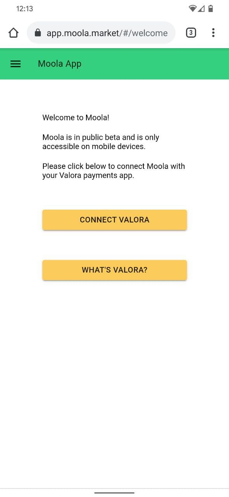
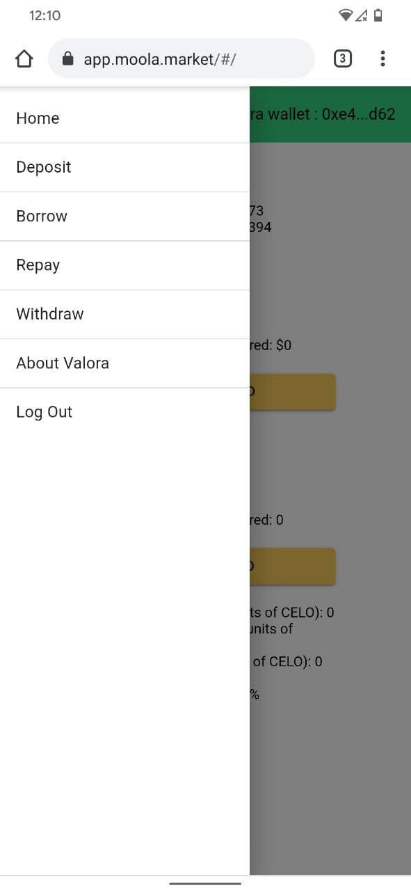
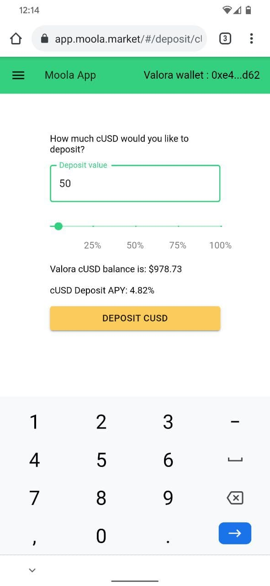
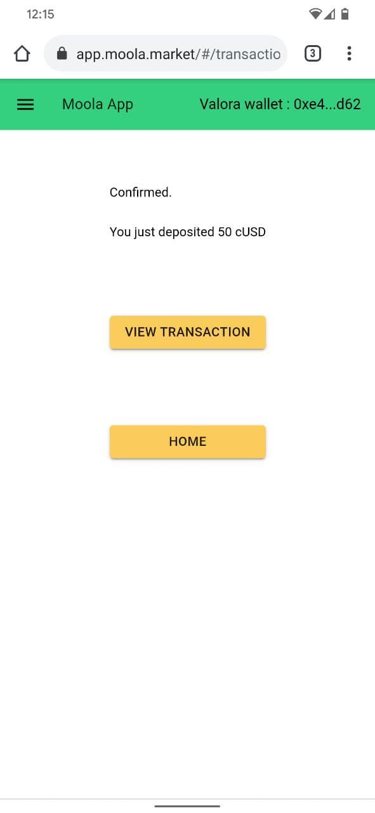
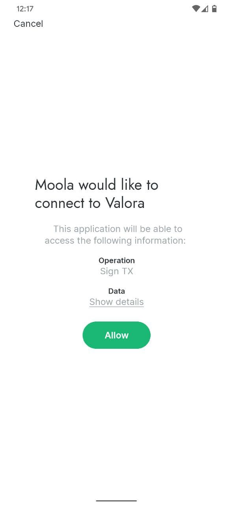
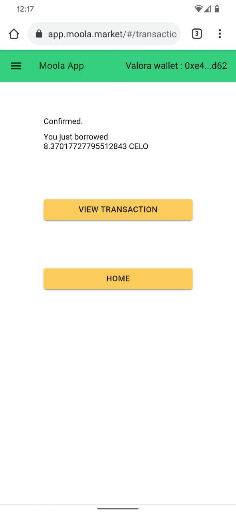
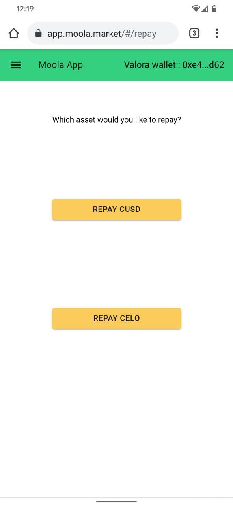
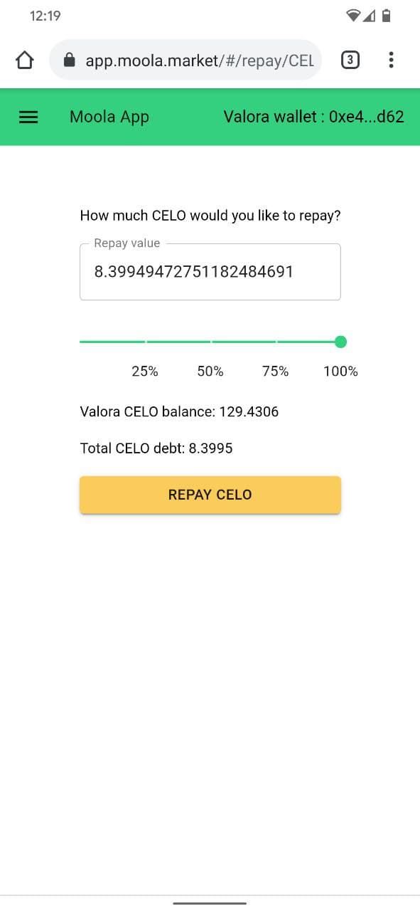
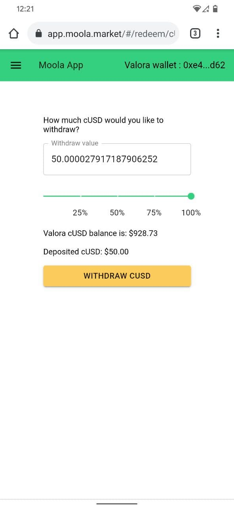
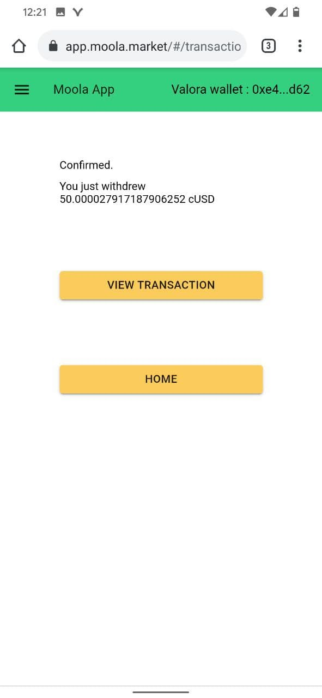

## Introduction

Moola is an open-source protocol for decentralized money markets on the Celo blockchain. Moola, which is a fork of the open-source Aave protocol v1, enables liquidity providers to earn compound interest on their Celo Dollars(cUSD) or CELO which is paid by borrowers who can take out collateralized loans with variable or stable interest rates.

In this tutorial we will learn how we can use Moola's Money Market to 1. Deposit Collateral (cUSD or CELO) 2. Borrow assets (cUSD or CELO) 3. Repay the loan that we took 4. Withdraw our Collateral back to our custodial wallet

We need a custodial wallet with some funds that we can use to interact with **Moola**. We will be using the [`VALORA`](https://valoraapp.com/) app that is a custodial wallet with beautiful UI where we can store our Celo or cUSD.

## Prerequisites

1.  Valora App
2.  Funds to use as collateral on Moola

## Connecting Valora with Moola

After we have set up our Valora, we need to head over to [Moola](https://app.moola.market/#/welcome). We will be presented with a screen like this.



Click on the **Connect Valora** button and then press **Allow**.

Now Moola has view access to our funds which we have deposited on Valora App.


We can deposit cUSD or CELO using our Valora app and start earning compound interest. Interest rates are variable and adjust based on demand for borrowing.\
When demand to borrow the asset is low, rates are low. When demand to borrow the asset is high, rates are high.

Now there are a couple of things to give attention to: 1. **Deposit APY(annual percentage yield)** - This is the amount of interest that the user will get if they deposit collateral. 2. **Borrow APR(Annual Percentage Rate)** - This is the cost borrower pay each year to borrow collateral. 3. **Maximum Loan to Value (75%)** - This is amount a user can borrow by depositing collateral. For example - User who has deposited 100 cUSD can borrow 75cUSD or Celo of equivalent worth on that collateral. Keep in mind that this loan will have interest associated with it. 4. **Liquidation Threshold (80%)** - Moola always make sure that users have healthy LTV(Loan to value) ratio. Let's suppose a user depositied Celo worth $100 and borrowed 75 cUSD. Now the price of Celo decreased and the deposited Celo is now worth less than $100. This means that LTV is more than 75%. This is not acceptable to Moola and user will be at a risk of liquidation. If LTV ratio falls below the Liquidation Threshold (80%) then a portion of user's collateral can be liquidated at a discount to bring the LTV back down below 75%. User can deposit more collateral to save themselves from being liquidated. 5. **Health Factor** - This indicates the health of user's loan. It should always be `SAFE`.

## How to use Moola

Moola offers various functionalities which can be seen here.



### Deposit

Let's start by depositing `50cUSD` to Moola. Go to the _Deposit_ tab and enter the amount.



Click on `Deposit cUSD`


Sign the transaction by using **Allow**



Our transaction got confirmed.

Now our home screen should look something like this.


### Borrow

Now we know that we can borrow a maximum of 75% of our collateral. In our case that would be

```text
0.75 (75%) * 11.182 (value of 50cUSD in terms of Celo at the time of writing) = ~8.3702
```

Let's go to the Borrow tab and borrow some Celo.


Sign the transaction





our transaction got confirmed.

Our Home screen should look like this.


### Repay

We have to repay the Celo so that we access our deposited cUSD. To repay the loan we took, lets head over to `Repay` tab.

Select `Repay Celo`



Enter the amount, for this case, we will repay all our debt.



Click on `Repay Celo`


Our transaction got confirmed.

### Withdraw

Now that we have repay our debt , we can withdraw our cUSD if we want to. Let's withdraw our cUSD to Valora.

Head over to `Withdraw` tab and select `Withdraw CUSD`


Let's withdraw all our cUSD. We can see that Moola has already added the interest that got accumulated during the period our cUSD was deposited. Enter the amount and click on `Withdraw CUSD`.





Our transaction got confirmed. This marks the end of this tutorial. In this tutorial we learned how we can use **Moola** and participate in DeFi on Celo blockchain.

## Use cases

Before participating in any DeFi application you should know the risk behind it. Finance is just a way to transfer the risk. But we can use these tools to our advantage if we know how to manage the risk. Some of the most popular use cases can be:

## Bullish on CELO

If you think the price of CELO will go up and you want to take on leverage then the steps are:

1.  Deposit CELO
2.  Borrow cUSD
3.  Sell cUSD / Buy CELO (via Mento, AMM of Celo Blockchain)
4.  Deposit CELO

## Bearish on CELO

If you're attempting to get into a short position in the cUSD price of CELO because you think the price of CELO will go down then the steps are:

1.  Deposit cUSD
2.  Borrow CELO
3.  Sell CELO / Buy cUSD (via Mento)
4.  Deposit cUSD

## Conclusion

Moola is just getting started and is on the right path. Moola is experiencing exponential growth with over $1M locked. Many new features like Flash loans and uncollateralized loans are on the roadmap of this promising startup. Moola also received a funding of $1.4M in March,2021 which will help Moola accelerate it's growth. Moola will also release it's new UI soon.

## About the author

This tutorial was created by [Deepanshu Hooda](https://github.com/gitofdeepanshu/), who is a computer science junior and a blockchain developer with high interest in finance. He spends most of the his time studying new DeFi protocols and loves to travel.
