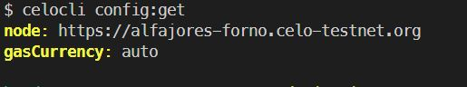
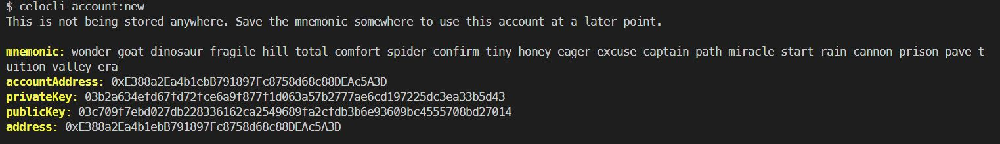

# Introduction

This tutorial is designed for developers who have deployed dapps on ethereum before and now want to learn how to do the same with the Celo blockchain.

One of the biggest advantages of using Celo is that it is EVM compatible which means you can easily redeploy your dapps from ethereum blockchain to celo with a few changes in code (if at all required) and just changing the configuration file. In this tutorial, we will learn to do the same.

We will be redeploying the famous **Pet Shop** dApp. A complete walkthrough of pet shop is outside the scope of this tutorial, but you can find it [here](https://www.trufflesuite.com/tutorials/pet-shop). The current tutorial is not limited to just this example and can be used as a guide to redeploy any other Ethereum smart contract to Celo.

# Getting Started

Start by cloning the following repository

```text
git clone https://github.com/trufflesuite/pet-shop-tutorial
```

After cloning the repository, we have all the contracts required to deploy **Pet Shop** Dapp.

Let's install all the dependencies of the dapp by using

```text
npm install
```

Now we have all the tools to start on your journey.

# Using the Celo CLI

First, we need to find a way to interact with Celo blockchain. For this tutorial, we will be using `Celo CLI` to do the same.

```text
npm install -g @celo/celocli
```

CeloCLI makes it extremely easy to interact with Celo Blockchain. It is a very handy tool for all celo developers. More information about CeloCLI can be found [here](https://docs.celo.org/celo-owner-guide/quick-start).

After installing it, we need to make sure it is pointing to the correct endpoint. Let's check that by

```text
celocli config:get
```



Our node should be pointing to **node:** <https://alfajores-forno.celo-testnet.org>

In case your endpoint is something else, you can change it by using

```text
celocli config:set --node https://alfajores-forno.celo-testnet.org
```

Now our celocli is connected to `Alfajores Testnet`. We need an account to work with. Let's use celocli for this. Use the following command to get a new account on testnet.

```text
celocli account:new
```

Our terminal should look something like this. (Everyone will have different values though!)

 As we don't want anybody to see our private key, it is an accepted practice among developers to use \`.env\` files to set up environment variables. During the time of uploading our project to any open source platform, we hide these files by adding them to \`.gitignore\` Create a .env file in the same directory and add the following line

```text
PRIVATE_KEY=<YOUR_PRIVATE_KEY>
```

We will use this private key later on in this tutorial. Now that we have an account to work with, let's get some funds for signing transactions on the blockchain. Use Alfajores testnet faucet which can be found [here](https://celo.org/developers/faucet). To check if we have received funds, use

```text
celocli account:balance <YOUR_PUBLIC_ADDRESS>
```


# Changing truffle-config.js

To deploy our dapp to the Celo blockchain, all we need to do now is to change the `truffle-config.js` so that it can work with Celo blockchain. We will be taking help of `ContractKit` and `Wallet-local` made by Celo. We also need to install `dotenv` to use our Private Key.

To install all of these, use

```text
npm i --save @celo/contractkit @celo/wallet-local dotenv
```

`ContractKit` is a library to help developers and validators to interact with the celo-blockchain and is well suited to developers looking for an easy way to integrate Celo Smart Contracts within their applications. `Wallet-Local` provides a local wallet instance to connect with contractKit. the `dotenv` file will be used to import Private Key that we added to **.env** file above into truffle-config without hardcoding it.

Paste the following code into our `truffle-config.js` file:

```javascript
// dotenv is used to import all the environment variables into the .env file
require('dotenv').config();
const ContractKit = require('@celo/contractkit');
const { LocalWallet } = require('@celo/wallet-local');

const PRIVATE_KEY = process.env.PRIVATE_KEY;
const testnetURL = 'https://alfajores-forno.celo-testnet.org';
const localWallet = new LocalWallet();

/*
ContractKit is used to access web3 object to interact with node's Json RPC API.
It takes two arguments, first being a network URL such as the testnet URL and secondly, a wallet instance for signing transactions.
*/

const kit = ContractKit.newKit(testnetURL, localWallet);

async function setConfig() {
  kit.addAccount(PRIVATE_KEY);
  kit.defaultAccount = localWallet.getAccounts()[0];
}
setConfig();
module.exports = {
  networks: {
    testnet: {
      provider: kit.connection.web3.currentProvider, // to connect with Alfajores testnet
      network_id: 44787,
    },
  },
};
```

Now our configuration file is all set to work with the Celo Blockchain.

Let's compile our smart contracts using

```text
truffle compile
```

and after compiling is completed, let's migrate our smart contracts to Celo.

```text
truffle migrate --network testnet
```

Congratulations! With that, we have deployed our Ethereum DApp to Celo.

Now we can use the same process to deploy any DApp we want to Celo. Don't let anything stop you, try cloning any project on ethereum and deploy it on Celo. Celo has wonderful opportunities for new projects. Join our community [Discord](https://figment.io/devchat) to discuss it with other developers.
