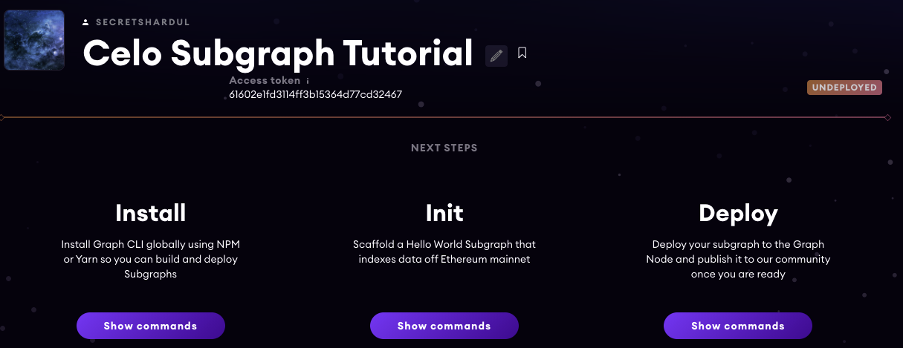
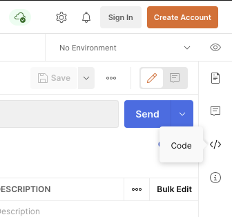
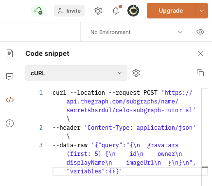

<Embed
  url="https://www.youtube.com/watch?v=OgIiySTRGQE"
  caption="Subgraphs for Celo video tutorial"
/>

## What is the Graph Protocol?

The Graph protocol lets you create GraphQL APIs called subgraphs for your smart contracts. Sounds like a lot? We'll break it down.

## What is GraphQL?

GraphQL is a query language for web APIs. Instead of having multiple dumb endpoints, we can have a smart GraphQL endpoint which:

- Lets you view the API schema. Schemas are auto-generated, so say goodbye to writing swagger files!
- Lets you fetch exactly what you want in a single query.

<Embed
  url="http://www.youtube.com/watch?v=eIQh02xuVw4"
  caption="GraphQL in 100 seconds"
/>

## I'm able to read my contract data. Why use another protocol?

Querying a blockchain directly needs additional setup. For this you need access to a Celo node, plus a frontend library like `web3.js`.

In contrast, you can directly query GraphQL from your app or command line.

## How does it work?

1.  Blockchains store a permanent history of transactions. Graph protocol indexes the transactions for our contract, similar to how Google indexes the internet. We can query these transactions through a GraphQL schema.
2.  Smart contracts let us define and trigger events. For example, when we transfer ERC20 tokens to someone, a `transfer` event is triggered. Graph protocol listens to these events in real time and updates it's data. This way, we always get the latest data.
3.  The Graph protocol is decentralized. We don't need to worry about API server going down.

## Show me the code!

**Resources:**

1.  [Source code](https://github.com/secretshardul/the-graph-celo)
2.  [Deployed subgraph](https://thegraph.com/explorer/subgraph/secretshardul/celo-subgraph-tutorial)
3.  [Deployed Celo contract](https://explorer.celo.org/address/0x56d04968f959ae609a32c8eadb8cd3db90490a7f/transactions)

We will create a subgraph for a gravatar contract deployed on the Celo mainnet. This is a fork of the official Graph tutorial with modifications made for Celo.

- Visit the Graph Protocol website and sign in with Github.

- Go to your dashboard and click on **Add Subgraph**. Fill in the required details and click on **Create subgraph**.

  

- Follow the steps shown on the dashboard with a small variation.



1.  Install Graph CLI using NPM or Yarn.

```bash
npm install -g @graphprotocol/graph-cli
```

**OR**

```bash
yarn global add @graphprotocol/graph-cli
```

2.  Initialize the Celo starter project. We have diverged from the instructions because we're building on Celo.

```bash
git clone https://github.com/secretshardul/the-graph-celo.git
```

**Install node dependencies using**

```bash
yarn
```

**OR**

```bash
npm install
```

3.  Deploying

```bash
## Authenticate Graph CLI. The access token is displayed on your subgraph dashboard.
graph auth https://api.thegraph.com/deploy/ <ACCESS_TOKEN>

## Deploy to The Graph
graph deploy \
    --debug \
    --node https://api.thegraph.com/deploy/ \
    --ipfs https://api.thegraph.com/ipfs/ \
    <SUBGRAPH_NAME>
```

You should get an output similar to

```bash
✔ Apply migrations
✔ Load subgraph from subgraph.yaml
Compile data source: Gravity => build/Gravity/Gravity.wasm
✔ Compile subgraph
Copy schema file build/schema.graphql
Write subgraph file build/Gravity/abis/Gravity.json
Write subgraph manifest build/subgraph.yaml
✔ Write compiled subgraph to build/
Add file to IPFS build/schema.graphql
                .. QmbSFRGGvHM7Cn8YSjDL41diDMxN4LQUDEMqaa5VVc5sC4
Add file to IPFS build/Gravity/abis/Gravity.json
                .. QmajZTadknSpgsCWRz9fG6bXFHdpVXPMWpx9yMipz3VtMQ
Add file to IPFS build/Gravity/Gravity.wasm
                .. QmbK8bwncci52cstF3P8Q8i4oGjrMt1pUqdv5Uf1VXqXdb
✔ Upload subgraph to IPFS

Build completed: QmXWN5HVtKsRdCKc7HUthjvuyPiwkCNeYJQknsAa5AqQ8K

Deployed to https://thegraph.com/explorer/subgraph/secretshardul/celo-subgraph-tutorial

Subgraph endpoints:
Queries (HTTP):     https://api.thegraph.com/subgraphs/name/secretshardul/celo-subgraph-tutorial
Subscriptions (WS): wss://api.thegraph.com/subgraphs/name/secretshardul/celo-subgraph-tutorial
```

4.  Refresh the page to see your deployed subgraph. It can take some hours for data to be synced, after which our queries will return the desired results.


5.  Time to run a GraphQL query! A default query is given which gets data of the first five gravatars. Press the run button. Here's the query again for reference:

```graphql
## Get details of first five gravatars
{
  gravatars(first: 5) {
    id
    owner
    displayName
    imageUrl
  }
}
```

You will get a result similar to

```json
{
  "data": {
    "gravatars": [
      {
        "displayName": "Carl",
        "id": "0x0",
        "imageUrl": "https://thegraph.com/img/team/team_04.png",
        "owner": "0x243566e830705ce95b09ae66705c8b291b333310"
      }
    ]
  }
}
```

**Note**: Wait for the syncing to complete, otherwise you will see an empty result.

6.  How to use subgraphs in our apps? I've created a Postman public workspace for demonstration. [Visit the Celo subgraph workspace](https://www.postman.com/cloudy-firefly-3880/workspace/the-graph-celo/request/9305744-4a75a867-c2b3-446b-be18-864c7e6550eb). You can try out the predefined queries by pressing the run button.

Press the code button on the right side. Select the language of your choice to get the generated code. For example we get this snippet for cURL. Paste it in your terminal to see the result.

**Postman generate code button**



**Postman generated code results**



```bash
curl --location --request POST 'https://api.thegraph.com/subgraphs/name/secretshardul/the-graph-celo' \
    --header 'Content-Type: application/json' \
    --data-raw '{"query":"{\n  gravatars(first: 5) {\n    id\n    owner\n    displayName\n    imageUrl\n  }\n}\n","variables":{}}'
```

## Explanation

We have a pre-deployed contract `GravatarRegistry`.

- Gravatar stands for 'Globally Recognized Avatar'. They are profile pictures that are guaranteed to be unique. Did you know that the default avatars on GitHub and StackOverflow are actually gravatars?

This smart contract crates a registry for Gravatars. It has the following features:

- Create new gravatar
- View gravatars of other users
- Update name and image of your gravatar

```javascript
pragma solidity ^0.4.0;

contract GravatarRegistry {
    event NewGravatar(uint id, address owner, string displayName, string imageUrl);
    event UpdatedGravatar(uint id, address owner, string displayName, string imageUrl);

    struct Gravatar {
        address owner;
        string displayName;
        string imageUrl;
    }

    Gravatar[] public gravatars;

    mapping (uint => address) public gravatarToOwner;
    mapping (address => uint) public ownerToGravatar;

    function createGravatar(string _displayName, string _imageUrl) public {
        require(ownerToGravatar[msg.sender] == 0);
        uint id = gravatars.push(Gravatar(msg.sender, _displayName, _imageUrl)) - 1;

        gravatarToOwner[id] = msg.sender;
        ownerToGravatar[msg.sender] = id;

        emit NewGravatar(id, msg.sender, _displayName, _imageUrl);
    }

    function getGravatar(address owner) public view returns (string, string) {
        uint id = ownerToGravatar[owner];
        return (gravatars[id].displayName, gravatars[id].imageUrl);
    }

    function updateGravatarName(string _displayName) public {
        require(ownerToGravatar[msg.sender] != 0);
        require(msg.sender == gravatars[ownerToGravatar[msg.sender]].owner);

        uint id = ownerToGravatar[msg.sender];

        gravatars[id].displayName = _displayName;
        emit UpdatedGravatar(id, msg.sender, _displayName, gravatars[id].imageUrl);
    }

    function updateGravatarImage(string _imageUrl) public {
        require(ownerToGravatar[msg.sender] != 0);
        require(msg.sender == gravatars[ownerToGravatar[msg.sender]].owner);

        uint id = ownerToGravatar[msg.sender];

        gravatars[id].imageUrl =  _imageUrl;
        emit UpdatedGravatar(id, msg.sender, gravatars[id].displayName, _imageUrl);
    }

}
```

Note the events `NewGravatar` and `UpdatedGravatar` in the code above. The Graph protocol updates its index with fresh data whenever events are fired.
Look at [subgraph.yaml](https://github.com/secretshardul/the-graph-celo/blob/master/subgraph.yaml), which is the starting point for creating subgraphs. It contains the following information:

- Subgraph description and source code repository
- GraphQL schema file location
- Contract related data: contract name, network, address and ABIs
- Events to listen to. We are listening to `NewGravatar(uint256,address,string,string)` and `UpdatedGravatar(uint256,address,string,string)` events.
- **Event handlers**: Graph protocol reads the transaction data whenever a registered event is fired. This raw transaction data must be processed before it can be useful. Event handlers specify what data points must be read, and are responsible for populating this data into the GraphQL schema. Note the event handlers `handleNewGravatar` and `handleUpdatedGravatar`.

```yaml
specVersion: 0.0.2
description: Gravatar contract subgraph for Celo
repository: https://github.com/secretshardul/the-graph-celo
schema:
file: ./schema.graphql
dataSources:
- kind: ethereum/contract
    name: Gravity
    network: celo
    source:
    address: '0x56d04968f959ae609a32c8eadb8cd3db90490a7f'
    abi: Gravity
    mapping:
    kind: ethereum/events
    apiVersion: 0.0.4
    language: wasm/assemblyscript
    entities:
        - Gravatar
    abis:
        - name: Gravity
        file: ./abis/Gravity.json
    eventHandlers:
        - event: NewGravatar(uint256,address,string,string)
        handler: handleNewGravatar
        - event: UpdatedGravatar(uint256,address,string,string)
        handler: handleUpdatedGravatar
    file: ./src/mapping.ts
```

Look at the event handler code in [src/mapping.ts](https://github.com/secretshardul/the-graph-celo/blob/master/src/mapping.ts).
Note how `owner`, `displayName` and `imageUrl` fields are updated and saved.

```typescript
import { NewGravatar, UpdatedGravatar } from '../generated/Gravity/Gravity';
import { Gravatar } from '../generated/schema';

// Save details whenever a new gravatar is created
export function handleNewGravatar(event: NewGravatar): void {
  let gravatar = new Gravatar(event.params.id.toHex());
  gravatar.owner = event.params.owner;
  gravatar.displayName = event.params.displayName;
  gravatar.imageUrl = event.params.imageUrl;
  gravatar.save();
}

// Update index data whenever gravatar data is updated on the smart contract
export function handleUpdatedGravatar(event: UpdatedGravatar): void {
  let id = event.params.id.toHex();
  let gravatar = Gravatar.load(id);
  if (gravatar == null) {
    gravatar = new Gravatar(id);
  }
  gravatar.owner = event.params.owner;
  gravatar.displayName = event.params.displayName;
  gravatar.imageUrl = event.params.imageUrl;
  gravatar.save();
}
```

Look at [schema.graphql](https://github.com/secretshardul/the-graph-celo/blob/master/schema.graphql). Note that we had declared `Gravatar` as an entity in [subgraph.yaml](https://github.com/secretshardul/the-graph-celo/blob/master/subgraph.yaml). We define our entity `Gravatar` here using the `@entity` annotation.

```yaml
type Gravatar @entity {
    id: ID!
    owner: Bytes!
    displayName: String!
    imageUrl: String!
}
```

Look at [migrations/3_create_gravatars.js](https://github.com/secretshardul/the-graph-celo/blob/master/migrations/3_create_gravatars.js). When this contract was created, we created a gravatar for Carl for demonstration purposes.

```javascript
const GravatarRegistry = artifacts.require('./GravatarRegistry.sol');

module.exports = async function (deployer) {
  const registry = await GravatarRegistry.deployed();

  console.log('Account address:', registry.address);

  let accounts = await web3.eth.getAccounts();
  console.log('Accounts', accounts);
  await registry.createGravatar(
    'Carl',
    'https://thegraph.com/img/team/team_04.png',
    {
      from: accounts[0],
    },
  );
};
```

## Creating subgraphs for your own contracts

Make changes to the contracts. You may want to edit or replace [Gravity.sol](https://github.com/secretshardul/the-graph-celo/blob/master/contracts/Gravity.sol) with your custom contract.
Create a file `.env` which will contain environment variables. Look at [.env-template](https://github.com/secretshardul/the-graph-celo/blob/master/.env-template) for the required format.
We need two variables:

- `DATAHUB_API_KEY`: Sign up for Datahub and pick Celo from the available protocols. Copy the API key and paste it here. DataHub provides private RPC endpoints for popular blockchains, letting us create high performance apps. We get a free tier of 100k requests per day.
- `PRIVATE_KEY`: Private key of a Celo account. This is different from your Mnemonic. You will need real CELO tokens on this account since we are deploying to the mainnet.

You can optionally look at [truffle.js](https://github.com/secretshardul/the-graph-celo/blob/master/truffle.js) to see how these parameters are used in code. This script is responsible for compiling our code and deploying it to Celo.

```javascript
    require('babel-register')
    require('babel-polyfill')
    require('dotenv').config()

    const HDWalletProvider = require('truffle-hdwallet-provider')
    const ContractKit = require('@celo/contractkit')
    const Web3 = require('web3')

    // We need a Celo provider so that contract can be deployed to Celo
    function getCeloProvider(network) {
    const web3 = new Web3(`https://celo-${network}--rpc.datahub.figment.io/apikey/${process.env.DATAHUB_API_KEY}/`)
    const account = web3.eth.accounts.privateKeyToAccount(process.env.PRIVATE_KEY)

    const client = ContractKit.newKitFromWeb3(web3)
    client.addAccount(account.privateKey)
    return client.web3.currentProvider
    }

    const alfajoresProvider = getCeloProvider('alfajores')
    const celoMainnetProvider = getCeloProvider('mainnet')

    module.exports = {
    networks: {
        development: { // Local development
            host: '127.0.0.1',
            port: 9545,
            network_id: '*',
        },
        // Change network to celo-alfajores in subgraph.yaml for testnet support
        celo-alfajores: {
            provider: alfajoresProvider,
            network_id: '44787',
            skipDryRun: true,
        },
        celo: {
            provider: celoMainnetProvider,
            network_id: '42220'
        },
    },
    compilers: {
        solc: {
        version: '0.4.25'
        }
    }
    }
```

Run the deployment script. This will build your contract and deploy it on Celo mainnet. Ensure that you have Celo tokens on your address.

    truffle migrate --network celo

You should get a result similar to

```text
✔ Apply migrations
✔ Load subgraph from subgraph.yaml
Compile data source: Gravity => build/Gravity/Gravity.wasm
✔ Compile subgraph
Copy schema file build/schema.graphql
Write subgraph file build/Gravity/abis/Gravity.json
Write subgraph manifest build/subgraph.yaml
✔ Write compiled subgraph to build/
Add file to IPFS build/schema.graphql
                .. QmbSFRGGvHM7Cn8YSjDL41diDMxN4LQUDEMqaa5VVc5sC4
Add file to IPFS build/Gravity/abis/Gravity.json
                .. QmajZTadknSpgsCWRz9fG6bXFHdpVXPMWpx9yMipz3VtMQ
Add file to IPFS build/Gravity/Gravity.wasm
                .. QmbK8bwncci52cstF3P8Q8i4oGjrMt1pUqdv5Uf1VXqXdb
✔ Upload subgraph to IPFS

Build completed: QmXWN5HVtKsRdCKc7HUthjvuyPiwkCNeYJQknsAa5AqQ8K

Deployed to https://thegraph.com/explorer/subgraph/secretshardul/celo-subgraph-tutorial

Subgraph endpoints:
Queries (HTTP):     https://api.thegraph.com/subgraphs/name/secretshardul/celo-subgraph-tutorial
Subscriptions (WS): wss://api.thegraph.com/subgraphs/name/secretshardul/celo-subgraph-tutorial
```

Note the address of the deployed contract. Replace the address field in [subgraph.yaml](https://github.com/secretshardul/the-graph-celo/blob/master/subgraph.yaml) with this field.
Depending on your contract, you may need to edit the [handler code](https://github.com/secretshardul/the-graph-celo/blob/master/src/mapping.ts) and [GraphQL schema](https://github.com/secretshardul/the-graph-celo/blob/master/schema.graphql). Here are some subgraph templates to help you out:

- [ERC 20 Fungible Tokens](https://github.com/secretshardul/the-graph-celo/blob/master/schema.graphql)
- [ERC 721 Non-Fungible Tokens(NFTs)](https://github.com/wighawag/eip721-subgraph)

Generate Graph build files using

```bash
yarn codegen
```

Or:

```text
npm run codegen
```

You will get an output similar to

```text
yarn run v1.22.10
$ graph codegen
Skip migration: Bump mapping apiVersion from 0.0.1 to 0.0.2
Skip migration: Bump mapping apiVersion from 0.0.2 to 0.0.3
Skip migration: Bump mapping apiVersion from 0.0.3 to 0.0.4
Skip migration: Bump mapping specVersion from 0.0.1 to 0.0.2
✔ Apply migrations
✔ Load subgraph from subgraph.yaml
Load contract ABI from abis/Gravity.json
✔ Load contract ABIs
Generate types for contract ABI: Gravity (abis/Gravity.json)
Write types to generated/Gravity/Gravity.ts
✔ Generate types for contract ABIs
✔ Generate types for data source templates
✔ Load data source template ABIs
✔ Generate types for data source template ABIs
✔ Load GraphQL schema from schema.graphql
Write types to generated/schema.ts
✔ Generate types for GraphQL schema

Types generated successfully

✨  Done in 16.31s.
```

Run the Graph protocol [deployment script](subgraphs-on-celo.md#3-show-me-the-code) mentioned earlier.

## Caveats and considerations

1.  Deployed subgraphs can't be renamed or deleted, although they can be updated.
2.  Subgraphs only support reads/queries. You can't send transactions to update the blockchain state!

## Further reading

- [The Graph documentation](https://thegraph.com/docs/)
- [graphql.org](https://graphql.org/)

## Conclusion

We have learned how the Graph protocol is helpful, and how we can build and deploy our own subgraphs.

## About the author

This tutorial was created by Shardul Aeer, a full stack developer exploring the brave new world of Web3 and blockchain. Follow his journey on:

- [GitHub](https://github.com/secretshardul)
- [LinkedIn](https://www.linkedin.com/in/shardul-aeer-96084a172)
- [Twitter](https://twitter.com/AeerShardul)
