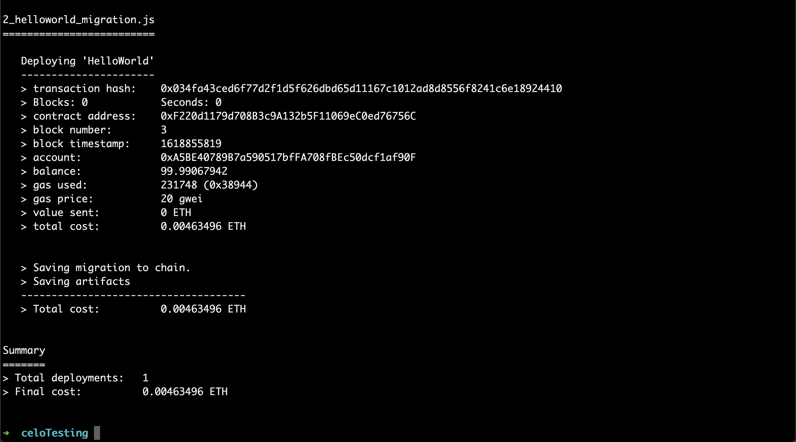
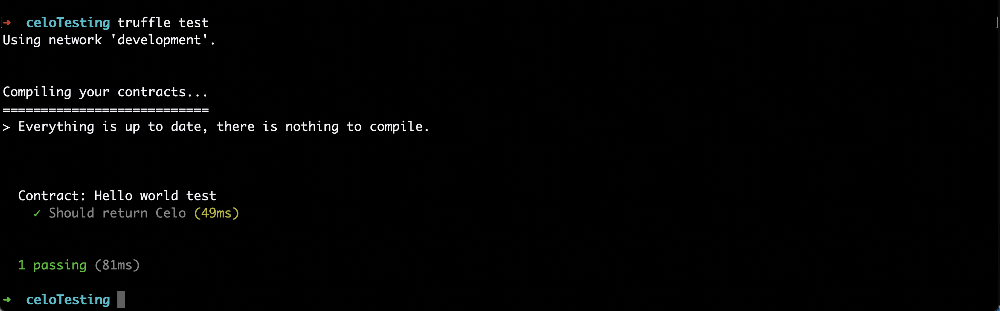
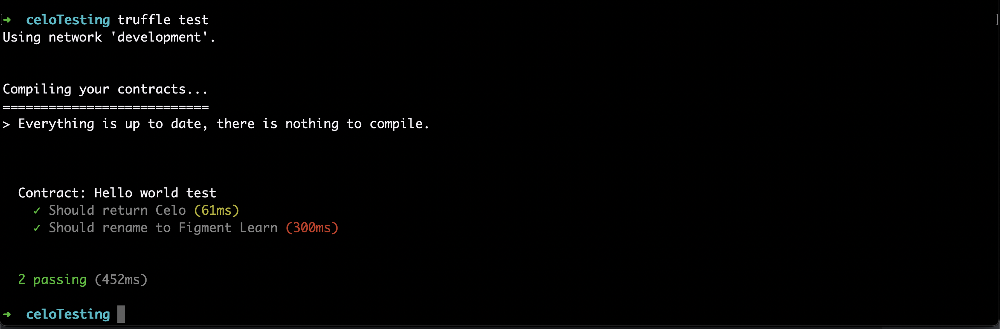

# Introduction

In this tutorial we will write tests for a Celo smart contract.

Writing tests is an important part of smart contract development because smart contract vulnerabilities can have real world implications like losing user funds! The best way to try to mitigate vulnerabilities is to write extensive unit tests in order to test every part of our contract's functionality.

This is a beginner friendly tutorial. Read on to learn about testing!

# Prerequisites

For this tutorial you will need to install Truffle and Ganache. Truffle is a set of tools for smart contract development and Ganache is a tool for creating local blockchains.

In your console, run the following:

`npm install -g truffle`

then run:

`npm install -g ganache-cli`

Great! That's all we'll need for our smart contract testing.

# Project setup

Next, we're going to setup our project. Let's create a folder called `celoTesting` and `cd` into the folder:

`mkdir celoTesting && cd celoTesting`

Now let's initialize Truffle:

`truffle init`

There should now be a handful of files and folders in your `celoTesting` directory. Let's open `celoTesting` with your favorite text editor and continue.

# Writing the smart contract

Since this tutorial focuses on smart contract testing, we'll use a very simple Solidity contract in order to get our bearings.

Create a new smart contract in the `contracts/` folder named `HelloWorld.sol` and write the following:

```text
pragma solidity >=0.5.0 <0.7.0;

contract HelloWorld {
  string name = 'Celo';

  function getName() public view returns (string memory) {
    return name;
  }

  function setName(string calldata newName) external {
    name = newName;
  }
}
```

Great! This is just a simple smart contract which will either get the `name` variable by calling `getName()` or update the `name` variable by calling `setName()`. When the contract first runs, `name` will be "Celo".

# Deployment

Now that we have a smart contract, let's deploy it to make sure it works. We'll be deploying it on the Ganache CLI, which is a command line tool for creating local blockchains. Ganache will create a local Ethereum blockchain for us to test on. Since Celo is a fork of Ethereum, they use the same environment.

To spin up the local blockchain, in a new terminal window run:

`ganache-cli --port 8545`

We use a new terminal window since we'll want to keep Ganache running while we develop.

Next, replace the existing contents of `truffle.config` with the following:

```text
module.exports = {
  networks: {
    // Truffle uses this by default
    development: {
      host: "127.0.0.1",
      port: 8545,
      network_id: "*",
    },
  }
};
```

This will simply use the Ganache environment whenever we deploy or test our contracts. Our Ganache environment is running on `localhost` (127.0.0.1) and using port 8545.

We'll also want to create a `migrations` file for our smart contract to deploy from. Create a file and call it `2_helloworld_migration.js` inside the `migrations/` folder and write the following:

```text
const HelloWorld = artifacts.require("HelloWorld");

module.exports = function (deployer) {
  deployer.deploy(HelloWorld);
};
```

After all that, we can run `truffle migrate` in our terminal to deploy our contracts.

The results should look like this:



# Testing

Truffle lets us test our smart contracts using both Javascript or Solidity. For this tutorial, we will write tests in Javascript.

For Javascript tests, Truffle uses two testing libraries commonly used in Javascript development. By default, this is the [Mocha](https://mochajs.org/) testing framework and [Chai](https://www.chaijs.com/) for assertions. A great thing about truffle is we are free to use whatever testing framework we want, but for our purposes this works well.

An important thing to note about testing in Truffle is that whenever we run the tests, Truffle will create a new contract deployment. This means we get a fresh start whenever we run our tests, and our contract gets reset.

Moving on to development, in the `test/` folder create a new file called `helloworld.js`.

The first line we'll write will get our smart contract instance:

`const HelloWorld = artifacts.require("HelloWorld");`

Next, let's setup our testing file:

```text
contract("Hello world test", async => {

}
```

Before we write our tests, let's review the goals of writing unit tests. A unit test should:

- Test one method
- Provide some specific arguments to that method
- Test that the result is as expected

Let's test that our contract returns "Celo" from `getName()` in our `HelloWorld` contract. If you'll recall, `getName()` returns whatever the string inside the `name` variable is. By default, we set name to be `Celo` when the contract is created.

```text
const HelloWorld = artifacts.require("HelloWorld");

contract("Hello world test", async => {
  it("Should return Celo", async () => {
    const instance = await HelloWorld.deployed();
    const name = await instance.getName.call();
    assert.equal(name, 'Celo');
  });
}
```

In this test, we create an `instance` of the `HelloWorld` contract deployment, and call the `getName()` function on it. The syntax for this is simply `instance.getName.call()` for calling functions which read from the blockchain.

Next, our test `asserts` that the value returned from `getName()` is equal to the string 'Celo'.

Let's run this! In a terminal window (with ganache running), type:

`truffle test`

This will run all our tests. Our test passes!



Now that we have our first test which tests the `getName()` function, let's write a test to check `setName()`:

```text
it("Should rename to Figment Learn", async () => {
  const instance = await HelloWorld.deployed();
  await instance.setName('Figment Learn');
  const name = await instance.getName.call();
  assert.equal(name, 'Figment Learn');
});
```

For this second test, we use `setName()` to change the name variable to "Figment Learn" and then call `getName()` to check if the variable updated.

In this test, we again retrieve an instance of the `HelloWorld` contract, but this time we call the `setName()` function on it like so:

`await instance.setName('Figment Learn');`

Unlike `getName()`, we don't use `.call()`. Whenever we're calling functions that _write_ to the blockchain, we won't need to use `.call()`.

Let's run `truffle test` again:



Great! This works. The test does take a while longer than the first one because it calls two functions and waits for each of them to finish.

A big part of unit testing is testing the edge cases which could possibly break your code. An example could be using special characters like emojis in our `setName()` function. Let's write a test to make sure that works:

```text
it("Should work with special characters ", async () =>  {
  const instance = await HelloWorld.deployed();
  await instance.setName('I ❤️ emojis 🎉');
  const name = await instance.getName.call();
  assert.equal(name, 'I ❤️ emojis 🎉');
});
```

And finally, let's run this last test:


Woohoo! All our tests pass.

# Conclusion

Now we know how to write tests for our smart contracts. This skill will come in handy whenever you're working on a smart contract and need to verify that all of the functionality works. Although our tests were relatively simple, they should be enough to get you started on your testing journey.

Good luck! And as always, feel free to ask on the Figment Learn [Discord](https://discord.gg/f5YuEsQTAx) if you run into any problems.

# Further reading

After following this tutorial, you should have a basis for writing tests for smart contracts. Unit testing is a entire subsection of development which has lots of discussion around it. If you'd like to read more, here are some additional resources:

- [Writing automated smart contract tests](https://docs.openzeppelin.com/learn/writing-automated-tests) - A tutorial from OpenZeppelin
- [Unit testing best practices](https://stackify.com/unit-testing-basics-best-practices/) - This isn't specific to Solidity, but writing great unit tests is a concept that extends to development across all programming.
- [New to unit testing, how to write great tests?](https://stackoverflow.com/questions/3258733/new-to-unit-testing-how-to-write-great-tests) - A stack overflow question with some great answers on writing great tests.
- [Testing deployed smart contracts](https://fulldecent.blogspot.com/2019/04/testing-deployed-ethereum-contracts.html) - This tutorial may come in handy if you're trying to test a contract which has been deployed to the Celo mainnet.

# About the author

This tutorial was created by Alex Reyes. Alex is a student (BS, Computer Science) and crypto enthusiast who's learning all about the world of web3 one day at a time and he's contributing to Web3 communities actively. He has previously completed internships at Facebook and Microsoft.
