# Introduction

This article is meant to act as a tutorial for new Ubeswap users or for people who are just discovering the benefits of DeFi altogether. Ubeswap is a DEX (Decentralized EXchange) and AMM (Automated Market Maker) protocol for Celo assets. Ubeswap is based on Sushiswap, which is a fork the popular Ethereum DEX called Uniswap. This is to ensure that the Ubeswap ecosystem can support as many existing tools and projects from the Ethereum ecosystem as possible.

## Why do people use DEX ?

**Decentralized exchanges** (DEX) are a type of cryptocurrency exchange which allows for direct peer-to-peer cryptocurrency transactions to take place online securely and without the need for an intermediary.

Compared to traditional exchanges, DEXes can be much simpler and faster to use when buying and selling cryptocurrencies. On top of that, we can find many tokens on decentralized exchanges, or DEXes, that you can’t find anywhere else! DEXes offer a great way to discover unique opportunities. Anyone can create a token that can be traded on DEXes.

On any centralized exchange, users can easily maintain a order book but this concept can't work on the blockchains because of gas fees, slippage and latency in price discovery on the markets. To solve these problems, **Automated Market Maker** (AMM) were created. On AMM-based decentralized exchanges, the traditional order book is replaced by liquidity pools that are pre-funded on-chain for both assets of the trading pair. The liquidity is provided by other users who also earn passive income on their deposit through trading fees based on the percentage of the liquidity pool that they provide. AMM based exchanges are based on a constant function(Constant Function Market Makers), where the combined asset reserves of trading pairs must remain unchanged.

All this information can be a bit overwhelming at first but we all can learn it with time.

More information about AMMs can be found [here](https://blog.chain.link/challenges-in-defi-how-to-bring-more-capital-and-less-risk-to-automated-market-maker-dexs/). If you wish to learn about about the DeFi, you can visit [this](https://academy.ivanontech.com/blog/defi-encyclopedia-the-ultimate-list-of-decentralized-finance-terms) website.

# Prerequisites

1.  A Celo compatible wallet (Example: Celo Extension Wallet, Valora or a Ledger device)
2.  Funds to interact with UBESWAP.

# How to use Ubeswap

## 1. Mobile DeFI

Celo focuses on mobile first approach so it has created a way for mobile defi users to use Ubeswap. Usera can set up their Valora app which is a custodian wallet on Celo blockchain. After setting up Valora, users can go to [UBESWAP](https://app.ubeswap.org/).

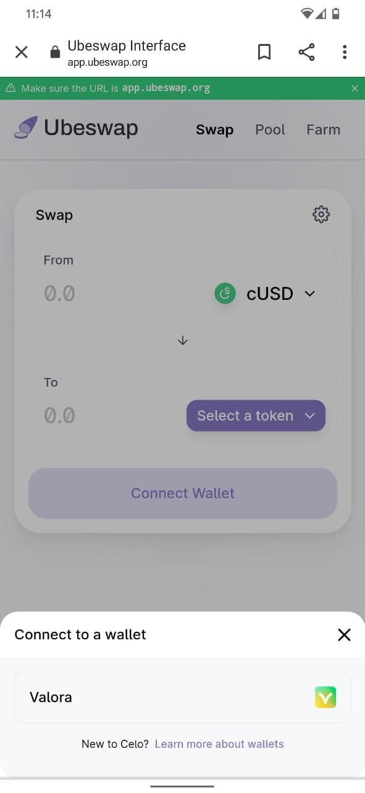

and select `Valora`. This will make a connection with Valora account and we will be able to use our funds in Valora app to interact with Ubeswap.

## 2. Desktop version

We can connect with Ubeswap in a traditional way of using an extension wallet. On the Celo Blockchain, it is Celo Extension Wallet which can be downloaded from [here](https://chrome.google.com/webstore/detail/celoextensionwallet/kkilomkmpmkbdnfelcpgckmpcaemjcdh?hl=en). We will be using this way to connect with Ubeswap in this tutorial.

# Connecting with Ubeswap

It is always better to learn any new blockchain technology using a testnet so that we don't have to spend real crypto assets. Ubeswap has deployed all of it's contracts on `Alfajores` testnet so that users can first learn to use it's platform on testnet. We will be doing the same.

Let's head over to <https://app-alfajores.ubeswap.org/>.

We will need to connect our Celo Extension wallet with the Front-end of Ubeswap. Before connecting, make sure that we have testnet funds to interact with the DEX. Head over to [testnet faucet](https://celo.org/developers/faucet) to get some testnet funds.

Click on `Connect a wallet` button present at the top-right corner of the screen.

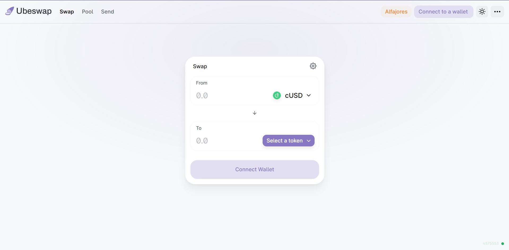

and select `Celo Extension Wallet`

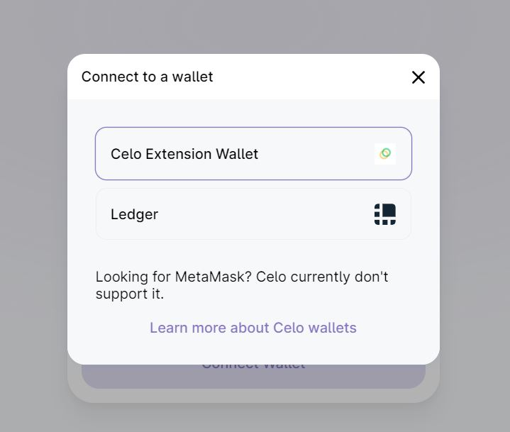

Then sign the transaction with the extension wallet. If everything went well, our screen should look something like this.

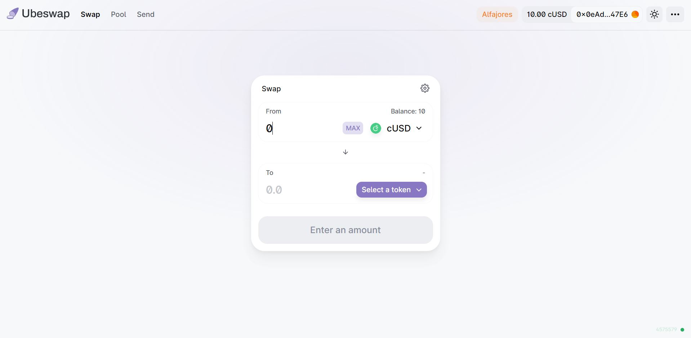

Now that we have connected our wallet, let's learn how we can swap tokens on Ubeswap.

# Swap

We will learn how we can swap one token for another. In this tutorial, we will swap cUSD to CELO.

Select the token in **From** tab and enter the amount. We will swap 5 cUSD to CELO. Our screen should look something like this.

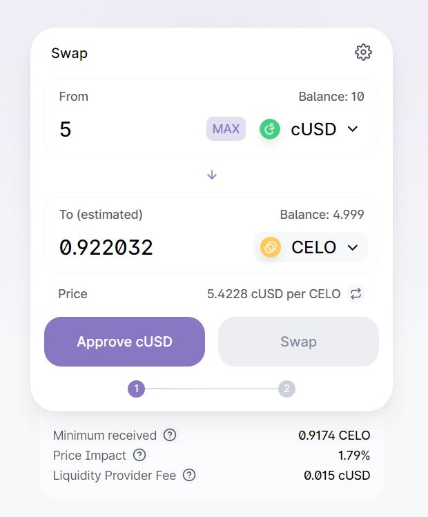

Before swapping, we need to approve Ubeswap to use our cUSD. This is done to protect users from sending their crypto to unknown addresses. Click on `Approve cUSD` to approve it.

If everything went well, our screen should look like this.

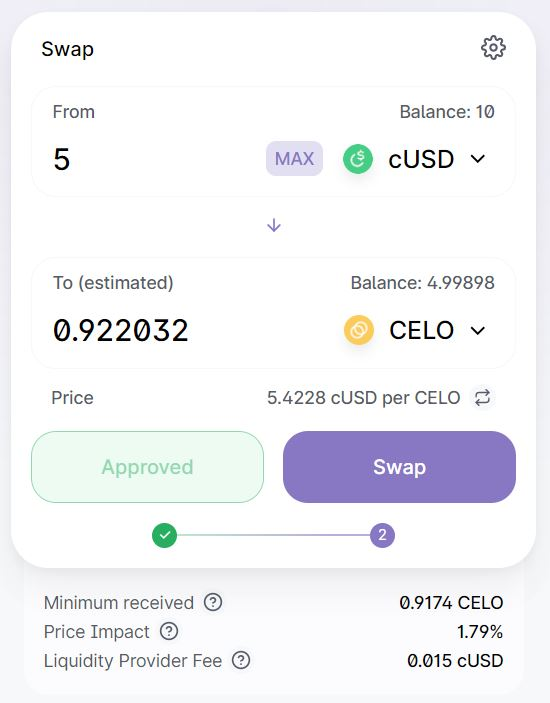

Click on`Confirm Swap` and sign the transaction.

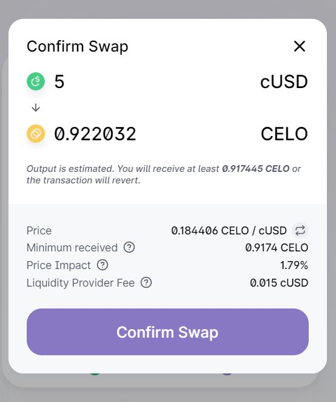

If the transaction went through, we should see a confirmation like this.

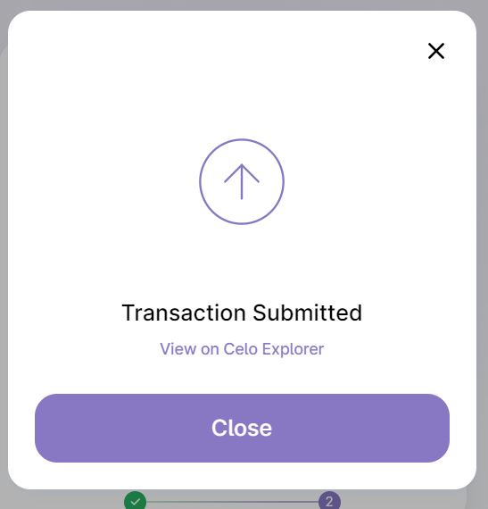 New tokens will appear in our wallet. ## Liquidity Pools on Ubeswap A liquidity pool is a collection of funds locked in a smart contract. Users add a pair of assets to the liquidity pool, which allows other users to make swaps for either of the paired tokens. This allows for a large range of assets to be represented on the DEX (Decentralized EXchange) - also, it enables smaller margins of slippage for users when they exchange assets. Liquidity Providers (otherwise known as LPs) receive a percentage of the fees generated when other users interact with the liquidity pool they are providing assets to. Before participating in liquidity pools, users need to educate themselves and be aware of the risks associated with DeFi. We can create our own pools of ERC20 compatible tokens on Celo using Ubeswap. We will be adding liquidity to the cUSD-CELO pool. Click on \`Add Liquidity\` button to start the process. 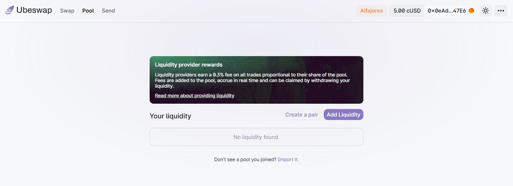 Now select the tokens. Keep in mind that we need to add both the tokens of same value in cUSD terms. Now as mentioned before, we have to give contracts we are interating with permission to use our tokens. We already approved Ubeswap to use our cUSD and we need to do the same for CELO also. Click on \`Approve CELO\`

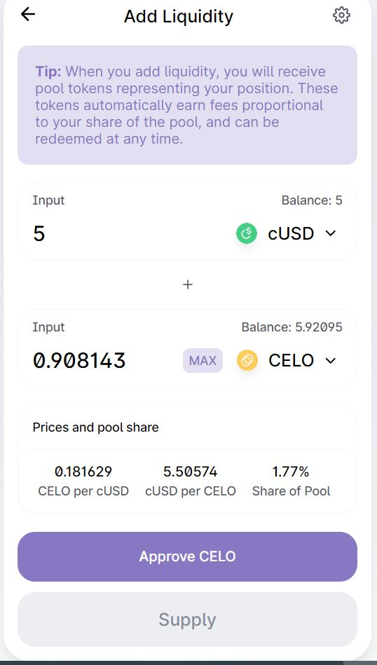

Now click on `Supply`

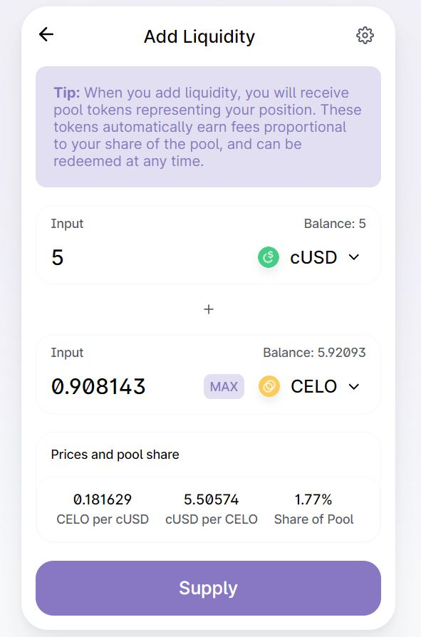

Check all the details, if they are correct, click on `Confirm Supply`.

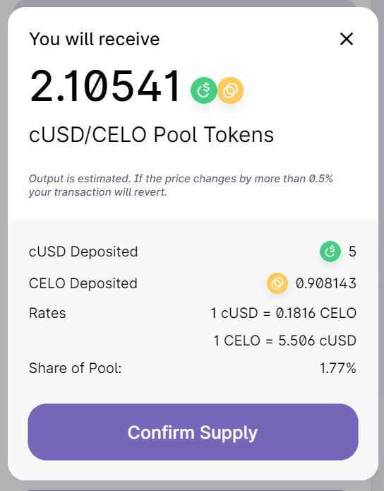

That's it, we have supplied liquidity to a pool on Ubeswap. We can see out position at bottom of the screen.

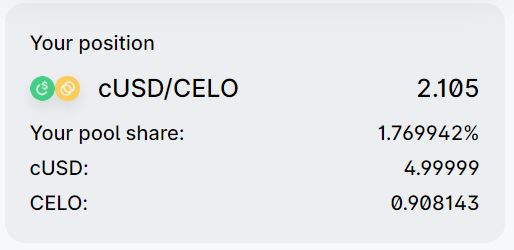

# Conclusion

Ubeswap recently announced that DeFi users will receive rewards for paticipating in DeFi on Ubeswap which makes it the best time to get involved!

Ubeswap's goal is to increase liquidity for digital assets on Celo. A world where anyone can trade any asset from their phone or browser, without having to rely on decades-old clearinghouse technology or other centralized systems is more effective in the long-term. This is only possible if people can invest in good assets. Ubeswap seeks to bring in liquidity from all of DeFi by harnessing the fast transaction times, high block gas limit, and stablecoin system of Celo.

# About the Author

This tutorial was created by [Deepanshu Hooda](https://github.com/gitofdeepanshu/), who is a computer science junior and a blockchain developer with high interest in finance. He spends most of the his time studying new DeFi protocols and loves to travel.
