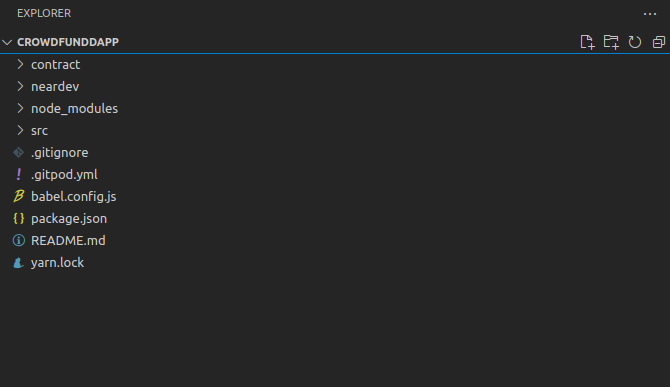
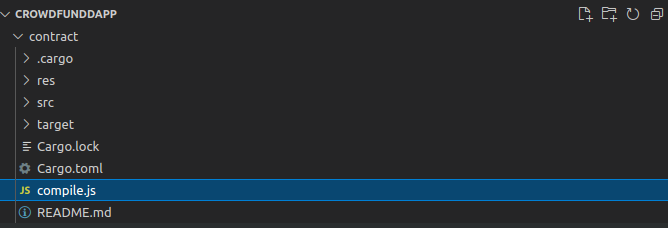
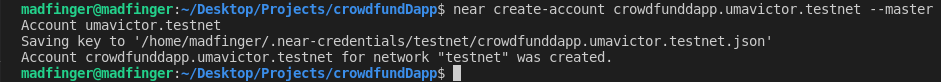
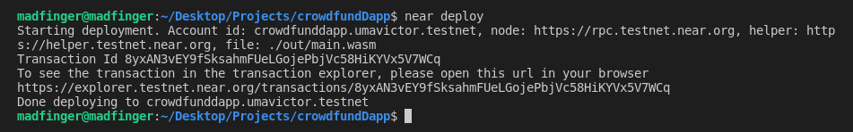
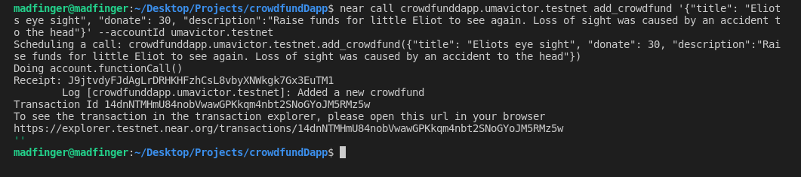
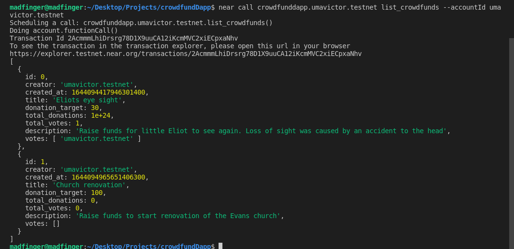
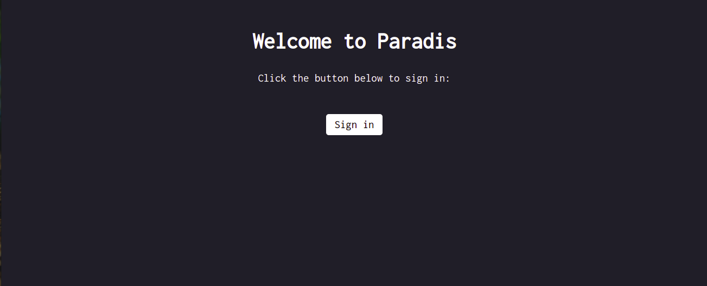

# Introduction

In this tutorial, we will build a crowdfunding dApp on the NEAR blockchain. Our smart contract will be written in Rust and our frontend will be written in React.

The dApp will have the following functionalities:

- Users logged in can post/create their own crowdfunding project
- View the list of crowdfunding projects
- Users can donate to a crowdfunding project
- Vote on a crowdfunding project

After we have implemented all the features in our smart contract, we will connect the smart contract to our react frontend which looks like this


# Prerequisites📋

To follow along and complete this tutorial, you will need the basic knowledge of [React](https://reactjs.org/) and [Rust](https://www.youtube.com/watch?v=KDn_j48yoAo&t=581s).

# Requirements

- Install the [rust toolchain](https://www.rust-lang.org/tools/install).
- [npx binary](https://www.npmjs.com/package/npx).
- [Git](https://git-scm.com/downloads) and Node.js(v14+) installed
- The [near-cli](https://docs.near.org/docs/tools/near-cli#installation)
- [A NEAR account](https://docs.near.org/docs/develop/basics/create-account#creating-a-testnet-account)

> As I mentioned earlier in the introduction, the smart contract for this dApp is written in Rust. If you are not familiar with Rust, you can take this [30 minutes crash course](https://www.youtube.com/watch?v=KDn_j48yoAo&t=581s).

> Make sure you have everything installed from the requirements including near-cli and have a NEAR account

# Overview

We have looked at the things we need to install to follow along in this tutorial, now let’s look at the things we will be doing as the tutorial progresses. We will use the [npx](https://www.npmjs.com/package/npx) binary to scaffold our project with [create-near-app](https://github.com/near/create-near-app) which provides us with options of what to use for the frontend and backend. After scaffolding our project we will look at the file structure, write our smart contract and deploy and test that all functions are working, and connect to our React frontend.

# Setting up our project

We set up our project with [create-near-app](https://github.com/near/create-near-app) by running the following command:

```shell
 npx create-near-app --frontend=react --contract=rust crowdfundDapp
 cd crowdfundDapp
```

with the `--frontend=react` and `--contract=rust` options, we create our project to have a react frontend and a rust contract. After waiting a while for the command to install everything, we see this in our terminal:


Now everything is successfully installed, and everything is ready to go, let’s look at what our file structure looks like.

## File structure



In our file structure, we have the `contract` folder, where we will be writing our contract specifically in the `src` directory. Then there is our `near-dev` folder that contains the configuration for deploying our contract in development mode and our `src` folder for our frontend. Looking closer into our contract folder:



In the contract folder we have the `src` folder where we’ll be creating a `model.rs`, `lib.rs`, and `utils.rs` file. We already have the `lib.rs` file, so no need to create another one. The `cargo.toml` file contains information about our contract, including all the dependencies we need.

# Building our contract

In the last section, we have seen how to set up our project and how our project is structured. Now let’s dive into building our contract.

## How does our contract work

Before building our contract, let’s discuss how our contract works, and the functions/endpoints we will call. In our contract, we want to be able to:

1.  Create a crowdfunding project - To do this we will need a `add_crowdfund` function, that when invoked will create a new crowdfunding project and add it to our array of crowdfunds.
2.  List all our crowdfunding project - To do this we will need a function `list_crowdfunds` to list all our crowdfunding projects
3.  Vote on a crowdfunding project - To do this, we will need a `add_vote` function to add a vote to our crowdfunding project.
4.  Donate to a crowdfunding project - To do this, we need a `add_donation` function that donates a certain amount of the NEAR token to the crowdfunding project

Create a `model.rs`, `lib.rs`, and `utils.rs` file in the `src` folder. In our `utils` file, we copy and paste the following code.

> The `utils.rs` file contains some helpful functions and types we will be using as we build our contract, with some comments explaining what they do. Don’t get intimidated as you only need to copy and paste it into your `utils.rs` file

```rust
 // utils.rs
    use near_sdk::{
        env,
        PromiseResult,
    };
    /// == TYPES ====================================================================
    /// Account Ids in Near are just strings.
    pub type AccountId = String;
    /// Gas is u64
    pub type Gas = u64;
    /// Amounts, Balances, and Money in NEAR are u128.
    pub type Amount = u128;
    pub type Balance = Amount;
    pub type Money = Amount;
    /// Timestamp in NEAR is a number.
    pub type Timestamp = u64;
    ///
    /// == CONSTANTS ================================================================
    ///
    /// TODO: revist MIN_ACCOUNT_BALANCE after some real data is included b/c this
    /// could end up being much higher
    /// ONE_NEAR = unit of NEAR token in yocto Ⓝ (1e24)
    pub const ONE_NEAR: u128 = 1_000_000_000_000_000_000_000_000 as u128;
    /// XCC_GAS = gas for cross-contract calls, ~5 Tgas (teragas = 1e12) per "hop"
    pub const XCC_GAS: Gas = 20_000_000_000_000;
    /// MIN_ACCOUNT_BALANCE = 3 NEAR min to keep account alive via storage staking
    pub const MIN_ACCOUNT_BALANCE: u128 = ONE_NEAR * 3;
    /// == FUNCTIONS ================================================================
    /// Converts Yocto Ⓝ token quantity into NEAR, as a String
    pub fn asNEAR(amount: u128) -> String {
        format!("{}", amount / ONE_NEAR)
    }
    /// Converts a quantity in NEAR into Yocto Ⓝ tokens
    pub fn toYocto<D: Into<u128>>(amount: D) -> u128 {
        ONE_NEAR * amount.into()
    }
    /// Asserts that the contract has called itself
    pub fn assert_self() {
        let caller = env::predecessor_account_id();
        let current = env::current_account_id();
        assert_eq!(caller, current, "Only this contract may call itself");
    }
    /// Asserts that only a single promise was received, and successful
    pub fn assert_single_promise_success(){
        assert_eq!(
            env::promise_results_count(),
            1,
            "Expected exactly one promise result",
        );
        match env::promise_result(0) {
            PromiseResult::Successful(_) => return,
            _ => panic!("Expected PromiseStatus to be successful"),
        };
    }
```

## Create our models

We can describe the model in our contract as a custom data container for defining new types. Just like the way we have primitive types, we can create our own custom types in our model that describe or are patterned to what we are building. The code for our `model.rs` file can be found below and we will explain what it does step by step

```rust
// model.rs
    use near_sdk::borsh::{self, BorshDeserialize, BorshSerialize};
    #[allow(unused_imports)]
    use near_sdk::{env, near_bindgen};
    use near_sdk::serde::{Deserialize, Serialize};

    use crate::utils::{
        AccountId,
        Money,
        Timestamp
    };
    #[derive(Clone, Serialize, Deserialize, BorshDeserialize, BorshSerialize)]
    #[serde(crate = "near_sdk::serde")]
    pub struct Crowdfund{
        id: i32,
      pub creator: AccountId,
        created_at: Timestamp,
        title: String,
        donation_target: u128,
        pub total_donations: u128,
       pub total_votes: i64,
        description: String,
       pub votes: Vec<String>
    }

    impl Crowdfund{
        pub fn new(id:i32, title: String, donation_target:u128, description: String) -> Self {

            Crowdfund{
                id,
                creator: env::signer_account_id(),
                created_at: env::block_timestamp(),
                title,
                donation_target,
                total_donations: 0,
                total_votes : 0,
                description,
                votes: vec![],
            }
        }
    }
    #[derive(Clone, Serialize, Deserialize, BorshDeserialize, BorshSerialize)]
    #[serde(crate = "near_sdk::serde")]
    pub struct Donation {
        amount: Money,
        donor: AccountId,
    }
    impl Donation {
        pub fn new() -> Self {
          Donation{
            amount: env::attached_deposit(),
            donor: env::predecessor_account_id(),
            }
        }
    }
```

Let’s breakdown what the code above is doing:

```rust
    use near_sdk::borsh::{self, BorshDeserialize, BorshSerialize};
    #[allow(unused_imports)]
    use near_sdk::{env, near_bindgen};
    use near_sdk::serde::{Deserialize, Serialize};
```

Above we have the rust contract standard imports and can see the dependencies that are used in the `Cargo.toml` file. The dependencies that have to do with serialization which are `BorshDeserialize` and `BorshSerialize` are used to bundle our contract code and storage so it is ready for NEAR blockchain. The `use` statement before the dependencies just shows which dependencies we are using in this file.

> `env` is used to log into your console or return some useful information like the signer’s account

```rust
   // model.rs
    use crate::utils::{
        AccountId,
        Money,
        Timestamp
    };
```

Here, we just import some custom types we will be using from our `utils.rs` file. After this piece of code, we have our crowdfund `struct` which is crucial to our contract.

## Crowdfund Struct

A `struct` in rust is similar to classes in other languages. Structs kind of hold the state of the contract. Building our contract, our `struct` will be followed by an `impl`, where we write the core logic function of the contract.

```rust
//model.rs
    #[derive(Clone, Serialize, Deserialize, BorshDeserialize, BorshSerialize)]
    #[serde(crate = "near_sdk::serde")]
    pub struct Crowdfund{
        id: i32,
      pub creator: AccountId,
        created_at: Timestamp,
        title: String,
        donation_target: u128,
        pub total_donations: u128,
       pub total_votes: i64,
        description: String,
       pub votes: Vec<String>
    }
```

We want to be able to add a new crowdfunding project, so the crowdfund `struct` above contains the fields of information a particular crowdfund project will have. We can see that each of the fields has a type. The last field is a type of vector, but we can just look at it as an array.

> The keyword `pub` means that whatever we prefix it with is public and can be used externally

```rust
  //model.rs
    impl Crowdfund{
        pub fn new(id:i32, title: String, donation_target:u128, description: String) -> Self {

            Crowdfund{
                id,
                creator: env::signer_account_id(),
                created_at: env::block_timestamp(),
                title,
                donation_target,
                total_donations: 0,
                total_votes : 0,
                description,
                votes: vec![],
            }
        }
    }
```

The block of code above is where we initialize our `Crowdund` model. The contract was initialized with some arguments and also contains some default data like the `creator` field which has its default as the signer account’s id. The `total_donations` and `total_votes` are also set to zero by default. The contract is also initialized with some arguments that we will provide when invoking the function to add a crowdfund. The arguments are:

- `id`: A unique ID for each crowdfund
- `title`: The title of our crowdfunding project
- `donation_target`: the target amount for the crowdfunding project.
- `description`: A little description of our crowdfunding project.

The following model we have in our `model.rs` file is:

```rust
//model.rs
    #[derive(Clone, Serialize, Deserialize, BorshDeserialize, BorshSerialize)]
    #[serde(crate = "near_sdk::serde")]
    pub struct Donation {
        donor: AccountId,
    }
    impl Donation {
        pub fn new() -> Self {
          Donation{
            donor: env::predecessor_account_id(),
            }
        }
    }
```

For our donation `struct` we have a `donor` field we would like to store on the blockchain. Then we initialize the donation `struct` with the `donor` with the default value of the `predecessor_account_id()` which signifies the person that donated to the crowdfunding campaign.
Now let's move over to our `lib.rs` file where we call the different functions that will make all the features for our crowdfunding dApp possible.

# Adding a crowdfund project

We have created our models in the model.rs file and we are now moving over to our `lib.rs` file where we will be writing the different functions we need to call to perform certain operations in the dApp. Before we get into the nitty-gritty of things let's look at some code we need available at the top of our `lib.rs` file.

```rust //lib.rs
  mod models;
  mod utils;
  use crate::{
      utils::{
          AccountId,
          ONE_NEAR,
          assert_self,
          assert_single_promise_success,
      },
      models::{
          Crowdfund,
          Donation
      }
  };
  // To conserve gas, efficient serialization is achieved through Borsh (http://borsh.io/)
  use near_sdk::{borsh::{self, BorshDeserialize, BorshSerialize}, Promise};
  #[allow(unused_imports)]
  use near_sdk::{env, PromiseIndex, near_bindgen};
  near_sdk::setup_alloc!();

```

The first thing we do in our `lib.rs` file is import the `utils.rs` and `models.rs` modules which are also in the same `src` folder. After that, we signify what in particular we will be using in those modules with the `use` keyword, then finally the rust standard imports. Now to continue we need to create a contract struct

```rust
 #[near_bindgen]
    #[derive(Clone, Default, BorshDeserialize, BorshSerialize)]
    pub struct Contract {
        owner: AccountId,
        crowdfunds: Vec<Crowdfund>,
        donations: Vec<Donation>,
    }
```

> The `#[near_bindgen]` before our contract `struct` is to allow easy compilation of our contract code into WebAssembly, so it is compatible and optimizable for the NEAR blockchain

In our contract `struct` we have the the `owner` field and then we have the `crowdfund` and `donation` field which are just vectors of their models `Crowdfund` and `Donation`. Next, we will have the `impl`

```rust
  #[near_bindgen]
    impl Contract{
        #[init]
        pub fn init(
            owner: AccountId,
        ) -> Self{
            let crowdfunds: Vec<Crowdfund> = Vec::new();
            let donations: Vec<Donation> = Vec::new();

            Contract{
                owner,
                crowdfunds,
                donations
            }
        }
    }
```

In our Contract `impl` the `#init` allows us to create a custom initialization of the contract with a function that takes in a parameter of `owner`. We construct a new, empty vector with the `Vec::new()`and assign it to `crowdfund` and `donations` respectively.

> The vector will not be allocated until elements are pushed onto it.

## The add_crowdfund function

After our initialization, we start writing our functions. The first function we have is the `add_crowdfund` function.

```rust
       pub fn add_crowdfund(&mut self, title: String, donate:u128,description: String) {

            let id = self.crowdfunds.len() as i32;

            self.crowdfunds.push(Crowdfund::new(
                id,
                title,
                donate,
                description
            ));
            env::log("Added a new crowdfund".as_bytes());
        }
```

The `add_crowdfund` function accepts three parameters, `title`, `donate`, and `description` we will pass in when the function is called. We want to have a unique `id` for each crowdfunding project, so we create an `id` variable to the length of the total crowdfunds project we have in our vector. We have added a new Crowdfund project to our list of crowdfunding projects. So each time we call the `add_crowdfund` function, we update the blockchain state and a new crowdfund project is added to the list with the information we have provided as parameters. Finally, we log “Added a new crowdfund” to the blockchain.

> Notice how we also passed in `&mut self` in our function?. It simply means we are passing on a mutable reference of `self` which points to our `Contract`

# List all crowdfunding projects

We need to return all crowdfunding projects, so we create a function `list_crowdfunds` .

```rust
 pub fn list_crowdfunds(&self) -> Vec<Crowdfund> {
            assert_self();
           let crowdfunds = &self.crowdfunds;
           return crowdfunds.to_vec();
        }
```

When we call the function, we make use of the `assert_self` function from our `utils.rs` file, to make sure the contract calls itself, then we return our crowdfunds as a vector that displays an array of all our crowdfunding projects.

# Voting a project

Assuming there is a project that really needs some support, the user can vote on that project. So in our contract, we added an `add_vote` function.

```rust
        pub fn add_vote(&mut self, id:usize){
            let crowdfund: &mut Crowdfund = self.crowdfunds.get_mut(id).unwrap();
            let voter = env::predecessor_account_id();
            crowdfund.total_votes = crowdfund.total_votes + 1;
            env::log("vote submitted succesfully".as_bytes());
            crowdfund.votes.push(voter);

        }
```

We pass an `id` parameter to the `add_vote` function to determine the particular project we want to vote on. Then we can access the project by calling `.get_mut(id)` and passing in the id of the project. We set our voter to be the `predecessor_account_id()` and then we mutate our state with this line.

```rust
    crowdfund.total_votes = crowdfund.total_votes + 1;
```

This increments the `total_votes` field by 1, each time we call the function, then we add the voter to the votes vector, and we can see who has voted on that project.

# Donate to a project

To donate to a particular project, we create an `add_donation` function and pass in the `id` of the project we want to donate to, and the amount of NEAR token we want to donate.

```rust
     pub fn add_donation(&mut self, id:usize, amount:u128) {
            let transfer_amount: u128 = ONE_NEAR * amount;
            let crowdfund: &mut Crowdfund = self.crowdfunds.get_mut(id).unwrap();
            crowdfund.total_donations = crowdfund.total_donations + transfer_amount;
            self.donations.push(Donation::new());

           Promise::new(env::predecessor_account_id()).transfer(transfer_amount);
          env::log("You have donated succesfully".as_bytes());
        }
```

Here we pass as a parameter, the `id` of the crowdfunding project and the `amount` we want to donate. We then add the donated amount to our current `total_donations` balance, and push a new donation each time we call the function and the amount in NEAR is transferred to the crowdfunding project owner.

# Get total crowdfunds and donations count

Let’s add two more functions to our contract to determine the total crowdfunding projects we have and the total sum of donations a particular crowdfunding project has received.

```rust
    pub fn crowdfund_count(&mut self) -> usize {
            return self.crowdfunds.len();
        }

        pub fn get_total_donations(&mut self, id:usize) -> u128 {
            let crowdfund: &mut Crowdfund = self.crowdfunds.get_mut(id).unwrap();
            return crowdfund.total_donations;
        }
```

We have created two functions `crowdfund_count` that simply returns the length of our crowdfund vector and `get_total_donations` to return the total donations a particular crowdfund project has received.

Now that we are done with all the functions for this contract, it is time to deploy and invoke the functions in our contract to make sure everything is working fine, and that is what we will be doing in the next section

# Deploying the smart contract🚀

Before we deploy our smart contract, let’s first login with the `near-cli` into the NEAR account we created.

**Login with `near-cli`**

Make sure you already have the `near-cli` installed, you can see the installation steps from the link in the prerequisites. Then run this command:

```shell
   near login
```

After login to the account we created, we see a successful message in the
terminal.

## Deploy the contract

To deploy our crowdfunding contract, we need to create an account for it. Since we have already created a testnet account, in my case `umavictor.testnet` , we can create a subaccount under `umavictor.testnet` to deploy the contract.

```shell
  near create-account crowdfunddapp.umavictor.testnet --masterAccount umavictor.testnet
```



> In your case, the `umavictor` will be replaced by your own NEAR testnet account name you created

Once your sub-account is created, navigate to `src/config.js` and modify the line that sets the account name of the contract. Set it to the sub-account `id` you created above.

```shell
  const CONTRACT_NAME = process.env.CONTRACT_NAME || 'crowdfunddapp.umavictor.testnet'
```

we can finally deploy our contract. Since we use [create-near-app](https://github.com/near/create-near-app), deploying our contract is easy and can be done with the command

    near deploy



we can see that after running the command, our contract was deployed successfully. yay!.

> If you make a change in your contract, you can just delete the sub account with the command `near delete crowdfunddapp.umavictor.testnet umavictor.testnet`, and create it again.

# Interact with our contract by calling contract methods

Now we can interact with our contract and make sure all our functions are doing what they are supposed to do. Let’s test out each function!.

## Add Crowdfund project

Call `add_crowdfund` with the `near-cli`:

```shell
    near call crowdfunddapp.umavictor.testnet add_crowdfund '{"title": "Eliots eye sight", "donate": 30, "description":"Raise funds for little Eliot to see again. Loss of sight was caused by an accident to the head"}' --accountId umavictor.testnet
```

What the command above does is to call the contract deployed on `crowdfunddapp.umavictor.testnet`. On the contract, there is a method called `add_crowdfund` with three arguments provided and is signed by `umavictor.testnet`.
In your terminal, you will see an output like this:



## Vote on a Crowdfund Project

Call `add_vote` with the `near-cli`:

```shell
   near call crowdfunddapp.umavictor.testnet add_vote '{"id":0}' --accountId umavictor.testnet
```

this command increments the vote of the first crowdfunding project by one.


# Donate to a crowdfunding project

Call the `add_donate` method with the `near-cli`

```shell
 near call crowdfunddapp.umavictor.testnet add_donation '{"id":0, "amount":1}' --accountId umavictor.testnet
```

this command calls the `add_donation` method and 1 NEAR is sent to the crowdfund project.

# List all crowdfunding projects

Call the `list_crowdfunds` method.

```shell
 near call crowdfunddapp.umavictor.testnet list_crowdfunds --accountId umavictor.testnet
```

This command lists all the crowdfunding projects to the terminal.



You can see the two crowdfund projects from the image and all the information we set.
We have invoked the methods to see how they are working, let’s now build the react frontend

# Building our frontend

We are finally done building the smart contract. To connect and build our React frontend, we will be working on the `src` folder. This is not a React tutorial, so we will only touch on the important things.
First, navigate to `utils.js` and update your change and view methods

```js
//utils.js
  window.contract = await new Contract(window.walletConnection.account(), nearConfig.contractName, {
        // View methods are read only. They don't modify the state, but usually return some value.
        viewMethods: ['get_donation_count',"crowdfund_count"],
        // Change methods can modify the state. But you don't receive the returned value when called.
        changeMethods: ['add_crowdfund', 'add_vote','add_donation',"list_crowdfunds"],
      })
    }
```

Take a look at the code in our `App.js`:

```js
// App.js
import 'regenerator-runtime/runtime';
import { useEffect, useState } from 'react';
import ListCrowdfunds from './components/ListCrowdfunds';
import CreateCrowdfund from './components/CreateCrowdfunds';
import React from 'react';
import { login, logout } from './utils';
import './global.css';
import getConfig from './config';
const { networkId } = getConfig(process.env.NODE_ENV || 'development');

export default function App() {
  const [crowdfunds, setCrowdfunds] = useState([]);
  const [toggleModal, setToggleModal] = useState(false);
  function addProject() {
    setToggleModal(!toggleModal);
  }

  useEffect(() => {
    // in this case, we only care to query the contract when signed in
    if (window.walletConnection.isSignedIn()) {
      // window.contract is set by initContract in index.js
      window.contract.list_crowdfunds().then(crowdfundprojects => {
        const crowdfundList = [...crowdfundprojects];
        setCrowdfunds(crowdfundList);
      });
    }
  }, []);

  // if not signed in, return early with sign-in prompt
  if (!window.walletConnection.isSignedIn()) {
    return (
      <main>
        <h1>Welcome to Paradis</h1>
        <p style={{ textAlign: 'center' }}>
          Click the button below to sign in:
        </p>
        <p style={{ textAlign: 'center', marginTop: '2.5em' }}>
          <button onClick={login}>Sign in</button>
        </p>
      </main>
    );
  }
  return (
    // use React Fragment, <>, to avoid wrapping elements in unnecessary divs
    <>
      <header>
        <div className="logo"></div>
        <button className="link" style={{ float: 'right' }} onClick={logout}>
          Sign out <span className="id">{window.accountId}</span>
        </button>
      </header>
      <button onClick={addProject}>Add a project</button>
      <main>
        <CreateCrowdfund toggleModal={toggleModal} />
        <section>
          {crowdfunds.map((project, id) => {
            return (
              <div key={id}>
                <ListCrowdfunds project={project} />
              </div>
            );
          })}
        </section>
      </main>
    </>
  );
}
```

In the `App.js` file above, we import the configurations, utils, and components we will be using. We created our `crowdfunds` state which is an array of objects containing all our crowdfunding projects. In the `useEffect` hook, we call the `list_crowdfund` method from `window.contract` which has been set by `initContract` in the `index.js` file. We then set the crowdfunds state, using React’s `setState`.

Next, we check if a user is signed in, and if no user is signed in, we prompt them to.



Once signed in, we will see available projects we can donate to.

## List Crowdfund component

For our `App.js` component, we looped through all our crowdfunding projects and passed in the object prop to our `ListCrowdfunds` component. This is what our `ListCrowdfunds` component looks like.

```js
// components/ListCrowdfunds.js
import React, { useState } from 'react';
const ONE_NEAR = 1_000_000_000_000_000_000_000_000;
function ListCrowdfunds({ project }) {
  const [donationAmount, setDonationAmount] = useState(0);
  const [showDonateNotification, setShowDonateNotification] = useState(false);
  function donate(e) {
    e.preventDefault();
    console.log(donationAmount);
    window.contract.add_donation({
      id: project.id,
      amount: donationAmount * 1,
    });
    setShowDonateNotification(!showDonateNotification);
  }
  return (
    <div className="project">
      <h2>{project.title}</h2>{' '}
      <span className="creator">{project.creator}</span>
      <h3>description:</h3>
      <p>{project.description}</p>
      <h4>target: {project.donation_target} NEAR</h4>
      <h4>Votes: {project.total_votes}</h4>
      <button
        onClick={() => {
          window.contract.add_vote({ id: project.id });
        }}
      >
        Vote
      </button>
      <h4>total donations: {project.total_donations / ONE_NEAR} NEAR</h4>
      <form onSubmit={donate}>
        <input
          type="number"
          value={donationAmount}
          onChange={e => setDonationAmount(e.target.value)}
        ></input>
        <button onClick={donate}>Donate</button>
      </form>
      {showDonateNotification && <DonateNotification />}
    </div>
  );
}
function DonateNotification() {
  return (
    <aside>
      <footer>
        <div>✔ Succeeded </div>
        <div>Donation was successful</div>
      </footer>
    </aside>
  );
}
export default ListCrowdfunds;
```

In the `ListCrowdfunds` component, we set the donation amount state and when we want to donate, by clicking on the `Donate` button, the `donate` function is called which calls the `add_donation` method in our contract with the argument we provide from the form.
We also have a notification component that notifies the user when our donation is successful.

## Create Crowdfund Component

Our `CreateCrowdfund` component is a modal that contains a form for us to add a new crowdfund project.

```js
import React, { useState } from 'react';
function CreateCrowdfund({ toggleModal }) {
  const [title, setTitle] = useState('');
  const [description, setDescription] = useState('');
  const [target, setTarget] = useState(0);
  const [showNotification, setShowNotification] = useState(false);
  const handleSubmit = event => {
    event.preventDefault();
    window.contract.add_crowdfund({
      title: title,
      donate: target * 1,
      description: description,
    });
    setShowNotification(!showNotification);
    alert(`crowdfund info: ${title} ${target} ${description}`);
  };
  console.log(`its ${toggleModal}`);
  return (
    <div>
      {toggleModal == true && (
        <div className="addcrowdfund">
          <form onSubmit={handleSubmit}>
            <label>
              Enter project title:
              <input
                type="text"
                value={title}
                onChange={e => setTitle(e.target.value)}
              />
            </label>
            <label>
              Enter donation target:
              <input
                type="number"
                value={target}
                onChange={e => setTarget(e.target.value)}
              />
            </label>
            <label>
              Enter project description:
              <input
                type="text"
                value={description}
                onChange={e => setDescription(e.target.value)}
              />
            </label>
            <input type="submit" className="submit" />
          </form>
        </div>
      )}

      {showNotification && <Notification />}
    </div>
  );
}
function Notification() {
  return (
    <aside>
      <footer>
        <div>✔ Succeeded </div>
        <div>Added new project Just now</div>
      </footer>
    </aside>
  );
}
export default CreateCrowdfund;
```

This component conditionally renders when the `toggleModal` state is `true` . We have a state for the crowdfund `title`, `description`, and `target donation amount`, and each time our input changes, we set the state to the input value. On submitting the form, the `handleSubmit` function runs and our `add_crowdfund` method is called from the `window.contract` with the arguments we got from the input values.

You can check out a this [video](https://www.loom.com/share/f65f0c04298e434f88e0696d9bf3ad6b) walkthrough demo of the final dApp.

Yay!. We have concluded the tutorial and you can find the source code [here](https://github.com/uma-victor1/Crowdfunding-dApp).

# Conclusion

Finally!, we have come to the end of this tutorial. We learned how to build a crowdfunding dApp on the NEAR blockchain using Rust for the backend and React for the frontend, test our methods and deploy our smart contract live.

# What Next?

You can play around with the code, and add some more functionalities like adding pagination so users can go back and forth between pages. Also you can add a sort functionality so the user can sort which crowdfunding project has the highest votes.

# About the Author

This tutorial was created by [Uma Victor](https://twitter.com/umavictor_), a software developer and web3 enthusiast.

# References

- NEAR [docs](https://docs.near.org/docs/develop/basics/getting-started).
