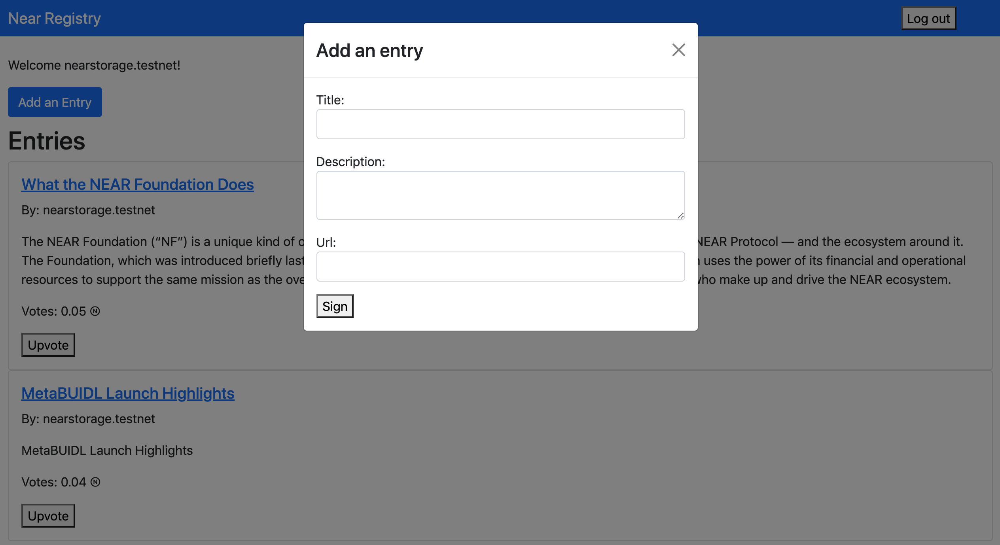
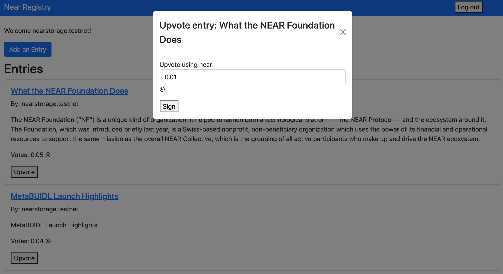

# Introduction

In this tutorial we will be building a complete dApp for the NEAR Registry. NEAR Registry will allow you to track popular content just like Hacker News. Anyone can post an entry to the Registry. Upvoting the content requires you to connect using your NEAR wallet and attach NEAR to the entry. The Registry is sorted based on the NEAR attached to the entries. The same logic can be extended for any other type of registry.

# Requirements

- A NEAR testnet account: <https://wallet.testnet.near.org/>
- [Nodejs](https://nodejs.org/en/download/) v14 LTS or higher installed
- [yarn](https://yarnpkg.com/) installed

# Setup

```text
git clone https://github.com/viraja1/near-registry.git
cd near-registry
yarn install
yarn test
```

# Exploring The Code

1.  The backend code is present in the `/assembly` folder and gets deployed to the NEAR blockchain when you run `yarn deploy`. This sort of code that runs on a blockchain is called a "smart contract". [Learn more about NEAR smart contracts][smart contract docs].
2.  The backend test code is present in the `/assembly/__tests__/` folder. We can test the backend code using the command `yarn test`.
3.  The frontend code is present in the `/src` folder. It uses near-api-js which is a JavaScript/TypeScript library for development of decentralized applications on the NEAR platform. It works in conjunction with NEAR RPC endpoints to help you connect your application to the NEAR blockchain. [Learn more about NEAR Frontend][near frontend].

NEAR smart contracts can be written in Rust or AssemblyScript. For NEAR Registry we will be using AssemblyScript, which is a dialect of TypeScript that compiles to WebAssembly (WASM).

Contracts are a named collection of exported functions that have access (via **near-sdk-as**) to their execution context (sender, receiver, block height, etc.) as well as storage services (key-value pair and convenience collections like Map, Vector and Dequeue), logging services and some utility functions.

To keep things organized, contracts can use one or more data objects which are commonly added to the model.ts file. All contracts and models must explicitly import the features of the NEAR SDK they intend to use.

**assembly/model.ts**

```typescript
import { context, u128, PersistentVector } from 'near-sdk-as';

/**
 * Exporting a new class Entry so it can be used outside of this file.
 */
@nearBindgen
export class Entry {
  sender: string;

  constructor(
    public title: string,
    public description: string,
    public url: string,
    public id: i32,
    public votes: u128,
  ) {
    this.sender = context.sender;
  }
}

/**
 * collections.vector is a persistent collection. Any changes to it will
 * be automatically saved in the storage.
 * The parameter to the constructor needs to be unique across a single contract.
 * It will be used as a prefix to all keys required to store data in the storage.
 */
export const entries = new PersistentVector<Entry>('entries');
```

In the above `models.ts` file, we define a new custom type named Entry (primitive types like integers, strings and bool are always available by default). Since models are just AssemblyScript classes, they support custom constructors. Each entry has sender, title, description, url, id and votes. Each of these is associated with a specific type and is declared as public. In the constructor, we define the sender as **context.sender**. The context object provides context for contract execution including information about the transaction sender, blockchain height, and attached deposit available for use during contract execution.

At the end, we define that entries is a PersistentVector (collection) of type Entry. The PersistentVector writes and reads from storage, abstracting away a lot of what you might want to add to the storage object. It wraps the Storage class with convenience methods so you must always use a unique storage prefix for different collections to avoid data collision. PersistentVector acts like an array. To create entries, we use the syntax `new PersistentVector<Entry>("entries")`. The vector supports the methods like push, pop and length.

**assembly/main.ts**

```typescript
import { Entry, entries } from './model';
import { context, u128 } from 'near-sdk-as';

// --- contract code goes below

/**
 * Adds a new entry under the name of the sender's account id.
 * NOTE: This is a change method, which means it will modify the state.
 * But right now we don't distinguish them with annotations yet.
 */
export function addEntry(
  title: string,
  description: string,
  url: string,
): void {
  // Creating a new entry and populating fields with our data
  const entry = new Entry(
    title,
    description,
    url,
    entries.length,
    u128.fromU64(0),
  );
  // Adding the entry to end of the the persistent collection
  entries.push(entry);
}

/**
 * Up vote an entry using attachedDeposit
 * NOTE: This is a change method, which means it will modify the state.
 * But right now we don't distinguish them with annotations yet.
 */
export function upVoteEntry(index: i32): void {
  const entry = entries[i32(index)];
  entry.votes = u128.add(entry.votes, context.attachedDeposit);
  entries[i32(index)] = entry;
}

/**
 * Returns an array of entries.
 * NOTE: This is a view method, which means it does not modify the state.
 */
export function getEntries(): Entry[] {
  const result = new Array<Entry>(entries.length);
  for (let i = 0; i < entries.length; i++) {
    result[i] = entries[i];
  }
  return result;
}
```

Contract function calls are stateless. Any state that you want to save to the blockchain needs to be explicitly saved by interacting with the storage object (such as **entries**). In the `main.ts` file, the contract functions like `addEntry`, `upVoteEntry` and `getEntries` are defined. Function declarations follow standard AssemblyScript conventions, including the parameters they take, optional arguments and return values.

There are two types of functions that can interact with the blockchain -- "view" functions and "change" functions. The difference, however, does not exist on the contract level. View functions like `getEntries` do not modify the state of the blockchain. Change functions like `addEntry` and `upVoteEntry` do modify the state.

In the `addEntry` function, we create a new Entry and add it to the entries PersistentVector using the push method. In the `upVoteEntry` function, we first fetch the entry from the entries PersistentVector using the index. Then we increment the entry votes using context.attachedDeposit. Then we update the entries PersistentVector using the index.

# Unit tests

**assembly/\_\_tests\_\_/registry.spec.ts**

To make sure our smart contract works as expected, we have written the following unit tests. They test various cases like adding an entry, upvoting an entry, retrieving entries and attaching a deposit to a contract call. Use the command `yarn test` to run the test suite, it will then show the results on the console.

```typescript
import { addEntry, getEntries, upVoteEntry } from '../main';
import { Entry, entries } from '../model';
import { VMContext, Context, u128 } from 'near-sdk-as';

function createEntry(title: string, description: string, url: string): Entry {
  return new Entry(title, description, url, 0, u128.fromU64(0));
}

const entry = createEntry(
  'Near Protocol - Infrastructure for Innovation',
  'NEAR is an open source platform that accelerates the development of decentralized applications.',
  'https://near.org/',
);

describe('entries tests', () => {
  afterEach(() => {
    while (entries.length > 0) {
      entries.pop();
    }
  });

  it('adds a entry', () => {
    addEntry(
      'Near Protocol - Infrastructure for Innovation',
      'NEAR is an open source platform that accelerates the development of decentralized applications.',
      'https://near.org/',
    );
    expect(entries.length).toBe(1, 'should only contain one entry');
    expect(entries[0].url).toStrictEqual('https://near.org/', 'url matches');
  });

  it('check up vote', () => {
    addEntry(
      'Near Protocol - Infrastructure for Innovation',
      'NEAR is an open source platform that accelerates the development of decentralized applications.',
      'https://near.org/',
    );
    expect(entries[0].votes.toString()).toStrictEqual(
      u128.fromU32(0).toString(),
      'entry should have 0 vote',
    );
    VMContext.setAttached_deposit(u128.from('10000000000000000000000'));
    upVoteEntry(i32(0));
    expect(entries[0].votes.toString()).toStrictEqual(
      u128.from('10000000000000000000000').toString(),
      'entry should have a vote',
    );
  });

  it('retrieves entries', () => {
    addEntry(
      'Near Protocol - Infrastructure for Innovation',
      'NEAR is an open source platform that accelerates the development of decentralized applications.',
      'https://near.org/',
    );
    const entriesList = getEntries();
    expect(entriesList.length).toBe(1, 'should be one entry');
    expect(entriesList).toIncludeEqual(
      entry,
      'entries should include:\n' + entry.toJSON(),
    );
  });
});

describe('attached deposit tests', () => {
  beforeEach(() => {
    VMContext.setAttached_deposit(u128.fromString('0'));
    VMContext.setAccount_balance(u128.fromString('0'));
  });

  it('attaches a deposit to a contract call', () => {
    log('Initial account balance: ' + Context.accountBalance.toString());

    addEntry(
      'Near Protocol - Infrastructure for Innovation',
      'NEAR is an open source platform that accelerates the development of decentralized applications.',
      'https://near.org/',
    );
    VMContext.setAttached_deposit(u128.from('10'));

    log('Attached deposit: 10');
    log('Account balance after deposit: ' + Context.accountBalance.toString());

    expect(Context.accountBalance.toString()).toStrictEqual(
      '10',
      'balance should be 10',
    );
  });
});
```

# Deploying the smart contract

Every smart contract on NEAR has its [own associated account][near accounts]. When running `yarn dev` to deploy, the smart contracts are deployed to the live NEAR testnet with a throwaway account. To make the deployment permanent, use the following steps:

## Install the NEAR CLI

This command will install the NEAR CLI globally:

```text
npm install --global near-cli
```

Then ensure that it is installed properly using the following command

```text
near --version
```

## Create an account for the contract

Visit [NEAR Wallet] and make a new account. You'll be deploying these smart contracts to this new account.

Now authorize via NEAR CLI for this new account, then follow the instructions to complete the process:

```text
near login
```

## Deploy with yarn

```text
yarn deploy
```

As you can see in `package.json`, this builds & deploys smart contracts to NEAR testnet.

```json
{
  "build": "yarn build:contract",
  "build:contract": "asb",
  "build:contract:debug": "asb --target debug",
  "deploy": "yarn build && near deploy",
  "dev": "yarn build:contract:debug && near dev-deploy",
  "test": "yarn build:contract:debug && asp"
}
```

Take note of the smart contract account id from the console and update it in `src/config.js`.

# Run the Frontend locally

To see the frontend as it will appear after deployment, we need to use the local development server. Run the following commands from the `near-registry` directory:

```text
cd src
yarn install
yarn start
```

Now you can visit http://localhost:1234 in your browser to test the NEAR Registry frontend and smart contracts deployed on the NEAR testnet.

# Deploy the Frontend using netlify

When you are happy with the looks and functionality of the dApp, you can deploy to a remote server. Run the following commands from the `near-registry` directory:

```text
cd src
yarn build
yarn global add netlify-cli
netlify login
netlify deploy --prod
```

You must follow the instructions given by the netlify CLI and specify `./dist` as the publish directory.

# Screenshots






# App Link (NEAR Testnet)

https://near-registry.netlify.app/

# Conclusion

Congratulations! We have successfully deployed the NEAR Registry smart contract on the NEAR testnet. We have also tested the smart contracts by writing the test cases. We have then interacted with the smart contracts using the React frontend.

# References

- NEAR Guest Book - https://github.com/near-examples/guest-book/
- NEAR Smart Contract Docs - https://docs.nearprotocol.com/docs/roles/developer/contracts/assemblyscript
- NEAR Frontend Docs - https://docs.near.org/docs/api/naj-quick-reference

# About the Author

This tutorial was created by [Viraj Anchan](https://github.com/viraja1/).

[near]: https://nearprotocol.com/
[yarn]: https://yarnpkg.com/
[assemblyscript]: https://docs.assemblyscript.org/
[smart contract docs]: https://docs.nearprotocol.com/docs/roles/developer/contracts/assemblyscript
[asp]: https://www.npmjs.com/package/@as-pect/cli
[near accounts]: https://docs.nearprotocol.com/docs/concepts/account
[near wallet]: https://wallet.testnet.near.org/
[near-cli]: https://github.com/nearprotocol/near-cli
[cli]: https://www.w3schools.com/whatis/whatis_cli.asp
[create-near-app]: https://github.com/nearprotocol/create-near-app
[near frontend]: https://docs.near.org/docs/api/naj-quick-reference
