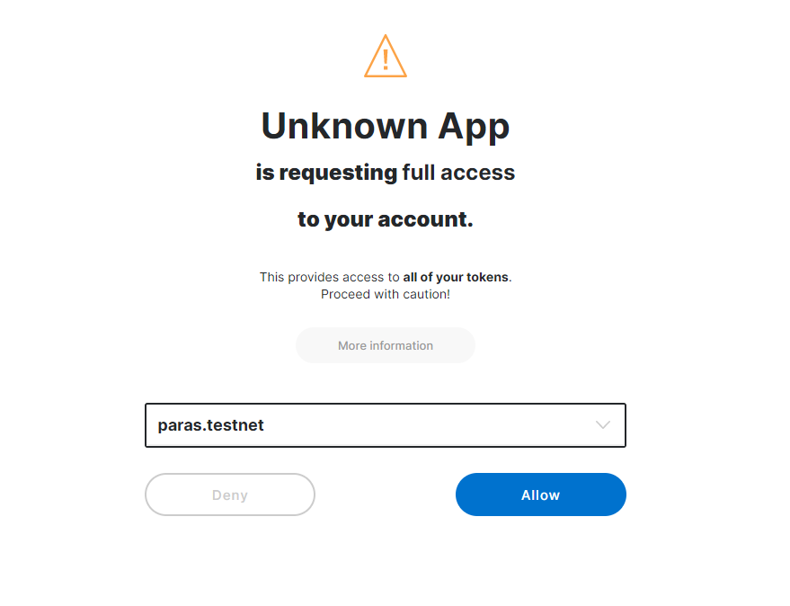
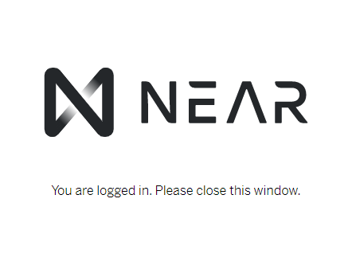

# Introduction

[NFTs](https://en.wikipedia.org/wiki/Non-fungible_token) are unique digital items that have provable ownership on a blockchain. One of the most popular use cases for NFTs right now is digital art. Projects on Ethereum such as [SuperRare](https://superrare.co) leverage the power of blockchain to create digital art that has digital scarcity and true ownership, thus creating a whole new market for artists and collectors in the digital space.

Built on NEAR, [Paras: Digital Art Card](https://paras.id) is an NFT Marketplace that is already available to use. It offers much cheaper NFT minting fees than what is possible on Ethereum, enabling artists to create without being limited by high on-chain fees.

In this tutorial we will be creating the smart contracts for a simple NFT Marketplace similar to [Paras](https://paras.id) and [SuperRare](https://superrare.co) where artists can mint their digital art and sell them directly to collectors. We will be using [NEP-4](https://github.com/near/NEPs/pull/4) NFT standard which is based on the Ethereum [ERC721](https://eips.ethereum.org/EIPS/eip-721) standard.

# Prerequisites

This tutorial requires:

- Install Node.js and NPM
- Install the [NEAR CLI](https://github.com/near/near-cli)
- Complete the [NEAR 101 Pathway](https://learn.figment.io/protocols/near)
- Complete the [intro to NFTs on NEAR](https://learn.figment.io/tutorials/write-nft-contracts-in-rust)

Not required but still valuable reference material can be found in the NEAR Docs [AssemblyScript Intro](https://docs.near.org/docs/develop/contracts/as/intro), as well as the [Data Storage](https://docs.near.org/docs/concepts/data-storage) page.

If you haven't already, we need to install the `yarn` package manager. The example code we're working with uses `yarn` as its build tool. Run this command to install `yarn` as a global package using Node.js' bundled package manager `npm`:

```bash
npm i -g yarn
```

If that worked, you're ready to develop smart contracts in AssemblyScript and Rust. If you encounter any errors or issues during the install process, you can check out the forums or Discord for help.

# Cloning the NEAR NFT repo

In this tutorial we'll use the forked NEAR's NFT example code on Github. Run these commands to clone that repo and install its requirements:

```bash
git clone https://github.com/figment-networks/NFT
cd NFT
yarn install
```

This repo contains NFT examples in both AssemblyScript and Rust, plus support files and documentation. For the purpose of this tutorial, we'll be building in AssemblyScript instead of Rust. All the files we need for our smart contract live in the subdirectory `contracts/assemblyscript`

# Run and Test

We can also run all of the included unit tests with this command:

```bash
yarn test:unit:as
```

Note that the series of commands being triggered by `test:unit:as` with yarn are defined within the package.json file. You can use this to customize your own commands, but that lies beyond the scope of this tutorial. The important thing to know is that you can see and modify these commands within your `package.json` file! If you get any errors when running `yarn test:unit:as`, you will have to resolve them before you continue.

```json
"scripts": {
    ...
    "test:unit:as": "asp --verbose --nologo -c contracts/assemblyscript/as-pect.config.js -f unit.spec",
    ...
  },
```

The unit test output can be messy, but at the end you should see a summary of results:

    [Result]: ✔ PASS
    [Files]: 1 total
    [Groups]: 8 count, 8 pass
    [Tests]: 13 pass, 0 fail, 13 total

If all the tests are passing then you are ready to proceed!

# Getting to know the NEP-4 Contract

Our marketplace will be based on the NEP-4 Contract. NEP stands for NEAR Enhancement Proposal, which contains various common interfaces and APIs that are used by smart contract developers on top of the NEAR Protocol. NEP-4 is the standard used in NEAR blockchain for non-fungible token (NFT) asset, this standard allows the interoperability between many NFT contracts on the NEAR blockchain like ownership and transfer. The first thing we need to do is to understand the base contract and expand it into a marketplace. The smart contract that we will modify is at `contracts/assemblyscript/NEP-4-basic/main.ts`. Open the file and we'll run through the code together.

## Data Types and Storage

There are many built-in data storages that can be used on NEAR.

```typescript
/**************************/
/* DATA TYPES AND STORAGE */
/**************************/

type AccountId = string;
type TokenId = u64;

// Note that MAX_SUPPLY is implemented here as a simple constant
// It is exported only to facilitate unit testing
export const MAX_SUPPLY = u64(10);

// The strings used to index variables in storage can be any string
// Let's set them to single characters to save storage space
const tokenToOwner = new PersistentMap<TokenId, AccountId>('a');

// Note that with this implementation, an account can only set one escrow at a
// time. You could make values an array of AccountIds if you need to, but this
// complicates the code and costs more in storage rent.
const escrowAccess = new PersistentMap<AccountId, AccountId>('b');

// This is a key in storage used to track the current minted supply
const TOTAL_SUPPLY = 'c';
```

## Change Methods

These change methods are the ones that mutate the blockchain state. The code itself is similar to the `ERC721` standard of Ethereum. One thing to note is the `grant_access` function, which allows other accounts (including smart contracts) to have access to your account. This is usually used in conjunction with front-end code to transfer tokens on your behalf.

```typescript
/******************/
/* CHANGE METHODS */
/******************/

// Grant access to the given `accountId` for all tokens the caller has
export function grant_access(escrow_account_id: string): void {
  escrowAccess.set(context.predecessor, escrow_account_id);
}

// Revoke access to the given `accountId` for all tokens the caller has
export function revoke_access(escrow_account_id: string): void {
  escrowAccess.delete(context.predecessor);
}

// Transfer the given `token_id` to the given `new_owner_id`. Account `new_owner_id` becomes the new owner.
// Requirements:
// * The caller of the function (`predecessor`) should have access to the token.
export function transfer_from(
  owner_id: string,
  new_owner_id: string,
  token_id: TokenId,
): void {
  const predecessor = context.predecessor;

  // fetch token owner and escrow; assert access
  const owner = tokenToOwner.getSome(token_id);
  assert(owner == owner_id, ERROR_OWNER_ID_DOES_NOT_MATCH_EXPECTATION);
  const escrow = escrowAccess.get(owner);
  assert(
    [owner, escrow].includes(predecessor),
    ERROR_CALLER_ID_DOES_NOT_MATCH_EXPECTATION,
  );

  // assign new owner to token
  tokenToOwner.set(token_id, new_owner_id);
}

// Transfer the given `token_id` to the given `new_owner_id`. Account `new_owner_id` becomes the new owner.
// Requirements:
// * The caller of the function (`predecessor`) should be the owner of the token. Callers who have
// escrow access should use transfer_from.
export function transfer(new_owner_id: string, token_id: TokenId): void {
  const predecessor = context.predecessor;

  // fetch token owner and escrow; assert access
  const owner = tokenToOwner.getSome(token_id);
  assert(owner == predecessor, ERROR_TOKEN_NOT_OWNED_BY_CALLER);

  // assign new owner to token
  tokenToOwner.set(token_id, new_owner_id);
}
```

## View Methods

View methods have GET functionalities. It does not cost any gas fee to call but they cannot mutate the blockchain state.

```typescript
/****************/
/* VIEW METHODS */
/****************/

// Returns `true` or `false` based on caller of the function (`predecessor`) having access to account_id's tokens
export function check_access(account_id: string): boolean {
  const caller = context.predecessor;

  // throw error if someone tries to check if they have escrow access to their own account;
  // not part of the spec, but an edge case that deserves thoughtful handling
  assert(caller != account_id, ERROR_CALLER_ID_DOES_NOT_MATCH_EXPECTATION);

  // if we haven't set an escrow yet, then caller does not have access to account_id
  if (!escrowAccess.contains(account_id)) {
    return false;
  }

  const escrow = escrowAccess.getSome(account_id);
  return escrow == caller;
}

// Get an individual owner by given `tokenId`
export function get_token_owner(token_id: TokenId): string {
  return tokenToOwner.getSome(token_id);
}
```

## Minting

In this example the NFT itself is just a simple ID with owner. The metadata such as an image, video or audio is usually stored off-chain on [IPFS](https://ipfs.io/), [Sia](https://siasky.net/) or even a centralized file storage such as [AWS S3](https://aws.amazon.com/s3). In contrast to the Ethereum blockchain, storing data on NEAR is pretty cheap; you can actually store the whole metadata on chain but that is outside the scope of this tutorial. You can always experiment with it for free on the testnet!

[Paras](https://paras.id) does not store any metadata on-chain, instead Paras uses an [IPFS CID](https://docs.ipfs.io/concepts/content-addressing/) as the Token ID. There are many designs that you can experiment with when building your NFTs.

```typescript
export function mint_to(owner_id: AccountId): u64 {
  // Fetch the next tokenId, using a simple indexing strategy that matches IDs
  // to current supply, defaulting the first token to ID=1
  //
  // * If your implementation allows deleting tokens, this strategy will not work!
  // * To verify uniqueness, you could make IDs hashes of the data that makes tokens
  //   special; see https://twitter.com/DennisonBertram/status/1264198473936764935
  const tokenId = storage.getPrimitive<u64>(TOTAL_SUPPLY, 1);

  // enforce token limits – not part of the spec but important!
  assert(tokenId <= MAX_SUPPLY, ERROR_MAXIMUM_TOKEN_LIMIT_REACHED);

  // assign ownership
  tokenToOwner.set(tokenId, owner_id);

  // increment and store the next tokenId
  storage.set<u64>(TOTAL_SUPPLY, tokenId + 1);

  // return the tokenId – while typical change methods cannot return data, this
  // is handy for unit tests
  return tokenId;
}
```

# Marketplace

We are done with the basic NFT contract; users can now mint their NFTs. In the next step, we will be creating the marketplace where the NFT owner can list NFTs, indicate their price, and make them purchasable by any user on NEAR. We'll be adding unit tests after each function/feature that we build to make sure it works as expected before we deploy it to NEAR.

# Unit Tests

Unit tests can be found in the **tests** folder. Package `as-pect` was used for unit tests in AssemblyScript. You can use `VMContext` to mock various items on the NEAR runtime for testing functionality like contract caller, attached deposit, etc.

You can run the tests using:

```bash
yarn test:unit:as
```

We will be adding more features one by one to our basic NFT contract and run unit tests for every function that we create.

# Data Types and Storage

We need to create a new `PersistentUnorderedMap` that stores the price for all the tokens listed by their owner. We use `u128` as the data types for `Price` because the NEAR token is also in `u128`. We use `PersistentUnorderedMap` as we want to create a `key-value` storage that can also be retrieved as a list.

First, let's import `u128` and `PersistentUnorderedMap` from the `near-sdk-as`. Update the following line at the top of `main.ts`:

```typescript
import {
  PersistentMap,
  storage,
  context,
  u128,
  PersistentUnorderedMap,
} from 'near-sdk-as';
```

Then we can use the imported `PersistentUnorderedMap` as the data structure for our market. Write the following code in the `DATA TYPES AND STORAGE` section after the import section in `main.ts`:

```typescript
type Price = u128;

const market = new PersistentUnorderedMap<TokenId, Price>('m');
```

# Add Token to Market

Next, we create a private function called `internal_add_to_market` as the main function to add tokens and their price to the marketplace. The public function `add_to_market` is basically the wrapper for the `internal_add_to_market` that can be called by users to list their token to the market with validation.

Add the following in the section `NON-SPEC METHODS` at the bottom of the file `main.ts`:

```typescript
export function add_to_market(token_id: TokenId, price: Price): boolean {
  const caller = context.predecessor;

  // validate token owner
  const owner = tokenToOwner.getSome(token_id);
  assert(owner == caller, ERROR_TOKEN_NOT_OWNED_BY_CALLER);

  // set the price for sale
  internal_add_to_market(token_id, price);

  return true;
}

function internal_add_to_market(token_id: TokenId, price: Price): void {
  market.set(token_id, price);
}
```

As mentioned earlier, we'll be adding a test after adding a new feature for the smart contract. First let's update the import statement at the top of the file (`__tests__/main.unit.spec.ts`).

```typescript
import { u128, VMContext } from 'near-sdk-as';
```

You can add the following code at the end of the current unit test file `__tests__/main.unit.spec.ts`. The comment itself is already self-explanatory.

```typescript
describe('add_to_market', () => {
  it('should add nft to market and return true', () => {
    VMContext.setPredecessor_account_id(alice);
    // mint new token that return its id
    const tokenId = nonSpec.mint_to(alice);
    // 1 NEAR
    const price = u128.from('1000000000000000000000000');

    expect(nonSpec.add_to_market(tokenId, price)).toBe(true);
  });

  it('should throw error if called by non owner', () => {
    expect(() => {
      VMContext.setPredecessor_account_id(alice);
      // mint new token that return its id
      const tokenId = nonSpec.mint_to(alice);
      // 1 NEAR
      const price = u128.from('1000000000000000000000000');

      VMContext.setPredecessor_account_id(bob);
      nonSpec.add_to_market(tokenId, price);
    }).toThrow(nonSpec.ERROR_TOKEN_NOT_OWNED_BY_CALLER);
  });
});
```

After creating the market we need to have a function to fetch the price. Let's create a simple get function `get_market_price` that takes `token_id` and returns its price.

```typescript
export function get_market_price(token_id: TokenId): Price {
  return market.getSome(token_id);
}
```

Again, we need to create a unit test for our function to make sure it works as expected.

```typescript
describe('get_market_price', () => {
  it('return market price for a token', () => {
    VMContext.setPredecessor_account_id(alice);
    // mint new token that return its id
    const tokenId = nonSpec.mint_to(alice);
    // set price to be 1 NEAR
    const price = u128.from('1000000000000000000000000');
    nonSpec.add_to_market(tokenId, price);
    // get the market price of tokenId
    expect(nonSpec.get_market_price(tokenId)).toBe(price);
  });
});
```

Now let's run the tests using:

```bash
yarn test:unit:as
```

It should return something like this:

```bash
...
 [Success]: ✔ should add nft to market and return true
 [Success]: ✔ should throw error if called by non owner

 Success]: ✔ return market price for a token
...
```

# Remove Token from Market

The code for removing a token from the market is pretty similar to adding one. We create a private `internal_remove_from_market` that deletes the token listing from the market and a public `remove_from_market` that validates the token ownership and whether the token is in the market or not. Let's update our `main.ts` and add the following code at the end of the file.

```typescript
export function remove_from_market(token_id: TokenId): boolean {
  const caller = context.predecessor;

  // validate token owner
  const owner = tokenToOwner.getSome(token_id);
  const escrow = escrowAccess.get(owner);
  assert(
    [owner, escrow].includes(caller),
    ERROR_CALLER_ID_DOES_NOT_MATCH_EXPECTATION,
  );

  assert(market.getSome(token_id), ERROR_TOKEN_NOT_IN_MARKET);

  // remove token from market
  internal_remove_from_market(token_id);

  return true;
}

function internal_remove_from_market(token_id: TokenId): void {
  market.delete(token_id);
}
```

We check if the token exists in the market before attempting to remove it. If the token doesn't exist, we return the error `ERROR_TOKEN_NOT_IN_MARKET`. Let's add this new error type to the section `ERROR MESSAGES` at the top of `main.ts`:

```typescript
export const ERROR_TOKEN_NOT_IN_MARKET = 'Token is not available in market.';
```

Here's the test case that we create for `remove_from_market`, you can put it at the end of the test file `__tests__/main.unit.spec.ts`:

```typescript
describe('remove_from_market', () => {
  it('should remove nft from market and return true', () => {
    VMContext.setPredecessor_account_id(alice);
    // mint new token that return its id
    const tokenId = nonSpec.mint_to(alice);
    // 1 NEAR
    const price = u128.from('1000000000000000000000000');
    // add token to market
    expect(nonSpec.add_to_market(tokenId, price)).toBe(true);
    // remove token from market
    expect(nonSpec.remove_from_market(tokenId)).toBe(true);
  });

  it('should throw error for nft available in market', () => {
    expect(() => {
      VMContext.setPredecessor_account_id(alice);
      // mint new token that return its id
      const tokenId = nonSpec.mint_to(alice);
      // throw error when try to remove token id that was not listed
      nonSpec.remove_from_market(tokenId);
    }).toThrow(nonSpec.ERROR_TOKEN_NOT_IN_MARKET);
  });
});
```

Now let's run the tests using:

```bash
yarn test:unit:as
```

It should return something like this:

```bash
...
 [Success]: ✔ should remove nft from market and return true
 [Success]: ✔ should throw error for nft available in market
...
```

# Buy Functionality

This is the main function for the marketplace where users can buy the listed NFTs on the marketplace. Buyers can attach some NEAR as payment and the contract will automatically send the payment to the seller and update the token ownership to the buyer. We'll also create a simple transaction fee or commission for the smart contract developer, in this example we'll take a 5% cut for every sale made via the smart contract.

First, let's setup a constant for our commission. You can write this constant at the top of `main.ts` in the `DATA TYPES AND STORAGE` section.

```typescript
const COMMISSION = 5;
```

If the deposit amount and the current NFT price are not equal, we return the error `ERROR_DEPOSIT_NOT_MATCH`. Let's add this to `ERROR MESSAGES` section at the top of `main.ts`:

```typescript
export const ERROR_DEPOSIT_NOT_MATCH =
  'Deposit does not match the market price';
```

Let's start coding the buy function. To retrieve the amount of payment in the smart contract, we can use `context.attachedDeposit`. After that we need to validate the deposit amount and the current NFT price. Add the following to `NON-SPEC METHODS` in `main.ts`:

```typescript
export function buy(token_id: TokenId): TokenId {
  const caller = context.predecessor;

  const amount = context.attachedDeposit;
  const price = market.getSome(token_id);

  // check if the amount deposited match with the price
  assert(amount == price, ERROR_DEPOSIT_NOT_MATCH);

  // 1. Calculate commission & transfer payment

  // 2. Remove from market & update token ownership
}
```

## Calculate commission & transfer payment

We can transfer the payment to the account by using `ContractPromiseBatch`. We will be using promise batch `ContractPromiseBatch.create(accountId).transfer(amount)`. The first promise `.create`, is to create the receiver account, followed by `.transfer` to transfer the payment to the receiver account.

First, we need to import the `ContractPromiseBatch` by updating the top section of `main.ts`:

```typescript
import {
  PersistentMap,
  storage,
  context,
  u128,
  PersistentUnorderedMap,
  ContractPromiseBatch,
} from 'near-sdk-as';
```

We also need to update our buy function to automatically transfer the deposited amount to the receiver and to the smart contract (transaction fee). Update the buy function in the `main.ts` file under the comment `// 1. Calculate commission & transfer payment` add the following code snippet below:

```typescript
// calculate commission for the smart contract
const owner = tokenToOwner.getSome(token_id);
const forOwner: u128 = u128.div(
  u128.mul(amount, u128.from(100 - COMMISSION)),
  u128.from(100),
);
const contract = context.contractName;
const forContract: u128 = u128.sub(amount, forOwner);

// tranfer the deposit to token owner and smart contract
ContractPromiseBatch.create(owner).transfer(forOwner);
ContractPromiseBatch.create(contract).transfer(forContract);
```

## Remove from market & update token ownership

After the payments have been made, we need to remove the token from the marketplace and update the ownership of the token to the buyer. We return the `token_id` at the end of the function. Add this snippet below the `// 2. Remove from market & update token ownership` comment in `main.ts` file:

```typescript
// remove the token from the market
internal_remove_from_market(token_id);

// update the token owner
tokenToOwner.set(token_id, caller);

return token_id;
```

As you can see, we call the private `internal_remove_from_market` function to remove the token from the marketplace without any validation.

We can now test our `buy` function using the unit test below by updating the end of our `main.unit.spec.ts`:

```typescript
describe('buy', () => {
  it('transfer token and remove it from market', () => {
    VMContext.setPredecessor_account_id(alice);
    // mint new token that return its id
    const tokenId = nonSpec.mint_to(alice);
    // set price to be 1 NEAR
    const price = u128.from('1000000000000000000000000');
    nonSpec.add_to_market(tokenId, price);
    // mock the Buyer id & the deposit amount
    VMContext.setPredecessor_account_id(bob);
    VMContext.setAttached_deposit(price);
    // Buyer (bob) will call this buy function
    nonSpec.buy(tokenId);
    // after successful purchase the owner of the NFT must be bob
    expect(get_token_owner(tokenId)).toBe(bob);
  });
});
```

Now let's run the tests using:

```bash
yarn test:unit:as
```

It should return something like this:

```bash
...
 [Success]: ✔ transfer token and remove it from market
...
```

# Fetch Marketplace Tokens

First we need to create the struct `TokenDetail` and add the decorator `nearBindgen` to serialize/deserialize the struct in the NEAR runtime (think of it as the required syntax for every struct to run on the NEAR protocol).

We will create the function `get_market` that will return a list of `TokenDetail` that contains the `tokenId` and its `price`. For the implementation, we use `.entries()` from `PersistentUnorderedMap` that takes the start and end indexes from our list (we can use this for pagination later when building the frontend application).

Add the following code at the end of `main.ts`:

```typescript
@nearBindgen
export class TokenDetail {
  tokenId: TokenId;
  price: Price;

  constructor(tokenId: TokenId, price: Price) {
    this.tokenId = tokenId;
    this.price = price;
  }
}

export function get_market(start: i32, end: i32): TokenDetail[] {
  const results: TokenDetail[] = [];

  const tokenList = market.entries(start, end);
  for (let i = 0; i < tokenList.length; i++) {
    results.push(new TokenDetail(tokenList[i].key, tokenList[i].value));
  }

  return results;
}
```

Let's write the test and see if it works as expected. We will mint 3 new NFTs and add all of them to the market then expect to see 3 listed NFTs. Open our `main.unit.spec.ts` file and add the following code at the end of the file.

```typescript
describe('get_market', () => {
  it('return market price for a token', () => {
    VMContext.setPredecessor_account_id(alice);

    const price = u128.from('1000000000000000000000000');
    // mint new token that return its id
    const tokenId_1 = nonSpec.mint_to(alice);
    nonSpec.add_to_market(tokenId_1, price);

    const tokenId_2 = nonSpec.mint_to(alice);
    nonSpec.add_to_market(tokenId_2, price);

    const tokenId_3 = nonSpec.mint_to(alice);
    nonSpec.add_to_market(tokenId_3, price);
    // set price to be 1 NEAR
    // get the first 5 NFTs listed on the market
    expect(nonSpec.get_market(0, 5)).toHaveLength(3);
  });
});
```

Now let's run the tests using:

```bash
yarn test:unit:as
```

It should return something like this:

```bash
...
 [Success]: ✔ return market price for a token
...
```

# Build the Contract

Before we build the contract, let's test the newly added code and see if everything goes well.

```bash
yarn test:unit:as
```

If it returns something like this then we're good to go. If not, make sure you don't have any typos and that you're using the latest `near-sdk-as`.

```bash
[Result]: ✔ PASS
[Files]: 1 total
[Groups]: 13 count, 13 pass
[]Tests]: 20 pass, 0 fail, 20 total
```

To build our contract into WebAssembly, we simply use the command below:

```bash
yarn build:as
```

If you see any errors, the compiler should give you a detailed explanation. Since you've copied and pasted everything from this tutorial, it's probably just typos.

The complete code for this tutorial can be found on [Github](https://github.com/figment-networks/tutorials/near/7_NFT_marketplace).

# Deploying and Using the Contract

We can use the NEAR CLI to deploy this contract and to test that it's working. Run this command to deploy the contract you just built:

```bash
near dev-deploy out/main.wasm
```

The output will show details of the deployment transaction, and the ID of the test NEAR account that the CLI auto-generated for you. It should look something like this:

```bash
Starting deployment. Account id: dev-1610108148519-8579413, node: https://rpc.testnet.near.org, helper: https://helper.testnet.near.org, file: out/main.wasm
Transaction Id HiGAnagXLY7TaCzmLRBCSzgDPWjSFifaLTQsfARmj1Qy
To see the transaction in the transaction explorer, please open this url in your browser
https://explorer.testnet.near.org/transactions/HiGAnagXLY7TaCzmLRBCSzgDPWjSFifaLTQsfARmj1Qy
Done deploying to dev-1610108148519-8579413
```

In NEAR, you need to deploy a contract into a certain account. Using `dev-deploy` will create a test account and deploy the contract into that account at once. The test account looks something like `dev-xxxxxxxxxxx-xxxxx`. It's very different if you're coming from Ethereum, where every deployment will create new address and storage for the smart contract.

From the command above we learn that we created an account with the ID `dev-1610108148519-8579413` into which we just deployed the smart contract. The smart contract ID is basically the account ID which is `dev-1610108148519-8579413`. You'll have a different ID, so remember to replace these contract IDs with yours when following the commands below.

# Interact with the NEAR Testnet

We can use NEAR CLI to interact with the blockchain. There are 2 main commands: `call` and `view`. `call` is used to mutate blockchain state and `view` is only to get data from the blockchain.

First, we need to authenticate a few accounts into the NEAR CLI. Go to `https://wallet.testnet.near.org/` and create 2 accounts, you can name them anything you want but in this tutorial we'll refer to them as `artist` and `collector`. After that, go back to your terminal and use this command:

```bash
near login
```

It will return something like this and open your default browser. If your browser doesn't automatically open, you can just follow the instructions.

```bash
Please authorize NEAR CLI on at least one of your accounts.

If your browser doesnt automatically open, please visit this URL                                                                   https://wallet.testnet.near.org/login/?title=NEAR+CLI&public_key=ed25519%3AAZCY2SeK6FQe6DFWfNjgxnAfF9TprTirwdduiksLEgBa&success_url=http%3A%2F%2F127.0.0.1%3A5000                                                                                                       Please authorize at least one account at the URL above.
```

Choose one of the accounts that you've just created to authenticate in our terminal.



Click allow and follow the confirmation page by entering your account id. Just type in your selected account id (in this example we need to type `paras.testnet`)


If everything goes well, you will redirect to this page.



Do this twice so that your 2 new accounts are authenticated on the NEAR CLI. We can check whether those accounts are authenticated on our computer with this command:

```bash
ls ~/.near-credentials/default/
```

If you see at least 2 files with `[account_id].json`, then we're good to go. Without further ado, let's try some functions that we created previously with these new accounts.

# Mint an NFT!

We need to use the `call` method to mint a new NFT because it will mutate the blockchain state. We will use the function `mint_to` to mint a new NFT and assign its ownership to somebody. You can use the command below:

```bash
near call --accountId [ARTIST_ID] [DEV_ID] mint_to '{"owner_id": "[ARTIST_ID]"}'
```

Make sure to change `[ARTIST-ID]` to one of the accounts that you created earlier in the browser, and `[DEV-ID]` with the account id we created when deploying our smart contract. Running the above command will return the tokenId of the newly minted NFT:

```text
'1'
```

# Add to Marketplace

We can add our newly minted NFT to the marketplace to see if there are collectors that are interested in adding it into their collections. We can use the function `add_to_market` to do this which takes `token_id` and `price` as parameters. The price must be in yoctoNEAR (10^24), in this case we sell our NFT for 1 N -> 1000000000000000000000000 yoctoNEAR. Make sure to change the parameters `[TOKEN_ID]` into any NFT ID that you own/mint.

```bash
near call --accountId [ARTIST_ID] [DEV_ID] add_to_market '{"token_id": "[TOKEN_ID]", "price": "1000000000000000000000000"}'
```

This call function should return true if everything goes well.

We can validate if our NFT is listed on the marketplace as expected using the view function `get_market_price` that takes `token_id` as the parameter.

```bash
near view --accountId [ARTIST-ID] [DEV_ID] get_market_price '{"token_id": "[TOKEN_ID]"}'
```

It should return the price that we've just set previously using `add_to_market` which is 1 N.

# Buy an NFT

This time, we'll be using the other account you created, let's call this account the collector `COLLECTOR_ID`. The collector can buy the listed NFT by calling the function `buy` which requires `[TOKEN_ID]` as its parameter. This time we add `--amount` to buy the NFT and we attach 1 N as it is the listed price needed to buy the NFT.

Before we buy the NFT, let's just take note of the current balance of the artist and collector using the NEAR CLI command below:

```bash
near state [ACCOUNT_ID]
```

You can replace the `[ACCOUNT_ID]` with `[ARTIST_ID]` or `[COLLECTOR_ID]` and it will return something like this:

```javascript
{
    "amount": "88126613751512027823390000",
    "locked": "0",
    "code_hash": "11111111111111111111111111111111",
    "storage_usage": 2844,
    "storage_paid_at": 0,
    "block_height": 32018936,
    "block_hash": "Ffc1kw56xpCV1fPJVHNEtfbDbfPF4wkhQNbvbUbXpH5M",
    "formattedAmount": "88.12661375151202782339"
}
```

The `formattedAmount` is the current balance of the account, so just take note of this value so that you can compare it to the `formattedAmount` after the purchase is complete. We call the `buy` function with `[COLLECTOR_ID]`:

```bash
near call --accountId [COLLECTOR_ID] [DEV_ID] buy '{"token_id": "[TOKEN_ID]"}' --amount 1
```

If everything goes well, we can validate the ownership and balance change.

```bash
near view --accountId [COLLECTOR_ID] [DEV_ID] get_token_owner '{"token_id": "[TOKEN_ID]"}'
```

We can call `near state [ACCOUNT_ID]` to check if the payment is already received by the seller/artist and deducted from the buyer balance.

# Conclusion

Congratulations! We have deployed the modified NFT smart contract in AssemblyScript with the Marketplace functionality on the NEAR Testnet. You can now keep experimenting by calling other functions like `delete_from_market` and others. You can also connect this contract with the javascript sdk `near-api-js` and create the frontend application for your marketplace.

Please remember that this code is not intended for production: there are still a few other things to consider if you wanted to deploy this to mainnet such as disabling the transfer method if the token is listed on the market and so on.

The complete code for this project can be found on [Github](https://github.com/figment-networks/tutorials/near/7_NFT_marketplace/).
