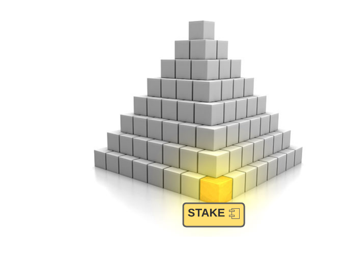

In the last tutorial, we learned about the new NEAR [Account Storage API (NEP-145)](5-account-storage.md). As promised, in this tutorial we'll see how to code that up on the [STAKE](https://github.com/oysterpack/oysterpack-near-stake-token) contract. As a bonus, you will get a chance to earn some NEAR at the end for taking the [Account Storage API (NEP-145)](5-account-storage.md) for a test drive on the [STAKE](https://github.com/oysterpack/oysterpack-near-stake-token) contract.

# Show me the Rust Interface

```rust
#[derive(Serialize, Default, PartialEq, Debug)]
#[serde(crate = "near_sdk::serde")]
pub struct AccountStorageBalance {
    pub total: YoctoNear,
    pub available: YoctoNear,
}

/// Account Storage Standard API - NEP-145
pub trait AccountStorage {

    fn storage_deposit(&mut self, account_id: Option<ValidAccountId>) -> AccountStorageBalance;

    fn storage_withdraw(&mut self, amount: Option<YoctoNear>) -> AccountStorageBalance;

    fn storage_minimum_balance(&self) -> YoctoNear;

    fn storage_balance_of(&self, account_id: ValidAccountId) -> AccountStorageBalance;
}
```

Overall, the Rust interface code is pretty straight forward. However, you may be asking, where is [YoctoNear](https://github.com/oysterpack/oysterpack-near-stake-token/blob/main/contract/src/interface/model/yocto_near.rs) coming from? It's one of my creations, currently residing within the [STAKE](https://github.com/oysterpack/oysterpack-near-stake-token) project. Your follow up question may be, why not use [U128](https://docs.rs/near-sdk/2.0.1/near_sdk/json_types/struct.U128.html)? My answer is because I am a big fan of domain driven design. I prefer to model the domain and encode it into the type system. It keeps the code cleaner, easier to understand, safer, and smarter.

> My plan is to extract the reusable code from the [STAKE](https://github.com/oysterpack/oysterpack-near-stake-token) into a shared library and publish it on <https://crates.io> for the community to leverage. For example, it would be super useful to have reusable libraries for each of the NEAR standards. As I build more contracts, the last thing I want to do is copy and paste code from one project to another.
>
> If there are folks from the NEAR community that are interested, then feel free to reach out to me.

# Show me the Rust Implementation

We'll look at each function in turn and see how it fits into the [STAKE](https://github.com/oysterpack/oysterpack-near-stake-token) picture.

## storage_deposit

```rust
#[payable]
fn storage_deposit(&mut self, account_id: Option<ValidAccountId>) -> AccountStorageBalance {
    assert!(env::attached_deposit() > 0, ATTACHED_DEPOSIT_IS_REQUIRED);               // #1

    let account_id = account_id.map_or_else(                                          // #2
        || env::predecessor_account_id(),
        |account_id| account_id.as_ref().to_string(),
    );
    match self.lookup_registered_account(&account_id) {                               // #3
        None => self._register_account(&account_id),
        // deposit funds into account storage escrow
        Some(mut account) => {
            account
                .storage_escrow
                .credit(env::attached_deposit().into());
            self.save_registered_account(&account);
        }
    }
    // track total account storage escrow balance at contract level
    self.total_account_storage_escrow += env::attached_deposit().into();              // #4

    self._storage_balance_of(&account_id)                                             // #5
}
```

In the [STAKE](https://github.com/oysterpack/oysterpack-near-stake-token) project, accounts have an explicit storage escrow balance. Any funds deposited via `storage_deposit()` will be put into that balance. Currently, there is no [STAKE](https://github.com/oysterpack/oysterpack-near-stake-token) use case that requires a storage deposit more than the minimum required balance, i.e., account storage usage is capped. Thus, [STAKE](https://github.com/oysterpack/oysterpack-near-stake-token/blob/main/contract/src/interface/model/yocto_near.rs) accounts will only ever need to make the initial minimum deposit to register the account with the contract. One other note is that if/when NEAR storage prices decrease, [STAKE](https://github.com/oysterpack/oysterpack-near-stake-token) contract is designed to update the storage price, which will unlock NEAR from the account's storage balance and make it available for withdrawal.

Let's walk through the code:

1.  First thing the code does is perform a quick check to make sure there is an attached deposit. As a best practice, the first thing your functions should do is check args and constraints. `ValidAccountId`, which is provided by the NEAR Rust SDK, has built in validation. The function call will fail fast if an invalid account ID is specified.

2.  We determine which account ID is the storage deposit for. Recall that this function enables the predecessor account to deposit storage funds on behalf of the specified `account_id`. If `account_id`, is not specified, the storage deposit is for the predecessor account.

3.  Next we check if the account is already registered. If there is no registered account, then the account is registered. I prefer to keep functions small, easy to follow, and focused. The account registration logic is put into its own separate private function:

    ```rust
    fn _register_account(&mut self, account_id: &str) {
     assert!(
         env::attached_deposit() >= self.account_storage_fee().value(),
         INSUFFICIENT_STORAGE_FEE,
     );
     let account = Account::new(env::attached_deposit().into());
     self.save_registered_account(&RegisteredAccount {
         account,
         id: Hash::from(account_id),
     });
    }
    ```

4.  The total amount of NEAR that is escrowed for storage across all accounts is tracked on [STAKE](https://github.com/oysterpack/oysterpack-near-stake-token). This is specific to the [STAKE](https://github.com/oysterpack/oysterpack-near-stake-token) use case related to its "profit sharing" program to boost STAKE token yield - that's a future topic for discussion.

5.  Finally, we return the account's storage balance. It uses a private function that is shared with `storage_balance_of`

    ```rust
    fn _storage_balance_of(&self, account_id: &str) -> AccountStorageBalance {
     match self.lookup_registered_account(account_id) {
         None => AccountStorageBalance::default(),
         Some(account) => self.account_storage_balance(&account),
     }
    }
    ```

6.  Per the standard, if the account is not registered, then a zero balance is returned, which is the default implementation for `AccountStorageBalance`

## storage_withdraw

```rust
#[payable]
fn storage_withdraw(&mut self, amount: Option<YoctoNear>) -> AccountStorageBalance {
    assert_yocto_near_attached();                                                           // #1
    if let Some(amount) = amount.as_ref() {
        assert!(
            amount.value() > 0,
            "withdraw amount must be greater than zero"
        );
    }
    let mut account = self.predecessor_registered_account();

    let account_storage_balance = self.account_storage_balance(&account);                   // #2
    let withdraw_amount = amount.unwrap_or(account_storage_balance.available.clone());
    assert!(
        withdraw_amount.value() <= account_storage_balance.available.value(),
        "ERR: account storage available balance is insufficient"
    );

    // update balances                                                                      // #3
    let withdraw_amount = withdraw_amount.into();
    account.storage_escrow.debit(withdraw_amount);
    self.save_registered_account(&account);
    self.total_account_storage_escrow -= withdraw_amount;

    // get updated account storage balance                                                  // #4
    let account_storage_balance = self.account_storage_balance(&account);
    // transfer the withdrawal amount + the attached yoctoNEAR
    Promise::new(env::predecessor_account_id()).transfer(withdraw_amount.value() + 1);      // #5
    account_storage_balance
}
```

1.  As usual, we start with checks:

    - Check that exactly 1 yoctoNEAR is attached (per NEP-145)
    - If amount is specified, check that the amount is greater than zero
    - `self.predecessor_registered_account()` kills 2 birds with 1 stone - the function is designed to panic if the account is not registered

2.  Check if the requested withdrawal amount is less than or equal to the account's storage available balance. If an amount is not specified, then the total available storage balance will be withdrawn.

3.  Update the account storage balance, and persist the account change to storage. In the STAKE contract, accounts are stored using the [LookupMap](https://github.com/oysterpack/oysterpack-near-stake-token/blob/main/contract/src/lib.rs) provided by the NEAR Rust SDK. Any changes made to objects retrieved from the [LookupMap](https://github.com/oysterpack/oysterpack-near-stake-token/blob/main/contract/src/lib.rs) must be explicitly written back out to contract storage. For details on how that exactly works, look at the

    `self.predecessor_registered_account()` for reading and
    `self.save_registered_account(&account)` for writing to contract storage.

4.  Then we get the updated account storage balance to return at the end.

5.  Before returning the updated account storage balance, the requested withdrawal amount is transferred back to the predecessor account.

# And the rest of the code

```rust
fn storage_minimum_balance(&self) -> YoctoNear {
  self.account_storage_fee()
}

fn storage_balance_of(&self, account_id: ValidAccountId) -> AccountStorageBalance {
  self._storage_balance_of(account_id.as_ref())
}
```

The above code is pretty simple. What you may find of useful is how the STAKE contract computes the account storage fee. When the contract is first deployed, it measures how much storage is allocated for a "mock" account that is temporarily created and then deleted during the contract initialization phase - see the [Contract::new()](https://github.com/oysterpack/oysterpack-near-stake-token/blob/main/contract/src/lib.rs) init function for details.

# Show Me the Demo: Earn Some NEAR

As a bonus, you can earn some NEAR by taking the STAKE token contract for a test drive on testnet and running through the demo below using the [NEAR CLI](https://github.com/near/near-cli). I have deployed the STAKE contract to `stake-demo.oysterpack.testnet` on testnet for the demo. To earn NEAR rewards for exercising the demo, you will need to submit the NEAR requests through [DataHub](https://datahub.figment.io/) using your DataHub access key. If you have earned NEAR on previous NEAR tutorials, then you should already be set. Otherwise, follow the instructions in the following link on [how to obtain your DataHub access key](https://learn.figment.io/network-documentation/near/tutorials/intro-pathway-write-and-deploy-your-first-near-smart-contract/1.-connecting-to-a-near-node-using-datahub#configure-environment). We will use the NEAR CLI to submit the transactions. Plugin your DataHub API Key and NEAR account at the top, and then you should be all set to go.

```bash
export DATAHUB_APIKEY=<DATAHUB_APIKEY>
export NEAR_ACCOUNT=<YOUR-NEAR-ACCOUNT.testnet>

export CONTRACT=stake-demo.oysterpack.testnet
export NEAR_NODE_URL=https://near-testnet--rpc.datahub.figment.io/apikey/$DATAHUB_APIKEY
export NEAR_ENV=testnet

# check what is the account's minimum required storage balance required to register the account with the contract
near view $CONTRACT storage_minimum_balance --node_url $NEAR_NODE_URL

# check your storage balance
# if your account is not registered with the contract, then a zero balance is returned
near view $CONTRACT storage_balance_of --node_url $NEAR_NODE_URL --args "{\"account_id\":\"$NEAR_ACCOUNT\"}"

# deposit funds into your storage balance
# if this is your initial deposit, then your account will be registered with the contract
near call $CONTRACT storage_deposit --node_url $NEAR_NODE_URL --accountId $NEAR_ACCOUNT --amount 1

# withdraw your storage available balance
# per the NEP-145, 1 yoctoNEAR must be attached to the function call
near call $CONTRACT storage_withdraw --node_url $NEAR_NODE_URL --accountId $NEAR_ACCOUNT --amount 0.000000000000000000000001

# check your storage balance again
# after the withdrawal, your available balance should be zero
near view $CONTRACT storage_balance_of --node_url $NEAR_NODE_URL --args "{\"account_id\":\"$NEAR_ACCOUNT\"}"
```

# Conclusion

The NEAR Rust ecosystem support for writing smart contracts is very young. For now, all you have is the [NEAR Rust SDK](https://crates.io/crates/near-sdk). There is currently no library support for the new standards that are being developed in the ecosystem yet. Until there is, you will need to implement standard contract interfaces yourself. It's pretty straight forward, but much more time consuming for new developers coming onboard to NEAR to write Rust smart contracts. Until then, you have my tutorials and the reference code implementations within the [STAKE](https://github.com/oysterpack/oysterpack-near-stake-token) project to help you get going faster.

This is where I make my call for action to the community. I invite you to join the Figment and NEAR communities and embark on our common mission to defend and take back the Internet together.

# Next Steps

Here's my plan going forward. As new NEAR standards are released, I plan to document them and provide reference implementations as tutorials. The rest of the time will be spend focused on the core mission, which is to build the [STAKE Token](https://github.com/oysterpack/oysterpack-near-stake-token) with the community and bring it to market. In the next tutorial, I will share with you my vision for the [STAKE Token](https://github.com/oysterpack/oysterpack-near-stake-token) and how it can serve as a cornerstone to help bootstrap the NEAR DeFi ecosystem.


