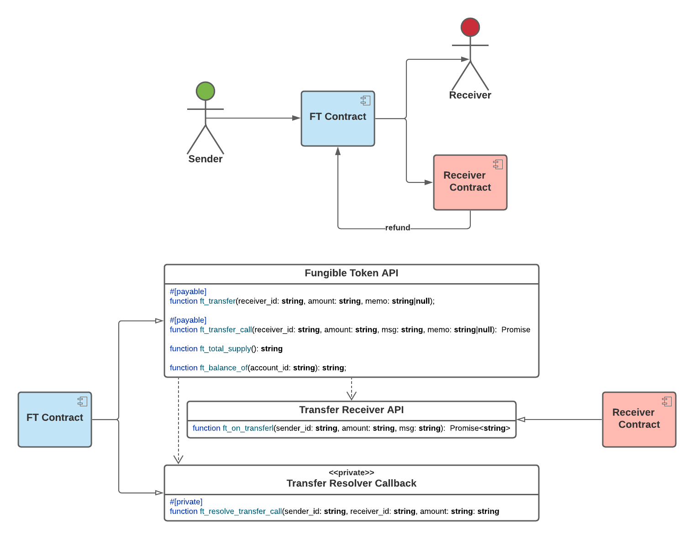

# Introduction

Ever since Bitcoin entered the scene, it has been changing the world. Bitcoin is the first successful proof of concept for decentralized money, i.e., cryptocurrency. It was a technological breakthrough for money. Bitcoin has proven to be a fantastic secure store of value that puts people in full control of their money (assuming you own secure possession of the private keys). However, it simply cannot scale to meet the demands of today's global economy - or local economy for that matter. This is where NEAR can step in and bridge the gap. NEAR shines in terms of speed, scalability, and cost.

# Motivation Behind NEP-141

NEAR's first attempt to bootstrap the ecosystem with an FT (**F**ungible **T**oken) standard was [NEP-21](https://nomicon.io/Standards/Tokens/FungibleToken.html). NEP-21 was designed as a port of Ethereum's first attempt [ERC-20](https://ethereum.org/en/developers/docs/standards/tokens/erc-20/) token standard. However, after living in the wild for a while, ERC-20 problems were exposed:

- [What's Wrong With ERC-20 Token](https://ihodl.com/analytics/2018-10-04/whats-wrong-erc-20-token/)
- [Critical problems of ERC20 token standard](https://medium.com/@dexaran820/erc20-token-standard-critical-problems-3c10fd48657b)

The key to NEAR's success will be its ability to attract capital flows into NEAR through tokens. Starting from a clean state, NEAR has the opportunity to learn from ERC-20 mistakes and build a superior FT solution that provides a better developer and user experience that aligns with NEAR's platform and vision. The NEAR community has been coming together to design the next generation token standards that are needed to make the dream a reality.

The first result of that collective effort has produced [Fungible Token Core Standard NEP-141](https://github.com/near/NEPs/discussions/146). Yours truly has been actively involved in the process, and in this tutorial lesson I will do a deep dive into [NEP-141](https://github.com/near/NEPs/discussions/146) and walk you through the new and improved **Fungible Token Core API**. The online discussion is quite lengthy, and my goal here is to sum it all up for you here.

**NOTE**: as of this writing, NEP-141 official documentation has not yet been published. I will be sharing with you my knowledge and understanding of NEP-141 based on the discussions and meetings I have personally been involved in.

## NEP-141 Advantages: Less is More

Overall, NEP-141 is superior (vs NEP-21) because it is

- Simpler for users
- Simpler for developers
- Much more efficient and cheaper

Transfers are executed with a single function call. There are two transfer mechanisms to choose from. There is a **simple transfer**function targeting user receiver accounts. The simple transfer functionality mirrors NEP-21 simple transfer. The only difference is that NEP-141 introduces support for attaching a memo to the transfer, which will be discussed later on.

Second, there is a **transfer call** function targeting contract receiver accounts. This is where NEP-141 shines over NEP-21. The **transfer call** mechanism is superior to NEP-21's (allowance + transfer_from) mechanism because it eliminates allowances.

This results in removing UX flaws and optimizes contract storage usage. Because of storage staking costs on NEAR, NEP-21 required the sender to attach enough deposit to cover storage allocated to track allowances. To further complicate matters, storage staking costs differ between contracts based on contract implementation.

In addition, this adds overhead and costs to each transfer workflow while providing no value. NEP-141 simplifies and optimizes the UX and workflows to transfer tokens to contracts. Furthermore, removing all this complexity, makes it simpler for developers to implement and integrate. The overall mental model is easier to grasp and understand.

## Fungible Token Core Standard (NEP-141)

NEP-141 defines the "core" standard API that focuses on token transfer. It is not the full and final FT solution, but Rome wasn't built in a day. At a minimum, NEP-141 will be dependent on 2 future standards to be developed:

1.  Account registration
2.  Contract metadata

Additional standards and extensions will also need to be defined to support token burning and minting, which is outside the scope of this discussion. The overall standard design strategy is to use a divide and conquer approach. Instead of designing a single huge standard that covers all use cases and edge cases, the strategy is to divide the standard into multiple smaller and focused APIs. The approach is also based on separation of concerns. This will enable token functionality and tooling to be rolled out incrementally in phases.

It probably is more obvious why standardizing contract metadata is needed:

- Standard metadata makes it simpler and smoother for wallet and application integration
- Standard metadata is used for presentation and build UI
- Standard metadata can be used to discover supported extensions and interfaces on contracts

What is less obvious and what I will dive a little deeper into is how account registration fits into the picture ...

## What does account registration have to do with fungible tokens?

This is a trick question. The key issue that account registration addresses is not specific to FT contracts. Account registration is needed to address who will pay for [storage staking](https://docs.near.org/docs/concepts/storage#how-much-does-it-cost). This is an issue that needs to be addressed by any multi-user contract that allocates storage for the user on the blockchain. Storage staking costs are the most expensive costs to consider for the contract on NEAR. If storage costs are not managed properly, then they can [break the bank](https://docs.near.org/docs/concepts/storage#the-million-cheap-data-additions-attack) for the contract.

On NEAR, the contract is responsible to pay for its long term persistent storage. Thus, FT contracts, and multi-user contracts in general, should be designed to pass on storage costs to its user accounts:

- Contracts should require accounts to pay for their own account storage when the account registers with the contract.
- Contracts should escrow the storage staking fees and refund the fees when the account unregisters.

There's no such thing as a free lunch (TNSTAAFL) ... Everyone must pay for their own way!

> **NOTE**: account registration has other benefits, but we can save that for the [account registration standard discussion](https://github.com/near/NEPs/discussions/145)

# Fungible Token Core Standard - The Big Picture



... a picture says a thousand words ... NEP-141 core elevator pitch is:

- Simple transfers
- Reactive transfer calls to contract recipient with support for refunds
- Account token balance queries
- Token total supply queries

## NOTES

- API functions are specified using the lowest common denominator with the goal of being programming language neutral (as much as possible)
- String type is used as the de facto platform neutral type - but we will be leveraging Rust's type system when building the smart contract implementation
- When interacting with the token contract, all amounts and balances MUST be unsigned integers. Internally all values are stored as a denomination based on the token's base unit used for decimal precision. For example, in NEAR the base unit is yoctoNEAR which translates to a decimal precision of 24 digits, i.e., 1 NEAR = 10^24 yoctoNEAR. Thus, when 1 NEAR is transferred, the transfer amount is specified as 1_000_000_000_000_000_000_000_000 (\`\_\` added to make it easier to read)
- All FT API functions are namespaced using a prefix naming convention (`ft_`). On NEAR, smart contracts are deployed as [WASM](https://webassembly.org/) binaries. At the WASM low level, all functions are effectively in the global namespace and function names must be unique (function overloading is not permitted). Using function prefix names is a trade-off. It enables global functions to be namespaced using a naming convention to avoid function name collisions. For example, a contract may want to implement both FT and NFT token transfer interfaces.
- `#[payable]` implies that the function supports NEAR to be attached to the function call. I will explain why this is needed below
- API functions are tagged as either **_change methods_** or **_view methods_**. This is from the [NEAR JSON RPC API](https://docs.near.org/docs/roles/developer/contracts/api) perspective.
  - Cross contract calls always require gas regardless of whether the function call being invoked is a **_view method_** or **_change method_**

Next, we will walk through each function.

# Fungible Token API

This API is implemented by the FT contract. It provides the core fungible token functionality. Key aspects to call out are:

**Token transfer functions require exactly 1 yoctoNEAR to be attached to address the following security concern:**

Due to the nature of function-call permission access keys on NEAR protocol, the method that requires an attached deposit can't be called by the restricted access key. If the token contract requires an attached deposit of at least 1 yoctoNEAR on transfer methods, then the function-call restricted access key will not be able to call them without going through the wallet confirmation. This prevents some attacks like fishing through an authorization to a token contract.

**Token transfers support optional memo**

Similarly to bank transfer and payment orders, the memo argument enables to reference the transfer to another event (on-chain or off-chain). It is schema less, so user can use it to reference an external document, invoice, order ID, ticket ID, or other on-chain transaction. With memo you can set a transfer reason, often required for compliance. This is also useful and very convenient for implementing FATA (Financial Action Task Force) [guidelines](http://www.fatf-gafi.org/media/fatf/documents/recommendations/RBA-VA-VASPs.pdf) (section 7(b)). Especially a requirement for VASPs (Virtual Asset Service Providers) to collect and transfer customer information during transactions. VASP is any entity which provides to a user token custody, management, exchange or investment services. With ERC-20 and NEP-21 it is not possible to do it in atomic way. With memo field, we can provide such reference in the same transaction and atomically bind it to the money transfer.

### Function

```javascript
#[payable]
function ft_transfer(receiver_id: string, amount: string, memo: string|null)
```

_change method_

Enables simple transfer between accounts.

- Transfers specified `amount` of tokens from the function call's predecessor account to the account specified by `receiver_id`.
  - Predecessor account is the token sender
- Both accounts must be registered with the contract for transfer to succeed.
- Sender account is required to attach exactly 1 yoctoNEAR to the function call
  - The purpose to require 1 yoctoNEAR is to address security concerns explained above
  - Attached yoctoNEAR will be credited to the sender account. Most FT contracts will likely deposit the NEAR into the account's storage escrow. However, the NEAR can be deposited using a different approach as long as the NEAR can be later made available to be withdrawn from the contract. Even though it's only 1 yoctoNEAR, it's still not **zero** yoctoNEAR.

**Arguments:**

- `receiver_id` - the receiver NEAR account ID
- `amount` - the amount of tokens to transfer as an unsigned integer in the token's base unit in string representation
- `memo` - an optional string field in a free form to associate a memo with this transfer.

**Failures:**

- If the attached deposit does not equal 1 yoctoNEAR
- If either sender or receiver account is not registered
- If transfer `amount` is zero
- If the sender account has insufficient funds to fulfill the transfer request

### Function

```javascript
#[payable]
function ft_transfer_call(receiver_id: string, amount: string, msg: string, memo: string|null):  Promise
```

_change_method_

Transfer tokens to a contract with a callback to handle refunds and resolve the transfer.

- Transfers positive `amount` of tokens from the function call's predecessor account (sender) to `receiver_id`account. Then calls `ft_on_transfer` method on `receiver_id` contract and attaches a callback to resolve this transfer.
- `ft_on_transfer` method must return the amount of tokens unused by the receiver contract. The unused tokens must be refunded back to the sender account by the `ft_resolve_transfer` callback.
- Both accounts must be registered with the contract for transfer to succeed.
- Sender must attach exactly 1 yoctoNEAR to address security concerns explained above
  - Attached yoctoNEAR will be credited to the sender account. Most FT contracts will likely deposit the NEAR into the account's storage escrow. However, the NEAR can be deposited using a different approach as long as the NEAR can be made available to be withdrawn from the contract. Even though it's only 1 yoctoNEAR, it's still not **zero** yoctoNEAR.

FT token contract must pass all the remaining unused gas to `ft_on_transfer`

How to handle malicious or invalid behavior by the receiver contract:

- If the receiver contract promise fails or returns invalid value, then the full transfer amount must be refunded.
- If the receiver contract overspent the tokens, and the `receiver_id` balance is lower than the required refund amount, then the remaining balance must be refunded.

Returns a promise to resolve transfer call which will return the unused amount that was refunded.

**Arguments:**

- `receiver_id` - the receiver contract NEAR account ID. This contract must implement `ft_on_transfer` function interface
- `amount` - the amount of tokens to transfer as an unsigned integer in the token's base unit in string representation
- `msg` - a string message that will be passed to `ft_on_transfer` contract call.
- `memo` - an optional string field in a free form to associate a memo with this transfer.

**Failures:**

- If the attached deposit is not exactly 1 yoctoNEAR
- If either sender or receiver accounts is not registered
- If transfer `amount` is zero
- If the sender account has insufficient funds to fulfill the transfer request

### Function

```javascript
function ft_total_supply(): string
```

_view method_

Returns the total supply of the token in a decimal string representation.

### Function

```javascript
function ft_balance_of(account_id: string): string
```

_view method_

Returns the balance for the given account in a decimal string representation. If the account doesn't exist, then returns "0".

**Arguments:**

- `account_id` - the NEAR account ID to retrieve the balance for

## Transfer Receiver API

Receiver contracts intended for `ft_transfer_call` flow must implement this interface.

### Function

```javascript
function ft_on_transfer(sender_id: string, amount: string, msg: string):  Promise<string>
```

_change method_

Called by FT contract as part of `ft_transfer_call` chain initiated by the `sender_id`. The specified `amount` of tokens were already transferred to this contract account and ready to be used.

The method must return the number of tokens that are not used/accepted by this contract from the transferred amount, e.g.:

- The transferred amount was `500`, the contract completely takes it and must return `0`.
- The transferred amount was `500`, but this transfer call only needs `450` for the action passed in the `msg` field, then the method must return `50`.
- The transferred amount was `500`, but the action in `msg` field has expired and the transfer must be canceled. The method must return `500` or panic.

**Arguments:**

- `sender_id` - the NEAR account ID that initiated the transfer on the FT contract via `ft_transfer_call`
- `amount` - the number of tokens that were transferred to this account as an unsigned integer in the token's base unit, in string representation
- `msg` - a string message that was passed with this transfer call.

Returns the number of tokens that are not used/accepted by this contract from the transferred amount.

**What purpose does msg serve?**

When you call `ft_transfer_call` towards a receiver contract, you are effectively attaching a deposit of a fungible token and making a function call on this contract. It's similar to making a function call on a contract and attaching native NEAR, except you attach this particular fungible token.

If we follow this logic, then for a function call you need to specify the following:

- predecessor_id
- receiver_id
- method_name
- arguments
- deposit
- prepaid_gas

Now for a fungible token function call using `ft_transfer_call`, you have the following:

- predecessor_id - since actual predecessor is token contract, the sender account ID is given using sender_id.
- receiver_id - the receiver contract
- **method_name** - there is no way to specify a method name using `ft_transfer_call` API, so it's predefined to `ft_on_transfer`. But the receiving contract needs to know why transfer was received and which method has to be executed. It's possible that there is only one action that needs to handle receiving tokens, so method_name can be implied. But also possible that there is more than one action available, e.g. swap or account_deposit for uniswap contract. If there is more than one action, then we need to use msg field to specify which action to take.
- **arguments** - if the receiving contract needs any information or data beyond transfer amount, then msg is useful to include them.
- deposit - this comes from transfer amount
- prepaid_gas - all the remaining gas is forwarded to the receiver's call.

In summary, the 2 main use cases for `msg` are the **method_name** and **arguments** that are needed to process the transfer on the receiving side.

## Transfer Resolver Callback API

The transfer resolver callback interface is designed to be private on the FT contract. This means that the `ft_resolve_transfer_call` should only be allowed to be invoked by the FT contract itself. If the `ft_resolve_transfer_call` function is called by any other account, then the function call should panic and fail.

### Function

```javascript
#[private]
function ft_resolve_transfer_call(sender_id: string, receiver_id: string, amount: string): string
```

_change method_

Callback to resolve transfer. It is called after the receiver contract handles the transfer call and returns unused token amount which should be refunded back to the sender

This method must get `unused_amount` from the receiver's promise result and refund the `unused_amount` from the receiver's account back to the `sender_id` account.

**Arguments:**

- `sender_id` - the NEAR account ID that initiated the `ft_transfer_call`.
- `receiver_id` - the NEAR account ID of the receiver contract.
- `amount` - the amount of tokens that were transferred from the sender account to the receiver account as an unsigned integer in the token's base unit in string representation

Promise result data dependency (`unused_amount`):

- The amount of tokens that were unused by receiver's contract.
- Received from `on_ft_transfer` on receiver contract
- `unused_amount` must be `U128` in range from `0` to `amount`. All other invalid values are considered to be equal to be the total transfer amount.

Returns amount that was refunded back to the sender.

# Conclusion

Money makes the world go round because it is the root source of all the functionality in the world. In reality, money is one of the crucial elements in human life. Getting money/tokens right on NEAR is crucial for adoption and success. NEP-141 is a step in the right direction, but the NEAR community has a lot more work ahead. I invite you to join the Figment and NEAR communities and embark on our common mission to take back the Internet together.

# Next Steps

Stay on the lookout for my [next tutorial](https://learn.figment.io/tutorials/stake-fungible-token-nep141) where I will show you how I implemented NEP-41 for the [STAKE token](https://github.com/oysterpack/oysterpack-near-stake-token) contract written in Rust.
