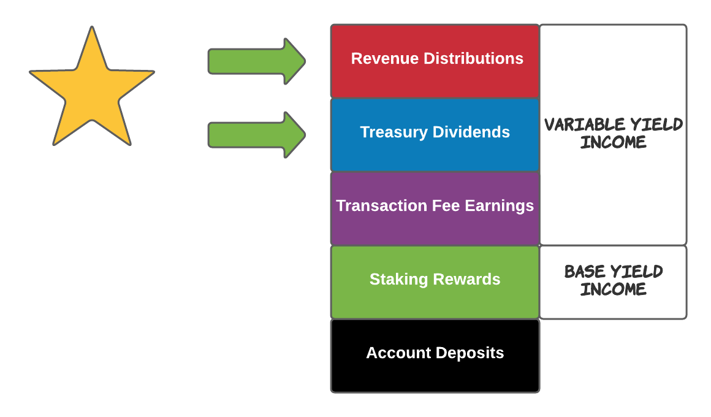
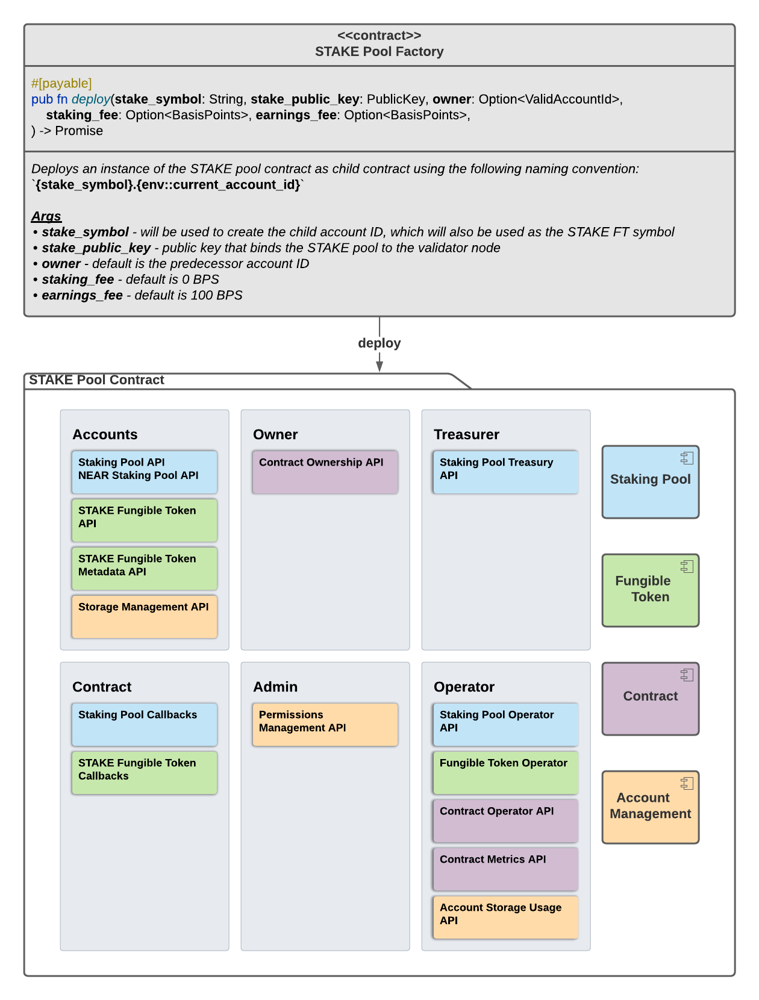
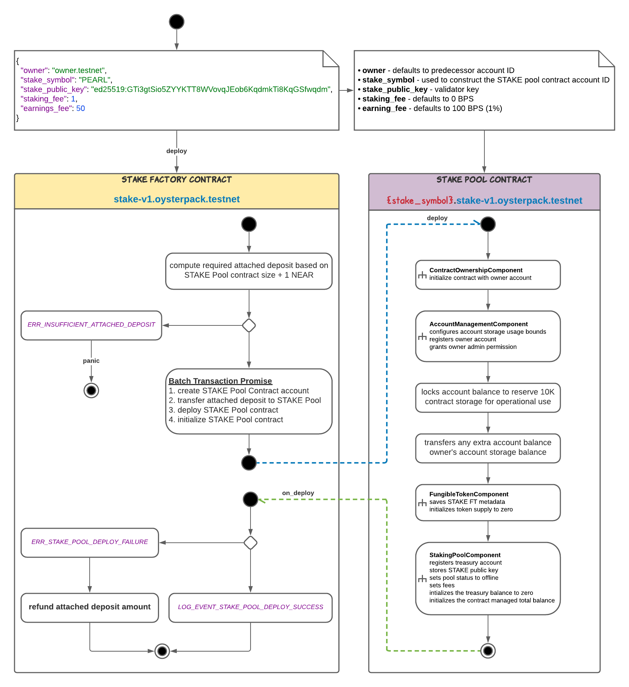
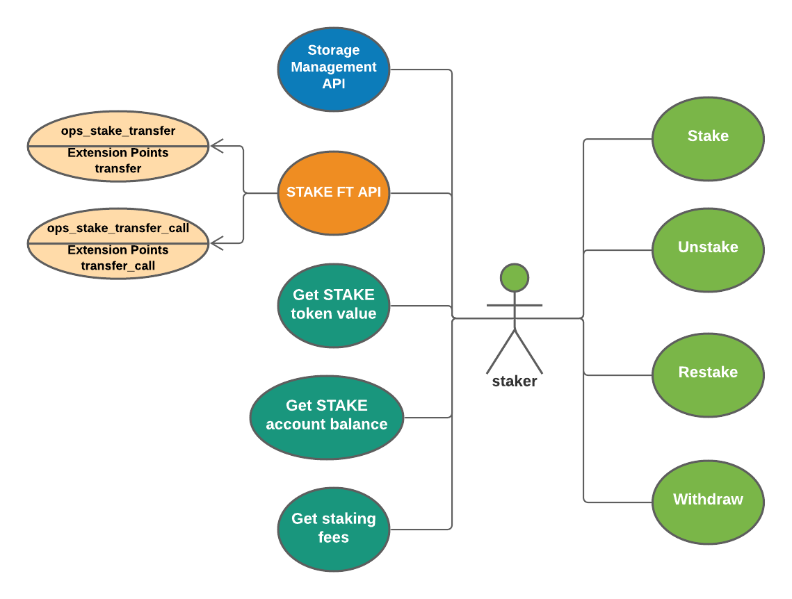

In my last tutorial, "It's Time to Put a STAKE in the Ground!"), I shared with you my STAKE vision. The time has arrived. Since then, I have been busy building the next generation staking pool contract as a gift for all in the NEAR community. The new OysterPack SMART STAKE Pool contract is ready for use on the NEAR testnet network. The project is fully open source and freely available on GitHub: [OysterPack SMART](https://github.com/oysterpack/oysterpack-smart). The new OysterPack SMART STAKE Pool contract also showcases the **OysterPack SMART NEAR Component Based Framework**. The agenda for this tutorial is:

1.  Show you the benefits that the OysterPack SMART STAKE pool provides
2.  Show you how to deploy and use the STAKE pool contract as a **Validator**
3.  Show you how to use the STAKE pool contract as a **Staker**

> "Stakers" are the delegators ... to me "Stakers" sounds better than "delegators"

# OysterPack SMART STAKE Benefits

Today there only lives a single staking pool contract in the NEAR wild. All validators on mainnet are using the [staking pool](https://github.com/near/core-contracts/tree/master/staking-pool) built by the NEAR core DEV team to bootstrap staking on NEAR's PoS blockchain. Staking on NEAR is permissionless, which enables staking to evolve. This illustrates the power and beauty of decentralization on the blockchain. There is nothing stopping any person with new ideas to build and create on the blockchain. The current staking pool on NEAR works, but there's always room for improvement - I call it the _"first generation"_ staking pool. Here's the list of improvements for the **"next generation"** **OysterPack SMART STAKE Pool** and how it compares to the first generation staking pool:

Locked staked NEAR is made mobile through **STAKE fungible tokens** provided by the STAKE pool

This enables staked NEAR value to be transferred while still being staked. This opens the door to many new DeFi use cases for staked NEAR.

# Staking Done Right - Maximizing Yield

The first generation staking pool will only stake deposited funds and restake earnings once every epoch. Earnings are composed of staking rewards plus any contract rewards earned from transaction gas fees. Because earnings are only restaked once per epoch, you lose some potential yield from less compounding. The compounding yield opportunity is lost for earnings outside staking rewards because the NEAR protocol only issues staking rewards once per epoch. Thus, today some yield is left on the table for contract earnings received from transaction gas fees, which impacts long term stakers the most because of less compounding. The next generation STAKE pool maximizes yield by checking for earnings in each pool transaction and restakes earnings as soon as they are received to maximize the power of the compounding yield effect.

# Unstaking Done Right

The following 2 improvements enable accounts to withdraw unstaked NEAR sooner:

1.  Unstaked NEAR is always available for withdrawal in **at most** 4 epochs per the NEAR protocol. Unstaked NEAR is locked for 4 epochs before it becomes available to be withdrawn, but is tracked per epoch. Thus, more funds can be unstaked without affecting funds that were unstaked in previous epochs. Compare this to the first generation staking pool, where each time you unstake, it resets the lockup period to 4 epochs for the total unstaked NEAR balance. For example, if 100 NEAR is unstaked in EPOCH 1 and 10 NEAR is unstaked in EPOCH 3. Then 100 NEAR is available for withdrawal in EPOCH 5 and 10 NEAR in EPOCH 7. In the first generation staking pool implementation, unstaking the 10 NEAR in EPOCH 3 would reset the lock period for the total unstaked, i.e., you would not be able to withdraw the 100 NEAR that was unstaked in EPOCH 1 until EPOCH 7. This issue has been resolved in the OysterPack SMART STAKE pool.
2.  Staking adds **liquidity** for withdrawing unstaked NEAR that is locked on a first come, first withdraw basis. For example, if you unstake 100 NEAR in EPOCH 1, normally you would not be able to withdraw the unstaked NEAR out of the pool until EPOCH 5. However, when other accounts stake while there are locked unstaked funds in the STAKE pool, then the new staked funds effectively add liquidity and unlock the unstaked funds. Think of it as the unstaked funds are being restaked. Thus, higher staking activity automatically provides more liquidity.

## Enhanced Financial Model

The goal is to provide more financial levers to validators in order to promote competition for staker business.

## More Flexible Fee Model

1.  **Earnings based fee** The staking pool owner takes a percentage of the STAKE pool earnings. This matches the current commercial fee model implemented by the first generation staking pool. This fee keeps the financial incentives and interests aligned with all stakers. Owner earnings are directly aligned with the STAKE pool earnings.
2.  **Staking fee** This fee type is not supported by the first generation staking pool. The staking fee is a percentage of the amount staked. OysterPack SMART STAKE pools provide more commercial levers and can be configured to use a combination of earnings based fees and staking fees. For example, validators may choose to charge only a staking fee and pass on all earnings to delegators.

## Enables External Revenue Sources for Boosting EPS

1.  **External revenue distributions** External sources of revenue can be deposited into the STAKE pool and distributed to all current stakers simply by staking the funds. This immediately distributes the revenue earnings via the STAKE token.
2.  **External revenue can be deposited into the treasury to distribute dividends** Dividends are distributed by the treasury by burning STAKE for earnings it receives. Thus, when STAKE is burned, the validator is effectively buying back shares funded by treasury earnings, which boosts the STAKE token value.

STAKE is modeled as a **dividend stock**. STAKE links the dividend yield directly to EPS (earnings per share or earnings per STAKE). When EPS increases, so does the dividend, and gets automatically paid out, which is governed by the contract (and not a board of directors). The STAKE pool contract enables validators to compete on EPS on more than just staking rewards provided by NEAR PoS.



# STAKE High Level Component Based Architecture



## STAKE Pool Factory Contract

The factory contract makes it easy for anyone to deploy a new instance of the STAKE pool contract. We'll see how to deploy new STAKE pool contracts using the NEAR CLI below.

It currently costs a little just under 6 NEAR to deploy the STAKE pool contract to pay for contract storage usage. Thus, if you attach 6 NEAR, then you should be safe. Any extra will be transferred over to the owner's account storage balance. If deployment fails for any reason, then the factory contract is designed to refund the attached deposit.

## STAKE Pool Contract

The STAKE Pool Contract is composed of 4 components, which are depicted on the right-hand side of the diagram. Each component provides multiple interfaces which are paired up in the diagram by the coloring scheme. The diagram also depicts the main actors and the key interfaces they depend on. In this tutorial, we will just be scratching the surface and focus on the core staking functionality to get started.

The STAKE pool contract is built using a component based architecture. If you happen to wander into the source code, you will probably notice that it follows a completely different design approach to build contracts on NEAR compared to what you are probably used to seeing.
There's nothing special besides applying software engineering best practices. A component based approach enables component reuse across contracts - and I have plans for building many.
My plan is to eventually publish them all to <https://crates.io> to make it easy for developers to use them. Until then, if you are interested in using them, you'll need to pull them in from the GitHub project.
I'll end the discussion on the benefits of a component based architecture here by putting it into context for web developers. If you prefer building web apps using React components, then you should also prefer building contracts using OysterPack SMART components for the same reasons.

You might also notice that I have built components that implement the NEAR standard APIs that I have covered in prior tutorials for account storage management and fungible tokens, but there's much more ...

# How to Get Started as a Validator

I will not be covering on how to setup and run your own validator node. If you are interested in running your own validator node, then I refer you to the NEAR [staking](https://docs.near.org/docs/validator/staking) docs.

# How to deploy the STAKE pool contract

> To earn NEAR rewards for exercising the NEAR CLI commands, you will need to submit the NEAR requests through [DataHub](https://datahub.figment.io/) using your DataHub access key. If you have earned NEAR on previous NEAR tutorials, then you should already be set. Otherwise, follow the instructions in the following link on [how to obtain your DataHub access key](https://learn.figment.io/network-documentation/near/tutorials/intro-pathway-write-and-deploy-your-first-near-smart-contract/1.-connecting-to-a-near-node-using-datahub#configure-environment). We will use the NEAR CLI to submit the transactions. Plugin your DataHub API Key and NEAR account at the top, and then you should be all set to go.

Below is a NEAR CLI example which deploys a new STAKE contract on testnet:

```text
DATAHUB_APIKEY=<DATAHUB_APIKEY>
NEAR_NODE_URL=https://near-testnet--rpc.datahub.figment.io/apikey/$DATAHUB_APIKEY

NEAR_ACCOUNT=<YOUR-NEAR-ACCOUNT.testnet>
NEAR_ENV=testnet
STAKE_FACTORY=dev-1619461926372-2886358
ACCOUNT_ID=oysterpack.testnet

STAKE_PUBLIC_KEY=ed25519:GTi3gtSio5ZYYKTT8WVovqJEob6KqdmkTi8KqGSfwqdm
STAKE_SYMBOL=PEARL3
STAKING_FEE=1
EARNINGS_FEE=50

near call $STAKE_FACTORY deploy --accountId $ACCOUNT_ID --amount 6 --gas 300000000000000 --node_url $NEAR_NODE_URL --args \
"{\"stake_symbol\":\"$STAKE_SYMBOL\",\"stake_public_key\":\"$STAKE_PUBLIC_KEY\",\"earnings_fee\":$EARNINGS_FEE,\"staking_fee\":$STAKING_FEE}"
```

If you successfully run the command, then the output will look like:

```text
Scheduling a call: dev-1619461926372-2886358.deploy({"stake_symbol":"PEARL3","stake_public_key":"ed25519:GTi3gtSio5ZYYKTT8WVovqJEob6KqdmkTi8KqGSfwqdm","earnings_fee":50,"staking_fee":1}) with attached 6 NEAR
Receipt: 8DxtrFzCzW6iz98NHwEFy7mB9W4qgT8PZUwkZL3zd5b9
        Log [dev-1619461926372-2886358]: [INFO] [DEPLOYMENT] ContractOwnershipComponent
        Log [dev-1619461926372-2886358]: [INFO] [ACCOUNT_STORAGE_CHANGED] StorageUsageChange(97)
        Log [dev-1619461926372-2886358]: [INFO] [ACCOUNT_STORAGE_CHANGED] StorageUsageChange(184)
        Log [dev-1619461926372-2886358]: [INFO] [ACCOUNT_STORAGE_CHANGED] StorageUsageChange(-97)
        Log [dev-1619461926372-2886358]: [INFO] [ACCOUNT_STORAGE_CHANGED] StorageUsageChange(-184)
        Log [dev-1619461926372-2886358]: [INFO] [ACCOUNT_STORAGE_CHANGED] StorageUsageChange(97)
        Log [dev-1619461926372-2886358]: [INFO] [ACCOUNT_STORAGE_CHANGED] StorageUsageChange(184)
        Log [dev-1619461926372-2886358]: [INFO] [ACCOUNT_STORAGE_CHANGED] StorageUsageChange(8)
        Log [dev-1619461926372-2886358]: [INFO] [ACCOUNT_STORAGE_CHANGED] StorageUsageChange(-105)
        Log [dev-1619461926372-2886358]: [INFO] [ACCOUNT_STORAGE_CHANGED] StorageUsageChange(-184)
        Log [dev-1619461926372-2886358]: [INFO] [ACCOUNT_STORAGE_CHANGED] StorageUsageChange(104)
        Log [dev-1619461926372-2886358]: [INFO] [ACCOUNT_STORAGE_CHANGED] StorageUsageChange(-104)
        Log [dev-1619461926372-2886358]: [INFO] [ACCOUNT_STORAGE_CHANGED] StorageUsageChange(97)
        Log [dev-1619461926372-2886358]: [INFO] [ACCOUNT_STORAGE_CHANGED] Registered(StorageBalance { total: YoctoNear(3930000000000000000000), available: YoctoNear(0) })
        Log [dev-1619461926372-2886358]: [INFO] [ACCOUNT_STORAGE_CHANGED] StorageUsageChange(8)
        Log [dev-1619461926372-2886358]: [INFO] [DEPLOYMENT] AccountManagementComponent
        Log [dev-1619461926372-2886358]: [INFO] [DEPLOYMENT] locked balance for 10K contract storage
        Log [dev-1619461926372-2886358]: [INFO] [ACCOUNT_STORAGE_CHANGED] Deposit(YoctoNear(1088320000000000000000000))
        Log [dev-1619461926372-2886358]: [INFO] [DEPLOYMENT] owner balance = 1088320000000000000000000
        Log [dev-1619461926372-2886358]: [INFO] [DEPLOYMENT] FungibleTokenComponent {
  "spec": "ft-1.0.0",
  "name": "STAKE",
  "symbol": "PEARL3",
  "decimals": 24,
  "icon": null,
  "reference": null,
  "reference_hash": null
}
        Log [dev-1619461926372-2886358]: [INFO] [ACCOUNT_STORAGE_CHANGED] StorageUsageChange(97)
        Log [dev-1619461926372-2886358]: [INFO] [ACCOUNT_STORAGE_CHANGED] Registered(StorageBalance { total: YoctoNear(3930000000000000000000), available: YoctoNear(0) })
        Log [dev-1619461926372-2886358]: [INFO] [DEPLOYMENT] StakingPoolComponent
Receipt: Fi9DoMaxtKfyWg4couRP8WCtytr48RCPGjLcjD28Z6P5
        Log [dev-1619461926372-2886358]: [INFO] [STAKE_POOL_DEPLOY_SUCCESS]
Transaction Id Yhrda9sutT4jhGMpwTuUZCZYm5vfH8RLCkvJzgnZj28
To see the transaction in the transaction explorer, please open this url in your browser
https://explorer.testnet.near.org/transactions/Yhrda9sutT4jhGMpwTuUZCZYm5vfH8RLCkvJzgnZj28
```

> Log records use the following standard format: `[LOG_LEVEL] [EVENT] msg`
>
> where LOG_LEVEL -> INFO | WARN | ERR

The logs tell the story about what's happening during the deployment, which is illustrated in the below diagram:



# Notes

- **AccountManagementComponent** is designed to track and log (**ACCOUNT_STORAGE_CHANGED**) all account storage changes
- The STAKE pool contract implements the NEAR standard [account storage management](https://nomicon.io/Standards/StorageManagement.html) interface. It measures dynamically how much account storage is required by the contract and configures the minimum storage usage bound accordingly.
- **AccountManagementComponent** is also designed to track all contract NEAR balances including account storage balances.
- The **ContractOperator** interface provides the ability to lock a portion of the contract account balance to ensure it cannot be transferred out. This feature is used to lock enough account balance to pay for 10K of contract storage that is reserved for the STAKE pool to be operational.
- The **STAKE Factory Contract** is designed to create and initialize the STAKE Pool contract using NEAR's batch transaction feature. This guarantees that either all actions in the batch transaction succeed or fail atomically. If the batch transaction fails for any reason, the factory contract is designed to refund the attached deposit.
- In the above NEAR CLI example, the owner account was specified implicitly using the predecessor account. However note that the factory deploy function supports an optional `owner` argument that can be used to specify the owner account explicitly.
- Fees are specified in basis points ([BPS](https://www.investopedia.com/terms/b/basispoint.asp)). An easy way to remember the unit conversion is 100 BPS = 1%. In the above example, the staking fee is 0.01%, and the earnings fee is 0.5%. At least one of the fees must be non-zero and the max fee is currently hard coded to be 1000 BPS (10%). Fees are configurable and can be changed after the STAKE pool is deployed by accounts that have the operator permission.
- The **STAKE Pool Contract** implements the NEAR standard [fungible token](https://nomicon.io/Standards/FungibleToken/README.html]%28https://nomicon.io/Standards/FungibleToken/README.html) interfaces for the provided STAKE token.

# How to operate the STAKE pool contract


The above diagram shows the role and responsibilities for the operator. In this tutorial, I will review the key APIs to be familiar with to get started. The rest is out of scope and will be covered in future tutorials and workshops.

# How to start and stop staking

When the STAKE pool contract is deployed, it's initial status is offline. You can check the pool status using the following NEAR CLI command:

```text
STAKE=pearl
near view  $STAKE.stake-v1.oysterpack.testnet ops_stake_status
```

The status results look like:

```text
{ Offline: 'Stopped' }

'Online'
```

If the pool is offline, then it also displays the offline reason. There are 2 reason why the pool would be offline:

- **Stopped** - means the pool was explicitly stopped an operator
- **StakeActionFailed** - means that a NEAR stake action failed, which will take the pool offline automatically

Staking can be started and stopped using the following NEAR CLI commands:

```text
near call  $STAKE.stake-v1.oysterpack.testnet ops_stake_operator_command --args '{"command":"StartStaking"}' --accountId $NEAR_ACCOUNT

near call  $STAKE.stake-v1.oysterpack.testnet ops_stake_operator_command --args '{"command":"StopStaking"}' --accountId $NEAR_ACCOUNT
```

## Query and update fees

Current fees can be queried via:

```text
near view  $STAKE.stake-v1.oysterpack.testnet ops_stake_fees
```

which will return output like:

```text
{ staking_fee: 80, earnings_fee: 0 }
```

Fees can be changed with the following NEAR CLI command:

```text
near call  $STAKE.stake-v1.oysterpack.testnet ops_stake_operator_command --args '{"command":{"UpdateFees":{"staking_fee":1,"earnings_fee":50}}}' --accountId $NEAR_ACCOUNT
```

- both fees must be specified and at least 1 must be non-zero

## Query and update the staking public key

The staking public key, i.e., the validator key, can be viewed and changed using the following NEAR CLI commands:

```text
near view  $STAKE.stake-v1.oysterpack.testnet ops_stake_public_key

near call  $STAKE.stake-v1.oysterpack.testnet ops_stake_operator_command --args '{"command":{"UpdatePublicKey":"ed25519:GTi3gtSio5ZYYKTT8WVovqJEob6KqdmkTi8KqGSfwqdm"}}' --accountId $NEAR_ACCOUNT
```

# How to Get Started as a Staker



The STAKE Pool contract implements the NEAR standard [storage management](https://nomicon.io/Standards/StorageManagement.html) specification. This means that accounts must first register with the contract and deposit funds to pay for account storage before being able to use the contract. I defer to the [storage management](https://nomicon.io/Standards/StorageManagement.html) documentation for details.

> account registration currently costs 0.000393 NEAR

## How to stake

When an account stakes any account storage available balance will be staked in addition to any attached deposit. The account storage management interface is leveraged to enable accounts to collect deposits to stake at a later time.

```text
# stakes only the account's storage available balance
near call  $STAKE.stake-v1.oysterpack.testnet ops_stake --accountId $NEAR_ACCOUNT

# stakes the account's storage available balance + 1 NEAR attached deposit
near call  $STAKE.stake-v1.oysterpack.testnet ops_stake --accountId $NEAR_ACCOUNT --amount 1
```

The logs tell the story:

```text
Log [dev-1618770943926-8326158]: [INFO] [EARNINGS] 4101039949423780538046344837
Log [dev-1618770943926-8326158]: [INFO] [FT_BURN] account: dev-1618770943926-8326158, amount: 21956195625979298913189923
Log [dev-1618770943926-8326158]: [INFO] [TREASURY_DIVIDEND] 22859532518386059780519144 yoctoNEAR / 21956195625979298913189923 yoctoSTAKE
Log [dev-1618770943926-8326158]: [INFO] [ACCOUNT_STORAGE_CHANGED] Withdrawal(YoctoNear(1))
Log [dev-1618770943926-8326158]: [INFO] [ACCOUNT_STORAGE_CHANGED] Deposit(YoctoNear(1))
Log [dev-1618770943926-8326158]: [INFO] [STAKE] near_amount=100000000000000000000000, stake_token_amount=96042291735938018665641
Log [dev-1618770943926-8326158]: [INFO] [FT_MINT] account: alfio-zappala-oysterpack.testnet, amount: 96042291735938018665641
Log [dev-1618770943926-8326158]: [INFO] [FT_BURN] account: alfio-zappala-oysterpack.testnet, amount: 768338333887504149325
Log [dev-1618770943926-8326158]: [INFO] [FT_MINT] account: oysterpack.testnet, amount: 768338333887504149325
```

- earnings were collected and distributed
- the treasury paid a dividend from its earnings
- because of rounding, 1 yoctoNEAR could not be staked and was deposited into the account's storage balance
- the STAKE token value for the staked amount is computed
- STAKE tokens were minted for the account
- fees were transferred from the account to the owner by burning the fees from the account and minting them on the owner account

The account's updated stake balance is returned and looks like:

```javascript
{
  "storage_balance": {
    "total": "3930000000000000000001",
    "available": "1"
  },
  "staked": {
    "stake": "10888070762166201553542838",
    "near_value": "11336746129103451686781599"
  },
  "unstaked": {
    "total": "1",
    "available": "1",
    "locked": null
  }
}
```

- all account balances are returned, i.e., storage balance, staked, and unstaked balances
- the current NEAR value for the account's STAKE token balance is returned
- unstaked balance shows how much is available for withdrawal and locked - in the above example there is currently zero locked unstaked

## How to unstake

```text
# unstakes all
near call  $STAKE.stake-v1.oysterpack.testnet ops_unstake --accountId $NEAR_ACCOUNT

# unstakes specified amount
near call  $STAKE.stake-v1.oysterpack.testnet ops_unstake --accountId $NEAR_ACCOUNT  --args '{"amount":"1000000000000000000000000"}'
```

```text
Log [dev-1618770943926-8326158]: [INFO] [EARNINGS] 1155935938423300000000
Log [dev-1618770943926-8326158]: [INFO] [FT_BURN] account: dev-1618770943926-8326158, amount: 6119045408724236555
Log [dev-1618770943926-8326158]: [INFO] [TREASURY_DIVIDEND] 6371198893243536821 yoctoNEAR / 6119045408724236555 yoctoSTAKE
Log [dev-1618770943926-8326158]: [INFO] [UNSTAKE] near_amount=1000000000000000000000000, stake_token_amount=960422914297395816680428
Log [dev-1618770943926-8326158]: [INFO] [FT_BURN] account: alfio-zappala-oysterpack.testnet, amount: 960422914297395816680428
```

- earnings were collected again - **NOTE**: every contract transaction generates earnings
- treasury pays a dividend from its earnings
- the STAKE token value for the amount unstaked is computed and burned on the account

the account balances now look like:

```json
{
  "storage_balance": {
    "total": "3930000000000000000001",
    "available": "1"
  },
  "staked": {
    "stake": "9927647847868805736862410",
    "near_value": "10336746160201213136176928"
  },
  "unstaked": {
    "total": "1000000000000000000000001",
    "available": "1",
    "locked": {
      "80": "1000000000000000000000000"
    }
  }
}
```

- the unstaked balance now shows that there is 1 NEAR locked and will become available for withdrawal in epoch 80
- **NOTE**: if there is liquidity, then the account will be able to withdraw sooner

## How to restake unstaked funds

In order to restake funds using the first generation staking pool, the account would first need to withdraw the funds out of the pool and then stake them again. The OysterPack SMART STAKE pool simplifies the restake process by enabling the staker to restake unstaked funds.

```text
# restakes all unstaked funds
near call  $STAKE.stake-v1.oysterpack.testnet  ops_restake --accountId $NEAR_ACCOUNT

# restakes the specified amount from the account's unstaked balance
near call  $STAKE.stake-v1.oysterpack.testnet  ops_restake --accountId $NEAR_ACCOUNT  -args '{"amount":"100000000000000000000000"}'
```

## How to withdraw unstaked funds

```text
# withdraws all available unstaked NEAR
near call  $STAKE.stake-v1.oysterpack.testnet  ops_stake_withdraw --accountId $NEAR_ACCOUNT

# withdraws the specified amount from the unstaked available balance and against liquidity
near call  $STAKE.stake-v1.oysterpack.testnet  ops_stake_withdraw --accountId $NEAR_ACCOUNT -args '{"amount":"100000000000000000000000"}'
```

## How to check STAKE pool balances

```text
near view  $STAKE.stake-v1.oysterpack.testnet ops_stake_pool_balances
```

```text
{
  total_staked: '364568699342368667595072121779',
  total_stake_supply: '350140131647969807579006618378',
  total_unstaked: '900000000000000000000000',
  unstaked_liquidity: '100000000000000000000001',
  treasury_balance: '2009406695051801299154334155',
  current_contract_managed_total_balance: '364576420617778762607772121782',
  last_contract_managed_total_balance: '364576419433154155124172121782',
  earnings: '1184624607483600000000'
}
```

- **total_staked** - total NEAR that has been staked
- **total_stake_supply** - total STAKE FT supply
- **total_unstaked** - total NEAR that has been unstaked and sitting in unstaked balances
- **unstaked_liquidity** - how much liquidity is currently available for withdrawing unstaked funds that are locked
- **treasury_balance** - treasury balance that is used to generate dividend payouts
- **current_contract_managed_total_balance** and **last_contract_managed_total_balance** - used to track changes in balances to collect earnings
- **earnings** - amount of earnings that are waiting to be collected on the next staking action

## How to query staker account balances

```text
near view  $STAKE.stake-v1.oysterpack.testnet ops_stake_balance --args '{"account_id":"oysterpack.testnet"}'
```

## How to transfer STAKE tokens

The STAKE pool contract implements the NEAR standard \[fungible token]\[9] interface, and I defer to the NEAR docs for details. However, the STAKE Pool API offers 2 convenience transfer methods that enable stakers to transfer STAKE by specifying a NEAR amount. The amount of STAKE tokens transferred will be based on the current STAKE token value. The API's mirror NEAR standard `ft_transfer` and `ft_transfer_call` methods:

```text
near call  $STAKE.stake-v1.oysterpack.testnet ops_stake_transfer --accountId $NEAR_ACCOUNT --args '{"receiver_id":"xxx.testnet","amount":"1000000000000000000000000"}' --amount 0.000000000000000000000001

near call  $STAKE.stake-v1.oysterpack.testnet ops_stake_transfer_call --accountId $NEAR_ACCOUNT --args '{"receiver_id":"xxx.testnet","amount":"1000000000000000000000000","msg":""}' --amount 0.000000000000000000000001
```

## How to query the current STAKE token value

```text
# returns the NEAR value for 1 STAKE token
near view  $STAKE.stake-v1.oysterpack.testnet ops_stake_token_value

# returns the NEAR value for the specified STAKE token amount
near view  $STAKE.stake-v1.oysterpack.testnet ops_stake_token_value --args '{"amount":"5000000000000000000000000"}'
```

```text
'1041207985614422459014157'
```

- the latest earnings are included in the computation minus treasury dividends
- if you need the most accurate STAKE token value, then use the following NEAR CLI command

```text
# returns the NEAR value for 1 STAKE token
near call  $STAKE.stake-v1.oysterpack.testnet ops_stake_token_value_with_earnings

# returns the NEAR value for the specified STAKE token amount
near call  $STAKE.stake-v1.oysterpack.testnet  ops_stake_token_value_with_earnings --account_id $NEAR_ACCOUNT --args '{"amount":"5000000000000000000000000"}'
```

- these are call methods and will require gas
- earnings are collected and treasury dividend is paid before computing the STAKE token NEAR value - sample CLI command output looks like:

```text
Receipt: FLBamjxsgq9brEjoHMVTHXyXdiiHbe57wuaH9hs7SzCL
        Log [dev-1618770943926-8326158]: [INFO] [EARNINGS] 1184624607483600000000
        Log [dev-1618770943926-8326158]: [INFO] [FT_BURN] account: dev-1618770943926-8326158, amount: 6270926727134172193
        Log [dev-1618770943926-8326158]: [INFO] [TREASURY_DIVIDEND] 6529338974230524798 yoctoNEAR / 6270926727134172193 yoctoSTAKE
Transaction Id FoQJ7kmNnjR6g8ew35sZq8snCMBHDQQGpdYPRfAhYr2e
To see the transaction in the transaction explorer, please open this url in your browser
https://explorer.testnet.near.org/transactions/FoQJ7kmNnjR6g8ew35sZq8snCMBHDQQGpdYPRfAhYr2e
'1041207983836766420575151'
```

# Conclusion

The next generation STAKE Pool contract is ready and waiting for validators and stakers to use it. It's my gift to the NEAR community, and I hope you enjoy it. Staking is the bread and butter of any PoS blockchain like NEAR. OysterPack SMART mission is to build and provide the best staking solutions, products, and services to deliver the best and most profitable staking experience. The building never stops, and there's much more in the works ... so stay tuned folks.

I invite you to join the Figment and NEAR communities and embark on our common mission to defend and take back the Internet together.

# Next Steps

The focus will be providing the validators with more in-depth tutorials and workshops to help them get onboard.


