In my last tutorial I introduced you to the **next generation** OysterPack SMART STAKE Pool contract as a getting started guide. In this tutorial, we'll be covering the rest of the contract APIs to help validators manage and operate the STAKE Pool contract. As a validator, it is fundamental to know your staking pool contract in depth because it is core to your validator business, and it impacts your bottom line.

> Even though the main target audience are validators, contract developers will also benefit.
> You will learn about OysterPack SMART components and interfaces that you may leverage for your next contract to help you build smarter, faster, and better on the NEAR platform.
> You will also benefit from my experience and gain insight into my thought process for contract design.

## The Big Picture


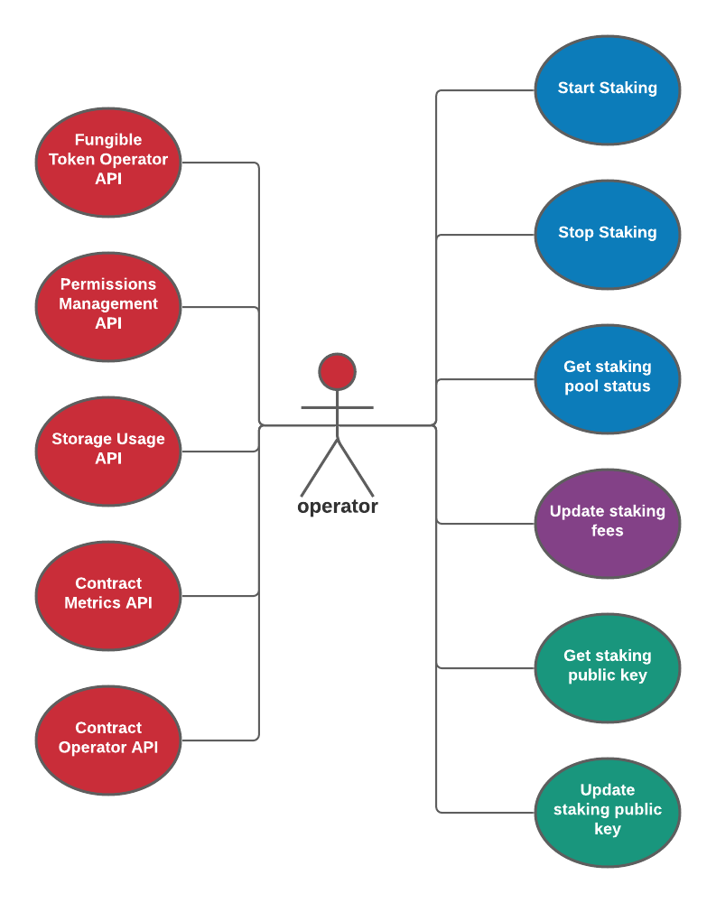

Below is the list of components used by the contract along with brief descriptions for each of the APIs they provide:

1.  **Account Management Component**
    - [Storage Management API](https://nomicon.io/Standards/StorageManagement.html) - used by stakers to register with the contract and manage account storage balances
    - **Permissions Management API** - used by validators to manage account permissions for securing API access
    - **Account Storage Usage API** - used to monitor account storage usage
2.  **Contract Component**
    - **Contract Ownership API** - used by the contact owner, i.e., validators, to transfer contract ownership
    - **Contract Operator API** - used by validators to manage core contract functions
    - **Contract Metrics API** - used to monitor key contract metrics
3.  **Fungible Token Component**
    - [Fungible Token Core API](https://nomicon.io/Standards/FungibleToken/Core.html) - used by stakers to manage their STAKE fungible token balances
    - [Fungible Token Metadata API](https://nomicon.io/Standards/FungibleToken/Metadata.html) - used by tools and apps to retrieve STAKE token metadata
    - **Fungible Token Operator** - used by validators to manage the metadata
    - **STAKE Fungible Token Callbacks** - private API callbacks used to collect and deposit funds into the treasury
4.  **Staking Pool Component**
    - **Staking Pool API** - used by stakers to stake and manage their staked funds
    - **NEAR Staking Pool API** - adapts the **Staking Pool API** to match the first generation NEAR staking pool APIs used by stakers
    - **Staking Pool Treasury API** - used by validators to manage treasury funds
    - **Staking Pool Operator API** - used by validators to manage the staking pool
    - **Staking Pool Callbacks** - private API callbacks used to handle NEAR stake actions

As you can see, there is much to cover. Here's the approach we will take. For each of the contract API interfaces, we'll review the Rust contract API and how to invoke the API via the [NEAR CLI](https://docs.near.org/docs/tools/near-cli). If you are interested in seeing how the APIs are implemented, then all the contract [source code](https://github.com/oysterpack/oysterpack-smart) is available on GitHub to study and explore.

### Account Management Component

#### Storage Management API

The storage management API implements the NEAR standard NEP-145, which I have covered in depth my prior [Account Storage Standard](https://learn.figment.io/tutorials/5-account-storage) tutorial. Proper storage management is crucial to safeguard any multi-user contract from what I call a "Denial of Storage" attack. Storage management closes a big security vulnerability in the first generation staking pool contracts that are currently in use. The attack is very simple based on the facts:

1.  Storage is orders of magnitude more expensive than transaction gas cost
2.  The contract is ultimately responsible for paying for storage usage on the blockchain.
3.  Contract transactions will fail if there is not enough account NEAR balance to pay for new storage allocation.

Thus, in order to prevent malicious behavior, contracts should be designed to pass along the storage costs to the accounts. Otherwise, malicious actors can easily attack a contract by allocating expensive account storage on the contract using cheap transaction gas cost. This reason should motivate current validators to migrate off the current first generation staking pool as soon as possible because it is not a question of will it happen, it's only a question of when. History has taught us that vulnerabilities will always eventually be attacked and exploited because the reality is we live in a "dog eat dog" world.

**Key Points**

1.  Accounts must register with the contract before they can stake using the contract.

2.  The account storage balance can be used to collect deposits and stake them as a batch later on. When an account stakes,

    any account storage available balance will be staked.

3.  When accounts unregister from the STAKE pool contract, unregistration will fail if the account has STAKE tokens.

    The account must first unstake and withdraw the unstaked funds, before they are allowed to unregister. That being said,

    if an account chooses, they can force unregistration, and any STAKE tokens will get burned, which effectively distributes

    the staked NEAR to current STAKERS.

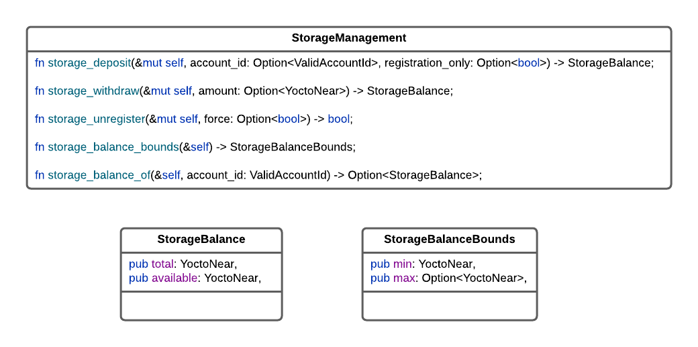

````text
export DATAHUB_APIKEY=<DATAHUB_APIKEY>
export NEAR_NODE_URL=https://near-testnet--rpc.datahub.figment.io/apikey/$DATAHUB_APIKEY

alias near-figment='near --nodeUrl $NEAR_NODE_URL --networkId testnet'

NEAR_ACCOUNT=<YOUR-NEAR-ACCOUNT.testnet>
NEAR_ENV=testnet
STAKE_FACTORY=<STAKE-FACTORY-ACCOUNT.testnet>
STAKE=<STAKE-FT-SYMBOL>
CONTRACT=$STAKE.$STAKE_FACTORY

## View methods

```text
near-figment view $CONTRACT storage_balance_bounds
near-figment view $CONTRACT storage_balance_of --args '{"account_id":"oysterpack.testnet"}'
````

Deposits NEAR for predecessor account

```text
near-figment call $CONTRACT storage_deposit --accountId $NEAR_ACCOUNT --amount 1
```

Deposits funds into specified "account_id" for account registration purposes only

```text
near-figment call $CONTRACT storage_deposit --accountId $NEAR_ACCOUNT --amount 0.00393 --args '{"account_id":"oysterpack.testnet", "registration_only":true}'
```

Deposits funds for account self registration, i.e, for the predecessor account

```text
near-figment call $CONTRACT storage_deposit --accountId $NEAR_ACCOUNT --amount 1 --args '{"registration_only":true}'
```

Withdraw total account storage available balance

```text
near-figment call $CONTRACT storage_withdraw --accountId $NEAR_ACCOUNT --amount 0.000000000000000000000001
```

Withdraw the specified amount from the account storage available balance

```text
near-figment call $CONTRACT storage_withdraw --accountId $NEAR_ACCOUNT --amount 0.000000000000000000000001 -args '{"amount":"1000000"}'
near-figment call $CONTRACT storage_unregister --accountId oysterpack-2.testnet --amount 0.000000000000000000000001
near-figment call $CONTRACT storage_unregister --args '{"force":true}' --accountId oysterpack-2.testnet --amount 0.000000000000000000000001
```

### Account Storage Usage API

As stated above, managing account storage usage properly is crucial. The storage management NEP-145 standard looks at it from the perspective of cost, i.e., storage balance. However, storage costs change overtime. Storage usage should be managed as storage usage - not storage balance. The storage management API provides a storage balance bounds, i.e., which is used by accounts to lookup how much it costs to register with the contract. The account management component is designed to dynamically compute account storage usage bounds when the contract is deployed. Then, storage balance bounds are derived from the storage usage bounds.


```text
near-figment view $CONTRACT ops_storage_usage_bounds
near-figment view $CONTRACT ops_storage_usage --args '{"account_id":"oysterpack.testnet"}'
```

> If you are wondering what the "ops\_" prefix stands for, it stands for "OysterPack SMART". All contract APIs are hoisted to a global namespace. Thus, to avoid naming collisions, it's a best practice to namespace your contract API functions.

### Permissions Management API

The permissions management API provides access control for permissioned contract APIs. For example, operator functions on the STAKE pool contract must be guarded to protect from allowing anyone to take the STAKE pool offline. The permission management implementation supports a basic permissioning scheme using permission 64 bit masks. This means, contracts support a maximum of 64 permissions (0-63) are supported, which should be sufficient to cover the majority of use cases. Two special permissions are pre-defined and reserved for the admin and operator. Permission bit 63 is reserved for the admin and permission bit 62 is reserved for the operator. Thus, the first 62 permission bits (0-61) can be used by contracts to define custom permissions.

By default, the contract owner is automatically assigned the admin permission when the contract is deployed. Only accounts with the admin permission are permitted to manage permissions on other accounts.

The STAKE Pool contract defines one additional custom contract permission: **treasurer**. Thus, the STAKE pool contract supports 3 permissions or roles:

1.  Admin
2.  Operator
3.  Treasurer

Any other permission bits granted to an account will be ignored. The **treasurer** permission is required to access the **Staking Pool Treasury API**.

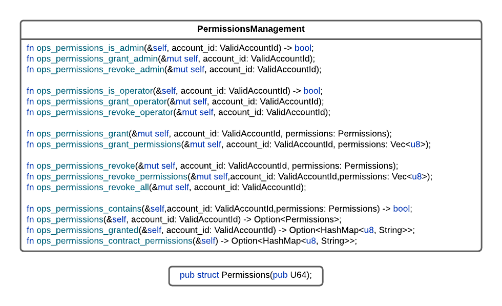

Used to check permissions

```text
near-figment view $CONTRACT ops_permissions_is_admin --args '{"account_id":"oysterpack.testnet"}'
near-figment view $CONTRACT ops_permissions_is_operator --args '{"account_id":"oysterpack.testnet"}'
near-figment view $CONTRACT ops_permissions --args '{"account_id":"oysterpack.testnet"}'
near-figment view $CONTRACT ops_permissions_granted --args '{"account_id":"oysterpack.testnet"}'
```

Used to grant permissions

```text
near-figment call $CONTRACT ops_permissions_grant_admin --args '{"account_id":"oysterpack-2.testnet"}' --accountId $NEAR_ACCOUNT
near-figment call $CONTRACT ops_permissions_grant_operator --args '{"account_id":"oysterpack-2.testnet"}' --accountId $NEAR_ACCOUNT
```

Used to grant permissions using a bitmask, e.g, 9 sets permission bits #0 and #4: i.e. 00000000 00000000 00000000 00000000 00000000 00000000 00000000 00001001

```text
near-figment call $CONTRACT ops_permissions_grant --args '{"account_id":"oysterpack-2.testnet", "permissions": 9}' --accountId $NEAR_ACCOUNT
```

Used to specify permission bits separately as an array, e.g., [0,4] does the same as above, but may be easier to use when the API is invoked manually

```text
near-figment call $CONTRACT ops_permissions_grant_permissions --args '{"account_id":"oysterpack-2.testnet", "permissions": [0,4]}' --accountId $NEAR_ACCOUNT
```

Used to revoke permissions

```text
near-figment call $CONTRACT ops_permissions_revoke_admin --args '{"account_id":"oysterpack-2.testnet"}' --accountId $NEAR_ACCOUNT
near-figment call $CONTRACT ops_permissions_revoke_operator --args '{"account_id":"oysterpack-2.testnet"}' --accountId $NEAR_ACCOUNT
near-figment call $CONTRACT ops_permissions_revoke_all --args '{"account_id":"oysterpack-2.testnet"}' --accountId $NEAR_ACCOUNT
near-figment call $CONTRACT ops_permissions_revoke --args '{"account_id":"oysterpack-2.testnet", "permissions": 9}' --accountId $NEAR_ACCOUNT
near-figment call $CONTRACT ops_permissions_revoke_permissions --args '{"account_id":"oysterpack-2.testnet", "permissions": [0]}' --accountId $NEAR_ACCOUNT
```

Returns the custom permissions outside of admin and operator that the contract supports for the STAKE pool contract, the only special permission is treasurer

```text
near-figment view $CONTRACT ops_permissions_contract_permissions
```

To make it easier to manage **treasurer** permissions, the STAKE pool contract provides the following functions for convenience:

```text
near-figment call $CONTRACT ops_stake_grant_treasurer --args '{"account_id":"oysterpack-2.testnet"}' --accountId $NEAR_ACCOUNT
near-figment call $CONTRACT ops_stake_revoke_treasurer --args '{"account_id":"oysterpack-2.testnet"}' --accountId $NEAR_ACCOUNT
near-figment view $CONTRACT ops_stake_is_treasurer --args '{"account_id":"oysterpack-2.testnet"}'
```

If the admin permission is revoked from the contract owner, then the contract owner has the ability to grant himself admin permission through the **Contract Operator** API interface using the following method which can only be invoked by the contract owner:

```text
near-figment call $CONTRACT ops_owner_grant_admin --accountId $NEAR_ACCOUNT
```

## Contract Component

**Contract Ownership API**

The API supports the following use cases:

1.  Contract ownership can be transferred to another prospective account using the following workflow:

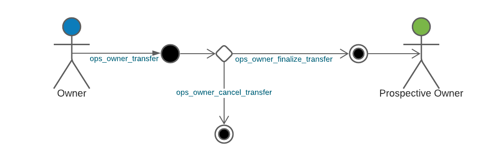

1.  The contract owner can withdraw funds that the contract owner is entitled too.

The contract owner available balance will always be zero for the STAKE pool contract because all contract transaction earnings go towards STAKE earnings. However, the STAKE Pool contract does contain a treasury account which is effectively owned by the contract owner.

**Notes**

- When the transfer is finalized, any owner balance is transferred to the new owner.
- The owner can withdraw from its available balance before the transfer is finalized.

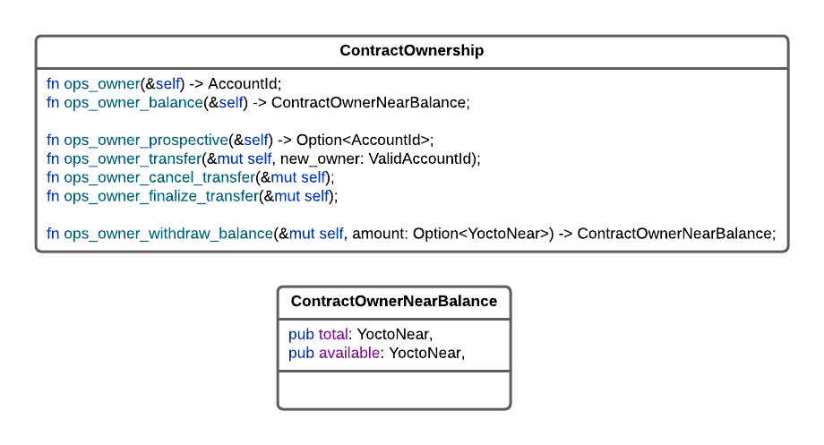

Returns the contract owner account ID

```text
near-figment view $CONTRACT ops_owner
```

For the STAKE Pool contract, the owner available balance should always be 0

```text
near-figment view $CONTRACT ops_owner_balance
```

Returns the prospective owner that the transfer is waiting on for finalization.

```text
near-figment view $CONTRACT  ops_owner_prospective
```

Used to transfer ownership. 1 yoctoNEAR deposit is required for transfer calls to force the owner to verify and confirm the transactions via the NEAR wallet

```text
near -node_url $NEAR_NODE_URL call $CONTRACT ops_owner_transfer --args '{"new_owner":"oysterpack-2.testnet"}' --accountId $NEAR_ACCOUNT --amount 0.000000000000000000000001
near -node_url $NEAR_NODE_URL call $CONTRACT ops_owner_cancel_transfer --accountId $NEAR_ACCOUNT --amount 0.000000000000000000000001
near -node_url $NEAR_NODE_URL call $CONTRACT ops_owner_finalize_transfer --accountId $NEAR_ACCOUNT  --amount 0.000000000000000000000001
```

1 yoctoNEAR deposit is required to force the owner to verify and confirm the transaction via the NEAR wallet

```text
near -node_url $NEAR_NODE_URL call $CONTRACT ops_owner_withdraw_balance --accountId $NEAR_ACCOUNT --amount 0.000000000000000000000001
```

### Contract Operator API

The operator API enables storage balance to be locked based on expected contract storage usage. When the STAKE pool contract is deployed, it will automatically lock funds to reserve 10 KB of contract storage, which is a conservative amount. The STAKE pool contract should not require more than 10 KB storage. Locking the funds ensures that there is always enough balance available on the contract to pay for storage for the contract to be operational.

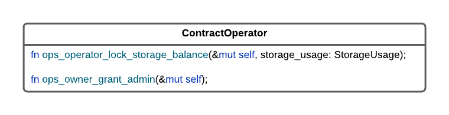

Storage usage is specified in bytes. This should never need to be invoked on the STAKE pool contract, but is exposed just in case

```text
near -node_url $NEAR_NODE_URL call $CONTRACT ops_operator_lock_storage_balance --args '{"storage_usage":10000}' --accountId $NEAR_ACCOUNT
```

Can only be invoked by the contract owner to grant himself admin permission. NOTE: The owner is automatically granted admin when the contract is deployed

```text
near-figment call $CONTRACT ops_owner_grant_admin --accountId $NEAR_ACCOUNT
```

### Contract Metrics API

The following metrics are tracked:

1.  Total registered accounts
2.  Account storage usage
3.  Account NEAR balances - from account storage balances
4.  Contract NEAR balances - these are funds managed at the contract level (see below)

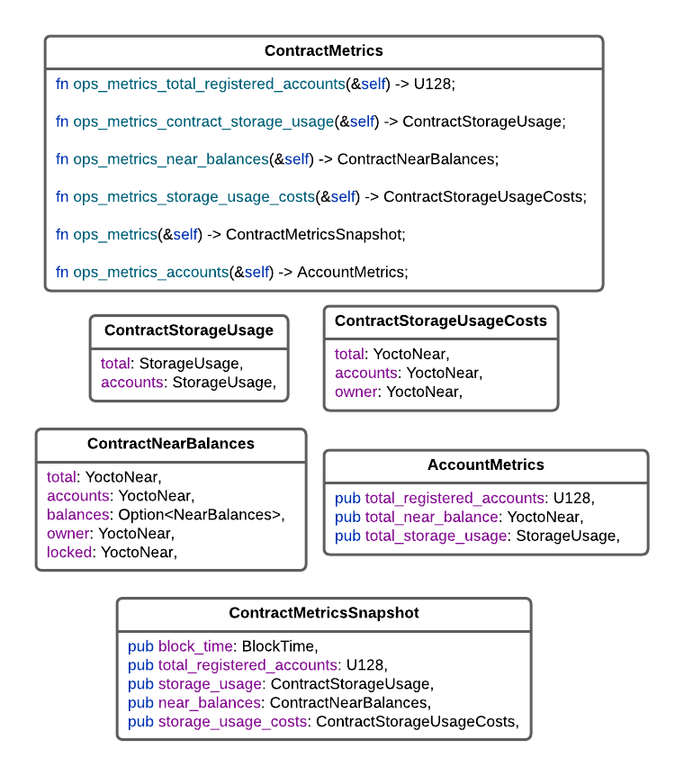

Returns the total number of registered accounts

```text
near-figment view $CONTRACT ops_metrics_total_registered_accounts
```

Returns total contract storage usage and total storage usage across all accounts

```text
near-figment view $CONTRACT ops_metrics_contract_storage_usage
```

Returns storage usage costs based on current storage byte cost and breaks down who is paying the storage bill

```text
near-figment view $CONTRACT ops_metrics_storage_usage_costs
```

Returns a breakdown of all NEAR balances

```text
near-figment view $CONTRACT ops_metrics_near_balances
```

Returns metrics for account storage and NEAR balances

```text
near-figment view $CONTRACT ops_metrics_accounts
```

Returns an aggregate metric view for all of the above metrics

```text
near-figment view $CONTRACT ops_metrics
```

## STAKE Pool Contract Balances

This is fundamental to understand because it's how all the "money" is managed. The diagram below shows all the contract managed balances, how the balances are connected, and how the money flows.

PAY ATTENTION HERE - This is the most critical diagram to understand how money is flowing within the contract.

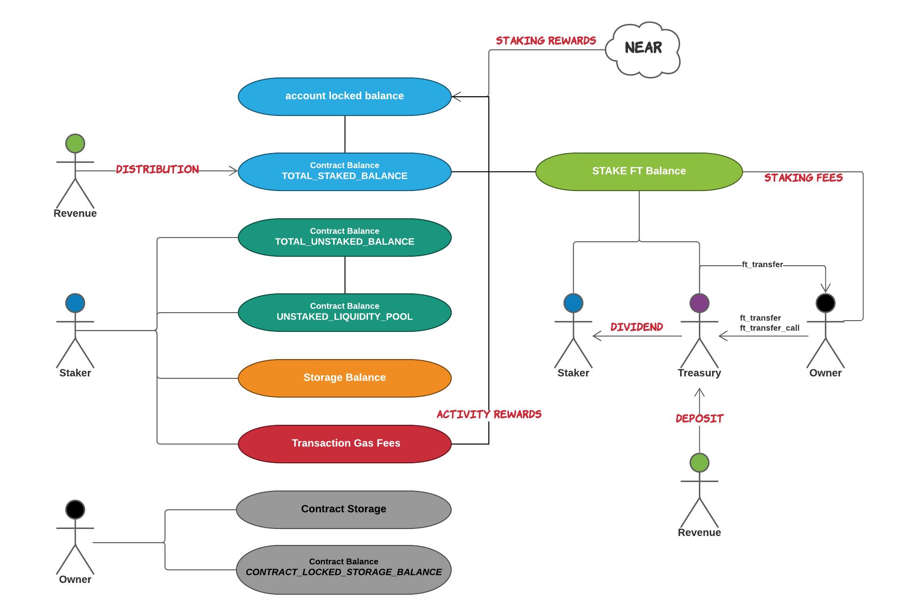

1.  **Account Locked Balance**
    - is the portion of the total contract account balance that is currently locked by the NEAR protocol
    - this will correspond to the total staked balance and unstaked balance that is locked
2.  **TOTAL_STAKED_BALANCE**

    - is used by the contract to track the total amount of NEAR that has been staked
    - **NOTE:** this balance is related to the account locked balance. When the pool is online the account locked balance should

      always be greater than or equal to the total staked balance.

3.  **TOTAL_UNSTAKED_BALANCE** and **UNSTAKED_LIQUIDITY_POOL**

    - together are used by the contract to track the total amount of NEAR that has been unstaked.

    - the sum of the two balances is equal to the total unstaked balance

    - liquidity is automatically added when stakers stake new funds while **TOTAL_UNSTAKED_BALANCE** > 0. When liquidity is added,

      the funds are moved from the **TOTAL_UNSTAKED_BALANCE** into **UNSTAKED_LIQUIDITY_POOL**

    - funds from the **UNSTAKED_LIQUIDITY_POOL** are available for withdrawal on a first come, first served basis

4.  **Storage Balance** - this refers to the account storage balance
5.  **Transaction Gas Fees** and **Staking Rewards** flow into the contract's total staked balance, which links to the account locked balance
6.  **Contract Storage** and **CONTRACT_LOCKED_STORAGE_BALANCE**
    - are balances that the contract owner is responsible for to pay for contract operational storage
7.  **Treasury**

    - is the STAKE account balance owned by the STAKE contract itself, which is effectively owner by the contract owner, i.e., the validator
    - the treasury is used to pay out dividends by burning STAKE for treasury earnings
    - the treasury balance correlates to the dividend payout - the more funds that the contract owner moves into the treasury,

      the higher the dividend

Internally contract balances are stored using a numeric ID, which are listed in the `balances` section:

```text
near-figment view $CONTRACT ops_metrics_near_balances

{
  total: '74007102668152498690300000000',
  accounts: '7860000000000000000001',
  balances: {
    '1955299460766524333040021403508226880': '100000000000000000000000',        // CONTRACT_LOCKED_STORAGE_BALANCE
    '1955705469859818043123742456310621056': '74002187045471879361699999999'    // TOTAL_UNSTAKED_BALANCE
  },
  owner: '4807762680619328600000000',
  locked: '0'
}
```

In the above sample output, we can see that all funds have been unstaked in the pool.

The corresponding contract balance IDs are defined as:

```rust
pub const CONTRACT_LOCKED_STORAGE_BALANCE: BalanceId = BalanceId(1955299460766524333040021403508226880);
pub const TOTAL_STAKED_BALANCE: BalanceId = BalanceId(1956973021105502521442959170292258855);
pub const TOTAL_UNSTAKED_BALANCE: BalanceId = BalanceId(1955705469859818043123742456310621056);
pub const UNSTAKED_LIQUIDITY_POOL: BalanceId = BalanceId(1955784487678443851622222785149485288);
```

## Fungible Token Component

Provides the API's that provide the STAKE token. These APIs are well documented, and I will defer the details to:

- [The New and Improved Fungible Token Standard (NEP-141) Has Arrived](https://learn.figment.io/tutorials/2-fungible-token)
- [NEAR Fungible Token Standard](https://nomicon.io/Standards/FungibleToken/README.html)

In addition to the standard Fungible Token API interfaces, the contract also provides a Fungible Token Operator API interface, which is used to manage the fungible token metadata and transfer callback gas settings:

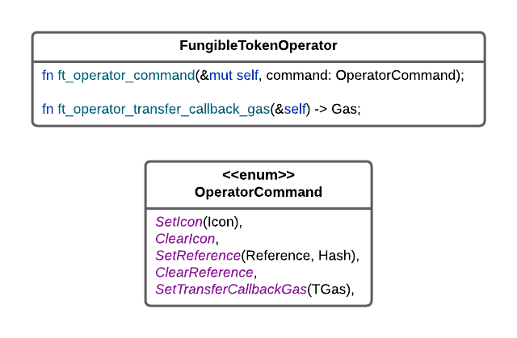

Commands require operator permission

```text
near-figment call $CONTRACT ft_operator_command --accountId $NEAR_ACCOUNT --args '{"command":{"SetIcon":"data://image/svg+xml,<svg></svg>"}}'
near-figment call $CONTRACT ft_operator_command --accountId $NEAR_ACCOUNT --args '{"command":"ClearIcon"}'
near-figment call $CONTRACT ft_operator_command --accountId $NEAR_ACCOUNT --args '{"command":{"SetReference":["http://stake.json","UjZ6ZiKxnwiCXpFfrYDFQq1PTDTbzrrZ9QB5lLPjkgg="]}}'
near-figment call $CONTRACT ft_operator_command --accountId $NEAR_ACCOUNT --args '{"command":"ClearReference"}'
near-figment call $CONTRACT ft_operator_command --accountId $NEAR_ACCOUNT --args '{"command":{"SetTransferCallbackGas":"15"}}'
```

Returns the amount of gas configured for the resolve transfer callback

```text
near-figment view $CONTRACT ft_operator_transfer_callback_gas
```

As stated above, the STAKE Pool contract also has a STAKE account, which serves as the treasury. STAKE tokens received by the STAKE Pool contract are handled in the following manner:

- If STAKE tokens are directly transferred over via `ft_transfer`, then the STAKE is treated as distributions. The next time funds are staked, the STAKE token deposit will be distributed as treasury dividends, i.e., burned.

- If STAKE tokens are received via `ft_transfer_call`, then the STAKE tokens are deposited into the treasury which will be used to increase dividend yield through STAKE earnings

## Staking Pool Component

Most of these APIs were covered in my last tutorial. I am also including them here for completeness as one-stop-shop API guide.

### **Staking Pool API**

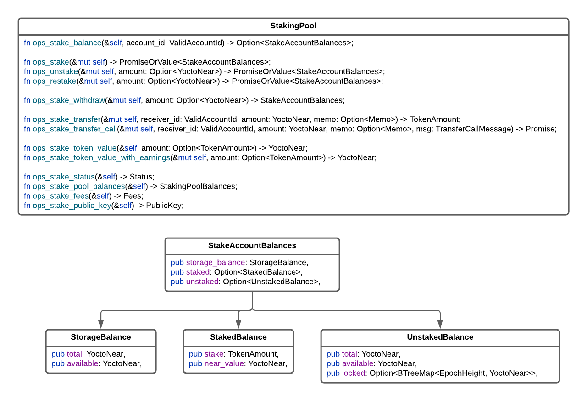

Used to check if the STAKE pool is online or offline

```text
near-figment view $CONTRACT ops_stake_status
```

Used to check and monitor pool balances

```text
near-figment view $CONTRACT ops_stake_pool_balances
```

Returns the current staking fees

```text
near-figment view $CONTRACT ops_stake_fees
```

Returns the current validator public key used for staking

```text
near-figment view $CONTRACT ops_stake_public_key
```

Returns the NEAR value of 1 STAKE token - value includes estimated earnings minus dividends

````text
near-figment view $CONTRACT ops_stake_token_value
```text

Returns the NEAR value for the specified amount of STAKE

```text
near-figment view $CONTRACT ops_stake_token_value --args '{"amount":"5000000000000000000000000"}'
````

Same as above except that earnings are collected before computing the NEAR value - Includes the latest dividend earnings

```text
near-figment call $CONTRACT ops_stake_token_value_with_earnings --account_id $NEAR_ACCOUNT
```

Looks up the STAKE account balances for the specified account ID

```text
near-figment view $CONTRACT ops_stake_balance --args '{"account_id":"oysterpack.testnet"}'
```

Stakes funds from account storage available balance

```text
near-figment call $CONTRACT ops_stake --accountId $NEAR_ACCOUNT
```

Stakes the attached deposit in addition to any account storage available balance

```text
near-figment call $CONTRACT ops_stake --accountId $NEAR_ACCOUNT --amount 0.1
```

Unstakes account's total staked balance

```text
near-figment call $CONTRACT ops_unstake --accountId $NEAR_ACCOUNT
```

Unstakes the specified amount

```text
near-figment call $CONTRACT ops_unstake --accountId $NEAR_ACCOUNT --args '{"amount":"1000000000000000000000000"}'
```

Restakes account's total unstaked balance

```text
near-figment call $CONTRACT ops_restake --accountId $NEAR_ACCOUNT
```

Restakes the specified amount from the account's unstaked balance

```text
near-figment call $CONTRACT ops_restake --accountId $NEAR_ACCOUNT --args '{"amount":"1000000000000000000000000"}'
```

Withdraws account's total unstaked available balance

```text
near-figment call $CONTRACT ops_stake_withdraw --accountId $NEAR_ACCOUNT
```

Withdraws the specified amount from the account's unstaked available balance

```text
near-figment call $CONTRACT ops_stake_withdraw --accountId $NEAR_ACCOUNT --args '{"amount":"1000000000000000000000000"}'
```

Convenience methods used to transfer STAKE tokens by specifying the amounts in NEAR - instead in STAKE via the FT APIs

```text
near-figment call $CONTRACT ops_stake_transfer --accountId $NEAR_ACCOUNT --args '{"receiver_id":"oysterpack.testnet","amount":"1000000000000000000000000"}' --amount 0.000000000000000000000001
near-figment call $CONTRACT ops_stake_transfer_call --accountId $NEAR_ACCOUNT--args '{"receiver_id":"oysterpack.testnet","amount":"1000000000000000000000000", "msg":""}' --amount 0.000000000000000000000001
```

## NEAR Staking Pool API

This API mirrors the first generation staking pool API to make it easier for folks to migrate over. The only difference I want to call out is that when staking, accounts will be automatically registered. This means the account storage balance fees will be deducted from the attached deposit.

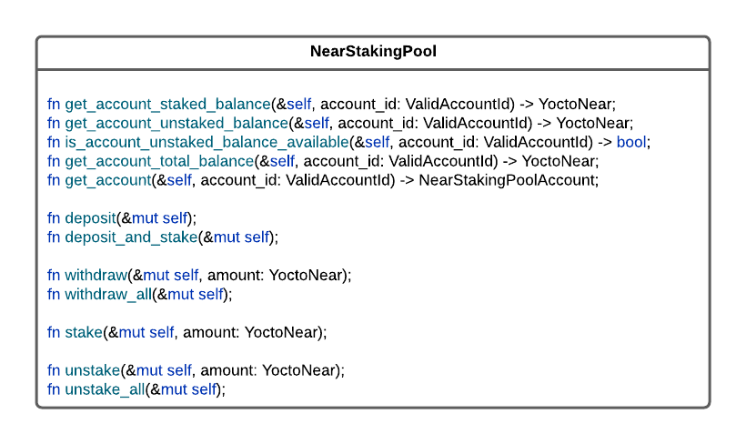

### Staking Pool Treasury API

The API provides convenience APIs to manage the treasurer permissions, which was discussed above. In addition, it provides APIs that affect overall STAKE yield:

1.  **ops_stake_treasury_deposit**

    - Deposits any attached deposit into the treasury.
    - This will effectively stake the deposit and mint STAKE for the treasury.
    - This enables external sources of revenue to be deposited into the treasury.
    - The entire deposit is staked. When minting STAKE, the conversion from NEAR -> STAKE is rounded down. Thus, the NEAR deposit remainder will also get staked, effectively distributing the funds to the current stakers.

2.  **ops_stake_treasury_distribution**
    - Deposits and stakes any attached deposit, which effectively distributes the funds to all current STAKE owners.
    - This enables external sources of revenue to be distributed to STAKE owners.
    - If no deposit is made, then any collected earnings will simply be staked
3.  **ops_stake_treasury_transfer_to_owner**
    - Remember that the treasury funds are effectively owned by the contract owner, i.e., the validator
    - This enables the owner to withdraw funds from the treasury, which has the effect of decreasing the dividend payout

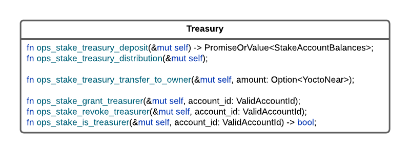

```text
near-figment call $CONTRACT ops_stake_treasury_deposit --accountId oysterpack.testnet --amount 10
near-figment call $CONTRACT ops_stake_treasury_distribution --accountId oysterpack.testnet --amount 10
near-figment call $CONTRACT ops_stake_treasury_transfer_to_owner --accountId oysterpack.testnet --args '{"amount":"1000000000000000000000000"}'
```

### Staking Pool Operator API

The staking pool operator APIs were well covered in the \[previous tutorial]\[11].

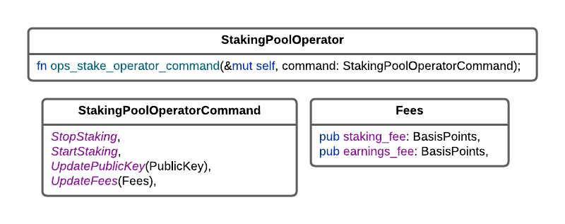

## Conclusion

Congratulations if you made it to the end!

Staking is the lifeblood for any PoS blockchain. In order for NEAR to remain competitive in the blockchain chain PoS space, and survive long term, it must continue to evolve staking and keep it at the forefront. If I could, I would lead the evolution by running my own validator with the new STAKE Pool that I have built. Unfortunately, I don't have $18 million sitting in my bank account. I am effectively locked out from the NEAR validator pool because (at the time of writing) it currently requires **3,272,614** NEAR which translates to **$17.74 million USD** @ NEAR=$5.42 to have a seat at the NEAR validator table. It's a shame, but it is what it is ...

Like I said, this is my gift to the NEAR community. However, this is as far as I can take it because I don't have the financial resource to take it any further. I have written and provided the code and shared the knowledge with the community. The rest is up to the validator and NEAR community to step up to the plate and take it from here. I am here to help because I believe in the cause and support the NEAR platform.

One more seed I want to plant in people's minds is that staking is also fundamental for on-chain decentralized governance ...

I will leave with one final thought ... I understand that DeFi is all the craze of late, but we must not get ahead of ourselves and leave the base unprotected and vulnerable to attack.

That being said ... I invite you to join the Figment and NEAR communities and embark on our common mission to defend and take back the Internet together.

## Next Steps

Stay tuned for more tutorials on the OysterPack SMART component based framework to help contract developers build **_SMARTER_**, **_FASTER_**, and **_BETTER_** on the [NEAR](https://near.org/) platform.


\[11]: <https://learn.figment.io/tutorials/stake-pool-contract#how-to-operate-the-s-t-a-k-e-pool-contract>
