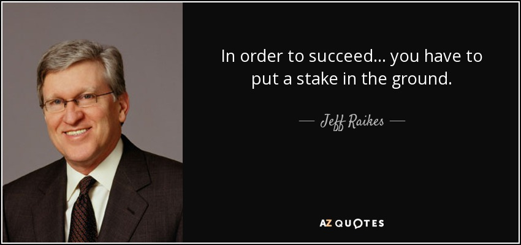
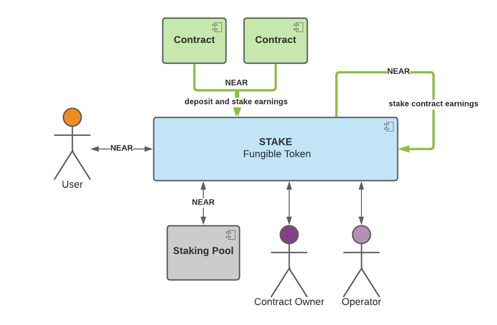
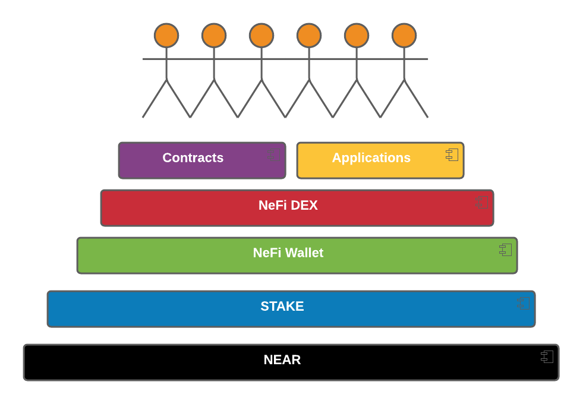

My vision for STAKE can be summed up in 3 words:

1.  Money
2.  Income
3.  NeFi

If you haven't done so yet, I would recommend reading NEAR's paper on [Economics in a Sharded Blockchain](https://near.org/papers/economics-in-sharded-blockchain/). It opens up with:

Incentives are a crucial part of any decentralized protocol. These incentives must balance out to provide value to all the participants of the protocol, and ensure the protocol’s future development.

I couldn't agree more. Based on the **"Show Me The Money"** meme that I weave through my tutorials, you know what I believe is the #1 incentive. The bottom line reality is "money makes the world go round". How does this relate to [STAKE](https://github.com/oysterpack/oysterpack-near-stake-token)? STAKE makes the financial incentives much more attractive for NEAR.

All you need is to provide the right financial incentives to attract enough people to come together at the same place and time and they will start to form complex patterns of connection with one another. This is how new markets are formed. In this regard, I will share with you my vision for the STAKE token and how it will be a game changer for NEAR.

## What is the core problem that STAKE is solving?

The financial incentive to stake NEAR is to earn staking rewards. The problem is that staked NEAR is locked within the staking pool contract. Technically speaking, the staking pool contract owns the NEAR while it is being staked. In order to get back possession of your staked NEAR, you must submit a request to the staking pool contract to unstake your NEAR. You will then need to wait 4 epoch periods, which translates to about 2 days, before the NEAR is available for withdrawal from the staking pool contract back to your account. However, the unstaking process is not exactly that simple because if you submit another unstaking request while an unstaking request has not yet cleared, then it resets the 4 epoch wait period for the total amount that is unstaked. This makes it more complicated to manage access to your staked NEAR.

### The STAKE Solution

The [STAKE](https://github.com/oysterpack/oysterpack-near-stake-token) Token provides a solution by issuing fungible tokens for your staked NEAR, which I covered in my prior [You Can Have Your Stake and Trade It Too](https://learn.figment.io/tutorials/3-stake-fungible-token).

However, [STAKE](https://github.com/oysterpack/oysterpack-near-stake-token) offers much more than simply providing tradeable fungible tokens for your staked NEAR. It captures more value by combining staking rewards and contract rewards, transforming [STAKE](https://github.com/oysterpack/oysterpack-near-stake-token) into **Internet Money with Super Powers**. Contract rewards are a percentage of the transaction fees that are provided back to the contracts that were run during that transaction. The percentage of fees which are allocated to this reward is set to a minimum value of initially 30%. The super powers are provided by the contract rewards coupled with the power of compounding that boost the overall yield for [STAKE](https://github.com/oysterpack/oysterpack-near-stake-token) tokens:

- STAKE token contract contributes contract rewards to the staking pool
- External contracts contribute earnings to the staking pool
- The contract owner chooses what percentage of the contract earnings is shared with the staking pool

This effectively distributes the **income** earned by the STAKE contract and external contracts to all STAKE holders.

### If you stake then there is no reason not to use STAKE

STAKE provides the following benefits over the current staking pool:

1.  STAKE enables the staked NEAR value to be transferred. STAKE enables staked NEAR to be used as **MONEY** _backed by the value of the network_.
2.  STAKE provides more yield than the staking pool contract leveraging the contract rewards super powers. The more the STAKE contract is used, the higher the yield. The more NEAR that is deposited by external contracts, the higher the yield. This transforms STAKE into an **INCOME** stream.
3.  STAKE contract also provides liquidity to unstaking through staking. Basically, the way this works is simple. If you submitted a request to unstake, then normally you would need to wait 2 days. However, if users are depositing NEAR into the STAKE contract to stake, then those funds are used to add liquidity that the unstakers can withdraw against. For example, Bob unstakes STAKE that is worth 1 NEAR. A few seconds later, Alice deposits 1 NEAR to stake. The 1 NEAR that Alice deposited is added to the liquidity pool. Bob's 1 NEAR that was unstaked is simply restaked back into the staking pool. Bob can now immediately withdraw the 1 NEAR from the liquidity pool with out having to wait 2 days.

## Show me the MONEY!

Let me show you how this is a game changer for NEAR and how it has the potential to help NEAR take off ...

### Competition is the mother of innovation - Prepare for STAKE Wars!

STAKE makes the staking game more interesting. Today, there is a single staking pool contract used by all validators that enable users to delegate their NEAR to stake with the validator. Validators simply "compete" for delegators using the validator's brand and fees sharged. That's pretty boring. STAKE transforms vanilla staking into a more competitive landscape for validators by throwing in contract rewards into the equation. Today, the delegators look at staking pools from the perspective of fees charged. STAKE will change that perspective. Delegators will look at STAKE as an income investment and ask questions such as:

1.  What is the overall yield?
2.  What percentage of the contract earnings are shared with the staking pool?
3.  How much is the STAKE contract earning?
4.  What contracts are linked to the STAKE contract and what are the business models?
5.  What is the earnings trend?

This expands the economy around staking and brings in more players. This provides more financial incentives to build on NEAR. This also creates more incentive for delegators to diversify their staking investments. Keep in mind also that anyone can deploy a STAKE contract, which expands the playing field. Today, in order to use the staking pool contract, you must run and manage a validator node. Prepare for STAKE wars!

### STAKE brings NeFi to life

By unlocking staked NEAR, STAKE suddenly brings to market the entire value of the NEAR network to the DeFi market. Let that sink in. This would bring **NeFi** ("NEAR" + "DeFi") to life. I believe this will attract massive capital investment into NeFi.

### The Case for STAKE: Massive Opportunity is Knocking on the Door

STAKE is a game changer for NEAR that can help it take root and take off.

- STAKE transforms staked NEAR into **Internet Money with Super Powers** backed by the value of the NEAR network
- STAKE can be used for **income** and **investment** through staking rewards, contract monetization, and NeFi
- STAKE unlocks staked NEAR and makes it available for **NeFi** protocols
- STAKE creates a much more competitive staking arena and makes possible whole new staking business models
- STAKE provides users with greater incentives to stake

In the coming years, exponential DeFi growth will create generational wealth opportunities. Let's walk through the STAKE effect:

1.  STAKE will make DeFi much more attractive on NEAR - say hello to **NeFi**.
2.  NeFi will provide greater incentive for STAKE.
3.  STAKE will attract massive NeFi capital investment, which will propel demand for NEAR through STAKE.
4.  Higher NEAR demand translates into higher NEAR value.
5.  This will create a natural feedback loop that results in a wealth snowball effect for NEAR.

STAKE can serve as the cornerstone to build and grow the NeFi ecosystem. Here's my overall vision:

- **NEAR** solves the "Scalability Trilemma" problem with a super scalable, fast, cheap network
- **STAKE** solves the problems caused by locked staked NEAR. It transforms staked NEAR into **Internet Money with Super Powers** and brings **NeFi** to life.
- **NeFi Wallet** vision is a mobile wallet strategy that puts NeFi in the users hands - "What's in Your NeFi Wallet?"
- **NeFi DEX** vision is a native DeFi DEX on NEAR

That builds the base for mass adoption explosion.

## It's a wrap folks

I shared with you my vision. The case for STAKE can be summed up in 3 words: **Money + Income + NeFi**. I am so excited about this that I am putting my money where my mouth is and forming a new startup named **OysterPack SMART**. OysterPack SMART mission will be focused on NEAR mass adoption. There are around 8 billion people in the world, and that is scratching the surface because we haven't even talked about [IoT](https://en.wikipedia.org/wiki/Internet_of_things) possibilities yet ... If Facebook can onboard ~2.8 billion people, then that gives me a minimum target.

This is where I make my call for action to the community. I invite you to join the Figment and NEAR communities and embark on our common mission to defend and take back the Internet together.

## Next Steps

The game plan remains the same. As new NEAR standards are released, I plan to document them and provide reference implementations as tutorials. The rest of the time will be focused on the core mission, which is to build the [STAKE Token](https://github.com/oysterpack/oysterpack-near-stake-token) with the community and bring it to market.

