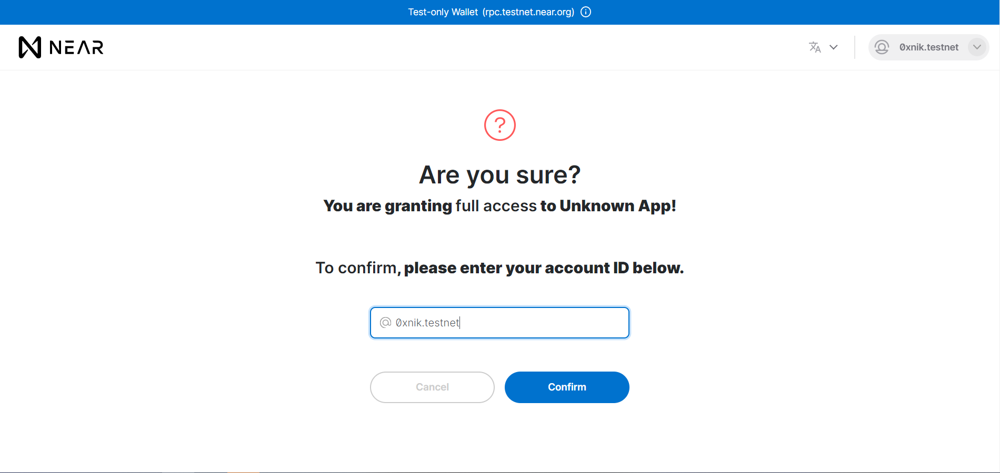

# Introduction

In this tutorial, we are going to write and test a smart contract using Rust. Then we will deploy it to NEAR Testnet.

Why Rust? Rust is the preferred programming language for writing smart contracts on NEAR. Rust offers many features like memory safety, small runtime, etc. This allows us to write a smart contract that doesn’t have memory bugs and consumes less storage on the blockchain.

# Prerequisites

Please make sure that you have completed [NEAR Pathway](https://learn.figment.io/pathways/near-pathway). The Pathway covers the basics of NEAR development.

# Requirements

You should have the following requirements installed:

- Rust (Installation [guide](https://www.rust-lang.org/tools/install) and if you want to learn more about Rust, check this guide [HERE](https://doc.rust-lang.org/book/))
- NEAR CLI (Installation [guide](https://www.npmjs.com/package/near-cli))
- NEAR Testnet account (If you don't have testnet account, check this guide [HERE](https://nearhelp.zendesk.com/hc/en-us/articles/1500002248242-Creating-a-NEAR-Wallet-account))

# Setup

To setup our project, we need to add the WASM (WebAssembly) target to our toolchain. To add that we need to run the following command in the terminal:

```text
rustup target add wasm32-unknown-unknown
```

The output in the terminal will be:

```text
info: downloading component 'rust-std' for 'wasm32-unknown-unknown'
info: installing component 'rust-std' for 'wasm32-unknown-unknown'
info: using up to 500.0 MiB of RAM to unpack components 13.9 MiB /  13.9 MiB (100 %)  10.0 MiB/s in  1s ETA:  0s
```

If target is already added, then output in the terminal will be:

```text
info: component 'rust-std' for target 'wasm32-unknown-unknown' is up to date
```

What is Rust toolchain? A toolchain is a specific version of the collection of programs needed to compile a Rust application.

Why do we need to add the WASM target? To deploy our smart contract on NEAR, we need to compile it to WebAssembly (`.wasm` file). The `rustup` command above installs the standard libraries for the WebAssembly target triple (wasm32-unknown-unknown). Read more about cross-compilation [on the `rustup` docs](https://rust-lang.github.io/rustup/cross-compilation.html).

Now, let’s create a directory called `key_value_storage`, then change into that directory and run the following command in the terminal:

```text
cargo init --lib
```

The output in the terminal will be:

```text
Created library package
```

Open the default `Cargo.toml` file which was generated, remove the existing contents and paste the following:

```toml
[package]
name = "key_value_storage"
version = "0.1.0"
authors = ["Your Name <Your Email>"]
edition = "2018"

[lib]
crate-type = ["cdylib", "rlib"]

[dependencies]
near-sdk = "3.1.0"

[profile.release]
codegen-units = 1
opt-level = "z"
lto = true
debug = false
panic = "abort"
overflow-checks = true
```

See more cargo manifest keys and their definitions at <https://doc.rust-lang.org/cargo/reference/manifest.html> \
Use `overflow-checks = true` to opt into extra safety checks on arithmetic operations: <https://stackoverflow.com/a/64136471/249801> \
Use `opt-level = "z"` to tell the Rust compiler to optimize for small code size.

We are all set now! This can be used as a template and a starting point for any future project.

# Writing the contract

We will create a simple Create, Read, Update, Delete ([CRUD](https://en.wikipedia.org/wiki/Create,_read,_update_and_delete)) backend in Rust that utilizes the on-chain storage offered by NEAR. More information about NEAR storage is available [in the NEAR docs](https://docs.near.org/docs/concepts/storage-staking).

We can start by removing all the existing code in `lib.rs` and pasting in the following code snippet:

```rust
use near_sdk::borsh::{self, BorshDeserialize, BorshSerialize};
use near_sdk::{env, near_bindgen};
use near_sdk::collections::UnorderedMap;

near_sdk::setup_alloc!();

// 1. Main Struct

// 2. Default Implementation

// 3. Core Logic

// 4. Tests
```

At the top of the contract, we need to import a few code modules with the `use` [declaration](https://doc.rust-lang.org/reference/items/use-declarations.html#use-declarations). We will expand on these portions of the `near_sdk` below.

Next, we setup the global allocator from the `wee_alloc` crate using the `setup_alloc!()` macro. Allocators are the way that programs in Rust obtain memory from the system at runtime. `wee_alloc` is a memory allocator designed for WebAssembly. It generates less than a kilobyte of uncompressed WebAssembly code. This macro is shorthand for the boilerplate code:

```rust
#[cfg(target_arch = "wasm32")]
#[global_allocator]
static ALLOC: near_sdk::wee_alloc::WeeAlloc<'_> = near_sdk::wee_alloc::WeeAlloc::INIT;
```

You can read more about [global allocator](https://doc.rust-lang.org/edition-guide/rust-2018/platform-and-target-support/global-allocators.html) and [wee_alloc](https://github.com/rustwasm/wee_alloc).

## Main struct

While writing our smart contract, we will follow a pattern using one structure (`struct`) and an implementation (`impl`) associated with it. This is a pattern used in most Rust contracts on NEAR. Add the following snippet below the comment `// 1. Main Struct` in `lib.rs`:

```rust
#[near_bindgen]
#[derive(BorshDeserialize, BorshSerialize)]
pub struct KeyValue {
    pairs: UnorderedMap<String, String>,
}
```

We have our main structure `KeyValue` which has one field `pairs`. `pairs` is of type `UnorderedMap` which we have imported from `near_sdk::collections`. [`UnorderedMap`](https://github.com/figment-networks/datahub-learn/tree/ea1bfad2b6006f7e2413fddbcedb2d689a5a18fd/network-documentation/near/tutorials/docs.rs/near-sdk/3.1.0/near_sdk/collections/struct.UnorderedMap.html) is a data structure that utilizes underlying blockchain trie storage more efficiently. `near_sdk::collections` offers few other ways to store data on-chain. To get a better overview of all the available ways storage can be used, check out [documentation](https://docs.rs/near-sdk/3.1.0/near_sdk/collections/index.html) of `collections` module.

`#[near_bindgen]` and `#[derive(BorshDeserialize, BorshSerialize)]` are attributes.

What are attributes? A declarative tag that is used to convey information to runtime about the behaviors of various elements like classes, methods, structures, enumerators, assemblies, etc.

By adding the macro `#[near_bindgen]` we provide our struct `KeyValue` with generated boilerplate code to make it compatible with the NEAR blockchain. The second macro, `#[derive(BorshDeserialize, BorshSerialize)]` assists in the serialization and de-serialization of the data for sending it to or retrieiving it from NEAR.

## Default implementation

Every type in Rust has a `Default` implementation but here we want provide our own default implementation for `keyValue` struct. Add the following snippet below the comment `// 2. Default Implementation` in `lib.rs`:

```rust
impl Default for KeyValue {
    fn default() -> Self {
        Self {
            pairs: UnorderedMap::new(b"r".to_vec())
        }
    }
}
```

Now, let’s go step by step: First, we are creating a `Default` implementation for `KeyValue`. After that, we added the `default` method inside that implementation which returns `Self`. `Self` refers to the current type, which is `KeyValue`. Lastly, we are returning `Self` with a new unordered map. While creating a new unordered map, we must pass the ID as `Vec<u8>` type so we are converting `b"r"` which is a byte string, to `Vec<u8>`, using the `to_vec()` function. The prefix `b` is used to specify that we want a byte array of the string. You can read about byte string literals [in the Rust docs.](https://doc.rust-lang.org/reference/tokens.html#byte-string-literals)

## Core logic

Now we are going to add methods to `KeyValue` struct. These methods are core logic for our smart contract. Add following snippet below the comment `// 3. Core Logic`:

```rust
#[near_bindgen]
impl KeyValue {
    pub fn create_update(&mut self, k: String, v: String) {
        env::log(b"created or updated");
        self.pairs.insert(&k, &v);
    }

    pub fn read(&self, k: String) -> Option<String> {
        env::log(b"read");
        return self.pairs.get(&k);
    }

    pub fn delete(&mut self, k: String) {
        env::log(b"delete");
        self.pairs.remove(&k);
    }
}
```

When creating methods, we must have an implementation block defined by the `impl` keyword followed by the name of the `struct` to be implemented. The `pub` keyword makes the methods publicly available, meaning they can be called by anyone with access to the protocol and a means of signing the transaction.

The first method `create_update` is used to create or update particular pair. It takes three arguments `self`, `k`, and `v`.

We are using `&mut self` to borrow self mutably. You can learn more about borrowing [here](https://doc.rust-lang.org/book/ch04-02-references-and-borrowing.html).

`k` and `v` are key-value which we are going to store.

`env::log(b"created or updated")` is used for logging. Logs can be used for showing informative messages or warnings to users. Also, these logs help developer in development process. You will see these logs in terminals when we will interact with smart contract in later part of the tutorial. You can also see the logs in developer console of your browser when you create a web app for your smart contract.

After that, we are calling the method `insert` on `self.pairs`. This will create a key-value pair if one is not present already otherwise it will update the value associated with the given key.

The next two methods are quite similar but instead of calling the `insert` method, we call `get` and `remove` methods on self.pairs to read or remove the key-value pair.

# Testing the contract

The code for our CRUD smart contract is now complete. One of the nice features of Rust is that it allows inline unit tests. This means we can write our unit tests in the same source file as our contract, `lib.rs`!.

Why should we write unit tests for a smart contract? Unit testing is a common practice in software development. While writing smart contracts, units tests are important because smart contracts are often immutable and sometimes responsible for managing sums of money. Writing good unit tests is a key component of secure and reliable smart contract development.

Copy and paste the following code below the comment `// 4. Tests` in `lib.rs` :

```rust
#[cfg(not(target_arch = "wasm32"))]
#[cfg(test)]
mod tests {
    use super::*;
    use near_sdk::MockedBlockchain;
    use near_sdk::{testing_env, VMContext};

    fn get_context(input: Vec<u8>, is_view: bool) -> VMContext {
        VMContext {
            current_account_id: "alice_near".to_string(),
            signer_account_id: "bob_near".to_string(),
            signer_account_pk: vec![0, 1, 2],
            predecessor_account_id: "carol_near".to_string(),
            input,
            block_index: 0,
            block_timestamp: 0,
            account_balance: 0,
            account_locked_balance: 0,
            storage_usage: 0,
            attached_deposit: 0,
            prepaid_gas: 10u64.pow(18),
            random_seed: vec![0, 1, 2],
            is_view,
            output_data_receivers: vec![],
            epoch_height: 0,
        }
    }

    // Test 1

    // Test 2

}
```

This is where we set up our testing environment with various parameters and a mocked blockchain. Read more about the Virtual Machine context and testing environment [in the NEAR-SDK docs](https://docs.rs/near-sdk/3.1.0/near_sdk/struct.VMContext.html).

Let's write our first test for the `create_update` and `read` methods. Paste the following snippet below the comment `// Test 1` in `lib.rs`:

```rust
    #[test]
    fn create_read_pair() {
        let context = get_context(vec![], false);
        testing_env!(context);
        let mut contract = KeyValue::default();
        contract.create_update("first_key".to_string(), "hello".to_string());
        assert_eq!(
            "hello".to_string(),
            contract.read("first_key".to_string()).unwrap()
        );
    }
```

First, we are creating a `context` variable by calling the `get_context` function and passing it to the `testing_env!()` macro which creates a testing environment using the given parameters. Next, we have to create a mutable `contract` variable which will use the contract that we have just written. We can then use this `contract` variable to call our methods for testing.

Now, let’s call the `create_update` method to set key-value pairs. The key will be `first_key` and the value will be `hello`. After creating pair, we want to check if the right values are stored in storage. For checking, we will use the `assert_eq!()` macro. It takes 2 arguments; the expected value and the actual value.

We will pass the expected value to be `"hello".to_string()` and for actual value, we will call the read method with `first_key` as the argument. The read method returns the value of type `Option<String>` but the type of expected value is `String`. That's why we use `unwrap` to get the value of `String` type out of `Option<String>` type.

For our second test, we will assume that key is not present in storage. In this case, `None` should be returned when we attempt to read the key. Add the following code below the comment `// Test 2`:

```rust
    #[test]
    fn read_nonexistent_pair() {
        let context = get_context(vec![], true);
        testing_env!(context);
        let contract = KeyValue::default();
        assert_eq!(None, contract.read("first_key".to_string()));
    }
```

Just like in the first test, we will create our testing environment and `contract` variable. In this test however, the contract variable is immutable, as we are not going to change the `contract` variable. To check that None is returned after accessing a nonexistent key using `contract.read("first_key".to_string())`, we'll use `assert_eq!()`.

Now, it is time to test our code. Run the following command in the terminal:

```text
cargo test -- --nocapture
```

The tests will pass only if the contract is working properly. As our smart contract is working properly, we will see the following output:

```text
Finished test [unoptimized + debuginfo] target(s) in 1m 05s
     Running target/debug/deps/key_value_storage-958f616e81cf3269

running 2 tests
test tests::read_nonexistent_pair ... ok
test tests::create_read_pair ... ok

test result: ok. 2 passed; 0 failed; 0 ignored; 0 measured; 0 filtered out; finished in 0.00s

   Doc-tests key_value_storage

running 0 tests

test result: ok. 0 passed; 0 failed; 0 ignored; 0 measured; 0 filtered out; finished in 0.00s
```

# Compiling the contract

Now that we have written and tested the Rust smart contract, we will compile it into WebAssembly for deployment on NEAR. Run the following command in the terminal (NOTE: Windows users will have to perform the two commands separately, `set` for the environment variables and then the `cargo build` command):

```text
// Linux and macOS users can use these commands:
env 'RUSTFLAGS=-C link-arg=-s'
cargo build --target wasm32-unknown-unknown --release

// Windows users can use these commands:
set RUSTFLAGS=-C link-arg=-s
cargo build --target wasm32-unknown-unknown --release
```

The output from `cargo build` will be similar:

```text
Compiling near-sdk v3.1.0
Compiling key_value_storage v0.1.0 (/home/xqc/key_value_storage)
Finished release [optimized] target(s) in 1m 00s
```

We have now generated an optimized WebAssembly file which we can deploy on NEAR, for this tutorial we will deploy it to the NEAR testnet.

# Deploying the contract

First you have to login into your account using `near-cli`. Run

```text
near login
```

This will redirect you to NEAR wallet requesting full access to your account. From here, select which account you would like an access key to


After you click `allow`, you will be asked to confirm this authorization by entering the account name.



Once complete, you will now have your Access Key stored locally in a hidden directory called `.near-credentials`. This directory is located at the root of your HOME directory:

- `~/.near-credentials` (MAC / Linux)
- `C:\Users\YOUR_ACCOUNT\.near-credentials` (Windows)

Next, giving a name to our contract sound like a great idea. To achieve it, we'll use `near-cli` to create a new account belonging to our master account.

```text
near create-account CONTRACT_NAME.ACCOUNT_ID --masterAcount ACCOUNT_ID --initialBalance 10
```

The output will be:

```text
Saving key to '/home/xxx/.near-credentials/testnet/CONTRACT_NAME.ACCOUNT_ID.json'
Account CONTRACT_NAME.ACCOUNT_ID.testnet for network "testnet" was created.
```

> For example, assuming your current _account_id_ on near testnet is **fido.testnet** and you'd like to name the contract **dodo** then you'll end up creating the following new account_id **dodo.fido.testnet** which will stand for the _contract_id_.
>
> `--initialBalance` if omitted will default to **100 Near**.
> Later on this tutorial, `CONTRACT_ID` will refer to `CONTRACT_NAME.ACCOUNT_ID`
> Read more about NEAR accounts [here](https://nomicon.io/DataStructures/Account.html)

Now we can deploy our Rust smart contract to NEAR. Run the following command in the terminal (NOTE: replace `YOUR_ACCOUNT_HERE` with your account name, ex. `example.near`):

```text
near deploy --wasmFile target/wasm32-unknown-unknown/release/key_value_storage.wasm --accountId CONTRACT_ID
```

After the deployment is completed, you will see similar output in the terminal:

```text
Starting deployment. Account id: CONTRACT_ID, node: https://rpc.testnet.near.org, helper: https://helper.testnet.near.org, file: target/wasm32-unknown-unknown/release/key_value_storage.wasm
Transaction Id E4uT8wV5uXSgsJpB73Uox27iPgXztWfL3b5gzxfA3fHo
To see the transaction in the transaction explorer, please open this url in your browser
https://explorer.testnet.near.org/transactions/E4uT8wV5uXSgsJpB73Uox27iPgXztWfL3b5gzxfA3fHo
Done deploying to CONTRACT_ID
```

🎉🎉 We have successfully deployed our first Rust smart contract.

# Interacting with the contract

Now that we have deployed our contract, we can interact with it using the NEAR CLI.

We'll create a key-value pair and then read it.

This command will create a key-value pair:

```text
near call CONTRACT_ID create_update '{"k": "first_key", "v" : "1"}' --accountId ACCOUNT_ID
```

The output will be:

```text
Scheduling a call: CONTRACT_ID.create_update({"k": "first_key", "v" : "1"})
Receipt: 6bCmuWuAbdiXWvPaTvidbJP4f3mSG4UVcE52g18ZWMq5
        Log [CONTRACT_ID]: created or updated
Transaction Id AQWwThAtXWhU7HJsuD5bvi2FXHpnw5xbj5SEe94Q3MTp
To see the transaction in the transaction explorer, please open this URL in your browser
https://explorer.testnet.near.org/transactions/AQWwThAtXWhU7HJsuD5bvi2FXHpnw5xbj5SEe94Q3MTp
''
```

Function arguments must be provided as a JSON string after name of the method.

Now, we will read the value of the first key:

```text
near view CONTRACT_ID read '{"k": "first_key"}' --accountId ACCOUNT_ID
```

The output will be:

```text
View call: CONTRACT_ID.read({"k": "first_key"})
Log [CONTRACT_ID]: read
'1'
```

> As the `read` method doesn't mutate the state of our contract, we should use `view` in place of `call`. Doing this has the following advantages:
>
> - We do not have to pay any fees
> - The response to our query occurs almost immediately

Lastly, we will delete the key:

```text
near call CONTRACT_ID delete '{"k": "first_key"}' --accountId ACCOUNT_ID
```

The output will be:

```text
Scheduling a call: CONTRACT_ID.delete({"k": "first_key"})
Receipt: wp8YoFZC7CKUNty66VoYuaHMVej7UqcbLcK2FjpMZzk
        Log [CONTRACT_ID]: delete
Transaction Id A4aDmpkfbEP8JwM5KspUiWe1zYnKgUnA5wosCiQBwour
To see the transaction in the transaction explorer, please open this url in your browser
https://explorer.testnet.near.org/transactions/A4aDmpkfbEP8JwM5KspUiWe1zYnKgUnA5wosCiQBwour
''
```

# Conclusion

In this tutorial, we have covered the basics of NEAR smart contract programming using Rust - including the structure of a Rust smart contract; the use of functions and macros offered by the NEAR SDK; how to use on-chain storage; unit testing of a Rust contract; compiling and deploying WebAssembly and finally interacting with deployed Rust contracts on the NEAR blockchain using the NEAR CLI.

Thank you for following along with this tutorial, now take this knowledge and build amazing things on NEAR!

# About the Author

This tutorial was created by [Nikhil Bhintade](https://www.linkedin.com/in/nikbhintade). A crypto enthusiast who wants to document what he learned. You can get in touch with the author on [Github](https://github.com/nikbhintade).
