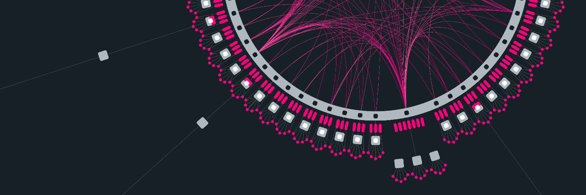
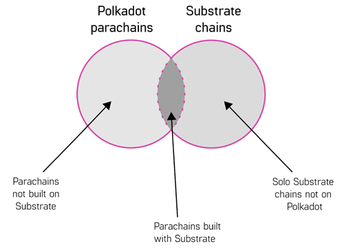

# Introduction

Polkadot allows blockchains and applications to come together and work with each other in parallel. To have a decentralized web, an internet of interoperable blockchains is key. **A sharded blockchain protocol.** Polkadot considers itself to be a next-generation blockchain, or better yet, a foundational network layer that will truly drive the "web 3.0 vision" to create a unified network of specialized, self-governed, optimal blockchains that work together via interoperability. Polkadot offers scalability through its shared model, where blockchains that used to operate in isolation can take advantage of the Polkadot architecture to eliminate bottlenecks and network traffic.

Bitcoin gave us the first real concept of a money protocol; a blockchain that is now generally accepted at being a store of value. Ethereum extended this idea to, well, almost anything - creating the next wave of new finance and allowing us to develop real-world applications on-chain through smart contracts. Polkadot aims to bring these blockchains together, along with many others, while supporting web 3.0 protocols and other key blockchain features on-chain - acting as an infrastructure for infrastructures.

This guide will outline key blockchain concepts through the eyes of Polkadot by creating distinctions and drawing conclusions for each concept. Namely, the focus will be on smart contracts, parachains, parathreads, and decentralized applications. The differences between common blockchain concepts within the Polkadot ecosystem can be best understood by appreciating Polkadot's vision to act as a foundational layer for web 3.0 protocols, that allows for arbitrary data (not just tokens) to be transferred across blockchains.

This is done through _true interoperability_, _pooled security_, _heterogeneous chains_ and _thought-through governance_.

# Prerequisites

This tutorial aims to be beginner-friendly. Nonetheless, it is recommended that you are familiar with the following:

- [Polkadot Behind the Code, Episode 1](https://www.youtube.com/watch?v=GcOKXAOh4Xw)
- An understanding of Polkadot's architecture: [Polkadot: Are You Ready to Start Building?](https://www.youtube.com/watch?v=_-k0xkooSlA).
- [Getting Started with Polkadot](https://wiki.polkadot.network/docs/en/getting-started).

# Introduction to Advanced Concepts in Polkadot

## Polkadot and Smart Contracts

A `smart contract` is a set of instructions (in the form of code) that are deployed on-chain. These instructions represent an agreement between parties that are presented as an executable computer program. The computer program is executed by a blockchain-based platform that enables the deployment of smart contracts. In other words, the smart contract allows for application-level source code to be deployed on-chain. The execution only takes place when predetermined conditions are met. External actors can call upon the smart contract only after it is executed on-chain. The smart contract that is created from the set of instructions will be associated with a specific chain address.

Polkadot itself does not enable the deployment of smart contracts. The Polkadot mainnet will have other chains connected that act as smart contract platforms. External chains that are connected on Polkadot are generally referred to as **Parachains**, which is explained below.

[Parity Technologies](https://www.parity.io/) is a core developer for the Polkadot network. Their main product, [Substrate](https://substrate.dev/en/) is a robust framework that can be used to develop blockchains seamlessly. Parachains are using Substrate to develop modern blockchains that will connect to the Polkadot network.

> **NOTE: There are different implementations of Polkadot. Parity Polkadot is the Rust client. Other implementations exist and are being worked on in C++, Go, and JavaScript. It is important to have multiple implementations of the Polkadot protocol to promote decentralization and progress the protocol in a meaningful way.**

If these external chains would like to offer support for smart contracts, they can do so using the [EVM Pallet](https://substrate.dev/docs/en/knowledgebase/smart-contracts/evm-pallet), which allows a parachain to implement the Ethereum Virtual Machine ([EVM](https://ethereum.org/en/developers/docs/evm/)).

In addition, Substrate also offers a built-in [contract pallet](https://substrate.dev/rustdocs/v3.0.0/pallet_contracts/index.html) that parachains can adapt to. This provides the necessary specs for the deployment and execution of _WebAssembly_ smart contracts.

## Background

As the name suggests, the `Ethereum Virtual Machine` is a virtual machine for Ethereum. The EVM abstracts necessary computational resources into a virtual stack and acts as a runtime environment for smart contracts. [Solidity](https://docs.soliditylang.org/en/v0.8.4/#) is the programming language used for developing smart contracts that run on the EVM.

[WebAssembly](https://webassembly.org/) is an instruction format that works across the web and runs on modern web browsers.

**Fun Fact \[4]:** The co-founder and former CTO of Ethereum, Dr. Gavin James Wood, who is also the founder of the [Web 3 Foundation](https://web3.foundation/) and [Parity Technologies](https://www.parity.io/), is an inventor of the Solidity language and was the initial proposer in 2014 \[4].

## Advantages of Smart Contracts

**_Trustfulness, Transparency, Reliability, Accuracy & Automative_**

- Smart contracts are Immutable: ensures that no one can tamper with or break the contract. The contract also

  holds integrity and credibility at the point in time it was executed.

- Smart contracts allow centralized use cases to be decentralized: some examples include decentralized finance

  (DeFi), governance, and digital identity management.

## Disadvantages of Smart Contracts

**_Scalability, Limitations, Dependencies_**

- Traditional smart contracts can only exist on a single-chain: wanting to execute the same contract on a different

  chain requires its own smart contract to be deployed on that chain.

- Smart contracts are too general for most use-cases.

- Smart contracts are constrained by the properties of their host chain.

- Smart contracts are dependant on their own ability to upgrade and must limit their own execution.
  - Because the smart contract is resource dependant, the code that is executed needs to use the resources of the chain's ecosystem. If there are aspects of the smart contract that are heavy on computational resources, this can be problematic, resulting in a halting problem. With a powerful language, it is impossible to know ahead of time whether or not a program will cease execution. Some platforms address this through a very restricted scripting language (e.g. Bitcoin). Other web 3.0 ecosystems charge a fee, usually referred to as a "gas fee" - for the rights to execute the code on-chain and use those computational resources (e.g. Ethereum). However, if a smart contract executes indefinitely, it will cease its own execution by "running out of gas". Limiting a smart contract's execution is also necessary for preventing DOS attacks.
  - Smart contracts are Immutable: if there are updates to be made in the code within the smart contract, that means an entirely new smart contract needs to be deployed that will be tied to a new chain address; anything referring to the previous chain address also needs to be moved over to the new chain address.

# What is a Parachain?

The Polkadot network has a central chain called the [relay chain](https://wiki.polkadot.network/docs/en/learn-architecture#relay-chain). Polkadot's Nominated Proof of Stake (NPoS) model is used to select validators, allowing them to participate in the consensus protocol. These validators are staked on the Relay chain. Parachains are maintained by a network maintainer known as a [_collator_](https://wiki.polkadot.network/docs/en/learn-collator).

External chains can connect to the Relay chain as `Parachains`. A parachain is an individual blockchain that runs in parallel on the Polkadot network. As such, parachains can also be considered "parallelizable chains" \[5].

Polkadot is considered to be a _layer-0 multi-chain network_, and Parachains run in parallel as individual _layer-1 blockchains_. For reference, _Bitcoin_ and _Ethereum_ are considered to be layer-1 blockchains. The parachain model allows for individual blockchains to achieve scalability at layer-1 \[3].

> A prominent issue in the Ethereum ecosystem is the ability to scale where a dependency is created on possible _layer-2_ scaling solutions.

## Comparing Parachains and Smart Contracts

After developing a smart contract, the next thing to do is to deploy it. This means there is a need for a target chain, where the target chain has its own environment. Using a parachain, the developer can declare the environment of their own chain. Parachains can also upgrade themselves through a root command or the governance pallet, allowing developers to update code. This is an essential parachain feature to prevent forks - unlike smart contracts, which have exhaustive upgrade issues.

Polkadot does not use a _gas-metering model_, but a _weight-fee model_, meaning Parachains do not have a gas-metered model in their logic. Parachains can implement powerful programming languages. Better put, parachains try to be proactive, while smart contract platforms are event-driven.

Using Ethereum as an example of a smart contract platform:

Ethereum

- Smart contracts can call each other synchronously in the same shard.
- Smart contracts can call each other asynchronously between shards.

Polkadot

- Smart contracts can call each other synchronously in the same parachain.
- Smart contracts can call each other asynchronously across parachains.

## Benefits in becoming a Parachain

**_Security, Scability, Developer friendly, On-chain Governance, Crowdloan functionality_**

- Substrate development is component-based and abstracts the nitty-gritty of blockchain development so the

  developer can focus on what matters.

- Any chain connected to the relay chain shares the security of all chains active on the network.

- Block Verification and finalization are performed by the validators on the relay chain.

- Ability to send messages to other chains through [XCMP](https://wiki.polkadot.network/docs/en/learn-crosschain#docsNav).

- On-chain governance as compared to other platforms that have off-chain governance.

Parachain's participation on polkadot is auction-based and requires the parachain to secure an available parachain slot on the relay chain.

## What about Parathreads?

`Parathreads` are parachains that do not stay connected to the relay chain. Parathreads are essentially pay-as-you-go parachains and temporarily participate on the network on a per-block basis \[2].

The main difference between parachains and parathreads is **economic**. A parachain auction happens every six months for securing a slot on the network. A fee auction happens every block for a parathread.

# Polkadot and dApps

`dApp` stands for decentralized application; no single entity has complete control. dApps run on peer-to-peer, distributed networks. Smart contracts are known as the core pillar for dApps, as application-level source code is within the logic of the contract itself. Since the apps are based on a decentralized blockchain, there is an incentivization system for the validators through some form of digital asset (often a token). A dApp requires a consensus mechanism to convey the proof of value in the system.

**WASM vs EVM: Why Substrate encourages WebAssembly**

Every blockchain ecosystem essentially needs a virtual machine to process events on-chain. The EVM is considered to be a lightweight Virtual Machine that allows you to run smart contracts on the Ethereum network. There are some problems currently facing the EVM that ultimately limit the throughput of the network and create a bottleneck.

- The EVM isn’t as fast as it should be and directly impact network efficiency.
- The EVM uses opcodes that are not optimized for different hardware platforms.
- The support and reach for developing smart contracts are limited.

`Wasm`, or WebAssembly, was developed by the World Wide Web Consortium (W3C); it is essentially a new type of code that can execute directly on the browser.

- Wasm expands the supported languages that a developer can write a smart contract in, such as Rust, C/C++, C#, and Typescript.
- Wasm is high performance.
- Wasm is optimized for different hardware platforms.

This [article](https://www.parity.io/wasm-smart-contract-development/#:~:text=While%20Wasm%20itself%20benefits%20from,and%20interact%20with%20the%20blockchain) offers a perspective from Parity Technologies about WebAssembly being an alternative to the EVM.

**_Runtime development is different than dApp development_**

- Using a smart contract platform to develop a dApp allows the developer to focus on the logic within the contract itself. Deploying a dApp on a parachain is different than creating a parachain as this requires runtime development. Each parachain can have a unique implementation with its own runtime logic. Generally, there are two approaches to dApp development on Polkadot:
  1.  Develop dApp in Wasm where it will run on a native parachain.
  2.  Deploy a dApp via Solidity on an EVM-based chain.

**_Building a dApp on Polkadot can be seen as building a dApp on a Substrate-based chain_**

> NOTE: Remember, Polkadot supports parachains that are not built on Substrate. Chains can also be built on Substrate and are not required to be deployed onto Polkadot \[1].

# Conclusion

Congratulations! This tutorial offered a friendly architectural view of Polkadot, in the eyes of Polkadot. The tutorial branched off from "what the blockchain space has" to "where it's going" by discussing the differences between smart contracts, parachains, parathreads and DApps.

# What's next?

To dive more into these concepts, see the following pages on the official Polkadot Wiki.

- [Architecture](https://wiki.polkadot.network/docs/en/learn-architecture)
- [Smart Contracts](https://wiki.polkadot.network/docs/en/build-smart-contracts)
- [Parachains](https://wiki.polkadot.network/docs/en/learn-parachains)
- [Parathreads](https://wiki.polkadot.network/docs/en/learn-parathreads)
- [Glossary](https://wiki.polkadot.network/docs/en/glossary)

Why not try building your first Substrate-based chain!

# About the Author

This guide was created by Danny Salman. You can reach out to Danny on [GitHub](https://github.com/DannyS03) for help or if you have questions pertaining to Polkadot and this guide.

# References

\[1] [A brief summary of everything Substrate and Polkadot](https://www.parity.io/a-brief-summary-of-everything-substrate-polkadot/)\
\[2] [Parathreads: Pay-as-you-go Parachains](https://polkadot.network/parathreads-parathreads-pay-as-you-go-parachains/)\
\[3] [Polkadot: The Foundation of a New Internet](https://medium.com/polkadot-network/polkadot-the-foundation-of-a-new-internet-e8800ec81c7)\
\[4] [Polkadot, Substrate and Ethereum](https://medium.com/polkadot-network/polkadot-substrate-and-ethereum-f0bf1ccbfd13)\
\[5] [Research at Web3 Foundation](https://research.web3.foundation/en/latest/polkadot/overview/1-polkadot-introduction.html?highlight=parachains)
