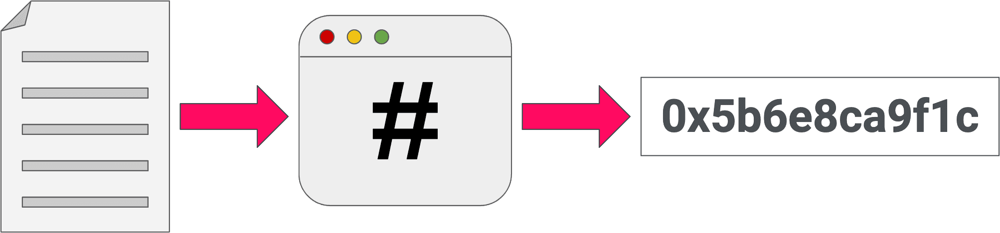
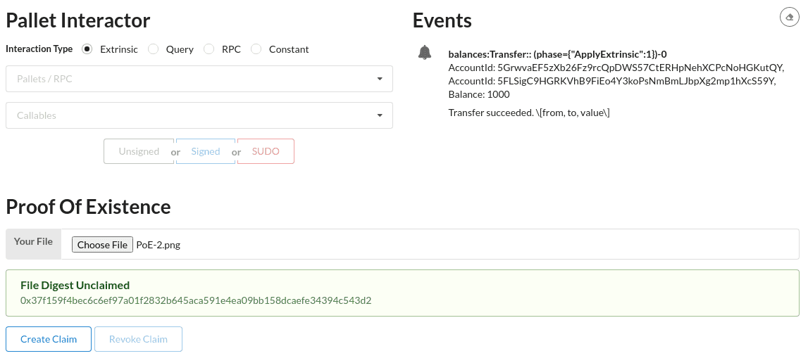
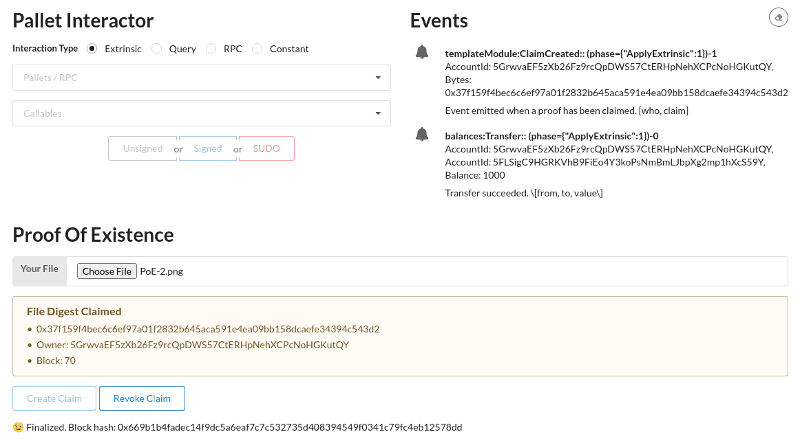

[The original tutorial can be found in the official Substrate documentation here. ](https://docs.substrate.io/tutorials/v3/proof-of-existence/)

# Introduction

In this tutorial, you will learn to create a custom ["Proof of Existence"](https://en.wikipedia.org/wiki/Proof_of_Existence) dApp using the Substrate blockchain development framework and [FRAME](https://substrate.dev/docs/en/knowledgebase/runtime/frame) runtime libraries.

This tutorial should take you about **1 hour** to complete. We will be using the [Rust programming language](https://www.rust-lang.org/) and [ReactJS](https://reactjs.org/), but you do not need to know these to be able to complete this guide. We will provide you with working code snippets and explain what all the code does at a high level.

We only expect that:

- You are generally familiar with software development, writing code, and running your code.
- You have completed the [Create Your First Substrate Chain Tutorial](https://substrate.dev/docs/en/tutorials/create-your-first-substrate-chain).
- You are open to learning about the bleeding edge of blockchain development.

If you run into an issue on this tutorial, **we are here to help!** You can [ask a question on Stack Overflow](https://stackoverflow.com/questions/tagged/substrate) and use the `substrate` tag or contact us on [Element](https://matrix.to/#/#substrate-technical:matrix.org).

## What you will be doing

Before we even get started, let's lay out what we are going to do over the course of this tutorial. We will:

1.  Launch a Substrate blockchain based on a template project.
2.  Modify this template project to add our own custom logic.
3.  Modify a front-end template to interact with your brand new blockchain.

Sound reasonable? Good, then let's begin!

## Install the Node Template

You should already have version `v3.0.0` of the [Substrate Developer Hub Node Template](https://github.com/substrate-developer-hub/substrate-node-template) compiled on your computer from when you completed the [Create Your First Substrate Chain Tutorial](https://substrate.dev/docs/en/tutorials/create-your-first-substrate-chain). If you do not, please complete that tutorial.

> Experienced developers who truly prefer to skip that tutorial may install the Node Template according to [the instructions in its readme](https://github.com/substrate-developer-hub/substrate-node-template#getting-started).

## Install the Front-End Template

The Create Your First Substrate Chain Tutorial used the front-end template, so there is no additional set-up required if you have already completed that tutorial.

> Refer directly to the [front-end setup instructions](https://substrate.dev/docs/en/tutorials/create-your-first-substrate-chain/setup#install-the-front-end-template) for the Create Your First Chain Tutorial if necessary.

# About Proof of Existence

The dApp we will build is a Proof of Existence (PoE) service. From [Wikipedia](https://en.wikipedia.org/wiki/Proof_of_Existence):

> Proof of Existence is an online service that verifies the existence of computer files as of a specific time via timestamped transactions in the bitcoin blockchain.

Rather than uploading the entire file to the blockchain to "prove its existence", users submit a [hash of the file](https://en.wikipedia.org/wiki/File_verification), known as a file digest or checksum. These hashes are powerful because huge files can be uniquely represented by a small hash value, which is efficient for storing on the blockchain. Any user with the original file can prove that this file matches the one on the blockchain by simply recomputing the hash of the file and comparing it with the hash stored on chain.



To add to this, blockchains also provide a robust identity system. So when a file digest is stored on the blockchain, we can also record which user uploaded that digest. This allows that user to later prove that they were the original person to claim the file.

## Interface and Design

Our PoE API will expose two callable functions:

- `create_claim` - allows a user to claim the existence of a file by uploading a file digest.
- `revoke_claim` - allows the current owner of a claim to revoke their ownership.

In order to implement this, we will only need to store information about the proofs that have been claimed, and who made those claims.

Sounds simple enough? Great, let's get coding.

## Building a Custom Pallet

The Substrate Developer Hub Node Template, which is used as the starting point for this tutorial, has a FRAME-based [runtime](https://substrate.dev/docs/en/knowledgebase/runtime/). [FRAME](https://substrate.dev/docs/en/knowledgebase/runtime/frame) is a library of code that allows you to build a Substrate runtime by composing modules called "pallets". You can think of these pallets as individual pieces of logic that define what your blockchain can do! Substrate provides you with a number of pre-built pallets for use in FRAME-based runtimes.


For example, FRAME includes a [Balances](https://substrate.dev/rustdocs/v3.0.0/pallet_balances/) pallet that controls the underlying currency of your blockchain by managing the _balance_ of all the accounts in your system.

If you want to add smart contract functionality to your blockchain, you simply need to include the [Contracts](https://substrate.dev/rustdocs/v3.0.0/pallet_contracts/) pallet.

Even things like on-chain governance can be added to your blockchain by including pallets like [Democracy](https://substrate.dev/rustdocs/v3.0.0/pallet_democracy/), [Elections](https://substrate.dev/rustdocs/v3.0.0/pallet_elections/), and [Collective](https://substrate.dev/rustdocs/v3.0.0/pallet_collective/).

The goal of this tutorial is to teach you how to create your own FRAME pallet to include in your custom blockchain! The Substrate Developer Hub Node Template comes with a template pallet that you will use as a starting point to build custom runtime logic on top of.

## File Structure

Open the Node Template in your favorite code editor, then open the file `pallets/template/src/lib.rs`

```text
substrate-node-template
|
+-- node
|
+-- pallets
|   |
|   +-- template
|       |
|       +-- Cargo.toml    <-- One change in this file
|       |
|       +-- src
|           |
|           +-- lib.rs     <-- Most changes in this file
|           |
|           +-- mock.rs
|           |
|           +-- tests.rs
|
+-- runtime
|
+-- scripts
|
+-- ...
```

You will see some pre-written code that acts as a template for a new pallet. You can read over this file if you'd like, and then delete the contents since we will start from scratch for full transparency. When writing your own pallets in the future, you will likely find the scaffolding in this template pallet useful.

# Build Your New Pallet

At a high level, a FRAME pallet can be broken down into six sections:

```rust
// 1. Imports
use frame_support::{decl_module, decl_storage, decl_event, decl_error, dispatch};
use frame_system::ensure_signed;

// 2. Configuration
pub trait Config: frame_system::Config { /* --snip-- */ }

// 3. Storage
decl_storage! { /* --snip-- */ }

// 4. Events
decl_event! { /* --snip-- */ }

// 5. Errors
decl_error! { /* --snip-- */ }

// 6. Callable Functions
decl_module! { /* --snip-- */ }
```

Things like events, storage, and callable functions may look familiar to you if you have done other blockchain development. We will show you what each of these components looks like for a basic Proof Of Existence pallet.

## Imports and Dependencies

Since imports are pretty boring, you can start by pasting this at the top of your empty `lib.rs` file:

```rust
#![cfg_attr(not(feature = "std"), no_std)]

use frame_support::{
    decl_module, decl_storage, decl_event, decl_error, ensure, StorageMap
};
use frame_system::ensure_signed;
use sp_std::vec::Vec;
```

Most of these imports are already available because they were used in the template pallet whose code we just deleted. However, `sp_std` is not available and we need to list it as a dependency.

**Add** this block to your `pallets/template/Cargo.toml` file under `[dependencies]` section.

```toml
[dependencies]
#--snip--
sp-std = { default-features = false, version = '3.0.0' }
```

Then, **Update** the existing `[features]` block to look like this. The last line is new. You will learn more about why this is necessary in the next tutorial, the [Add a Pallet](https://substrate.dev/docs/en/tutorials/add-a-pallet) tutorial.

```toml
[features]
default = ['std']
std = [
    'codec/std',
    'frame-support/std',
    'frame-system/std',
    'sp-std/std', # <-- This line is new
]
```

## Configuration

Every pallet has a component called `Config` that is used for configuration. This component is a [Rust "trait"](https://doc.rust-lang.org/book/ch10-02-traits.html); traits in Rust are similar to interfaces in languages such as C++, Java and Go. For now, the only thing we will configure about our pallet is that it will emit some Events. The `Config` interface is another topic that will be covered in greater depth in the next tutorial, the [Add a Pallet](https://substrate.dev/docs/en/tutorials/add-a-pallet) tutorial. The following code will need to be added to your `pallets/template/src/lib.rs` file:

```rust
/// Configure the pallet by specifying the parameters and types on which it depends.
pub trait Config: frame_system::Config {
    /// Because this pallet emits events, it depends on the runtime's definition of an event.
    type Event: From<Event<Self>> + Into<<Self as frame_system::Config>::Event>;
}
```

## Events

After we've configured our pallet to emit events, let's go ahead and define which events:

```rust
// Pallets use events to inform users when important changes are made.
// Event documentation should end with an array that provides descriptive names for parameters.
// https://substrate.dev/docs/en/knowledgebase/runtime/events
decl_event! {
    pub enum Event<T> where AccountId = <T as frame_system::Config>::AccountId {
        /// Event emitted when a proof has been claimed. [who, claim]
        ClaimCreated(AccountId, Vec<u8>),
        /// Event emitted when a claim is revoked by the owner. [who, claim]
        ClaimRevoked(AccountId, Vec<u8>),
    }
}
```

Our pallet will only emit an event in two circumstances:

1.  When a new proof is added to the blockchain.
2.  When a proof is removed.

The events can contain some additional data, in this case, each event will also display who triggered the event (`AccountId`), and the proof data (as `Vec<u8>`) that is being stored or removed. Note that convention is to include an array with descriptive names for these parameters at the end of event documentation.

## Errors

The events we defined previously indicate when calls to the pallet have completed successfully. Similarly, errors indicate when a call has failed, and why it has failed.

```rust
// Errors inform users that something went wrong.
decl_error! {
    pub enum Error for Module<T: Config> {
        /// The proof has already been claimed.
        ProofAlreadyClaimed,
        /// The proof does not exist, so it cannot be revoked.
        NoSuchProof,
        /// The proof is claimed by another account, so caller can't revoke it.
        NotProofOwner,
    }
}
```

The first of these errors can occur when attempting to claim a new proof. Of course a user cannot claim a proof that has already been claimed. The latter two can occur when attempting to revoke a proof.

## Storage

To add a new proof to the blockchain, we will simply store that proof in our pallet's storage. To store that value, we will create a [hash map](https://en.wikipedia.org/wiki/Hash_table) from the proof to the owner of that proof and the block number the proof was made.

```rust
// The pallet's runtime storage items.
// https://substrate.dev/docs/en/knowledgebase/runtime/storage
decl_storage! {
    trait Store for Module<T: Config> as TemplateModule {
        /// The storage item for our proofs.
        /// It maps a proof to the user who made the claim and when they made it.
        Proofs: map hasher(blake2_128_concat) Vec<u8> => (T::AccountId, T::BlockNumber);
    }
}
```

If a proof has an owner and a block number, then we know that it has been claimed! Otherwise, the proof is available to be claimed.

## Callable Functions

As implied by our pallet's events and errors, we will have two "dispatchable functions" the user can call in this FRAME pallet:

1.  `create_claim()`: Allow a user to claim the existence of a file with a proof.
2.  `revoke_claim()`: Allow the owner of a claim to revoke their claim.

```rust
// Dispatchable functions allows users to interact with the pallet and invoke state changes.
// These functions materialize as "extrinsics", which are often compared to transactions.
// Dispatchable functions must be annotated with a weight and must return a DispatchResult.
decl_module! {
    pub struct Module<T: Config> for enum Call where origin: T::Origin {
        // Errors must be initialized if they are used by the pallet.
        type Error = Error<T>;

        // Events must be initialized if they are used by the pallet.
        fn deposit_event() = default;

        /// Allow a user to claim ownership of an unclaimed proof.
        #[weight = 10_000]
        fn create_claim(origin, proof: Vec<u8>) {
            // Check that the extrinsic was signed and get the signer.
            // This function will return an error if the extrinsic is not signed.
            // https://substrate.dev/docs/en/knowledgebase/runtime/origin
            let sender = ensure_signed(origin)?;

            // Verify that the specified proof has not already been claimed.
            ensure!(!Proofs::<T>::contains_key(&proof), Error::<T>::ProofAlreadyClaimed);

            // Get the block number from the FRAME System module.
            let current_block = <frame_system::Module<T>>::block_number();

            // Store the proof with the sender and block number.
            Proofs::<T>::insert(&proof, (&sender, current_block));

            // Emit an event that the claim was created.
            Self::deposit_event(RawEvent::ClaimCreated(sender, proof));
        }

        /// Allow the owner to revoke their claim.
        #[weight = 10_000]
        fn revoke_claim(origin, proof: Vec<u8>) {
            // Check that the extrinsic was signed and get the signer.
            // This function will return an error if the extrinsic is not signed.
            // https://substrate.dev/docs/en/knowledgebase/runtime/origin
            let sender = ensure_signed(origin)?;

            // Verify that the specified proof has been claimed.
            ensure!(Proofs::<T>::contains_key(&proof), Error::<T>::NoSuchProof);

            // Get owner of the claim.
            let (owner, _) = Proofs::<T>::get(&proof);

            // Verify that sender of the current call is the claim owner.
            ensure!(sender == owner, Error::<T>::NotProofOwner);

            // Remove claim from storage.
            Proofs::<T>::remove(&proof);

            // Emit an event that the claim was erased.
            Self::deposit_event(RawEvent::ClaimRevoked(sender, proof));
        }
    }
}
```

> The functions you see here do not have return types explicitly stated. In reality they all return [`DispatchResult`](https://substrate.dev/rustdocs/v3.0.0/frame_support/dispatch/type.DispatchResult.html)s. This return type is added on your behalf by the `decl_module!` macro.

# Compile Your New Pallet

After you've copied all of the parts of this pallet correctly into your `pallets/template/lib.rs` file, you should be able to recompile your node without warning or error. Run this command in the root directory of the `substrate-node-template` repository to build and run the node:

```text
WASM_BUILD_TOOLCHAIN=nightly-2020-10-05 cargo run --release -- --dev --tmp
```

Now it is time to interact with our new Proof of Existence pallet!

## Building a Custom Front End

If you have made it this far, that means you _should_ have a brand new blockchain with custom functionality up and running.

We will give you a custom React component that you can use to interact with your node.

### Explore the Front-End Template

To start the Front-End Template, navigate to its directory and run:

```text
yarn install
yarn start
```

`yarn install` will install dependencies if this is the first time you run front-end template. `yarn start` will start the template.

## Add Your Custom React Component

In the Front-End Template project, edit the `TemplateModule.js` file in the `/src/` folder:

```text
substrate-front-end-template
|
+-- src
|   |
|   +-- index.js
|   |
|   +-- App.js
|   |
|   +-- TemplateModule.js  <-- Edit this file
|   |
|   +-- ...
+-- ...
```

Delete the entire contents of that file, and replace it with the following:

```jsx
// React and Semantic UI elements.
import React, { useState, useEffect } from 'react';
import { Form, Input, Grid, Message } from 'semantic-ui-react';
// Pre-built Substrate front-end utilities for connecting to a node
// and making a transaction.
import { useSubstrate } from './substrate-lib';
import { TxButton } from './substrate-lib/components';
// Polkadot-JS utilities for hashing data.
import { blake2AsHex } from '@polkadot/util-crypto';

// Our main Proof Of Existence Component which is exported.
export function Main(props) {
  // Establish an API to talk to our Substrate node.
  const { api } = useSubstrate();
  // Get the selected user from the `AccountSelector` component.
  const { accountPair } = props;
  // React hooks for all the state variables we track.
  // Learn more at: https://reactjs.org/docs/hooks-intro.html
  const [status, setStatus] = useState('');
  const [digest, setDigest] = useState('');
  const [owner, setOwner] = useState('');
  const [block, setBlock] = useState(0);

  // Our `FileReader()` which is accessible from our functions below.
  let fileReader;

  // Takes our file, and creates a digest using the Blake2 256 hash function.
  const bufferToDigest = () => {
    // Turns the file content to a hexadecimal representation.
    const content = Array.from(new Uint8Array(fileReader.result))
      .map(b => b.toString(16).padStart(2, '0'))
      .join('');

    const hash = blake2AsHex(content, 256);
    setDigest(hash);
  };

  // Callback function for when a new file is selected.
  const handleFileChosen = file => {
    fileReader = new FileReader();
    fileReader.onloadend = bufferToDigest;
    fileReader.readAsArrayBuffer(file);
  };

  // React hook to update the owner and block number information for a file.
  useEffect(() => {
    let unsubscribe;

    // Polkadot-JS API query to the `proofs` storage item in our pallet.
    // This is a subscription, so it will always get the latest value,
    // even if it changes.
    api.query.templateModule
      .proofs(digest, result => {
        // Our storage item returns a tuple, which is represented as an array.
        setOwner(result[0].toString());
        setBlock(result[1].toNumber());
      })
      .then(unsub => {
        unsubscribe = unsub;
      });

    return () => unsubscribe && unsubscribe();
    // This tells the React hook to update whenever the file digest changes
    // (when a new file is chosen), or when the storage subscription says the
    // value of the storage item has updated.
  }, [digest, api.query.templateModule]);

  // We can say a file digest is claimed if the stored block number is not 0.
  function isClaimed() {
    return block !== 0;
  }

  // The actual UI elements which are returned from our component.
  return (
    <Grid.Column>
      <h1>Proof Of Existence</h1>
      {/* Show warning or success message if the file is or is not claimed. */}
      <Form success={!!digest && !isClaimed()} warning={isClaimed()}>
        <Form.Field>
          {/* File selector with a callback to `handleFileChosen`. */}
          <Input
            type="file"
            id="file"
            label="Your File"
            onChange={e => handleFileChosen(e.target.files[0])}
          />
          {/* Show this message if the file is available to be claimed */}
          <Message success header="File Digest Unclaimed" content={digest} />
          {/* Show this message if the file is already claimed. */}
          <Message
            warning
            header="File Digest Claimed"
            list={[digest, `Owner: ${owner}`, `Block: ${block}`]}
          />
        </Form.Field>
        {/* Buttons for interacting with the component. */}
        <Form.Field>
          {/* Button to create a claim. Only active if a file is selected,
          and not already claimed. Updates the `status`. */}
          <TxButton
            accountPair={accountPair}
            label={'Create Claim'}
            setStatus={setStatus}
            type="SIGNED-TX"
            disabled={isClaimed() || !digest}
            attrs={{
              palletRpc: 'templateModule',
              callable: 'createClaim',
              inputParams: [digest],
              paramFields: [true],
            }}
          />
          {/* Button to revoke a claim. Only active if a file is selected,
          and is already claimed. Updates the `status`. */}
          <TxButton
            accountPair={accountPair}
            label="Revoke Claim"
            setStatus={setStatus}
            type="SIGNED-TX"
            disabled={!isClaimed() || owner !== accountPair.address}
            attrs={{
              palletRpc: 'templateModule',
              callable: 'revokeClaim',
              inputParams: [digest],
              paramFields: [true],
            }}
          />
        </Form.Field>
        {/* Status message about the transaction. */}
        <div style={{ overflowWrap: 'break-word' }}>{status}</div>
      </Form>
    </Grid.Column>
  );
}

export default function TemplateModule(props) {
  const { api } = useSubstrate();
  return api.query.templateModule && api.query.templateModule.proofs ? (
    <Main {...props} />
  ) : null;
}
```

We won't walk you step by step through the creation of this component, but do look over the code comments to learn what each part is doing.

## Submit a Proof

Your Front-End Template should reload when you save your changes, and you'll notice our new component. Now we're ready to try out our new dApp. Select any file on your computer, and you will see that you can create a claim with its file digest:



If you press "Create Claim", a transaction will be dispatched to your custom Proof of Existence pallet, where this digest and the selected user account will be stored on chain.



If all went well, you should see a new `ClaimCreated` event appear in the Events component. The front-end automatically recognizes that your file is now claimed, and even gives you the option to revoke the claim if you want.

Remember, only the owner can revoke the claim! If you select another user account at the top, and you will see that the revoke option is disabled!

# Next Steps

This is the end of our journey into creating a Proof of Existence blockchain.

You have seen firsthand how simple it can be to develop a brand new pallet and launch a custom blockchain using Substrate and FRAME. Furthermore, we have shown you that the Substrate ecosystem provides you with the tools to quickly create responsive front-end experiences so users can interact with your blockchain.

This tutorial chose to omit some of the specific details around development in order to keep this experience short and satisfying. However, we want you to keep learning!

To learn more about building your own pallets, explore the [Substrate Recipes](https://substrate.dev/recipes/).

Complete the [Add a Pallet](https://substrate.dev/docs/en/tutorials/add-a-pallet/) tutorial to learn how to extend the Node Template with additional capabilities from Substrate's set of [core FRAME pallets](https://substrate.dev/docs/en/knowledgebase/runtime/frame).

Substrate is written in the Rust programming language, which has a great community and many helpful resources. If you would like to learn more about this powerful and [beloved](https://stackoverflow.blog/2020/01/20/what-is-rust-and-why-is-it-so-popular/) programming language, check out the information-packed [Rust Book](https://doc.rust-lang.org/book/) and the fun [Rustlings](https://github.com/rust-lang/rustlings) course.

If you experienced any issues with this tutorial or want to provide feedback, You can [ask a question on Stack Overflow](https://stackoverflow.com/questions/tagged/substrate) and use the `substrate` tag or contact us on [Element](https://matrix.to/#/#substrate-technical:matrix.org).

We can't wait to see what you build next!
