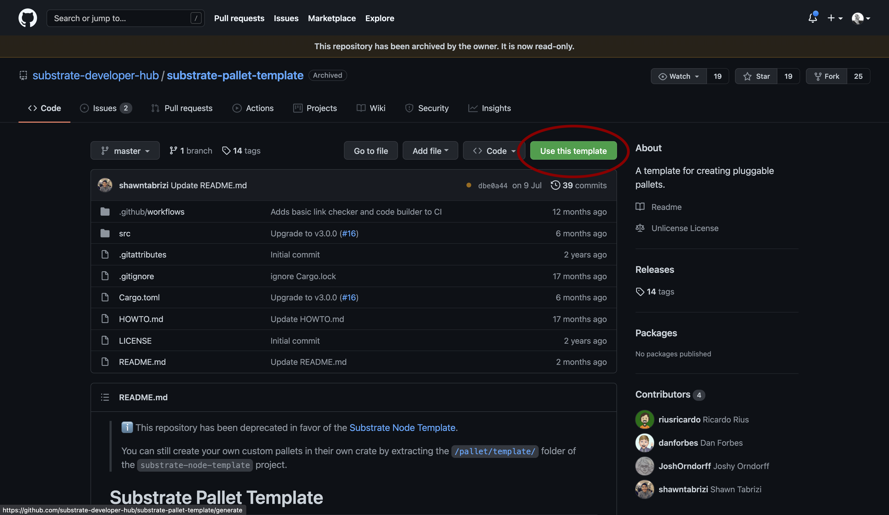
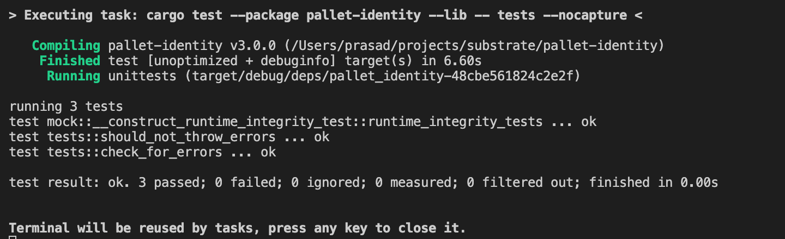

# Introduction

In this tutorial, we will be building a custom pallet using the Substrate development framework and FRAME v1. We will start with an overview to understand pallets and the FRAME framework. We will then take a look at the Substrate pallet template, using it to build our custom pallet, write test cases, publish using git and finally add the published pallet to our runtime.

# Prerequisites

This tutorial assumes the reader is somewhat familiar with the Rust programming language and has a basic understanding of the Substrate framework.

# Pallets

Pallets are domain-specific runtime modules, which allow us to have a modular design. We can add multiple pallets to our runtime.

For reference, some of the most popular prebuilt pallets can be found [on the Substrate developer site](https://substrate.dev/docs/en/knowledgebase/runtime/frame#prebuilt-pallets).

## FRAME v1

FRAME is the framework used to develop pallets, it comes with set of libraries and modules to get us started. Following is the skeleton of a FRAME based pallet:

1.  Imports and Dependencies

The pallet supports the use of any Rust library which compiles with the `no_std` flag.

```rust
use support::{decl_module, decl_event, decl_storage, ...}
```

2.  Runtime Config Trait

All of the runtime types and consts will go in here. If the pallet is dependent on other pallets, then their configuration traits should be added to the inherited traits list.

```rust
pub trait Config: frame_system::Config { ... }
```

3.  Runtime Events

Events are a simple means of reporting specific events that have happened which users, dApps and/or block explorers would find interesting and otherwise would be difficult to detect.

Read more about [Runtime Events](https://substrate.dev/docs/en/knowledgebase/runtime/events)

```rust
decl_event! { ... }
```

4.  Runtime Storage

This allows for type-safe usage of the Substrate storage database, so you can keep things around between blocks.

Read more about [Runtime Storage](https://substrate.dev/docs/en/knowledgebase/runtime/storage)

```rust
decl_storage! { ... }
```

5.  Runtime Errors

This is an enum that allows us to define custom error types which could be called from the runtime module.

```rust
decl_error! { ... }
```

6.  Runtime Module

This defines the `Module` struct that is ultimately exported from this pallet. It defines the callable functions that this pallet exposes and orchestrates actions this pallet takes throughout block execution.

```rust
decl_module! { ... }
```

We will now take a look at how to build our pallet within this framework.

[More details about FRAME](​​https://substrate.dev/docs/en/knowledgebase/runtime/frame)

# Using the Template Pallet

We can start off using the Substrate pallet template, which provides the starter code using Frame v1

Check out the [Substrate Pallet Template](https://github.com/substrate-developer-hub/substrate-pallet-template)




Now you can clone the generated repository onto your local machine by running the following command in your terminal:

```text
git clone https://github.com/<YOUR_GITHUB_USERNAME>/pallet-identity.git
```


## Understanding the template code

First we are importing the rust macros from the frame_support library, which are required to build our runtime module: `decl_module`, storage: `decl_storage`, events: `decl_event`, errors: `decl_error`, `dispatch` for DispatchResult and the `Get` trait that is used by storage to convert types. We must also import ensure_signed from frame_system to check if transactions are signed.

We have also been importing `ensure_signed` from `frame_system` to check if transactions are signed.

```rust
#![cfg_attr(not(feature = "std"), no_std)]

use frame_support::{decl_module, decl_storage, decl_event, decl_error, dispatch, traits::Get};
use frame_system::ensure_signed;

#[cfg(test)]
mod mock;

#[cfg(test)]
mod tests;
```

## Configuration

```rust
pub trait Config: frame_system::Config {
	/// Because this pallet emits events, it depends on the runtime's definition of an event.
	type Event: From<Event<Self>> + Into<<Self as frame_system::Config>::Event>;
}

```

## Declaring Storage

Here the pallet's storage name `TemplateModule` should be different from other pallets' storage name.

`Something` is a storage item, which can store an optional unsigned 32-bit integer. This storage item can be accessed from the runtime module using the `something()` function. We can define more storage items if we want.

Read more about declaring [Storage Items](https://substrate.dev/docs/en/knowledgebase/runtime/storage#declaring-storage-items)

```rust
decl_storage! {
	trait Store for Module<T: Config> as TemplateModule {
		Something get(fn something): Option<u32>;
	}
}
```

Runtime supports emitting specified events on method calls. We can pass in arguments with each event, here `SomethingStored` emits an unsigned 32-bit integer and an AccountId

Declaration of the events would be done here:

```rust
decl_event!(
	pub enum Event<T> where AccountId = <T as frame_system::Config>::AccountId {
		SomethingStored(u32, AccountId),
	}
);
```

We can declare events with the Error enum, which can be called from the module calls. This informs the user that something went wrong.

```rust
decl_error! {
	pub enum Error for Module<T: Config> {
		NoneValue,
		StorageOverflow,
	}
}
```

## Runtime Module

This is where we declare method calls (transactions) which could be used to modify/query chain state, they could also emit events and errors. For each dispatchable function, Weight must be mentioned and it must return a `DispatchResult`

```rust
decl_module! {
	pub struct Module<T: Config> for enum Call where origin: T::Origin {
		// Errors must be initialized if they are used by the pallet.
		type Error = Error<T>;

		// Events must be initialized if they are used by the pallet.
		fn deposit_event() = default;

		/// An example dispatchable that takes a singles value as a parameter, writes the value to
		/// storage and emits an event. This function must be dispatched by a signed extrinsic.
		#[weight = 10_000 + T::DbWeight::get().writes(1)]
		pub fn do_something(origin, something: u32) -> dispatch::DispatchResult {
			// Check that the extrinsic was signed and get the signer.
			// This function will return an error if the extrinsic is not signed.
			// https://substrate.dev/docs/en/knowledgebase/runtime/origin
			let who = ensure_signed(origin)?;

			// Update storage.
			Something::put(something);

			// Emit an event.
			Self::deposit_event(RawEvent::SomethingStored(something, who));
			// Return a successful DispatchResult
			Ok(())
		}

		/// An example dispatchable that may throw a custom error.
		#[weight = 10_000 + T::DbWeight::get().reads_writes(1,1)]
		pub fn cause_error(origin) -> dispatch::DispatchResult {
			let _who = ensure_signed(origin)?;

			// Read a value from storage.
			match Something::get() {
				// Return an error if the value has not been set.
				None => Err(Error::<T>::NoneValue)?,
				Some(old) => {
					// Increment the value read from storage; will error in the event of overflow.
					let new = old.checked_add(1).ok_or(Error::<T>::StorageOverflow)?;
					// Update the value in storage with the incremented result.
					Something::put(new);
					Ok(())
				},
			}
		}
	}
}
```

# Designing a Custom Pallet

In our example we are designing an identity pallet, where:

- Users could generate a new identity
- Add/remove attributes to that identity
- Delete the identity

**Storage Items**

- Identity map: Identity => AccountId
- Attribute map: (Identity, Attribute_Key) => Attribute_Value

**Events**

- IdentityCreated(Identity, AccountId)
- AttributeAdded(Identity, Attribute_Key, Attribute_Value)
- AttributeRemoved(Identity, Attribute_Key),

**Errors**

- IdentityAlreadyClaimed
- IdentityNotFound
- NotAuthorized
- AttributeNotFound

**Function Calls**

- create_identity( Identity )
- add_attribute( Identity, Attribute_Key, Attribute_Value )
- remove_attribute( Identity, Attribute_Key )

# Implementing the pallet

Have a look at this [example code](https://github.com/prasad-kumkar/pallet-identity/blob/master/src/lib.rs)

## Storage

For storage, we have created an `Identity` mapping from Identity to AccountId. `Identity` here would be a string transformed into a vector of size u8.

Another storage item would be `Attribute` which is a mapping from a tuple of `identity vector` and `attribute key vector` to `attribute value vector`.

```rust
decl_storage! {
	trait Store for Module<T: Config> as IdentityModule {
		pub Identity get(fn get_identity): map hasher(blake2_128_concat) Vec<u8> => Option<T::AccountId>;

		// ( identity, attribute_key ) => attribute_value
		pub Attribute get(fn get_attribute): map hasher(blake2_128_concat) (Vec<u8>, Vec<u8>) => Vec<u8>;
	}
}
```

## Events

```rust
decl_event!(
	pub enum Event<T> where AccountId = <T as frame_system::Config>::AccountId {
		// Identity, AccountId
		IdentityCreated(Vec<u8>, AccountId),

		// Identity, Attribute Key, Attribute Value
		AttributeAdded(Vec<u8>, Vec<u8>, Vec<u8>),

		// Identity, Attribute Key
		AttributeRemoved(Vec<u8>, Vec<u8>),
	}
);
```

## Errors

```rust
// Errors inform users that something went wrong.
decl_error! {
	pub enum Error for Module<T: Config> {
		IdentityAlreadyClaimed,
		IdentityNotFound,
		NotAuthorized,
		AttributeNotFound,
	}
}
```

## Function Calls

1.  Create Identity

Allows user to choose a unique identity. Should throw error when Identity is alreaedy claimed.

```rust
#[weight = 10_000 + T::DbWeight::get().reads_writes(1, 1)]
pub fn create_identity(
	origin,
	identity: Vec<u8>
) -> dispatch::DispatchResult {

	let who = ensure_signed(origin)?;

	match <Identity<T>>::get(&identity) {
		// Return an error if signer is not identity owner
		None => {
			// Update storage.
			<Identity<T>>::insert(&identity, &who);
			// Emit an event.
			Self::deposit_event(RawEvent::IdentityCreated(identity, who));
			// Return a successful DispatchResult
			Ok(())
		},
		Some(_) => Err(Error::<T>::IdentityAlreadyClaimed)?
	}

}
```

2.  Add attribute

Allows the identity owner to add attribute key-values to their own identity. This should throw an error when trying to add attributes to someone else's identity or if identity is not found.

```rust
// Allows identity owners to add attribute to their identity (key, value)
#[weight = 10_000 + T::DbWeight::get().reads_writes(1,1)]
pub fn add_attribute(
	origin,
	identity: Vec<u8>,
	attribute_key: Vec<u8>,
	attribute_value: Vec<u8>
) -> dispatch::DispatchResult {
	let who = ensure_signed(origin)?;

	// Read a value from storage.
	match <Identity<T>>::get(&identity) {
		// Return an error if signer is not identity owner
		None => Err(Error::<T>::IdentityNotFound)?,
		Some(address) => {
			if address != who {
				return Err(Error::<T>::NotAuthorized)?
			} else{
				Attribute::insert((&identity, &attribute_key), &attribute_value);
				Self::deposit_event(RawEvent::AttributeAdded(identity, attribute_key, attribute_value));
				Ok(())
			}
		},
	}
}
```

3.  Remove Attribute

```rust
// Allows identity owners to remove identity
#[weight = 10_000 + T::DbWeight::get().reads_writes(1,1)]
pub fn remove_attribute(
	origin,
	identity: Vec<u8>,
	attribute_key: Vec<u8>,
) -> dispatch::DispatchResult {
	let who = ensure_signed(origin)?;

	// Read a value from storage.
	match <Identity<T>>::get(&identity) {
		// Return an error if signer is not identity owner
		None => Err(Error::<T>::IdentityNotFound)?,
		Some(address) => {
			if address != who {
				return Err(Error::<T>::NotAuthorized)?
			} else{
				Attribute::remove((&identity, &attribute_key));
				Self::deposit_event(RawEvent::AttributeRemoved(identity, attribute_key));
				Ok(())
			}
		},
	}
}
```

# Writing Test Cases

Check out the [example tests](https://github.com/prasad-kumkar/pallet-identity/blob/master/src/tests.rs).

We have implemented two test cases:

- Create Identity,
- Add attributes and
- Remove attribute

```rust
#[test]
fn should_not_throw_errors() {
	new_test_ext().execute_with(|| {
		// Dispatch a signed extrinsic
		// create identity "prasad" for accountId 1
		let identity = "prasad".as_bytes().to_vec();
		assert_ok!(IdentityModule::create_identity(Origin::signed(1), "prasad".as_bytes().to_vec() ));
		// Read pallet storage and assert an expected result.
		assert_eq!(IdentityModule::get_identity(&identity), Some(1));

		let attribute_key = "name".as_bytes().to_vec();
		let attribute_value = "prasad kumkar".as_bytes().to_vec();

		// add attribute name => prasad kumkar
		assert_ok!(IdentityModule::add_attribute(Origin::signed(1), "prasad".as_bytes().to_vec(), "name".as_bytes().to_vec(), "prasad kumkar".as_bytes().to_vec()));
		// check attribute value
		assert_eq!(IdentityModule::get_attribute((&identity, &attribute_key)), attribute_value);

		// Remmove attribute
		assert_ok!(IdentityModule::remove_attribute(Origin::signed(1), "prasad".as_bytes().to_vec(), "name".as_bytes().to_vec()));
		// after removing, attribute value should be blank
		assert_eq!(IdentityModule::get_attribute((identity, attribute_key)), "".as_bytes().to_vec());

	});
}
```

- `Account 1` creates identity 'prasad',
- Throw `IdentityAlreadyClaimed` when `Account 2` creates the same identity
- Throw `Not Authorized Error` error while adding attributes to `Account 1`'s identity from `Account 2`

```rust
#[test]
fn check_for_errors() {
	new_test_ext().execute_with(|| {
		// Dispatch a signed extrinsic.
		let identity = "prasad".as_bytes().to_vec();
		assert_ok!(IdentityModule::create_identity(Origin::signed(1), "prasad".as_bytes().to_vec() ));
		// Read pallet storage and assert an expected result.
		assert_eq!(IdentityModule::get_identity(&identity), Some(1));

		// Should throw error as identity "prasad" is already claimed
		let identity = "prasad".as_bytes().to_vec();
		assert_noop!(
			IdentityModule::create_identity(
				Origin::signed(2),
				"prasad".as_bytes().to_vec()
			),
			Error::<Test>::IdentityAlreadyClaimed
		);

		// add_attribute signed by different identity (2)
		// should throw NotAuthorized error
		assert_noop!(
			IdentityModule::add_attribute(
				Origin::signed(2),
				"prasad".as_bytes().to_vec(),
				"name".as_bytes().to_vec(),
				"prasad kumkar".as_bytes().to_vec()
			),
			Error::<Test>::NotAuthorized
		);

		// Attribute value should be blank
		assert_eq!(IdentityModule::get_attribute((identity, "name".as_bytes().to_vec())), "".as_bytes().to_vec());
	});
}
```

# Building and Testing

To build the completed pallet with cargo, run `cargo build --release`.

To run the tests against the compiled code, run `cargo test`.



# Releasing the pallet

Before releasing our pallet, we need to update the pallet details. Here you would need to update the pallet name to `pallet-identity` and change the repository link.

```toml
[package]
authors = ['Prasad-Kumkar <https://github.com/prasad-kumkar>']
description = 'Basic FRAME pallet for managing identities.'
edition = '2018'
homepage = 'https://substrate.dev'
license = 'Unlicense'
name = 'pallet-identity'
repository = 'https://github.com/prasad-kumkar/pallet-identity'
version = '3.0.0'
```

After that, you can publish the code using git:

```text
git add .
git commit -am "commit message"
git push origin master
```

## Adding to Runtime

To add this pallet to your runtime, simply include the following section in your runtime's `Cargo.toml` file (remember to update the git link):

```toml
[dependencies.pallet-identity]
default_features = false
git = 'https://github.com/prasad-kumkar/pallet-identity.git'
```

Also update your runtime's std feature to include this pallet:

```toml
std = [
    # --snip--
    'pallet-identity/std',
]
```

## Runtime `lib.rs`

You should implement it's trait like so:

```rust
/// Used for test_module
impl pallet_identity::Config for Runtime {
	type Event = Event;
}
```

Also include it in your `construct_runtime!` macro:

```rust
IdentityPallet: pallet_identity::{Module, Call, Storage, Event<T>},
```

# Conclusion

To recap the knowledge gained during the tutorial, we have understood FRAME by reviewing the substrate pallet template. Then we went ahead to build our custom pallet (identity pallet) and we saw how to design, implement, test the pallet. We then looked at publishing the pallet and implementing that in our substrate runtime. I hope this would be helpful towards building any custom pallet.

# Author

[Prasad Kumkar](https://github.com/prasad-kumkar) is a blockchain engineer with over 2 years of experience, co-founder of [Chainvote](https://chainvote.co), a blockchain based corporate governance solution. His work has been across various blockchain architectures such as Substrate, Hyperledger Fabric, EVM-based chains, Solana and Near Protocol. His team was the winner at WyoHackathon 2020 and ETH Denver 2021.

Contact - prasad@chainvote.co

# References

[Substrate KnowledgeBase](https://substrate.dev/docs/en/knowledgebase)

[Pallet DID](https://github.com/substrate-developer-hub/pallet-did)

[Template Pallet](https://github.com/substrate-developer-hub/substrate-pallet-template)

[Substrate Rust Docs](https://substrate.dev/rustdocs)
