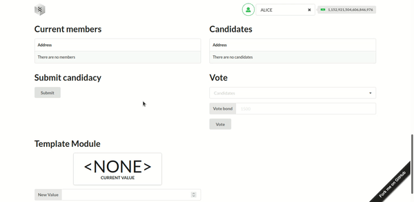

# Introduction

During your studies of the Polkadot protocol, you will come across several pallets that act in different categories such as Consensus, Runtime, Identity, etc. But what exactly is a pallet? We can define a pallet as a blockchain module that is responsible for one aspect of our blockchain. For example, if we want to make elections in our blockchain, we need to install an election pallet!

In this tutorial, **you will learn how to work with a governance pallet, used in Polkadot itself, called Elections Phragmen**. We will build a blockchain that has elections built into the network itself. After this tutorial, you will have a network where you can submit applications and vote for example.

Before we begin, we need to clarify one thing: what is a governance pallet? A governance pallet is a pallet that solves problems related to the governance of a blockchain. For example, the elements of Polkadot like elections, democracy, and the council, are all implemented based on governance pallets.

# Prerequisites

Although **this tutorial has no formal prerequisites**, we recommend that you understand the basics of [what pallets are](https://docs.substrate.io/v3/runtime/frame/#pallets) and how blockchains work. This will give you a better understanding of the tutorial.

Even if you don't have the prerequisites listed, give this tutorial a try anyway. We will do our best to make sure you are not confused by the instructions and understand what is going on.

# Requirements

Make sure you have Node v14+ and yarn installed. You also need to [setup your computer for Substrate development](https://docs.substrate.io/v3/getting-started/installation/).

# Getting started

In this tutorial, we will use the Substrate node template to build our blockchain. This template includes all the necessary structures to work with pallets, so we will add the Phragmen Election pallet to this template.

The first necessary step is to prepare the Substrate node template. To do this, clone the node template repository:

```text
git clone https://github.com/substrate-developer-hub/substrate-node-template
```

After that, go into the node template folder and checkout the latest `branch`:

```text
cd substrate-node-template
git checkout latest
```

Finally, compile the node template (The first compilation can take a while, so grab a cup of coffee):

```text
cargo build --release
```

Along with the node template, we will also use the front-end template that will be our interface for interacting with the blockchain. To install the front-end template:

1 - Clone the front-end template repository. Caution: do not clone into the node template directory, exit the directory before performing this operation.

```text
git clone https://github.com/substrate-developer-hub/substrate-front-end-template
```

2 - Enter the front-end template directory and checkout the latest `branch`:

```text
cd substrate-front-end-template
git checkout latest
```

3 - Install the front-end template dependencies using the following command:

```text
yarn install
```

Now, with both templates installed, let's install the necessary pallets. Once installed, we will go back to the front-end template to make some changes to the interface.

## Add the Elections Phragmen to the node template

Since we want to install the Elections Phragmen pallet, we will also need to install its dependencies i.e. the pallets that are used by the Elections Phragmen pallet:

- pallet-collective: We will use this pallet for the instantiation of a council on our blockchain. Whenever an election is over, the elected accounts will be added to this council. We must use it whenever we work with the pallet-elections-phragmen since it is a dependency of this pallet.
- pallet-balances: This pallet is essential for almost any other pallet and is a dependency for our phragmén election pallet, it is responsible for handling accounts and balances. (**Already installed in the node template**)

To add the Elections Phragmen and Collective pallets, follow these steps:

1 - Enter the root directory of the node template

2 - Open the `runtime/Cargo.toml` configuration file in a text editor

3 - Add the `pallet-elections-phragmen` and `pallet-collective` crates to the dependencies list, so they will be available for the node template runtime.

```text
[dependencies.pallet-collective]
default-features = false
git = 'https://github.com/paritytech/substrate.git'
tag = 'devhub/latest'
version = '4.0.0-dev'

[dependencies.pallet-elections-phragmen]
default-features = false
git = 'https://github.com/paritytech/substrate.git'
tag = 'devhub/latest'
version = '5.0.0-dev'
```

4 - Now add the pallet-elections-phragmen and pallet-collective crates in the std feature set by adding the following lines within the `features` section:

```text
[features]
default = ['std']
std = [
    ...
    'pallet-aura/std',
    'pallet-balances/std',
    'pallet-elections-phragmen/std',
    'pallet-collective/std',
    ...
]
```

If you forget to add the new pallets in the std feature set, you might see errors like the following:

```text
error: cannot find macro `vec` in this scope
  --> /home/kelvin/.cargo/git/checkouts/substrate-7e08433d4c370a21/e6fbbd5/primitives/npos-elections/src/phragmms.rs:52:20
   |
52 |     let mut winners = vec![];
   |                       ^^^
   |
   = note: consider importing one of these items:
           codec::alloc::vec
           crate::sp_std::vec
           scale_info::prelude::vec
           sp_std::vec

    Checking sp-api v4.0.0-dev (https://github.com/paritytech/substrate.git?tag=devhub/latest#e6fbbd5c)
error: could not compile `sp-npos-elections` due to previous error
```

To fix this error, just go back to step 4 and properly add the new pallets in the std feature set.

5 - Finally, we need to check that the dependencies resolve correctly, to do this, use the following command:

```text
cargo check -p node-template-runtime
```

## Implement the Elections Phragmen and Collective config traits

Now we need to implement the `Config` traits of the pallets we have added. All pallets have a trait called `Config`, and from this trait, we customize the pallet the way we want it. The steps mentioned here will be very similar for adding other pallets, what will change are the types of pallets that you will add.

The implementation of a Config trait is based on two blocks: `parameter_types!` and `impl`. The `parameter_types!` block is used for defining constant values and the `impl` block is where the types and values defined by the `Config` trait are set.

Let's start by implementing the Config trait of the Collective pallet:

1 - Open the runtime/src/lib.rs file in a text editor.

2 - Look in the file for the section where the Config trait for the Balances pallet is implemented. The code snippet you are looking for should look something like the following:

```rust
parameter_types! {
	pub const ExistentialDeposit: u128 = 500;
	pub const MaxLocks: u32 = 50;
}

impl pallet_balances::Config for Runtime {
	type MaxLocks = MaxLocks;
	type MaxReserves = ();
	type ReserveIdentifier = [u8; 8];
	/// The type for recording an account's balance.
	type Balance = Balance;
	/// The ubiquitous event type.
	type Event = Event;
	type DustRemoval = ();
	type ExistentialDeposit = ExistentialDeposit;
	type AccountStore = System;
	type WeightInfo = pallet_balances::weights::SubstrateWeight<Runtime>;
}
```

3 - After locating the section, add the following code block after the last line of the Balances pallet code block:

```rust
parameter_types! {
	pub const MaxProposals: u32 = 100;
	pub const MotionDuration: BlockNumber = 28_800;
	pub const CouncilMaxMembers: u32 = 100;
}

impl pallet_collective::Config for Runtime {
	type Event = Event;
	type WeightInfo = ();
	type Origin = Origin;
	type Proposal = Call;
	type MaxProposals = MaxProposals;
	type MotionDuration = MotionDuration;
	type MaxMembers = CouncilMaxMembers;
	type DefaultVote = pallet_collective::PrimeDefaultVote;
}
```

The block of code you just put in is responsible for setting up the Collective pallet. The blockchain will be built from configurations like this, now let's set up the Elections Phragmen pallet:

1 - Import the `LockIdentifier` from `frame_support` in the same file (runtime/src/lib.rs):

```rust
// A few exports that help ease life for downstream crates.
pub use frame_support::{
    ...
	construct_runtime, parameter_types,
	traits::{KeyOwnerProofSystem, Randomness, StorageInfo, LockIdentifier},
	...
};
```

2 - Add the following code block after the last line of the Collective pallet code block that we inserted before:

```rust
parameter_types! {
	pub const PhragmenElectionPalletId: LockIdentifier = *b"phrelect";
	pub const ElectionsPhragmenCandidacyBond: Balance = 1000;
	pub const ElectionsPhragmenVotingBondBase: Balance = 100;
	pub const ElectionsPhragmenVotingBondFactor: Balance = 50;
	pub const ElectionsPhragmenDesiredMembers: u32 = 1;
	pub const ElectionsPhragmenDesiredRunnersUp: u32 = 2;
	pub const ElectionsPhragmenTermDuration: BlockNumber = 2 * MINUTES;
}

impl pallet_elections_phragmen::Config for Runtime {
	type Event = Event;
	type Currency = Balances;
	type PalletId = PhragmenElectionPalletId;
	type ChangeMembers = Collective;
	type InitializeMembers = Collective;
	type CurrencyToVote = frame_support::traits::U128CurrencyToVote;
	type CandidacyBond = ElectionsPhragmenCandidacyBond;
	type VotingBondBase = ElectionsPhragmenVotingBondBase;
	type VotingBondFactor = ElectionsPhragmenVotingBondFactor;
	type LoserCandidate = ();
	type KickedMember = ();
	type DesiredMembers = ElectionsPhragmenDesiredMembers;
	type DesiredRunnersUp = ElectionsPhragmenDesiredRunnersUp;
	type TermDuration = ElectionsPhragmenTermDuration;
	type WeightInfo = ();
}
```

With this block, we have our second pallet set up. Notice the dependency of this pallet on the Balances and Collective pallets in the `impl` block: the `Currency` type is based on the Balances pallet, and the `ChangeMembers` and `InitializeMembers` types depend on the Collective pallet.

After setting up the pallets, we need to add them to the `construct_runtime!` macro:

```rust
construct_runtime!(
    pub enum Runtime where
        Block = Block,
        NodeBlock = opaque::Block,
        UncheckedExtrinsic = UncheckedExtrinsic
    {
        // ...
        // Add these lines
        ElectionsPhragmen: pallet_elections_phragmen,
		    Collective: pallet_collective,
        // ...
    }
);
```

After all that, the last step we need to do is to update the `GenesisConfig` so that our new pallets will have their storage states initialized when we run our blockchain.

1 - To access the `GenesisConfig`, open the node/src/chain_spec.rs file in a text editor.

2 - Import the configs of the new pallets from the node template runtime (You must add these lines in the initial section of the file):

```rust
use node_template_runtime::{ElectionsPhragmenConfig};
use node_template_runtime::{CollectiveConfig};
```

3 - Search for the function `testnet_genesis` and add the following lines:

```rust
/// Configure initial storage state for FRAME modules.
fn testnet_genesis(
	wasm_binary: &[u8],
	initial_authorities: Vec<(AuraId, GrandpaId)>,
	root_key: AccountId,
	endowed_accounts: Vec<AccountId>,
	_enable_println: bool,
) -> GenesisConfig {
	GenesisConfig {
        // ...
        // Add these lines
		collective: CollectiveConfig {
			members: vec![],
			phantom: Default::default(),
		},
		elections_phragmen: ElectionsPhragmenConfig {
			members: vec![],
		},
        // ...
	}
}
```

Finally, we can verify that everything has gone according to plan. To do this, check that the dependencies resolve correctly using the following command:

```text
cargo check -p node-template-runtime
```

During this step, you might see some errors like:

```text
error[E0412]: cannot find type `LockIdentifier` in this scope
     --> /home/kelvin/www/substrate-node-template/runtime/src/lib.rs:277:38
      |
  277 |     pub const PhragmenElectionPalletId: LockIdentifier = *b"phrelect";
      |                                         ^^^^^^^^^^^^^^ not found in this scope
      |
  help: consider importing this type alias
      |
  9   | use frame_support::traits::LockIdentifier;
      |
```

The above error means that you ended up forgetting to import the LockIdentifier in step 1 of the Elections Phragmén pallet configuration.

```text
error[E0412]: cannot find type `Collective` in this scope
     --> /home/kelvin/www/substrate-node-template/runtime/src/lib.rs:291:27
      |
  291 |     type InitializeMembers = Collective;
      |                              ^^^^^^^^^^ not found in this scope

  error[E0277]: the trait bound `Event: From<pallet_collective::Event<Runtime>>` is not satisfied
     --> /home/kelvin/www/substrate-node-template/runtime/src/lib.rs:266:2
      |
  266 |     type Event = Event;
      |     ^^^^^^^^^^^^^^^^^^^ the trait `From<pallet_collective::Event<Runtime>>` is not implemented for `Event`
      |
```

The above error means that you ended up forgetting to add the new pallets to the `construct_runtime!` macro.

If there are no errors, we are ready to compile our blockchain! To perform the compilation, use the following command:

```text
cargo build --release
```

## Start the blockchain

If the compilation occurred correctly, we are ready to start our blockchain, use the following command:

```text
./target/release/node-template --dev
```

This command will run our blockchain in development mode, this means that our blockchain will delete all saved data whenever it is stopped. Using this mode guarantees a clean blockchain every time you use it.

## Start the front-end template

With our blockchain running, we can now also run the front-end template. To do this, simply access the root folder of the front-end template and run the following command:

```text
yarn start
```

This command will compile and run the front-end template that can be accessed from the browser at http://localhost:8000

## Add election component to front-end template

Although we can interact with the Elections Phragmen pallet using the Pallet Interactor front-end template, the user experience is not the best. So **we are going to improve the user experience of the Elections Phragmen pallet by creating a component exclusively for this pallet**.

1 - Go to the root folder of the front-end template and create a new `Election.js` file within the /src directory.

2 - Inside this file, copy and paste the following block of code:

```jsx
import React, { useEffect, useState } from 'react';
import {
  Grid,
  Table,
  Button,
  Message,
  Form,
  Input,
  Dropdown,
} from 'semantic-ui-react';
import { web3FromSource } from '@polkadot/extension-dapp';

import { useSubstrate } from './substrate-lib';

function Main(props) {
  const { api } = useSubstrate();
  const { accountPair } = props;

  const [members, setMembers] = useState(null);
  const [candidates, setCandidates] = useState(null);
  const [candidacyError, setCandidacyError] = useState(null);
  const [candidatesOptions, setCandidatesOptions] = useState([]);
  const [voteError, setVoteError] = useState(null);

  const initFormState = {
    selectedCandidate: '',
    voteBond: '',
  };

  const [formState, setFormState] = useState(initFormState);
  const { selectedCandidate, voteBond } = formState;

  const getFromAcct = async () => {
    const {
      address,
      meta: { source, isInjected },
    } = accountPair;
    let fromAcct;

    // signer is from Polkadot-js browser extension
    if (isInjected) {
      const injected = await web3FromSource(source);
      fromAcct = address;
      api.setSigner(injected.signer);
    } else {
      fromAcct = accountPair;
    }

    return fromAcct;
  };

  const submitCandidacy = async () => {
    const fromAcct = await getFromAcct();

    await api.tx.electionsPhragmen
      .submitCandidacy(...[candidates.length])
      .signAndSend(fromAcct, () => setCandidacyError(false))
      .catch(() => setCandidacyError(true));
  };

  const submitVote = async () => {
    const fromAcct = await getFromAcct();

    await api.tx.electionsPhragmen
      .vote(...[[selectedCandidate], Number(voteBond)])
      .signAndSend(fromAcct, () => setVoteError(false))
      .catch(() => setVoteError(true));
  };

  useEffect(() => {
    async function subscribeToCandidatesQuery() {
      const subscriptionFunction = result => {
        setCandidates([...result]);

        const candidatesList = result.map(candidate => {
          return {
            key: candidate[0].toString(),
            text: candidate[0].toString(),
            value: candidate[0].toString(),
          };
        });
        setCandidatesOptions(candidatesList);
      };

      const candidatesQuery = await api.query.electionsPhragmen.candidates(
        ...[],
        subscriptionFunction,
      );
      return candidatesQuery;
    }

    async function subscribeToMembersQuery() {
      const subscriptionFunction = result => {
        setMembers([...result]);
      };

      const membersQuery = await api.query.electionsPhragmen.members(
        ...[],
        subscriptionFunction,
      );
      return membersQuery;
    }

    subscribeToCandidatesQuery();
    subscribeToMembersQuery();
  }, [api.query.electionsPhragmen]);

  return (
    <>
      <Grid.Row>
        <Grid.Column>
          <h1>Current members</h1>
          <Table celled striped size="small">
            <Table.Body>
              <Table.Row>
                <Table.Cell>
                  <strong>Address</strong>
                </Table.Cell>
              </Table.Row>
              {members != null && members.length !== 0 ? (
                members.map(member => (
                  <Table.Row key={member.who.toString()}>
                    <Table.Cell>{member.who.toString()}</Table.Cell>
                  </Table.Row>
                ))
              ) : (
                <Table.Row>
                  <Table.Cell>There are no members</Table.Cell>
                </Table.Row>
              )}
            </Table.Body>
          </Table>
        </Grid.Column>
        <Grid.Column>
          <h1>Candidates</h1>
          <Table celled striped size="small">
            <Table.Body>
              <Table.Row>
                <Table.Cell>
                  <strong>Address</strong>
                </Table.Cell>
              </Table.Row>
              {candidates != null && candidates.length !== 0 ? (
                candidates.map(candidate => (
                  <Table.Row key={candidate[0].toString()}>
                    <Table.Cell>{candidate[0].toString()}</Table.Cell>
                  </Table.Row>
                ))
              ) : (
                <Table.Row>
                  <Table.Cell>There are no candidates</Table.Cell>
                </Table.Row>
              )}
            </Table.Body>
          </Table>
        </Grid.Column>
      </Grid.Row>
      <Grid.Row>
        <Grid.Column>
          <h1>Submit candidacy</h1>
          <Button onClick={submitCandidacy}>Submit</Button>
          {candidacyError !== null &&
            (candidacyError === false ? (
              <Message info>
                <Message.Header>Candidacy submitted</Message.Header>
                Check the event history to see if the candidacy has been accepted
              </Message>
            ) : (
              <Message negative>
                <Message.Header>Unable to submit application</Message.Header>
              </Message>
            ))}
        </Grid.Column>
        <Grid.Column>
          <h1>Vote</h1>
          {candidates !== null && (
            <Form>
              <Form.Field>
                <Dropdown
                  placeholder="Candidates"
                  fluid
                  label="Candidate"
                  onChange={(e, data) =>
                    setFormState({
                      selectedCandidate: data.value,
                      voteBond: voteBond,
                    })
                  }
                  selection
                  state="selectedCandidate"
                  value={selectedCandidate}
                  options={candidatesOptions}
                />
              </Form.Field>
              <Form.Field>
                <Input
                  placeholder="1500"
                  fluid
                  type="text"
                  label="Vote bond"
                  state="voteBond"
                  value={voteBond}
                  onChange={(e, data) =>
                    setFormState({
                      selectedCandidate: selectedCandidate,
                      voteBond: data.value,
                    })
                  }
                />
              </Form.Field>
              <Form.Field>
                <Button onClick={submitVote}>Vote</Button>
              </Form.Field>
            </Form>
          )}
          {voteError !== null &&
            (voteError ? (
              <Message negative>
                <Message.Header>Unable to submit application</Message.Header>
              </Message>
            ) : (
              <Message info>
                <Message.Header>Vote submitted</Message.Header>
                Check the event history to see if your vote has been accepted
              </Message>
            ))}
        </Grid.Column>
      </Grid.Row>
    </>
  );
}

export default function Election(props) {
  const { api } = useSubstrate();
  return api.tx ? <Main {...props} /> : null;
}
```

Woah there! That's a lot of code! Although it is a lot of code, most of it is made up of the verbosity of the React.js framework. So let's break this code into parts to try to understand what is going on. Our component will render 4 elements. To find them in the code, just look at the code in the return value to see which 4 elements the Election component is rendering.

```jsx
// src/Election.js

return (
    <>
    <Grid.Row>
// ...
```

In the code snippet you have just found, you can find the 4 elements rendered by our component:

- A table of the current members, which are the accounts that won the last election.
- A table of the current candidates, these are the accounts that are running in the current election.
- A section for submitting your candidacy.
- A section for submitting votes.

Well, how do all these elements work? **They all rely on the API found in the front-end template** that automatically detects the pallets of the blockchain and provides all the functions and variables of each pallet. You can find this API at the beginning of the `Main` function and you will notice that it is used in all interactions with the blockchain.

To fetch the data used in the candidate and member tables, we perform queries with the API that automatically return subscription functions for this data. What does this mean? It means that whenever member and candidate data changes, such as at the end of an election, for example, subscriptions will receive these updates, and our data tables will be updated as well. You can see the interaction with these functions in the useEffect block.

Well, the data consumption was explained, but what about an interaction with the Elections Phragmen pallet? The interactions are a bit different, for them, we need to put together the necessary data (collected in the candidacy and voting forms) and then send it in a signed transaction. Take a look at the `submitCandidacy` and `submitVote` functions to better understand how interactions with the Elections Phragmen pallet work.

Ok, after a long explanation about a frighteningly large file, we need to perform the last step: add our election component to the front-end template.

1 - Open the src/App.js file in a text editor

2 - At the beginning of the file, add the import of the `Election` component after the last import:

```jsx
import Upgrade from './Upgrade';

// Add this line
import Election from './Election';
```

3 - Add the `Election` component to the App grid:

```jsx
<Grid.Row>
    <Interactor accountPair={accountPair} />
    <Events />
</Grid.Row>

// Add this line
<Election accountPair={accountPair} />

<Grid.Row>
    <TemplateModule accountPair={accountPair} />
</Grid.Row>
```

Finally, **you are ready to try the Elections Phragmen pallet!** Go ahead and run tests, create a poll, elect members, run for an election, and so on.


The gif below shows some features of the application we developed in this tutorial. See that we use Alice's account to apply for the election and then switch to Bob's account to vote for Alice.



# Conclusion

Congratulations! We have successfully created a blockchain that holds elections. We have added and configured governance pallets to a blockchain and created a unique component for interaction with the Elections Phragmen pallet. You can make improvements to the Election component and also make changes to the Config trait of the pallets (such as the number of members for example).

# About the Author

This tutorial was created by [Kelvin Welter](https://github.com/kelvinwelter).

# References

[Polkadot Sequential Phragmén Method Documentation](https://wiki.polkadot.network/docs/learn-phragmen)
[Elections Phragmen Pallet Documentation](https://docs.substrate.io/rustdocs/latest/pallet_elections_phragmen/index.html)
