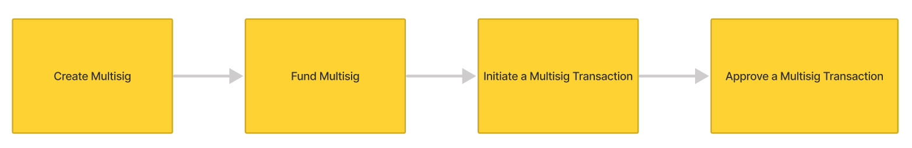
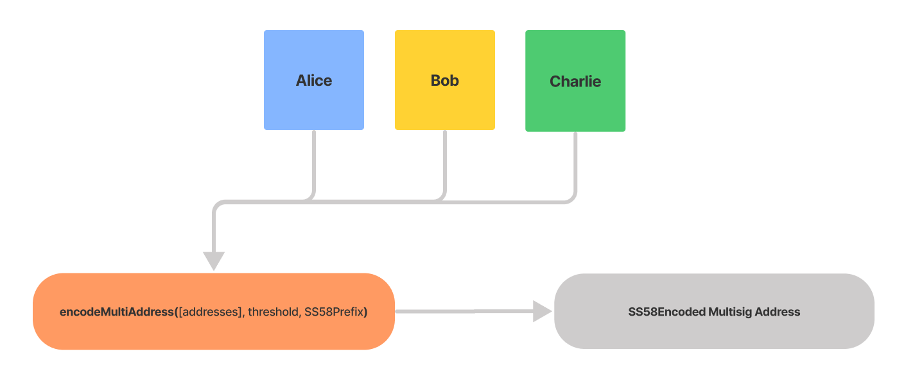
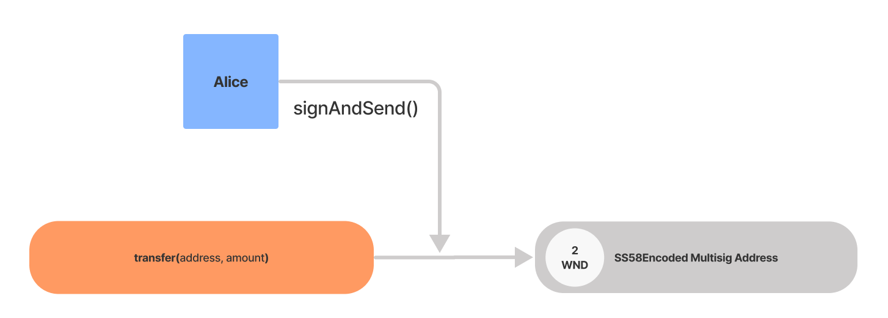
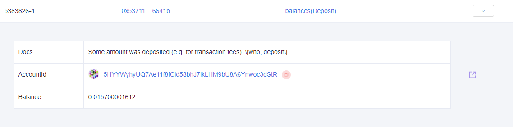
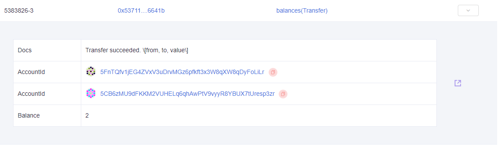
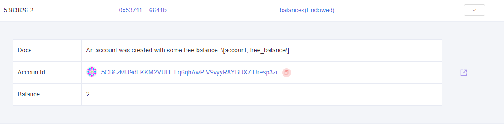
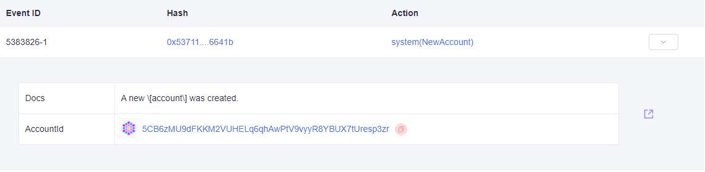
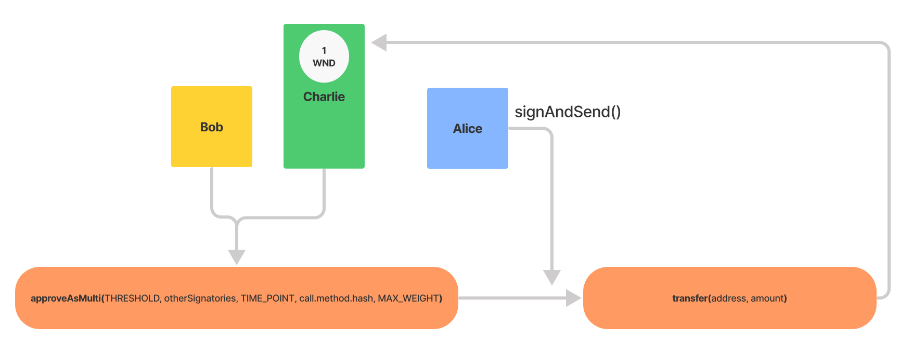
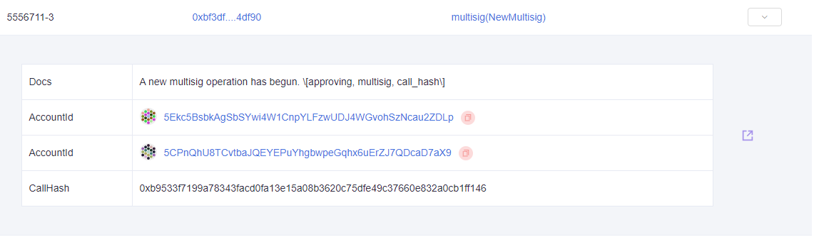
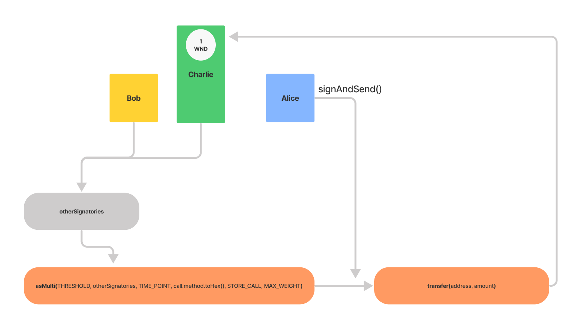

## Introduction

In this tutorial we will cover the process of creating a multisig - an account which shares authority for transactions across multiple addresses. The word "multisig" stands for "multiple signature". For the purposes of this tutorial, we will generate two additional accounts and ensure they are both funded with enough WND to cover the existential deposit and to send a few transactions. These will be used to simulate the other signing parties of the multisig wallet.

We will be building a new commandline application in JavaScript to handle the operations of creating and using this multisig account on Westend, though the same concepts and most of the code still applies to Polkadot or other Substrate based blockchains.

There are many potential applications of this concept, however for this tutorial we are mainly concerned with the added layer of account security. This functionality is at the core of many DAOs and similar governance structures. A multisig account is itself a form of on-chain governance, and a multisig generally requires active participation.

Check out the [Polkadot API documentation](https://polkadot.js.org/docs/substrate) for a summary of all the relevant API metadata.



> From the Polkadot JS API documentation:

> _It is possible to create a multi-signature account in Substrate-based chains. A multi-signature account is composed of one or more addresses and a threshold. The threshold defines how many signatories (participating addresses) need to agree on the submission of an extrinsic in order for the call to be successful._
>
> _For example, Alice, Bob, and Charlie set up a multi-sig with a threshold of 2. This means Alice and Bob can execute any call even if Charlie disagrees with it. Likewise, Charlie and Bob can execute any call without Alice. A threshold is typically a number smaller than the total number of members but can also be equal to it, which means they all have to be in agreement._

also:

> _Multi-signature accounts **cannot be modified after being created**. Changing the set of members or altering the threshold is not possible and instead requires the dissolution of the current multi-sig and creation of a new one. As such, multi-sig account addresses are **deterministic**, i.e. you can always calculate the address of a multi-sig just by knowing the members and the threshold, without the account existing yet. This means one can send tokens to an address that does not exist yet, and if the entities designated as the recipients come together in a new multi-sig under a matching threshold, they will immediately have access to these tokens._

_also:_

> While Westend is meant to replicate the Polkadot mainnet as closely as possible, there are a few notable differences:
>
> - Existential deposit is equal to 0.01 WND (Westies; Westend's native coin) instead of 1 DOT.
> - The multi signature transaction deposit is equal to ~1 WND instead of ~20.2 DOT.

## Setup

It is not a requirement, however completing the Polkadot [Pathway](../polkadot-pathway.md) and the [social recovery](implement-social-recovery-on-polkadot.md) tutorial form a strong basis of understanding which will enhance this tutorial.

The simplest way to satisfy these requirements and maintain flexibility as a Windows 10 user is to install [WSL2](https://docs.microsoft.com/en-us/windows/wsl/install-win10) and [VSCode](https://code.visualstudio.com/download) - the terminal window inside of VSCode can utilize any shell, from bash to PowerShell. Linux and macOS users will have no need of WSL2, and can use any terminal app and text editor of their choosing.

- Node.js installed, preferably with a tool for version management - [nvm](https://github.com/nvm-sh/nvm) or [fnm](https://github.com/Schniz/fnm) are popular choices
- A package manager like [npm](https://npmjs.org) or [yarn](https://yarnpkg.com/) - installation will vary by Operating System

This tutorial has the following two dependencies which must be installed via the package manager :

- [dotenv](https://www.npmjs.com/package/dotenv)
- [@polkadot/api](https://www.npmjs.com/package/@polkadot/api)

## Initialize the project directory

```text
mkdir polkadot_ms
cd polkadot_ms
npm init -y
npm install --save dotenv @polkadot/api
```

When we copy and paste all four of these commands into a terminal, the first three will execute in sequence because they have an invisible carriage return (enter) character at the end of the line. `mkdir polkadot_ms` will create a new sub-directory called `polkadot_ms`, then the `cd` command changes the working directory. `npm init -y` will output the contents of the default `package.json` to the terminal. At this point, the `npm install` portion will be on the commandline, however we must still **press enter** to start the installation process.

Once the installation process is complete, create an `.env` file in the project directory. For convenience, copy and paste the template below. Read more about `dotenv`in our handy [quick-reference guide](../../extra-guides/dotenv-and-.env.md). Also, remember to replace `API_KEY` with a valid DataHub API key from the [Polkadot Services Dashboard](https://datahub.figment.io/services/polkadot).

Paste the following into your `.env` file:

```text
DATAHUB_URL=https://polkadot-westend--rpc.datahub.figment.io/apikey/API_KEY

MULTISIG_ADDRESS=

ALICE_ADDRESS=
ALICE_MNEMONIC=

BOB_ADDRESS=
BOB_MNEMONIC=

CHARLIE_ADDRESS=
CHARLIE_MNEMONIC=
```

## Create 3 accounts

Create a file called `create_account.js` and paste the following code :

```javascript
// create_account.js
const { ApiPromise, Keyring } = require('@polkadot/api');
const { HttpProvider } = require('@polkadot/rpc-provider');
const { mnemonicGenerate } = require('@polkadot/util-crypto');
require('dotenv').config();

const main = async () => {
  const httpProvider = new HttpProvider(process.env.DATAHUB_URL);
  const api = await ApiPromise.create({ provider: httpProvider });
  const keyring = new Keyring({ type: 'sr25519' });

  const mnemonic = mnemonicGenerate();
  const newAccount = await keyring.addFromUri(mnemonic);
  console.log(`address: ${newAccount.address}`);
  console.log(`mnemonic: ${mnemonic}`);
};

main()
  .catch(err => {
    console.error(err);
  })
  .finally(() => process.exit());
```

In a terminal window, run `node create_account.js` 3 (_three_) times in order to generate the data we require. Copy/paste the mnemonics & addresses for each new account into the supplied `.env` template.

- `Alice`: The account which we will use in the multisig wallet.
- `Bob` & `Charlie`: These accounts represent other participants in the multisig.

Fund the Alice account by visiting <https://faucet.figment.io> and entering address we generated for Alice. This will supply enough WND tokens to that account for us to complete the tutorial with lots left over for testing. As we will need to pay the fees for transactions during the tutorial, it will also be necessary to transfer some tokens to the other accounts.

There are three types of actions to be taken with a multi-sig account. Executing a call, approving a call, or cancelling a call.

## Create a Multisig account



Create a file called `create_multisig.js` and paste the following code :

```javascript
const { ApiPromise, Keyring } = require('@polkadot/api');
const { sortAddresses, encodeMultiAddress } = require('@polkadot/util-crypto');
const { HttpProvider } = require('@polkadot/rpc-provider');
require('dotenv').config();

const main = async () => {
  const httpProvider = new HttpProvider(process.env.DATAHUB_URL);
  const api = await ApiPromise.create({ provider: httpProvider });
  const keyring = new Keyring({ type: 'sr25519' });

  // 1. Define relevant constants
  const INDEX = 0;
  const THRESHOLD = 2;
  const SS58PREFIX = 0;
  const AMOUNT_TO_SEND = 1000000000000;

  // 2. Initialize accounts
  const Alice = keyring.addFromUri(process.env.ALICE_MNEMONIC);
  const Bob = keyring.addFromUri(process.env.BOB_MNEMONIC);
  const Charlie = keyring.addFromUri(process.env.CHARLIE_MNEMONIC);
  const addresses = [
    Alice.address, // addresses[0]
    Bob.address, // addresses[1]
    Charlie.address, // addresses[2]
  ];

  // 3. Create Multisig (with optional SS58PREFIX)
  const multisig = encodeMultiAddress(addresses, THRESHOLD);
  console.log(`Multisig Address: ${multisig}\n`);

  // 4. Filter out the sender
  const otherSignatories = addresses.filter(who => who !== addresses[INDEX]);
  const otherSignatoriesSorted = sortAddresses(otherSignatories);
  console.log(
    `Other Signatories: ${JSON.stringify(otherSignatoriesSorted, null, 2)}\n`,
  );

  // 4. Define an array of transactions
  const transactions = [
    api.tx.balances.transfer(Bob.address, AMOUNT_TO_SEND),
    api.tx.balances.transfer(Charlie.address, AMOUNT_TO_SEND),
  ];

  // 5. Batch sending 1 WND to the other addresses
  // This is necessary to be able to sign and send transactions
  // with those accounts.
  const txHash = await api.tx.utility.batch(transactions).signAndSend(Alice);
  console.log(`Sending 1 WND from ${Alice.address} to ${otherSignatories}`);
  console.log(`transfer tx: https://westend.subscan.io/extrinsic/${txHash}`);
};

main()
  .catch(err => {
    console.error(err);
  })
  .finally(() => process.exit());
```

- `SS58PREFIX` is used to encode our address for use on different chains. The `0` value will encode our multisig address for the Polkadot relay chain, therefore the encoded address will begin with the number `1` . The Parity team maintains a [registry of the SS58 types](https://github.com/paritytech/substrate/blob/master/ss58-registry.json), which might come in handy when working with various para-chains.

- `INDEX` will be used to refer to the index of our address within an array of addresses. More information on[ zero-indexed arrays](https://medium.com/swlh/zero-indexed-arrays-f752a47abf65), for the curious.

- `THRESHOLD` specifies the number of accounts required to approve a transaction from the Multisig. It is possible to set the threshold to the same number of total addresses, which would mean that no transactions could be sent from that multisig without full approval, however in this example we will set it to require 2 of 3 signatures.

- `otherSignatories` illustrates the use of `filter()` to remove the address at the specified index. Before we display the filtered list of addresses, the `sortAddresses()` function will sort it by public key. Logging this via `JSON.stringify()` will display it in a more readable format in the terminal.

- `encodeMultiAddress()` is part of the takes the array of addresses, `THRESHOLD` & optionally the`SS58PREFIX` and returns the deterministic address of the multisig. If the SS58 prefix is included, the address will be encoded for the specified chain.

Run the code with `node create_multisig.js` :

```text
Multisig Address: 5CPnQhU8TCvtbaJQEYEPuYhgbwpeGqhx6uErZJ7QDcaD7aX9

Other Signatories: [
  "5GL63QD2HhXvBMcP9skdjq8H5Znhe7Fke83aWENHPGRMvJSA",
  "5GpDZiUMpdX2GcGJzAZVX36kSGoScraCLEjTTgvhufEokRCX"
]

Sending 1 WND from 5Ekc5BsbkAgSbSYwi4W1CnpYLFzwUDJ4WGvohSzNcau2ZDLp
to 5GL63QD2HhXvBMcP9skdjq8H5Znhe7Fke83aWENHPGRMvJSA, 5GpDZiUMpdX2GcGJzAZVX36kSGoScraCLEjTTgvhufEokRCX
transfer tx: https://westend.subscan.io/extrinsic/...
```

> Remember to copy and paste the resulting value for Multisig Address into `.env` as `MULTISIG_ADDRESS` in preparation for the next step!

## Fund a Multisig account



Funding the multisig wallet is an important step in this tutorial process, so that it will have enough available balance to cover the existential deposit, and an available balance for sending further transactions.

Create a file called `fund_multisig.js` and paste the following code :

```javascript
const { ApiPromise, Keyring } = require('@polkadot/api');
const { HttpProvider } = require('@polkadot/rpc-provider');
const { formatBalance } = require('@polkadot/util/format');
require('dotenv').config();

const main = async () => {
  const httpProvider = new HttpProvider(process.env.DATAHUB_URL);
  const api = await ApiPromise.create({ provider: httpProvider });
  const keyring = new Keyring({ type: 'sr25519' });

  // 1. Define relevant constants
  formatBalance.setDefaults({
    unit: 'WND',
    decimals: 12,
  });

  // 2. Define relevant constants
  const MULTISIG = process.env.MULTISIG_ADDRESS;
  const AMOUNT_TO_SEND = 2000000000000;
  const displayAmount = formatBalance(AMOUNT_TO_SEND); // 2.0000 WND

  // 3. Initialize account
  const Alice = keyring.addFromUri(process.env.ALICE_MNEMONIC);

  // 4. Send 2 WND to multisig account
  const txHash = await api.tx.balances
    .transfer(MULTISIG, AMOUNT_TO_SEND)
    .signAndSend(Alice);
  console.log(`Sending ${displayAmount} from ${Alice.address} to ${MULTISIG}`);
  console.log(`transfer tx: https://westend.subscan.io/extrinsic/${txHash}`);
};

main()
  .catch(err => {
    console.error(err);
  })
  .finally(() => process.exit());
```

The function `formatBalance.setDefaults()` enables us to specify a unit name and decimals. Since we are operating on the Westend testnet, WND is appropriate. As we can see, `AMOUNT_TO_SEND` will be specified as a big number - 2 trillion pWND \*\*\*\*(**p** for **pico**, denoting a factor of , in this case) - though we can display it in a readable and preformatted way using `formatBalance()` . It can be useful to visualize `amountToSend` at twelve decimal places like this :

```javascript
// 2,000,000,000,000 = 2.0 WND
```

To complete the action of funding the specified multisig account, paying from the available balance of `Alice`, we use `api.tx.balances` to access the`transfer()` method and then `signAndSend()` . This will accomplish the creation of the the multisig account (providing the existential deposit) while transferring 2 WND to it.

Run the code with `node fund_multisig.js` :

```text
Sending 2.0000 WND
from 5Ekc5BsbkAgSbSYwi4W1CnpYLFzwUDJ4WGvohSzNcau2ZDLp
to 5CPnQhU8TCvtbaJQEYEPuYhgbwpeGqhx6uErZJ7QDcaD7aX9
transfer tx: https://westend.subscan.io/extrinsic/...
```

The [SubScan](https://westend.subscan.io/) page will include these 4 events. Refer to the following examples of successful events.









## Execute a Multisig transfer



Create a file called `transfer_multisig.js` and paste the following code :

```javascript
const { ApiPromise, Keyring } = require('@polkadot/api');
const { HttpProvider } = require('@polkadot/rpc-provider');
const { formatBalance } = require('@polkadot/util/format');
require('dotenv').config();

const main = async () => {
  const httpProvider = new HttpProvider(process.env.DATAHUB_URL);
  const api = await ApiPromise.create({ provider: httpProvider });
  const keyring = new Keyring({ type: 'sr25519' });

  // 1. Use formatBalance to display amounts
  formatBalance.setDefaults({
    unit: 'WND',
    decimals: 12,
  });

  // 2. Define relevant constants
  const THRESHOLD = 2;
  const MAX_WEIGHT = 640000000;
  const AMOUNT_TO_SEND = 1000000000000;
  const MULTISIG = process.env.MULTISIG_ADDRESS;
  const displayAmount = formatBalance(AMOUNT_TO_SEND);
  const depositBase = api.consts.multisig.depositBase;
  const depositFactor = api.consts.multisig.depositFactor;

  // 3. Initialize accounts
  const Alice = keyring.addFromUri(process.env.ALICE_MNEMONIC);
  const Bob = keyring.addFromUri(process.env.BOB_MNEMONIC);
  const Charlie = keyring.addFromUri(process.env.CHARLIE_MNEMONIC);
  const otherSignatories = [Bob.address, Charlie.address].sort();

  // 4. API calls - info is necessary for the timepoint
  const call = api.tx.balances.transfer(Charlie.address, AMOUNT_TO_SEND);
  const info = await api.query.multisig.multisigs(MULTISIG, call.method.hash);

  // 5. Set the timepoint
  // If this IS the first approval, then this must be None (null)
  const TIME_POINT = null;
  // If this is NOT the first approval, then it must be Some,
  // with the timepoint (block number and transaction index)
  // of the first approval transaction :
  // const TIME_POINT = info.unwrap().when;

  // 6. approveAsMulti
  const txHash = await api.tx.multisig
    .approveAsMulti(
      THRESHOLD,
      otherSignatories,
      TIME_POINT,
      call.method.hash,
      MAX_WEIGHT,
    )
    .signAndSend(Alice);
  console.log(`depositBase   : ${depositBase}`);
  console.log(`depositFactor : ${depositFactor}`);
  console.log(`Sending ${displayAmount} from ${Alice.address} to ${MULTISIG}`);
  console.log(
    `Required values  : approveAsMulti(THRESHOLD, otherSignatories, TIME_POINT, call.method.hash, MAX_WEIGHT)`,
  );
  console.log(
    `Submitted values : approveAsMulti(${THRESHOLD}, otherSignatories: ${JSON.stringify(
      otherSignatories,
      null,
      2,
    )}, ${TIME_POINT}, ${call.method.hash}, ${MAX_WEIGHT})\n`,
  );
  console.log(
    `approveAsMulti tx: https://westend.subscan.io/extrinsic/${txHash}`,
  );
};

main()
  .catch(err => {
    console.error(err);
  })
  .finally(() => process.exit());
```

- `THRESHOLD` and `otherSignatories` should be familiar, `TIME_POINT` must be `null` if this is the first approval for the multisig. `call.method.hash` does what it says, returning a hashed representation of the method data of the transfer.

- `MAX_WEIGHT` refers to the maximum weight of the call, although this is not clearly stated in the API documentation, it has to do with fee calculation. Weight is a fixed number designed to manage block validation times. It can be supplemented with an optional tip. Read more about Polkadot transaction fees [here](https://wiki.polkadot.network/docs/en/learn-transaction-fees).

Run the code with `node transfer_multisig.js` :

```text
depositBase   : 1.0044 WND
depositFactor : 1.6000 mWND
Sending 1.0000 WND
 from 5Ekc5BsbkAgSbSYwi4W1CnpYLFzwUDJ4WGvohSzNcau2ZDLp
 to 5CPnQhU8TCvtbaJQEYEPuYhgbwpeGqhx6uErZJ7QDcaD7aX9
Required values  : approveAsMulti(THRESHOLD, otherSignatories, TIME_POINT, call.method.hash, MAX_WEIGHT)
Submitted values : approveAsMulti(2, otherSignatories: [
  "5GL63QD2HhXvBMcP9skdjq8H5Znhe7Fke83aWENHPGRMvJSA",
  "5GpDZiUMpdX2GcGJzAZVX36kSGoScraCLEjTTgvhufEokRCX"
], null, 0xb9533f7199a78343facd0fa13e15a08b3620c75dfe49c37660e832a0cb1ff146, 640000000)

approveAsMulti tx: https://westend.subscan.io/extrinsic/...
```



## Approve a Multisig transfer



Create a new file called `approve_multisig.js` and paste the following code :

```javascript
const { ApiPromise, Keyring } = require('@polkadot/api');
const { HttpProvider } = require('@polkadot/rpc-provider');
const { formatBalance } = require('@polkadot/util/format');
require('dotenv').config();

const main = async () => {
  const httpProvider = new HttpProvider(process.env.DATAHUB_URL);
  const api = await ApiPromise.create({ provider: httpProvider });
  const keyring = new Keyring({ type: 'sr25519' });

  // 1. Use formatBalance to display amounts
  formatBalance.setDefaults({
    unit: 'WND',
    decimals: 12,
  });

  // 2. Set relevant constants
  const THRESHOLD = 2;
  const STORE_CALL = false;
  const MAX_WEIGHT = 640000000;
  const AMOUNT_TO_SEND = 1000000000000;
  const MULTISIG = process.env.MULTISIG_ADDRESS;
  const displayAmount = formatBalance(AMOUNT_TO_SEND);

  // 3. Initialize accounts
  const Alice = keyring.addFromUri(process.env.ALICE_MNEMONIC);
  const Bob = keyring.addFromUri(process.env.BOB_MNEMONIC);
  const Charlie = keyring.addFromUri(process.env.CHARLIE_MNEMONIC);
  const otherSignatories = [Alice.address, Charlie.address].sort();

  // 4. Send 1 WND to Charlie account
  const call = api.tx.balances.transfer(Charlie.address, AMOUNT_TO_SEND);

  // 5. Retrieve and unwrap the timepoint
  const info = await api.query.multisig.multisigs(MULTISIG, call.method.hash);
  const TIME_POINT = info.unwrap().when;
  console.log(`Time point is: ${TIME_POINT}`);

  // 6. Send asMulti transaction
  // Now the multisig call that was initiated by the Alice account
  // to send 1 WND to Charlie can be approved by Bob.
  // Since threshold is set to 2, this approval should dispatch the call
  // (2 approvals received)
  const txHash = await api.tx.multisig
    .asMulti(
      THRESHOLD,
      otherSignatories,
      TIME_POINT,
      call.method.toHex(),
      STORE_CALL,
      MAX_WEIGHT,
    )
    .signAndSend(Bob);
  console.log(
    `Sending ${displayAmount} from ${MULTISIG} to ${Charlie.address}`,
  );
  console.log(
    `Required values  : asMulti(THRESHOLD, otherSignatories, TIME_POINT, call.method.hash, MAX_WEIGHT)`,
  );
  console.log(
    `Submitted values : asMulti(${THRESHOLD}, otherSignatories: ${JSON.stringify(
      otherSignatories,
      null,
      2,
    )}, ${TIME_POINT}, ${call.method.hash}, ${MAX_WEIGHT})\n`,
  );
  console.log(`asMulti tx: https://westend.subscan.io/extrinsic/${txHash}`);
};

main()
  .catch(err => {
    console.error(err);
  })
  .finally(() => process.exit());
```

`call.method.toHex()` differs from `call.method.hash` in that `toHex()` is only going to pass along a hexadecimal representation of the method, but not the full method hash.

If we encounter `Error: Option: unwrapping a None value` it means that the `unwrap()` call on the API query encountered a None value when it was expecting Some value (a valid timepoint). This would most likely be due to the `api.query.multisig.multisigs()` not having an associated timepoint - indicating the absence of any `approveAsMulti()` calls. In essence, there is no data upon which to act in this case - possibly because of trying to run `approve_multisig.js` before `transfer_multisig.js`.

Run the code with `node approve_multisig.js` :

```text
Time point is: {"height":5556711,"index":2}
Sending 1.0000 WND
from 5CPnQhU8TCvtbaJQEYEPuYhgbwpeGqhx6uErZJ7QDcaD7aX9
to 5GpDZiUMpdX2GcGJzAZVX36kSGoScraCLEjTTgvhufEokRCX
asMulti tx: https://westend.subscan.io/extrinsic/...
```

## Cancel a multisig transfer

Create a new file called `cancel_multisig.js` and paste the following code :

```javascript
const { ApiPromise, Keyring } = require('@polkadot/api');
const { HttpProvider } = require('@polkadot/rpc-provider');
const { formatBalance } = require('@polkadot/util/format');
require('dotenv').config();

const main = async () => {
  const httpProvider = new HttpProvider(process.env.DATAHUB_URL);
  const api = await ApiPromise.create({ provider: httpProvider });
  const keyring = new Keyring({ type: 'sr25519' });

  // 1. Use formatBalance to display amounts
  formatBalance.setDefaults({
    unit: 'WND',
    decimals: 12,
  });

  // 2. Set relevant constants
  const THRESHOLD = 2;
  const STORE_CALL = false;
  const MAX_WEIGHT = 640000000;
  const AMOUNT_TO_SEND = 1000000000000;
  const MULTISIG = process.env.MULTISIG_ADDRESS;
  const displayAmount = formatBalance(AMOUNT_TO_SEND);

  // 3. Initialize accounts
  const Alice = keyring.addFromUri(process.env.ALICE_MNEMONIC);
  const Bob = keyring.addFromUri(process.env.BOB_MNEMONIC);
  const Charlie = keyring.addFromUri(process.env.CHARLIE_MNEMONIC);
  const otherSignatories = [Alice.address, Charlie.address].sort();

  // 4. Send 1 WND to Charlie account
  // This is the multisig transaction we want to cancel
  const call = api.tx.balances.transfer(Charlie.address, AMOUNT_TO_SEND);

  // 5. Retrieve and unwrap the timepoint
  const info = await api.query.multisig.multisigs(MULTISIG, call.method.hash);
  const TIME_POINT = info.unwrap().when;
  console.log(`Time point is: ${TIME_POINT}`);

  // 6. Cancel asMulti transaction
  const txHash = await api.tx.multisig
    .cancelAsMulti(THRESHOLD, otherSignatories, TIME_POINT, call.method.hash)
    .signAndSend(Bob);
  console.log(
    `Sending ${displayAmount} from ${MULTISIG} to ${Charlie.address}`,
  );
  console.log(
    `Required values  : cancelAsMulti(THRESHOLD, otherSignatories, TIME_POINT, call.method.hash)`,
  );
  console.log(
    `Submitted values : cancelAsMulti(${THRESHOLD}, otherSignatories: ${JSON.stringify(
      otherSignatories,
      null,
      2,
    )}, ${TIME_POINT}, ${call.method.hash})\n`,
  );
  console.log(
    `cancelAsMulti tx: https://westend.subscan.io/extrinsic/${txHash}`,
  );
};

main()
  .catch(err => {
    console.error(err);
  })
  .finally(() => process.exit());
```

It is not necessary to run this code in the normal course of the tutorial, it is largely included here for the sake of completeness. This would useful in case a multisig approval transaction gets stuck or needs to be cancelled for any reason. Should it be necessary, or for testing purposes, run the code with `node cancel_multisig.js` :

```text
Time point is: {"height":5557129,"index":2}
Sending 1.0000 WND
from 5CPnQhU8TCvtbaJQEYEPuYhgbwpeGqhx6uErZJ7QDcaD7aX9
to 5GpDZiUMpdX2GcGJzAZVX36kSGoScraCLEjTTgvhufEokRCX
Required values  : cancelAsMulti(THRESHOLD, otherSignatories, TIME_POINT, call.method.hash)
Submitted values : cancelAsMulti(2, otherSignatories: [
  "5GL63QD2HhXvBMcP9skdjq8H5Znhe7Fke83aWENHPGRMvJSA",
  "5GpDZiUMpdX2GcGJzAZVX36kSGoScraCLEjTTgvhufEokRCX"
], {"height":5557129,"index":2}, 0xb9533f7199a78343facd0fa13e15a08b3620c75dfe49c37660e832a0cb1ff146)

cancelAsMulti tx: https://westend.subscan.io/extrinsic/0x774822d10f1159f12491bf9351a7b043100ccac88f5ed2c34ab1eac07fe190fe
```

## Conclusion

Congratulations! This tutorial has covered the creation and usage of a multisig account using the Polkadot JS API. We are now able to initiate, approve and cancel transactions using an account that requires multiple authorizations. This functionality enables many other amazing things to be built on Polkadot, and we all look forward to seeing what you build using multisig accounts.
