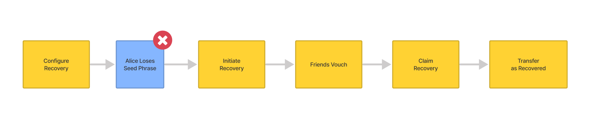
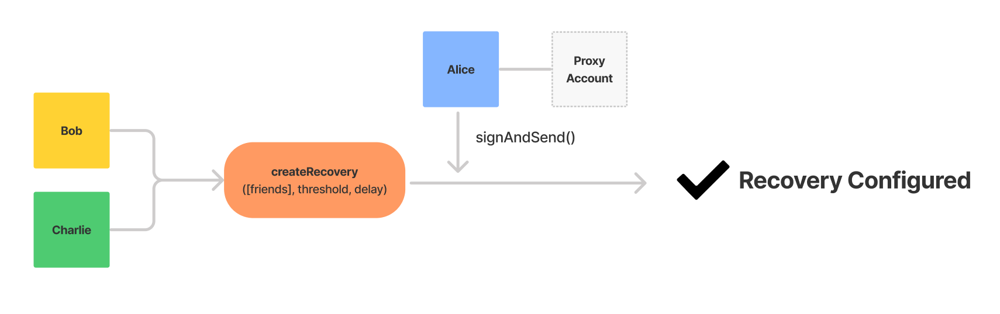
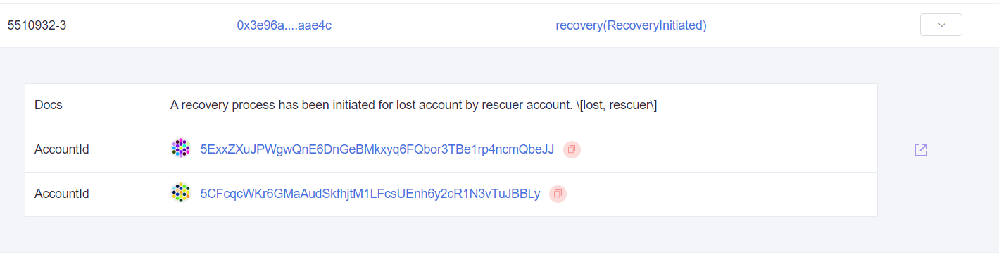
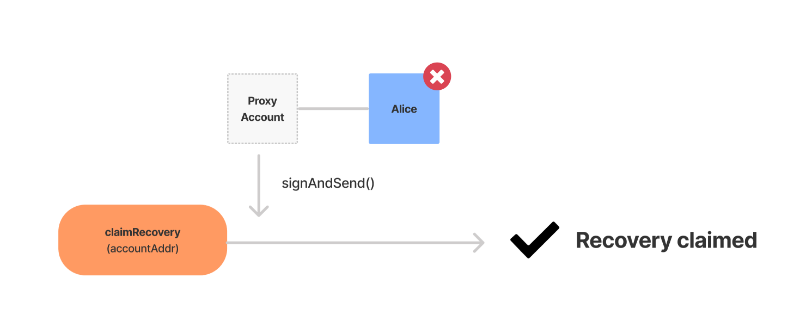
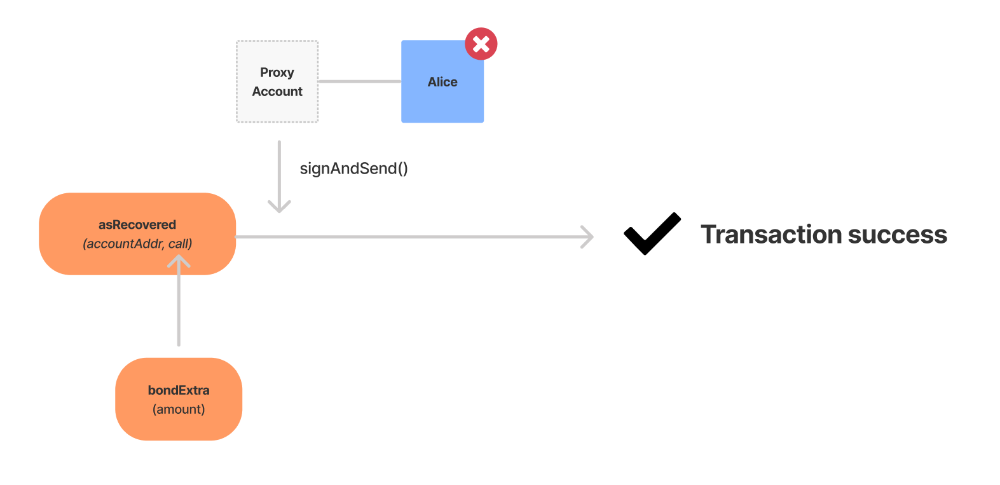

# Introduction

In this tutorial we will cover how to set up and utilize social recovery for a Polkadot proxy account. This tutorial assumes the reader has a working knowledge of JavaScript and Node JS. Although not necessary, it would help to have gone through the Polkadot Pathway which introduces the Polkadot JS API.

Social recovery does not replace a lost private key or seed phrase (it is always important to safeguard those). This feature will only allow the account owner to submit transactions on behalf of the lost account for which the private key and seed phrase is unavailable - possibly due to loss, or even a temporary inability to access the account.

Because this is a means by which access to your funds could become compromised, it is extremely important to pick your social recovery contacts appropriately.

- Make sure that anyone you select as a social recovery contact is _trustworthy_ and likely to _be available_ in case you need their assistance in regaining access to a lost account.
- Be clear in defining the expectation that when you ask them to initiate the vouch transaction, they are able to perform this task in a reasonable amount of time, as well as communicate back when they have.
- Social recovery contacts should always be treated respectfully, as they ultimately decide our ability to access the account in the event we need to use this functionality.
- Social recovery contacts should not know each other **_or_** know how many total people form the recovery list to avoid any risk of collusion - At a minimum, anyone on the list needs to know what their role is and how to perform it when called upon.

For the purposes of this tutorial, we will assume the role of all involved parties as a means of demonstrating the relevant code. It is up to developers to transfer this knowledge to a production environment in a responsible manner, keeping best practices and end-user security in mind.

> Throughout this tutorial, when `...` appears in an output block, it indicates that the text has been trimmed for readability. Also, the terminal output from running the code locally will differ slightly from the examples, so do not be overly concerned if they do not match.

# Setup

Performing these setup steps for the purposes of following the tutorial should not be construed as the only way to implement social recovery. This is solely intended to enable readers to reach a minimum viable product, touching on all the relevant transaction types. This tutorial has two dependencies :

- [dotenv](https://www.npmjs.com/package/dotenv)
- [@polkadot/api](https://www.npmjs.com/package/@polkadot/api)

When we copy and paste all four of these commands into a terminal, the first three will execute in sequence. `npm init -y` will output the contents of the default `package.json` to the terminal. `npm install` will be on the commandline, however we must still **press enter** to start the installation process.

```text
mkdir polkadot_sr
cd polkadot_sr
npm init -y
npm install --save dotenv @polkadot/api
```

Once the installation process is complete, Create an `.env` file in the working directory\
(`/polkadot_sr`). For convenience, copy and paste the template below. Read more about `dotenv`in our handy [quick-reference guide](../../extra-guides/dotenv-and-.env.md). Also, remember to replace `API_KEY` with a valid DataHub API key from the [Polkadot Services Dashboard](https://datahub.figment.io/services/polkadot).

```text
DATAHUB_URL=http://polkadot-westend--rpc.datahub.figment.io/apikey/API_KEY

ALICE_ADDRESS=
ALICE_MNEMONIC=

PROXY_ADDRESS=
PROXY_MNEMONIC=

BOB_ADDRESS=
BOB_MNEMONIC=

CHARLIE_ADDRESS=
CHARLIE_MNEMONIC=
```

## Create 4 accounts

Create a file called `create_account.js` and paste the following code :

```javascript
const { ApiPromise, Keyring } = require('@polkadot/api');
const { HttpProvider } = require('@polkadot/rpc-provider');
const { mnemonicGenerate } = require('@polkadot/util-crypto');
require('dotenv').config();

const main = async () => {
  const httpProvider = new HttpProvider(process.env.DATAHUB_URL);
  const api = await ApiPromise.create({ provider: httpProvider });
  const keyring = new Keyring({ type: 'sr25519' });

  const mnemonic = mnemonicGenerate();
  const newAccount = await keyring.addFromUri(mnemonic);
  console.log(`Address: ${newAccount.address}`);
  console.log(`Mnemonic: ${mnemonic}`);
};

main()
  .catch(err => {
    console.error(err);
  })
  .finally(() => process.exit());
```

In a terminal window, run `node create_account.js` 4 (_four_) times in order to generate the data we require. Copy/paste the mnemonics & addresses for each new account into the supplied `.env` template.

- `Alice`: The account which we will "lose" access to.
- `AliceProxy`: Used to make transactions on behalf of the "lost" Alice account.
- `Bob` & `Charlie`: These accounts represent individuals who will vouch for our ownership of the Alice account.

Get Alice some funding to afford the deposit fees by going to <https://faucet.figment.io> and entering the first address we generated. As we will need to pay for transactions during the tutorial, it will also be necessary to transfer some tokens to the other accounts. This will be covered as we proceed.



# Add a proxy account for Alice

Create a file called `create_proxy.js` and paste the following code :

```javascript
const { ApiPromise, Keyring } = require('@polkadot/api');
const { HttpProvider } = require('@polkadot/rpc-provider');
const { formatBalance } = require('@polkadot/util/format');
require('dotenv').config();

const main = async () => {
  const httpProvider = new HttpProvider(process.env.DATAHUB_URL);
  const api = await ApiPromise.create({ provider: httpProvider });
  const keyring = new Keyring({ type: 'sr25519' });

  // 1. Use formatBalance() to make amounts readable
  formatBalance.setDefaults({
    unit: 'WND',
    decimals: 12,
  });

  // 2. Define relevant constants
  const DELAY_PERIOD = 0;
  const PROXY_TYPE = 'Staking';
  const AMOUNT_TO_SEND = 5200000000000; // 5.2000 WND
  const DEPOSIT_BASE = api.consts.proxy.proxyDepositBase.toString(); // 1,000,400,000,000 = 1.00040 WND
  const DEPOSIT_FACTOR = api.consts.proxy.proxyDepositFactor.toString(); //     1,650,000,000 = 0.00165 WND
  const CHECKSUM = parseInt(DEPOSIT_BASE) + parseInt(DEPOSIT_FACTOR); // 1,002,050,000,000 = 1.00200 WND

  // 3. Initialize accounts
  const Alice = keyring.addFromUri(process.env.ALICE_MNEMONIC);
  const AliceProxy = keyring.addFromUri(process.env.PROXY_MNEMONIC);

  // 4. Send 1 WND to new staking proxy
  const txTransferHash = await api.tx.balances
    .transfer(AliceProxy.address, AMOUNT_TO_SEND)
    .signAndSend(Alice, { tip: 10000000000 });
  console.log(`Required values  : .transfer(destination, amount)`);
  console.log(
    `Submitted values : .transfer(${AliceProxy.address}, ${formatBalance(
      AMOUNT_TO_SEND,
    )})`,
  ); // 1.0000 WND
  console.log(
    `transfer() tx: https://westend.subscan.io/extrinsic/${txTransferHash}`,
  );

  // 5. Create a new staking proxy
  const txAddHash = await api.tx.proxy
    .addProxy(AliceProxy.address, PROXY_TYPE, DELAY_PERIOD)
    .signAndSend(Alice, { tip: 10000000000 });
  console.log(
    `\nproxyDepositBase \+ ( proxyDepositFactor * number of proxies )\n : ${formatBalance(
      DEPOSIT_BASE,
    )} \+ ${formatBalance(DEPOSIT_FACTOR)} \= ${formatBalance(
      parseInt(DEPOSIT_BASE) + parseInt(DEPOSIT_FACTOR),
    )}\n`,
  );
  console.log(`Required values  : .addProxy(address, type, delay)`);
  console.log(
    `Submitted values : .addProxy(${AliceProxy.address}, ${PROXY_TYPE}, ${DELAY_PERIOD})`,
  );
  console.log(
    `addProxy() tx: https://westend.subscan.io/extrinsic/${txAddHash}\n`,
  );
};

main()
  .catch(err => {
    console.error(err);
  })
  .finally(() => process.exit());
```

- `DELAY` is the announcement period required of the initial proxy request. This will generally be zero.

- `PROXY_TYPE` will be **Staking**, as the other types of proxy are not sufficient or our purposes. Learn more about the account structure and the various proxy types on the [Polkadot Wiki](https://wiki.polkadot.network/docs/en/learn-accounts).

- `AMOUNT_TO_SEND` is equal to the full 12 decimal number representing the amount.

- `addProxy()` requires a deposit in the native currency (i.e. WND or DOT), to pay for the necessary storage space on-chain. `api.consts.proxy.proxyDepositBase` is the base amount of currency that must be reserved when creating a proxy list. For every additional proxy added to the list, an amount defined by the `api.consts.proxy.proxyDepositFactor` is reserved as well.

- `transfer()` takes a destination address and an amount - we are sending enough WND to the proxy account so that it can afford the deposit to initiate the recovery attempt. We add a `tip` to the validator when sending multiple non-batched transactions. This is to avoid one of them being assigned a priority too low to be executed.

Run the code with `node create_proxy.js`. The expected output will look similar to this example :

```text
Required values  : .transfer(destination, amount)
Submitted values : .transfer(5FsyYpFCETZpmexY3FZuD5oxK3viQwcDenHa5hiHsVyaqvYA, 2.0000 WND)
transfer() tx: https://westend.subscan.io/extrinsic/...

proxyDepositBase + proxyDepositFactor = 1.0004 WND + 1.6500 mWND = 1.0020 WND

Required values  : .addProxy(address, type, delay)
Submitted values : .addProxy(5FsyYpFCETZpmexY3FZuD5oxK3viQwcDenHa5hiHsVyaqvYA, Staking, 0)
addProxy() tx: https://westend.subscan.io/extrinsic/...
```

> **About amounts** :
>
> Observant readers will notice that the deposit factor displays as `1.6500 mWND` - this is because `formatBalance()` automatically adds an amount qualifier and truncates the display to four decimal places. mWND stands for micro-WND at 10 decimal places, whereas the smallest unit of a WND token would be a pWND or pico-WND, at 12 decimal places.

```javascript
formatBalance.setDefaults({
  unit: 'WND',
  decimals: 12,
});
```

The `formatBalance.setDefaults()` call specifies the symbol for each unit of currency and a number of supported decimals. We can see that supplying an `AMOUNT_TO_SEND` to a transfer function works fine, but displaying that number to users, or asking users to enter amounts with twelve extra digits would be a hot mess. This is why `formatBalance()` exists. Visualize the twelve decimal places like so :

```javascript
// 1,000,400,000,000 = 1.00040 WND
//     1,650,000,000 = 0.00165 WND
// 1,002,050,000,000 = 1.00200 WND
// 5,000,000,000,000 = 5.00000 WND
//             1,337 = 0.0000000001337 WND (1337 pWND)
```

# Fund Bob & Charlie

Create a file called `fund_friends.js` and paste the following code :

```javascript
const { ApiPromise, Keyring } = require('@polkadot/api');
const { HttpProvider } = require('@polkadot/rpc-provider');
const { formatBalance } = require('@polkadot/util/format');
require('dotenv').config();

const main = async () => {
  const httpProvider = new HttpProvider(process.env.DATAHUB_URL);
  const api = await ApiPromise.create({ provider: httpProvider });
  const keyring = new Keyring({ type: 'sr25519' });

  // 1. Use formatBalance to make the amount readable
  formatBalance.setDefaults({
    unit: 'WND',
    decimals: 12,
  });

  // 2. Define relevant constants
  const AMOUNT_TO_SEND = 500000000000;
  const displayAmount = formatBalance(AMOUNT_TO_SEND); // 0.5000 WND

  // 3. Initialize accounts
  const Alice = keyring.addFromUri(process.env.ALICE_MNEMONIC);
  const Bob = keyring.addFromUri(process.env.BOB_MNEMONIC);
  const Charlie = keyring.addFromUri(process.env.CHARLIE_MNEMONIC);

  // 4. Define an array of transactions
  const transactions = [
    api.tx.balances.transfer(Bob.address, AMOUNT_TO_SEND),
    api.tx.balances.transfer(Charlie.address, AMOUNT_TO_SEND),
  ];

  // 5. Send batch transaction
  const txHash = await api.tx.utility.batch(transactions).signAndSend(Alice);
  console.log(
    `Sending ${displayAmount} to ${Bob.address} & ${Charlie.address}`,
  );
  console.log(`Required values  : .batch([transactions])`);
  console.log(
    `Submitted values : .batch(${JSON.stringify(transactions, null, 2)})`,
  );
  console.log(`batch() tx: https://westend.subscan.io/extrinsic/${txHash}`);
};

main()
  .catch(err => {
    console.error(err);
  })
  .finally(() => process.exit());
```

This is an example of how simple it is to batch transactions with PolkadotJS. All we have done here is define an array of transfers, which will then be automatically processed, signed and sent to the network with just a couple of method calls. Go ahead and run the code in the terminal with `node fund_friends.js` . The output will be similar to this example (some removed for display) :

```text
Required values  : .batch([transactions])
Submitted values : .batch([
  "0xac040400004c5f5c983eaa1a5ce7cf4462b4f527f69c3b9cb284e2ae941d1b8b3a85a...",
  "0xac04040000ee43c4203c16f4f9f2577a7fb85136788c9aefd0f0666d678078d784c86..."
])
Sending 500.0000 mWND to 5DnqpngDQQ4pNpHgmGyhyzrpCaXawGHRiHRoPvdigLpHSQ8K &
5HT7PFajmKLC7RvLHKNBicuf9xYhMH6tpUzbJDi5EMYFRhQs
batch() tx: https://westend.subscan.io/extrinsic/...
```

The submitted values are the hashed data for the transfer functions we set in the `transactions` array, which will be processed by the `batch()` function. Check the link to SubScan, to view the successful transaction.


At this point, we are set up and should have a funded main account with a reserved balance of just over 1 WND, a functioning proxy account, and two separate accounts with 0.5 WND each. The next step is to create a recovery configuration.

# Create a recovery configuration

> **NOTE:** This step must be completed **_before_** a seed phrase is lost!



Creating a recovery configuration in storage requires a deposit to be paid. The base amount is fixed, with an additional deposit fee based on the number of friends we set up to be our social recovery contacts.

Create a file called `create_recovery.js` and paste the following code :

```javascript
const { ApiPromise, Keyring } = require('@polkadot/api');
const { HttpProvider } = require('@polkadot/rpc-provider');
const { formatBalance } = require('@polkadot/util/format');
require('dotenv').config();

const main = async () => {
  const httpProvider = new HttpProvider(process.env.DATAHUB_URL);
  const api = await ApiPromise.create({ provider: httpProvider });
  const keyring = new Keyring({ type: 'sr25519' });

  // 1. Use formatBalance() to make amounts readable
  formatBalance.setDefaults({
    unit: 'WND',
    decimals: 12,
  });

  // 2. Define relevant constants
  const THRESHOLD = 2;
  const DELAY_PERIOD = 0;
  const DEPOSIT_BASE = api.consts.recovery.configDepositBase.toString(); // 5,000,000,000,000 = 5.00000 WND
  const DEPOSIT_FACTOR = api.consts.recovery.friendDepositFactor.toString(); //   500,000,000,000 = 0.50000 WND

  // 3. Initialize accounts
  const Alice = keyring.addFromUri(process.env.ALICE_MNEMONIC);
  const Bob = keyring.addFromUri(process.env.BOB_MNEMONIC);
  const Charlie = keyring.addFromUri(process.env.CHARLIE_MNEMONIC);
  const friends = [Bob.address, Charlie.address].sort();

  // 4. Create Recovery configuration
  const txHash = await api.tx.recovery
    .createRecovery(friends, THRESHOLD, DELAY_PERIOD)
    .signAndSend(Alice);
  console.log(
    `\nconfigDepositBase \+ ( friendDepositFactor * number of friends )\n : ${formatBalance(
      DEPOSIT_BASE,
    )} \+ ${formatBalance(DEPOSIT_FACTOR * friends.length)} \= ${formatBalance(
      parseInt(DEPOSIT_BASE) + parseInt(DEPOSIT_FACTOR * friends.length),
    )}\n`,
  );
  console.log(
    `Required values : .createRecovery(friends, threshold, delayPeriod)`,
  );
  console.log(
    `Submitted values : .createRecovery(${JSON.stringify(
      friends,
      null,
      2,
    )}, ${THRESHOLD}, ${DELAY_PERIOD})`,
  );
  console.log(
    `createRecovery tx: https://westend.subscan.io/extrinsic/${txHash}`,
  );
};

main()
  .catch(err => {
    console.error(err);
  })
  .finally(() => process.exit());
```

- `THRESHOLD` is the number of individual vouch transactions required for social recovery to be triggered.

- `DELAY_PERIOD` is the number of blocks required to pass after a recovery attempt is started, before the recovery configuration can be claimed.

- `DEPOSIT_BASE` and `DEPOSIT_FACTOR` are the values from `api.consts.recovery` which inform us of the amount to be set as a reserved balance. Recovery configs require deposits in the native currency\
  (i.e. WND or DOT) in order to be created. The deposit is required because we are adding data to the storage space on-chain, which must be replicated across every peer in the network.

- `friends` is an array containing the addresses of our social recovery contacts. They need to be sorted and this array cannot contain any duplicates. There is an `api.consts.recovery.maxFriends` which limits the number of addresses - it is set to 9.

Run the code in a terminal with the command `node create_recovery.js` :

    configDepositBase + ( friendDepositFactor * number of friends )
     : 5.0000 WND + 1.0000 WND = 6.0000 WND

    Required values : .createRecovery(friends, threshold, delayPeriod)
    Submitted values : .createRecovery([
      "5DnqpngDQQ4pNpHcmGyhyzrpCaXawGHRiHRoPvdigLpHSQ8K",
      "5HT7PFajmKLC7RvGHKNBicuf9xYhMH6tpUzbJDi5EMYFRhQs"
    ], 2, 0)
    createRecovery tx: https://westend.subscan.io/extrinsic/...

Be aware that we may encounter an `Error: 1010: Invalid Transaction` if there is not a sufficient balance in the Alice account to pay the deposit and network fees. We need a minimum of around 6 WND available balance, which we should have after visiting the faucet during setup.

> On Polkadot `configDepositBase` is 20.008 and the `friendDepositFactor`is 0.033.\
> So the required deposit amount for new social recovery configurations on Polkadot equals (in DOT): `20.008 + (0.033 * num_friends)`

At this point, we have the option to either remove the recovery store to regain the deposit amount with `removeRecovery()`, or start the recovery process by calling `initiateRecovery()` .

# Initiate recovery from the proxy account


Create a file called `initiate_recovery.js` and paste the following code :

```javascript
const { ApiPromise, Keyring } = require('@polkadot/api');
const { HttpProvider } = require('@polkadot/rpc-provider');
const { formatBalance } = require('@polkadot/util/format');
require('dotenv').config();

const main = async () => {
  const httpProvider = new HttpProvider(process.env.DATAHUB_URL);
  const api = await ApiPromise.create({ provider: httpProvider });
  const keyring = new Keyring({ type: 'sr25519' });

  // 1. Use formatBalance to make the amount readable
  formatBalance.setDefaults({
    unit: 'WND',
    decimals: 12,
  });

  // 2. Initialize account from the mnemonic
  const Alice = keyring.addFromUri(process.env.ALICE_MNEMONIC);
  const AliceProxy = keyring.addFromUri(process.env.PROXY_MNEMONIC);

  // 3. Initiate the social recovery process
  const txHash = await api.tx.recovery
    .initiateRecovery(Alice.address)
    .signAndSend(AliceProxy);
  console.log(
    `Recovery deposit: ${formatBalance(
      api.consts.recovery.recoveryDeposit.toString(),
    )}`,
  ); // 5.0000 WND
  console.log(
    `initiateRecovery() tx: https://westend.subscan.io/extrinsic/${txHash}`,
  );
};

main()
  .catch(err => {
    console.error(err);
  })
  .finally(() => process.exit());
```

- `initiateRecovery()` creates an active recovery request in storage, which then needs to be vouched for by our social recovery contacts.

- The `api.consts.recovery.recoveryDeposit` amount will be automatically reserved from the available balance of the AliceProxy account - this is why we transferred 5.2 WND to the AliceProxy during setup. If the `recoveryDeposit` amount is not available on the Proxy, this step will fail. If `closeRecovery()` is called at this stage, the active recovery request will be removed, also refunding the `recoveryDeposit` to the recoverable account, Alice.

- After `initiateRecovery()` has been called, it is possible to use `closeRecovery()` to prematurely end the recovery process without completing it. Once `closeRecovery()` has been called on all active recovery configurations, it is possible to call `removeRecovery()` - This will delete the recovery configuration from storage. This is useful in cases where it is necessary to alter the list of social recovery contacts, as there is no means of updating the list in place.

Run `node initiate_recovery.js` :

    Recovery deposit: 5.0000 WND
    initiateRecovery() tx: https://westend.subscan.io/extrinsic/...

The way to be sure it has completed successfully is to follow the link to the SubScan block explorer and see that the Events for the transaction we just sent include a successful [recovery(RecoveryInitiated)](https://westend.subscan.io/event?module=recovery&event=recoveryinitiated) action, which would look like this example :



# Vouch for recovery


Create a file called `vouch_recovery.js` and paste the following code :

```javascript
const { ApiPromise, Keyring } = require('@polkadot/api');
const { HttpProvider } = require('@polkadot/rpc-provider');
const { formatBalance } = require('@polkadot/util/format');
require('dotenv').config();

const main = async () => {
  const httpProvider = new HttpProvider(process.env.DATAHUB_URL);
  const api = await ApiPromise.create({ provider: httpProvider });
  const keyring = new Keyring({ type: 'sr25519' });

  // 1. Initialize account(s)
  const Alice = keyring.addFromUri(process.env.ALICE_MNEMONIC);
  const AliceProxy = keyring.addFromUri(process.env.PROXY_MNEMONIC);
  const Bob = keyring.addFromUri(process.env.BOB_MNEMONIC);
  const Charlie = keyring.addFromUri(process.env.CHARLIE_MNEMONIC);

  // Friend 1 vouches for our recovery process
  const txHash1 = await api.tx.recovery
    .vouchRecovery(Alice.address, AliceProxy.address)
    .signAndSend(Bob);
  console.log(`Bob vouch tx: https://westend.subscan.io/extrinsic/${txHash1}`);

  // Friend 2 vouches for our recovery process
  const txHash2 = await api.tx.recovery
    .vouchRecovery(Alice.address, AliceProxy.address)
    .signAndSend(Charlie);
  console.log(
    `Charlie vouch tx: https://westend.subscan.io/extrinsic/${txHash2}`,
  );
};

main()
  .catch(err => {
    console.error(err);
  })
  .finally(() => process.exit());
```

Once these transactions are successful, the AliceProxy account will be able to claim the recovery configuration from storage, which grants authority to sign on behalf of Alice.\
Without this part of the process, social recovery is impossible. This is why it is of vital importance to maintain a good relationship with the people we select to be our social recovery contacts.

Run `node vouch_recovery.js` :

```text
Bob vouch tx: https://westend.subscan.io/extrinsic/...
Charlie vouch tx: https://westend.subscan.io/extrinsic/...
```

In a live scenario involving accounts with actual value (DOT instead of WND), these functions would be called by separate individuals at different times. It would therefore be preferable (although not entirely necessary) to communicate with our social recovery contacts _in real time_ to coordinate this process.

# Claim a recovery configuration



Create a file called `claim_recovery.js` and paste the following code :

```javascript
const { ApiPromise, Keyring } = require('@polkadot/api');
const { HttpProvider } = require('@polkadot/rpc-provider');
const { formatBalance } = require('@polkadot/util/format');
require('dotenv').config();

const main = async () => {
  const httpProvider = new HttpProvider(process.env.DATAHUB_URL);
  const api = await ApiPromise.create({ provider: httpProvider });
  const keyring = new Keyring({ type: 'sr25519' });

  // 1. Initialize accounts
  const Alice = keyring.addFromUri(process.env.ALICE_MNEMONIC);
  const AliceProxy = keyring.addFromUri(process.env.PROXY_MNEMONIC);

  // 2. Claim lost account
  const txHash = await api.tx.recovery
    .claimRecovery(Alice.address)
    .signAndSend(AliceProxy);
  console.log(
    `claimRecovery tx: https://westend.subscan.io/extrinsic/${txHash}`,
  );
};

main()
  .catch(err => {
    console.error(err);
  })
  .finally(() => process.exit());
```

It is important to note that `claimRecovery()` will fail if it is called before the `THRESHOLD` of `vouchRecovery()` functions have been successful. We must wait for confirmation from our social recovery contacts that they have done their part before proceeding to claim the recovery configuration.

Once we aware that the vouch transactions are complete, run `node claim_recovery.js` :

    claimRecovery tx: https://westend.subscan.io/extrinsic/...

Follow the link in the terminal output to check that the AliceProxy has successfully claimed the recovery attempt. We are looking for the [recovery(AccountRecovered)](https://westend.subscan.io/event?module=recovery&event=accountrecovered) action similar to this example :


# Send transactions as the recovered account



Create a file called `use_recovery.js` and paste the following code :

```javascript
const { ApiPromise, Keyring } = require('@polkadot/api');
const { HttpProvider } = require('@polkadot/rpc-provider');
const { formatBalance } = require('@polkadot/util/format');
require('dotenv').config();

const main = async () => {
  const httpProvider = new HttpProvider(process.env.DATAHUB_URL);
  const api = await ApiPromise.create({ provider: httpProvider });
  const keyring = new Keyring({ type: 'sr25519' });

  // 1. Use formatBalance to make the amount readable
  formatBalance.setDefaults({
    unit: 'WND',
    decimals: 12,
  });

  // 2. Define relevant constants
  const AMOUNT_TO_SEND = 1000000000000;
  const displayAmount = formatBalance(AMOUNT_TO_SEND); // 1.0000 WND
  const figmentFaucet = '5Fbm5fa1W9FhoCLBu8Tak7SWJHmbj4tRNyJrPifmLAq8PGp6';

  // 3. Initialize accounts
  const Alice = keyring.addFromUri(process.env.ALICE_MNEMONIC);
  const AliceProxy = keyring.addFromUri(process.env.PROXY_MNEMONIC);

  // 4. Use asRecovered to bond 0.1 WND for our lost proxy account
  const call = await api.tx.balances.transfer(figmentFaucet, AMOUNT_TO_SEND);
  const txHash = await api.tx.recovery
    .asRecovered(Alice.address, call)
    .signAndSend(AliceProxy);
  console.log(`Required values  : asRecovered(address, function)`);
  console.log(
    `Submitted values : asRecovered(${Alice.address}, ${JSON.stringify(
      call,
      null,
      2,
    )})`,
  );
  console.log(`asRecovered tx: https://westend.subscan.io/extrinsic/${txHash}`);
};

main()
  .catch(err => {
    console.error(err);
  })
  .finally(() => process.exit());
```

After the recovery configuration has been claimed, we are able to send function calls on behalf of our lost account using `asRecovered()` . This grants authority for a limited set of functions, which includes transfers.\
There is also a `cancelRecovered()` function which revokes the ability of a registered proxy account to use `asRecovered()` as well as a `setRecovered()` function, which allows a root account to bypass the recovery process and grant authority for `asRecovered()` directly. For the truly adventurous, more information on those functions can be found inside the definition files of the Polkadot API.

Run `node use_recovery.js` :

```text
Required values  : asRecovered(address, function)
Submitted values : asRecovered(
    5CwJrhV9DaLncybk2vHbvt62SfwDfqMmPHVbo83u3iPkSDkc,
    "0xa804040000...")
asRecovered tx: https://westend.subscan.io/extrinsic/...
```

# Clean up with removeRecovery()

Create a file called `remove_recovery.js` and paste the following code :

```javascript
const { ApiPromise, Keyring } = require('@polkadot/api');
const { HttpProvider } = require('@polkadot/rpc-provider');
const { formatBalance } = require('@polkadot/util/format');
require('dotenv').config();

const main = async () => {
  const httpProvider = new HttpProvider(process.env.DATAHUB_URL);
  const api = await ApiPromise.create({ provider: httpProvider });
  const keyring = new Keyring({ type: 'sr25519' });

  // 1. Use formatBalance to make the amount readable
  formatBalance.setDefaults({
    unit: 'WND',
    decimals: 12,
  });

  // 2. Define relevant constants
  const AMOUNT_TO_SEND = 12000000000000; // 12 WND
  const figmentFaucet = '5Fbm5fa1W9FhoCLBu8Tak7SWJHmbj4tRNyJrPifmLAq8PGp6';

  // 3. Initialize accounts
  const Alice = keyring.addFromUri(process.env.ALICE_MNEMONIC);
  const AliceProxy = keyring.addFromUri(process.env.PROXY_MNEMONIC);

  // 4. Define an array of transactions
  const transactions = [
    api.tx.recovery.closeRecovery(AliceProxy.address),
    api.tx.recovery.removeRecovery(),
  ];

  // 5. Close & Remove recovery config
  const closeHash = await api.tx.utility
    .batch(transactions)
    .signAndSend(Alice, { nonce: -1 });
  console.log(`Required values  : .batch([transactions])`);
  console.log(
    `Submitted values : .batch(${JSON.stringify(transactions, null, 2)})`,
  );
  console.log(`batch() tx: https://westend.subscan.io/extrinsic/${closeHash}`);

  // 6. Refund the Faucet
  const txHash = await api.tx.balances
    .transfer(figmentFaucet, AMOUNT_TO_SEND)
    .signAndSend(Alice, { nonce: -1 });
  console.log(`transfer() tx: https://westend.subscan.io/extrinsic/${txHash}`);
};

main()
  .catch(err => {
    console.error(err);
  })
  .finally(() => process.exit());
```

We will clean up the recovery configuration by first calling `closeRecovery()` and then `removeRecovery()` . This will refund the deposit we placed earlier to Alice, then send the WND tokens back to the Figment Faucet so that we are not unnecessarily tying up tokens. It must be understood that `removeRecovery()` can only be called once `closeRecovery()` \*_has been called on any active recovery requests_.\*\
Regarding `signAndSend(Alice, { nonce: -1 })` , when sending multiple API calls signed by the same account, we must set the nonce directly to avoid an error about transaction priority.

> **_Before running this code:_**
>
> Check the available balance of the Alice account on SubScan. After the `recoveryDeposit` and the recovery configuration deposit have been recouped, there should be approximately 11-12 WND available to return to the faucet.
> If the Reserved balance of Alice is above the 1 WND required for the proxy account, then the other deposits have not been processed. We would therefore need to alter `AMOUNT-TO-SEND` so that the transfer is successful.
>
> We only need to return the available balance from our Alice account when we are done with the tutorial. If further testing of social recovery is necessary, do not proceed with this step.

Run `node remove_recovery.js` :

```text
Required values  : .batch([transactions])
Submitted values : .batch([
  "0x8c041206a806dbe17a11f61c09bff38ef9a78cdd1fde311ff8ee09ef241a95052903be66",
  "0x0c041207"
])
batch() tx: https://westend.subscan.io/extrinsic/...
transfer() tx: https://westend.subscan.io/extrinsic/...
```

The events for successful removal of the recovery configuration and refund of the deposits to the Alice account will look similar to this on SubScan :


# Conclusion

Congratulations! In this tutorial, we learned how to configure social recovery on Polkadot using functions like `createRecovery()` as well as transferring the associated deposit fees. We learned how to use the `formatBalance()` helper function to display readable amounts. We covered how to create a Staking type proxy account, as well as batching multiple transactions.

We are now empowered to protect important assets on Polkadot with an additional layer of security that involves our friends.
