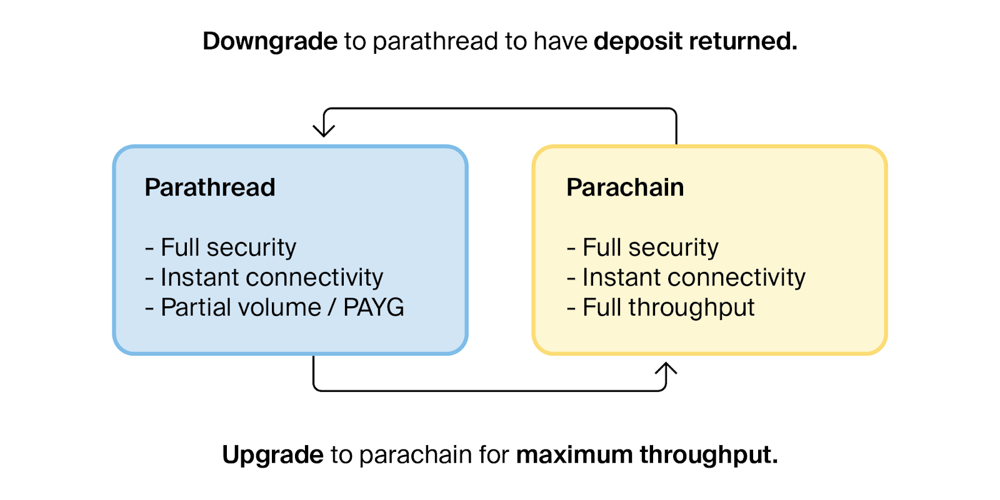
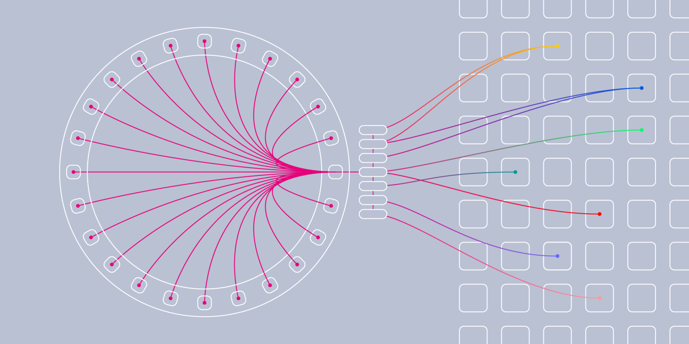

# Introduction

This guide will focus on the lifecycle of Polkadot's parachains, an integral part of the Polkadot ecosystem. An end-user or developer will learn how parachains will operate, and ways they can participate in the parachain lifecycle - from backing a parachain candidate to considerations for developing a parachain and what to expect when it's time to deploy.

# Prerequisites

It is recommended that you are have gone through the [Polkadot Blockchain Terms](https://learn.figment.io/tutorials/polkadot-blockchain-terms) guide and are familiar with the following:

- Polkadot Behind the Code, [Episode 1](https://www.youtube.com/watch?v=GcOKXAOh4Xw)
- An understanding of Polkadot's architecture: [Polkadot: Are You Ready to Start Building?](https://www.youtube.com/watch?v=_-k0xkooSlA).
- [Getting Started with Polkadot](https://wiki.polkadot.network/docs/en/getting-started).
- Are comfortable with blockchain computing & networking terminology.

# Parachain Lifecycle

## Summary of Parachains

Parachains are essentially clients of the relay chain. The relay chain _relays_ information like a router. The parachain slots on the relay chain are similar to router ports. Parachain slots can also be thought of as servers with shared resources; there are only a limited number of parachain slots.

There may only be a few slots that are unlocked every few months. The current goal is to eventually have 100 parachain slots available on Polkadot.

This limitation in slots requires different methods of allocation, such as:

- [Parathreads](https://wiki.polkadot.network/docs/en/learn-parathreads)
- [Common good parachains](https://wiki.polkadot.network/docs/en/learn-parachains#common-good-parachains)
- [Auction granted parachains](https://wiki.polkadot.network/docs/en/learn-auction)

_A parachain takes the form of a blockchain, but they do not have to be an actual blockchain._

Parachains are maintained by a network maintainer known as a [_collator_](https://wiki.polkadot.network/docs/en/learn-collator).

Taking the case for one parachain:

- There would be a start of a new block candidate, with a block creation time.
- The collator would be at the end of the process, aggregating all the transactions.
- The collator would then sign the parachain block candidate and produce state transition proofs, which are a summary of the final account balances caused by the transactions in the candidate block.
- The collator then passes on the candidate block and state transition proofs to the validators.
- The validators that are staking with the DOT token verify the transactions within the parachain block candidate.
- If all is well, the validator will share the candidate block with the relay chain.
- Parachain block candidates are collected together and a relay chain block candidate is produced. \[3]

- Then the validators on the network will try to reach a consensus on the relay chain block candidate. Upon reaching consensus, the now validated relay chain block candidate is shared with the validators and collators, and the process repeats for new transactions. \[3]

## Parachain Slot Auction

Parachain slots are **_only for lease, not for sale_**.

Acquiring a parachain is done through an unpermissioned candle auction. A candle auction is similar to an open auction but does not have a known end time. In the 1600s and 1700s, a candle was lit at the beginning of the auction, and the auction expired as soon as the flame went out \[1].

Bidders still submit increasingly higher bids, where the highest bidder at the end of the auction is considered the winner \[1]. There are random parameters put in place to offer the candle auction via blockchain. These random parameters make it impossible for any bidders to determine when the auction will end. As such, this prevents bidders from attempting last-minute bids and general auction sniping. This way, all the parachains trying to bid know the states of the bids at play, but not when the auction ends, encouraging the parachains to place a bid as soon as they can.

Polkadot uses a random beacon based on the [Vickrey auction](https://en.wikipedia.org/wiki/Vickrey_auction) which provides the randomness.

Each slot lifecycle is **two years** and is divided into **four, 6 month lease periods.** **_An auction is for the right to occupy a parachain slot in each of four periods._** \[4]

- Parachains can have their own local economies and their own form of governance. Chain autonomy is a focus for the Polkadot network.
  - Decisions in governance impact a chain's growth and development.
  - Chains can reproduce in parallel while holding a parachain slot.
- The cost of leasing a parachain slot is based on the market supply and demand.
- The overall Polkadot community will determine which additional features and network upgrades should be added to the network over time via governance \[1].

## Bidding

Individuals (individual(s) or team(s) representing a parachain) or smart contracts (which stem from parachains themselves) can bid. Bidders can also be existing parachains looking to renew or extend their lease. If a slot auction is won, the winner does not need anyone’s permission to deploy their parachain. Parachain bids can be placed in the auction by specifying the slot range that they want to lease with the number of tokens they are willing to reserve. The token reservation is the act of placing a deposit of DOT token for fixed-term. The deposit is returned at the end of the parachain’s lease.

Bidders can be either ordinary accounts or use the crowdloan functionality to source tokens from the community. A crowdloan allows a team to crowdsource DOT tokens to bootstrap its parachain auction.

Individuals and teams need to prepare a strategy for their parachain that accounts for aspects of their parachain ecosystem before auctioning:

- Economics
- Governance
- Fundraising

Up until a parachain is successful in an auction, they are considered candidates.

## After a slot expires

- Parachains can eventually be deprecated on the network or decide to not re-auction once their slot lifecycle comes to an end.
- The parachain team could host another crowdloan.
- The parachain team may want to move to a pay-as-you-go model: [Parathreads](https://wiki.polkadot.network/docs/en/learn-parathreads).

# Decentralized Crowdloans

**_Anyone can create a new crowdloan campaign for a parachain slot._**

A campaign is configured as a range of slots with a cap and a duration that can last over several auctions. Each campaign has an index. Anyone can participate by referencing the campaign's index via a special transaction.

The parachain team does not have any control over the contributed funds: all tokens contributed by a parachain’s supporters will be locked in the Relay Chain for the entire duration of the parachain slot. Many parachain teams will crowdsource the tokens from their community.

## Unsuccessful in Auctioning

- Projects that are unable to secure a parachain slot through auction should also consider deploying their parachain on Polkadot's canary network, [Kusama](https://kusama.network/). In fact, Kusama will roll out parachain auctions first for testing and optimization.

Kusama is an early, unaudited release of Polkadot's source code that was made available before Polkadot's initial release.
Kusama allows developers to experiment with new applications before releasing them onto the network. The network intends to be a testbed for new features and _radical_ development.
In the future, Kusama will also act as a parachain to the Polkadot network. The specs of the Kusama network are relatively the same as its cousin, Polkadot.

- The candidate parachain can consider transforming their parachain into a parathread and use the pay-as-you-go model. The parathread model has a fixed registration fee. This registration fee _only registers_ the parathread's source code onto the relay chain. The parathread is required to pay a fee to participate in a per-block auction for inclusion in the verification of the next Relay Chain block \[2].

**_Parachain registration does not grant the right to the parathread as the parathreads are competing on a per-block basis._**

**Why consider becoming a Parathread**

- Test an idea.
- Not enough resources for a fully functional application or blockchain.
- Community requires growth.
- If the candidate parachain focusses on a specific use-case such as identity management.
- The network you would like to deploy has limited traffic and does not need full throughput.

- Parachain candidates can also attempt to deploy their application on an existing parachain via smart contracts.
- Parachain candidates can connect to Polkadot via [bridging](https://wiki.polkadot.network/docs/en/learn-bridges) as a solo-chain.

# Conclusion

Congratulations! This guide offered a friendly overview of the lifecycle of a parachain.\
After reading the guide, an end-user or developer should be familiar with how parachains will operate on Polkadot, and the different ways that they can participate in the parachain lifecycle.

More information about the breakdown of Polkadot parachain slots and the Parachain lifecycle is available at:

- [Polkadot Parachain Slots Medium Article](https://medium.com/polkadot-network/polkadot-parachain-slots-f3f051d41699)
- [Parachain Slot Auctions Wiki Page](https://wiki.polkadot.network/docs/en/learn-auction)

Consider using Substrate to create your own parachain!

# About the Author

This guide was created by Danny Salman. You can reach out to Danny on [GitHub](https://github.com/DannyS03) for help or if you have questions pertaining to Polkadot and this guide.

# References

\[1] [Crust Network | Explaining the Polkadot Parachain Slot Auction Mechanism](https://medium.com/crustnetwork/crust-network-explaining-the-polkadot-parachain-slot-auction-mechanism-533381d42607#:~:text=Rules%20of%20the%20Polkadot%20Parachain%20Slot%20Auction&text=Each%20slot%20is%20divided%20into,periods%20according%20to%20their%20needs.)\
\[2] [Parathreads: Pay-as-you-go Parachains](https://polkadot.network/parathreads-parathreads-pay-as-you-go-parachains/)\
\[3] [Polkadot — An Early In-Depth Analysis — Part Two — How Consensus Works](https://cryptoseq.medium.com/polkadot-an-early-in-depth-analysis-part-two-how-consensus-works-1b2b2f3a2245)\
\[4] [Polkadot & Kusama Crowdloans and Parachain Auctions — Simplified](https://danreecer.medium.com/polkadot-kusama-crowdloans-and-parachain-auctions-simplified-da89a05cd566)
