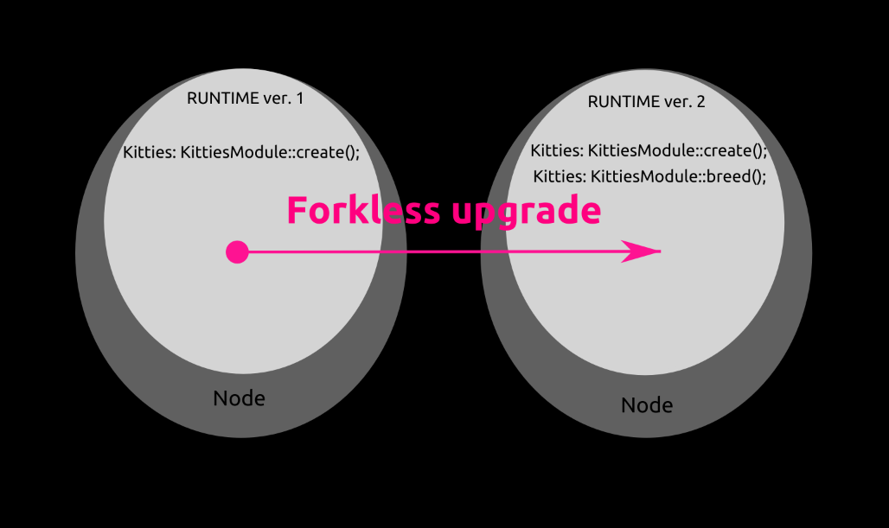
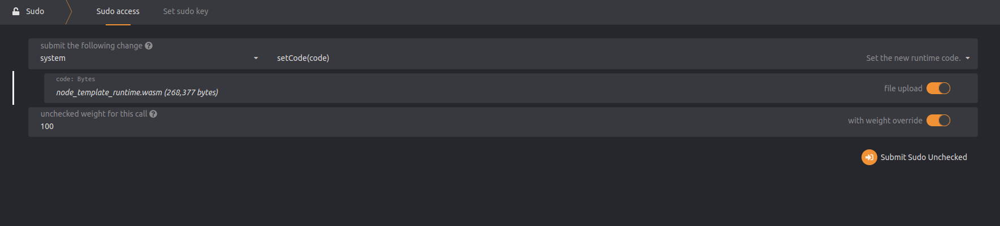
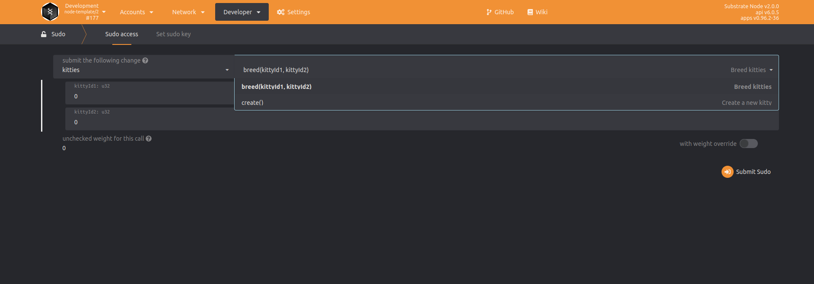

## Introduction

Decentralization of blockchains has advantages and disadvantages, one of the major advantages is that there is no single unit which has complete power over a system.
From the other side, a disadvantage is that in the environment without centralized control, upgrading is hard due to the need for coordinating so many nodes at one time. One of the well known solutions of upgrading blockchains is the so-called "hard fork", however this has many potential vectors of attack and is hard to coordinate.

The newest solution for upgrading decentralized systems based on the Substrate framework is called `runtime-upgrade`. The solution works smoothly and in this tutorial, I will show you how you can easily upgrade your Substrate based chain. We will examine how adaptability is implemented in the Substrate framework.

## Prerequisites

To successfully follow this tutorial, you should have a basic knowledge about the Rust programming language and Polkadot's Substrate framework.

## Getting started



During the tutorial we will progress through these steps:

1.  Build the simplest Substrate based blockchain
2.  Run the Substrate chain locally (on your own hardware)
3.  Add a new feature to the runtime
4.  Build a WebAssembly (WASM) file
5.  Verify the upgrade by checking the version

Upgrading the runtime state transition function consists of the following steps:

- Bump (increase) the spec_version
- Build the WASM file: `WASM_TARGET_DIRECTORY="$(pwd)" cargo build`
- Use the `sudo` command to start the runtime

## Building a simple Substrate blockchain

Checkout the master branch of https://github.com/TomaszWaszczyk/substrate-runtime-upgrade-tutorial, then execute the command make init and after around 10 minutes (depends on performance of your machine) you should see something like:

```text
Compiling sc-finality-grandpa v0.8.0
Compiling rocksdb v0.15.0
Compiling kvdb-rocksdb v0.9.1
Compiling sc-client-db v0.8.0
Compiling sc-service v0.8.0
Compiling sc-cli v0.8.0
Compiling frame-benchmarking-cli v2.0.0
Finished dev [unoptimized + debuginfo] target(s) in 13m 01s
```

> Note: If you want to build an optimized version of the project execute `cargo build --release`

## Run the Substrate node locally

Use the `make run` command:

```text
Running `target/debug/node-template --dev -lruntime=debug`
Sep 29 18:18:09.106  WARN Running in --dev mode, RPC CORS has been disabled.
Sep 29 18:18:09.106  INFO Substrate Node
Sep 29 18:18:09.106  INFO ✌️  version 2.0.0-73d7748-x86_64-linux-gnu
Sep 29 18:18:09.106  INFO ❤️  by Substrate DevHub <https://github.com/substrate-developer-hub>, 2017-2021
Sep 29 18:18:09.106  INFO 📋 Chain specification: Development
Sep 29 18:18:09.106  INFO 🏷  Node name: frantic-insect-7496
Sep 29 18:18:09.106  INFO 👤 Role: AUTHORITY
Sep 29 18:18:09.107  INFO 💾 Database: RocksDb at /home/tomek/.local/share/node-template/chains/dev/db
Sep 29 18:18:09.107  INFO ⛓  Native runtime: node-template-1 (node-template-1.tx1.au1)
Sep 29 18:18:10.070  INFO 🔨 Initializing Genesis block/state (state: 0x0f2a…c2cc, header-hash: 0x1e1d…f017)
Sep 29 18:18:10.073  INFO 👴 Loading GRANDPA authority set from genesis on what appears to be first startup.
Sep 29 18:18:10.294  INFO ⏱  Loaded block-time = 2000 milliseconds from genesis on first-launch
Sep 29 18:18:10.295  WARN Using default protocol ID "sup" because none is configured in the chain specs
Sep 29 18:18:10.296  INFO 🏷  Local node identity is: 12D3KooWNo1348XGxpiA9uFJn4GJdptp7NcX72pFXsGZXghPKLYa (legacy representation: 12D3KooWNo1348XGxpiA9uFJn4GJdptp7NcX72pFXsGZXghPKLYa)
Sep 29 18:18:10.618  INFO 📦 Highest known block at #0
Sep 29 18:18:10.620  INFO 〽️ Prometheus server started at 127.0.0.1:9615
Sep 29 18:18:10.624  INFO Listening for new connections on 127.0.0.1:9944.
Sep 29 18:18:12.249  INFO 🙌 Starting consensus session on top of parent 0x1e1dd820c46a22dbd297afd5a62e73511208bafe64c6dc9e6a171562c443f017
Sep 29 18:18:12.397  INFO 🎁 Prepared block for proposing at 1 [hash: 0x3b7c2d4f453358a70095cc0ad55a5f157a5be3d145c42213ea88c419b48966bf; parent_hash: 0x1e1d…f017; extrinsics (1): [0xff0f…0d06]]
Sep 29 18:18:12.515  INFO 🔖 Pre-sealed block for proposal at 1. Hash now 0xc61a8f6ea035c0fd2e8acef986a60ec92abbaaa1f30c4781603d4ec83591b216, previously 0x3b7c2d4f453358a70095cc0ad55a5f157a5be3d145c42213ea88c419b48966bf.
Sep 29 18:18:12.517  INFO ✨ Imported #1 (0xc61a…b216)
Sep 29 18:18:14.123  INFO 🙌 Starting consensus session on top of parent 0xc61a8f6ea035c0fd2e8acef986a60ec92abbaaa1f30c4781603d4ec83591b216
```

Access the front-end of the local node via: <https://polkadot.js.org/apps/#/extrinsics?rpc=ws://127.0.0.1:9944>


We can see that the kitties pallet has only a create() function, it is our current state transition function in the runtime. To demonstrate how adaptable Substrate based blockchains are, we can add a new feature - the breed() function.

## Adding a feature to the runtime

Before making an upgrade, spec_version would be 1. Now that we are making an upgrade, we have incremented the field, so it will now be 2 as shown below:

```rust
pub const VERSION: RuntimeVersion = RuntimeVersion {
	spec_name: create_runtime_str!("node-template"),
	impl_name: create_runtime_str!("node-template"),
	authoring_version: 1,
	spec_version: 2, // incremented version
	impl_version: 1,
	apis: RUNTIME_API_VERSIONS,
	transaction_version: 1,
};
```

Our upgrade will add a new function to the kitties pallet called `breed`, here is the implementation:

```rust
/// Breed kitties
#[weight = 1000]
pub fn breed(origin, kitty_id_1: u32, kitty_id_2: u32) {
  let sender = ensure_signed(origin)?;
  let kitty1 = Self::kitties(&sender, kitty_id_1).ok_or(Error::<T>::InvalidKittyId)?;
  let kitty2 = Self::kitties(&sender, kitty_id_2).ok_or(Error::<T>::InvalidKittyId)?;

  ensure!(kitty1.gender() != kitty2.gender(), Error::<T>::SameGender);

  let kitty_id = Self::get_next_kitty_id()?;

  let kitty1_dna = kitty1.0;
  let kitty2_dna = kitty2.0;

  let selector = Self::random_value(&sender);
  let mut new_dna = [0u8; 16];

  // Combine parents and selector to create new kitty
  for i in 0..kitty1_dna.len() {
    new_dna[i] = combine_dna(kitty1_dna[i], kitty2_dna[i], selector[i]);
  }

  let new_kitty = Kitty(new_dna);

  Kitties::<T>::insert(&sender, kitty_id, &new_kitty);
  Self::deposit_event(RawEvent::KittyBred(sender, kitty_id, new_kitty));
}
```

After adding this breed function to the kitties pallet, we need to build the WASM file.

Here is a link to the whole new implementation: https://github.com/TomaszWaszczyk/substrate-runtime-upgrade-tutorial/blob/after-runtime-upgrade/pallets/kitties/src/lib.rs

After performing the upgrade, we expect that the kitties pallet will contain the new `breed` function without needing to restart the running Substrate node. Real adaptability of the blockchain!

## Building the runtime WASM file

Run the terminal command `WASM_TARGET_DIRECTORY="$(pwd)" cargo build` in order to build the runtime WASM file.

After a successful build, we expect to have a new file in the current directory:


## Upgrading the runtime

We have a running Substrate node with version 1 and want to upgrade the runtime into version 2. Proof of a successful upgrade will be our freshly added breed function. Let's check, using the front-end.

To perform the upgrade, go to the **Developer** tab, then select **Sudo**. Make sure that you have selected the `system` pallet and `setCode(code)`, check in `file upload` and select the freshly created WASM file made in the previous step: `node_template_runtime.wasm`. Next, check the **with weight override** and in the field **unchecked weight for this call** type a value like 100, for example. To confirm the upgrade, click on **Submit Sudo Unchecked**.



After successfully upgrade you should see updated `spec_version` and have access to our new function:



In the screenshot above, we can see the result of a successful upgrade. Notice that `spec_version` has been incremented to 2 (where it says "node-template/2").

## Troubleshooting

### Problem: Rust errors when building

You may encounter an error while building, such as the one shown below. This means that you do not have the proper version of Rust installed.

```text
   Compiling prost-derive v0.6.1
error[E0034]: multiple applicable items in scope
   --> /home/tomek/.cargo/registry/src/github.com-1ecc6299db9ec823/prost-derive-0.6.1/src/lib.rs:111:14
    |
111 |             .intersperse(quote!(|));
    |              ^^^^^^^^^^^ multiple `intersperse` found
    |
    = note: candidate #1 is defined in an impl of the trait `Iterator` for the type `Map<I, F>`
    = note: candidate #2 is defined in an impl of the trait `Itertools` for the type `T`
help: disambiguate the associated function for candidate #1
    |
107 ~         let tags = Iterator::intersperse(field
108 +             .tags()
109 +             .into_iter()
110 +             .map(|tag| quote!(#tag)), {
111 +         let mut _s = $crate::__private::TokenStream::new();
112 +         $crate::quote_each_token!(_s $($tt)*);
  ...
help: disambiguate the associated function for candidate #2
    |
107 ~         let tags = Itertools::intersperse(field
108 +             .tags()
109 +             .into_iter()
110 +             .map(|tag| quote!(#tag)), {
111 +         let mut _s = $crate::__private::TokenStream::new();
112 +         $crate::quote_each_token!(_s $($tt)*);
  ...

For more information about this error, try `rustc --explain E0034`.
   Compiling asn1_der_derive v0.1.2
error: could not compile `prost-derive` due to previous error
warning: build failed, waiting for other jobs to finish...
error: build failed
make: *** [Makefile:11: build-full] Error 101
```

Solution - configure and make default proper version of Rust language on your machine

You need to install and set as default the specified nightly build of Rust: `rustup update nightly-2020-08-23` Rust language

1.  Installation

`rustup update nightly-2020-08-23`

2.  Make default version

`rustup default nightly-2020-08-23-x86_64-unknown-linux-gnu`

3.  Checking of default version

`rustup show` and in the output you should see following output:

```text
active toolchain
----------------

nightly-2020-08-23-x86_64-unknown-linux-gnu (default)
rustc 1.47.0-nightly (663d2f5cd 2020-08-22)
```

## Conclusion

Congratulations! You have already understood the importance of how adaptability is important in decentralized blockchains and how the feature is implemented in Substrate framework.

During reading the tutorial you have learnt basics of Rust language, how to compile Substrate based chain and how to generate and then upload wasm file in order to deliver new feature for the chain.

## About The author

The tutorial was created by Tomasz Waszczyk. In case any questions, you can reach out to Tomasz on [Github](https://github.com/tomaszwaszczyk) for help or explaining doubts pertaining to Polkadot/Kusama ecosystem and this guide.

## References

When you have completed the tutorial, you are ready to learn more about [Forkless upgrading runtime](https://docs.substrate.io/tutorials/v3/forkless-upgrades/) tutorial by Jimmy Chu.
