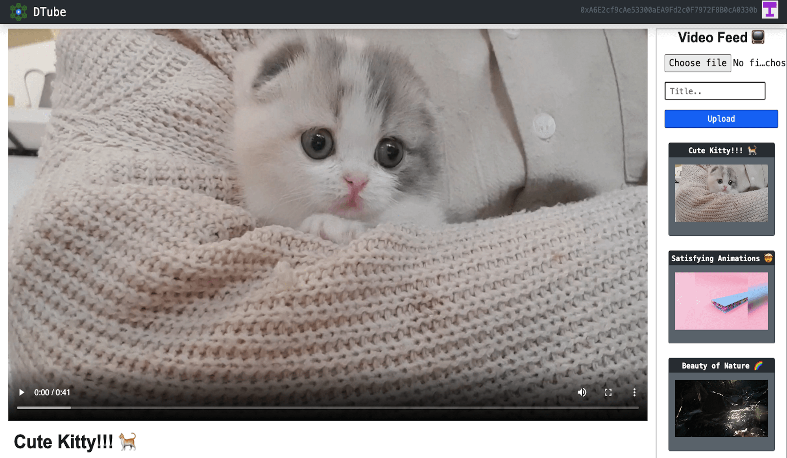
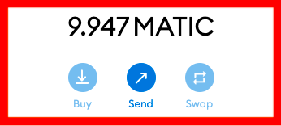
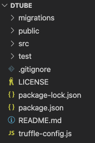
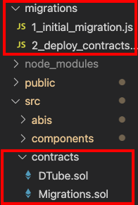
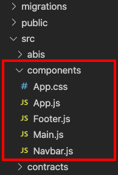
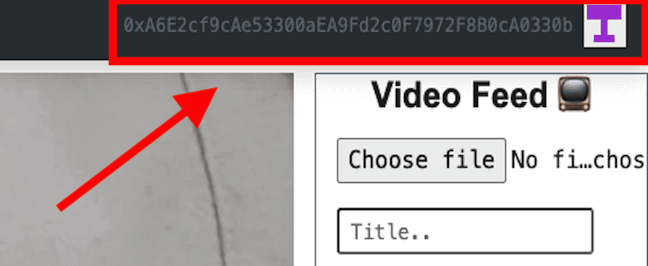
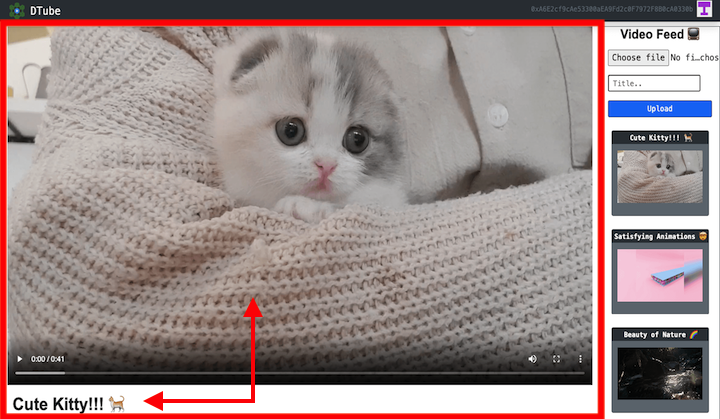
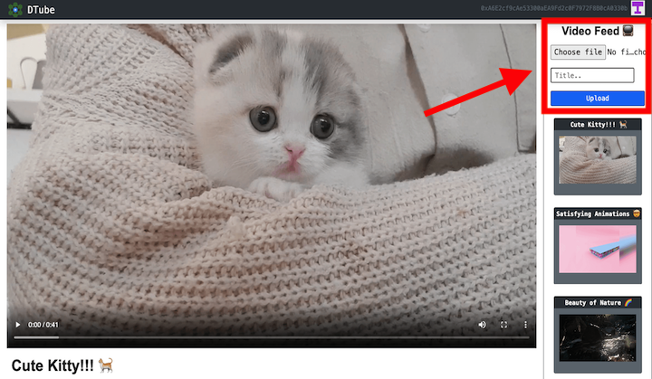
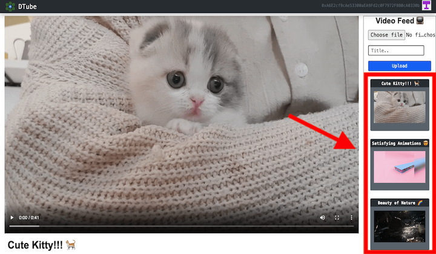

# Introduction

In this tutorial, you will learn how to build a Social Media DApp (Decentralized Application) like YouTube & how to Deploy it on the Polygon (Matic) Mumbai test network. So, grab a cup of coffee ☕️ and let's get started!

The DTube project was created by Akhilesh Thite during the ETHOdyssey Virtual Hackathon in July-Aug 2021. All the resources used to create this DApp are linked at in the "References" section at the end of this tutorial.

# Prerequisites

This tutorial assumes that you have some beginner-level experience in programming & blockchain understanding.

After this tutorial you will be able to:

- Build a Full Stack Decentralized Application on top of Ethereum Blockchain.
- Deploy smart contracts on the Polygon (Matic) Mumbai test network.
- Use Truffle & MetaMask.
- Understand Web3 concepts.
- Host the DApp on [IPFS](https://docs.ipfs.io/concepts/) using [Fleek](https://docs.fleek.co/) platform.

# Requirements

We need the following things on your computer to build our DApp.

### Node & npm

Node is a JavaScript runtime environment that executes JavaScript code outside a web browser and npm is a JavaScript package installer.
To install Node.js & npm on your computer, click on this [link](https://nodejs.org/en/download/) -> download the file as per your computer requirement -> Install the file.
To check the successful installation type `npm -v` in cmd prompt or terminal, It'll show the version that means you've successfully installed it on your computer.

### Truffle

Truffle is the best development environment for developing blockchain applications. Truffle gives us boilerplate code (template code) to start building our DApp.

To install truffle, open a terminal (windows cmd prompt or mac terminal) and run the following command:
`npm install -g truffle`

### Ganache (Optional for this tutorial)

Ganache is a personal blockchain environment for DApp development. It provides a local blockchain with 10 default accounts, each already funded with 100 ETH. This can be very useful for testing and development, [check it out](https://www.trufflesuite.com/ganache) if you are interested.

### MetaMask Setup

MetaMask is used to interact with the Ethereum blockchain. It allows users to access their Ethereum wallet through a browser extension or mobile app, which can then be used to interact with decentralized applications.

To install MetaMask extension, click on this [link](https://metamask.io/).
Now, `Create a MetaMask account -> save the mnemonics (12 secret words) because we need those mnemonics at the time of deployment`

To interact with Polygon via Metamask we first have to add a new RPC endpoint. Open the Metamask extension by clicking on the Fox icon in your browser toolbar then select `Settings -> Networks -> Add network -> Save`. Fill out the information as given in the image below.


Now you'll notice zero balance (0 MATIC) in your wallet, To get test Matic for deployment and testing,
`go to Matic Faucet -> Select Mumbai -> Paste wallet address -> Submit`, Matic Faucet [link](https://faucet.matic.network).
Done! check your wallet, you'll see some Matic there. _(We only need small amount of Matic (5-10 Matic) to deploy and test our DApp.)_



### Tech Stack

- **Languages:** `Solidity, JavaScript, HTML5, CSS3`
- **Libraries:** `React.js, Web3.js`
- **Tools:** `IPFS`
- **Network:** `Polygon (Matic)`
- **Platforms:** `Ethereum, Fleek`

### Roadmap

First, we'll setup our coding environment with the help of **Truffle**, after that we'll write **Smart Contracts** in **solidity**.
After writing Smart Contracts, To build the front-end of our DApp we'll use [React.js](https://reactjs.org/docs/getting-started.html) Javascript library plus some **HTML5, CSS3 & JavaScript**.

We're going to use **IPFS** (InterPlanetary File System) to store the hashes of our videos to the blockchain and later we'll be able to play those videos by calling those video hashes.

To connect our Smart Contracts with front-end we'll use [Web3.js](https://web3js.readthedocs.io/en/v1.4.0/) and then we'll deploy our Smart Contracts on **Mumbai testnet**. In the final step, we'll host this DApp on IPFS by using the **Fleek** platform.

What are **Smart Contracts?**

Smart Contracts are peer-to-peer digital user agreements on the blockchain. To write Smart contracts in Ethereum we use solidity programming language.

What is [Web3.js](https://web3js.readthedocs.io/en/v3.0.0-rc.5/)?

Web3.js is a set of JavaScript libraries that acts as a port to the blockchain world. Web3 is a medium to connect our Smart Contracts to the front-end of the DApp.

In this section, we introduced the technologies that will be used and provided a roadmap for building the DApp. Now on to the the interesting part - Let's make the DApp!

# Project Setup

To avoid dealing with any annoying version errors & instead of installing the supporting code libraries (dependencies) one-by-one, we'll start building our DApp by cloning a GitHub repository which contains the project files and installing all the necessary dependencies.

- `Fork` the [repository](https://github.com/AkhileshThite/DTube), this will make a copy of this project in your account.

- Clone the GitHub repository with the command `git clone https://github.com/<YourGitHubUsername>/DTube.git`
  This will copy the project files from GitHub to your computer.

- The command `cd DTube` will bring you into the local copy of the repository that was downloaded onto your computer.

Now, open the folder with your favorite code editor or IDE, [VS Code](https://code.visualstudio.com) for example.



Install all the dependencies by the following command:

- `npm install`

Note:- As the tutorial moves further, for each section you can clear the code from the file and code it by yourself. You can always cross-check your code from this tutorial or the original GitHub repository of the project.

_There are path and GitHub repo links with each section of the tutorial, so you won't need to scroll around looking for them._

# Smart Contracts in Solidity

Path:`/src/contracts/DTube.sol`

We are going to design Smart Contracts to upload videos (With IPFS video hash), Store videos (With the title and IPFS video hash), list videos (by video IDs) to the blockchain.

Let's define the version of the Solidity compiler to be used, and create a Solidity contract named DTube.
Initially, we're specifying that the video count is zero. `uint` means unsigned integer data type (can only be a number 0 or above, not a negative value). `string` means character string data type. We'll be able to refer to this contract later on by the name "DTube" with the help of an ABI ([Application Binary Interface](https://docs.soliditylang.org/en/latest/abi-spec.html)). The state variable visibility of `public` doesn't have to do anything with security, it simply means that the variable is not hidden or exclusive to the contract.
`mapping(uint => Video) public videos` is a mapping between a `uint` number and a Video. Because there will be multiple videos, we're creating a variable `Videos` by using the data type of each element `Video` which we'll create in the next code snippet.

```solidity
pragma solidity ^0.5.0;

contract DTube {
  uint public videoCount = 0;
  string public name = "DTube";
  mapping(uint => Video) public videos;
```

Now, let's create `Video` data types and `VideoUploaded` event.

```solidity
// Create data types
  struct Video {
    uint id;    // video count
    string hash; // IPFS video hash
    string title; // Title of the video
    address author; // User's wallet address
  }
// Create an event
  event VideoUploaded(
    uint id,
    string hash,
    string title,
    address author
  );
```

Let's create an `uploadVideo` function with two arguments `_videoHash` and `_title`, inside the function signature. We're making sure the `video hash`, `video title`, `uploader address` exist by using some conditions (require the length of the passed argument be greater than zero). After that, to differentiate the videos we'll increment the videoCount (each video will have a unique number to identify it by).

```solidity
  constructor() public {
  }

  function uploadVideo(string memory _videoHash, string memory _title) public {
    // Make sure the video hash exists
    require(bytes(_videoHash).length > 0);
    // Make sure video title exists
    require(bytes(_title).length > 0);
    // Make sure uploader address exists
    require(msg.sender!=address(0));

    // Increment video id
    videoCount ++;
```

Finally, we'll add the video to the contract by including the variables `videoCount`,`_videoHash`, `_title` & finally `msg.sender` which is a [global variable](https://docs.soliditylang.org/en/latest/units-and-global-variables.html?highlight=msg.sender#special-variables-and-functions) in Solidity, it simply means the current user. Then we'll emit the `VideoUploaded` event, which will store this information in the logs for the transaction where the event was emitted.

```solidity
    // Add video to the contract
    videos[videoCount] = Video(videoCount, _videoHash, _title, msg.sender);
    // Trigger an event
    emit VideoUploaded(videoCount, _videoHash, _title, msg.sender);
  }
}
```

# Truffle Migrations

- Path:`/src/contracts/`
- Path:`/migrations/`

Whenever we create a DApp using truffle by the commands `truffle init` or `truffle unbox react`, truffle gives us boilerplate code to start building our DApp. It contains the following main files:

- `migrations/1_initial_migration.js`
- `contracts/Migrations.sol (& DTube.sol)`
- `test`
- `truffle-config.js`

(We'll go over `truffle-config.js` in a moment, before deployment of our smart contracts.)

**Truffle migrations are JavaScript files that help you deploy contracts to the Ethereum (or other EVM compatible) network. These files are responsible for staging your deployment tasks, and they're written under the assumption that your deployment needs will change over time.**

Hence, to deploy our Smart Contracts to the Blockchain it is important to create a new file in the migrations folder called `2_initial_migration.js` which will talk to our `DTube.sol` contracts.



The code is similar to `1_initial_migration.js`, just replace migrations with DTube.

`2_initial_migration.js` will look like this:

```javascript
const DTube = artifacts.require('DTube');

module.exports = function (deployer) {
  deployer.deploy(DTube);
};
```

# Front-end with React.js

Path: `/src/components/`

React applications are comprised of various components, for example a navigation bar, main page, webpage footer, etc. React loads a single HTML page (`/public/index.html`) which is then populated with all the components that are defined in the project.



### app.js

Now let's work on our main `app.js` file which will contain all the components (navbar, main, footer).

First, we must import all the components and libraries we need (including web3.js), and instantiate our IPFS client so that we can store and retrieve files from the IPFS network.

```javascript
import React, { Component } from 'react';
import DTube from '../abis/DTube.json';
import Navbar from './Navbar';
import Main from './Main';
import Footer from './Footer';
import Web3 from 'web3';
import './App.css';

//Declare IPFS
const ipfsClient = require('ipfs-http-client');
const ipfs = ipfsClient({
  host: 'ipfs.infura.io',
  port: 5001,
  protocol: 'https',
});
```

About Async/Await Function in JavaScript:

**Async**

It simply allows us to write promises based code as if it was synchronous and it checks that we are not breaking the execution thread. It operates asynchronously via the event-loop. Async functions will always return a value. It makes sure that a promise is returned and if it is not returned then javascript automatically wraps it in a promise which is resolved with its value.

**Await**

Await function is used to wait for the promise. It could be used within the async block only. It makes the code wait until the promise returns a result. It only makes the async block wait.

_You can find simple explanation of Async/Await function [here](https://www.geeksforgeeks.org/async-await-function-in-javascript/)._

After that we're going to paste the exact default code which MetaMask instructs us to load web3. It takes Ethereum provider from MetaMask and injects it to your DApp, if your browser does not have MetaMask installed then it will show a pop up "Non-Ethereum browser detected. You should consider trying MetaMask!" message.

```javascript
class App extends Component {

  async componentWillMount() {
    await this.loadWeb3()
    await this.loadBlockchainData()
  }

  async loadWeb3() {
    if (window.ethereum) {
      window.web3 = new Web3(window.ethereum)
      await window.ethereum.request({ method: 'eth_requestAccounts' })
    }
    else if (window.web3) {
      window.web3 = new Web3(window.web3.currentProvider)
    }
    else {
      window.alert('Non-Ethereum browser detected. You should consider trying MetaMask!')
    }
  }
```

In `loadBlockchainData()` function, we're going to load the ETH accounts, connect with the network ID, list down the videos by the newest. If the smart contracts are not deployed to the respective network, then it'll show a pop up "DTube contract not deployed to detected network." message.

React components has a built-in state object. The state object is where you store property values that belongs to the component. When the state object changes, the component re-renders. We'll use `this.state` to fetch the blockchain data and display it in our front-end react components later with `this.props`.

```javascript
  async loadBlockchainData() {
    const web3 = window.web3;
    // Load account
    const accounts = await web3.eth.getAccounts();
    this.setState({ account: accounts[0] });
    // Network ID
    const networkId = await web3.eth.net.getId();
    const networkData = DTube.networks[networkId];
    if (networkData) {
      const dtube = new web3.eth.Contract(DTube.abi, networkData.address);
      this.setState({ dtube });
      const videosCount = await dtube.methods.videoCount().call();
      this.setState({ videosCount });
      // Load videos, sort by newest
      for (var i = videosCount; i >= 1; i--) {
        const video = await dtube.methods.videos(i).call();
        this.setState({
          videos: [...this.state.videos, video],
        });
      }
      //Set latest video with title to view as default
      const latest = await dtube.methods.videos(videosCount).call();
      this.setState({
        currentHash: latest.hash,
        currentTitle: latest.title,
      });
      this.setState({ loading: false });
    } else {
      window.alert("DTube contract not deployed to detected network.");
    }
  }
```

Now we're going to prepare the file for upload to IPFS by the `captureFile` function.

```javascript
captureFile = event => {
  event.preventDefault();
  const file = event.target.files[0];
  const reader = new window.FileReader();
  reader.readAsArrayBuffer(file);

  reader.onloadend = () => {
    this.setState({ buffer: Buffer(reader.result) });
    console.log('buffer', this.state.buffer);
  };
};
```

Next, we need the `uploadVideo` function so we can upload the video files to IPFS. While uploading a video file to IPFS it'll show a message in the console "Submitting file to IPFS...". Here, we're adding the file with `ipfs.add()` which will take two arguments: The file being uploaded & a callback function. After that, we're going to store the [CID](https://docs.ipfs.io/concepts/content-addressing/) hash of the video file to the blockchain.

```javascript
uploadVideo = title => {
  console.log('Submitting file to IPFS...');
  //adding file to the IPFS
  ipfs.add(this.state.buffer, (error, result) => {
    console.log('IPFS result', result);
    if (error) {
      console.error(error);
      return;
    }

    this.setState({ loading: true });
    this.state.dtube.methods
      .uploadVideo(result[0].hash, title)
      .send({ from: this.state.account })
      .on('transactionHash', hash => {
        this.setState({ loading: false });
      });
  });
};
```

To update the video hash and title of the video to the "current" we're going to create `changeVideo` function. After that, let's create bind functions to display the blockchain data in our front-end react components.

`bind()` is an inbuilt method in React, used to pass the data as an argument to the function of a class based component.

```javascript
  changeVideo = (hash, title) => {
    this.setState({ currentHash: hash });
    this.setState({ currentTitle: title });
  };

  constructor(props) {
    super(props);
    this.state = {
      buffer: null,
      account: "",
      dtube: null,
      videos: [],
      loading: true,
      currentHash: null,
      currentTitle: null,
    };

    this.uploadVideo = this.uploadVideo.bind(this);
    this.captureFile = this.captureFile.bind(this);
    this.changeVideo = this.changeVideo.bind(this);
  }
```

Finally, let's add all the components we imported at the top `<Navbar>`, `<Main>` & `<Footer>`. Remember `this.state` is fetching all the blockchain data so that we can use that data to display in our react front-end components.

In `<Navbar>` we want to display the account address of the user, hence `<Navbar account={this.state.account} />` will fetch the current account address of the user and we'll display that in the `Navbar.js` component by `this.props.account`. Similarly for the main content of our DApp we need videos, uploadVideo, captureFile, changeVideo, currentHash, currentTitle data to display it on `Main.js` component.

```javascript
  render() {
    return (
      <div>
        <Navbar account={this.state.account} />
        {this.state.loading ? (
          <div id="loader" className="text-center mt-5">
            <p>Loading...</p>
          </div>
        ) : (
          <Main
            videos={this.state.videos}
            uploadVideo={this.uploadVideo}
            captureFile={this.captureFile}
            changeVideo={this.changeVideo}
            currentHash={this.state.currentHash}
            currentTitle={this.state.currentTitle}
          />
        )}
        <Footer />
      </div>
    );
  }
}

export default App;
```

### Navbar.js



In the Navbar component, we're going to display the brand logo, brand name, user account address, and user profile (including a unique identicon, using a JavaScript library). First, let's import the code and brand logo. We're going to use [Bootstrap](https://getbootstrap.com/) to make our navigation bar.

```javascript
import React, { Component } from 'react';
import Identicon from 'identicon.js'; //user profile
import dtube from '../dtube.png'; //logo

class Navbar extends Component {
  render() {
    return (
      <nav className="navbar navbar-dark fixed-top bg-dark flex-md-nowrap p-0 shadow text-monospace">
        <a
          className="navbar-brand ml-1 col-sm-3 col-md-2 mr-0"
          href="/"
          rel="noopener noreferrer"
        >
          
          &nbsp;DTube
        </a>
        <ul className="navbar-nav px-3">
          <li className="nav-item text-nowrap h5 d-none d-sm-none d-sm-block">
            <small className="text-secondary">
              <small id="account">{this.props.account}</small>
            </small>
            {this.props.account ? (
              
            ) : (
              <span></span>
            )}
          </li>
        </ul>
      </nav>
    );
  }
}

export default Navbar;
```

We're displaying the user address in this component with the `this.props.account` property. The following code snippet uses [React conditional rendering](https://reactjs.org/docs/conditional-rendering.html) and the JavaScript [ternary operator](https://developer.mozilla.org/en-US/docs/Web/JavaScript/Reference/Operators/Conditional_Operator): If the user account address exists, then show the identicon user profile. Otherwise, display a blank `<span>`.

```javascript
            {this.props.account ? (
              
            ) : (
              <span></span>
```

### Main.js



To display the current uploaded video & title of the video we're going to use `this.props.currentHash` & `this.props.currentTitle` properties. Now, why are we using `https://ipfs.infura.io/ipfs/` here? Because [Infura](https://infura.io/) will [pin our IPFS file](https://docs.ipfs.io/concepts/persistence/) to keep the file available to the network. Otherwise, if the IPFS node we're connected to is down, the video file might not be available. There are several IPFS pinning services available and Infura is one of the most commonly used due to its resilience.

```javascript
import React, { Component } from "react";
import "./App.css";

class Main extends Component {
  render() {
    return (
      <div className="container-fluid text-monospace main">
        <br></br>
        &nbsp;
        <br></br>
        <div className="row">
          <div className="col-md-10">
            <div
              className="embed-responsive embed-responsive-16by9"
              style={{ maxHeight: "720px" }}
            >
              <video
                src={`https://ipfs.infura.io/ipfs/${this.props.currentHash}`}
                controls
              ></video>
            </div>
            <h3 className="mt-3">
              <b>
                <i className="video-title">{this.props.currentTitle}</i>
              </b>
            </h3>
          </div>
```



Next, we're going to create a form in the video feed to choose the video file, input the title of the video, and upload the video. We're going to choose the video file, which will process to upload on IPFS with `this.props.captureFile` method. Then we're going to input the title of the `video ref={(input) => { this.videoTitle = input }}`. In the `onSubmit` event handler we'll upload the video file with the title of the video by `this.props.uploadVideo(title)`.

```javascript
          <div
            className="vide-feed col-md-2 border border-secondary overflow-auto text-center"
            style={{ maxHeight: "4000px", minWidth: "175px" }}
          >
            <h5 className="feed-title">
              <b>Video Feed 📺</b>
            </h5>
            <form
              onSubmit={(event) => {
                event.preventDefault();
                const title = this.videoTitle.value;
                this.props.uploadVideo(title);
              }}
            >
              &nbsp;
              <input
                type="file"
                accept=".mp4, .mov, .mkv .ogg .wmv"
                onChange={this.props.captureFile}
                style={{ width: "250px" }}
              />
              <div className="form-group mr-sm-2">
                <input
                  id="videoTitle"
                  type="text"
                  ref={(input) => {
                    this.videoTitle = input;
                  }}
                  className="form-control-sm mt-3 mr-3"
                  placeholder="Title.."
                  required
                />
              </div>
              <button
                type="submit"
                className="btn border border-dark btn-primary btn-block btn-sm"
              >
                Upload
              </button>
              &nbsp;
            </form>
```



Finally, to list out all the previously uploaded videos with their title in the video feed we'll use `video.hash` and `video.title` properties. Whenever we click on any listed/previous videos the `changeVideo` function will convert the `video.hash` and `video.title` to `currentHash` & `currentTitle`, so that the selected video will appear on the screen.

```javascript
            {this.props.videos.map((video, key) => {
              return (
                <div
                  className="card mb-4 text-center hover-overlay bg-secondary mx-auto"
                  style={{ width: "195px" }}
                  key={key}
                >
                  <div className="card-title bg-dark">
                    <small className="text-white">
                      <b>{video.title}</b>
                    </small>
                  </div>
                  <div>
                    <p
                      onClick={() =>
                        this.props.changeVideo(video.hash, video.title)
                      }
                    >
                      <video
                        src={`https://ipfs.infura.io/ipfs/${video.hash}`}
                        style={{ width: "170px" }}
                      />
                    </p>
                  </div>
                </div>
              );
            })}
          </div>
        </div>
      </div>
    );
  }
}

export default Main;
```

Wow, that's a lot of code! You can run the React app locally with the command `npm start`. Of course the functionality is missing, because we haven't deployed our smart contracts to the blockchain yet. Let's deploy our Solidity contracts on Polygon (Matic) Network next.

_The `<Footer>` component was created in bootstrap for hackathon purposes. It's not related to our DApp. You can simply modify that part as per your needs._

# Smart Contracts Deployment on Polygon (Matic)

### truffle-config

- `truffle-config.js` for Mac users
- `truffle.js` for Windows users

The truffle-config file is an important file to understand. In this file, we must configure the path to the DTube Solidity file (smart contract), the contract ABI, and define the available **networks**.

```javascript
const HDWalletProvider = require('@truffle/hdwallet-provider');
require('dotenv').config(); // Load .env file

module.exports = {
  networks: {
    // For Ganache, your personal blockchain
    development: {
      host: '127.0.0.1', // Localhost (default: none)
      port: 8545, // Standard Ethereum port
      network_id: '*', // Any network (default: none)
    },
  },
  contracts_directory: './src/contracts/', // path to Smart Contracts
  contracts_build_directory: './src/abis/', // Path to ABIs
  compilers: {
    solc: {
      optimizer: {
        enabled: true,
        runs: 200,
      },
    },
  },
};
```

Ensure you create an `.env` file in the project root directory (`~/DTube/.env`) and paste into it the Secret Recovery Phrase (12 words) of your preferably newly generated and testnet-only MetaMask wallet with the variable name MNEMONIC. This will be loaded by truffle at runtime, and the environment variable can then be accessed with `process.env.MNEMONIC`.

    MNEMONIC= 12 secret words here..

Now, let's add `matic` network in our truffle-config file which will contain our environment variable MNEMONIC and RPC URL.

```javascript
    matic: {
      provider: () => new HDWalletProvider(process.env.MNEMONIC,
      `https://rpc-mumbai.matic.today`),
      network_id: 80001,
      confirmations: 2,
      timeoutBlocks: 200,
      skipDryRun: true,
      gas: 6000000,
      gasPrice: 10000000000,
    },
```

You can set the gas price and gas limits for faster transactions as shown in the above code block.

### Deploy Smart Contracts

- Command: `truffle migrate --network matic`

If you're deploying it for the second time then deploy with this command just to **reset** and avoid JSON errors.

- Command: `truffle migrate --network matic --reset`

If everything worked fine, you'll see something like this:

```bash
2_deploy_contracts.js
=====================

   Replacing 'MyContract'
   ------------------
   > transaction hash:    0x1c94d095a2f629521344885910e6a01076188fa815a310765679b05abc09a250
   > Blocks: 5            Seconds: 5
   > contract address:    0xbFa33D565Fcb81a9CE8e7a35B61b12B04220A8EB
   > block number:        2371252
   > block timestamp:     1578238698
   > account:             0x9fB29AAc15b9A4B7F17c3385939b007540f4d791
   > balance:             79.409358061899298312
   > gas used:            1896986
   > gas price:           0 gwei
   > value sent:          0 ETH
   > total cost:          0 ETH

   Pausing for 2 confirmations...
   ------------------------------
   > confirmation number: 5 (block: 2371262)
initialised!

   > Saving migration to chain.
   > Saving artifacts
   -------------------------------------
   > Total cost:                   0 ETH


Summary
=======
> Total deployments:   2
> Final cost:          0 ETH
```

_Code snippet from matic truffle docs._

**IMPORTANT: If you encounter any errors while deploying the Solidity contracts to Polygon (Matic) then check out the "Dealing with different errors" section of [Deploying and Debugging the Smart Contracts on Polygon](https://learn.figment.io/tutorials/deploying-and-debugging-smart-contracts-on-polygon) tutorial on Figment learn.**

Now let's run the React app on http://localhost:3000/ with the command `npm start`. You should see MetaMask pop up, asking if you would like to connect your MetaMask wallet with the site. Once connected, you can upload and share videos on your DApp which is deployed on Polygon (Matic) network!


# Host the DApp on IPFS using Fleek

You cannot call this project a "Decentralized Application" if you are hosting it on any centralized server. To make it decentralized, again we're going to use IPFS. But the problem here is you cannot update/modify the project with same IPFS hash. IPFS uses content based addressing, hence each asset has its own unique address. This is where we're going to use "Fleek" IPFS hosting and Filecoin storage platform where you can **deploy the project, get a link, get SSL certificate, assign the domain, and update the project by simply connecting your GitHub repository**. When you push any changes on that repo, fleek will automatically update the changes with new IPFS hash on the same Fleek url. How cool is that? Let's see how it's done.

Before hosting the DApp on Fleek,
Create a `.gitignore` file in the root dir of your project, put `node_modules` and `.env` on separate lines inside the `.gitignore` file and remember to save the file to disk.

<Hint style="warning">
  Never share or commit your .env file. It contains your credentials like
  mnemonics and API key. Therefore, it is advised to add .env to your .gitignore
  file.
</Hint>

```.gitignore
/node_modules
.env
```

Create a new repository on GitHub and push all the changes.

_`Sign up on `[Fleek](https://fleek.co/) `-> Add new site -> Connect GitHub repo -> select framework (React in our case) -> Deploy Site`_

That's it! you'll get the fleek link of your DApp after deploying the site, you can assign a domain and share your DApp link with anyone in the world. Congratulations! You've built a truly Decentralized Social Media Application.

# Conclusion

Congratulations! After completing this tutorial, you should have a good understanding of how to create a dApp for video content and how to deploy it on Polygon.

# About the Author

I'm Akhilesh Thite, an Indian tech enthusiast with a passion for Software Development, Open-Source & Decentralization. Feel free to connect with me on [GitHub](https://github.com/AkhileshThite) & [Twitter](https://twitter.com/AkhileshThite_).

# References

- _Truffle docs: https://www.trufflesuite.com/docs/truffle/overview_
- _Polygon (Matic) docs: https://docs.matic.network/docs/develop/getting-started_
- _MetaMask docs: https://docs.metamask.io/guide/#why-metamask_
- _Web3 docs: https://web3js.readthedocs.io/en/v1.4.0/_
- _React docs: https://reactjs.org/docs/getting-started.html_
- _Fleek docs: https://docs.fleek.co_
- _IPFS docs: https://docs.ipfs.io/concepts/what-is-ipfs/#decentralization_
- _Async/Await: https://www.geeksforgeeks.org/async-await-function-in-javascript/_
- _Dapp University YouTube: https://www.youtube.com/watch?v=OLsteD3xkPQ_
- _Deploying & debugging smart contracts on Polygon :https://learn.figment.io/tutorials/deploying-and-debugging-smart-contracts-on-polygon_
