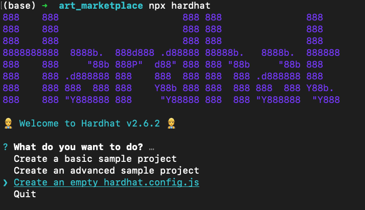
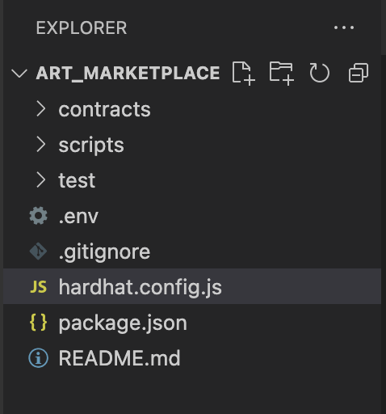
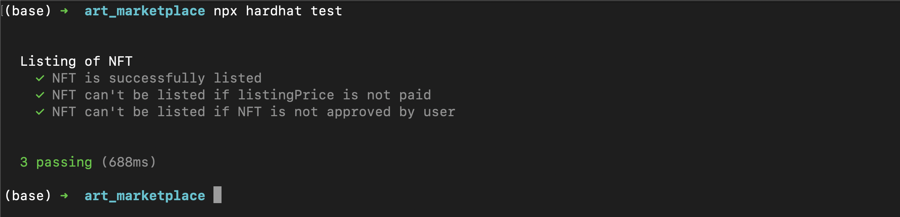
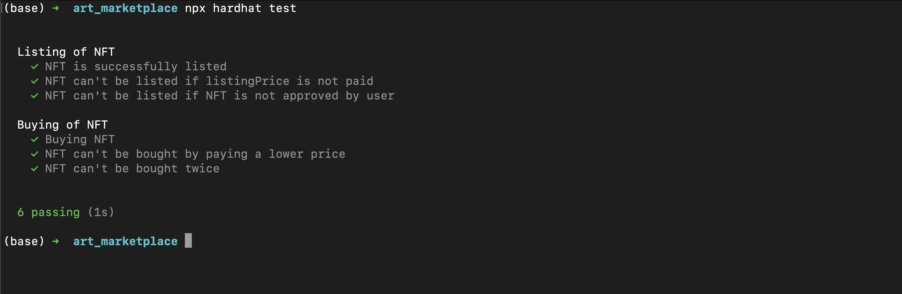
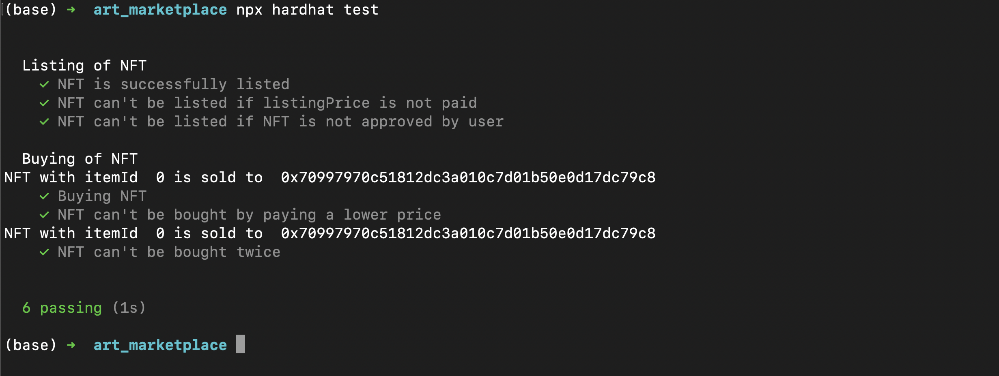

## Building an NFT Marketplace Smart Contract

## Introduction

In this tutorial we are going to learn how to build an NFT Marketplace smart contract. Our marketplace smart contract will enable its users to list their NFT on the contract by paying a small fee. This NFT marketplace is a medium where people can buy and sell their NFTs. We will learn about writing unit tests and how to deploy our contract to the Polygon Mumbai testnet using HardHat, as well as how to verify the contract source code on Polygonscan so it is publicly available.

## Prerequisites

This tutorial assumes you have completed the [Create an NFT smart contract with HardHat](https://learn.figment.io/tutorials/create-nft-smart-contract-with-hardhat) tutorial. We are using that project build as the starting point of this tutorial. Although it is not necessary to have completed that tutorial, it will give you a better understanding on environment setup and how to build smart contracts using HardHat.

## Requirements

- [Node.js](https://nodejs.org/en/) v14.17.6 LTS or higher, for installing packages.
- [HardHat](https://hardhat.org/) is the framework we will be using for developing our smart contracts.
- [MetaMask](https://metamask.io/) for interacting with the blockchain.
  - Once you have installed MetaMask, add a connection with [Polygon Mumbai Testnet](https://docs.matic.network/docs/develop/metamask/config-polygon-on-metamask).
  - Remember to get your account funded with testnet MATIC tokens using the [Polygon Faucet](https://faucet.polygon.technology/).
- A [Polygonscan API key](https://polygonscan.com/login?cmd=last) which will be used for automatically verifying our smart contract source code on Polygonscan using a HardHat plugin.

## Environment setup

We will start by creating an empty HardHat project.

Create a new directory called `art_marketplace` and change into it with the `cd` command, then run `npx hardhat` to initialize the HardHat project.

The `npx hardhat` command will present you with a menu, where you can select how to initialize your project



We will be starting from scratch. Using the arrow keys on your keyboard, select `Create an empty hardhat.config.js` option and press Enter.

This will create an empty `hardhat.config.js` file and a `package.json` file. We have discussed the use of this file in detail in our previous tutorial, [Create an NFT smart contract with HardHat](https://learn.figment.io/tutorials/create-nft-smart-contract-with-hardhat). The `package.json` contains all the `npm` packages we install. Before proceeding further we will be creating some folders for organising our work. Type the following in the terminal:

```bash
mkdir contracts
mkdir scripts
mkdir test
touch .env
touch .gitignore
touch README.md
```

- `contracts` will contain all the smart contract code
- `scripts` will store the scripts we write
- `test` will store all the test scripts we write
- the `.env` file will store all our private keys
- the `.gitignore` file will list all the files that are to ignore by the version control system
- the `README.md` file for our project which contains descriptive information about it



Now, if you open the working directory in your favourite code editor (I am using VSCode), the file structure should look similar to this

Now we have to install the dependencies we need for our project. Copy the following into your package.json file:

```json
{
  "name": "hardhat-project",
  "devDependencies": {
    "@nomiclabs/hardhat-ethers": "^2.0.2",
    "@nomiclabs/hardhat-waffle": "^2.0.1",
    "chai": "^4.3.4",
    "ethereum-waffle": "^3.4.0",
    "ethers": "^5.4.6",
    "hardhat": "^2.6.4"
  },
  "dependencies": {
    "@nomiclabs/hardhat-etherscan": "^2.1.6",
    "@openzeppelin/contracts": "^4.3.2",
    "dotenv": "^10.0.0"
  }
}
```

Now run the following command:

```text
npm install
```

This command will install all the required code libraries for the project. All the installed modules can be found inside a folder called `node_modules` .

Congratulations 🎉🎉🎉, you are now ready to start writing smart contracts.

## Developing the Smart Contract

Inside the `contracts` folder create a new file named `Marketplace.sol`. The filename of our smart contract should indicate its functionality in some way although the filename is entirely your choice.

```solidity
// SPDX-License-Identifier: Unlicensed

pragma solidity 0.8.4;

contract Marketplace {
}
```

We start by defining the license for our smart contract. For the purposes of this tutorial we are going to keep our contract as `Unlicensed`. Next we define the Solidity version we are using with the `pragma` keyword. We will be using Solidity version `0.8.4` . We also define the name of the smart contract using the `contract` keyword. Please make sure that the contract name defined matches with the name of the file you created.

### Importing libraries

Add the following import statements to the code:

```solidity
// SPDX-License-Identifier: Unlicensed

pragma solidity 0.8.4;

import "@openzeppelin/contracts/token/ERC721/IERC721.sol";

contract Marketplace {
}
```

The `import` keyword is used to import the `IERC721` smart contract from the OpenZeppelin contracts which was installed as a dependency. IERC721 is read as **_Interface - ERC721_**. An interface of a smart contract provides a high level overview of all the public functions and events present in that smart contract. An interface contains only the function signature and event declarations of the functions. It helps our smart contract to make calls to other smart contracts present on the blockchain. We are importing `IERC721` because it is an interface for ERC721 smart contracts which form the basis for many NFTs on the blockchain.

### Defining global variables

Make the following changes to the smart contract:

```solidity
// SPDX-License-Identifier: Unlicensed

pragma solidity 0.8.4;

import "@openzeppelin/contracts/token/ERC721/IERC721.sol";

contract Marketplace {
    uint256 public itemCounter;
    address payable owner;
    uint256 public listingPrice;

    struct MarketItem {
        uint256 itemId;
        address nftContractAddress;
        uint256 tokenId;
        address payable seller;
        address payable owner;
        uint256 price;
        bool isSold;
        bool isPresent;
    }

    mapping(uint256 => MarketItem) private marketItems;

    event MarketItemListed(
        uint256 indexed itemId,
        address indexed nftContractAddress,
        uint256 indexed tokenId,
        address seller,
        address owner,
        uint256 price
    );

    constructor() {
  		itemCounter = 0;
  		owner = payable(msg.sender);
  		listingPrice = 0.01 ether;
		}
}
```

Here we have defined the following:

- itemCounter: A public variable that is used to uniquely identify each NFT that is listed in the smart contract.
- owner: This variable stores the address of the owner of the smart contract. We use the keyword `payable` that denotes that the address stored in this variable can receive payment (MATIC in our case) directly from the smart contract. This is needed because the owner of the smart contract is going to receive a small commission for all the NFTs listed in the smart contract.
- listingPrice: This variable is used to define the amount charged as commission by the owner of the smart contract for listing of the NFT.
- MarketItem: We have used the `struct` keyword to define a composite datatype know as _structures._ A structure is a datatype which is made using more than one primary datatypes. In this case, MarketItem is a datatype that is used to denote an NFT that is listed in the contract. It consists of the following primary datatypes:
  - itemId: Each NFT listed in the smart contract is assigned an unique itemId.
  - nftContractAddress: This variable stores the contract address of the smart contract to which the listed NFT belongs to. Conversely we can also say that, this variable is used to store the contract address of the smart contract used to mint the NFT that is listed.
  - tokenId: This variable stores the tokenId of the NFT that is listed on the platform.
  - seller: This is the address of the account that is selling the NFT. This address is also defined as payable, because the seller will be receiving the amount paid by the buyer.
  - owner: This variable will store the account that owns the NFT once the NFT is bought from our Marketplace smart contract.
  - price: This stores the price of the NFT. This price is set by the account that is listing the NFT for sale.
  - isSold: This variable stores whether the NFT is sold or not.
  - isPresent: Since we will be using a mapping to map itemId to individual listed NFTs, this variable will be helpful for checking if there is an NFT for the passed itemId.
- marketItems: This is a `mapping` that is used to map an `uint256` data type to a `MarketItem` datatype. This variable is used to store the mapping between the itemId of a listed NFT to the details of that NFT stored in the structure MarketItem.
- event MarketItemListed: In smart contracts it is not possible to write/output something to the console or log data in a log file. So in order to maintain a record of important actions performed by the smart contract we use `event` .

  An event can have various parameters that provide additional details about that event. The `indexed` keyword is used to refer to a certain parameter in an event that can be used as a query parameter.

Finally we initialise the following variables in the constructor:

- itemCounter: The itemCounter variable is initialised to 0.
- owner: By default the account deploying the smart contract (address of the deploying account is returned by `msg.sender` keyword) is set as the owner of the smart contract. We use the keyword `payable` while assigning the value to typecast the address returned by `msg.sender` to an address type that can receive payment from the smart contract.
- listingPrice: A price is charged for listing each NFT on the smart contract. We specify this price in the `listingPrice` variable. The default value is set to `0.01 ether` which means 0.01 Matic has to be paid for listing an NFT. `ether` is a special type of unit defined in Solidity. You can read more about the unit `ether` in the official documentation [here](https://docs.soliditylang.org/en/v0.8.9/units-and-global-variables.html?highlight=ether#ether-units).

### Creating the listMarketItem function

Add the following function:

```solidity
function listMarketItem(
    address nftContractAddress,
    uint256 tokenId,
    uint256 price
) public payable {
    require(msg.value == listingPrice, "Must pay the listing price");
    require(price > 0, "Price must be greater than 0");

    marketItems[itemCounter] = MarketItem(
        itemCounter,
        nftContractAddress,
        tokenId,
        payable(msg.sender),
        address(0),
        price,
        false,
        true
    );

    IERC721(nftContractAddress).transferFrom(
        msg.sender,
        address(this),
        tokenId
    );

    payable(owner).transfer(listingPrice);

    emit MarketItemListed(
        itemCounter,
        nftContractAddress,
        tokenId,
        msg.sender,
        address(0),
        price
    );

    itemCounter += 1;
}
```

Now lets understand the code:

- The function takes in 3 parameters: `nftContractAddress`, `tokenId` and `price` which represents the contract address of the NFT, the tokenId of the NFT and the price the seller wants to sell it for respectively. It is a public function which means anyone can call this function. The payable keyword is used because in order to use this function, the user must attach payment for the listing fees.
- `msg.value` returns the amount of payment sent while calling the function. The amount sent must be equal to the listing price set by the owner of the smart contract. The `require(msg.value == listingPrice, "Must pay the listing price");` checks this and returns an error if the amount of token sent (MATIC in our case) is not equal to the specified listing price.
- The next require statement makes sure that the selling price set for the contract is not 0.

```solidity
marketItems[itemCounter] = MarketItem(
    itemCounter,
    nftContractAddress,
    tokenId,
    payable(msg.sender),
    address(0),
    price,
    false,
    true
);
```

- Here we have created a new object of type `MarketItem` and mapped it to the value of `itemCounter` using the `marketItems` mapping, that we have defined earlier. The present value of the `itemCounter` becomes the `itemId` for our NFT. The account calling this function (returned by `msg.sender`) is set as the seller of the NFT. We set a null address (represented by `address(0)`) as the owner of the NFT. This will be changed when someone buys the NFT.

```solidity
IERC721(nftContractAddress).transferFrom(
    msg.sender,
    address(this),
    tokenId
);
```

- Here we first create an Object of type ERC721 using the IERC721 interface that we imported. The interface needs the address of the ERC721 contract. `IERC721(nftContractAddress)` returns the reference to the ERC721 contract deployed at the address stored in the `nftContractAddress` variable. The `transferFrom` function of the ERC721 contract is used to transfer the NFT from the user (the address returned by `msg.sender`) to the smart contract (the address returned by `address(this)`).

  > **Note**: For our smart contract to be able to transfer the NFT from the user to itself, the user must first approve our smart contract to spend NFT on the user's behalf.\*\*

- `payable(owner).transfer(listingPrice)` is used to transfer MATIC to the owner of the smart contract. This line transfers the fee paid for listing to the owner.

- After this, the `emit` keyword is used to create a new event of type **MarketItemListed**.

- We increment the value of `itemCounter` by 1 so that the next NFT listed will have a new `itemId`.

### Creating the buyMarketItem function

Add the following function:

```solidity
function buyMarketItem(uint256 itemId) public payable {
    require(marketItems[itemId].isPresent, "Item is not present");
    require(marketItems[itemId].isSold == false, "Item is already sold");
    require(
        marketItems[itemId].price == msg.value,
        "Must pay the correct price"
    );

    marketItems[itemId].isSold = true;
    marketItems[itemId].owner = payable(msg.sender);

    IERC721(marketItems[itemId].nftContractAddress).transferFrom(
        address(this),
        msg.sender,
        marketItems[itemId].tokenId
    );
}
```

Now lets understand the code:

- The function takes in only 1 parameter, that is the `itemId`. It is of type **public** and **payable** because anyone can call this function to buy an NFT and in order to buy the NFT the price has to be sent when calling the function.
- The function checks for the following:
  - There is an item present with the itemId passed.
  - The item is not already sold.
  - The amount send (returned with `msg.value`) is equal to the price to be paid for the NFT.
- After this the item is marked as Sold and the owner of the NFT is changed from from blank to the address of the account calling the function.
- We again use the IERC721 interface to create an interface for the ERC721 contract present and transfer the NFT from the contract itself (denoted by `address(this)`) to the account that called the function (denoted by `msg.sender`).

### Creating the getMarketItem function

Write the following function:

```solidity
function getMarketItem(uint256 itemId)
    public
    view
    returns (MarketItem memory items)
{
    items = marketItems[itemId];
}
```

This function is used to return the details of an item as listed in the smart contract. We use the keyword `view` because this function doesn't change the state of the blockchain and only returns a value. Because of this, while calling this function, it is not necessary to pay any gas fee.

Here we see a new syntax for the `returns` keyword where we can pass the variable name to be returned. In solidity 0.8.0 and higher, this syntax and the traditional syntax are both valid. One of the main advantages of using this syntax is that it's not necessary to return the value at the end of the function. The function returns the value stored in the `items` variable. After the function execution, whatever value is stored in the `items` variable would be returned.

### Creating the changeListingPrice function

Add the following function:

```solidity
function changeListingPrice(uint256 newPrice) public {
    require(newPrice > 0, "Listing Price must be greater than 0");
    require(
        msg.sender == owner,
        "Only the owner can change the listing price"
    );

    listingPrice = newPrice;
}
```

This function will take in only one parameter that is `newPrice` which denotes the new listing price that will be charged. The contract first makes sure that the new listing price is greater than 0. Since only the owner of the contract can modify the listing price, next we must check that the account calling the function is the owner account. After the checks are passed, the `listingPrice` variable is updated to hold the new value passed with `newPrice` parameter.

### Putting it all together

The final smart contract should be:

```solidity
// SPDX-License-Identifier: Unlicensed

pragma solidity 0.8.4;

import "@openzeppelin/contracts/token/ERC721/IERC721.sol";

contract Marketplace {
    uint256 public itemCounter;
    address payable owner;
    uint256 public listingPrice;

    struct MarketItem {
        uint256 itemId;
        address nftContractAddress;
        uint256 tokenId;
        address payable seller;
        address owner;
        uint256 price;
        bool isSold;
        bool isPresent;
    }

    mapping(uint256 => MarketItem) private marketItems;

    event MarketItemListed(
        uint256 indexed itemId,
        address indexed nftContractAddress,
        uint256 indexed tokenId,
        address seller,
        address owner,
        uint256 price
    );

    constructor() {
        itemCounter = 0;
        owner = payable(msg.sender);
        listingPrice = 0.01 ether;
    }

    function listMarketItem(
        address nftContractAddress,
        uint256 tokenId,
        uint256 price
    ) public payable {
        require(msg.value == listingPrice, "Must pay the listing price");
        require(price > 0, "Price must be greater than 0");

        marketItems[itemCounter] = MarketItem(
            itemCounter,
            nftContractAddress,
            tokenId,
            payable(msg.sender),
            address(0),
            price,
            false,
            true
        );

        IERC721(nftContractAddress).transferFrom(
            msg.sender,
            address(this),
            tokenId
        );

        payable(owner).transfer(listingPrice);

        emit MarketItemListed(
            itemCounter,
            nftContractAddress,
            tokenId,
            msg.sender,
            address(0),
            price
        );

        itemCounter += 1;
    }

    function buyMarketItem(uint256 itemId) public payable {
        require(marketItems[itemId].isPresent, "Item is not present");
        require(marketItems[itemId].isSold == false, "Item is already sold");
        require(
            marketItems[itemId].price == msg.value,
            "Must pay the correct price"
        );

        marketItems[itemId].isSold = true;
        marketItems[itemId].owner = payable(msg.sender);

        IERC721(marketItems[itemId].nftContractAddress).transferFrom(
            address(this),
            msg.sender,
            marketItems[itemId].tokenId
        );
    }

    function getMarketItem(uint256 itemId)
        public
        view
        returns (MarketItem memory items)
    {
        items = marketItems[itemId];
    }

    function changeListingPrice(uint256 newPrice) public {
        require(newPrice > 0, "Listing Price must be greater than 0");
        require(
            msg.sender == owner,
            "Only the owner can change the listing price"
        );

        listingPrice = newPrice;
    }
}
```

Congratulations 🎉🎉🎉 ! Your smart contract is ready to be tested.

## Testing our smart contract

Now that our smart contract is complete, it is important to test its functionality to avoid any obvious bugs making it into production. We will test our smart contract for the following:

- Listing of NFT:
  - NFT is successfully listed
  - NFT can't be listed if listingPrice is not paid
  - NFT can't be listed if NFT is not approved by user
- Buying of NFT:
  - Buying NFT
  - NFT can't be bought by paying a lower price
  - NFT can't be bought twice

### Setup for testing

Although we already have installed the require node packages for writing our test cases, there is one last prerequisite for writing our test cases. That is, we will need an ERC721 contract that we can use to create NFTs while testing. For this we are going to copy the contract we have developed in the [Create an NFT smart contract with HardHat](https://learn.figment.io/tutorials/create-nft-smart-contract-with-hardhat#testing-the-smart-contract) tutorial.

Create a new file named `Artwork.sol` inside the `contracts` directory and paste the following code:

```solidity
//SPDX-License-Identifier: Unlicense
pragma solidity 0.8.4;

import "@openzeppelin/contracts/token/ERC721/ERC721.sol";

contract Artwork is ERC721 {
    uint256 public tokenCounter;
    mapping(uint256 => string) private _tokenURIs;

    constructor(string memory name, string memory symbol) ERC721(name, symbol) {
        tokenCounter = 0;
    }

    function mint(string memory _tokenURI) public {
        _safeMint(msg.sender, tokenCounter);
        _setTokenURI(tokenCounter, _tokenURI);

        tokenCounter++;
    }

    function _setTokenURI(uint256 _tokenId, string memory _tokenURI)
        internal
        virtual
    {
        require(
            _exists(_tokenId),
            "ERC721Metadata: URI set of nonexistent token"
        ); // Checks if the tokenId exists
        _tokenURIs[_tokenId] = _tokenURI;
    }

    function tokenURI(uint256 _tokenId)
        public
        view
        virtual
        override
        returns (string memory)
    {
        require(
            _exists(_tokenId),
            "ERC721Metadata: URI set of nonexistent token"
        );
        return _tokenURIs[_tokenId];
    }
}
```

Now in the `test` directory create a file named `market-test.js` . This file will contain all our unit testd. Import the required testing libraries with the following code:

```jsx
const { expect } = require('chai');
const { ethers } = require('hardhat');
```

### Writing tests

Now we are ready to write our test cases. Lets start with the following:

```js
describe('Listing of NFT', function () {
  this.beforeEach(async function () {
    const Artwork = await ethers.getContractFactory('Artwork');
    const Marketplace = await ethers.getContractFactory('Marketplace');

    nftContract1 = await Artwork.deploy('Artwork Contract', 'ART');
    marketplace = await Marketplace.deploy();

    [account1] = await ethers.getSigners();
    const tokenURI1 =
      'https://opensea-creatures-api.herokuapp.com/api/creature/1';
    const tokenURI2 =
      'https://opensea-creatures-api.herokuapp.com/api/creature/2';

    await nftContract1.connect(account1).mint(tokenURI1);
    await nftContract1.connect(account1).mint(tokenURI2);

    // Approving marketplace to spend NFTs
    await nftContract1.connect(account1).approve(marketplace.address, 0);
  });

  it('NFT is successfully listed', async function () {
    // Listing NFT
    await marketplace
      .connect(account1)
      .listMarketItem(nftContract1.address, 0, ethers.utils.parseEther('0.1'), {
        value: ethers.utils.parseEther('0.01'),
      });

    // Checking if NFT is listed
    const listedNFT = await marketplace.getMarketItem(0);
    expect(listedNFT.nftContractAddress).to.equal(nftContract1.address);
    expect(listedNFT.price).to.equal(ethers.utils.parseEther('0.1'));
  });

  it("NFT can't be listed if listingPrice is not paid", async function () {
    await expect(
      marketplace
        .connect(account1)
        .listMarketItem(
          nftContract1.address,
          0,
          ethers.utils.parseEther('0.1'),
          { value: ethers.utils.parseEther('0') },
        ),
    ).to.be.revertedWith('Must pay the listing price');
  });

  it("NFT can't be listed if NFT is not approved by user", async function () {
    await expect(
      marketplace
        .connect(account1)
        .listMarketItem(
          nftContract1.address,
          1,
          ethers.utils.parseEther('0.1'),
          {
            value: ethers.utils.parseEther('0.01'),
          },
        ),
    ).to.revertedWith('ERC721: transfer caller is not owner nor approved');
  });
});
```

Here we are dealing with the test cases of the first type.

- `this.beforeEach()` is used to define the code that will be executed before each test case. In this section we are

  - First deploying the ERC721 smart contract used to create NFTs and the Marketplace smart contract.
  - Then we mint two new NFTs using the ERC721 contract.
  - We approve the marketplace contract to spend the first NFT (represented with tokenId 0) on behalf of the account owning the NFT, and leave the second one unapproved.

- `it` is used to define each unit test. We use the `listMarketItem` defined to list our NFT. The amount of Eth to be send is defined by using the `value` parameter. `ethers.utils.parseEther()` is used to convert the value passed to equivalent integer number can can be passed to the smart contract. That means if we pass 1, it will represent 1 MATIC or 1 \* 10^18. The price for buying the listed NFT is set to be _0.1 MATIC_.

  Then we use the `getMarketItem()` function. Since this is the first item to be listed in the contract, the itemId will be 0. We make sure that the contract address of the NFT matches that of ERC721 Contract we used to mint it. We also check that the price is set correctly.

- In the next test case, we pass 0 MATIC while calling the function. This should return the error message "Must pay the listing price", that is checked using the `to.be.revertedWith()` function. This function checks for the error message that is returned.

- In the 3rd test case, we try to list the 2nd minted NFT that was not approved. This will generate an error when our smart contract will try to transfer the NFT from the owner to itself. The error message will be `ERC721: transfer caller is not owner nor approved` . We again use the `to.be.revertedWith()` function to check for this error message.

In order to run the test cases, type the following command in the console:

```text
npx hardhat test
```

The output should be something like this



Now let's write the second set of test cases:

```js
describe('Buying of NFT', function () {
  this.beforeEach(async function () {
    const Artwork = await ethers.getContractFactory('Artwork');
    const Marketplace = await ethers.getContractFactory('Marketplace');

    nftContract1 = await Artwork.deploy('Artwork Contract', 'ART');
    marketplace = await Marketplace.deploy();

    [account1, account2] = await ethers.getSigners();
    const tokenURI =
      'https://opensea-creatures-api.herokuapp.com/api/creature/1';

    await nftContract1.connect(account1).mint(tokenURI);
    await nftContract1.connect(account1).approve(marketplace.address, 0);
    await marketplace
      .connect(account1)
      .listMarketItem(nftContract1.address, 0, ethers.utils.parseEther('0.1'), {
        value: ethers.utils.parseEther('0.01'),
      });
  });

  it('Buying NFT', async function () {
    prevBalance = await nftContract1.balanceOf(account2.address);
    await marketplace
      .connect(account2)
      .buyMarketItem(0, { value: ethers.utils.parseEther('0.1') });
    presentBalance = await nftContract1.balanceOf(account2.address);

    expect(prevBalance).to.equal(0);
    expect(presentBalance).to.equal(1);
  });

  it("NFT can't be bought by paying a lower price", async function () {
    await expect(
      marketplace
        .connect(account2)
        .buyMarketItem(0, { value: ethers.utils.parseEther('0.01') }),
    ).to.be.revertedWith('Must pay the correct price');
  });

  it("NFT can't be bought twice", async function () {
    await marketplace
      .connect(account2)
      .buyMarketItem(0, { value: ethers.utils.parseEther('0.1') });
    await expect(
      marketplace
        .connect(account2)
        .buyMarketItem(0, { value: ethers.utils.parseEther('0.1') }),
    ).to.be.revertedWith('Item is already sold');
  });
});
```

- Before running the test cases we make sure that both the ERC721 and our Marketplace contracts are deployed and an NFT is listed in our contract. The NFT is listed at a selling price of 0.1 MATIC.
- In order to check if the `buyMarketItem()` function is working properly, we first connect a new account (`account2` here) and call the function passing the itemId (itemId will be `0` for the first item listed in the contract) as a parameter, then sending the price of the NFT using the `value` parameter. We find the balance of the account using the `balanceOf` function from the ERC721 smart contract before and after making the transaction. The balance before buying should be 0 and after the transaction it should be 1. This will prove that the NFT was successfully bought.
- To check whether it is possible to buy an NFT for a lower price than the one listed, we try to pass a lower value in the `value` parameter. This should return the error message we defined, which is "Must pay the correct price" .
- In order to check whether it is possible to buy the same NFT twice, we try to call the `buyMarketItem()` twice with the same `itemId`. The first time it will work as expected and transfer the NFT to the account buying the NFT, however the second time it will return an error message "Item is already sold" that denotes it is not possible to buy an NFT once it is already sold.

Putting it all together, the final content of the test file will be:

```js
const { expect } = require('chai');
const { ethers } = require('hardhat');

describe('Listing of NFT', function () {
  this.beforeEach(async function () {
    const Artwork = await ethers.getContractFactory('Artwork');
    const Marketplace = await ethers.getContractFactory('Marketplace');

    nftContract1 = await Artwork.deploy('Artwork Contract', 'ART');
    marketplace = await Marketplace.deploy();

    [account1] = await ethers.getSigners();
    const tokenURI1 =
      'https://opensea-creatures-api.herokuapp.com/api/creature/1';
    const tokenURI2 =
      'https://opensea-creatures-api.herokuapp.com/api/creature/2';

    await nftContract1.connect(account1).mint(tokenURI1);
    await nftContract1.connect(account1).mint(tokenURI2);

    // Approving marketplace to spend NFTs
    await nftContract1.connect(account1).approve(marketplace.address, 0);
  });

  it('NFT is successfully listed', async function () {
    // Listing NFT
    await marketplace
      .connect(account1)
      .listMarketItem(nftContract1.address, 0, ethers.utils.parseEther('0.1'), {
        value: ethers.utils.parseEther('0.01'),
      });

    // Checking if NFT is listed
    const listedNFT = await marketplace.getMarketItem(0);
    expect(listedNFT.nftContractAddress).to.equal(nftContract1.address);
    expect(listedNFT.price).to.equal(ethers.utils.parseEther('0.1'));
  });

  it("NFT can't be listed if listingPrice is not paid", async function () {
    await expect(
      marketplace
        .connect(account1)
        .listMarketItem(
          nftContract1.address,
          0,
          ethers.utils.parseEther('0.1'),
          { value: ethers.utils.parseEther('0') },
        ),
    ).to.be.revertedWith('Must pay the listing price');
  });

  it("NFT can't be listed if NFT is not approved by user", async function () {
    await expect(
      marketplace
        .connect(account1)
        .listMarketItem(
          nftContract1.address,
          1,
          ethers.utils.parseEther('0.1'),
          {
            value: ethers.utils.parseEther('0.01'),
          },
        ),
    ).to.revertedWith('ERC721: transfer caller is not owner nor approved');
  });
});

describe('Buying of NFT', function () {
  this.beforeEach(async function () {
    const Artwork = await ethers.getContractFactory('Artwork');
    const Marketplace = await ethers.getContractFactory('Marketplace');

    nftContract1 = await Artwork.deploy('Artwork Contract', 'ART');
    marketplace = await Marketplace.deploy();

    [account1, account2] = await ethers.getSigners();
    const tokenURI =
      'https://opensea-creatures-api.herokuapp.com/api/creature/1';

    await nftContract1.connect(account1).mint(tokenURI);
    await nftContract1.connect(account1).approve(marketplace.address, 0);
    await marketplace
      .connect(account1)
      .listMarketItem(nftContract1.address, 0, ethers.utils.parseEther('0.1'), {
        value: ethers.utils.parseEther('0.01'),
      });
  });

  it('Buying NFT', async function () {
    prevBalance = await nftContract1.balanceOf(account2.address);
    await marketplace
      .connect(account2)
      .buyMarketItem(0, { value: ethers.utils.parseEther('0.1') });
    presentBalance = await nftContract1.balanceOf(account2.address);

    expect(prevBalance).to.equal(0);
    expect(presentBalance).to.equal(1);
  });

  it("NFT can't be bought by paying a lower price", async function () {
    await expect(
      marketplace
        .connect(account2)
        .buyMarketItem(0, { value: ethers.utils.parseEther('0.01') }),
    ).to.be.revertedWith('Must pay the correct price');
  });

  it("NFT can't be bought twice", async function () {
    await marketplace
      .connect(account2)
      .buyMarketItem(0, { value: ethers.utils.parseEther('0.1') });
    await expect(
      marketplace
        .connect(account2)
        .buyMarketItem(0, { value: ethers.utils.parseEther('0.1') }),
    ).to.be.revertedWith('Item is already sold');
  });
});
```

We can run the test by typing the following in the console:

```bash
npx hardhat test
```

And the expected output will be:



## Console.log() in solidity

One of the cool features presented by hardhat is the ability to log data onto the console. HardHat makes it possible to use `console.log()` statement in our smart contract. This makes it possible to print anything to the console/terminal which comes in very handy during testing and debugging. Let's take a quick look into it.

We start by importing the `console.sol` library using the `import` keyword.

```jsx
import 'hardhat/console.sol';
```

We will be using the `console.log()` function to print the details when an account buys an NFT. In the `buyMarketItem()` function make the following changes:

```jsx
function buyMarketItem(uint256 itemId) public payable {
	  // Code has been removed for display purposes
    console.log("NFT with itemId ", itemId, "is sold to ", msg.sender);
}
```

Now lets again run the test with `npx hardhat test` command. The output will be:



The `console.log()` statement prints the value while we run our tests.

Please note that the `console.log()` statement has no use when the contract is deployed to any blockchain and is used solely for testing. Hence it is important to remove this line before we move towards deploying our contract else it will consume more gas.

## Deploying the contract

Before we deploy our smart contract to the Polygon Mumbai testnet, we will need to set up some environment variables.
Create a new file in the root directory of our project called `.env` and store the API Key for Polygonscan and the private key for the account you want to use to deploy the smart contract.

```text
POLYGONSCAN_KEY=Paste the API key here
PRIVATE_KEY=Paste the private key here
```

Now modify the contents of `harhat.config.js` as follows:

```js
require('@nomiclabs/hardhat-waffle');
require('@nomiclabs/hardhat-etherscan');
require('dotenv').config();

task('deploy', 'Deploy the smart contracts', async (taskArgs, hre) => {
  const Marketplace = await hre.ethers.getContractFactory('Marketplace');
  const marketplace = await Marketplace.deploy();

  await marketplace.deployed();

  await hre.run('verify:verify', {
    address: marketplace.address,
    constructorArguments: [],
  });
});

/**
 * @type import('hardhat/config').HardhatUserConfig
 */
module.exports = {
  solidity: '0.8.4',
  networks: {
    mumbai: {
      url: 'https://matic-testnet-archive-rpc.bwarelabs.com',
      accounts: [process.env.PRIVATE_KEY],
    },
  },
  etherscan: {
    apiKey: process.env.POLYGONSCAN_KEY,
  },
};
```

You can refer [here](https://learn.figment.io/tutorials/create-nft-smart-contract-with-hardhat#modifying-the-config-file) to understand the content of this file in more detail. The main important points to note are:

- The solidity version. We have used version `0.8.4` for writing our smart contract and hence the version specified here should match the version used for writing contracts.
- In the `networks` section we can define the various networks which we want to deploy to.
- In the `etherscan` section we define the `apiKey` which is needed by Polygonscan in order to verify our smart contract and display its code in the blockexplorer.
- We have also defined a task called `deploy` that will enable us to deploy our smart contract and get it verified with a single command.

To deploy the smart contract type the following command:

```text
npx hardhat deploy --network mumbai
```

The output will be similar to this:


The contract address will be different in your case. You can checkout the one deployed by me [here](https://mumbai.polygonscan.com/address/0x8Eae63C3D13C615420F14D0C57425A4cf5C442b3#code).

## Interacting with the smart contract

We are now going to interact with our smart contract and list the NFT minted in the previous tutorial in our MarketPlace smart contract.

First we will have to approve the MarketPlace smart contract to spend our NFT. To do so:

1.  Copy the contract address of the MarketPlace smart contract we just deployed.
2.  Go to Polygonscan and open the contract used to create the NFT.
3.  In the `Contract` section go to the `Write Contract` tab and connect your Metamask wallet. Double check that you are connected with Mumbai testnet and have selected the same account that was used to create the NFT in Metamask.
4.  Now in the `approve` function paste the MarketPlace contract address and tokenId of the NFT in `to` and `tokenId` field respectively and click on the write button.
5.  Sign the transaction and wait for the transaction to get verified.

Now we open the Marketplace contract in Polygonscan:

1.  In the `Contract` section go to the `Write Contract` tab and connect your Metamask wallet.
2.  In the `listMarketItem` function fill the details of the NFT to be listed.
    - The first field is the amount that will be paid for listing. We have set it to `0.01 MATIC`
    - `nftContractAddress` and `tokenId` will depend on the NFT you are listing.
    - You can also put any price of your liking. This will be the price you someone will pay in order to buy the NFT from you.
3.  Click on the Write button. Sign the transaction in the Metamask pop-up and wait for the transaction to complete.

Congratulations 🎉🎉🎉. You have successfully listed your NFT in the marketplace and it is ready to be traded.

## Conclusion

In this tutorial, we learned how to create a Marketplace smart contract that can be used to buy and sell NFTs. We wrote the underlying smart contract for the marketplace, unit tested it to make sure it works as intended, deployed it to the Mumbai testnet and verified the source code so it is visible on Polygonscan.
We also learned how to print values to the console from our smart contract using HardHat's `console.log()` functionality. We covered how one smart contract can make calls to another smart contract on the same blockchain and that we can allow other accounts/smart contracts to spend token on our behalf.

## Next Steps

The journey of learning never stops! Coming up next we will learn how we can use a 3D Game Engine like Unity3D to create an interactive art gallery where the player can freely move around and view various NFT artworks that are listed in our Marketplace smart contract.

## About The author

Hi, my name is Bhaskar Dutta and I am a blockchain Developer, Researcher and Freelancer. I am always looking forward to learn new things and discuss about Sitcoms. To know me better, you can checkout my [Github](https://github.com/BhaskarDutta2209).

## References

The following resources turned out to be very helpful to me:

1. [HardHat Official Documentation](https://hardhat.org/)
2. [Polygon Official Documentation](https://docs.polygon.technology/)
