# Introduction

In this tutorial, you will learn how to build a Social Media dApp (Decentralized Application) similar to Instagram and how to deploy it on the Polygon (Matic) Mumbai test network. So grab your favorite drink and let's get started ☕️!

PetGram is a decentralized version of the Instagram platform for pets where users can browse cute photos of their favorite pets, see details of a specific pet, create a post and earn NFTs.

# Prerequisites

For this tutorial, it is recommendable to complete the [Polygon pathway](https://learn.figment.io/protocols/polygon). As well as having a basic understanding of Solidity, working knowledge of React and JavaScript.

# Requirements

You will need the following software on your computer to build this dApp:

- [Node.js](https://nodejs.org/en/download/) v14.17.6 LTS or higher installed
- [Truffle](https://www.trufflesuite.com/truffle) latest version installed
- [Ganache](https://www.trufflesuite.com/ganache) latest version installed
- [Metamask](https://metamask.io/) installed in your browser
- You will also need a [GitHub](https://github.com/) account

It is strongly recommended to create a new MetaMask account for testing. You will want to keep the Secret Recovery Phrase for this fresh account handy because it is needed for deployment of the smart contract.

To interact with Polygon via Metamask, you first have to add a new RPC endpoint. Open the Metamask extension by clicking on the Fox icon in your browser toolbar then select Settings -> Networks -> Add network -> Save. Fill out the information as given in the image below:


Now you'll notice zero balance (0 MATIC) in your wallet, to get test Matic for deployment and testing go to the Matic Faucet [link](https://faucet.matic.network) -> Select Mumbai -> Paste your wallet address -> Click "Submit".

When this is complete, check your Metamask & you'll see some MATIC tokens there. We only need a small amount of MATIC (about 5-10) to deploy and test our dApp.


# Project Setup

To avoid potential version related errors & instead of installing the supporting code libraries (dependencies) one-by-one, we'll start building the Petgram dApp by cloning a GitHub repository that contains the project files and installing all the necessary dependencies.

- Fork the repository located at https://github.com/electrone901/tutorial-petgram, this will make a copy of this project in your own GitHub account.

- Clone the GitHub repository with the following command (this will copy the project files from GitHub to your computer):

```text
git clone https://github.com/<YourGitHubUsername>/tutorial-petgram.git
```

Now you can open the project with your favorite code editor or IDE, such as [Visual Studio Code](https://code.visualstudio.com). If you browse the project directory, you’ll notice a basic React app project structure from [Create React App](https://github.com/facebook/create-react-app). This contains our front-end React code and we’ll need to make changes to it once our smart contracts have been deployed.

Before running the React front-end, let's install the dependencies with the command `npm install`.

Now that our project has all the dependencies we can run it using the command `npm start`. Your browser should open automatically and display the home page (see the image below). If your browser doesn't open make sure your project is running, go to your browser, and type `http://localhost:3000/`.

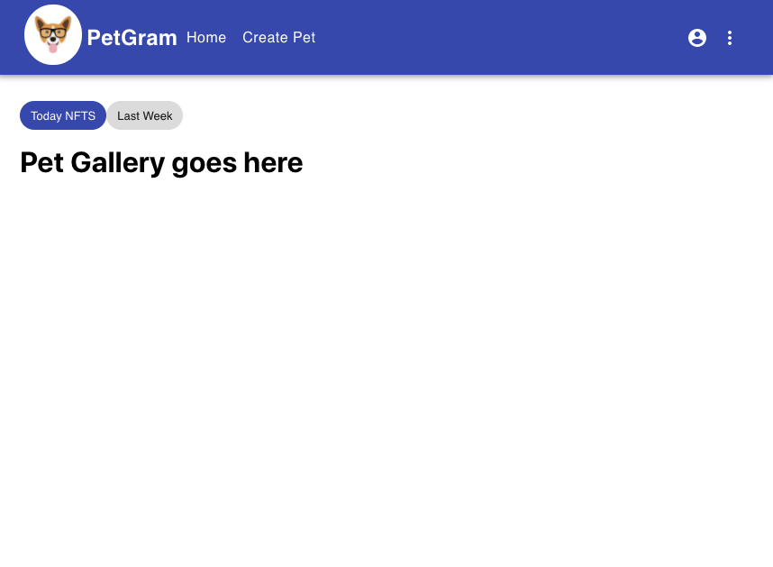

> **Note**: As you move forward with this tutorial, make sure your project is reflecting similar results at a given point. There are screenshots as checkpoints for almost every step.

# Smart Contracts in Solidity

Now let’s start setting up the environment for coding the smart contract. We are going to use Truffle which is a development environment, testing framework and asset pipeline for Ethereum and other EVM compatible blockchains like Polygon.

If you do not already have it installed, install truffle with the command `npm install -g truffle`.

For a default set of contracts and tests, run `truffle init` within the project root directory.

The Truffle initialization process creates three directories: `contracts`, `migrations`, and `test` along with three files `Migrations.sol`, `1_initial_migrations.js`, and `truffle-config.js`.

- `contract/` is where our Solidity smart contract code is stored. You’ll notice that there is already one smart contract in here called `Migrations.sol` which is used during the migration process.

- `migrations/` will store Truffle's "deployer" Javascript files. Every time you want to deploy a contract, you will need to tell Truffle which one, and what constructor arguments you may need. `1_initial_migration.js` is the script that deploys our Migration contract. It is the most basic type of deployment because it requires no library linking, or constructor arguments.

- `test/` is where we can write test cases for our dApp. It can contain .`js` or `.sol` files, depending on your choice of testing language.

- `truffle-config.js` is the main configuration file for your Truffle project. This is where we define which networks to use, how much gas to use, addresses to deploy with and a few other variables.

**truffle-config.js**

Before we can set up some configuration details in `truffle-config.js`, let’s start by removing the existing contents of the file so we have a blank slate. We also need to install the npm packages dotenv and hdwallet-provider. Use the command `npm install dotenv @truffle/hdwallet-provider`.

dotenv is a module that loads environment variables from a `.env` file into JavaScript's process.env. We will use dotenv to store the Secret Recovery Phrase (mnemonic) from Metamask. This is used to generate the addresses available during development on Ganache as well as sign transactions sent from those addresses.

The HDWalletProvider class from Truffle enables the Web3 provider and is used to sign transactions for addresses derived from a 12 or 24 word Secret Recovery Phrase (mnemonic).

Let’s import them to our `truffle-config.js`:

```javascript
require('dotenv').config();
const HDWalletProvider = require('@truffle/hdwallet-provider');
```

We'll also need a `.env` file to store the mnemonic - the twelve word phrase. To create it follow [this guide](https://docs.figment.io/network-documentation/extra-guides/dotenv-and-.env).

Your file should look similar to this:
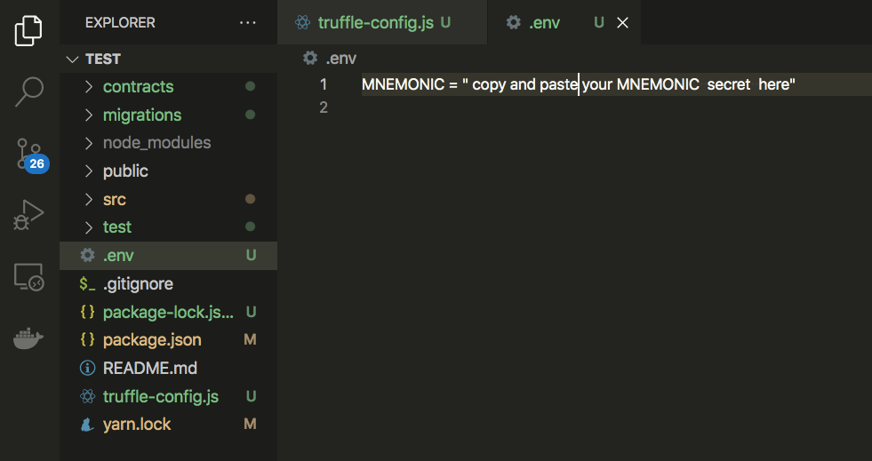

We can initialize the mnemonic as a variable by using `dotenv`, which allows us to access the environment variables from the `.env` file through `process.env` :

```javascript
const mnemonic = process.env.MNEMONIC.toString().trim();
```

Now we need to define the networks we want to use. Networks specify how we connect Truffle to our Ethereum client and let us set the defaults for web3 which is used to send transactions. For this project, we will use the development and the matic network.

The development network is a special network that Truffle uses by default, generally for testing. The basic setup requires a host, a port number, and a network id. More information about the configuration can be found in the [Truffle documentation](https://www.trufflesuite.com/docs/truffle/reference/configuration).

Add the following code to your `truffle-config.js`:

```javascript
require('dotenv').config();
const HDWalletProvider = require('@truffle/hdwallet-provider');
const mnemonic = process.env.MNEMONIC.toString().trim();

module.exports = {
  networks: {
    development: {
      host: '127.0.0.1',
      port: 7545,
      network_id: '*', // Match any network id
    },
    matic: {
      provider: () =>
        new HDWalletProvider(
          mnemonic,
          `https://matic-mumbai.chainstacklabs.com`,
        ),
      network_id: 80001,
      confirmations: 2,
      timeoutBlocks: 200,
      skipDryRun: true,
    },
  },
};
```

We also need to specify the contracts build directory, the Solidity version and the Solidity compiler (solc) defaults.

The contracts build directory is the default output directory path for compiled contracts. In our case, we want the output to be on the frontend of our project.
We can use the Solidity compiler version 0.6.0 and default setup. The number of runs will affect the tradeoff between contract creation gas cost and subsequent function call gas cost. If you don't mind a large upfront cost, you should have more runs of the compiler. Check out the Solidity docs for more info https://docs.soliditylang.org/en/develop/using-the-compiler.html#using-the-compiler.

Add these solc defaults to your `truffle-config.js` file, below the networks:

```javascript
module.exports = {
  networks: {
    development: {
      host: '127.0.0.1',
      port: 7545,
      network_id: '*', // Match any network id
    },
    matic: {
      provider: () =>
        new HDWalletProvider(
          mnemonic,
          `https://matic-mumbai.chainstacklabs.com`,
        ),
      network_id: 80001,
      confirmations: 2,
      timeoutBlocks: 200,
      skipDryRun: true,
    },
  },
  contracts_build_directory: './src/abis/',
  compilers: {
    solc: {
      version: '^0.6.0',
      optimizer: {
        enabled: true,
        runs: 200,
      },
    },
  },
};
```

# Pet.sol

Now let’s start coding the smart contract. Create a new file in the contracts folder, you can open your project in a new terminal and use the command `touch ./contracts/Pet.sol` on Linux/macOS or `type nul > contracts\Pet.sol` on Windows.


This is the file where we’ll write all the Pet's token source code with the Solidity programming language. We are going to design our smart contract to store photos off-chain using IPFS for storing the data. NFT metadata often uses decentralized storage like IPFS or Filecoin. Using NFT metadata allows us to upload data and to receive an IPFS hash of the content (a CID, or Content Identifier) that can be referenced on-chain as a pointer to the content.

Let’s create the basic structure for the smart contract like this:

```javascript
pragma solidity ^0.6.0;
import "@openzeppelin/contracts/token/ERC721/ERC721.sol";

contract Pet is ERC721 {
   constructor() ERC721("Pet", "PET") public  {}
}
```

First, we start off by declaring the version of the Solidity programming language that we’ll use to code the smart contract, in this case, version 0.6.0.

Then, we import the OpenZeppelin Solidity library. We need to install it in our project before continuing. Use the terminal command:

- `npm i @openzeppelin/contracts@3.4.1`

We have created the smart contract called Pet. Notice that our contract is inhering functions and behaviors from the OpenZeppelin ERC721 library:

```javascript
contract Pet is ERC721 {}
```

The remaining code for our contract will go inside of the curly braces. We can customize our token by giving it a name and a symbol like this:

```javascript
contract Pet is ERC721 {
  constructor() ERC721("Pet", "PET") public  {}
}
```

In this step, we added a constructor function to customize the token. The constructor is a function that takes arguments like the name ”Pet" and the symbol “PET". The constructor function runs once and only once when the contract is deployed. Whenever the smart contract is created we'll be able to refer to this contract by the name "Pet" with the help of an ABI ([Application Binary Interface](https://docs.soliditylang.org/en/latest/abi-spec.html)).

Note that we are using the OpenZeppelin ERC-721 standard to create our token. The ERC-721 standard is a set of rules that specifies what functions and behavior smart contracts should have. To learn more, read the [OpenZeppelin docs](https://docs.openzeppelin.com/contracts/4.x/erc721).

Now we can add the mintPetNFT function that will allow us to create new Pet tokens like this:

```javascript
pragma solidity ^0.6.0;
import "@openzeppelin/contracts/token/ERC721/ERC721.sol";

contract Pet is ERC721 {
  constructor() ERC721("Pet", "PET") public  {}


   function mintPetNFT(string memory _tokenURI) external {
       uint _tokenId = totalSupply().add(1);
       _safeMint(msg.sender, _tokenId);
       _setTokenURI(_tokenId, _tokenURI);
       emit PetNFTCreated(_tokenId, _tokenURI, now, msg.sender);
    }

 }
```

This is the basic structure of the function. It will accept one argument of string data type, which will be a path for the IPFS image (where the image is located). The tokenId variable is declared as a uint data type which means unsigned integer (can only be a number 0 or above, not a negative number). This variable holds an unique identifier number for every Pet token.

The `_safeMint` function takes the user's wallet address and the tokenId to create and set ownership of the NFT. The `_setTokenURI` function takes the tokenId and the tokenURI (the location of the image) and links them together. We do this so that every token has an identifier, an owner, and an image path.
Then we emit an event with the tokenId, tokenURI, timestamp and user wallet address by calling the `emit` function and naming it "PetNFTCreated".

Lastly, we need to define the PetNFTCreated event. This event is really helpful for transaction confirmations, everytime we mint an NFT it will return the NFT tokenId, the imagePath, the time, and user wallet address.

```javascript
// SPDX-License-Identifier: MIT
pragma solidity ^0.6.0;
import "@openzeppelin/contracts/token/ERC721/ERC721.sol";

contract Pet is ERC721 {

  constructor() ERC721("Pet", "PET") public  {}
  event PetNFTCreated (

    uint tokenId,
    string imageURL,
    uint date,
    address payable from
  );

  function mintPetNFT(string memory _tokenURI) external {
    uint _tokenId = totalSupply().add(1);
    _safeMint(msg.sender, _tokenId);
    _setTokenURI(_tokenId, _tokenURI);
    emit PetNFTCreated(_tokenId, _tokenURI, now, msg.sender);
  }
}

```

Before we continue, let's ensure that everything is working properly. In your terminal, make sure you are in the project root directory and run the command `truffle compile`.

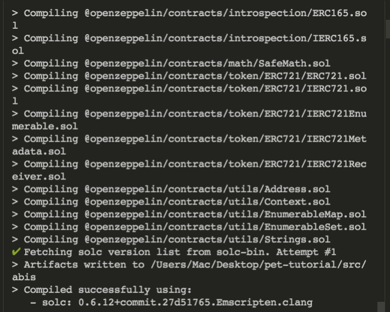

Now, let's deploy our smart contract to the development local blockchain. First, make sure that Ganache is running (in its own terminal window/tab). Then, create a new migration file in the `migrations` directory called `2_deploy_contracts.js`.

Add the following code to this new file:

```javascript
const MyPet = artifacts.require('Pet');
module.exports = function (deployer) {
  deployer.deploy(MyPet);
};
```

This simple JavaScript file is responsible for deploying the smart contract to the blockchain. We can execute this file, and put the smart contract on the local blockchain by running the Truffle migration like this:

```text
truffle migrate
```

You should see similar results.


# Deploying the smart contract to Polygon Mumbai Testnet

To deploy the smart contract on the Polygon Mumbai testnet you need to fund your account. If you need help with this check out this [guide](https://learn.figment.io/tutorials/fund-a-polygon-account).

Let's deploy the smart contract using the command:

```javascript
truffle migrate --network matic
```

If you're deploying it for the second time or more, use the `--reset` flag to avoid JSON errors:
`truffle migrate --network matic --reset`.

As long as the deployment was successful, the output should be similar:
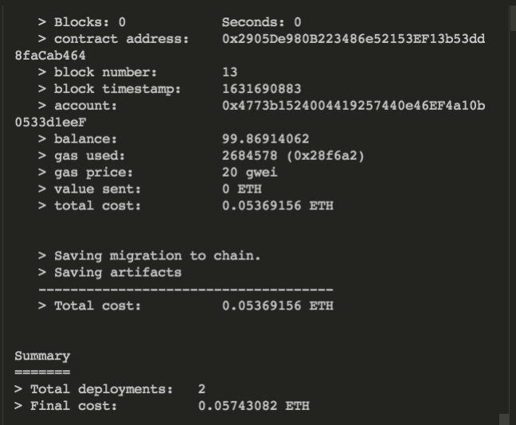

# Building the React front-end

Path: `/src/components/`

React applications consist of various components, for example, a navigation bar, main page, footer, etc.

React loads a single HTML page (`/public/index.html`) which is then populated with all the components that are defined in the project. If you open the components folder you will see the general structure for our project that contains the following folders:

- `commons/`: Contains the CircularProgress component that renders whenever a page is loading.
- `create-post/`: This directory is where we will add our functionality to create new posts
- `home-container/`: Has three subfolders
  - `home/`: This directory is a container for the Gallery (PetGallery) and it contains HTML for our labels and buttons.
  - `gallery/`: This directory is where we will keep code related to fetching all Pets from nft.storage and rendering them with their basic information.
  - `pet-details/`: This ditrectory holds the component we will use to display all the information of a pet, as well as mint NFTs.

# App.js

Let’s work on the main file of our React UI: `App.js` will contain all of the components that make up our React application (navbar, main, footer, home, etc).

When you open the `App.js` file, you'll notice that we are using the React Router DOM module to implement dynamic routing in our web app. Unlike the traditional routing architecture in which the routing is handled in a configuration outside of a running app, React Router DOM facilitates component-based routing according to the needs of the app and platform.

So far we have initialized a few functions that we will implement in a little bit. We also defined our routes, we have wrapped them with the Router element that contains components (called children). A child component can take any properties (more about this later).

Notice that anything outside the switch statement will be displayed on the main page, the main purpose of React router is to serve a different component for each path.

```javascript
import React from 'react';
import { BrowserRouter as Router, Switch, Route } from 'react-router-dom';
import './App.css';
import { Navbar } from './components/layout/navbar/Navbar';
import Footer from './components/layout/footer/Footer';
import Home from './components/home-container/home/Home';
import PetDetails from './components/home-container/pet-details/PetDetails';
import CreatePet from './components/create-post/CreatePet';

function App() {
  // Add variables

  const loadWeb3 = async () => {};

  const getContract = async () => {};

  const connectWallet = async () => {};

  return (
    <Router>
      <div className="cl">
        <Navbar />
        <Route exact path="/" component={Home} />
        <Switch>
          <Route exact path="/create-pet" component={CreatePet} />
          <Route path="/pet-details/:petId">
            <PetDetails />
          </Route>
        </Switch>
        <Footer />
      </div>
    </Router>
  );
}

export default App;
```

We need to connect our React front-end to the blockchain network so it can interact with the smart contract. Let's start by installing web3 with the command `npm install web3`. Then import web3, useState and the smart contract's ABI (in .json format):

```javascript
import Web3 from 'web3';
import MyPet from './abis/Pet.json';
import { useState } from 'react';
```

Web3 is a collection of libraries that allow us to interact with a local or remote Ethereum node using HTTP, IPC, or WebSockets.

We also need a few variables to keep track of the app state. Inside the function App, add these variables under the comment "Add variables":

```javascript
const [account, setAccount] = useState('');
const [contractData, setContractData] = useState('');
```

We are using the React useState hook to keep track of the app state. Using this hook inside a functional component, you can create a piece of state without switching to class components that have a built-in state object.

Let's examine this variable declaration:

```javascript
const [account, setAccount] = useState('');
```

The first part of this statement (account) is a variable that is initialized as an empty string. setAccount is a function that sets new values to the account variable.

Now we need to implement the `loadWeb3` function, this function will load web3 into our app. Edit the `loadWeb3` function so that it looks like this:

```javascript
const loadWeb3 = async () => {
  if (window.ethereum) {
    window.web3 = new Web3(window.ethereum);
    await window.ethereum.request({ method: 'eth_requestAccounts' });
  } else if (window.web3) {
    window.web3 = new Web3(window.web3.currentProvider);
  } else {
    window.alert(
      'Non-Ethereum browser detected. You should consider trying Metamask!',
    );
  }
};
```

This code is an example of how to load web3 properly using `request` and specifying the `eth_requestAccounts` method. It takes the Ethereum provider from Metamask and injects it to your dApp, if your browser does not have Metamask installed then it will show a pop-up message: "Non-Ethereum browser detected. You should consider trying Metamask!"

Let's move on to the `getContract` function, this function will connect our app to the smart contract. Edit the `getContract` function so that it looks like this:

```javascript
const getContract = async () => {
  const web3 = window.web3;
  const accounts = await web3.eth.getAccounts();
  setAccount(accounts[0]);
  const networkId = await web3.eth.net.getId();
  const networkData = MyPet.networks[networkId];

  if (networkData) {
    const abi = MyPet.abi;
    const address = MyPet.networks[networkId].address;
    const myContract = new web3.eth.Contract(abi, address);
    setContractData(myContract);
  } else {
    window.alert(
      'Contract is not deployed to the detected network. Connect to the correct network!',
    );
  }
};
```

In the `getContract` function, we're going to load the connected account & connect it with the network ID. If the smart contracts are not deployed to the respective network, then it will display a pop-up "Contract not deployed to the detected network. Connect to the correct network!"

Now that we have a way to connect to the web3 and a connection to our contract, we can use these functions. Let's call these functions inside the `connectWallet` function. Edit the `connectWallet` function, it should look like this:

```javascript
const connectWallet = async () => {
  await loadWeb3();
  await getContract();
};
```

Now that we have the `account` variable and the `connectWallet` function we need to pass them to our `Navbar` component. This component will use them to connect to our wallet, to accomplish this we need to add a "Connect Wallet" button inside the Navbar.js file. We'll take care of this when we move to the Navbar. For now, we just need to pass the `account` variable and the `connectWallet` function to the Navbar as properties. Edit the `Navbar` route so that it looks like the following:

```javascript
<Navbar account={account} connectWallet={connectWallet} />
```

Similarly, the `PetDetails` component needs the `account` and `contractData` variables to mint NFTs so edit the `PetDetails` route so that it looks like the following:

```javascript
<PetDetails account={account} contractData={contractData} />
```

Yay!! We are done with the App.js file and now our front-end is connected to the blockchain.

Have you noticed that we are using the Async/Await? Here is a breve explanation about the Async/Await concept.

- **Async**: it simply allows us to write promises based code as if it was synchronous and it checks that we are not breaking the execution thread. It operates asynchronously via the event-loop. ​​
- **Await**: can be put in front of any async promise-based function to pause your code on that line until the promise fulfills, then return the resulting value. You can use await when calling any function that returns a Promise, including web API functions.

You can find a simple explanation of Async/Await function [here](https://www.geeksforgeeks.org/async-await-function-in-javascript/).

# navbar.js

- path: `src/components/layout/navbar/navbar.js`

In the Navbar component, we're displaying the brand logo, brand name, and a link to create new posts. We're using [Material UI](https://material-ui.com/) to create the basic structure for the Navbar and Footer components.

Let's move to the important stuff, remember that we are passing some properties(account, connectWallet) to our navbar component?

Let's wrap the whole Navbar component with the withRouter, this should include all the functions, variables, and the HTML. This should be a long component but for simplicity, I am just showing the start and the end of our Navbar component. What you can do is to edit the start of the component line 22 and edit the end by adding the closing curly brackets and parentheses.

Let's edit our Navbar component so that it looks like this:

```javascript
export const Navbar = withRouter(({ account, connectWallet }) => {
  const [anchorEl, setAnchorEl] = useState(null);
  const [mobileMoreAnchorEl, setMobileMoreAnchorEl] = useState(null);
  // Remember to include all the existing code inside the withRouter
});
```

We are using withRouter that was already imported from `react-router-dom` at the top of the file. withRouter is a higher order component that takes in the `account` and `connectWallet` properties. withRouter is responsible for passing the closest route's match, current location, and history props to the wrapped component whenever it renders. Simply put, it connects our component to the router and passes properties to this file.

Now that we have the wallet account, we can add the following code under the comment "Add Account":

```javascript
{
  account ? (
    <>
      <Button className="whiteLink">
        {account.substring(0, 8)}...{account.substring(32, 24)}
      </Button>
      <Button
        variant="contained"
        className="connected-btn"
        endIcon={<VerifiedUserSharpIcon />}
      >
        Connected
      </Button>
    </>
  ) : (
    <Button
      variant="contained"
      className="connect-wallet-btn"
      onClick={() => {
        connectWallet();
      }}
    >
      Connect Wallet
    </Button>
  );
}
```

In this snippet of code, we are checking if the account exists then we display the wallet address. Otherwise, we display the button with the label `Connect Wallet`. At this point, whenever you click the `Connect Wallet` button it should prompt you to connect your Metamask, and the UI should change to reflect the connected wallet.

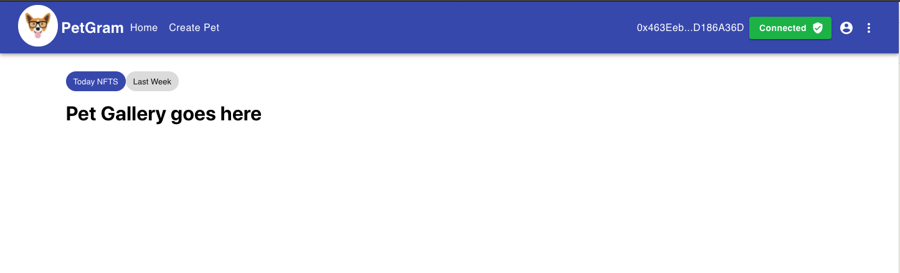

# CreatePet.js

- path: `src/components/create-post/CreatePet.js`

To get this file working, we need to install nft.storage. Let's install this package with the command `npm install nft.storage`.

Then import the following code:

```javascript
import { NFTStorage, File } from 'nft.storage';
import { createRef } from 'react';
import { apiKey } from '../../APIKEYS';
```

As you can see we are importing a few things here:

- `NFTStorage`: is a client library that provides a convenient interface for working with the Raw HTTP API from a web browser or Node.js.

- `File`: allows us to create a new file object with an image name and type.

- `createRef`: receives the underlying DOM element as its current property. In other words, creates a reference from React elements via the ref attribute.

- `apiKey`: this is our apiKey credentials so that our dApp can talk to the nft.storage API.

To get your API key, go to [nft.storage](https://nft.storage), sign up for an account, create a new API key and then add it to your APIKEYS.js file.

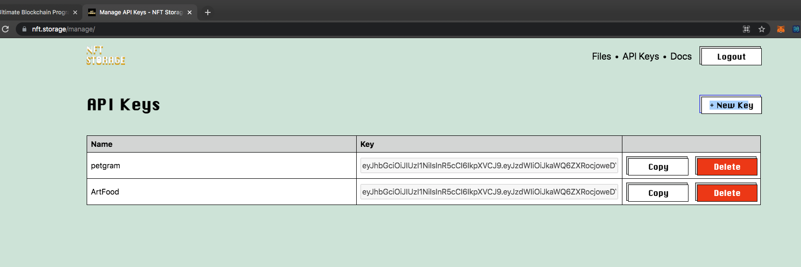

Don’t forget to create your APIKEYS.js inside src, it should look something like this:

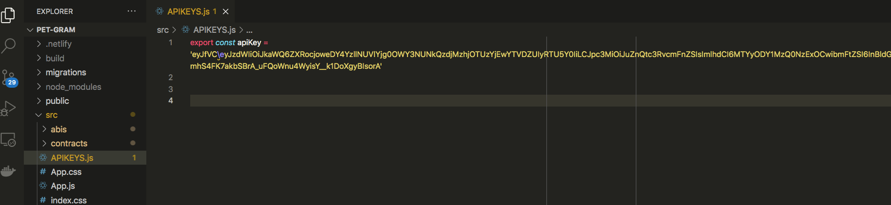

To create a new pet, we need a few variables and functions. Let's add all the functions to collect the user input like the pet name, the owner name, the image type, etc.

Add the following code under the comment "Add variables". It should look like this:

```javascript
function CreatePet() {
  // Add variables
  const history = useHistory()
  const [image, setImage] = useState('')
  const petTypeRef = createRef()
  const [petName, setPetName] = useState('')
  const [loading, setLoading] = useState(false)
  const [ownerName, setOwnerName] = useState('')
  const [imageName, setImageName] = useState('')
  const [imageType, setImageType] = useState('')
  const [petType, setPetType] = useState('')
  ...
}
```

Notice that almost every variable starts as an empty string. As the user types in the input we will save it into our component state. Then, we will pass them to our API call to store them in IPFS. Remember, to keep track of the state we are using the useState React hook.

We still need two more functions:

- The `handleImage` function will be responsible for updating the variables with the user input. Add the following code, so that `handleImage` looks like this:

```javascript
const handleImage = event => {
  setImage(event.target.files[0]);
  setImageName(event.target.files[0].name);
  setImageType(event.target.files[0].type);
};
```

As you can see the `handleImage` function takes in an event and it saves the information to the state.

- The `handleSubmit` function that will be responsible for uploading the data to IPFS with nft.storage. Edit the `handleSubmit` function so it looks like this:

```javascript
const handleSubmit = async event => {
  event.preventDefault();
  try {
    setLoading(true);
    const client = new NFTStorage({ token: apiKey });
    const metadata = await client.store({
      name: petName,
      description: `${ownerName}, ${petType}`,
      image: new File([image], imageName, { type: imageType }),
    });
    if (metadata) {
      history.push('/');
    }
  } catch (error) {
    console.log(error);
    setLoading(false);
  }
};
```

In the `handleSubmit` function, we are using the NFTStorage client library to upload our data. This client library takes our API keys, and it requires us to format the data into an object with name, description, and image. Then we check if our data was successfully saved, it redirects the user to the main page. Otherwise, throws an error message.

Now, we need a form to create new post, let’s add this form under the comment "Add Form":

```javascript
{
  image ? (
    
  ) : (
    ''
  );
}
<div className="form-container">
  <form className="form" noValidate autoComplete="off">
    <input
      accept="image/*"
      className="input"
      id="icon-button-photo"
      defaultValue={image}
      onChange={handleImage}
      type="file"
    />
    <label htmlFor="icon-button-photo">
      <IconButton color="primary" component="span">
        <PhotoCamera />
      </IconButton>
    </label>
    <TextField
      fullWidth
      id="outlined-basic"
      label="Pet's name"
      variant="outlined"
      className="text-field"
      defaultValue={petName}
      onChange={e => setPetName(e.target.value)}
    />
    <TextField
      fullWidth
      id="outlined-basic"
      label="Owner's name"
      variant="outlined"
      className="text-field"
      defaultValue={ownerName}
      onChange={e => setOwnerName(e.target.value)}
    />
    <TextField
      fullWidth
      name="petType"
      select
      label="Choose one option"
      variant="outlined"
      className="text-field"
      onChange={e => setPetType(e.target.value)}
      defaultValue=""
      ref={petTypeRef}
    >
      <MenuItem value="Cat">Cat</MenuItem>
      <MenuItem value="Dog">Dog</MenuItem>
      <MenuItem value="Bird">Bird</MenuItem>
      <MenuItem value="Fish">Fish</MenuItem>
      <MenuItem value="Other">Other</MenuItem>
    </TextField>
    <Button
      size="large"
      variant="contained"
      color="primary"
      onClick={handleSubmit}
    >
      Submit
    </Button>
  </form>
</div>;
```

For a good user experience, we are adding a preview of the image being uploaded. In this part, we are saying that if the image exists then create an image and render it, otherwise display an empty space.

Then we added a simple form with an image field, two text fields for the owner name and pet name. As well as a drop down menu for the pet type. All of them are bound to a variable and to the onChange function. Lastly, we have the submit button bound to the handleSubmit function to send the data to the nft.storage API.

Now, go to http://localhost:3000/create-pet and try to create a new post. It should look like this:
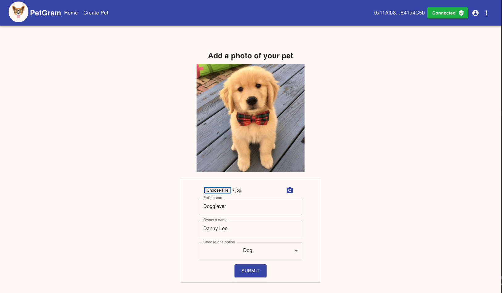

Also, it should send the information to the nft.storage. To check, go to https://nft.storage/files/ it should have one file:
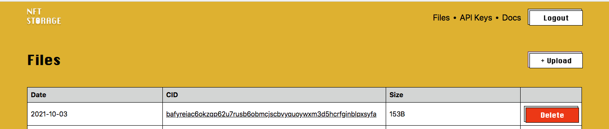

Yay!! Now that we are able to create new posts, let's move to the pet gallery. At this point, feel free to add a few posts so that we can display them in the `PetGallery.js` component.

# PetGallery.js

- path: `src/components/home-container/gallery/PetGallery.js`

In this component, we are going to render a gallery with all the NFTs. Let’s get started by importing our `apiKey` file and the `Link` from `react-router-dom`.

```javascript
import { apiKey } from '../../../APIKEYS';
import { Link } from 'react-router-dom';
```

React Router provides a `Link` component that creates links in our application.

Currently, our imports should look like this:

```javascript
import React, { useEffect, useState } from 'react';
import CircularStatic from '../../commons/CircularProgressWithLabel';
import ImageListItem from '@material-ui/core/ImageListItem';
import IconButton from '@material-ui/core/IconButton';
import Button from '@material-ui/core/Button';
import ImageListItemBar from '@material-ui/core/ImageListItemBar';
import { Grid } from '@material-ui/core';
import './PetGallery.css';
import { apiKey } from '../../../APIKEYS';
import { Link } from 'react-router-dom';
```

As you can see we have one component and a few elements from material-ui but the most important is the `CircularStatic` component. This component is a circular progress bar that renders whenever our page is loading. The rest of the elements are just HTML tags that will help us create our gallery.

Now we need to fetch the Pet's data from IPFS and display them into our app. Edit the `useEffect`React Hook function so that it looks like this:

```javascript
useEffect(() => {
  const loadPets = async () => {
    try {
      setLoading(true);
      let cids = await fetch('https://api.nft.storage', {
        headers: {
          Authorization: `Bearer ${apiKey}`,
          'Content-Type': 'application/json',
        },
      });
      cids = await cids.json();
      const temp = [];
      for (let cid of cids.value) {
        if (cid?.cid) {
          let data = await fetch(
            `https://ipfs.io/ipfs/${cid.cid}/metadata.json`,
          );
          data = await data.json();

          const getImage = ipfsURL => {
            if (!ipfsURL) return;
            ipfsURL = ipfsURL.split('://');
            return 'https://ipfs.io/ipfs/' + ipfsURL[1];
          };

          data.image = await getImage(data.image);
          data.cid = cid.cid;
          data.created = cid.created;
          temp.push(data);
        }
      }
      setPetsData(temp);
      setLoading(false);
    } catch (error) {
      console.log(error);
      setLoading(false);
    }
  };
  loadPets();
}, []);
```

We declare the petsData variable which is initialized as an empty array, as well as the `setPetsData` function. We do this with the useEffect React hook which is telling React that our component needs to do something after rendering.

Notice that we are calling the `loadPets` function at the end of useEffect. The `loadPets` function takes your API key, fetches the pet's information from IPFS storage, then returns the content identifier that contains the NFT information. We loop through the cids array, find its id and create the data variable that will hold the NFT metadata, then we call the `getImage` function.

Lastly, we need to attach the image, the content identifier (CID), and the timestamp to the data variable. Then, we push it into a temporary array and at the end we set it to be the state variable petsData.

The function `getImage` takes the URL path and splits it by this character '://'. Split is a JavaScript function that returns an array of elements. Then, `getImage` returns the correct path by adding the second element of the array. We need to do this because an IPFS URL does not retain the original path, but instead requires a conversion step to/from URI representation. To learn more, check the [IPFS docs](https://docs.ipfs.io/how-to/address-ipfs-on-web/#native-urls).

Note: CIDs reference immutable content so you can be sure the content you access is the content referenced in the NFT.

Now, let’s render this data. Add the following code under the comment "Add pet's Data":

```javascript
{
  loading ? (
    <CircularStatic />
  ) : (
    <div style={{ flexGrow: 1 }}>
      <Grid container spacing={1}>
        {petsData.length ? (
          petsData.map((pet, index) => (
            <Grid item xs={6} sm={3} key={index}>
              <ImageListItem style={{ height: '450px', listStyle: 'none' }}>
                
                <ImageListItemBar
                  title={pet.name}
                  subtitle={<span>by: {pet.description}</span>}
                  actionIcon={
                    <IconButton
                      aria-label={`info about ${pet.name}`}
                      className="icon"
                    >
                      <Button
                        variant="contained"
                        size="small"
                        component={Link}
                        to={`/pet-details/${pet.cid}`}
                        className="view-btn"
                      >
                        View
                      </Button>
                    </IconButton>
                  }
                />
              </ImageListItem>
            </Grid>
          ))
        ) : (
          <h2>No Pets Yet...</h2>
        )}
      </Grid>
    </div>
  );
}
```

In this snippet of code, we are checking if loading is true then we will display the loading component. If loading is false, it means that we have the petsData array, therefore we can loop through the petsData and return a list of items with the pet image, name, and a button to see more details.

If the `petsData` array is empty it will display "No Pets Yet...".

In our case, we should have at least one pet in our petsData array. Feel free to add more so you can see a similar gallery to this one.


# PetDetails.js

- path: `src/components/home-container/pet-details/PetDetails.js`

In this file, we will add pet details, the functionality to mint NFTs, a transaction confirmation for minting tokens, and a simple React form to add comments. For the scope of this tutorial, we are not going to save the comments or implement likes functionality but feel free to expand on it.

To implement this we need a few things. Let's start by importing our `apiKey` by adding the following line:

```javascript
import { apiKey } from '../../../APIKEYS';
```

Currently, our imports should look like this:

```javascript
import React, { useState, useEffect } from 'react'
import { useParams } from 'react-router'
import FavoriteIcon from '@material-ui/icons/Favorite'
import ShareIcon from '@material-ui/icons/Share'
import {
  TextField,
  List,
  ListItem,
  ListItemAvatar,
  ListItemText,
  Avatar,
  IconButton,
  Grid,
  Container,
  Typography,
  Button,
  Card,
  StylesProvider,
} from '@material-ui/core'
import './PetDetails.css'
import { apiKey } from '../../../APIKEYS'
...
```

As you can see, we are still using useState and useEffect - React hooks that help us to manage the state of the app.

useState allows our functional components to become stateful and useEffect allows our functional component to leverage the component lifecycle hooks which were, in the past, only supported for class components. Simply put, useEffect is like a combination of componentDidMount, componentDidUpdate and componentWillUnmount. To learn more, check out the documentation on [React hooks](https://reactjs.org/docs/hooks-effect.html).

We are using `useParams` to access the parameters of the current route. In this case, we need the pet id to fetch the pet's data from IPFS.

The `StylesProvider` is a Material-UI component that helps us change how styles are applied to our component. The rest of the imports are just regular elements from Material-UI

We need a few variables to hold the pet's information. Add the following code under the comment "Add state variables":

```javascript
const [image, setPetImage] = useState('');
const [petName, setPetName] = useState('');
const [petOwner, setOwnerName] = useState('');
const [petCategory, setPetCategory] = useState('');
const [input, setInput] = useState('');
const [comment, setComment] = useState('');
const [codeHash, setCodeHash] = useState('');
```

So far our state varibles should llok like this:

```javascript
const { petId } = useParams();
// Add state variables
const [image, setPetImage] = useState('');
const [petName, setPetName] = useState('');
const [petOwner, setOwnerName] = useState('');
const [petCategory, setPetCategory] = useState('');
const [input, setInput] = useState('');
const [comment, setComment] = useState('');
const [codeHash, setCodeHash] = useState('');
```

The `{ petId }` is extracting the petId value from the useParams object. As for the rest of the variables, all of them are initialized as an empty string. Later on, we will update them.

For now, let's move on to the useEffect function. Currently we have it like this:

```javascript
useEffect(() => {
  if (petId) {
    getMetadata();
    getImage();
  }
}, [petId, contractData]);
```

As you can see the `useEffect` function is calling the `getImage` and the `getMetadata` function. Let's implement the `getImage` function first, edit this function so that it looks like this:

```javascript
const getImage = ipfsURL => {
  if (!ipfsURL) return;
  ipfsURL = ipfsURL.split('://');
  return 'https://ipfs.io/ipfs/' + ipfsURL[1];
};
```

If you remember we used this function in the `PetGallery` component, we could have created a snippet of code for this function and import it but for clarity purposes, let's keep it simple.

Let's continue with the `getMetadata` function. Edit this function so that it looks like this:

```javascript
const getMetadata = async () => {
  let data = await fetch(`https://ipfs.io/ipfs/${petId}/metadata.json`);
  data = await data.json();
  const [petOwner, petCategory] = data.description.split(',');
  const imageFormated = getImage(data.image);
  setPetImage(imageFormated);
  setPetName(data.name);
  setOwnerName(petOwner);
  setPetCategory(petCategory);
};
```

The `getMetadata` function is responsible for fetching the metadata from IPFS for a specific pet. It does this by providing the petId, then makes an API call, and returns the pet's data. Before saving the `petOwner` and the `petCategory` variables it extracts them from the `data.description` by splitting the data by a comma. Then it calls the `getImage` function to format correctly the image path and finally it saves them to their corresponding variables.

At this point we can display the pet details but we will need the `mintNFT` function. Let's add it now, edit this function so that it looks like this:

```javascript
const mintNFT = async petId => {
  try {
    const data = await contractData.methods
      .mintPetNFT(`https://${petId}`)
      .send({ from: account });

    setCodeHash(data);
  } catch (err) {
    console.error(err);
  }
};
```

As you can see, the PetDetails component is getting some props for the account and for the contractData, we can use them to interact with the smart contract. All we need to do is to call the `mintPetNFT` contract method. This function takes in the petId, calls the contract's `mintPetNFT` method with the pet id and the user account, then saves the returned data to the component state using the setCodeHash function.

Awesome! Now we just need to display this information. Let's add this code under the section "Add pet details":

```javascript
<div className="flex-container">
  <h2>{`${petName} the ${petCategory}`}</h2>
  <Button
    variant="contained"
    className="wallet-btn"
    color="primary"
    onClick={mintNFT}
  >
    Mint NFT
  </Button>
</div>


<div className="flex-container">
  <div>
    <IconButton aria-label="add to favorites">
      <FavoriteIcon />
    </IconButton>

    <IconButton aria-label="share">
      <ShareIcon />
    </IconButton>
  </div>

  <Typography variant="body1" color="primary">
    0 Likes
  </Typography>
</div>

<Typography gutterBottom variant="subtitle1" className="details-text">
  Pet's Details
</Typography>

<Typography variant="body2" gutterBottom className="details-text">
  Full rights and credits to the owner @{petOwner}...
</Typography>
```

In this code, we just simply inserting the pet details we got from IPFS. Notice the "Mint NFT" button is connected to the `mintNFT` function. This function will mint NFTs for us.

At this point, our component should display something similar to this:

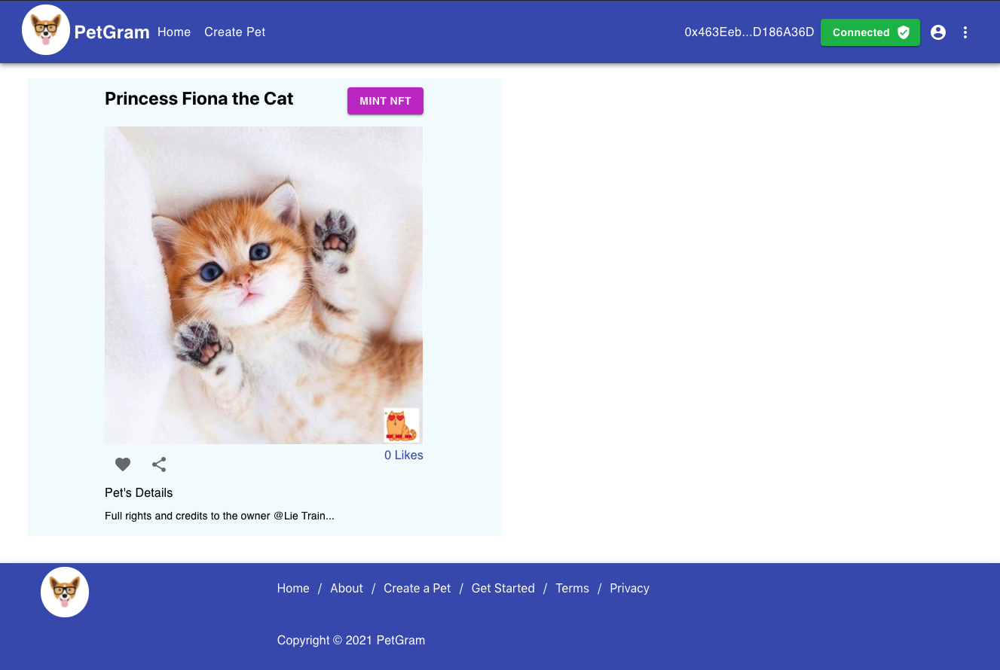

We are still missing the transaction confirmation for minting tokens, the React form to add comments. Let's start by adding the transaction confirmation. Whenever we mint NFTS we need a confirmation that notifies us if our transaction was successful or not. Let's add the following code under the section "Add Transaction Confirmation":

```javascript
{
  codeHash ? (
    <Card className="code-hash">
      <Typography gutterBottom variant="subtitle1">
        Confirmation Transaction:
      </Typography>
      <p>
        TransactionHash: <span>{codeHash.transactionHash}</span>{' '}
      </p>
      <a
        target="_blank"
        rel="noopener noreferrer"
        href={'https://mumbai.polygonscan.com/tx/' + codeHash.transactionHash}
      >
        <Button variant="contained" color="primary" className="wallet-btn">
          See transaction
        </Button>
      </a>
    </Card>
  ) : (
    ''
  );
}
```

Remember our `mintPetNFT` function? This function returns an object data, inside this object is the transaction hash. A transaction hash is a unique string of characters that is given to every transaction that is verified and added to the blockchain. To see this transaction, all we need to do is to add the Polygonscan link plus the `transactionHash`.

Now, try to mint an NFT by clicking the "Mint NFT" button. Before you click make sure your wallet is connected. Once you click the "Mint NFT" button metamask should prompt, go ahead and confirm the transaction.

This transaction might take a few minutes and the process will be:

1.  Confirm the transaction
2.  The transaction goes the queue
3.  The transaction is pending
4.  The transaction is complete


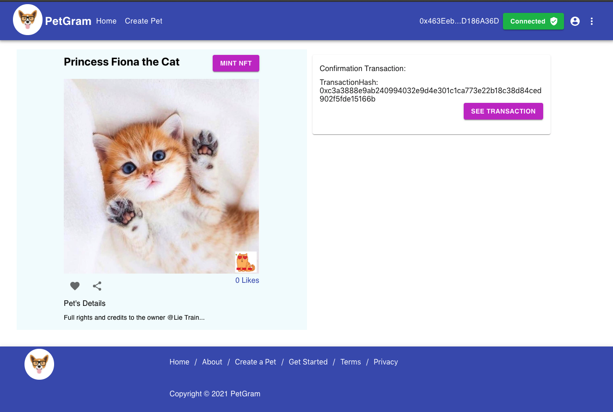

Now, whenever we mint an NFT we will get this confirmation and we will be able to view the transaction details on the Polygonscan.

Awesome, we are at the last part! It has been a long tutorial but we have learned a lot. Let's add the last part which is the React form. Add the following code under the comment "Add form":

```javascript
<form noValidate autoComplete="off">
  <TextField
    id="outlined-basic"
    label="Comment"
    variant="outlined"
    value={input}
    onChange={handleChange}
    className="text-field"
  />
</form>
<Button type="submit" variant="contained" onClick={handleSubmit}>
  Add comment
</Button>
```

This is a simple form to add comments. Notice the TextField requires the `handleChange` function and the submit button requires the `handleSubmit` function, so let's add them as well. Edit these functions so they look like the following:

```javascript
const handleChange = event => {
  setInput(event.target.value);
};

const handleSubmit = event => {
  event.preventDefault();
  setComment(input);
  setInput('');
};
```

The `handleChange` function sets the user input to the `input variable`. Then the `handleSubmit` function sets the `comment variable` to be equal to the `input variable` and then resets the input variable to an empty string. We are using the `input variable` as a temporary variable so that we can reset the form text field.

Now, we need to display the comments on our page. To do this, add the following code under the section "Display comments":

```javascript
{
  comment ? (
    <ListItem style={{ paddingLeft: '0px' }}>
      <ListItemAvatar>
        <Avatar alt="Remy Sharp" />
      </ListItemAvatar>
      <ListItemText
        secondary={
          <React.Fragment>
            <Typography
              component="span"
              variant="body2"
              className="inline"
              color="textPrimary"
            >
              {account}:
            </Typography>
            {` ${comment}`}
          </React.Fragment>
        }
      />
    </ListItem>
  ) : (
    <h2>No comments</h2>
  );
}
```

We are adding the user's account and the comment to the UI. Try to post a comment, the result should look similar to this:

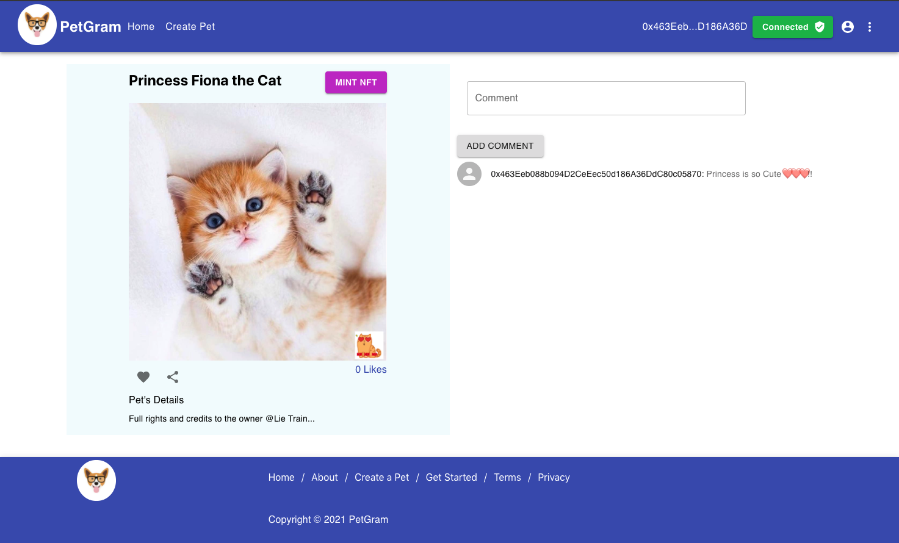

Remember that we are not saving the comments, so as soon as you refresh the page the comments will disappear.

# Conclusion

Congratulations! You have created your own fullstack dApp😎🦄!! After completing this tutorial, you should have a good understanding of how to create a dApp for creating and managing NFTs.

# About the Author

Albert Carbajal is a web developer, blockchain enthusiast with a passion for Software Development, & Decentralization. Feel free to connect with me on [GitHub](https://github.com/electrone901).

# References

- Truffle docs: https://www.trufflesuite.com/docs/truffle/overview
- Polygon (Matic) docs: https://docs.matic.network/docs/develop/getting-started
- MetaMask docs: https://docs.metamask.io/guide/#why-metamask
- Web3 docs: https://web3js.readthedocs.io/en/v1.4.0/
- React docs: https://reactjs.org/docs/getting-started.html
- IPFS docs: https://docs.ipfs.io/concepts/what-is-ipfs/#decentralization
- Async/Await: https://www.geeksforgeeks.org/async-await-function-in-javascript
- Material-ui components: https://material-ui.com
- React Hooks: https://reactjs.org/docs/hooks-effect.html
