# Introduction

In this tutorial we are going to create an art gallery where users can move around freely and see various artworks. These artworks will be stored as NFTs on the blockchain. Our application is comprised of two parts, an NFT Marketplace Smart contract that will be present on the blockchain (we are using Mumbai Testnet in this tutorial) and a 3D game built using Unity3D game engine that will be used to fetch the NFTs listed in the Marketplace smart contract and display them inside an interactive 3D art gallery.

# Prerequisites

This tutorial assumes you have completed the [Create an NFT smart contract with HardHat](https://learn.figment.io/tutorials/create-nft-smart-contract-with-hardhat) and [Building an NFT Marketplace using HardHat](https://learn.figment.io/tutorials/build-an-nft-marketplace-using-hardhat) tutorial. It is also recommend to have basic idea of Unity3D game engine. It is highly recommended that you complete the [Create a Personal 3D Gallery Project with Unity](https://learn.unity.com/project/create-a-personal-3d-gallery-project-with-unity?uv=2019.4) with Unity version `2019.4`. Besides this, knowledge and understanding of C# and how to use C# Script with Unity3D will be very helpful.

# Requirements

The requirements for this tutorial are:

- Install [Unity Hub](https://unity.com/) and Unity3D version `2019.4`. Using UnityHub you can install multiple versions of Unity3D simultaneously.
- Already have an NFT Marketplace smart contract deployed to the Mumbai Testnet.

# Environment setup

Open Unity Hub and create a new Unity3D project with the `3D` template. Make sure you are using version `2019.4` (the subversion may differ). It is recommended to use a relatable name. We will name our project **Figment 3D Art Gallery**, however any other name will work as well.

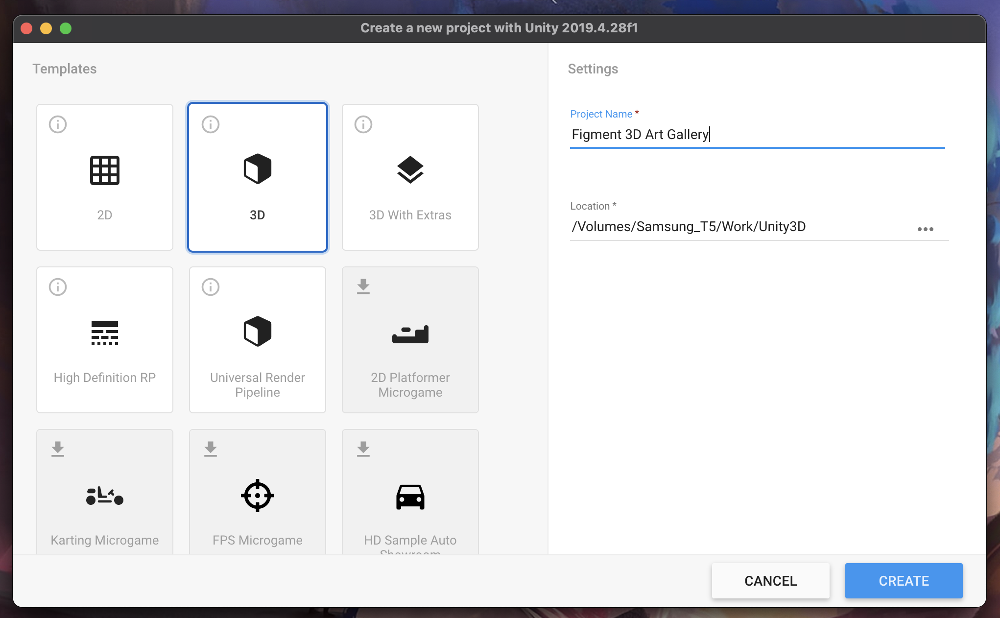

This will create an Empty Unity3D project to begin with

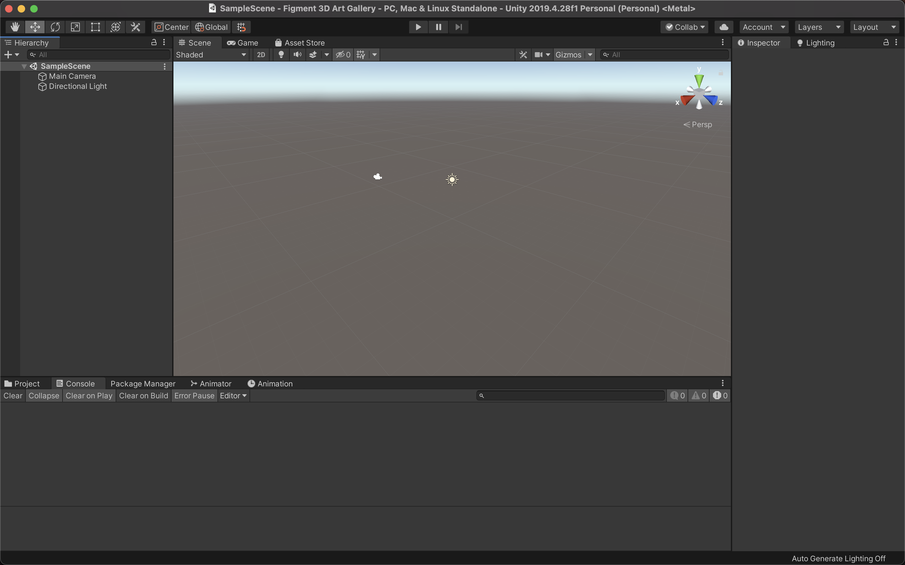

The interface of Unity3D is divided into various **Window,** each with it's own unique purpose. These windows can be arranged freely by the developers and hence they are referred to by their name rather than location. You can get a detailed tour of Unity's User Interface [here](https://docs.unity3d.com/2019.4/Documentation/Manual/UsingTheEditor.html).

# Project Initiation

It is important to visualise how our end project should look and what features we want in our project. The kew feature that we want in our project are:

- A 3D virtual world representing an Art Gallery where the player can freely mode around.
- Various art works must be displayed throughout this Art Gallery.
  - This Art works will be representing NFT present in the blockchain.
  - Only the NFTs listed in the Marketplace Smart contract will be displayed.
- The users should be able to view the information about the NFTs when they move close to them.

[Create a Personal 3D Gallery Project with Unity](https://learn.unity.com/project/create-a-personal-3d-gallery-project-with-unity?uv=2019.4) is an official Unity tutorial that teaches us how to create an Art Gallery. While building our project we will be taking inspiration from this tutorial and using some of the assets available here.

**Note:** Before using any Asset in your game please make sure the form of licensing used by the creator of those assets and you are legally entitled to use these assets.

## Building the environment

For the simplicity of this tutorial we are not going to design the 3D Art Gallery ourselves. Rather we are going to use the one already available [here](https://www.notion.so/67497c50b017469d9d404c48d1d2739c). Unzip the downloaded `.zip` file and import them into our Unity Project. To do so, drag and drop the extracted folder into `The Project Window` .


After successful import you will see the folder appear. The name however may vary depending on what is the name of the extracted folder. Inside this folder there will be another folder called `Models` , open this folder. Here you will notice we have a Prefab named `museum` .


Drag this to `The Hierarchy Window` . From The Inspector Window make sure that coordinates of the asset is `X:0, Y:0, Z:0` and is scaled to `X:10, Y: 10, Z:10` . So finally it should look like:


## Adding Mesh Collider

Collider is a special type of component used by Unity to detect collision. You can think of the Collider as like a layer of Skin. You can read more about Colliders [here](https://docs.unity3d.com/2019.4/Documentation/Manual/CollidersOverview.html). We will be adding a Mesh Collider to our Museum model so that we can detect collisions once we add our player game object.

Expand the `museum` gameobject and select all the child component. Then from the `Inspector Window` click on the **Add Component** button and select `Mesh Collider`.

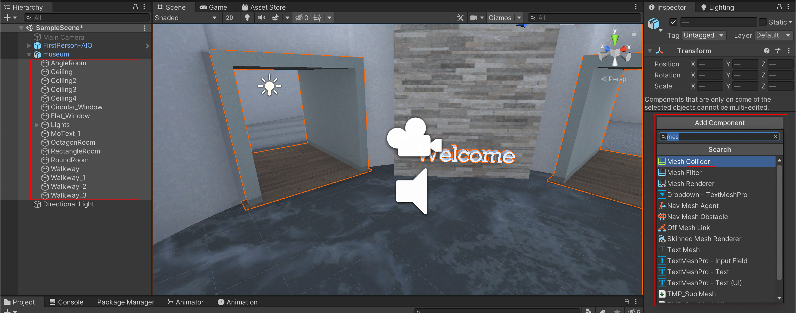

## Creating the basic player

Now that we have our game world ready, let's create a character to represent the player in the game world. In this tutorial, we will be creating the game as a FPS (First Person Shooter), which means the player will interact with the game world in first person view.

Using the keyboard and mouse, we should be able to make our character run, walk, jump and look around. The module we need for this is commonly termed as "**First person controller**". The controller we will be using is available at `Unity Asset Store`.

Open the Asset Store window. If it is not visible select `Asset Store` from the `Window` option in the top menu. Search for "[First Person All In One](https://assetstore.unity.com/packages/tools/input-management/first-person-all-in-one-135316)". Click on **Add to My Assets** and then click on **Accept** to accept the terms and conditions. Now click on the **Import** button. This shall open the `Import Unity Package` window. By default everything will be selected, if not click on **All** button, and then click on **Import**.

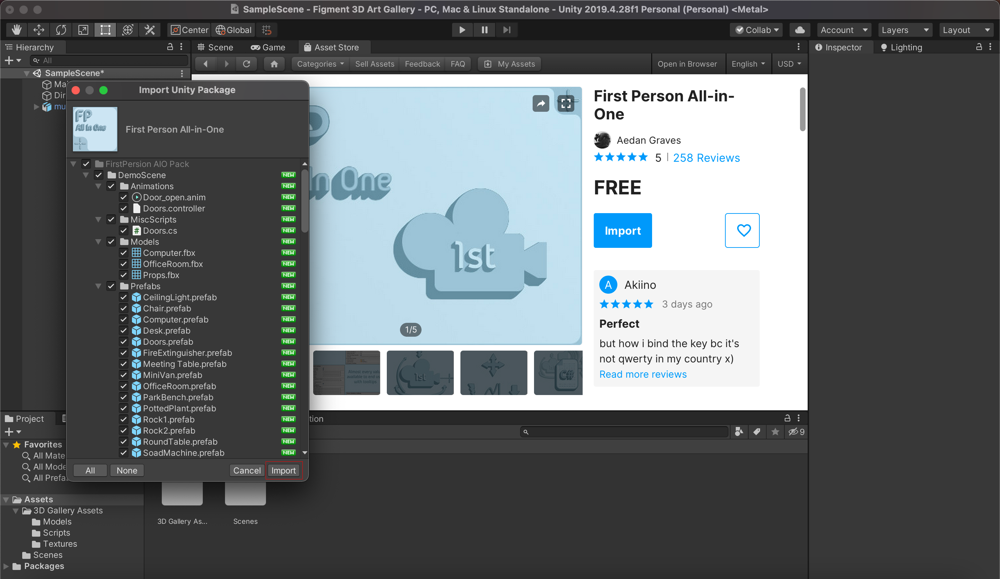

This will import the entire package into our project and you can see it in `The Project Window`. Ignore if you seen any yellow warning messages.

Select the `FirstPerson-AIO` Prefab by clicking on `FirstPersionAIO → FirstPersonAIO`. Drag and drop the Prefab (Blue Box) into the `Hierarchy Window`. Make sure that the Controller is not a child of another game object. You can place your character anywhere inside the Museum where you want your character to spawn when the game starts. I placed mine inside the `RoundRoom` with the welcome sign.


The `FirstPerson-AIO` already have a camera attached to it which will act as our main camera. Delete or Deactivate the `MainCamera` component which was present in our Hierarchy since we created a blank unity project.

Click on the Play button. You will be able to move around freely inside the game.

# Displaying Artwork

Before we start displaying NFTs from the blockchain, let's create a demo artwork to be displayed.

We will be using the [Classic Picture Frame](https://assetstore.unity.com/packages/3d/props/furniture/classic-picture-frame-59038) asset pack from Asset Store for the frames of our pictures. Import the package like we imported the `First Persion AIO` package. If the package is imported properly you can see a `Classic Picture Frame` folder in the `Project Window` .

Select the `picture` prefab in the `Classic Picture Frame`directory and drag it into the `Hierarchy Window` and over the `museum` object to make it a child of `museum` game object. You can place the frame at any place of your choice. In this tutorial it is placed in the front wall while entering the `Rectangle Room` and is scaled to `X: 0.2, Y: 0.2, Z: 0.1` .

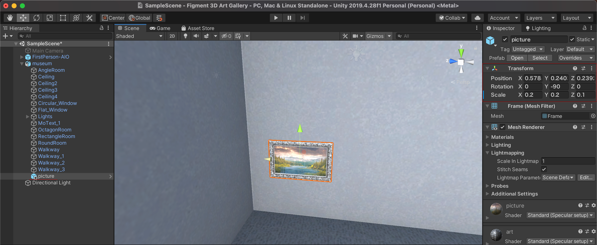

We will convert this game object into a Prefab and later use it to spawn new Artworks when NFTs are fetched from the Smart contract. You can read about what is Prefab in Unity's official documentation [here](https://docs.unity3d.com/2019.4/Documentation/Manual/Prefabs.html).

Before creating the prefab, create a Folder called `Prefabs` in the root asset directory and open it. Drag the `picture` asset from `Hierarchy Window` into the `Project Window` . A pop up will appear, select `Original Prefab`. This will create a new Prefab for the art work.

## Displaying Image details

Now that we have our artwork in place, we want to display various informations associated with the image on screen when the player moves close to the artwork. This information will be displayed as UI element for which we will need a `Canvas` game component. You can read more about `Canvas` in the official documentation [here](https://docs.unity3d.com/Packages/com.unity.ugui@1.0/manual/class-Canvas.html).

Right click in the `Hierarchy Window` and select `UI` and select `Canvas`. This will create a new `Canvas` component. To view the `Canvas` properly, switch your editor to 2D.

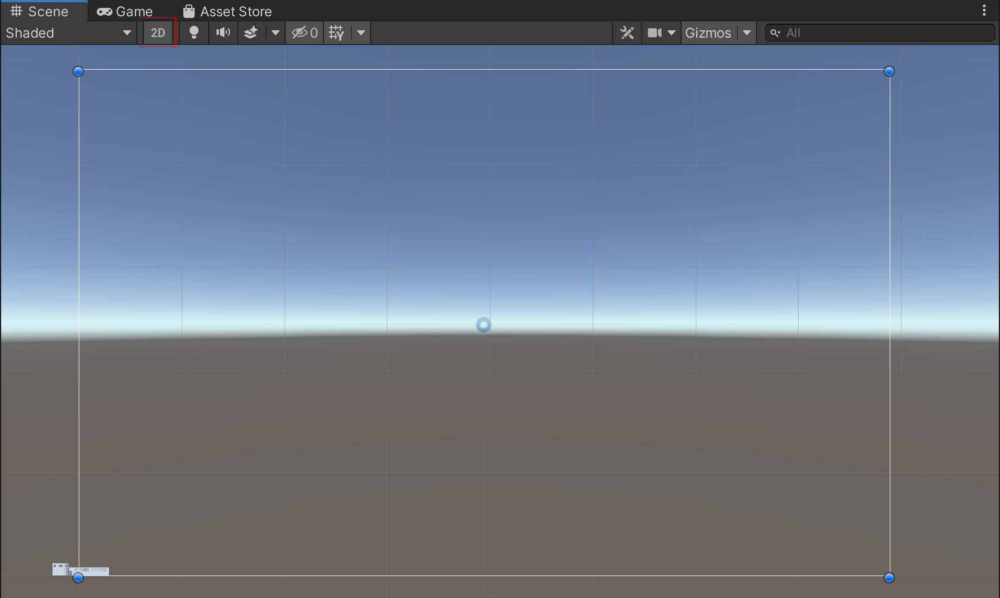

Now we are ready to design how the various details will be displayed. For the simplicity of the tutorial we will display the details as simple text on the screen.

Right click on the `Canvas` and select `Text - TextMeshPro` from `UI` section.

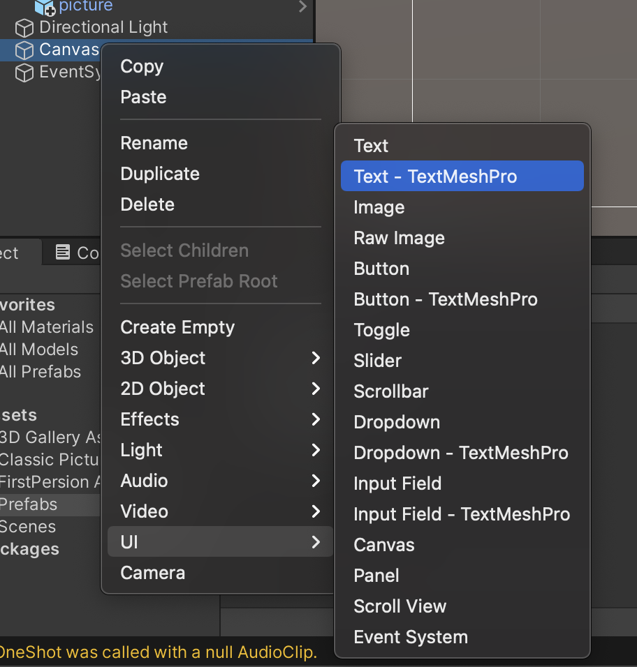

This will pop up a menu asking to Import TMP Essentials. Click on the **Import TMP Essentials** button. Then click on **Import TMP Examples & Extras**. Now you can close the pop-up dialog box.

A new Text Area will appear on the screen. Change the name of the game object to `Title` from the `Hierarchy Window`. From the Inspector Window change the content of the Text Field to **"Title"** and change `Vertex Color` to Green. Also position the Text area towards the top of the screen and make sure the text area takes up most of the horizontal area available.

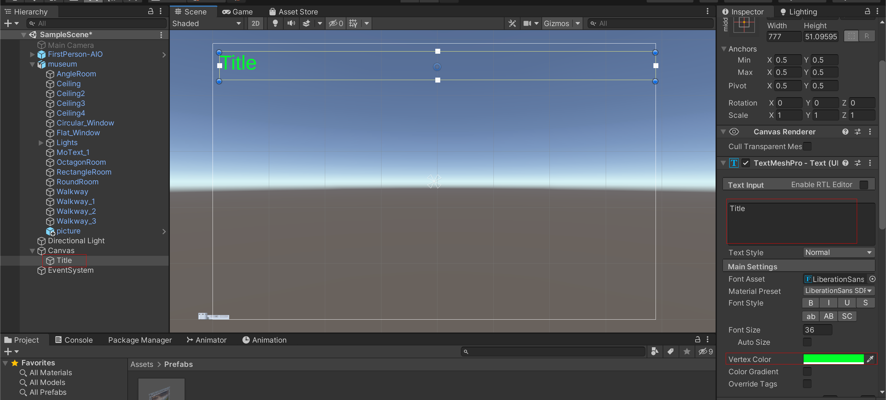

The Title of the NFT will be displayed in this area. The text area denotes the amount of space the text to be displayed can take up. The text area is place on the Canvas based on how we want the title to look. You can also make various changes to the text like changing font size, font style, etc. from the `Inspector Window`.

We duplicate this text area and create some additional fields for various informations to be displayed. The final outcome should look something like this:

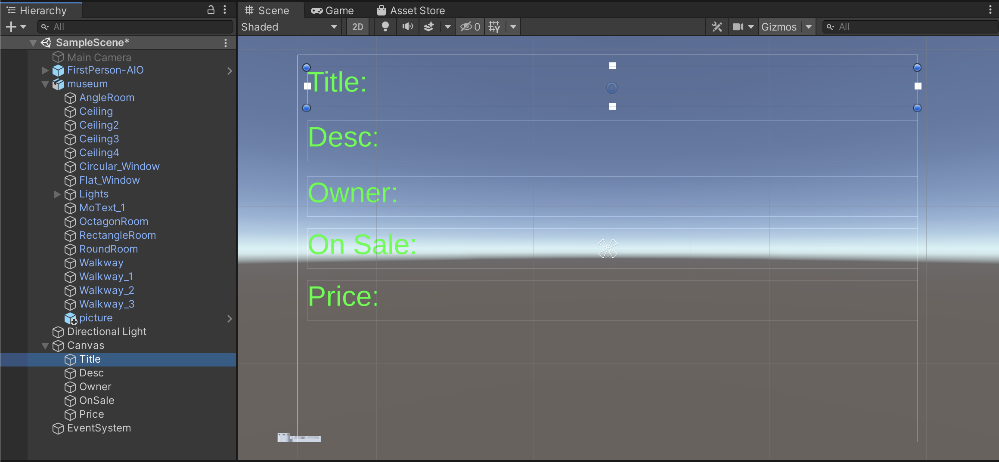

All this details will be either fetched from the Metadata of the NFT (**Title** and **Desc**) while other details (Owner, On Sale and Price) will be fetched from the Marketplace smart contract.

Now you can switch back to the 3D view. Quickly click on the `Game Window` to have a preview of how these text fields will appear on the screen.

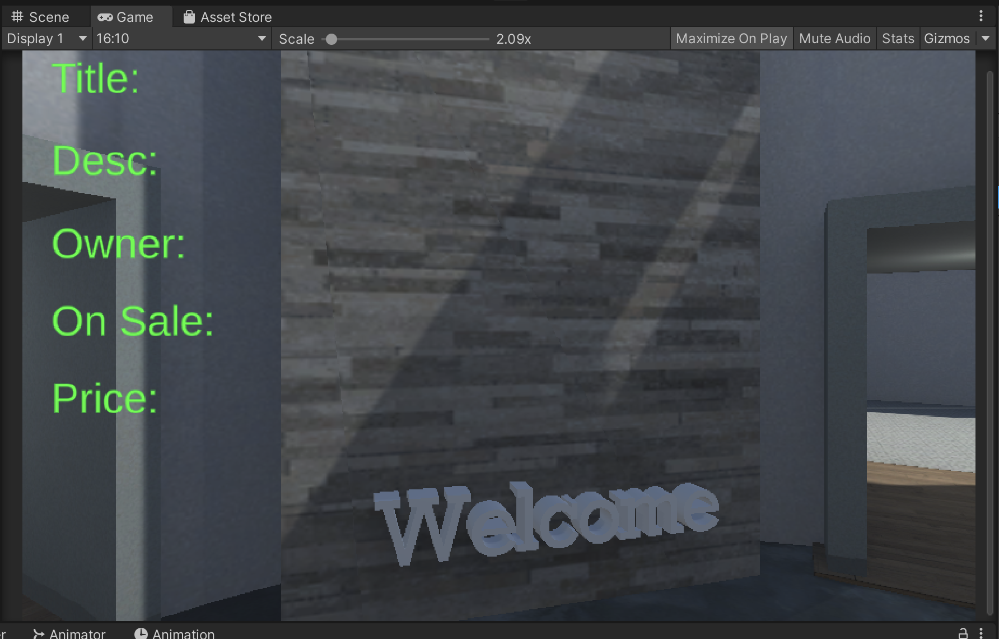

## Writing scripts for displaying information

If now we try to play our game, you will notice that the texts constantly appear on the screen. We want the text to appear only when we move close to some artwork. In order to do this, we will have to take the help of scripts (Uinty3D uses C# for writing scripts). Before we start writing our scripts we do two small tweaks:

- Add `Player` Tag: Tags are used so that any script used in a game can identify a GameObject that belongs to a particular type. You can read about it in details [here](https://docs.unity3d.com/2019.4/Documentation/Manual/Tags.html). Select the `FirstPerson - AIO` from the `Hierarchy Window` and check in the top of `Inspector Window` whether it is tagged as `Player`. If not, click on the drop down menu and select the `Player` tag.

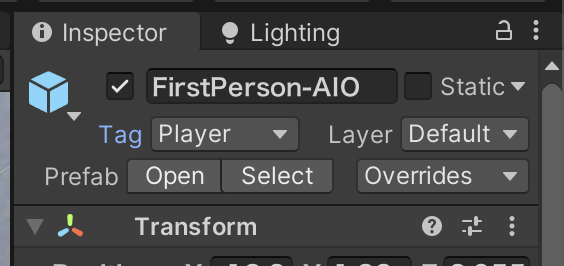

- Add Tags to the UI elements: We also have to add Tags to the Text areas we added so that our script can easily detect it. To do so, select the text area (Title for example) from the `Hierarchy Window` , in the `Inspector Window,` click on the drop down beside `Tag` field and click on `Add Tag...` . Click on the plus(**+**) icon and create a new Tag named **`Title`** and click on **Save**. Repeat this process and create tags named `Desc`, `Owner`, `OnSale` and `Price`. Now select the Text Field from the `Hierarchy Window` and assign them their respective tags.

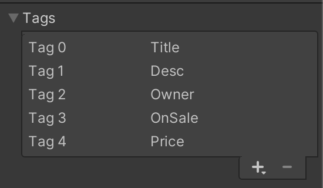

Now we are ready to start writing our scripts. Create a new folder inside the root directory in `Project Window` called `Scripts`. Inside it create a new directory called `GameScripts`. Since even a small game can have multiple scripts, it is very important to ensure that these scripts are organised properly. Inside the `GameScripts` directory create a new **C# Script** called `ProximityScript`.

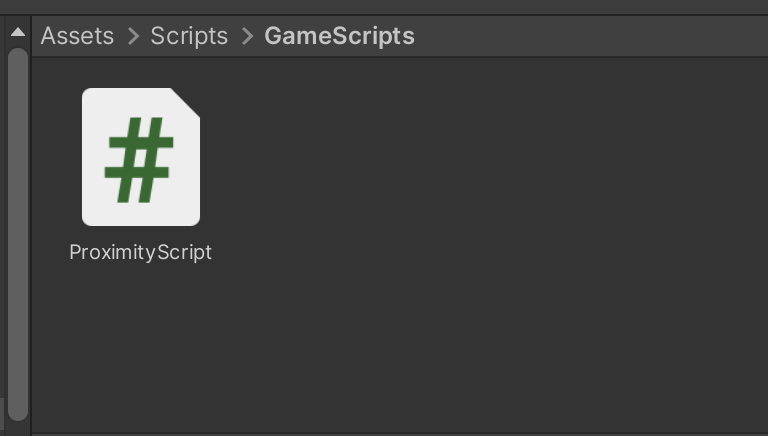

Open this script in any code editor of your choice. I will be using Visual Studio for writing and editing C# scripts. Open the `ProximityScript` and paste the following code:

```csharp
using System.Collections;
using System.Collections.Generic;
using UnityEngine;
using TMPro;

public class ProximityScript : MonoBehaviour
{
    public string newTitle;
    public string newDesc;
    public string newOwner;
    public string newIsForSale;
    public string newPrice;

    private Transform other;

    private TMP_Text myTitle;
    private TMP_Text myDesc;
    private TMP_Text artOwner;
    private TMP_Text artIsForSale;
    private TMP_Text artprice;

    private float dist;

    private GameObject player;
    private GameObject artTitle;
    private GameObject desc;
    private GameObject owner;
    private GameObject isForSale;
    private GameObject price;

    private bool check;

    // Start is called before the first frame update
    void Start()
    {
        player = GameObject.FindWithTag("Player");
        other = player.GetComponent<Transform>();

        artTitle = GameObject.FindWithTag("Title");
        desc = GameObject.FindWithTag("Desc");
        owner = GameObject.FindWithTag("Owner");
        isForSale = GameObject.FindWithTag("OnSale");
        price = GameObject.FindWithTag("Price");

        myTitle = artTitle.GetComponent<TMP_Text>();
        myTitle.text = "";

        myDesc = desc.GetComponent<TMP_Text>();
        myDesc.text = "";

        artOwner = owner.GetComponent<TMP_Text>();
        artOwner.text = "";

        artIsForSale = isForSale.GetComponent<TMP_Text>();
        artIsForSale.text = "";

        artprice = price.GetComponent<TMP_Text>();
        artprice.text = "";

        check = false;
    }

    // Update is called once per frame
    void Update()
    {
        if (other)
        {
            dist = Vector3.Distance(transform.position, other.position);
            if (dist < 4)
            {
                myTitle.text = newTitle;
                myDesc.text = newDesc;
                artOwner.text = newOwner;
                artIsForSale.text = newIsForSale;
                artprice.text = newPrice;

                check = true;
            }
            if (dist > 4 && check == true)
            {
                Start();
            }
        }
    }
}
```

Let's understand the code:

- By default the `Start` function is called only once when the Game Object is loaded while the `Update` function is called once every frame as long as the Game Object is present inside the game. You can read about the basics of scripting for Unity3D [here](https://docs.unity3d.com/2019.4/Documentation/Manual/ScriptingSection.html).

- We import certain libraries with the help of `using` keyword. The first 3 imported libraries are needed by most scripts present in a unity project and they help the script to interact with the Game Engine. The `TMPro` library is used to interact with the UI elements and Text Boxed present.

- We then define the class with name `ProximityScript` and inherit `MonoBehaviour` class. The class name should always be the same. `MonoBehaviour` is the base class from which every Unity Script is derived. Read more about it in the [docs](https://docs.unity3d.com/2019.4/Documentation/Manual/class-MonoBehaviour.html).

- We define some public variables that will store the various data that will be displayed on the screen. Later this variable will be set by another script that will load the Artworks from our Marketplace smart contract.

- The variable of type `Transform` is used to store co-ordinates of a game object and the variable `other` will store the current co-ordinates of the player.

- The text boxes we created were of type `Text Mesh Pro` hence we create variables of type `TMP_Text` to refer to those text boxes.

- `dist` variable will be used to calculate the distance between player and artwork.

- Everything present in the Game World (3D objects or 2D UI elements) belong to the `GameObject` class. We create variables of type `GameObject` to store reference to various game objects.

- In the `Start()` function we use the `GameObject.FindWithTag()` function to find the game object holding a specific tag. Since we have assigned various game objects (player and UI elements) with specific tag, this line helps us to create instance to those game objects.

- The `GetComponent<>()` function is used to get a particular component present in a game object. We pass the type of Component we want an instance to. For the player we want a reference to `Transform` component so that we can get the location of the player. Similarly for the Text areas it will be of type `TMP_Text`.

- The value for the text fields are initiated as blank. This will ensure no text is displayed on screen when the game loads.

- The `Update()` function is called every frame. In this function we will first calculate the distance between the player and the artwork. If the distance is less than a threshold, we modify the text field to show the data associated with the artwork.

  We calculate the distance using the `Vector3.Distance()` function that takes two positions as parameters. `tranform.position` returns the location of the game object to which the script is attached to (we will attach this script to the artwork) and `other.position` returns the position of the player as we have used the `other` variable to store the `Transform` component of the game object with `Player` tag.

- If the distance between the artwork and the player is less than `4` units, we modify the text to be displayed to store the data associated with the artwork.

Now that our script is ready, we attach it to our `picture` game object. This is done by either:

- Drag the script from `Project Window` to `picture` game object in `Hierarchy Window`.
- Select the `picture` game object from `Hierarchy Window` and click on the **Add Component** button in the `Inspector Window` and search and add `ProximityScript` .

Once the script is attached, in the `Inspector Window` enter some test values for `New Title`, `New Desc`, `New Owner`, `New Is For Sale` and `New Price`. Later this values will be set from a separate script, but now we set random values for testing.

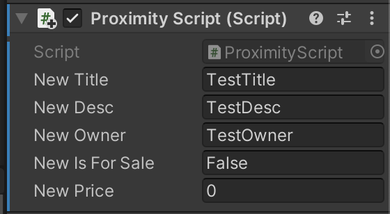

Now click on the Play Button. If everything is done properly, you shall see the details appear on screen when you move closer to the artwork and disappear as you move further away.


If not so, some of the possible errors can be:

- There is some error in the C# Script.
- The tags were not properly associated with various game objects.

# Importing Libraries

For interacting with the blockchain we need to make RPC call. In case of traditional front end applications build using Javascript, we would use libraries like `web3.js`. In case of Unity3D, there is no simple and easy way to use Javascript libraries, rather we have to depend on `Nethereum` that is a C# library used for interacting with the Ethereum Blockchain. The same can also be used to interact with Polygon chain and in this example with Mumbai Testnet. We will also need separate libraries so that we can make Asynchronous calls from our game.

Most `.Net` projects use `nuget` as a package manager, but it is difficult to import packages using `nuget` in an Unity3D project. This is mostly because of the way Unity manages its various dependencies. Any plugin that is to be used but be stored in a folder named `Plugins` while any other dependency must be imported as Asset along with the compiled `.dll` files.

For the simplicity of this tutorial, the content of both the folders are uploaded [here](https://drive.google.com/drive/folders/12bhKyGKBxQQgnIXZD5w_AT2sjVOWyK-Y?usp=sharing). Download both the `NEther` and `Plugins` folder and import them directly into your Unity project by dragging and dropping them in the `Project Window`. Make sure that both the folders are imported into the root `Assets` folder.

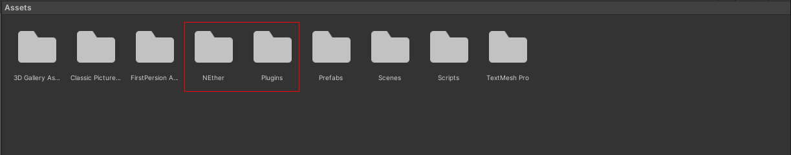

The `NEther` contains all the required files and scripts needed to use the `Nethereum` library while the `Plugins` folder contain `AsyncAwaitUtil` plugin that will be used for making Asynchronous calls. Although there are many other available Libraries for Asynchronous calls, this particular one seems to work smoothly with `Nethereum` while others ran into various errors.

# Writing scripts to interact with the blockchain

Now it's the time we all were waiting for. Now we are ready to write our Scripts to interact with the blockchain. To start with we create a new folder inside `Scripts` folder called `HelperScripts`. This folder will store all those scripts that are not directly used by our game but act as "Helpers". Inside this folder create a new C# script called `Constants` and open it in your favourite IDE. This script is going to store all the various constants that we are going to use. Paste the following code:

```csharp
public class BlockchainConstants
{
    public const string CHAIN = "polygon";
    public const string NETWORK_NAME = "mumbai";
    public const string INFURA_GATEWAY = "https://matic-testnet-archive-rpc.bwarelabs.com";
    public const string MARKETPLACE_ADDRESS = <YOUR MARKETPLACE CONTRACT ADDRESS>;
}

public class ContractConstants
{
    public const string MARKETPLACE_ABI = "[{\"inputs\":[],\"stateMutability\":\"nonpayable\",\"type\":\"constructor\"},{\"anonymous\":false,\"inputs\":[{\"indexed\":true,\"internalType\":\"uint256\",\"name\":\"itemId\",\"type\":\"uint256\"},{\"indexed\":true,\"internalType\":\"address\",\"name\":\"nftContractAddress\",\"type\":\"address\"},{\"indexed\":true,\"internalType\":\"uint256\",\"name\":\"tokenId\",\"type\":\"uint256\"},{\"indexed\":false,\"internalType\":\"address\",\"name\":\"seller\",\"type\":\"address\"},{\"indexed\":false,\"internalType\":\"address\",\"name\":\"owner\",\"type\":\"address\"},{\"indexed\":false,\"internalType\":\"uint256\",\"name\":\"price\",\"type\":\"uint256\"}],\"name\":\"MarketItemListed\",\"type\":\"event\"},{\"inputs\":[{\"internalType\":\"uint256\",\"name\":\"itemId\",\"type\":\"uint256\"}],\"name\":\"buyMarketItem\",\"outputs\":[],\"stateMutability\":\"payable\",\"type\":\"function\"},{\"inputs\":[{\"internalType\":\"uint256\",\"name\":\"newPrice\",\"type\":\"uint256\"}],\"name\":\"changeListingPrice\",\"outputs\":[],\"stateMutability\":\"nonpayable\",\"type\":\"function\"},{\"inputs\":[{\"internalType\":\"uint256\",\"name\":\"itemId\",\"type\":\"uint256\"}],\"name\":\"getMarketItem\",\"outputs\":[{\"components\":[{\"internalType\":\"uint256\",\"name\":\"itemId\",\"type\":\"uint256\"},{\"internalType\":\"address\",\"name\":\"nftContractAddress\",\"type\":\"address\"},{\"internalType\":\"uint256\",\"name\":\"tokenId\",\"type\":\"uint256\"},{\"internalType\":\"address payable\",\"name\":\"seller\",\"type\":\"address\"},{\"internalType\":\"address\",\"name\":\"owner\",\"type\":\"address\"},{\"internalType\":\"uint256\",\"name\":\"price\",\"type\":\"uint256\"},{\"internalType\":\"bool\",\"name\":\"isSold\",\"type\":\"bool\"},{\"internalType\":\"bool\",\"name\":\"isPresent\",\"type\":\"bool\"}],\"internalType\":\"struct Marketplace.MarketItem\",\"name\":\"items\",\"type\":\"tuple\"}],\"stateMutability\":\"view\",\"type\":\"function\"},{\"inputs\":[],\"name\":\"itemCounter\",\"outputs\":[{\"internalType\":\"uint256\",\"name\":\"\",\"type\":\"uint256\"}],\"stateMutability\":\"view\",\"type\":\"function\"},{\"inputs\":[{\"internalType\":\"address\",\"name\":\"nftContractAddress\",\"type\":\"address\"},{\"internalType\":\"uint256\",\"name\":\"tokenId\",\"type\":\"uint256\"},{\"internalType\":\"uint256\",\"name\":\"price\",\"type\":\"uint256\"}],\"name\":\"listMarketItem\",\"outputs\":[],\"stateMutability\":\"payable\",\"type\":\"function\"},{\"inputs\":[],\"name\":\"listingPrice\",\"outputs\":[{\"internalType\":\"uint256\",\"name\":\"\",\"type\":\"uint256\"}],\"stateMutability\":\"view\",\"type\":\"function\"}]";
}
```

The Contract Address of the Marketplace smart contract will be stored in `MARKETPLACE_ADDRESS` variable. This is going to be different for you. Paste in the contract address of the contract you deployed. The `ABI` should be same if the contract is same. if the smart contract is verified, you can copy its ABI from the block explorer under the **Code** section. Remember to replace the `"` in the ABI with `\"`.

Since this script is not going to be used to control any game object, we are not importing any Libraries nor are we inheriting the `MonoBehaviour` class.

## Query the Marketplace Smart Contract

Inside the `HelperScripts` folder, create another C# script and let's name it `QueryMarketplace`. Let's start by importing some libraries:

```csharp
using System.Collections.Generic;
using System.Numerics;
using System.Threading.Tasks;
using Nethereum.Web3;
using Nethereum.ABI.FunctionEncoding.Attributes;
using Nethereum.Contracts;
```

- `System.Collections.Generic` enables us to use the `List<>` datatype which is helpful in storing multiple values of same type.
- `System.Numberics` enables us to use a new datatype called `BigInteger` that replicates the type `uint256` used in smart contracts.
- `System.Threading.Tasks` is used to define `Tasks` that is used for making `async` function calls since asynchronous functions are handles by Unity using the concept of Threading.
- `Nethereum` is used to interact with the blockchain.

Now we define the class. The class name should be same as the file name

```csharp
using System.Collections.Generic;
using System.Numerics;
using System.Threading.Tasks;
using Nethereum.Web3;
using Nethereum.ABI.FunctionEncoding.Attributes;
using Nethereum.Contracts;

public class QueryMarketplace
{
}
```

First we start by creating an object of class `Web3` using the `new` keyword. This object will help us make RPC calls to the blockchain. We initiate the object by passing the RPC Url stored in the variable named `GATEWAY` in `BlockchainConstants` class.

```csharp
private Web3 web3 = new Web3(BlockchainConstants.GATEWAY);
```

In order to call any public function in our smart contract, we first have to define a _FunctionMessage_ that tells the compiler what type of function we are going to call, the parameters accepted by the function and the datatype of the returned value. There are two functions in the Marketplace smart contract that we are interested in, they are `itemCounter` and `getMarketItem`. For `itemCounter`, we define the FunctionMessage as follows:

```csharp
// Function Message for itemCounter
[Function("itemCounter", "uint256")]
public class ItemCounterFunctionMessage : FunctionMessage
{
}
```

After the `Function` keyword, we pass two values as arguments. The first is the name of the function we want to call, i.e. `itemCounter` and the second is the datatype of the value returned by that function, that is `uint256`. Then we define a class that inherits the `FunctionMessage` class. If the function takes in any parameters, those would be defined inside this function. Since `itemCounter` function doesn't take any parameter, this class is empty.

For the `getMarketItem` function, we define the function message as:

```csharp
// Function Message for marketItems
[Function("getMarketItem")]
public class MarketItemsFunctionMessage : FunctionMessage
{
    [Parameter("uint256", "itemId", 1)]
    public BigInteger itemId { get; set; }
}
```

Since the `getMarketItem` function returns a struct, which is a composite datatype, we don't pass the return type after `Function` keyword. The function takes in one parameter called `itemId` which is of type `uint256`. This is defined by passing this values after the `Parameter` keyword. The `1` signifies that this is the first parameter. In case of this function, the first parameter is also the only parameter the function takes. We define a global variable `itemId` along with a Getter (`get`) and Setter. (`set`) that will contain the value that is to be passed to the function. When the function will be called with this FunctionMessage, the value stored in this global variable will be passed as parameter to the function. To represent the type `uint256`, we use the `BigInteger` datatype.

Since the `getMarketItem` returns a composite datatype, we have to define an _Output DTO_ which will define the type of value that will be received after the function call. We are going to _Deserialise_ the returned value based on this Output DTO. The Output DTO is defined as:

```csharp
// Function Output for marketItems (Non-Premitive Type)
[FunctionOutput]
public class MarketItemDTO : IFunctionOutputDTO
{
    [Parameter("uint256", "itemId", 1)]
    public BigInteger itemId { get; set; }

    [Parameter("address", "nftContractAddress", 2)]
    public string nftContractAddress { get; set; }

    [Parameter("uint256", "tokenId", 3)]
    public BigInteger tokenId { get; set; }

    [Parameter("address", "seller", 4)]
    public string seller { get; set; }

    [Parameter("address", "owner", 5)]
    public string owner { get; set; }

    [Parameter("uint256", "price", 6)]
    public BigInteger price { get; set; }

    [Parameter("bool", "isSold", 7)]
    public bool isSold { get; set; }
}
```

In structure, it is quite similar to how we defined the Function Message. The only key difference being, we are using the `FunctionOutput` keyword, inheriting the `IFunctionOutputDTO` class and while defining the `Parameter`, we first pass the datatype and then the variable name followed by the index number. The returned value is deserialised and stored in the public variables which can be accessed using the setters defined.

Now that we have defined the `FunctionMessage` and `FunctionOutput`, we can write the functions that will be used to make call to the smart contract.

```csharp
// Function to get itemCounter
public async Task<BigInteger> GetItemCounter()
{
    var itemCounterMessage = new ItemCounterFunctionMessage();
    var queryHandler = web3.Eth.GetContractQueryHandler<ItemCounterFunctionMessage>();
    var itemCounter = await queryHandler
        .QueryAsync<BigInteger>(BlockchainConstants.MARKETPLACE_ADDRESS, itemCounterMessage)
        .ConfigureAwait(false);

    return itemCounter;
}
```

We use the `Task` keyword because `async` function calls are made using the concept of multi-threading. The first function we are defining is used to call the `itemCounter` function and it returns a `uint256` value that is defined by `BigInterger` datatype in C#.

We start by creating an instance of `ItemCounterFunctionMessage` class using the `new` keyword and store it in `itemCounterMessage` variable. We then create a query handler using the `GetContractQueryHandler` function and pass the `ItemCounterFunctionMessage` type within the anchor brackets(<>) to define the type of function to be called.

The call is made using the `QueryAsync` function and we pass type `BigInteger` within anchor brackets to signify the type of data to be returned. We pass the contract address of the Marketplace smart contract stored in the variable `MARKETPLACE_ADDRESS` in `BlockchainConstants` class and the `itemCounterMessage` variable.

The value returned from the function call is stored in `itemCounter` variable which we then return.

In a similar fashion we define the function that calls the `getMarketItem` function.

```csharp
// Function to get all present Market Items
public async Task<MarketItemDTO> GetMarketItem(BigInteger itemId)
{
    var marketItemsMessage = new MarketItemsFunctionMessage() { itemId = itemId };
    var queryHandler = web3.Eth.GetContractQueryHandler<MarketItemsFunctionMessage>();
    var marketItem = await queryHandler
        .QueryDeserializingToObjectAsync<MarketItemDTO>(marketItemsMessage, BlockchainConstants.MARKETPLACE_ADDRESS)
        .ConfigureAwait(false);

    return marketItem;
}
```

The main differences noticed here are:

- While creating an instance of the FunctionMessage we set the value of the `itemId` variable with the value passed to the function. This stored value is going to be passed to the function as parameter.
- In the query handler, we pass the type to be `MarketItemsFunctionMessage`.
- While making the query, instead of using the `QueryAsync` we use the `QueryDeserializingToObjectAsync` function because the returned value will be deserialised to the type passed within the anchor brackets, that is `MarketItemDTO`.
- While making the query, we first pass the instance of FunctionMessage(`marketItemsMessage`) and then the contract address of the Marketplace smart contract.

Finally we create a function combining the above two that will return all the NFTs that are listed in the marketplace smart contract:

```csharp
public async Task<List<MarketItemDTO>> GetAllMarketItems()
{
    List<MarketItemDTO> allMarketItems = new List<MarketItemDTO>();

    var itemCounter = await GetItemCounter();
    for(int i=0; i<itemCounter; i++)
    {
        var marketItem = await GetMarketItem(i);
        allMarketItems.Add(marketItem);
    }

    return allMarketItems;
}
```

First we create a `List` of `MarketItemDTO` type to store the details of the all the NFTs returned. First we call the `GetItemCounter` function to get a count of the total number of NFTs listed on the smart contract. Then we loop through the possible itemIds and call the `GetMarketItem` function to get the details of the NFT and store it in the `List` using the `Add` keyword. Finally we return the list.

Therefore, putting it all together, the content of the `QueryMarketplace` script will be:

```csharp
using System.Collections.Generic;
using System.Numerics;
using System.Threading.Tasks;
using Nethereum.Web3;
using Nethereum.ABI.FunctionEncoding.Attributes;
using Nethereum.Contracts;

public class QueryMarketplace
{
    private Web3 web3 = new Web3(BlockchainConstants.GATEWAY);

    // Function Message for itemCounter
    [Function("itemCounter", "uint256")]
    public class ItemCounterFunctionMessage : FunctionMessage
    {
    }

    // Function Message for marketItems
    [Function("getMarketItem")]
    public class MarketItemsFunctionMessage : FunctionMessage
    {
        [Parameter("uint256", "itemId", 1)]
        public BigInteger itemId { get; set; }
    }

    // Function Output for marketItems (Non-Premitive Type)
    [FunctionOutput]
    public class MarketItemDTO : IFunctionOutputDTO
    {
        [Parameter("uint256", "itemId", 1)]
        public BigInteger itemId { get; set; }

        [Parameter("address", "nftContractAddress", 2)]
        public string nftContractAddress { get; set; }

        [Parameter("uint256", "tokenId", 3)]
        public BigInteger tokenId { get; set; }

        [Parameter("address", "seller", 4)]
        public string seller { get; set; }

        [Parameter("address", "owner", 5)]
        public string owner { get; set; }

        [Parameter("uint256", "price", 6)]
        public BigInteger price { get; set; }

        [Parameter("bool", "isSold", 7)]
        public bool isSold { get; set; }
    }

    // #################################### Public Callable Functions ####################################

    // Function to get itemCounter
    public async Task<BigInteger> GetItemCounter()
    {
        var itemCounterMessage = new ItemCounterFunctionMessage();
        var queryHandler = web3.Eth.GetContractQueryHandler<ItemCounterFunctionMessage>();
        var itemCounter = await queryHandler
            .QueryAsync<BigInteger>(BlockchainConstants.MARKETPLACE_ADDRESS, itemCounterMessage)
            .ConfigureAwait(false);

        return itemCounter;
    }

    // Function to get all present Market Items
    public async Task<MarketItemDTO> GetMarketItem(BigInteger itemId)
    {
        var marketItemsMessage = new MarketItemsFunctionMessage() { itemId = itemId };
        var queryHandler = web3.Eth.GetContractQueryHandler<MarketItemsFunctionMessage>();
        var marketItem = await queryHandler
            .QueryDeserializingToObjectAsync<MarketItemDTO>(marketItemsMessage, BlockchainConstants.MARKETPLACE_ADDRESS)
            .ConfigureAwait(false);

        return marketItem;
    }

    public async Task<List<MarketItemDTO>> GetAllMarketItems()
    {
        List<MarketItemDTO> allMarketItems = new List<MarketItemDTO>();

        var itemCounter = await GetItemCounter();
        for(int i=0; i<itemCounter; i++)
        {
            var marketItem = await GetMarketItem(i);
            allMarketItems.Add(marketItem);
        }

        return allMarketItems;
    }

}
```

Still there is one error left. If you are using Visual Studio as the Editor will be the Red Squiggly line under the keyword `BigInteger`. If you hover over it, you will see an error message similar to:

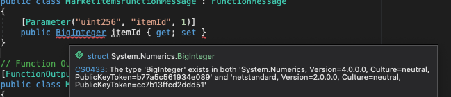

To solve this, open `Player Settings` from the `Build Settings` window, and select **API Compatibility Level** as `.NET 4.x`

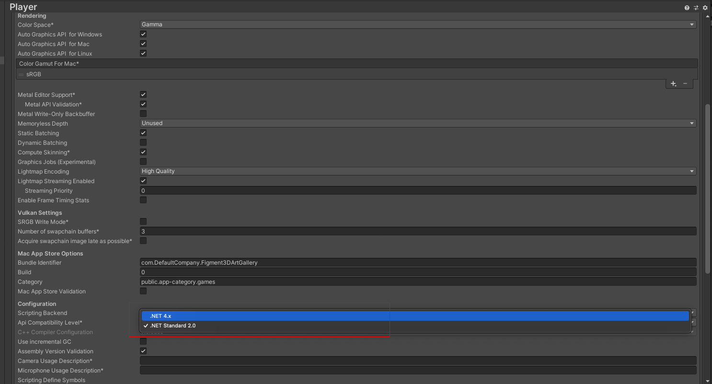

## Query the NFT

Similar to `QueryMarketplace` script, we create a new script inside the `HelperScripts` directory called `QueryNFT`. This will be used to Query the NFT smart contract to get the `tokenURI` of the NFT listed in the Marketplace smart contract.

```csharp
using System.Numerics;
using System.Threading.Tasks;
using Nethereum.Web3;
using Nethereum.ABI.FunctionEncoding.Attributes;
using Nethereum.Contracts;

public class QueryNFT
{
    private Web3 web3 = new Web3(BlockchainConstants.GATEWAY);

    // Function Message for tokenURI
    [Function("tokenURI", "string")]
    public class TokenURIFunctionMessage : FunctionMessage
    {
        [Parameter("uint256","tokenId")]
        public BigInteger tokenId { get; set; }
    }

    // Function to get tokenURI
    public async Task<string> GetTokenURI(BigInteger tokenId, string contractAddress)
    {
        var tokenURIMessage = new TokenURIFunctionMessage() { tokenId = tokenId };
        var queryHandler = web3.Eth.GetContractQueryHandler<TokenURIFunctionMessage>();
        var tokenURI = await queryHandler
            .QueryAsync<string>(contractAddress, tokenURIMessage)
            .ConfigureAwait(false);

        return tokenURI;
    }
}
```

Like incase of QueryMarketplace, we first create a Function Message that will be used to call the function and define the parameters that will be passed to the function. We want to get the `tokenURI` by passing the `tokenId` which is of type `uint256`.

We define `GetTokenURI` function that takes two parameters, `tokenId` which represents the tokenId of the NFT we want to query and `contractAddress` which contains the address of the NFT.

## Additional Helper Scripts

Besides this two Helper Scripts, we need two other Helper Scripts, `ArtworkDetails` and `MetadataFormat`, that would help us create an object that represents all the details to be displayed and create an object of the Metadata that is stored in the tokenURI respectively.

In the `HelperScripts` directory create a new script called `ArtworkDetails`. This is going to be a simple class with public variables representing the values that will be displayed on the screen and is fetched from the Marketplace smart contract. This variables will be `owner`, `isForSale` and `price`. The remaining variables that is Title and Description of the artwork will be fetched from the Marketplace Contract. The code for `ArtworkDetails` is:

```csharp
public class ArtworkDetails
{
    public string owner;
    public bool isForSale;
    public string price;

    public ArtworkDetails(string owner, bool isForSale, string price)
    {
        this.owner = owner;
        this.isForSale = isForSale;
        this.price = price;
    }
}
```

Now we are going to create a script called `MetadataFormat` that is used to create an object containing the variables that represent the Metadata. We will be following the [OpenSea Metadata Standards](https://docs.opensea.io/docs/metadata-standards) for our NFTs. You can find a sample of this standard [here](https://opensea-creatures-api.herokuapp.com/api/creature/3). It has the following important fields:

- `attributes`: A list of various attributes in form of traits, their value and display type associated with the NFT.
- `description`: A small description of the NFT.
- `external_url`: An URL pointing to a different website associated with the NFT.
- `image`: Contains a link to the image that will be associated with the NFT.
- `name`: This contains the name of the NFT.

We represent this in our `MetadataFormat` script as follows:

```csharp
using System.Collections.Generic;

public class Attribute
{
    public string trait_type { get; set; }
    public string value { get; set; }
    public string display_type { get; set; }
}

public class OpenSeaMetadata
{
    public List<Attribute> attributes { get; set; }
    public string description { get; set; }
    public string external_url { get; set; }
    public string image { get; set; }
    public string name { get; set; }
}
```

With this we are ready with all our helper scripts. Before moving to the next section make sure you have the following scripts in the `HelperScripts` directory

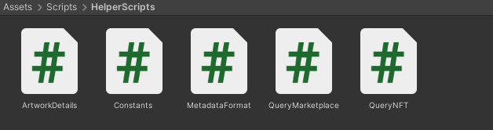

## Getting the artwork

We have our script to query the Marketplace smart contract and NFT smart contract ready along with some other helper scripts. The steps to be followed to fetch and display an artwork are:

1.  Get all the NFTs listed in the marketplace smart contract.
2.  Spawn the ART works in game world.
3.  Get the tokenURI and contract address of the NFT.
4.  From the image url present in the metadata in `image` field, fetch the image and display it.

The script for step 2 will be written later. Now let's try to write a script that can fetch an image from a URL passed as parameter and display it as an artwork. This script will be attached to every artwork spawned.

We start by creating a new script in the `GameScripts` folder and let's name it `GetArtwork`. We start the script with our usual import statements and defining our class. Since this script will be directly attached to a game object and will control how the game works, we will inherit `MonoBehaviour` class.

```csharp
using System.Collections;
using System.Collections.Generic;
using UnityEngine;
using UnityEngine.Networking;
using Newtonsoft.Json;

public class GetArtwork : MonoBehaviour
{
}
```

Now let's add some global variables:

```csharp
public Renderer imageRenderer;
public string url;
private ProximityScript proximity;
```

- `imageRenderer` is an object of type `Renderer`. We are going to use this `Renderer` object to display our image.
- `url` is a variable that is going to hold the url from which the image is going to be fetched.
- `proximity` is an object of script `ProximityScript` that helps us to display details on the screen.

Unity manages asynchronous calls using Coroutines. We will first define a coroutine that will fetch the image from a url. We will be using `UnityWebRequest` for calling an API and getting the image returned in form of a `Textue` that can be attached to a game object.

```csharp
private IEnumerator GetAndSetTexture(string imageURL)
{
    UnityWebRequest www = UnityWebRequestTexture.GetTexture(imageURL);
    yield return www.SendWebRequest();
    while(!www.isDone)
    {
        Debug.Log("Fetching Image Under Progress");
    }
    Texture myTexture = ((DownloadHandlerTexture)www.downloadHandler).texture;
    imageRenderer.materials[1].SetTexture("_MainTex", myTexture);
}
```

We use the `GetTexture` function in `UnityWebRequestTexture` class to make a call to the passed `imageURL` and retried the returned image file in form of a texture. The request is sent using the `SendWebRequest()` function and we use `www.isDone` to check if the reply has been received.

Once we receive the image, we use `downloadHandler` method to get the texture and store it in a variable. Next we use the `SetTexture` function to set the desired image as a texture. If observed closely, the `picture` present in our game has two materials associated with it, the first is for the frame and the second is the image that is displayed.

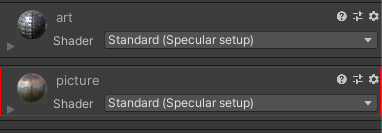

We use `materials[1]` to chose the 2nd Texture and set the "Main Texture" to our desired texture. Refer to the official documentation [here](https://docs.unity3d.com/2019.4/Documentation/ScriptReference/Material.SetTexture.html) to understand `SetTexture` function in more details.

Our next coroutine will be the one we use to fetch the Metadata from tokenURI. For this we are going to use `Get` function from `UnityWebRequest` class to make an API call. We also use `DeserializeObject` function from `JsonConvert` class to convert the returned value into an object of class `OpenSeaMetadata`, that we have defined earlier. Finally we set the extract the Title and Description and set the values using the `proximity` variable. Finally we get the imageURL and call the `GetAndSetTexture` coroutine. We use the `StartCoroutine` to call a coroutine.

```csharp
private IEnumerator GetRequestCoroutine(string uri)
{
    UnityWebRequest www = UnityWebRequest.Get(uri);
    yield return www.SendWebRequest();

    while(!www.isDone)
    {
        Debug.Log("Fetching Metadata Under process");
    }

    if(!string.IsNullOrEmpty(www.error))
    {
        Debug.Log("Error occured while fetching metadata");
    }

    var result = www.downloadHandler.text;

    var metadata = JsonConvert.DeserializeObject<OpenSeaMetadata>(result);

    proximity.newTitle = "Title: " + metadata.name;
    proximity.newDesc = "Desc: " + metadata.description;

    var imageUrl = metadata.image;
    StartCoroutine(GetAndSetTexture(imageUrl));
}
```

Next we define a `SetArtworkDetails` function that takes an argument of type `ArtworkDetails` and sets the value to be displayed.

```csharp
private void SetArtworkDetails(ArtworkDetails details)
{
    proximity.newOwner = details.owner;
    if(details.isForSale)
    {
        proximity.newIsForSale = "For Sale";
        proximity.newPrice = details.price;
    }
}
```

Finally we define a Coroutine named `GetArtworkDetails` that will take the tokenURI and a object of `ArtworkDetails` and call the `GetRequestCoroutine` and `SetArtworkDetails`.

```csharp
public IEnumerator GetArtworkDetails(string URI, ArtworkDetails details)
{
    proximity = gameObject.GetComponent<ProximityScript>();
    StartCoroutine(GetRequestCoroutine(URI));
    SetArtworkDetails(details);
    yield return 0;
}
```

The diagram below summarise the flow of Coroutine once the `GetArtworkDetails` Coroutine is called.

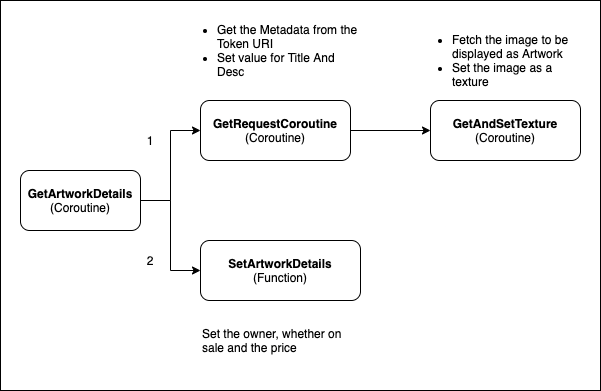

Putting it all together, the entire code for `GetArtwork` is:

```csharp
using System.Collections;
using System.Collections.Generic;
using UnityEngine;
using UnityEngine.Networking;
using Newtonsoft.Json;

public class GetArtwork : MonoBehaviour
{
    public Renderer imageRenderer;
    public string url;
    private ProximityScript proximity;

    private IEnumerator GetAndSetTexture(string imageURL)
    {
        UnityWebRequest www = UnityWebRequestTexture.GetTexture(imageURL);
        yield return www.SendWebRequest();

        while(!www.isDone)
        {
            Debug.Log("Fetching Image Under Progress");
        }

        Texture myTexture = ((DownloadHandlerTexture)www.downloadHandler).texture;

        imageRenderer.materials[1].SetTexture("_MainTex", myTexture);
    }

    private IEnumerator GetRequestCoroutine(string uri)
    {
        UnityWebRequest www = UnityWebRequest.Get(uri);
        yield return www.SendWebRequest();

        while(!www.isDone)
        {
            Debug.Log("Fetching Metadata Under process");
        }

        if(!string.IsNullOrEmpty(www.error))
        {
            Debug.Log("Error occured while fetching metadata");
        }

        var result = www.downloadHandler.text;

        var metadata = JsonConvert.DeserializeObject<OpenSeaMetadata>(result);

        proximity.newTitle = "Title: " + metadata.name;
        proximity.newDesc = "Desc: " + metadata.description;

        var imageUrl = metadata.image;
        StartCoroutine(GetAndSetTexture(imageUrl));
    }

    private void SetArtworkDetails(ArtworkDetails details)
    {
        proximity.newOwner = details.owner;
        if(details.isForSale)
        {
            proximity.newIsForSale = "For Sale";
            proximity.newPrice = details.price;
        }
    }

    public IEnumerator GetArtworkDetails(string URI, ArtworkDetails details)
    {
        proximity = gameObject.GetComponent<ProximityScript>();
        StartCoroutine(GetRequestCoroutine(URI));
        SetArtworkDetails(details);
        yield return 0;
    }

}
```

Before moving on to the next section, attach the `GetArtwork` script to the `picture` game object. This can be done either by dragging and dropping the script on top of the game object or select the game object, click on Add Component Button and then search and add `GetArtwork` script.

With the `picture` object selected in the `Hierarchy Window`, click on the `Overrides` button on the `Inspector Window` and click on **Apply All** button. This will add all the changes made to the game object to its prefab as well.

# Spawning Artworks

Now we are almost ready to display the artworks listed in the Marketplace smart contract. However before doing so we should be able to spawn the artworks into our museum depending on the number of NFTs listed. Since our museum is of fixed dimension, there will be a maximum number of artworks that can be listed.

Since the artworks must be spawned in an organised manner, first we have to decide the places where we want our artworks to be displayed. We will be referring this points as "Spawn Points". Using your Designer Skills create some spawn points throughout the gallery. The steps to create a spawn point is:

1.  Decide the coordinate of the spawn point (You can drag the `picture` game object to decide the positions you like and copy the value of `Transform` component ).
2.  Create a new **Empty Game Object** and set the correct values for `Transform` Component.
3.  Repeat this process until you have created all the spawn points you want.

For simplicity, I have defined 5 spawn points:

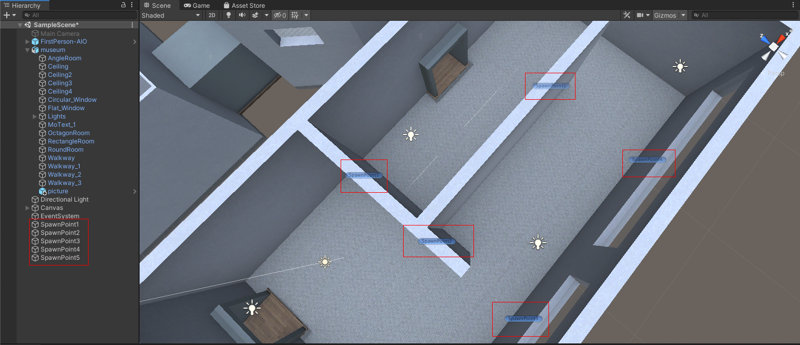

In order to keep our project organised, in the `Hierarchy Window` create a new **Empty Game Object**, and name it `ArtworkSpawner` and drag the spawn points over it, to make them a child object of `ArtworkSpawner`.

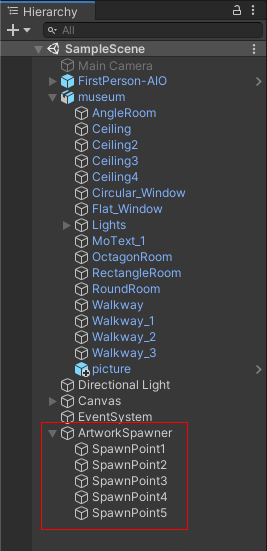

Finally, you can safely delete the `picture` game object.

## Writing script to spawn artworks

Inside the `GameScripts` directory, we will create another script that is going to help us spawn the Artworks. Create a new C# script called `ArtworkSpawner`.

Like always, we start by importing dependencies and defining our class:

```csharp
using System.Collections;
using System.Collections.Generic;
using System.Numerics;
using UnityEngine;

public class ArtworkSpawner : MonoBehaviour
{
}
```

Next we are going to create two global variables. First is `artwork` of type `GameObject`. This is going to store a prefab that we are going to spawn at the designated spawn points. Next is a List of type `Transform` called spawnPoints. This list stores all the spawn points we created in the previous step.

Next we are going to write the function that will spawn our artworks. First we will query the marketplace smart contract to get the total number of NFTs listed. Since we have limited number of Spawn Points, we will calculate the number of NFTs listed and number of spawn points available. If available spawn points is less than listed NFTs, we can display only the number of spawn points we have. Finally we run a loop for every spawn point available and:

- Create a new game object similar to the one stored in `artwork` variable using the `Instantiate` function. We pass in the position and rotation of the spawn point as arguments.
- We get a reference to the `GetArtwork` script attached to the game object using the `GetComponent` function.
- Next we get the contract address of the NFT to be displayed and get its token URI using the `GetTokenURI` function we created.
- Next we call the `GetArtworkDetails` coroutine we designed in the `GetArtwork` script to display our artwork and set the details to be displayed.

The script will be:

```csharp
using System.Collections;
using System.Collections.Generic;
using System.Numerics;
using UnityEngine;

public class ArtworkSpawner : MonoBehaviour
{
    public GameObject artwork;
    public List<Transform> spawnPoints;

    // Start is called before the first frame update
    void Start()
    {
        spawnArtworks();
    }

    async void spawnArtworks()
    {
        QueryMarketplace queryMarketplace = new QueryMarketplace();
        QueryNFT queryNFT = new QueryNFT();

        // Get a list of all the listed Artworks
        var itemCount = await queryMarketplace.GetItemCounter();
        var allListedArtworks = await queryMarketplace.GetAllMarketItems();

        // Calculate the number of artworks to spawn
        var count = (itemCount <= spawnPoints.Count) ? itemCount : spawnPoints.Count;

        // Spawn the artworks
        for(int i=0; i<count; i++)
        {
            GameObject spawnedObj = Instantiate(artwork, spawnPoints[i].position, spawnPoints[i].rotation);
            var scriptRef = spawnedObj.GetComponent<GetArtwork>();

            string contractAddress = allListedArtworks[i].nftContractAddress;
            string tokenURI = await queryNFT.GetTokenURI(allListedArtworks[i].tokenId, contractAddress);

            ArtworkDetails details = new ArtworkDetails(
                "Owner: " + allListedArtworks[i].owner,
                !allListedArtworks[i].isSold,
                "Price: " + allListedArtworks[i].price + "Wei"
            );

            StartCoroutine(scriptRef.GetArtworkDetails(tokenURI, details));
        }
    }
}
```

Now that we have our script ready, we attach this script to the `ArtworkSpawner` game object we created. Now with `ArtworkSpawner` selected in the `Hierarchy Window` we set the public variables of the script from `Inspector Window`. We drag the `picture` prefab, present in `Prefabs` folder, into the `Artwork` field. In the Spawn Points field, we enter the number of spawn points created (in this example `5`), and then drag each Spawn Point one-by-one in respective fields. It should look something like this:


Now we are finally ready to test our product.

# Running our game

Create a new NFT and list it in the marketplace smart contract. I am using [this](https://mumbai.polygonscan.com/address/0x12Fc3C44b4092aD55cf0212fa3A84a1210fCED5f#writeContract) contract to create NFT and [this](https://mumbai.polygonscan.com/address/0x9a606932f7F0d07EAd02693D71768268FECc9c88#writeContract) is my Marketplace contract. Now click on the play button. The artwork will spawn at the first spawn point listed. When you move closer to the artwork, the details to appear on the screen.

Congratulations 🎉🎉🎉, your game is ready.

## Building the game

Before we wrap up, there is one last step remaining, i.e. to build our game so that it can run on a browser. Follow the following steps:

1.  Open Build Settings from the File Menu.
2.  Make sure that the `Target Platform` is set to the Operating System of you choice.
3.  Click on the **Build and Run** button.
4.  Select the Location to save the built file and click on Save.

This will start the built process and once done, it will run the game. You can play the game and also share it with your friends.

# Conclusion

Congratulations on making it all the way through this tutorial! We have learned how to interact with a smart contract from a Unity3D game. We have learned how to read data from the blockchain and display information to the user. We also learned the basics of Nethereum, which is a C# library used for interacting with Ethereum based blockchains.

# Next Steps

For simplicity purposes, we have limited this tutorial to just reading from the blockchain. It is also possible to connect wallets and submit transactions to the blockchain. As next step, you can also try to build an VR version of the game which would create a more immersive experience.

# About The Author

Hi, my name is Bhaskar Dutta and I am a blockchain Developer, Researcher and Freelancer. I am always looking forward to learn new things and discuss about Sitcoms. To know me better, you can checkout my [Github](https://github.com/BhaskarDutta2209).

# References

- The best place to learn about various aspects of Unity3D is their [official documentation](https://docs.unity3d.com/Manual/index.html).
- To know about Nethereum, refer to their [official documentation](http://docs.nethereum.com/en/latest/#:~:text=Nethereum%20is%20the%20.,private%2C%20like%20Quorum%20and%20Besu.).
- Nethereum [discord](https://discord.gg/yNHbmSmz) channel is also quite helpful for clearing doubts and seeing how different developers approach to a particular problem.
