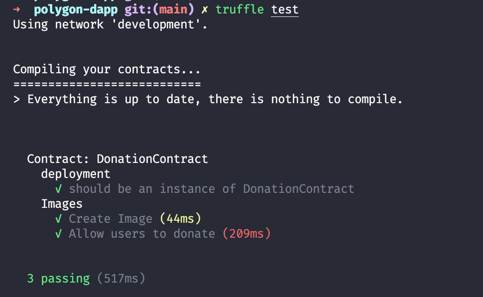

# Introduction

In this tutorial, you will learn how to create a Donation dApp on Polygon to award your favorite content creator with MATIC tokens and how to deploy your smart contract on the Polygon network.

This is what the dApp we will be creating looks like:


# Prerequisites

To successfully follow along with this tutorial, you will need a basic knowledge and understanding of blockchain, Solidity smart contracts and React.

# Requirements

- You will need Metamask installed in your browser from the official site <https://metamask.io>.
- You must have a recent version of Node.js installed. We recommend using v14.17.6 LTS for compatibility.

**Other technologies used in this tutorial:**

- [Solidity](https://docs.soliditylang.org/en/v0.8.7/) - For writing smart contracts
- [Truffle](https://github.com/trufflesuite/truffle) - Truffle provides development environment for developing blockchain applications locally
- [NextJS](https://nextjs.org/) - To Create frontend for our Dapp
- [Web3.js](https://web3js.readthedocs.io/en/v1.4.0/) - Javascript librabry to connect our frontend to smart contract
- [Polygon Network](https://polygon.technology/) - For deploying our smart contract
- [IPFS](https://ipfs.io/) - To store image and videos uploaded by content creators

**Topics covered in this tutorial:**

- Setting up development for Solidity and NextJs
- Creating smart contracts using Solidity
- Compiling and migrating smart contracts using truffle
- Writing tests for our smart contract
- Linking smart contract to frontend using web3js
- Creating UI using TailwindCSS in NextJs
- Using IPFS to upload images'
- Publishing the smart contract to Polygon Testnet

# Project setup

To set up the project files, we will have to install a few packages using the node package manager npm. This software comes bundled with recent versions of Node.js, but you will still want to make sure it is installed with the command `npm -v`. Run the following commands in order to install the packages and create the project directories:

```bash
npm install -g truffle # Install truffle globally so that you can use truffle from any directory

npx create-next-app --typescript # Install nextjs and setup typescript for your project

cd polygon-dapp
truffle init # Create truffle-config.js test/ and contracts/ directory
```

When asked during the `create-next-app` setup, use "polygon-dapp" as the project name so that it will be easy for you to follow along with this tutorial. This is how the folder structure will be after initial setup:


The `truffle init` command creates the following directories:

- `contracts/`: All the smart contracts are stored in this directory.
- `migrations/`: All the scripts used by Truffle to deploy smart contracts are stored in this directory.
- `test/`: All the test scripts for smart contracts are stored in this directory.
- `truffle-config.js`: Contains configuration settings for truffle.

# Creating the Solidity smart contract

Create a new file called `DonationContract.sol` in the `contracts` directory and add the following code:

```javascript
// SPDX-License-Identifier: GPL-3.0
pragma solidity ^0.5.16;

contract DonationContract {
  // Keep track of total number of images in contract
  uint256 public imageCount =  0;

  // Data structure to store images data
  struct Image {
    uint256 id;
    string hash;
    string description;
    uint256 donationAmount;
    address payable author;
  }

  mapping(uint256 => Image) public images;

  // Event emitted when image is created
  event ImageCreated(
    uint256 id,
    string hash,
    string description,
    uint256 donationAmount,
    address payable author
  );

  // Event emitted when an there is a donation
  event DonateImage(
    uint256 id,
    string hash,
    string description,
    uint256 donationAmount,
    address payable author
  );
}
```

- `imageCount` is an unsigned public integer that stores the total number of images in the smart contract.
- `struct Image` is a data structure to store information (metadata) about each image. This includes the id of the image, an IPFS hash for that image, a description added by the content creator, a total donation amount received on that image, and the author address where the donation will be sent to.
- `mapping(uint256 => Image) public images` is a mapping that stores all the images, where the key is the `id` and value is the `Image` struct.
- `ImageCreated` and `DonateImage` are the events emitted on the blockchain that our dApp can listen for, and function accordingly.

```javascript
// Create an Image
function uploadImage(string memory _imgHash, string memory _description) public {
  require(bytes(_imgHash).length > 0);
  require(bytes(_description).length > 0);
  require(msg.sender != address(0x0));
  imageCount++;
  images[imageCount] = Image(
    imageCount,
    _imgHash,
    _description,
    0,
    msg.sender
  );
  emit ImageCreated(imageCount, _imgHash, _description, 0, msg.sender);
}
```

- `uploadImage` accepts an image hash and description as parameters. In the function, we make sure the `imageHash` and `description` are not empty and the sender address is not empty. Then we increment the `imageCount` by one and create a new Image struct object and store it in the `images` map with `imageCount` as key.
- `msg` is a global variable that contains the address of the person who called the function and in our case the author of the content. So to store the address of `author` we can directly use `msg.sender`
- Once the object is stored in the map we can emit the `ImageCreated` event with relevant data.

```javascript
function donateImageOwner(uint256 _id) public payable {
  require(_id > 0 && _id <= imageCount);

  Image memory _image = images[_id];
  address payable _author = _image.author;
  address(_author).transfer(msg.value);
  _image.donationAmount = _image.donationAmount + msg.value;
  images[_id] = _image;

  emit DonateImage(
    _id,
    _image.hash,
    _image.description,
    _image.donationAmount,
    _author
  );
}
```

- `donateImageOwner` is a public payable function that accepts the id of the image. Since the function is `payable`, the global variable `msg` contains a field called `value` that has the number of coins which is sent for the donation.
- In the function body, we check the `id` parameter to make sure it is not zero, or outside the bounds of the curent `imageCount`. Then we extract the image from the `images` map by its `_id` (this was passed in as the function argument) and store it in the `_image` variable, so from the `_image` variable we extract the address of the author - where we will send the donation amount.
- Then we call the `transfer` function on the `_author`'s address and pass in the `msg.value`, which will transfer the amount of MATIC donated to the author's account.
- `images[_id] = _image` - After the donation is transfered to author's account, we can increment the `donationAmount` in `_image` struct and save the `_image` back to `images` map to update the data.
- Once everything is done we have to emit the `DonateImage` event.

That's all for the smart contract, now we can move forward with the compilation and migration process.

# Compiling and deploying with Truffle

Now that we have our smart contract written, it's time to compile it. Open your terminal and run the following command:

```text
truffle compile
```

- Truffle will compile the Solidity file and you should see output similar to:


- For the migration of our contact to the blockchain, go to the `migrations` directory, create a new file called `2_donation_contract_migration.js` and add the following code:

```javascript
const DonationContract = artifacts.require('DonationContract');

module.exports = function (deployer) {
  deployer.deploy(DonationContract);
};
```

- If you notice in the `migrations` directory, there is a file called `1_initial_migration.js` which handles the migration for the `Migrations.sol` contract. This is created by default when we initialize truffle. Each contract needs a migration file to migrate (deploy) it to the blockchain.
- Before deploying the smart contract, there are a couple of things that you will want to have set up for testing purposes. Install [Ganache](https://www.trufflesuite.com/ganache) on your system. Ganache is a GUI app that provides a local blockchain for you to work on. If you don't want to use a GUI app for this, then you can install the [Ganache CLI](https://www.npmjs.com/package/ganache-cli) instead. After installing, start Ganache on your system. You will also need to modify the `truffle-config.js` file in the root directory of your project. You can delete all the existing contents of `truffle-config.js` and replace it with the code below.

```js
module.exports = {
  networks: {
    development: {
      host: 'localhost',
      port: 7545,
      network_id: '*',
    },
  },
  contracts_directory: './contracts',
  contracts_build_directory: './abis',
  compilers: {
    solc: {
      optimizer: {
        enabled: true,
        runs: 200,
      },
    },
  },

  db: {
    enabled: false,
  },
};
```

- Here we are defining the basic configuration which truffle will use to deploy/migrate our smart contract. Currently, we will be deploying to `localhost:7545` where our Ganache blockchain is running.
- To deploy to the development network (Ganache), run the following command from the root directory of your project:.

```text
truffle migrate
```

This command will deploy your contract to Ganache, and will give you output that looks similar to this:



# Writing tests for the smart contract

Writing tests for your smart contract is a very crucial task. Once a smart contract is added to the blockchain it cannot be modified, so if anything goes wrong because of a bug in the code then all the subsequent interactions with the contract will have issues. This makes it very important to test your code thoroughly before deploying it to the mainnet.

When we ran `truffle init`, truffle created a `test` subdirectory in the root directory of our project. In the `test` directory, you can create a file with whatever name you prefer, let's go with `donation-contract-tests.js`.

> Note that truffle uses the [chai](https://www.npmjs.com/package/chai) library to write tests.

Before starting with the test, you will need to install a couple of packages.

```text
npm install chai chai-as-promised
```

Now in the `test/donation-contract-tests.js` file add the following code,

```js
const { assert } = require('chai');
const DonationContract = artifacts.require('./DonationContract.sol');
require('chai').use(require('chai-as-promised')).should();

contract('DonationContract', ([deployer, author, donator]) => {
  let donationContract;
  before(async () => {
    donationContract = await DonationContract.deployed();
  });

  describe('deployment', () => {
    it('should be an instance of DonationContract', async () => {
      const address = await donationContract.address;
      assert.notEqual(address, null);
      assert.notEqual(address, 0x0);
      assert.notEqual(address, '');
      assert.notEqual(address, undefined);
    });
  });

  describe('Images', () => {
    let result;
    const hash = 'abcd1234';
    const description = 'This is a test image';
    let imageCount;
    before(async () => {
      result = await donationContract.uploadImage(hash, description, {
        from: author,
      });
      imageCount = await donationContract.imageCount();
    });

    it('Check Image', async () => {
      let image = await donationContract.images(1);
      assert.equal(imageCount, 1);
      const event = result.logs[0].args;
      assert.equal(event.hash, hash);
      assert.equal(event.description, description);
    });

    it('Allow users to donate', async () => {
      let oldAuthorBalance;
      oldAuthorBalance = await web3.eth.getBalance(author);
      oldAuthorBalance = new web3.utils.BN(oldAuthorBalance);
      result = await donationContract.donateImageOwner(imageCount, {
        from: donator,
        value: web3.utils.toWei('1', 'Ether'),
      });

      const event = result.logs[0].args;
      let newAuthorBalance;
      newAuthorBalance = await web3.eth.getBalance(author);
      newAuthorBalance = new web3.utils.BN(newAuthorBalance);

      let donateImageOwner;
      donateImageOwner = web3.utils.toWei('1', 'Ether');
      donateImageOwner = new web3.utils.BN(donateImageOwner);

      const expectedBalance = oldAuthorBalance.add(donateImageOwner);
      assert.equal(newAuthorBalance.toString(), expectedBalance.toString());
    });
  });
});
```

- Chai tests are usually written to be self-explanatory through the describe function. Here we are describing two different tests, "deployment" and "Images".
- In the "deployment" test, we are checking whether the contract is deployed properly and the address of the contract is valid.
- In the "Images" test, first we create a sample image with an author. Then in the "Check Image" test case, we are fetching the image by passing `id` as 1 into the `donationContract.images` function. Then we can assert the values received by the event to check if the value is correct.
- In the "Allow users to donate" test case, we are fetching the account balance of a user and then donating to the author of an image. After the donation is sent, we again fetch the updated balance of that user. Now we can check if the old balance and new balance should only differ by the amount donated to the author.
- You will notice at the top of the test script, we have added an artifact - `const DonationContract = artifacts.require("DonationContract.sol");`. These artifacts are created at runtime by truffle and include important information relating to the contract such as the Application Binary Interface (ABI), hence it is important to run our test using truffle. To run tests, execute the following command:

```text
truffle test
```

The output of the command should be similar to this: -


# Connecting to a frontend with web3js

Now the smart contract and tests are dealt with, it's time to integrate our smart contracts with the frontend application.

For contract calls, we will create a context and provide all the data and functions through it. Create a folder `context` in the root directory of your project and create a file called `DataContext.tsx` in that folder.

`context/DataContext.tsx`

```typescript
declare let window: any;
import { createContext, useContext, useEffect, useState } from 'react';
import Web3 from 'web3';
import DonationContract from '../abis/DonationContract.json';

interface DataContextProps {
  account: string;
  contract: any;
  loading: boolean;
  images: any[];
  imageCount: number;
  updateImages: () => Promise<void>;
  donateImageOwner: (id: string, donateAmout: any) => Promise<void>;
}

const DataContext = createContext<DataContextProps | null>(null);

export const DataProvider: React.FC = ({ children }) => {
  const data = useProviderData();
  return <DataContext.Provider value={data}>{children}</DataContext.Provider>;
};

export const useData = () => useContext<DataContextProps | null>(DataContext);
```

- At the top we are setting the type of the `window` object to null, so that TypeScript will allow us to use functions like `window.web3` and `window.ethereum`.

- After that, we make necessary imports. If you don't have the `web3` package installed, you can install it by running - `npm install web3`.

- In the 4th line, we are fetching `DonationContract`, which is a JSON object that contains the ABI of our contract. This ABI and JSON file is created by truffle when we run the `truffle compile` command. The ABI contains all the information like the address of your contract on the blockchain, what functions are present in the contract, and the parameters and returns types of these functions.

- Next, we have declared an interface for our DataContext, which contains all the variables and functions type which will be provided by DataContext.

- Then we have to create `DataContext` and `DataProvider`. We can also create a custom hook called `useData` which we can later use in our components to easily access values from context.

- If you want to learn about React Context and how it works, you can follow [this guide](https://reactjs.org/docs/context.html) from the official documentation of React.

```typescript
export const useProviderData = () => {
  const [loading, setLoading] = useState(true);
  const [images, setImages] = useState<any[]>([]);
  const [imageCount, setImageCount] = useState(0);
  const [account, setAccount] = useState("0x0");
  const [contract, setContract] = useState<any>();

  useEffect(() => {
    loadWeb3();
    loadBlockchainData();
  }, []);

  const loadWeb3 = async () => {
    if (window.ethereum) {
      window.web3 = new Web3(window.ethereum);
      window.ethereum.request({ method: 'eth_requestAccounts', [] })
    } else if (window.web3) {
      window.web3 = new Web3(window.web3.currentProvider);
    } else {
      window.alert(
        "No compatible wallet detected. Please install the Metamask browser extension to continue."
      );
    }
  };

  const loadBlockchainData = async () => {
    const web3 = window.web3;
    var allAccounts = await web3.eth.getAccounts();
    setAccount(allAccounts[0]);
    const networkData = DonationContract.networks["5777"];
    if (networkData) {
      var tempContract = new web3.eth.Contract(
        DonationContract.abi,
        networkData.address
      );
      setContract(tempContract);
      var count = await tempContract.methods.imageCount().call();
      setImageCount(count);
      var tempImageList = [];
      for (var i = 1; i <= count; i++) {
        const image = await tempContract.methods.images(i).call();
        tempImageList.push(image);
      }
      tempImageList.reverse();
      setImages(tempImageList);
    } else {
      window.alert("TestNet not found");
    }
    setLoading(false);
  };
};
```

- Create a function called `useProviderData` in the same `DataContext.tsx` file. `useProviderData` is being called inside `DataProvider`, hence everytime page loads `useProviderData` is called.
- In this function, we are declaring all the state variables that we require and then in the `useEffect` we are making two function calls, `loadWeb3` and `loadBlockchainData`.
- In `loadWeb3`, we are first checking if `window.ethereum` is present which is usually injected by the Metamask wallet extension. If window.ethereum is present then we set `window.web3` as the object of `Web3(window.ethereum)`, where `window.ethereum` is the provider for web3.
- If `window.ethereum` is not present then we check if `window.web3` is present, if yes then set `window.web3` as an object of `Web3(window.web3)`, where `window.web3` is the provider for web3.
- If none of these is present then it means the user does not have a wallet installed in their browser and in such case, we can show an alert.
- In the `loadBlockchainData` function, we are fetching all the necessary data we require such as the user account number, a contract object using the ABI from `DonationContract.json`. Once we have the contract object, we can make calls to the contract. In this function, we are fetching the total image count and all the images from our contract.

In the `useProviderData` function, add the following functions:

```typescript
const updateImages = async () => {
  setLoading(true);
  if (contract !== undefined) {
    var count = await contract.methods.imageCount().call();
    setImageCount(count);
    var tempImageList = [];
    for (var i = 1; i <= count; i++) {
      const image = await contract.methods.images(i).call();
      tempImageList.push(image);
    }
    tempImageList.reverse();
    setImages(tempImageList);
  }
  setLoading(false);
};

const donateImageOwner = async (id: string, donateAmout: any) => {
  await contract.methods
    .donateImageOwner(id)
    .send({ from: account, value: donateAmout });
};

return {
  account,
  contract,
  loading,
  images,
  imageCount,
  updateImages,
  donateImageOwner,
};
```

- `updateImages` function just fetches the latest image count and images and sets the variables.
- `donateImageOwner` accepts the image id and donates an amount, then call the `donateImageOwner` function of the smart contract and pass in then parameters along with the `from` variable which will be the account number of the current user.
- In the end, return all the variables and functions from the `useProviderData` function.

Now we have add `DataProvider` in `_app.tsx` file. Head over to `pages/_app.tsx` and wrap `<Component {...pageProps} />` component with `<DataProvider>` component.

```typescript
import 'tailwindcss/tailwind.css';
import { DataProvider } from '../contexts/DataContext';

function MyApp({ Component, pageProps }) {
  return (
    <>
      <DataProvider>
        <Component {...pageProps} />
      </DataProvider>
    </>
  );
}

export default MyApp;
```

Now we can access all context variables in any of our components.

# Creating the UI using TailwindCSS in Next.js

For the User Interface (UI) we will be using [TailwindCSS](https://tailwindcss.com/) and [HeadlessUI](https://headlessui.dev/). To install these packages run the following command:

```text
npm install tailwindcss @headlessui/react
```

When these packages have been installed successfully, open the file `pages/index.tsx` to delete all the code and replace it with this:

```typescript
import Head from 'next/head';
import { useState } from 'react';
import Body from '../components/Body';
import Header from '../components/Layout/Header';
import { UploadImage } from '../components/UploadImage';
import { useData } from '../contexts/DataContext';

export default function Home() {
  let [isOpen, setIsOpen] = useState(false);
  const { loading } = useData();

  function closeModal() {
    setIsOpen(false);
  }

  function openModal() {
    setIsOpen(true);
  }

  return (
    <div className="flex flex-col items-center justify-start min-h-screen py-2">
      <Head>
        <title>Decentragram</title>
        <link rel="icon" href="/favicon.ico" />
      </Head>
      <UploadImage isOpen={isOpen} closeModal={closeModal} />
      <Header />
      <div
        className="max-w-2xl w-full bg-blue-100 rounded-xl flex justify-center items-center py-2 mt-3 hover:bg-blue-200 cursor-pointer"
        onClick={openModal}
      >
        <span className="text-blue-500 font-bold text-lg">Upload Image</span>
      </div>
      {loading ? (
        <div className="font-bold text-gray-400 mt-36 text-4xl">Loading...</div>
      ) : (
        <Body />
      )}
    </div>
  );
}
```

- Here we are fetching the `loading` variable from the `useData` hook and checking the loading state: If loading is true, show `Loading...` text or else show the `<Body />`. component.
- Now we will have to create three `components`, so create a new folder called components and create three files inside of it: `Body.tsx`, `UploadImage.tsx`, and `Header.tsx`.

Paste the following code into `Body.tsx`:

```typescript
declare let window: any;
import Identicon from 'identicon.js';
import React from 'react';
import { useData } from '../contexts/DataContext';

const Body = () => {
  const { images } = useData();
  return (
    <>
      {images.length > 0 &&
        images.map((image, index) => (
          <BodyItem
            key={index}
            totalDonationss={image.donationAmount}
            address={image.author}
            description={image.description}
            hash={image.hash}
            id={image.id}
          />
        ))}
    </>
  );
};

export default Body;

const BodyItem = ({ address, description, totalDonationss, hash, id }) => {
  const { donateImageOwner, updateImages } = useData();
  var data = new Identicon(address, 200).toString();
  return (
    <div className="w-full md:mx-0 md:max-w-2xl mt-5 p-3 border rounded-xl flex flex-col">
      <div className="flex flex-row space-x-5 bg-gray-100 rounded-t-xl py-3 px-4 border-t border-l border-r font-mono items-center">
        
        <div className="overflow-ellipsis w-52 overflow-hidden">{address}</div>
      </div>
      
      <div className="py-3 px-4 flex flex-col border-l border-r">
        <span className="font-sans font-bold">Description</span>
        <span className="font-sans pt-2">{description}</span>
      </div>
      <div className="bg-gray-100 rounded-b-xl py-3 px-4 border-b border-l border-r font-mono flex flex-row justify-between">
        <span>
          Total DONATIONS: {window.web3.utils.fromWei(totalDonations, 'Ether')}{' '}
          MATIC
        </span>
        <div
          onClick={async () => {
            let donationAmount = window.web3.utils.toWei('0.1', 'Ether');
            await donationImageOwner(id, donationAmount);
            await updateImages();
          }}
        >
          <span className="cursor-pointer font-bold text-blue-400">
            DONATE: 0.1 MATIC
          </span>
        </div>
      </div>
    </div>
  );
};
```

- Here we are getting all the images from the `useData` hook, looping over each image and displaying them.\`
- Each image has an option to donate 0.1 MATIC to the author or the content. Clicking on `DONATE: 0.1 MATIC` , we are calling the `donationImageOwner` function from the `useData` hook, that will eventually call the `donationImageOwner` function of our smart contract.

Paste the following code into `Header.tsx`:

```typescript
import Identicon from 'identicon.js';
import React, { useEffect } from 'react';
import { useData } from '../../contexts/DataContext';

function Header() {
  const { account } = useData();
  const [data, setData] = React.useState();
  useEffect(() => {
    if (account !== '0x0') {
      setData(new Identicon(account, 200).toString());
    }
  }, [account]);
  return (
    <div className="container items-center">
      <div className="flex flex-col md:flex-row items-center md:justify-between border py-3 px-5 rounded-xl">
        <span className="font-mono">Polygon MATIC</span>
        <div className="flex flex-row space-x-2 items-center">
          <div className="h-5 w-5 rounded-full bg-blue-500"></div>
          <span className="font-mono text-xl font-bold">Decentagram</span>
        </div>
        <div className="flex flex-row space-x-2 items-center">
          <span className="font-mono overflow-ellipsis w-52 overflow-hidden">
            {account}
          </span>
          {account && data && (
            
          )}
        </div>
      </div>
    </div>
  );
}

export default Header;
```

- In the header, we are showing the account number of the current user which we can get from `useData`.
- To improve the UI, we are also showing an [identicon](https://github.com/stewartlord/identicon.js/tree/master) based on the users account number.

For uploading an image, we have a modal dialog where the author can choose the image from their system and upload it to IPFS.

Paste the following code into `UploadImage.tsx`:

```typescript
import { Dialog, Transition } from '@headlessui/react';
import { create } from 'ipfs-http-client';
import { Fragment, useState } from 'react';
import { useData } from '../contexts/DataContext';

interface Props {
  isOpen: boolean;
  closeModal: () => void;
}

export const UploadImage: React.FC<Props> = ({ isOpen, closeModal }) => {
  const [buttonTxt, setButtonTxt] = useState<string>('Upload');
  const [file, setFile] = useState<File | null>(null);
  const { contract, account, updateImages } = useData();
  const client = create({ url: 'https://ipfs.infura.io:5001/api/v0' });
  const [description, setDescription] = useState<string>('');

  const uploadImage = async () => {
    setButtonTxt('Uploading to IPFS...');
    const added = await client.add(file);
    setButtonTxt('Creating smart contract...');
    contract.methods
      .uploadImage(added.path, description)
      .send({ from: account })
      .then(async () => {
        await updateImages();
        setFile(null);
        setDescription('');
        setButtonTxt('Upload');
        closeModal();
      })
      .catch(() => {
        closeModal();
      });
  };

  return (
    <>
      <Transition appear show={isOpen} as={Fragment}>
        <Dialog
          as="div"
          className="fixed inset-0 z-10 overflow-y-auto"
          onClose={closeModal}
        >
          <Dialog.Overlay className="fixed inset-0 bg-black opacity-40" />

          <div className="min-h-screen px-4 text-center ">
            <Transition.Child
              as={Fragment}
              enter="ease-out duration-300"
              enterFrom="opacity-0"
              enterTo="opacity-100"
              leave="ease-in duration-200"
              leaveFrom="opacity-100"
              leaveTo="opacity-0"
            >
              <Dialog.Overlay className="fixed inset-0" />
            </Transition.Child>

            {/* This element is to trick the browser into centering the modal contents. */}
            <span
              className="inline-block h-screen align-middle"
              aria-hidden="true"
            >
              &#8203;
            </span>
            <Transition.Child
              as={Fragment}
              enter="ease-out duration-300"
              enterFrom="opacity-0 scale-95"
              enterTo="opacity-100 scale-100"
              leave="ease-in duration-200"
              leaveFrom="opacity-100 scale-100"
              leaveTo="opacity-0 scale-95"
            >
              <div className="inline-block w-full p-6 my-8 overflow-hidden text-left align-middle transition-all transform bg-white shadow-xl rounded-2xl max-w-xl">
                <Dialog.Title
                  as="h3"
                  className="text-lg font-medium leading-6 text-gray-900"
                >
                  Upload Image to IPFS
                </Dialog.Title>
                <div className="mt-2">
                  <input
                    onChange={e => setFile(e.target.files[0])}
                    className="my-3"
                    type="file"
                  />
                </div>

                {file && (
                  <div className="mt-2">
                    
                  </div>
                )}

                <div className="mt-4">
                  <textarea
                    onChange={e => {
                      setDescription(e.target.value);
                    }}
                    value={description}
                    placeholder="Description"
                    className="px-3 py-1 font-sourceSansPro text-lg bg-gray-100 hover:bg-white focus:bg-white rounded-lg border-4 hover:border-4 border-transparent hover:border-green-200 focus:border-green-200 outline-none focus:outline-none focus:ring w-full pr-10 transition-all duration-500 ring-transparent"
                  />
                </div>
                <div className="mt-4">
                  <button
                    type="button"
                    disabled={buttonTxt !== 'Upload'}
                    className="inline-flex justify-center px-4 py-2 text-sm font-medium text-blue-900 bg-blue-100 border border-transparent rounded-md hover:bg-blue-200 focus:outline-none focus-visible:ring-2 focus-visible:ring-offset-2 focus-visible:ring-blue-500"
                    onClick={() => {
                      if (file) uploadImage();
                    }}
                  >
                    {buttonTxt}
                  </button>
                </div>
              </div>
            </Transition.Child>
          </div>
        </Dialog>
      </Transition>
    </>
  );
};
```

# Using IPFS to upload images

In `UploadImage.tsx`, we are using IPFS as decentralized file storage to upload the user images. For this, we have to install another package.

```bash
npm install ipfs-http-client
```

Before using IPFS to upload images, we have to create an IPFS client. In this example we are using the Infura IPFS service, but there are others available.

```typescript
const client = create({ url: 'https://ipfs.infura.io:5001/api/v0' });
```

```javascript
const added = await client.add(file);
```

To upload a file, call the `add` function on the client object. The `add` function will return an object that contains the hash of the uploaded image. Once we have the hash value (also known as a CID - **C**ontent **ID**entifier), we can store that hash in our smart contract.

This hash value can later be used to access the image on IPFS by appending the hash to the URL of a valid IPFS node. For example:

```text
https://ipfs.infura.io/ipfs/${hash}
```

# Publishing the smart contract to Mumbai testnet

Publishing your smart contract is relatively simple. You will have to add provider details for Matic testnet in your `truffle-config.js`.

- First, you have to connect your Metamask wallet to the Matic Mumbai testnet. You can follow [these instructions](https://docs.matic.network/docs/develop/metamask/config-polygon-on-metamask/) to connect. Once you have connected Metamask to the Mumbai testnet, you will need to get the Secret Recovery Phrase from Metamask that you would have received when you created the Metamask account. If you are unsure how to do this, follow [these instructions](https://metamask.zendesk.com/hc/en-us/articles/360015290032-How-to-reveal-your-Secret-Recovery-Phrase) to get the Secret Recovery Phrase (also commonly referred to as a mnemonic).
- Now create a file called `.secret` at the root of your project directory and paste your mnemonic in that file. This is the Secret Recovery Phrase of the account that will have to pay gas fees for contract deployment.
- **NOTE** : Since we are deploying to a testnet we don't have to pay actual MATIC tokens, we can use the [Matic Faucet](https://faucet.matic.network/) to receive 1 MATIC in your account on the Mumbai testnet.
- **Make sure you have added the `.secret` file in your `.gitignore` and never share your Secret Recovery Phrase (mnemonic) with anyone!**
- Now we will have to install `hdwallet-provider` to pay gas fees while deploying.

```text
npm install @truffle/hdwallet-provider
```

Once you have all these ready, modify the `truffle-config`. Your `truffle-config.js` should look something like this.

```javascript
const HDWalletProvider = require('@truffle/hdwallet-provider');
const fs = require('fs');
const mnemonic = fs.readFileSync('.secret').toString().trim();

module.exports = {
  networks: {
    development: {
      host: 'localhost',
      port: 7545,
      network_id: '*',
    },
    matic: {
      provider: () =>
        new HDWalletProvider({
          mnemonic: {
            phrase: mnemonic,
          },
          providerOrUrl: `https://matic-mumbai--rpc.datahub.figment.io/apikey/{DATAHUB_API_KEY}}/health`,
          chainId: 80001,
        }),
      network_id: 80001,
      confirmations: 2,
      timeoutBlocks: 200,
      skipDryRun: true,
      chainId: 80001,
    },
  },
  contracts_directory: './contracts',
  contracts_build_directory: './abis',
  compilers: {
    solc: {
      optimizer: {
        enabled: true,
        runs: 200,
      },
    },
  },
  db: {
    enabled: false,
  },
};
```

Here, we are adding another network matic, and adding providerOrUrl, chainId, and network_id of Polygon's Mumbai testnet. You can find this information on the [Polygon docs](https://docs.matic.network/docs/develop/network-details/network/).

After editing `truffle-config.js`, you just have to run the following command to deploy your contract to polygon testnet.

```text
truffle migrate --network matic
```

Truffle will deploy the contract to Mumbai, you should see output similar to:

```text
Compiling your contracts...
===========================
> Everything is up to date, there is nothing to compile.


Starting migrations...
======================
> Network name:    'matic'
> Network id:      80001
> Block gas limit: 20000000 (0x1312d00)


1_initial_migration.js
======================

   Replacing 'Migrations'
   ----------------------
   > transaction hash:    0x8cbc2616e3bf70965c32afded6ae6ece70038df1e39ee2ae4b832383964c7de1
   > Blocks: 2            Seconds: 4
   > contract address:    0x2F082Dd688b1B3c9a8A5310fda680A03873e7fA0
   > block number:        18368623
   > block timestamp:     1630486877
   > account:             0x2a65871CCbC1Ce534A388Bdf83aA28127c5d7c8a
   > balance:             1.851879295
   > gas used:            193243 (0x2f2db)
   > gas price:           1 gwei
   > value sent:          0 ETH
   > total cost:          0.000193243 ETH

   Pausing for 2 confirmations...
   ------------------------------
   > confirmation number: 2 (block: 18368627)

   > Saving migration to the chain.
   > Saving artifacts
   -------------------------------------
   > Total cost:         0.000193243 ETH


2_deploy_contracts.js
=====================

   Replacing 'DonationContract'
   ------------------------
   > transaction hash:    0x24169d6f55478fbae26dc4a89d2b51da75af51ecddb7011ca0d3cd61f06225bc
   > Blocks: 2            Seconds: 4
   > contract address:    0x42c27d00217a7F5AE1cDAd9e71C2342373e13ADE
   > block number:        18368634
   > block timestamp:     1630486899
   > account:             0x2a65871CCbC1Ce534A388Bdf83aA28127c5d7c8a
   > balance:             1.850963627
   > gas used:            869930 (0xd462a)
   > gas price:           1 gwei
   > value sent:          0 ETH
   > total cost:          0.00086993 ETH

   Pausing for 2 confirmations...
   ------------------------------
   > confirmation number: 3 (block: 18368638)

   > Saving migration to the chain.
   > Saving artifacts
   -------------------------------------
   > Total cost:          0.00086993 ETH


Summary
=======
> Total deployments:   2
> Final cost:          0.001063173 ETH
```

This is how our Dapp will look like at the end:


# Conclusion

Congratulations on finishing the tutorial! Thank you for taking the time to complete it. In this tutorial, you have learned how to create a smart contract in Solidity, how to use IPFS to upload images, how to interact with smart contracts in frontend applications using web3js and how to publish your smart contract to the Polygon testnet. This donation dApp is one of the endless possibilities of Web 3 development.

# About the Author

I'm Viral Sangani, a tech enthusiast working on blockchain projects & love Web3 community. Feel free to connect with me on [GitHub](https://github.com/viral-sangani).
