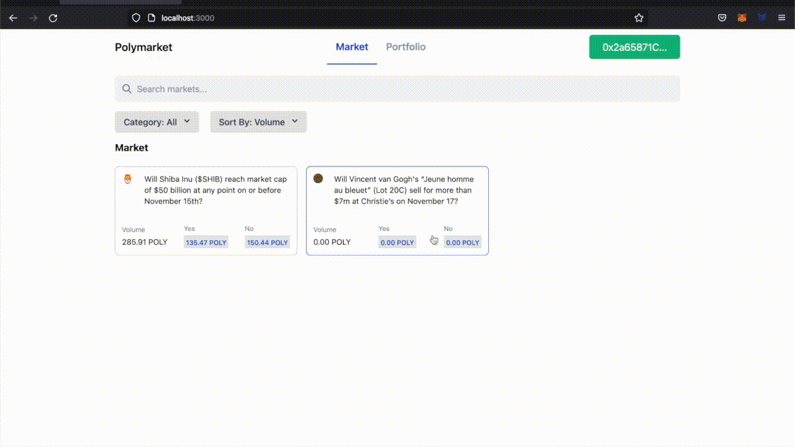
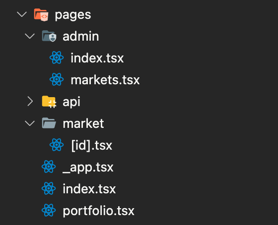
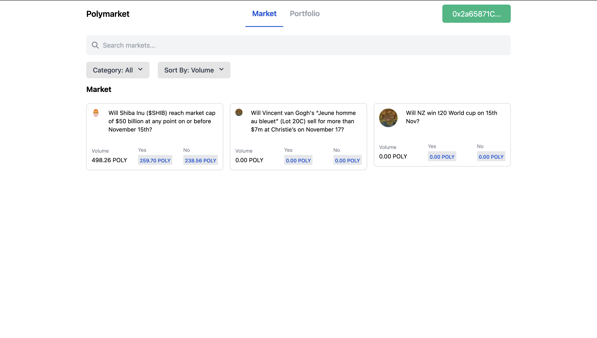
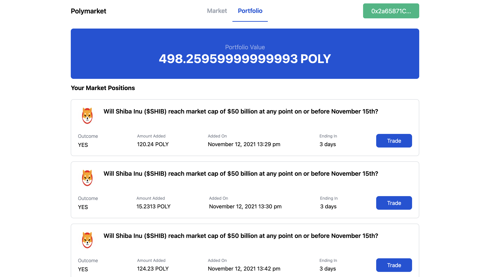
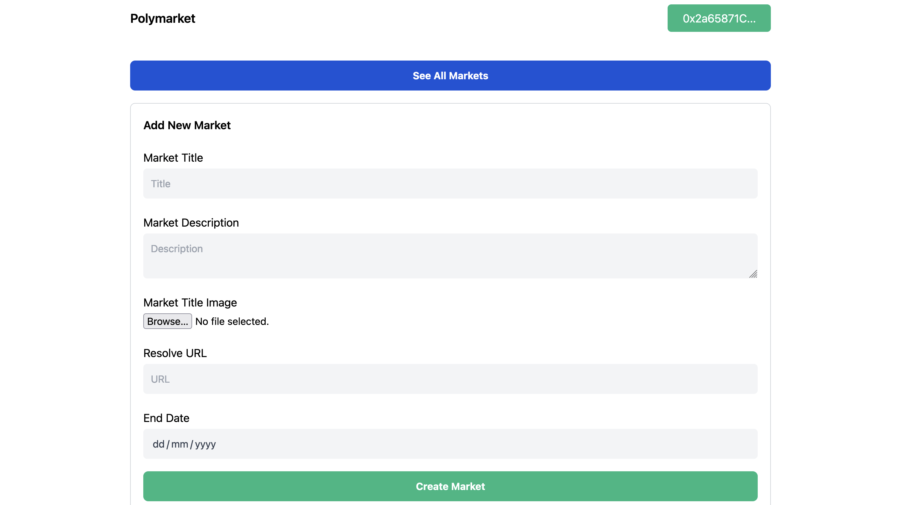
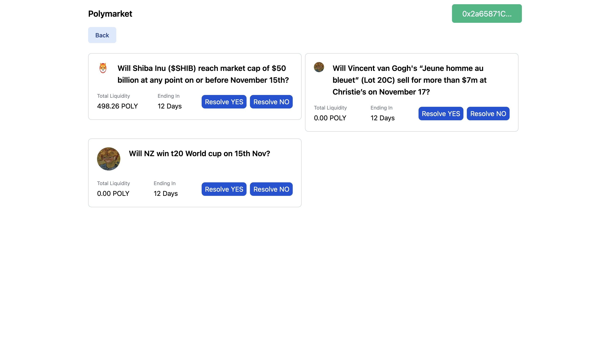
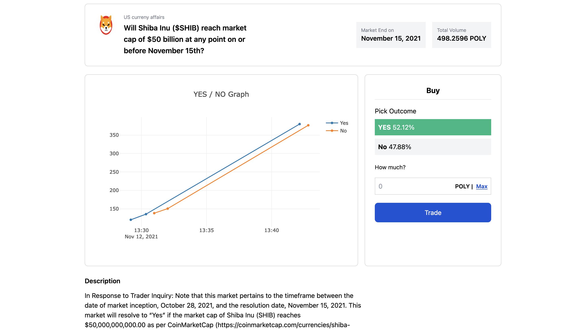
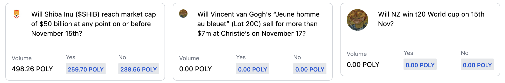
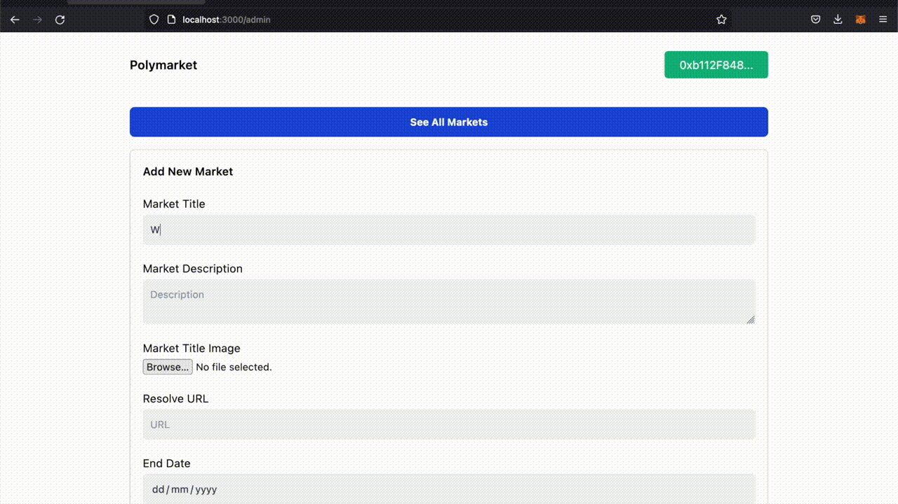
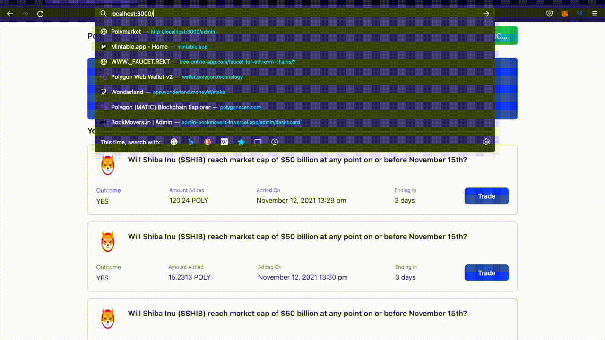

# Introduction

In this tutorial, we will learn how to create a [Polymarket](https://polymarket.com/) clone. Polymarket is a decentralized information market, harnessing the power of free markets to demystify the real-world events that matter most.

We will create a full-stack dApp with an admin panel where events/markets are created, and a UI where users can predict the outcome on the website. In this tutorial we will create two smart contracts, one for the ERC20 tokens used on our website to delegate an amount to a specific event, and another contract for Polymarket itself.

This is what the dApp we will be creating looks like:



# Prerequisites

To successfully follow this tutorial, you will need a good understanding of smart contracts, the Solidity programming language, the Truffle and Next.js frameworks, and TailwindCSS. We will be using the web3.js Javascript library to connect to the Polygon network and the Next.js framework for frontend and backend logic for our dApp.

# Requirements

- [Truffle](https://github.com/trufflesuite/truffle) - Truffle provides a local development environment for creating and testing blockchain applications.
- [Metamask](https://metamask.io/) - You will need a Metamask wallet installed in your browser.
- [NodeJs](https://nodejs.org/en/) - You must have Node.js installed. We recommend using v16.13.0 LTS.
- [IPFS](https://ipfs.io/) - We will store thumbnail images for a market on IPFS.

# Project Setup

Run the following commands in the terminal to create project directories and install required packages.

```text
npm install -g truffle
npx create-next-app --typescript polymarket
cd polymarket
truffle init
yarn add @openzeppelin/contracts @truffle/hdwallet-provider web3 dotenv tailwindcss @heroicons/react plotly.js plotly.js-dist-min @types/plotly.js-dist-min ipfs-http-client moment
```

`npm install -g truffle` command will install the Truffle framework in the system. `npx create-next-app --typescript polymarket` will create a Next.js project with typescript support, and `truffle init` will scaffold a Truffle project.

# Configuring truffle-config.js

We have to configure `truffle-config.js` to deploy our smart contract to the Matic testnet. Open `truffle-config.js` and replace the content with the following code:

```javascript
const HDWalletProvider = require('@truffle/hdwallet-provider');
const fs = require('fs');
const mnemonic = fs.readFileSync('.secret').toString().trim();

module.exports = {
  networks: {
    development: {
      host: 'localhost',
      port: 8545,
      network_id: '*',
    },
    matic: {
      provider: () =>
        new HDWalletProvider(
          mnemonic,
          `https://matic-mumbai.chainstacklabs.com`,
        ),
      network_id: 80001,
      confirmations: 2,
      timeoutBlocks: 200,
      skipDryRun: true,
      chainId: 80001,
    },
  },
  contracts_directory: './contracts',
  contracts_build_directory: './abis',
  compilers: {
    solc: {
      version: '^0.8.6',
      optimizer: {
        enabled: true,
        runs: 200,
      },
    },
  },

  db: {
    enabled: false,
  },
};
```

We have to get the Secret Recovery Phrase (mnemonic) of our Metamask account to deploy the smart contract. [Follow this tutorial](https://metamask.zendesk.com/hc/en-us/articles/360015290032-How-to-reveal-your-Secret-Recovery-Phrase) to get the mnemonic. Once you have a mnemonic, create a file called `.secret` in the root directory of our project and paste the mnemonic. Make sure you add `.secret` to your `.gitignore` file so that your mnemonic is not added into your git history.

If you don't have any MATIC tokens on the Polygon Mumbai testnet, then use the [Polygon Faucet](https://faucet.polygon.technology/) to get 1 MATIC token to pay gas fees.

# Creating PolyToken Smart Contract

Create a new file called `PolyToken.sol` in the `contracts` directory and add the following code:

```solidity
// SPDX-License-Identifier: GPL-3.0
pragma solidity ^0.8.6;
import "@openzeppelin/contracts/token/ERC20/ERC20.sol";

contract PolyToken is ERC20 {
    address public owner;

    constructor() ERC20("Poly Token", "POLY") {
        owner = msg.sender;
        _mint(msg.sender, 100000 * 10**18);
    }

    function mint(address to, uint256 amount) external {
        require(msg.sender == owner, "Only owner can mint");
        _mint(to, amount);
    }
}

```

We create a new ERC20 token named PolyToken, using the OpenZeppelin ERC20 contract. This is the token we will use in our Polymarket clone. We can use any stable taken like USDT or USDC, but for the simplicity of this tutorial, we will just create our token for testing. In the constructor of our token contract, we are minting and sending 100,000 POLY tokens to the contract's owner (the account deploying the contract).

# Creating Polymarket Smart Contract

Create a new file called `Polymarket.sol` in the `contracts` directory and add the following code:

```solidity
// SPDX-License-Identifier: MIT
pragma solidity ^0.8.6;
import "@openzeppelin/contracts/token/ERC20/ERC20.sol";

contract Polymarket {
    address public owner;
    address public polyToken;

    uint256 public totalMarkets = 0;
    constructor(address _polyToken) {
        owner = msg.sender;
        polyToken = _polyToken;
    }
}
```

In the Polymarket contract, we have the owner's address and polyToken ERC20 token's address which is set in the constructor.

Add the following code in the `Polymarket` contract, below the constructor:

```solidity
    mapping(uint256 => Markets) public markets;

    struct Markets {
        uint256 id;
        string  market;
        uint256 timestamp;
        uint256 endTimestamp;
        address createdBy;
        string creatorImageHash;
        AmountAdded[] yesCount;
        AmountAdded[] noCount;
        uint256 totalAmount;
        uint256 totalYesAmount;
        uint256 totalNoAmount;
        bool eventCompleted;
        string description;
        string resolverUrl;
    }

    struct AmountAdded {
        address user;
        uint256 amount;
        uint256 timestamp;
    }

    mapping(address => uint256) public winningAmount;
    address[] public winningAddresses;

    event MarketCreated(
        uint256 id,
        string market,
        uint256 timestamp,
        address createdBy,
        string creatorImageHash,
        uint256 totalAmount,
        uint256 totalYesAmount,
        uint256 totalNoAmount
    );
```

Here, we are creating a struct for markets and a mapping to store all the markets. In the `Markets` struct, we have `yesCount` and `noCount` which will store all the **YES** predictions and **NO** predictions respectively.

```solidity
    function createMarket(
        string memory _market,
        string memory _creatorImageHash,
        string memory _description,
        string memory _resolverUrl,
        uint256 _endTimestamp
    ) public {
        require(msg.sender == owner, "Unauthorized");
        uint256 timestamp = block.timestamp;

        Markets storage market = markets[totalMarkets];
        market.id = totalMarkets++;
        market.market = _market;
        market.timestamp = timestamp;
        market.createdBy = msg.sender;
        market.creatorImageHash = _creatorImageHash;
        market.totalAmount = 0;
        market.totalYesAmount = 0;
        market.totalNoAmount = 0;
        market.description = _description;
        market.resolverUrl = _resolverUrl;
        market.endTimestamp = _endTimestamp;

        emit MarketCreated(
            totalMarkets,
            _market,
            timestamp,
            msg.sender,
            _creatorImageHash,
            0,
            0,
            0
        );
    }
```

We have the `createMarket` method that accepts the data related to a market, creates a Market struct, stores it in the mapping and emits the `MarketCreated` event. This method can only be invoked by the owner of the contract.

```solidity

    function addYesBet(uint256 _marketId, uint256 _value) public payable {
        require(_value <= ERC20(polyToken).allowance(msg.sender, address(this)), "Not allowed to spend this amount.");
        Markets storage market = markets[_marketId];
        ERC20(polyToken).transferFrom(msg.sender, address(this), _value);
        AmountAdded memory amountAdded = AmountAdded(
            msg.sender,
            _value,
            block.timestamp
        );

        market.totalYesAmount += _value;
        market.totalAmount += _value;
        market.yesCount.push(amountAdded);
    }

    function addNoBet(uint256 _marketId, uint256 _value) public payable {
        require(_value <= ERC20(polyToken).allowance(msg.sender, address(this)), "Not allowed to spend this amount.");
        Markets storage market = markets[_marketId];
        ERC20(polyToken).transferFrom(msg.sender, address(this), _value);
        AmountAdded memory amountAdded = AmountAdded(
            msg.sender,
            _value,
            block.timestamp
        );

        market.totalNoAmount += _value;
        market.totalAmount += _value;
        market.noCount.push(amountAdded);
    }
```

- `addYesBet` accepts the market ID and the amount of tokens to be added to that market.
- We call the `allowance` method of ERC20 on `polyToken` to check if our contract is allowed to transfer the `_value` of tokens on behalf of the user. To transfer tokens, we must call the `approve` method on `polyToken` from our frontend.
- In approve method, the user essentially allows our `Polymarket` contract to spend a fixed amount of the `POLY` token.
- We call the `transferFrom` method of ERC20 on `polyToken` to transfer an amount of token from `msg.sender`'s account to the contract's address.
- After these steps, we can create an `AmountAdded` object with `msg.sender`, `_value`, and the current timestamp of the block.
- Update the `totalAmount` of the market.
- In `addYesBet` we update the `totalYesAmount` by adding `_value` and in `addNoBet` we update the `totalNoAmount`.
- Then we can add `amountAdded` object in `yesCount` or `noCount` with respect to the `addYesBet` of `addNoBet`.

```solidity
    function getGraphData(uint256 _marketId)
        public
        view
        returns (AmountAdded[] memory, AmountAdded[] memory)
    {
        Markets storage market = markets[_marketId];
        return (market.yesCount, market.noCount);
    }
```

The `getGraphData` method accepts the `marketId` and returns the `yesCount` and `noCount` of that market to generate the graph on the frontend.

```solidity
function distributeWinningAmount(uint256 _marketId, bool eventOutcome)
        public
        payable
    {
        require(msg.sender == owner, "Unauthorized");

        Markets storage market = markets[_marketId];
        if (eventOutcome) {
            for (uint256 i = 0; i < market.yesCount.length; i++) {
                uint256 amount = (market.totalNoAmount *
                    market.yesCount[i].amount) / market.totalYesAmount;
                winningAmount[market.yesCount[i].user] += (amount +
                    market.yesCount[i].amount);
                winningAddresses.push(market.yesCount[i].user);
            }

            for (uint256 i = 0; i < winningAddresses.length; i++) {
                address payable _address = payable(winningAddresses[i]);
                ERC20(polyToken).transfer(_address, winningAmount[_address]);
                delete winningAmount[_address];
            }
            delete winningAddresses;
        } else {
            for (uint256 i = 0; i < market.noCount.length; i++) {
                uint256 amount = (market.totalYesAmount *
                    market.noCount[i].amount) / market.totalNoAmount;
                winningAmount[market.noCount[i].user] += (amount +
                    market.noCount[i].amount);
                winningAddresses.push(market.noCount[i].user);
            }

            for (uint256 i = 0; i < winningAddresses.length; i++) {
                address payable _address = payable(winningAddresses[i]);
                ERC20(polyToken).transfer(_address, winningAmount[_address]);
                delete winningAmount[_address];
            }
            delete winningAddresses;
        }
        market.eventCompleted = true;
    }
```

- `distributeWinningAmount` is invoked by `owner` when the event is completed. `distributeWinningAmount` accepts `marketId` and the `eventOutcome` to distribute the winning amounts.
- Loop over all the `yesCount`/`noCount` in the market and calculate the winning amount using the below formula.

For Yes event - `amount = (totalNoAmount * amount) / totalYesAmount;`
For No event - `amount = (totalYesAmount * amount) / totalNoAmount;`

- There might be a condition when a user has added tokens more than one time for the same outcome, and to handle this we will create a map for each user's address and increment the winning amount for that user.
- We then use the `winningAddresses` array to push the user's address, which we will use later to loop over and disburse the winning amount.
- Once we have the `winningAddresses` array and `winningAmount` map, loop over the `winningAddresses` and call the `transfer` method of ERC20 token with the user's address and winning amount for that user.
- In the end, we delete `winningAddresses` and `winningAmount` to clear the space in the contract, which will reduce the gas fees, and set the `eventCompleted` for that particular market to `true`.

We are done with `PolyToken.sol` and `Polymarket.sol`, let's deploy these smart contracts on Polygon Testnet.

# Compiling and deploying with Truffle

Go to the `migrations` directory, create a new file `2_polytoken_polymarket.js` and add the following code:

```javascript
const PolyToken = artifacts.require('PolyToken');
const Polymarket = artifacts.require('Polymarket');

module.exports = async function (deployer) {
  await deployer.deploy(PolyToken);
  const polyToken = await PolyToken.deployed();

  await deployer.deploy(Polymarket, polyToken.address);
};
```

We deploy the `PolyToken` first, and once it's deployed we can get the deployed `address` of PolyToken and send this `address` as a parameter to deploy the `Polymarket` contract since the constructor of `Polymarket` requires the contract address of `PolyToken`.

Run the following command to compile and deploy the contracts on Polygon testnet.

```text
truffle compile
truffle deploy --network matic
```

# Creating Frontend

In our dApp, we will be creating five pages:



`index.tsx` contains the main page for users where all the markets are listed.



`portfolio.tsx` contains all the market bets placed by the logged-in user.



`admin/index.tsx` used by admin to create new markets.



`admin/markets.tsx` can be used by admin to resolve the market and decide the out, which will call the `distributeWinningAmount` method of Polymarket contract.



`markets/[id].tsx` contains the details of a specific market, including description, Yes/No graph, and a section where users can place predictions on the outcome of that market.



We will start by creating `context.tsx` which will handle the smart contract instances. Create a file `DataContext.tsx` in `context` directory and paste the following code:

```tsx
// contexts/DataContext.tsx
declare let window: any;
import { createContext, useContext, useState } from 'react';
import Web3 from 'web3';
import Polymarket from '../abis/Polymarket.json';
import PolyToken from '../abis/PolyToken.json';

interface DataContextProps {
  account: string;
  loading: boolean;
  loadWeb3: () => Promise<void>;
  polymarket: any;
  polyToken: any;
}

const DataContext = createContext<DataContextProps>({
  account: '',
  loading: true,
  loadWeb3: async () => {},
  polymarket: null,
  polyToken: null,
});

export const DataProvider: React.FC = ({ children }) => {
  const data = useProviderData();

  return <DataContext.Provider value={data}>{children}</DataContext.Provider>;
};

export const useData = () => useContext<DataContextProps>(DataContext);

export const useProviderData = () => {
  const [loading, setLoading] = useState(true);
  const [account, setAccount] = useState('');
  const [polymarket, setPolymarket] = useState<any>();
  const [polyToken, setPolyToken] = useState<any>();

  const loadWeb3 = async () => {
    if (window.ethereum) {
      window.web3 = new Web3(window.ethereum);
      ethereum.request({ method: 'eth_requestAccounts' });
    } else if (window.web3) {
      window.web3 = new Web3(window.web3.currentProvider);
    } else {
      window.alert('Non-Eth browser detected. Please consider using MetaMask.');
      return;
    }
    var allAccounts = await window.web3.eth.getAccounts();
    setAccount(allAccounts[0]);
    await loadBlockchainData();
  };

  const loadBlockchainData = async () => {
    const web3 = window.web3;

    const polymarketData = Polymarket.networks['80001'];
    const polyTokenData = PolyToken.networks['80001'];

    if (polymarketData && polyTokenData) {
      var tempContract = await new web3.eth.Contract(
        Polymarket.abi,
        polymarketData.address,
      );
      setPolymarket(tempContract);
      var tempTokenContract = await new web3.eth.Contract(
        PolyToken.abi,
        polyTokenData.address,
      );

      setPolyToken(tempTokenContract);
    } else {
      window.alert('TestNet not found');
    }
    setTimeout(() => {
      setLoading(false);
    }, 500);
  };

  return {
    account,
    polymarket,
    polyToken,
    loading,
    loadWeb3,
  };
};
```

In `useProviderData` function, we have `loadWeb3` and `loadBlockchainData`. `loadWeb3` connect our app with Metamask and set the account address. In `loadBlockchainData` we create the instances of `PolyToken` and `Polymarket` contracts and set the stateful instance.

We will start with `index.tsx`. Open `pages/index.tsx` and paste the following code:

```tsx
// pages/index.tsx
import Head from 'next/head';
import { useCallback, useEffect, useState } from 'react';
import { MarketCard } from '../components/MarketCard';
import Navbar from '../components/Navbar';
import { useData } from '../contexts/DataContext';
import styles from '../styles/Home.module.css';

export interface MarketProps {
  id: string;
  title: string;
  imageHash: string;
  totalAmount: string;
  totalYes: string;
  totalNo: string;
}

export default function Home() {
  const { polymarket, account, loadWeb3, loading } = useData();
  const [markets, setMarkets] = useState<MarketProps[]>([]);

  const getMarkets = useCallback(async () => {
    var totalMarkets = await polymarket.methods
      .totalMarkets()
      .call({ from: account });

    var dataArray: MarketProps[] = [];
    for (var i = 0; i < totalMarkets; i++) {
      var data = await polymarket.methods.markets(i).call({ from: account });
      dataArray.push({
        id: data.id,
        title: data.market,
        imageHash: data.creatorImageHash,
        totalAmount: data.totalAmount,
        totalYes: data.totalYesAmount,
        totalNo: data.totalNoAmount,
      });
    }
    setMarkets(dataArray);
  }, [account, polymarket]);

  useEffect(() => {
    loadWeb3().then(() => {
      if (!loading) getMarkets();
    });
  }, [loading]);

  return (
    <div className={styles.container}>
      <Head>
        <title>Polymarket</title>
        <meta name="description" content="Generated by create next app" />
        <link rel="icon" href="/favicon.ico" />
      </Head>
      <Navbar />
      <main className="w-full flex flex-col sm:flex-row flex-wrap sm:flex-nowrap py-4 flex-grow max-w-5xl">
        <div className="w-full flex flex-col flex-grow pt-1">
          <div className="relative text-gray-500 focus-within:text-gray-400 w-full">
            <span className="absolute inset-y-0 left-0 flex items-center px-3">
              <svg
                fill="none"
                stroke="currentColor"
                strokeLinecap="round"
                strokeLinejoin="round"
                strokeWidth="2"
                viewBox="0 0 24 24"
                className="w-5 h-5"
              >
                <path d="M21 21l-6-6m2-5a7 7 0 11-14 0 7 7 0 0114 0z"></path>
              </svg>
            </span>
            <input
              type="search"
              name="q"
              className="w-full py-3 px-3 text-base text-gray-700 bg-gray-100 rounded-md pl-10 focus:outline-none"
              placeholder="Search markets..."
              autoComplete="off"
            />
          </div>
          <span className="font-bold my-3 text-lg">Market</span>
          <div className="flex flex-wrap overflow-hidden sm:-mx-1 md:-mx-2">
            {markets.map(market => {
              return (
                <MarketCard
                  id={market.id}
                  key={market.id}
                  title={market.title}
                  totalAmount={market.totalAmount}
                  totalYes={market.totalYes}
                  totalNo={market.totalNo}
                  imageHash={market.imageHash}
                />
              );
            })}
          </div>
        </div>
      </main>
    </div>
  );
}
```

We have created a `MarketProps` interface which we will use as a type later for storing market objects. Next, we will create a function `getMarkets` which will fetch the `totalMarkets` from the `polymarket` contract, loop over the `totalMarkets` count, and fetch each market from the smart contract. Once we have all the markets we will set the `markets` state variable.

On this page, we have two main components, `Navbar` and `MarketCard`.

```tsx
// components/Navbar.tsx
import Link from 'next/link';
import { useRouter } from 'next/router';
import React from 'react';
import { useData } from '../contexts/DataContext';

function Navbar() {
  const router = useRouter();
  const { account, loadWeb3 } = useData();

  return (
    <>
      <nav className="w-full h-16 mt-auto max-w-5xl">
        <div className="flex flex-row justify-between items-center h-full">
          <Link href="/" passHref>
            <span className="font-semibold text-xl cursor-pointer">
              Polymarket
            </span>
          </Link>
          {!router.asPath.includes('/market') &&
            !router.asPath.includes('/admin') && (
              <div className="flex flex-row items-center justify-center h-full">
                <TabButton
                  title="Market"
                  isActive={router.asPath === '/'}
                  url={'/'}
                />
                <TabButton
                  title="Portfolio"
                  isActive={router.asPath === '/portfolio'}
                  url={'/portfolio'}
                />
              </div>
            )}
          {account ? (
            <div className="bg-green-500 px-6 py-2 rounded-md cursor-pointer">
              <span className="text-lg text-white">
                {account.substr(0, 10)}...
              </span>
            </div>
          ) : (
            <div
              className="bg-green-500 px-6 py-2 rounded-md cursor-pointer"
              onClick={() => {
                loadWeb3();
              }}
            >
              <span className="text-lg text-white">Connect</span>
            </div>
          )}
        </div>
      </nav>
    </>
  );
}

export default Navbar;

const TabButton = ({
  title,
  isActive,
  url,
}: {
  title: string;
  isActive: boolean;
  url: string;
}) => {
  return (
    <Link href={url} passHref>
      <div
        className={`h-full px-4 flex items-center border-b-2 font-semibold hover:border-blue-700 hover:text-blue-700 cursor-pointer ${
          isActive
            ? 'border-blue-700 text-blue-700 text-lg font-semibold'
            : 'border-white text-gray-400 text-lg'
        }`}
      >
        <span>{title}</span>
      </div>
    </Link>
  );
};
```


The navbar has two basic functions, connect our dApp with Metamask, and show the tab bar for the user to toggle between Markets and Portfolio. We only show the tab bar if the user is not on admin pages.

To connect to Metamask from our dApp, we will use the `loadWeb3` function from out `DataContact.tsx` as you can see above.

```tsx
// components/MarketCard.tsx
import Img from 'next/image';
import Link from 'next/link';
import React from 'react';
import Web3 from 'web3';
import { MarketProps } from '../pages';

export const MarketCard: React.FC<MarketProps> = ({
  id,
  title,
  totalAmount,
  totalYes,
  totalNo,
  imageHash,
}) => {
  return (
    <div className="w-full overflow-hidden sm:my-1 sm:px-1 sm:w-1/3 md:my-2 md:px-2 md:w-1/3 lg:w-1/3 xl:w-1/3 my-2">
      <Link href={`/market/${id}`} passHref>
        <div className="flex flex-col border border-gray-300 rounded-lg p-3 hover:border-blue-700 cursor-pointer">
          <div className="flex flex-row space-x-5 pb-8">
            <div className="w-12  h-w-12 ">
              
            </div>
            <span className="text-sm">{title}</span>
          </div>
          <div className="flex flex-row flex-nowrap justify-between items-center">
            <div className="flex flex-col space-y-1">
              <span className="text-xs text-gray-500 font-light">Volume</span>
              <span className="text-sm">
                {parseFloat(Web3.utils.fromWei(totalAmount, 'ether')).toFixed(
                  2,
                )}{' '}
                POLY
              </span>
            </div>
            <div className="flex flex-col space-y-1">
              <span className="text-xs text-gray-500 font-light">Yes</span>
              <div className="px-1 bg-gray-200 text-center rounded-sm">
                <span className="text-xs font-medium text-blue-700">
                  {parseFloat(Web3.utils.fromWei(totalYes, 'ether')).toFixed(2)}{' '}
                  POLY
                </span>
              </div>
            </div>
            <div className="flex flex-col space-y-1">
              <span className="text-xs text-gray-500 font-light">No</span>
              <div className="px-1 bg-gray-200 text-center rounded-sm">
                <span className="text-xs font-medium text-blue-700">
                  {parseFloat(Web3.utils.fromWei(totalNo, 'ether')).toFixed(2)}{' '}
                  POLY
                </span>
              </div>
            </div>
          </div>
        </div>
      </Link>
    </div>
  );
};
```



`MarketCard` accepts the `MarketProps` as a parameter and displays the image, title, market total values, YES/NO total values in that market. Clicking each market will redirect the user to the market details page.

Next, we will start with the `admin/index.tsx` page, which will allow us to create markets, so that we will have some markets to work with when we create other pages.

```tsx
// admin/index.tsx
import { create } from 'ipfs-http-client';
import Head from 'next/head';
import Link from 'next/link';
import { useRouter } from 'next/router';
import React, { useEffect } from 'react';
import Navbar from '../../components/Navbar';
import { useData } from '../../contexts/DataContext';

const Admin = () => {
  const router = useRouter();
  const { polymarket, loadWeb3, account } = useData!();
  const [loading, setLoading] = React.useState(false);
  const client = create({ url: 'https://ipfs.infura.io:5001/api/v0' });

  const [title, setTitle] = React.useState('');
  const [description, setDescription] = React.useState('');
  const [imageHash, setImageHash] = React.useState('');
  const [resolverUrl, setResolverUrl] = React.useState('');
  const [timestamp, setTimestamp] = React.useState<
    string | number | readonly string[] | undefined
  >(Date());

  const uploadImage = async (e: any) => {
    const file = e.target.files[0];
    const added = await client.add(file);
    setImageHash(added.path);
  };

  useEffect(() => {
    loadWeb3();
  }, [loading]);

  const handleSubmit = async () => {
    setLoading(true);
    await polymarket.methods
      .createMarket(title, imageHash, description, resolverUrl, timestamp)
      .send({
        from: account,
      });
    setLoading(false);
    setTitle('');
    setDescription('');
    setImageHash('');
    setResolverUrl('');
    setTimestamp(undefined);
    router.push('/');
  };

  return (
    <>
      <div className="flex flex-col justify-center items-center h-full p-5">
        <Head>
          <title>Polymarket</title>
          <meta name="description" content="Generated by create next app" />
          <link rel="icon" href="/favicon.ico" />
        </Head>
        <Navbar />
        <main className="w-full flex flex-col py-4 max-w-5xl pb-6">
          <Link href="/admin/markets">
            <a className="mt-5 rounded-lg py-3 text-center w-full bg-blue-700 text-white font-bold mb-5">
              See All Markets
            </a>
          </Link>
          <div className="w-full flex flex-col pt-1 border border-gray-300 p-5 rounded-lg ">
            <span className="text-lg font-semibold mt-4">Add New Market</span>
            <span className="text-lg font mt-6 mb-1">Market Title</span>
            <input
              type="input"
              name="title"
              value={title}
              onChange={e => setTitle(e.target.value)}
              className="w-full py-3 px-3 text-base text-gray-700 bg-gray-100 rounded-md focus:outline-none"
              placeholder="Title"
              autoComplete="off"
            />
            <span className="text-lg font mt-6 mb-1">Market Description</span>
            <textarea
              name="description"
              value={description}
              onChange={e => setDescription(e.target.value)}
              className="w-full py-3 px-3 text-base text-gray-700 bg-gray-100 rounded-md focus:outline-none"
              placeholder="Description"
              autoComplete="off"
            ></textarea>
            <span className="text-lg font mt-6 mb-1">Market Title Image</span>
            <input type="file" onChange={uploadImage} />
            <span className="text-lg font mt-6 mb-1">Resolve URL</span>
            <input
              type="input"
              name="resolverUrl"
              value={resolverUrl}
              onChange={e => setResolverUrl(e.target.value)}
              className="w-full py-3 px-3 text-base text-gray-700 bg-gray-100 rounded-md focus:outline-none"
              placeholder="URL"
              autoComplete="off"
            />
            <span className="text-lg font mt-6 mb-1">End Date</span>
            <input
              type="date"
              name="timestamp"
              onChange={e => {
                setTimestamp(e.target.valueAsDate?.getTime());
              }}
              className="w-full py-3 px-3 text-base text-gray-700 bg-gray-100 rounded-md focus:outline-none"
              autoComplete="off"
            />
            {loading ? (
              <span className="text-center pt-5 pb-3 text-xl font-bold">
                Loading...
              </span>
            ) : (
              <button
                className="mt-5 rounded-lg py-3 text-center w-full bg-green-500 text-white font-bold"
                onClick={() => {
                  handleSubmit();
                }}
              >
                Create Market
              </button>
            )}
          </div>
        </main>
      </div>
    </>
  );
};

export default Admin;
```



On this page, we are creating a form through which the admin can create a new market. While creating a new market, the admin must add a title, description, title image, resolve URL, and the end date for the market. Here resolve URL is the URL that will be referred by the admin to decide the outcome of the market. We have two functions, one to upload the image to IPFS and the other to call the `createMarket` method of the `Polymarket` contract.

Once this page is completed, we can create a new market and head to the home page to see the newly listed market.

Next, we will create the market details page. Create a file `pages/market/[id].tsx` and paste the following code:

```tsx
// pages/market/[id].tsx
import moment from 'moment';
import Head from 'next/head';
import Img from 'next/image';
import { useRouter } from 'next/router';
import React, { useCallback, useEffect, useState } from 'react';
import Web3 from 'web3';
import ChartContainer from '../../components/Chart/ChartContainer';
import Navbar from '../../components/Navbar';
import { useData } from '../../contexts/DataContext';

export interface MarketProps {
  id: string;
  title: string;
  imageHash: string;
  totalAmount: number;
  totalYes: number;
  totalNo: number;
  description: string;
  endTimestamp: number;
  resolverUrl: string;
}

const Details = () => {
  const router = useRouter();
  const { id } = router.query;
  const { polymarket, account, loadWeb3, loading, polyToken } = useData();
  const [market, setMarket] = useState<MarketProps>();
  const [selected, setSelected] = useState<string>('YES');
  const [dataLoading, setDataLoading] = useState(true);
  const [button, setButton] = useState<string>('Trade');

  const [input, setInput] = useState('');

  const getMarketData = useCallback(async () => {
    var data = await polymarket.methods.markets(id).call({ from: account });
    setMarket({
      id: data.id,
      title: data.market,
      imageHash: data.creatorImageHash,
      totalAmount: parseInt(data.totalAmount),
      totalYes: parseInt(data.totalYesAmount),
      totalNo: parseInt(data.totalNoAmount),
      description: data.description,
      endTimestamp: parseInt(data.endTimestamp),
      resolverUrl: data.resolverUrl,
    });
    setDataLoading(false);
  }, [account, id, polymarket]);

  useEffect(() => {
    loadWeb3().then(() => {
      if (!loading) getMarketData();
    });
  }, [loading]);

  return (
    <div className="flex flex-col justify-center items-center h-full">
      <Head>
        <title>Polymarket</title>
        <meta name="description" content="Generated by create next app" />
        <link rel="icon" href="/favicon.ico" />
      </Head>
      <Navbar />
      <main className="w-full flex flex-col sm:flex-row py-4 max-w-5xl">
        {dataLoading ? (
          <div className="flex flex-col justify-center items-center h-full w-full pt-10">
            <div className="text-center">
              <div className="text-3xl font-bold">Loading...</div>
            </div>
          </div>
        ) : (
          <div className="w-full flex flex-col pt-1">
            <div className="p-6 rounded-lg flex flex-row justify-start border border-gray-300">
              <div className="flex flex-row">
                <div className="h-w-15 pr-4">
                  
                </div>
                <div className="flex flex-col justify-start w-1/2 space-y-1">
                  <span className="text-xs font-light text-gray-500 whitespace-nowrap">
                    US curreny affairs
                  </span>
                  <span className="text-lg font-semibold whitespace-nowrap">
                    {market?.title}
                  </span>
                </div>
              </div>
              <div className="flex flex-row items-center space-x-4 ml-3">
                <div className="flex flex-col justify-start bg-gray-100 p-3">
                  <span className="text-xs font-light text-gray-500 whitespace-nowrap">
                    Market End on
                  </span>
                  <span className="text-base font-semibold text-black whitespace-nowrap">
                    {market?.endTimestamp
                      ? moment(
                          parseInt((market?.endTimestamp).toFixed(0)),
                        ).format('MMMM D, YYYY')
                      : 'N/A'}
                  </span>
                </div>
                <div className="flex flex-col justify-start bg-gray-100 p-3">
                  <span className="text-xs font-light text-gray-500 whitespace-nowrap">
                    Total Volume
                  </span>
                  <span className="text-base font-semibold text-black whitespace-nowrap">
                    {Web3.utils.fromWei(
                      market?.totalAmount.toString() ?? '0',
                      'ether',
                    ) ?? 0}{' '}
                    POLY
                  </span>
                </div>
              </div>
            </div>
            <div className="flex flex-col space-y-3">
              <div className="w-full flex flex-row mt-5">
                <div className="w-2/3 border rounded-lg p-1 pb-4 border-gray-300 mr-2">
                  <ChartContainer marketId={market?.id ?? '0'} />
                </div>
                <div className="w-1/3 rounded-lg border border-gray-300 ml-2">
                  <div className="flex flex-col items-start p-6">
                    <span className="text-lg font-bold m-auto pb-2">Buy</span>
                    <hr className="text-black w-full py-2" />
                    <span className="text-base">Pick Outcome</span>
                    <div
                      className={`w-full py-2 px-2 ${
                        selected == 'YES'
                          ? 'bg-green-500 text-white'
                          : 'bg-gray-100'
                      } mt-2 cursor-pointer`}
                      onClick={() => setSelected('YES')}
                    >
                      <span className="font-bold">YES</span>{' '}
                      {!market?.totalAmount
                        ? `0`
                        : (
                            (market?.totalYes * 100) /
                            market?.totalAmount
                          ).toFixed(2)}
                      %
                    </div>
                    <div
                      className={`w-full py-2 px-2 ${
                        selected == 'NO'
                          ? 'bg-green-500 text-white'
                          : 'bg-gray-100'
                      } mt-2 cursor-pointer`}
                      onClick={() => setSelected('NO')}
                    >
                      <span className="font-bold">No</span>{' '}
                      {!market?.totalAmount
                        ? `0`
                        : (
                            (market?.totalNo * 100) /
                            market?.totalAmount
                          ).toFixed(2)}
                      %
                    </div>
                    <span className="text-sm mt-5 mb-4">How much?</span>
                    <div className="w-full border border-gray-300 flex flex-row items-center">
                      <input
                        type="search"
                        name="q"
                        value={input}
                        onChange={e => setInput(e.target.value)}
                        className="w-full py-2 px-2 text-base text-gray-700 border-gray-300 rounded-md focus:outline-none"
                        placeholder="0"
                        autoComplete="off"
                      />
                      <span className="whitespace-nowrap text-sm font-semibold">
                        POLY |{' '}
                      </span>
                      <span className="text-sm font-semibold text-blue-700 mx-2 underline cursor-pointer">
                        Max
                      </span>
                    </div>
                    <button
                      className="mt-5 rounded-lg py-3 text-center w-full bg-blue-700 text-white"
                      onClick={handleTrade}
                      disabled={button !== 'Trade'}
                    >
                      {button}
                    </button>
                  </div>
                </div>
              </div>
              <div className="w-2/3 flex flex-col">
                <span className="text-base font-semibold py-3">
                  Description
                </span>
                <span>{market?.description}</span>
                <span className="text-base my-3 py-2 bg-gray-100 rounded-xl px-3">
                  Resolution Source :{' '}
                  <a className="text-blue-700" href={market?.resolverUrl}>
                    {market?.resolverUrl}
                  </a>
                </span>
              </div>
            </div>
          </div>
        )}
      </main>
    </div>
  );
};

export default Details;
```


The market details page has four sections:

- The top section shows the metadata like market title, TVL (Total Value Locked), and the time of expiry of the market.
- The middle section shows the graph and tool to make your predictions by deligating the POLY token in either YES/NO event.
- Lastly, the bottom section is the information section which shows the description and the resolve URL which will be used by the admin to decide the outcome of that event.

In the `useEffect` hook, we are calling the `getMarketData` function which will get the ID from the URL for the particular market and fetch the required data from the `Polymarket` contract.

The top and bottom parts are pretty much self-explanatory, so we will focus on the POLY token delegation section and Graph section.

In POLY token delegation, the user has the option to select in which outcome they want to delegate token i.e in either Yes or No. Once they have selected the outcome, users can add the number of tokens they wish to delegate and click the trade button.

Add the following function in the `Details` component:

```javascript
const handleTrade = async () => {
  var bal = await polyToken.methods.balanceOf(account).call();
  setButton('Please wait');

  if (input && selected === 'YES') {
    if (parseInt(input) < parseInt(Web3.utils.fromWei(bal, 'ether'))) {
      await polyToken.methods
        .approve(polymarket._address, Web3.utils.toWei(input, 'ether'))
        .send({ from: account });
      await polymarket.methods
        .addYesBet(id, Web3.utils.toWei(input, 'ether'))
        .send({ from: account });
    }
  } else if (input && selected === 'NO') {
    if (parseInt(input) < parseInt(Web3.utils.fromWei(bal, 'ether'))) {
      await polyToken.methods
        .approve(polymarket._address, Web3.utils.toWei(input, 'ether'))
        .send({ from: account });
      await polymarket.methods
        .addNoBet(id, Web3.utils.toWei(input, 'ether'))
        .send({ from: account });
    }
  }
  await getMarketData();
  setButton('Trade');
};
```

- In the `handleTrade` method, we fetch the current balance of the user using the `balanceOf` method of the `polyToken` contract and depending on the selected prediction of the user (yes or no).
- We first have to check if the user has sufficient balance and then call the approve method of `polyToken` and pass the `Polymarket` contract address and the amount of Polytoken user wish to delegate.
- After doing so `Polytoken` contract can call the `transferFrom` method to transfer the Polytoken from the user's account to the smart contract. Note that we can only transfer the amount that the user had approved.

After the `approve` call, we make a contract call to `addYesBet` / `addNoBet` depending on the user's selection and passing in the `id` of the market and amount of POLY tokens entered by the user in Wei. Once all the calls to smart contracts are completed we can call `getMarketData` again to fetch the latest market data, which should reflect the trade just made.

For the graph section, create a new file in the `components/Chart` directory called `ChartContainer.tsx` and paste the following code:

```tsx
// components/Chart/ChartContainer.tsx
import 'chartjs-adapter-moment';
import Plotly from 'plotly.js-dist-min';
import React, { useEffect } from 'react';
import Web3 from 'web3';
import { useData } from '../../contexts/DataContext';

interface Props {
  marketId: string;
}

interface ChartData {
  time: Date[];
  amount: number[];
}

const ChartContainer: React.FC<Props> = ({ marketId }) => {
  const { polymarket } = useData();

  const fetchGraphData = async () => {
    var data = await polymarket.methods.getGraphData(marketId).call();
    var yesData: ChartData = {
      time: [],
      amount: [],
    };
    var noData: ChartData = {
      time: [],
      amount: [],
    };
    data['0'].forEach((item: any) => {
      var sum = yesData.amount.reduce((a, b) => a + b, 0);
      yesData.amount.push(
        sum + parseFloat(Web3.utils.fromWei(item[1], 'ether')),
      );
      yesData.time.push(new Date(parseInt(item[2] + '000')));
    });
    data['1'].forEach((item: any) => {
      var sum = noData.amount.reduce((a, b) => a + b, 0);
      noData.amount.push(
        sum + parseFloat(Web3.utils.fromWei(item[1], 'ether')),
      );
      noData.time.push(new Date(parseInt(item[2] + '000')));
    });

    var yes = {
      x: [...yesData.time],
      y: [...yesData.amount],
      mode: 'lines+markers',
      name: 'Yes',
    };

    var no = {
      x: [...noData.time],
      y: [...noData.amount],
      mode: 'lines+markers',
      name: 'No',
    };
    var chartData = [yes, no];

    var layout = {
      title: 'YES / NO Graph',
    };

    Plotly.newPlot('myDiv', chartData, layout, { displayModeBar: false });
  };

  useEffect(() => {
    fetchGraphData();
  });

  return (
    <>
      <div id="myDiv"></div>
    </>
  );
};

export default ChartContainer;
```

In `ChartContainer`, we need two lists, one for `YesData` and the other for `NoData`, each list has a list of timestamps and a list of the amount added at that time. Make a `Polymarket` contract call to `getGraphData` and pass in the `marketId`. `getGraphData` returns an array for both Yes data and No data.

Loop over both the arrays and create the required data structure for the Graph. To plot the graph we will use `plotly.js` and pass in the timestamp in the x-axis and token amount in the y-axis. In the end, we call `Plotly.newPlot()` and pass in the chartData and layout to plot the graph.

Now let's create a Portfolio section, where the users can see all the market values they have delegated into.

```tsx
// pages/portfolio.tsx
import Head from 'next/head';
import React, { useCallback, useEffect, useState } from 'react';
import Web3 from 'web3';
import Navbar from '../components/Navbar';
import { PortfolioMarketCard } from '../components/PortfolioMarketCard';
import { useData } from '../contexts/DataContext';
import styles from '../styles/Home.module.css';

export interface MarketProps {
  id: string;
  title?: string;
  imageHash?: string;
  totalAmount?: string;
  totalYes?: string;
  totalNo?: string;
  userYes?: string;
  hasResolved?: boolean;
  userNo?: string;
  timestamp?: string;
  endTimestamp?: string;
}

export interface MarketsProps {
  id: string;
  title?: string;
  imageHash?: string;
  totalAmount?: string;
  totalYes?: string;
  totalNo?: string;
  hasResolved?: boolean;
  endTimestamp?: string;
}

const Portfolio = () => {
  const { polymarket, account, loadWeb3, loading } = useData();
  const [markets, setMarkets] = useState<MarketProps[]>([]);
  const [portfolioValue, setPortfolioValue] = useState<number>(0);
  const [allMarkets, setAllMarkets] = useState<MarketsProps[]>([]);
  const [openPositions, setOpenPositions] = useState<number>(0);

  useEffect(() => {
    loadWeb3().then(() => {
      if (!loading) {
        getMarkets();
      }
    });
  }, [loading]);

  return (
    <div className={styles.container}>
      <Head>
        <title>Polymarket</title>
        <meta name="description" content="Generated by create next app" />
        <link rel="icon" href="/favicon.ico" />
      </Head>
      <Navbar />
      <main className="w-full flex flex-col sm:flex-row flex-wrap sm:flex-nowrap py-4 flex-grow max-w-5xl">
        <div className="w-full flex flex-col pt-1">
          <div className="p-10 bg-blue-700 rounded-lg flex flex-row justify-evenly">
            <div className="flex flex-col items-center">
              <h1 className="text-white opacity-50 text-lg">Portfolio Value</h1>
              <h1 className="text-white text-4xl font-bold">
                {Web3.utils.fromWei(portfolioValue.toString())} POLY
              </h1>
            </div>
          </div>
          <span className="font-bold my-3 text-lg">Your Market Positions</span>
          {markets.map(market => (
            <PortfolioMarketCard
              id={market.id}
              title={market.title!}
              imageHash={market.imageHash!}
              totalAmount={market.totalAmount!}
              totalYes={market.totalYes!}
              totalNo={market.totalNo!}
              userYes={market.userYes!}
              userNo={market.userNo!}
              key={market.id!}
              hasResolved={market.hasResolved!}
              timestamp={market.timestamp!}
              endTimestamp={market.endTimestamp!}
            />
          ))}
        </div>
      </main>
    </div>
  );
};

export default Portfolio;
```

In the Portfolio, we have Navbar, a list of markets, and the total portfolio value. To get the list of markets, paste the following code in the `Portfolio` component before the return statement.

```javascript
// pages/portfolio.tsx

const getMarkets = useCallback(async () => {
    var totalMarkets = await polymarket.methods
      .totalMarkets()
      .call({ from: account });
    for (var i = 0; i < totalMarkets; i++) {
      var markets = await polymarket.methods
        .markets(i)
        .call({ from: account });
      allMarkets.push({
        id: markets.id,
        title: markets.market,
        imageHash: markets.creatorImageHash,
        totalAmount: markets.totalAmount,
        totalYes: markets.totalYesAmount,
        totalNo: markets.totalNoAmount,
        hasResolved: markets.eventCompleted,
        endTimestamp: markets.endTimestamp,
      });
    }

    var dataArray: MarketProps[] = [];
    var totalPortValue = 0;
    for (var i = 0; i < totalMarkets; i++) {
      var data = await polymarket.methods
        .getGraphData(i)
        .call({ from: account });
      data["0"].forEach((item: any) => {
        if (item[0] == account) {
          dataArray.push({
            id: i.toString(),
            userYes: item[1].toString(),
            timestamp: item[2].toString(),
          });
          totalPortValue += parseInt(item[1]);
        }
      });
      data["1"].forEach((item: any) => {
        if (item[0] == account) {
          dataArray.push({
            id: i.toString(),
            userNo: item[1].toString(),
            timestamp: item[2].toString(),
          });
          totalPortValue += parseInt(item[1]);
        }
      });
    }
    setPortfolioValue(totalPortValue);
    for (var i = 0; i < dataArray.length; i++) {
      var market = allMarkets.find((item) => item.id == dataArray[i].id);
      dataArray[i].title = market!.title;
      dataArray[i].imageHash = market!.imageHash;
      dataArray[i].totalAmount = market!.totalAmount;
      dataArray[i].totalYes = market!.totalYes;
      dataArray[i].totalNo = market!.totalNo!;
      dataArray[i].hasResolved = market!.hasResolved;
      dataArray[i].endTimestamp = market!.endTimestamp;
    }
    setMarkets(dataArray);
  }, [account, polymarket]);
```

In `getMarkets`, we have to fetch all the markets from `Polymarket` as we did on the Home page. Next, we loop over the market count and fetch the graph data by calling the `getGraphData` method.

Once we have all the graph data, we have to check if the current user has made any bid in this specific market, and if they did we add that market in a stateful variable `markets`.

In this screen, we have `PortfolioMarketCard` to display all the bids that the user has added. If the user has added more than one bid to the same market, then we create a new card for each bid.

Create a new file `components/PortfolioMarketCard.tsx` and paste the following code:

```tsx
// components/PortfolioMarketCard.tsx
import moment from 'moment';
import Img from 'next/image';
import React from 'react';
import Web3 from 'web3';

export interface MarketProps {
  id: string;
  title: string;
  imageHash: string;
  totalAmount: string;
  totalYes: string;
  totalNo: string;
  userYes: string;
  userNo: string;
  hasResolved?: boolean;
  timestamp: string;
  endTimestamp: string;
}

export const PortfolioMarketCard: React.FC<MarketProps> = ({
  title,
  userYes,
  userNo,
  id,
  imageHash,
  totalYes,
  totalNo,
  totalAmount,
  hasResolved,
  timestamp,
  endTimestamp,
}) => {
  var endingOn = moment(parseInt(endTimestamp));
  var now = moment(new Date()); //todays date
  var daysLeft = moment.duration(endingOn.diff(now)).asDays().toFixed(0);
  return (
    <div className="w-full overflow-hidden my-2">
      <div className="flex flex-col border border-gray-300 rounded-lg p-5 hover:border-blue-700 cursor-pointer">
        <div className="flex flex-row space-x-5 pb-4">
          <div className="h-w-15">
            
          </div>
          <span className="text-lg font-semibold">{title}</span>
        </div>
        <div className="flex flex-row flex-nowrap justify-between items-center">
          <div className="flex flex-col space-y-1">
            <span className="text-sm text-gray-500 font-light">Outcome</span>
            <span className="text-base">{userYes ? 'YES' : 'NO'}</span>
          </div>
          <div className="flex flex-col space-y-1">
            <span className="text-xs text-gray-500 font-light">
              Amount Added
            </span>
            <span className="text-base">
              {Web3.utils.fromWei(userYes ?? userNo)} POLY
            </span>
          </div>
          <div className="flex flex-col space-y-1">
            <span className="text-xs text-gray-500 font-light">Added On</span>
            <span className="text-base">
              {timestamp
                ? moment(parseInt(timestamp) * 1000).format(
                    'MMMM D, YYYY HH:mm a',
                  )
                : 'N/A'}
            </span>
          </div>
          <div className="flex flex-col space-y-1">
            <span className="text-xs text-gray-500 font-light">Ending In</span>
            <span className="text-base">
              {parseInt(daysLeft) > 0 ? `${daysLeft} days` : 'Ended'}
            </span>
          </div>
          <div className="flex flex-col space-y-1 items-end">
            <div className="py-2 px-8 rounded-lg bg-blue-700 text-white">
              Trade
            </div>
          </div>
        </div>
      </div>
    </div>
  );
};
```

In `PortfolioMarketCard`, we accept the required data and display that in UI. To format the timestamp and show it in the human-readable form, we are using [moment](https://momentjs.com/).

Moving to the last page, i.e admin page to decide the outcome of the market, create a file `pages/admin/markets.tsx` and paste the following code:

```tsx
// pages/admin/markets.tsx
import Head from 'next/head';
import Link from 'next/link';
import React, { useCallback, useEffect, useState } from 'react';
import { MarketProps } from '..';
import { AdminMarketCard } from '../../components/AdminMarketCard';
import Navbar from '../../components/Navbar';
import { useData } from '../../contexts/DataContext';

const Markets: React.FC = () => {
  const { polymarket, account, loadWeb3, loading } = useData();
  const [markets, setMarkets] = useState<MarketProps[]>([]);

  const getMarkets = useCallback(async () => {
    var totalMarkets = await polymarket.methods
      .totalMarkets()
      .call({ from: account });
    var dataArray: MarketProps[] = [];
    for (var i = 0; i < totalMarkets; i++) {
      var data = await polymarket.methods.markets(i).call({ from: account });
      dataArray.push({
        id: data.id,
        title: data.market,
        imageHash: data.creatorImageHash,
        totalAmount: data.totalAmount,
        totalYes: data.totalYesAmount,
        totalNo: data.totalNoAmount,
      });
    }
    setMarkets(dataArray);
  }, [account, polymarket]);

  useEffect(() => {
    loadWeb3().then(() => {
      if (!loading) getMarkets();
    });
  }, [loading]);

  return (
    <>
      <div className="flex flex-col justify-center items-center h-full">
        <Head>
          <title>Polymarket</title>
          <meta name="description" content="Generated by create next app" />
          <link rel="icon" href="/favicon.ico" />
        </Head>
        <Navbar />
        <div className="w-full max-w-5xl m-auto">
          <Link href="/admin">
            <a
              type="button"
              className="inline-flex justify-center px-4 py-2 text-sm font-medium text-blue-900 bg-blue-100 border border-transparent rounded-md hover:bg-blue-200 focus:outline-none focus-visible:ring-2 focus-visible:ring-offset-2 focus-visible:ring-blue-500"
              onClick={() => {}}
            >
              Back
            </a>
          </Link>
        </div>

        <main className="w-full flex flex-row flex-wrap py-4 max-w-5xl pb-6">
          {markets &&
            markets.map(market => (
              <div key={market.id} className="w-1/2 pr-2">
                <AdminMarketCard
                  id={market.id}
                  imageHash={market.imageHash}
                  title={market.title}
                  totalAmount={market.totalAmount}
                  onYes={async () => {
                    await polymarket.methods
                      .distributeWinningAmount(market.id, true)
                      .send({ from: account });
                  }}
                  onNo={async () => {
                    await polymarket.methods
                      .distributeWinningAmount(market.id, false)
                      .send({ from: account });
                  }}
                />
              </div>
            ))}
        </main>
      </div>
    </>
  );
};

export default Markets;
```



On this page, we are just fetching all the markets from `Polymarket` and displaying them on a card. For the card, we have to create a new component called `AdminMarketCard`.

Create a file `components/AdminMarketCard.tsx` and paste the following code:

```tsx
// components/AdminMarketCard.tsx
import Img from 'next/image';
import React from 'react';
import Web3 from 'web3';

interface Props {
  id: string;
  title: string;
  imageHash: string;
  totalAmount: string;
  onYes: () => void;
  onNo: () => void;
}

export const AdminMarketCard: React.FC<Props> = ({
  title,
  totalAmount,
  onYes,
  onNo,
  imageHash,
}) => {
  return (
    <div className="w-full overflow-hidden my-2">
      <div className="flex flex-col border border-gray-300 rounded-lg p-5 hover:border-blue-700 cursor-pointer">
        <div className="flex flex-row space-x-5 pb-4">
          <div className="h-w-15">
            
          </div>
          <span className="text-lg font-semibold">{title}</span>
        </div>
        <div className="flex flex-row flex-nowrap justify-between items-center">
          <div className="flex flex-col space-y-1">
            <span className="text-xs text-gray-500 font-light">
              Total Liquidity
            </span>
            <span className="text-base">
              {parseFloat(Web3.utils.fromWei(totalAmount, 'ether')).toFixed(2)}{' '}
              POLY
            </span>
          </div>
          <div className="flex flex-col space-y-1">
            <span className="text-xs text-gray-500 font-light">Ending In</span>
            <span className="text-base">12 Days</span>
          </div>
          <div className="flex flex-row space-x-2 items-end">
            <button
              className="py-1 px-2 rounded-lg bg-blue-700 text-white"
              onClick={onYes}
            >
              Resolve YES
            </button>
            <button
              className="py-1 px-2 rounded-lg bg-blue-700 text-white"
              onClick={onNo}
            >
              Resolve NO
            </button>
          </div>
        </div>
      </div>
    </div>
  );
};
```

In `AdminMarketCard`, we have two buttons, Yes and No, which will call the `distributeWinningAmount` method of `Polymarket` contract and pass in `true` if the Yes button is pressed and pass `false` if No button is pressed. `distributeWinningAmount` method calculates the winning amount and send the tokens directly to winners wallet address.

We have covered all the Frontend code required to make a Polymarket clone. The source code for this tutorial is available [here](https://github.com/viral-sangani/Polymarket-clone).

This is what the Polymarket clone at the end looks like:

[Demo Video](https://vimeo.com/645127735)

# Conclusion

Congratulation on finishing this tutorial. Thank you for taking the time to complete it. In this tutorial, we have learned how to make an ERC20 token and how to create an Information market similar to Polymarket. To extend this dApp you can create an authentication system and add a build-in wallet for users to enhance the user experience.

Keep building on Web3.

# About the Author

I'm Viral Sangani, a tech enthusiast working on blockchain projects & love the Web3 community. Feel free to connect with me on [Github](https://github.com/viral-sangani).
