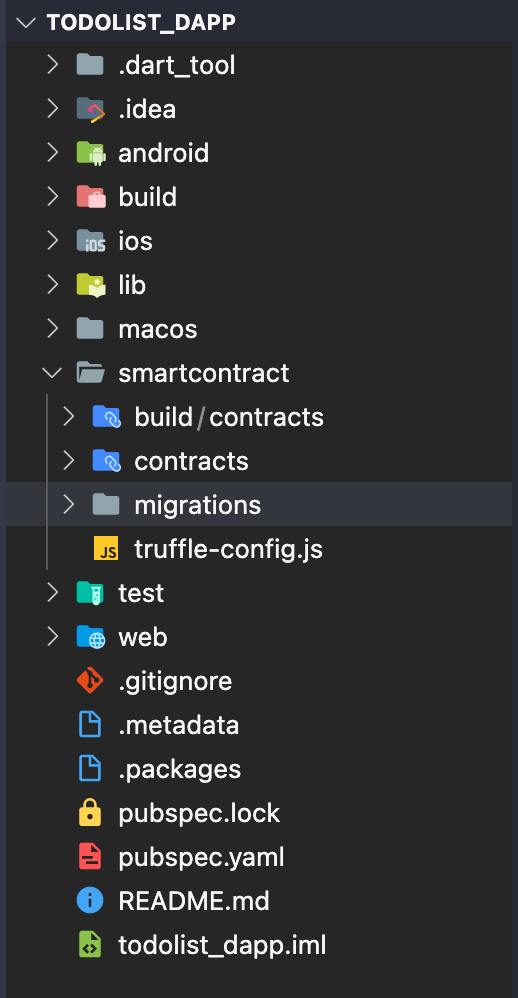
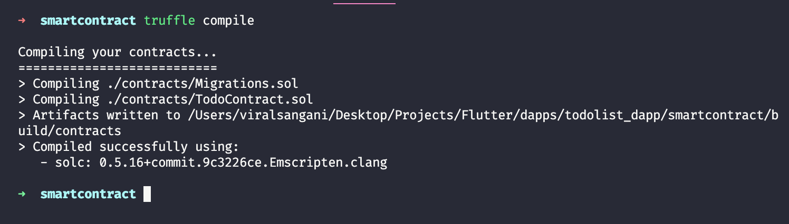
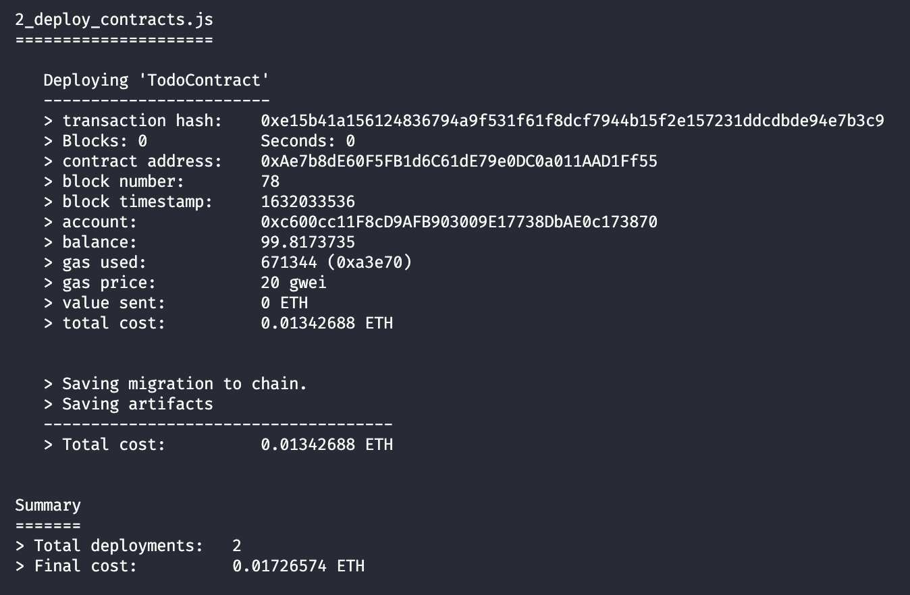

# Introduction

In this tutorial, we will learn how to perform CRUD (Create, Read, Update and Delete) operations in a Flutter Dapp on the Polygon network by creating a To-do app.

This is what the dApp we will be creating looks like:


# Prerequisites

To successfully follow along with this tutorial, you will need basic knowledge and understanding of Blockchain technology, the Solidity programming language for smart contracts, and the Flutter framework.

# Requirements

- [Truffle](https://github.com/trufflesuite/truffle) - Truffle provides a local development environment for creating and testing blockchain applications.
- [Flutter](https://flutter.dev/docs/get-started/install) - used to create an Android/iOS dApp.
- A code editor or IDE - VSCode is recommended for Flutter development.
- [Figment DataHub](https://figment.io/datahub/) account - We will be using DataHub's Polygon RPC URL to deploy the smart contract.

If you don't have a DataHub account, you can create a free account and get the API key for Polygon from the dashboard.

We will be using [web3dart](https://pub.dev/packages/web3dart) to interact with the blockchain in our Flutter application. web3dart is an alternative to the commonly used web3js for the Flutter ecosystem.

# Project Setup

Run the following commands to install the packages and create the project directories:

```text
flutter create todo_dapp
cd todo_dapp

mkdir smartcontract
cd smartcontract

npm install -g truffle

truffle init
```

The command `npm install -g truffle` will install Truffle globally so that you can use Truffle from any directory.

This is how the folder structure will be after initial setup:



The `truffle init` command creates the following directories:

- `contracts`: All the smart contracts are stored in this directory.
- `migrations`: All the scripts used by Truffle to deploy smart contracts are stored in this directory.
- `test`: All the test scripts for smart contracts are stored in this directory.
- `truffle-config.js`: Contains configuration settings for Truffle.

# Creating the smart contract

Create a new file called `TodoContract.sol` in the `contracts` directory and add the following code:

```javascript
// SPDX-License-Identifier: GPL-3.0
pragma solidity ^0.8.6;

contract TodoContract {
  uint256 public taskCount = 0;

  struct Task {
    uint256 index;
    string taskName;
    bool isComplete;
  }

  mapping(uint256 => Task) public todos;
  event TaskCreated(string task, uint256 taskNumber);
  event TaskUpdated(string task, uint256 taskId);
  event TaskIsCompleteToggled(string task, uint256 taskId, bool isComplete);
  event TaskDeleted(uint256 taskNumber);
}
```

- `taskCount` is an unsigned public integer that stores the total number of to-do items in the smart contract.
- `struct Task` is a data structure to store information (metadata) about each to-do. This includes the id of the to-do, taskName, and isComplete boolean value for the to-do.
- `mapping(uint256 => Task) public todos;` is a mapping that stores all the to-dos, where the key is the `id` and value is the `Task` struct.
- `TaskCreated`, `TaskUpdated`, `TaskIsCompleteToggled`, and `TaskDeleted` are the events emitted on the blockchain that our dApp can listen for and function accordingly.

```javascript
function createTask(string memory _taskName) public {
  todos[taskCount] = Task(taskCount, _taskName, false);
  taskCount++;
  emit TaskCreated(_taskName, taskCount - 1);
}
```

- The `createTask` function will accept the `_taskName` for the to-do. We can create a new `Task` struct with `taskCount` and `_taskName`, and assign it to the current `taskCount` value in the `todos` map.
- Increment `taskCount`'s value by one for the next to-do.
- Once everything is done, we have to emit the `TaskCreated` event.

```javascript
function updateTask(uint256 _taskId, string memory _taskName) public {
  Task memory currTask = todos[_taskId];
  todos[_taskId] = Task(_taskId, _taskName, currTask.isComplete);
  emit TaskUpdated(_taskName, _taskId);
}
```

- The `updateTask` function accepts a `_taskId` of a to-do to be updated along with an updated `taskName`. We can create a new `Task` struct with these values and assign it to the `todos` map corresponding to the `_taskId` received.
- Note that while updating, we have to retain the `isComplete` value of that to-do. First, fetch the current task from the map, then store it in a variable, then use its `isComplete` value for the new Task object.
- Once everything is done, we have to emit the `TaskUpdated` event.

```javascript
function deleteTask(uint256 _taskId) public {
  delete todos[_taskId];
  emit TaskDeleted(_taskId);
}
```

- `deleteTask` accepts `_task` of the to-do to be deleted as the parameter. First, remove the `Task` object from the `todos` map corresponding to the `_task` received, then emit the `TaskDeleted` event.

```javascript
function toggleComplete(uint256 _taskId) public {
  Task memory currTask = todos[_taskId];
  todos[_taskId] = Task(_taskId, currTask.taskName, !currTask.isComplete);

  emit TaskIsCompleteToggle(
    currTask.taskName,
    _taskId,
    !currTask.isComplete
  );
}
```

- `toggleComplete` function accepts `_taskId` of to-do to be updated. We first fetch the `Task` object from the `todos` map and then create a new `Task` object with those values, with `isComplete` set as the opposite of the current `isComplete` value.

That's all for the smart contract, and now we can move forward with the compilation and migration process.

# Compiling and deploying with Truffle

Now that we have our smart contract written, it's time to compile it. Open your terminal in the `smartcontract` directory and run the following command:

```text
truffle compile
```

Truffle will compile the smart contract, and you should see the output similar to:



For the migration of our contact to the blockchain, go to the `migrations` directory, create a new file called `2_todo_contract_migration.js` and add the following code:

```javascript
const TodoContract = artifacts.require('TodoContract');

module.exports = function (deployer) {
  deployer.deploy(TodoContract);
};
```

- Before starting with the migration process, make sure you have [Ganache](https://www.trufflesuite.com/ganache) installed. Start the Ganache GUI app in your system.
- Delete all the existing contents of `truffle-config.js` and replace it with the code below.

```javascript
module.exports = {
  networks: {
    development: {
      host: 'localhost',
      port: 7545,
      network_id: '*',
    },
  },
  contracts_directory: './contracts',
  compilers: {
    solc: {
      optimizer: {
        enabled: true,
        runs: 200,
      },
    },
  },

  db: {
    enabled: false,
  },
};
```

- In `truffle-config.js`, we are defining the basic configuration for Truffle. Currently, we will be deploying the smart contract to localhost:7545 where our Ganache blockchain is running.
- To deploy the smart contract on Ganache, run the command:

```text
truffle migrate
```

This will deploy the contract to the Ganache development blockchain and will give you output that looks similar to this:



# Connecting to a Flutter application with web3dart

The smart contract is created and deployed; we can start integrating it with our Flutter application.

Open the `pubspec.yaml` file and add the following dependencies:

```yaml
dependencies:
  # Needed for smart contract interaction
  http: ^0.13.3
  web3dart: ^2.1.4
  web_socket_channel: ^2.1.0
  provider: ^5.0.0
```

Add `TodoContract.json` file as an asset in `pubspec.yaml`, generated by the `truffle compile` command.

```yaml
assets:
  - smartcontract/build/contracts/TodoContract.json
```

To get started with UI and data controllers, we will have to create three files in the `lib` directory.

- `TodoListModel.dart` - Contains data model, contract functions and notifier class to update UI.
- `TodoList.dart` - Contains the main UI of our app.
- `TodoBottomSheet.dart` - Contains create and update todo form.

`lib/TodoListModel.dart`

```dart
import 'dart:convert';
import 'dart:core';
import 'package:flutter/material.dart';
import 'package:flutter/services.dart';
import 'package:http/http.dart';
import 'package:web3dart/web3dart.dart';
import 'package:web_socket_channel/io.dart';

class TodoListModel extends ChangeNotifier {
  List<Task> todos = [];
  bool isLoading = true;
  int taskCount;
  final String _rpcUrl = "http://127.0.0.1:7545";
  final String _wsUrl = "ws://127.0.0.1:7545/";

  final String _privateKey = "f9af969c5294cb200d7f97d9b178937c96d36b0697639f71285224...";

  Web3Client _client;
  String _abiCode;

  Credentials _credentials;
  EthereumAddress _contractAddress;
  EthereumAddress _ownAddress;
  DeployedContract _contract;

  ContractFunction _taskCount;
  ContractFunction _todos;
  ContractFunction _createTask;
  ContractFunction _updateTask;
  ContractFunction _deleteTask;
  ContractFunction _toggleComplete;
}
```

- On top, we are importing all the required packages.
- Creating a class `TodoListModel` extending from `ChangeNotifier` class from `Provider` package.
- Setting Ganache's `_rpcUrl` and `_wsUrl` for the local environment.
- Setting the private key of any account from Ganache (you can get this by clicking on the Key icon in the Ganache UI).


`Web3Client _client` is used to connect to the Polygon blockchain with WebSockets. `String _abiCode` is used to store the ABI of our smart contract. `Credentials _credentials` contains the `Credential` object of the logged-in user. `EthereumAddress _ownAddress` is used to store the public key of the logged-in user. `DeployedContract _contract` is an instance of our smart contract, which will be eventually used to communicate with the smart contract. `_taskCount`, `_todos`, `_createTask`, `_updateTask`, `_deleteTask` and `_toggleComplete` are the functions of our deployed smart contract.

After all the variable declarations, add the following functions in the `TodoListModel` class :

```dart
TodoListModel() {
  init();
}

Future<void> init() async {
  _client = Web3Client(_rpcUrl, Client(), socketConnector: () {
    return IOWebSocketChannel.connect(_wsUrl).cast<String>();
  });

  await getAbi();
  await getCredentials();
  await getDeployedContract();
}

Future<void> getAbi() async {
  String abiStringFile = await rootBundle
      .loadString("smartcontract/build/contracts/TodoContract.json");
  var jsonAbi = jsonDecode(abiStringFile);
  _abiCode = jsonEncode(jsonAbi["abi"]);
  _contractAddress =
      EthereumAddress.fromHex(jsonAbi["networks"]["5777"]["address"]);
}

Future<void> getCredentials() async {
  _credentials = await _client.credentialsFromPrivateKey(_privateKey);
  _ownAddress = await _credentials.extractAddress();
}

Future<void> getDeployedContract() async {
  _contract = DeployedContract(
      ContractAbi.fromJson(_abiCode, "TodoList"), _contractAddress);
  _taskCount = _contract.function("taskCount");
  _updateTask = _contract.function("updateTask");
  _createTask = _contract.function("createTask");
  _deleteTask = _contract.function("deleteTask");
  _toggleComplete = _contract.function("toggleComplete");
  _todos = _contract.function("todos");
  await getTodos();
}

```

In the constructor of the `TodoListModel` class, we are calling the asynchronous `init` function. `init` function contains the initialization of `_client` object followed by calling `getAbi`, `getCredentials` and `getDeployedContract` functions.

In the `getAbi` function, we are fetching the ABI of our smart contract and extracting the address of deployed contract. In the `getCredentials` function, we create an instance of the `Credentials` class by passing in our private key.

**Note** - It's recommended to store the private key in encrypted form in Flutter. For the simplicity of this tutorial, we are keeping the private key in a string format.

In the `getCredentials` function, we will create an instance of our smart contract using `_abiCode` and `_contractAddress`. Once we have a contract instance, we can create an instance of all the functions we have in the smart contract, as shown above in the code.

Now that we have initialized all our variables, it's time to implement CRUD operations. In the `TodoListModel` add following functions:

```dart
getTodos() async {
  List totalTaskList = await _client.call(contract: _contract, function: _taskCount, params: []);

  BigInt totalTask = totalTaskList[0];
  taskCount = totalTask.toInt();
  todos.clear();
  for (var i = 0; i < totalTask.toInt(); i++) {
    var temp = await _client.call(contract: _contract, function: _todos, params: [BigInt.from(i)]);
    if (temp[1] != "")
      todos.add(
        Task(
          id: (temp[0] as BigInt).toInt(),
          taskName: temp[1],
          isCompleted: temp[2],
        ),
      );
  }
  isLoading = false;
  todos = todos.reversed.toList();

  notifyListeners();
}

addTask(String taskNameData) async {
  isLoading = true;
  notifyListeners();
  await _client.sendTransaction(
    _credentials,
    Transaction.callContract(
      contract: _contract,
      function: _createTask,
      parameters: [taskNameData],
    ),
  );
  await getTodos();
}

updateTask(int id, String taskNameData) async {
  isLoading = true;
  notifyListeners();
  await _client.sendTransaction(
    _credentials,
    Transaction.callContract(
      contract: _contract,
      function: _updateTask,
      parameters: [BigInt.from(id), taskNameData],
    ),
  );
  await getTodos();
}

deleteTask(int id) async {
  isLoading = true;
  notifyListeners();
  await _client.sendTransaction(
    _credentials,
    Transaction.callContract(
      contract: _contract,
      function: _deleteTask,
      parameters: [BigInt.from(id)],
    ),
  );
  await getTodos();
}

toggleComplete(int id) async {
  isLoading = true;
  notifyListeners();
  await _client.sendTransaction(
    _credentials,
    Transaction.callContract(
      contract: _contract,
      function: _toggleComplete,
      parameters: [BigInt.from(id)],
    ),
  );
  await getTodos();
}
```

In `getTodos`, we call the `_taskCount` function which gives us the total number of to-dos, and then we use a loop to fetch all to-do items and add them to a list. Once we have all the to-dos, we can set `isLoading` to false and call `notifyListeners` from the `Provider` package to update our UI.

In `addTask`, we accept the task name as a parameter, set `isLoading` to true, and then call the `_createTask` function using `_contract` object and passing `taskNameData` as a parameter. `updateTask` accepts the `id` of the task and the updated `taskNameData` to make a transaction using our credentials to the smart contract. Notice that we are sending `id` as an instance of `BigInt` because the web3dart package requires all the numbers in `BigInt` format. The `deleteTask` function will accept the `id` of the task to be deleted and call the `_deleteTask` function of our contract to delete that particular task from the `todos` mapping in the smart contract.

The `toggleComplete` function will accept the `id` of a task, and it will toggle the value of the `isComplete` boolean value in our smart contract. At the end of the `addTask`, `updateTask`, `deleteTask`, and `toggleComplete` function we are calling `getTodos` to fetch the updated list of todos to update the UI. Alternatively, you can also update the local to-do list before calling the smart contract function to show the result instantaneously and update the list in the background.

Create a `Task` model class in `TodoListModel` to store the list of to-dos.

```dart
class Task {
  final int id;
  final String taskName;
  final bool isCompleted;
  Task({this.id, this.taskName, this.isCompleted});
}
```

Now that we are done with the logic part in Flutter let's move forward and create the UI for our app.

`lib/TodoList.dart`

```dart
class TodoList extends StatelessWidget {
  const TodoList({Key key}) : super(key: key);

  @override
  Widget build(BuildContext context) {
    var listModel = Provider.of<TodoListModel>(context, listen: true);
    return Scaffold(
      appBar: AppBar(
        title: Text("Dapp Todo"),
      ),
      floatingActionButton: FloatingActionButton(
        onPressed: () {
          showTodoBottomSheet(context);
        },
        child: Icon(Icons.add),
      ),
      body: listModel.isLoading
          ? Center(child: CircularProgressIndicator())
          : Column(
              children: [
                SizedBox(height: 16),
                Expanded(
                  child: ListView.builder(
                    itemCount: listModel.todos.length,
                    itemBuilder: (context, index) => ListTile(
                      title: InkWell(
                        onTap: () {
                          showTodoBottomSheet(
                            context,
                            task: listModel.todos[index],
                          );
                        },
                        child: Container(
                          margin: EdgeInsets.symmetric(
                            vertical: 2,
                            horizontal: 12,
                          ),
                          padding: EdgeInsets.all(4),
                          decoration: BoxDecoration(
                            color: Colors.grey[300],
                            borderRadius: BorderRadius.circular(20),
                          ),
                          child: Row(
                            children: [
                              Checkbox(
                                value: listModel.todos[index].isCompleted,
                                onChanged: (val) {
                                  listModel.toggleComplete(
                                      listModel.todos[index].id);
                                },
                              ),
                              Text(listModel.todos[index].taskName),
                            ],
                          ),
                        ),
                      ),
                    ),
                  ),
                ),
              ],
            ),
    );
  }
}
```

Here we are creating a stateless widget, `TodoList`. In the build function, we are listening to `TodoListModel` and rendering the UI accordingly. If the `isLoading` form `TodoListModel` is true, we are rendering the Loading widget; else, we are creating a `ListView` and looping over the length of `todos` in `TodoListModel`. In the `ListView`, we return a checkbox to toggle the `isComplete` value of the to-do and a container with the task name. We are also creating a floating action button to add a new task to the to-do list.

- This is how our list of to-dos should look:


`TodoBottomSheet.dart`

```dart
showTodoBottomSheet(BuildContext context, {Task task}) {
  TextEditingController _titleController =
      TextEditingController(text: task?.taskName ?? "");
  var listModel = Provider.of<TodoListModel>(context, listen: false);
  return showModalBottomSheet<void>(
    shape: RoundedRectangleBorder(borderRadius: BorderRadius.circular(20)),
    context: context,
    builder: (BuildContext context) {
      return Container(
        padding: EdgeInsets.only(top: 10),
        margin: EdgeInsets.all(10),
        height: 300,
        child: SingleChildScrollView(
          child: Column(
            children: [
              Container(
                height: 6,
                width: 80,
                decoration: BoxDecoration(
                  color: Colors.grey,
                  borderRadius: BorderRadius.circular(20),
                ),
              ),
              SizedBox(height: 18),
              TextField(
                controller: _titleController,
                decoration: const InputDecoration(
                  border: OutlineInputBorder(
                    borderRadius: BorderRadius.all(Radius.circular(20)),
                  ),
                  contentPadding: const EdgeInsets.only(
                    left: 14.0,
                    bottom: 20.0,
                    top: 20.0,
                  ),
                  hintText: 'Enter a search term',
                  hintStyle: TextStyle(
                    fontSize: 20,
                  ),
                ),
                style: TextStyle(
                  fontSize: 20,
                ),
              ),
              SizedBox(height: 12),
              if (task == null)
                buildButton("Created", () {
                  listModel.addTask(_titleController.text);
                  Navigator.pop(context);
                }),
              if (task != null)
                buildButton("Updated", () {
                  listModel.updateTask(task.id, _titleController.text);
                  Navigator.pop(context);
                }),
              if (task != null)
                buildButton("Delete", () {
                  listModel.deleteTask(task.id);
                  Navigator.pop(context);
                }),
            ],
          ),
        ),
      );
    },
  );
}

TextButton buildButton(String text, Function onPressed) {
  return TextButton(
    onPressed: onPressed,
    child: Container(
      child: Center(
        child: Text(
          text,
          style: TextStyle(
            color: Colors.white,
            fontSize: 20,
          ),
        ),
      ),
      height: 50,
      padding: EdgeInsets.symmetric(vertical: 10),
      width: double.infinity,
      decoration: BoxDecoration(
        color: text == "Delete" ? Colors.red : Colors.blue,
        borderRadius: BorderRadius.circular(15),
      ),
    ),
  );
}
```

We are creating two functions, `showTodoBottomSheet` and `buildButton`. `showTodoBottomSheet` shows a bottom sheet where users can create, update and delete a task, and `buildButton` is a typical widget that returns a specifically designed button.

In `showTodoBottomSheet`, we are accepting an optional parameter `task`, and based on the value of `task`, we are rendering the bottom sheet UI. If the value of `task` is null, we are rending UI to create a new Todo task, and if the `task` is not null, we will render the update and delete UI. When the user taps on the floating action button, then we will call `showTodoBottomSheet` with `task` value as null, and when the user taps on and task item from `ListView`, we are calling `showTodoBottomSheet` with task value being the task object user tapped on.

When `Create`, `Update`, and `Delete` buttons are pressed, we call the respective smart contract function from our `TodoListModel` class.

This is how the bottom sheet should look:


The last remaining part is calling the `TodoList` widget from `main.dart` to render our app.

`lib/main.dart`

```dart
void main() {
  runApp(MyApp());
}

class MyApp extends StatelessWidget {
  @override
  Widget build(BuildContext context) {
    return ChangeNotifierProvider(
      create: (context) => TodoListModel(),
      child: MaterialApp(
        title: 'Flutter TODO',
        home: TodoList(),
      ),
    );
  }
}
```

# Publishing the smart contract to Mumbai testnet

We can publish our smart contract to Polygon Mumbai testnet by adding provider details of testnet in `truffle-config.js`.

- Connect your Metamask to Matic Mumbai testnet and get the Secret Recovery Phrase from the Metamask.
- Create a `.secret` file in the `smartcontract` directory and paste your Secret Recovery Phrase in that file. Make sure you have added the `.secret` file in your `.gitignore`.
- **NOTE** - Deploying a smart contract requires paying gas fees, but since we are deploying to testnet, you can get 0.1 Matic token from \[Matic Faucet]\(Matic Faucet) in your account.

Run the following command to install `hdwallet-provider` to pay gas fees via your account.

```text
npm install @truffle/hdwallet-provider
```

Once you have everything set up correctly, delete the content of `truffle-config.js` and add the following code.

```javascript
const HDWalletProvider = require('@truffle/hdwallet-provider');
const fs = require('fs');
const mnemonic = fs.readFileSync('.secret').toString().trim();

var DATAHUB_API_KEY = 'YOU-DATAHUB-API-KEY-FOR-POLYGON';

module.exports = {
  networks: {
    development: {
      host: 'localhost',
      port: 7545,
      network_id: '*',
    },
    matic: {
      provider: () =>
        new HDWalletProvider({
          mnemonic: {
            phrase: mnemonic,
          },
          providerOrUrl: `https://matic-mumbai--rpc.datahub.figment.io/apikey/${DATAHUB_API_KEY}/`,
          chainId: 80001,
        }),
      network_id: 80001,
      confirmations: 2,
      timeoutBlocks: 200,
      skipDryRun: true,
      chainId: 80001,
    },
  },
  contracts_directory: './contracts',
  compilers: {
    solc: {
      optimizer: {
        enabled: true,
        runs: 200,
      },
    },
  },
  db: {
    enabled: false,
  },
};
```

After modifying `truffle-config.js`, run the following command to deploy your smart contract on Polygon testnet.

```text
truffle migrate --network matic
```

Truffle will deploy the contract to Mumbai using your account from Metamask.

You can find the complete source code of this project [on Github](https://github.com/viral-sangani/flutter-todo-dapp).

# Conclusion

Congratulations on finishing the tutorial! Thank you for taking the time to complete it. In this tutorial, you have learned how to create a Flutter dApp from scratch using `web3dart`. Since Flutter is a multi-platform framework and the web3dart package supports all the platforms - Android, iOS, Linux, macOS, Web, and Windows you can use the same codebase to build multi-platform dApps very quickly.

# About the Author

I'm Viral Sangani, a tech enthusiast working on blockchain projects & love the Web3 community. Feel free to connect with me on [Github](https://github.com/viral-sangani).
