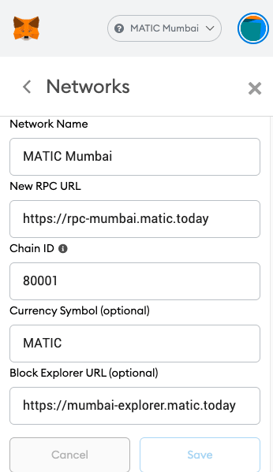

## Introduction

In this tutorial, you will learn how to deploy smart contracts to the Polygon (Matic) Mumbai test network.
We'll also cover some of the possible errors which might occur during the deployment, and how to fix them.
So, grab a cup of coffee ☕️ and follow along!

## Prerequisites

This tutorial assumes that you have some beginner-level experience in programming & blockchain understanding.

## Requirements

- [Truffle](https://www.trufflesuite.com/)
- [MetaMask](https://metamask.io)

## Getting started

To be able to interact with the Mumbai testnet via MetaMask, you first have to add an RPC endpoint to your MetaMask wallet. This will allow you to view your MATIC balance, also to send and receive MATIC tokens. Open the extension in your browser by clicking on the Fox icon, then click on the Identicon at the top right of the extension window, then click through `Settings -> Networks -> Add network`. When you have entered the information as shown in the image below, click on **Save** to complete the process.



To get Mumbai MATIC tokens so that you can pay the gas fees for smart contract deployment and testing, go to the Matic Faucet at <https://faucet.matic.network>. Select the Mumbai network, paste your account address into the textinput and click on **Submit**.

When you are done, open MetaMask and check your wallet - you'll see the MATIC tokens there. Keep in mind that MATIC tokens on the Mumbai testnet have no value, and cannot be exchanged with Mainnet MATIC.


## truffle-config

The truffle-config file is an important file to understand. In this file, we must configure the paths to the Solidity files (`contracts_directory`) and the contract Application Binary Interface (`contracts_build_directory`). We also need to define the available **networks**.

```javascript
const HDWalletProvider = require('@truffle/hdwallet-provider');
require('dotenv').config(); // Load .env file

module.exports = {
  networks: {
    // For Ganache, your personal blockchain
    development: {
      host: '127.0.0.1', // Localhost (default: none)
      port: 8545, // Standard Ethereum port
      network_id: '*', // Any network (default: none)
    },
  },
  contracts_directory: './src/contracts/', // Path to smart contracts
  contracts_build_directory: './src/abis/', // Path to ABIs
  compilers: {
    solc: {
      optimizer: {
        enabled: true,
        runs: 200,
      },
    },
  },
};
```

Ensure you create an `.env` file in your project root directory and paste into it the 12 word Secret Recovery Phrase of your (_preferably newly generated and testnet-only_) MetaMask wallet with the variable name `MNEMONIC`. This will be loaded by truffle at runtime, and the environment variable can then be accessed with `process.env.MNEMONIC`.

```text
MNEMONIC=for example put your twelve word BIP39 secret recovery phrase here
```

Now, let's add the `matic` network in the `truffle-config.js` file which will contain our environment variable MNEMONIC and the RPC endpoint URL we want to use.
The network ID for Mumbai is `80001`. Here you can also set the gas limit and gas price for faster transactions.

```javascript
    matic: {
      provider: () => new HDWalletProvider(process.env.MNEMONIC,
      `https://rpc-mumbai.matic.today`),
      network_id: 80001,
      confirmations: 2,
      timeoutBlocks: 200,
      skipDryRun: true,
      gas: 6000000,
      gasPrice: 10000000000,
    },
```

## Deploy smart contracts with Truffle

- Command: `truffle migrate --network matic`

If you're deploying a contract multiple times, then deploy with the `--reset` flag to avoid JSON errors.

- Command: `truffle migrate --network matic --reset`

If everything worked fine, you'll see something like this:

```text
2_deploy_contracts.js
=====================

   Replacing 'MyContract'
   ------------------
   > transaction hash:    0x1c94d095a2f629521344885910e6a01076188fa815a310765679b05abc09a250
   > Blocks: 5            Seconds: 5
   > contract address:    0xbFa33D565Fcb81a9CE8e7a35B61b12B04220A8EB
   > block number:        2371252
   > block timestamp:     1578238698
   > account:             0x9fB29AAc15b9A4B7F17c3385939b007540f4d791
   > balance:             79.409358061899298312
   > gas used:            1896986
   > gas price:           0 gwei
   > value sent:          0 ETH
   > total cost:          0 ETH

   Pausing for 2 confirmations...
   ------------------------------
   > confirmation number: 5 (block: 2371262) initialized!

   > Saving migration to chain.
   > Saving artifacts
   -------------------------------------
   > Total cost:                   0 ETH


Summary
=======
> Total deployments:   2
> Final cost:          0 ETH
```

## Deployment errors and solutions

If you encounter any of these errors, follow the instructions to solve them:

**Error:**

```text
Error: PollingBlockTracker - encountered an error while attempting to update latest block:
```

**Solution:**

Change the RPC endpoint URL in `truffle-config` from 'https://rpc-mumbai.matic.today' to a [DataHub RPC endpoint](https://datahub.figment.io/services/Polygon). This will require you to register for an DataHub account and get a Polygon API key. If you already have a DataHub account, add your API key to the `.env` file as something descriptive such as `DATAHUB_POLYGON_API_KEY`.

```javascript
    matic: {
      provider: () => new HDWalletProvider(process.env.MNEMONIC,
      `https://matic-mumbai--jsonrpc.datahub.figment.io/apikey/${process.env.DATAHUB_POLYGON_API_KEY}`),
      network_id: 80001,
      confirmations: 2,
      timeoutBlocks: 200,
      skipDryRun: true,
    },
```

**Error:**

```text
*** Deployment Failed ***

"Migrations" -- only replay-protected (EIP-155) transactions allowed over RPC.
```

**Solution:**

Truffle's `hdwallet-provider` version 1.4.0 will fix this error.

You will need to run `npm install @truffle/hdwallet-provider@1.4.0` (or `yarn add @truffle/hdwallet-provider@1.4.0` if your project is using `yarn` instead of `npm`)

**Error:**

```text
Error:  *** Deployment Failed ***

"Migrations" -- Transaction was not mined within 750 seconds, please make sure your transaction was properly sent. Be aware that it might still be mined!
```

**Solution:**

Just add `networkCheckTimeout: 100000`:

```javascript
    matic: {
      provider: () => new HDWalletProvider(process.env.MNEMONIC,
      `https://matic-mumbai--jsonrpc.datahub.figment.io/apikey/${process.env.DATAHUB_POLYGON_API_KEY}`),
      network_id: 80001,
      confirmations: 2,
      timeoutBlocks: 200,
      skipDryRun: true,
      networkCheckTimeout: 100000,
    },
```

_If you discover any new errors and If you know the solution for it, then feel free to make a PR, we'll add your Error-Fix here._

## Conclusion

After this tutorial you will be able to:

- Deploy smart contracts on Polygon (Matic) Mumbai testnet using Truffle.
- Solve any errors that occur while deploying the smart contracts.

## About the author

Akhilesh Thite is an Indian tech enthusiast with a passion for Software Development, Open-Source & Decentralization. You can connect with him on [GitHub](https://github.com/AkhileshThite).

## References

- Truffle docs: https://www.trufflesuite.com/docs/truffle/overview
- Polygon (Matic) docs: https://docs.matic.network/docs/develop/getting-started
