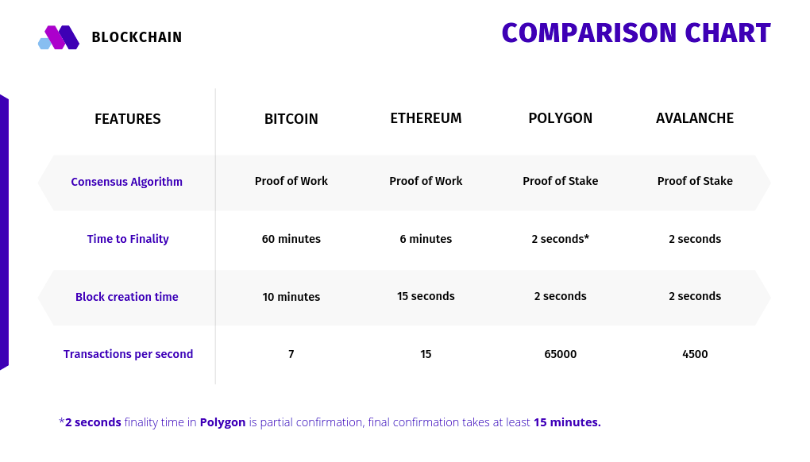
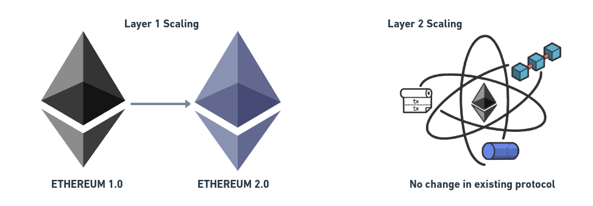
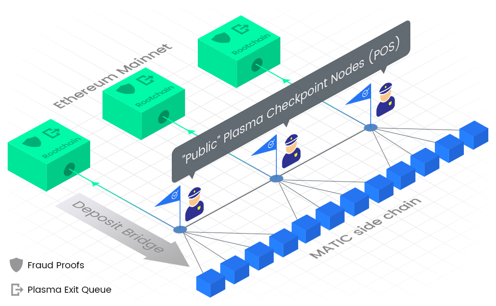
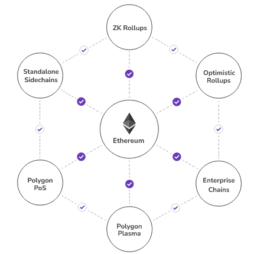

# Introduction

Before we jump into a discussion of explaining blockchain and Polygon stuff, let's get ourselves a pizza first. Before the pizza is delivered to your doorstep, I bet, you will learn all about the topic.

To understand **Polygon (Matic)** and the problem it solves, let’s first have a quick overview on blockchain by ordering our favorite pizza, and learn what are **transactions, validators, block, consensus, proof of work, proof of stake**, etc.

## Visiting bizza.com - STATE and TRANSACTION

Let's visit a blockchain-based pizza site (**bizza**) and select a few pizzas of our choice. There are lots of pizzas to choose from. Currently, you have 0 pizzas in your cart. This is your **initial state**.

This online state is maintained on the blockchain by the community's computer (called nodes) and they will charge extra **fees** for maintaining states.

Once you select pizza in your cart, you need to submit a **transaction** to confirm your **final state** (type and number of pizzas). Apart from the pizza cost, this transaction is also accompanied by your signature to prove that this transaction is initiated by you and small service fees for processing your order.

**By submitting a transaction, you are trying to change the state.**

## Processing your order - VALIDATOR or NODE

You are not the only one to order a pizza. People from all over your neighborhood might be ordering their own pizzas, so there will be lots of transactions.

But who will ensure that these transactions are valid i.e. customers have ordered a valid pizza, their address is genuine and they have enough money to buy the pizza? These tasks are done by **validators** or **nodes**. They do it for an extra service fee that you have included in your transaction. These are often referred to as **rewards**.

## Order accepted - CONSENSUS and PoW vs POS

Everyone wants to be a winner and earn the rewards. So the validators compete with each other to validate a transaction and change the state of the blockchain.

Among so many validators, how can all of them conclude that a particular validator has performed the task and should be rewarded? This is a good question! It is achieved through consensus, a process by which the validators all agree on who is right. There are various consensus models and a lot of research is still going on to improve the efficiency of the consensus mechanisms used by blockchains.

Fighting for each transaction will take a lot of time. So instead, they compete for a **block of transactions**. Whoever wins the competition will take the transaction fees in that block along with a reward and their block will be added to the chain of previously validated blocks.

There are many consensus mechanisms to decide the winner. Two of the most famous ones are **Proof of Work** and **Proof of Stake**.

Competing blocks from different validators may have overlapping transactions. If a validator promotes a transaction but is unsuccessful, they will have to remove the already included transaction from their own block.

Each block also contains a content identifier of the previous block, known as a hash. Thus a transaction cannot alter the content of previous blocks, because this would change their hash, which would also need to change the hash in every prior block - but this cannot occur because the validators maintain the original hashes to be the truth, shared across the network. This concept is what makes blockchains immutable, inasmuch as once a transaction is confirmed it becomes part of the permanent history of the blockchain.

# Proof of Work vs Proof of Stake

In the **Proof of Work** mechanism, nodes solve a cryptographic puzzle when seeking to promote a block of transactions. Whoever solves the puzzle first will get to add their validated block to the chain and will be rewarded with the current block reward.

In the **Proof of Stake** mechanism, validators need to stake some assets (cryptocurrency tokens on the blockchain). The amount staked and duration of stake increases the probability of the validator being chosen to add their block. Some PoS protocols provide a strong reason for validators to act in good faith and not include bad or fraudulent transactions because doing so would cause them to forfeit their stake - this is commonly known as being "slashed". There can be other factors which govern the selection of validators apart from the amount and duration of their stake, depending on how the consensus model is set up for a given protocol.

> **PoS** is much faster than **PoW** and can handle more transactions per second. **PoW** uses brute force to solve a cryptographic puzzle whose complexity increases with the number of blocks added to the chain.

## Why my pizza is delayed - SCALABILITY ISSUES?

Is it because of the traffic on the road or did the pizza oven just break? No no, everything is working fine. Your order got delayed due to two main reasons:

- High **time to finality** of your transaction - On the Ethereum network, it takes around 1 - 6 minutes for a transaction to be considered final. This is a combination of how long each block takes to be confirmed and also providing for multiple block confirmations to increase confidence that the transaction cannot be reverted for any reason. On **Polygon** network we get a blazingly fast finality of about 2 seconds.

- A lower number of potential transactions per second (tps). Our pizza site uses the Ethereum network, which currently uses a Proof of Work consensus mechanism. As it is, Ethereum cannot scale to more than 15-20 tps. So if thousands of people are using the Ethereum network they have to wait for longer, until their transaction is picked up by a node. Whereas **Polygon** can achieve around 65000 tps.

These are called **scalability issues** of the **Ethereum** network.

## Who can process my pizza order quickly?

**Ethereum** is one of the most popular and secure blockchain networks, which is capable of running multi-purpose arbitrary transactions, which is defined by **smart contracts** (business logic). **But Ethereum is not scalable.**

Broadly speaking, there are two ways to scale a blockchain: **Layer 1 scaling** and **Layer 2 scaling**. In layer 1 scaling, changes or improvements are made by upgrading the main blockchain protocol. With Layer 2 scaling, we try to bypass scalability obstacles without altering the main protocol. Polygon is an example of a Layer 2 scaling solution because it incorporates several different technologies to achieve a higher number of transactions per second, all of which are implemented separately from the main Ethereum or Matic networks.

Consider the main blockchain as a congested road, where only 20 vehicles at a time can be moving. Obviously, this would lead to long traffic jams, whenever more vehicles approach and try to use the road at the same time.

There are two obvious solutions to overcome this issue. Either we can broaden the road so that more vehicles can pass at a time (layer 1 solution), or we can make another broad highway bypassing the road so that this would divert some traffic to the highway (layer 2 solution).

**Polygon Matic** focuses on layer 2 scaling. Some of the layer 2 scaling mechanisms -

- [State channels](https://education.district0x.io/general-topics/understanding-ethereum/basics-state-channels/)
- [Plasma chains](https://education.district0x.io/general-topics/understanding-ethereum/understanding-plasma/)
- [ZK (zero-knowledge) Rollups](https://finematics.com/rollups-explained/)
- [Optimistic rollups](https://finematics.com/rollups-explained/)

# What is MATIC?

In 2017, **Matic** was created as a layer 2 scaling solution for the Ethereum network. Instead of building a new blockchain from scratch for faster transactions and low fees, Matic exists to scale the Ethereum network itself. New projects can easily connect to the Matic network, and still enjoy the security and decentralization of Ethereum.

Matic's initial focus was on the **Plasma chain** framework. These are small branch chains of the main chain, which help to avoid congestion on the main network.

In plasma chains, the consensus is achieved through **Proof-of-Stake**. **Validators** stake their MATIC tokens on individual plasma chains and validate the transaction off-chain. This increases transaction throughput and reduces fees. It regularly updates the Ethereum network with the regular snapshots of transactions happening on the Matic network for enjoying the security and decentralization of Ethereum.

## Diving into MATIC

Plasma chains can be used for specific applications like payments and asset swaps. Polygon uses a hybrid of Plasma and PoS for running arbitrary applications on the blockchain in a scalable way.

It has a 3 layer architecture -

- Staking and smart contract layer on Ethereum (base chain)
- PoS validator layer (contains nodes who staked on smart contract layer)
- Block producer layer (contains few nodes selected by PoS layer)

In Polygon, the Block producer layer is EVM (Ethereum Virtual Machine) compatible, which means it is capable of running smart contracts written in the Solidity programming language.

**Block Producer Layer**
General-purpose applications or smart contracts are deployed in this layer. All transactions happen in this layer and are put into the newly created blocks. Polygon is capable of a 1 second block creation time. Blocks are created by a few nodes selected by the PoS layer.

**PoS Validator layer**
This layer is responsible for submitting regular transaction reports on the main chain. This is necessary to utilize the security and decentralization offered by the Ethereum chain. This layer aggregates the blocks at regular intervals into a Merkle root. This Merkle root contains the transaction reports of all the blocks in that interval. This Merkle root is then verified by all the nodes in this layer. Once verified, a node selected in this layer publishes the Merkle root to the smart contract layer on the main chain. This is known as **checkpointing**. With this checkpoint mechanism, all transactions on the Polygon chain benefit from Ethereum's security.

**Staking and Smart contract layer**
The smart contract on the main chain is responsible for maintaining checkpoints published by the PoS layer. It also involves staking from the various node to participate as a PoS layer validator. Users can stake their ETH to the smart contract and can participate in PoS layer validation.

## Rebranding Matic into Polygon

In February 2021, Matic revamped to **Polygon**, representing the integration of multiple layer 2 scaling solutions. Instead of only plasma chains as a solution, it will now offer -

- [State channels](https://education.district0x.io/general-topics/understanding-ethereum/basics-state-channels/)
- [Plasma chains](https://education.district0x.io/general-topics/understanding-ethereum/understanding-plasma/)
- [ZK (zero-knowledge) Rollups](https://finematics.com/rollups-explained/)
- [Optimistic rollups](https://finematics.com/rollups-explained/)

Polygon is often called **Ethereum's Internet of Blockchains**. This is because Polygon aims to connect and scale all the Ethereum compatible blockchain networks, just like the internet connects people. It strives to make an ecosystem of Ethereum-compatible and scalable blockchains, so that every network can enjoy scalability, security, and decentralization at the same time.

> A blockchain is considered Ethereum compatible if it can run smart contracts written for Ethereum, commonly known as EVM compatibility.

## Plans of Polygon

One of the plans is obviously to connect every Ethereum compatible blockchain to a scalable ecosystem. And other plans are to integrate other scalability solutions like ZK-Rollups, Optimistic Rollups on the platform.

Polygon is integrating one of the most interesting scaling solutions, through **Rollups**.

Consider our pizza store for example. Our order got delayed might be due to slow processing of transactions. We could upgrade their algorithm to more efficient one, but the store manager is not willing to do so. We could now only opt to layer 2 solution.

To increase the speed of pizza orders, we could make another store that will only handle orders or transactions. The new store will use efficient algorithms to handle transaction. At regular intervals we batch these transactions and publish them as a single order to the main pizza store. This forms the basis of **rollups**.

**The whole process essentially executes transactions, takes the data, compresses it and rolls it up to the main chain in a single batch, hence the name – a rollup.** ~Finematics

Since, these rolled up transactions are not executed on the main chain, there should be some fraud proofs to prevent any kind of invalid submissions. There could be multiple algorithms to prove this. Two of the most famous ones are - **Optimistic** and **Zero Knowledge (ZK) Rollups**.

In **Optimistic** rollups, transactions is considered to be valid (that's why this algorithm is called optimistic), but there is a challenge period for each batch. During this period, any network participant can submit a fraud proof against any fraudulent transaction. These suspicious transactions are executed again on the main chain. Both the parties which batched and submitted the transactions as well as those which raised a dispute, needs to lock a bond (cryptocurrency tokens) on the main chain. Their partial or even complete bonds could be slashed, if it had done a fraud transaction or raised a incorrect fraud proofs.

In **Zero Knowledege (ZK)** rollups, each transaction is associated with a sufficent proof to prove its validity. These are called zero-knowledge proofs, because we do not have any knowledge about the validity of transactions, but can easily verify through these proofs. A smart contract on the main chain uses this zero-knowledge proofs to identify valid and invalid batch of transactions.

Optimistic approach is easier to implement, but funds are locked for a long time during dispute resolution. ZK rollups are fast, but are quite complex to implement EVM compatible ZK rollup for general purpose smart contracts.

There is a lot on Rollups, you can always learn more. I would suggest you to go through the [Finematics](https://finematics.com/rollups-explained/) explanation on Rollups.

# Conclusion

This article explained some of Polygon's technology and the difference between Proof of Work and Proof of Stake. Since Polygon seeks to solve the problems faced by contemporary blockchains, it is important to understand those problems first. This would also be useful to investors who want to invest in blockchain technologies but do not understand the highly technical whitepapers, which can often require extensive research.

There is some good news :) Our blockchain-based pizza store has read this amazing explanation on Polygon and decided to scale their system. Their delivery boy must be waiting outside with your favorite pizza.

# About the author

This tutorial was created by [Raj Ranjan](https://www.linkedin.com/in/iamrajranjan), You can get in touch with the author on [GitHub](https://github.com/rajranjan0608)

# References

[Ethereum Layer 2 Scaling Explained](https://finematics.com/ethereum-layer-2-scaling-explained/) by Finematics
[Polygon's POS and Plasma](https://docs.polygon.technology/docs/develop/ethereum-matic/getting-started) by Polygon
[Rollups – The Ultimate Ethereum Scaling Solution](https://finematics.com/rollups-explained/) by Finematics
[Understanding State channels](https://education.district0x.io/general-topics/understanding-ethereum/basics-state-channels/) by District0x
[Understanding Plasma chains](https://education.district0x.io/general-topics/understanding-ethereum/understanding-plasma/) by District0x
