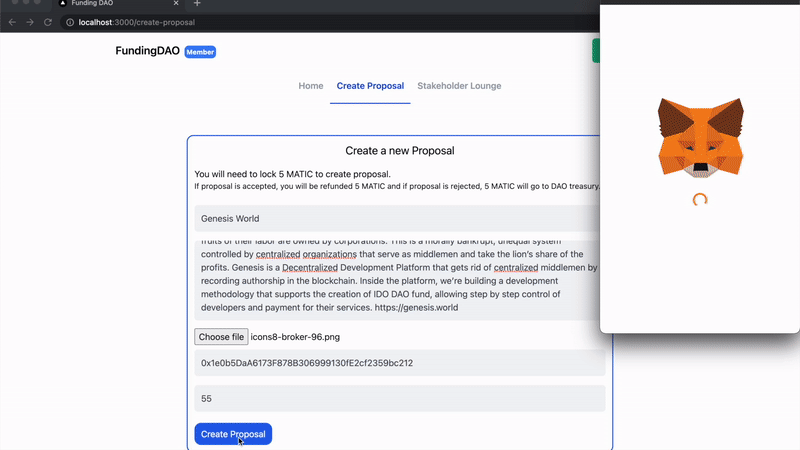
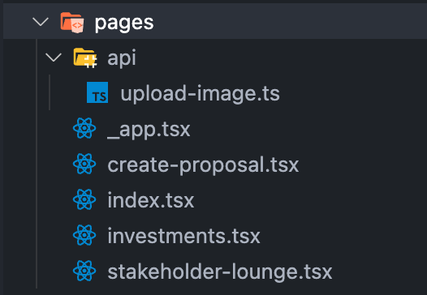
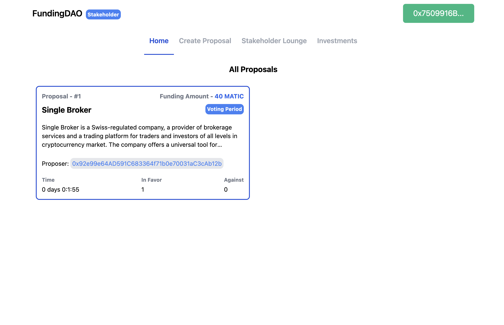
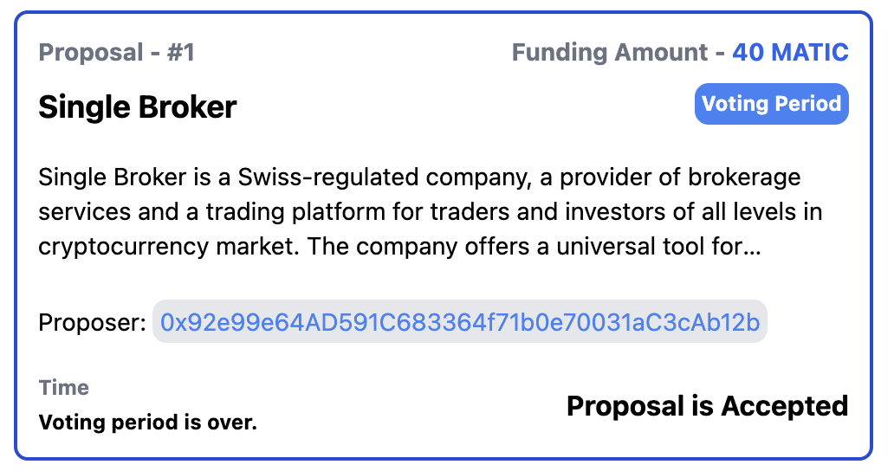
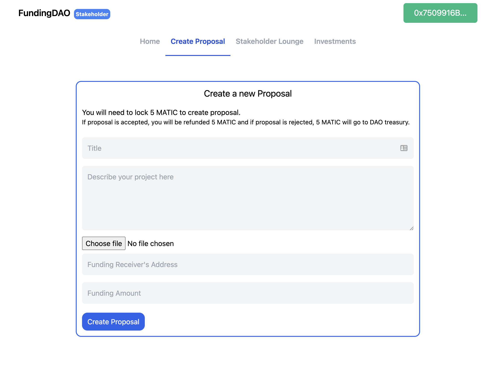
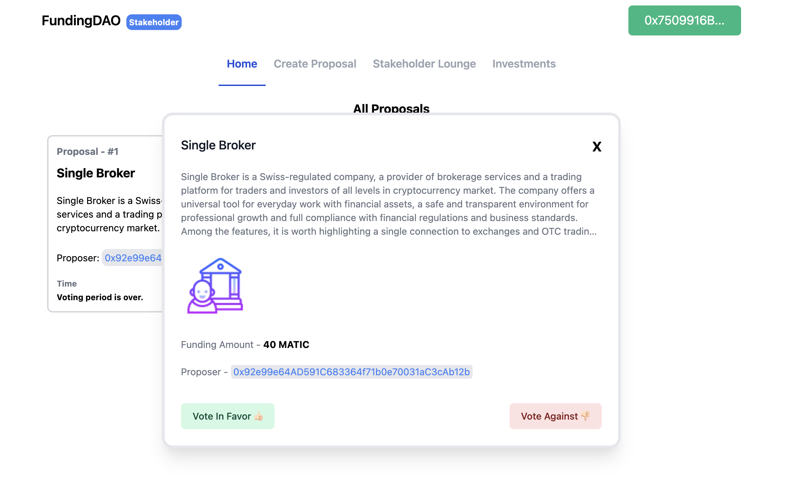
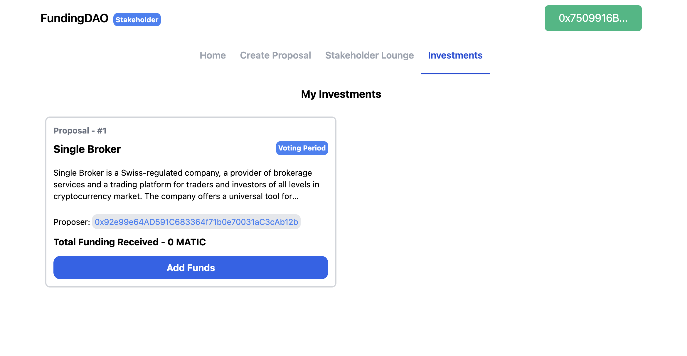
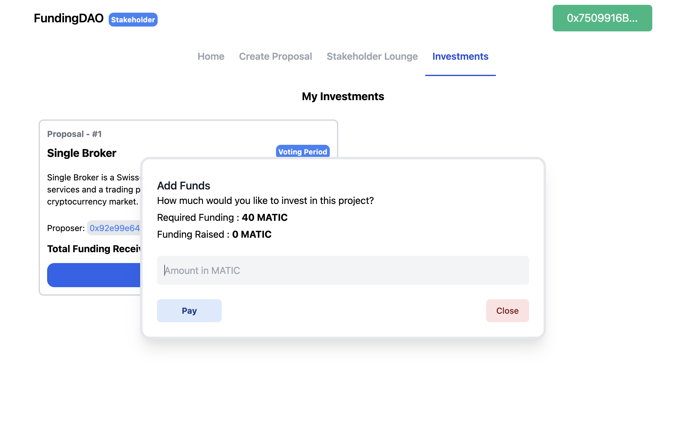

## Introduction

In this tutorial, we will learn how to create a Decentralized Autonomous Organization, or "DAO" with a Solidity smart contract deployed on Polygon and a NextJS front-end to interact with the DAO.

We will be creating a Venture/Grant DAO, where people can use MATIC tokens to become either a Member or Stakeholder in the DAO. Members can apply for funding for their project and Stakeholders can vote on the projects to fund from the DAO treasury.

This DAO will have the following features:

- Users can provide up to 5 MATIC tokens to become a Member of the DAO and can provide more than 5 tokens to become a Stakeholder in the DAO.
- A Member can create new proposals and request funding. Every new proposal requires the Member to add 3 MATIC tokens to the DAO treasury.
- If the proposal is accepted after the voting period the initial 3 MATIC tokens are refunded, otherwise the tokens are reserved in the DAO treasury.
- When a Member creates a new proposal Stakeholders have 3 days to vote on the proposal, either in favor or against it.
- At the end of the voting period, if the proposal is selected, Stakeholders have an option to provide the requested funds to the Member who made the proposal.

This is what the DAO we will be creating looks like:



## Prerequisites

To successfully follow along with this tutorial, you will need a good understanding of the Solidity language, the Truffle framework, and the Next.js framework. Having a basic understanding of what a DAO is and how it functions is also beneficial.

We will be using the [web3.js](https://web3js.readthedocs.io/en/v1.5.2/) JavaScript library to interact with the smart contract and Next.js for backend logic.

## Requirements

- [Truffle](https://github.com/trufflesuite/truffle) - Truffle provides a local development environment for creating and testing blockchain applications.
- [Metamask](https://metamask.io/) - You will need a Metamask wallet installed in your browser.
- [NodeJs](https://nodejs.org/en/) - You must have Node.js installed. We recommend using v16.13.0 LTS.
- [Arweave](https://www.arweave.org/) - We will store images related to a proposal on Arweave.
- [Next.js](https://nextjs.org/) - A web framework to create a user interface.
- [TailwindCSS](https://tailwindcss.com/) - A CSS utility framework.

## Project Setup

Run the following commands in a terminal to create the project directories and install the required packages:

```text
npm install -g truffle
npx create-next-app --typescript funding-dao
cd funding-dao
truffle init
yarn add @openzeppelin/contracts web3 tailwindcss postcss autoprefixer  @tailwindcss/line-clamp react-toastify react-timer-hook @headlessui/react @types/formidable formidable arweave
npx tailwindcss init -p
```

`npm install -g truffle` will install the Truffle utilities, `npx create-next-app --typescript funding-dao` will create a Next.js app with typescript support, `truffle init` will scaffold a smart contract, yarn add will install all the required dependencies for the dApp and `npx tailwindcss init -p` will set up tailwindcss for the project.

## Creating FundingDao smart contract

```solidity
// SPDX-License-Identifier: MIT
// /contracts/FundingDao.sol
pragma solidity ^0.8.0;

import "@openzeppelin/contracts/access/AccessControl.sol";
import "@openzeppelin/contracts/security/ReentrancyGuard.sol";

contract FundingDAO is ReentrancyGuard, AccessControl {
    bytes32 public constant MEMBER = keccak256("MEMBER");
    bytes32 public constant STAKEHOLDER = keccak256("STAKEHOLDER");

    uint32 constant votingPeriod = 3 days;

    uint256 public proposalsCount = 0;

    struct Proposal {
        uint256 id;
        uint256 amount;
        uint256 livePeriod;
        uint256 voteInFavor;
        uint256 voteAgainst;
        string title;
        string desc;
        bool isCompleted;
        bool paid;
        bool isPaid;
        address payable receiverAddress;
        address proposer;
        uint256 totalFundRaised;
        Funding[] funders;
        string imageId;
    }

    struct Funding {
        address payer;
        uint256 amount;
        uint256 timestamp;
    }

    mapping(uint256 => Proposal) private proposals;
    mapping(address => uint256) private stakeholders;
    mapping(address => uint256) private members;
    mapping(address => uint256[]) private votes;

    event NewMember(address indexed fromAddress, uint256 amount);
    event NewProposal(address indexed proposer, uint256 amount);
    event Payment(
        address indexed stakeholder,
        address indexed projectAddress,
        uint256 amount
    );

    modifier onlyMember(string memory message) {
        require(hasRole(MEMBER, msg.sender), message);
        _;
    }

    modifier onlyStakeholder(string memory message) {
        require(hasRole(STAKEHOLDER, msg.sender), message);
        _;
    }

    function createProposal(
        string calldata title,
        string calldata desc,
        address receiverAddress,
        uint256 amount,
        string calldata imageId
    ) public payable onlyMember("Only members can create new proposal.") {
        require(
            msg.value == 5 * 10**18,
            "You need to add 5 MATIC to create a proposal"
        );
        uint256 proposalId = proposalsCount;
        Proposal storage proposal = proposals[proposalId];
        proposal.id = proposalId;
        proposal.desc = desc;
        proposal.title = title;
        proposal.receiverAddress = payable(receiverAddress);
        proposal.proposer = payable(msg.sender);
        proposal.amount = amount;
        proposal.livePeriod = block.timestamp + votingPeriod;
        proposal.isPaid = false;
        proposal.isCompleted = false;
        proposal.imageId = imageId;
        proposalsCount++;
        emit NewProposal(msg.sender, amount);
    }

    function getAllProposals() public view returns (Proposal[] memory) {
        Proposal[] memory tempProposals = new Proposal[](proposalsCount);
        for (uint256 index = 0; index < proposalsCount; index++) {
            tempProposals[index] = proposals[index];
        }
        return tempProposals;
    }

    function getProposal(uint256 proposalId)
        public
        view
        returns (Proposal memory)
    {
        return proposals[proposalId];
    }

    function getVotes()
        public
        view
        onlyStakeholder("Only Stakeholder can call this function.")
        returns (uint256[] memory)
    {
        return votes[msg.sender];
    }

    function getStakeholderBal()
        public
        view
        onlyStakeholder("Only Stakeholder can call this function.")
        returns (uint256)
    {
        return stakeholders[msg.sender];
    }

    function getMemberBal()
        public
        view
        onlyMember("Only Members can call this function.")
        returns (uint256)
    {
        return members[msg.sender];
    }

    function isStakeholder() public view returns (bool) {
        return stakeholders[msg.sender] > 0;
    }

    function isMember() public view returns (bool) {
        return members[msg.sender] > 0;
    }

    function vote(uint256 proposalId, bool inFavour)
        public
        onlyStakeholder("Only Stakeholders can vote on a proposal.")
    {
        Proposal storage proposal = proposals[proposalId];

        if (proposal.isCompleted || proposal.livePeriod <= block.timestamp) {
            proposal.isCompleted = true;
            revert("Time period of this proposal is ended.");
        }
        for (uint256 i = 0; i < votes[msg.sender].length; i++) {
            if (proposal.id == votes[msg.sender][i])
                revert("You can only vote once.");
        }

        if (inFavour) proposal.voteInFavor++;
        else proposal.voteAgainst++;

        votes[msg.sender].push(proposalId);
    }

    function provideFunds(uint256 proposalId, uint256 fundAmount)
        public
        payable
        onlyStakeholder("Only Stakeholders can make payments")
    {
        Proposal storage proposal = proposals[proposalId];

        if (proposal.isPaid) revert("Required funds are provided.");
        if (proposal.voteInFavor <= proposal.voteAgainst)
            revert("This proposal is not selected for funding.");
        if (proposal.totalFundRaised >= proposal.amount)
            revert("Required funds are provided.");
        proposal.totalFundRaised += fundAmount;
        proposal.funders.push(Funding(msg.sender, fundAmount, block.timestamp));
        if (proposal.totalFundRaised >= proposal.amount) {
            proposal.isCompleted = true;
        }
    }

    function releaseFunding(uint256 proposalId)
        public
        payable
        onlyStakeholder("Only Stakeholders are allowed to release funds")
    {
        Proposal storage proposal = proposals[proposalId];

        if (proposal.totalFundRaised <= proposal.amount) {
            revert("Required funds are not met. Please provider funds.");
        }
        proposal.receiverAddress.transfer(proposal.totalFundRaised);
        proposal.isPaid = true;
        proposal.isCompleted = true;
    }

    function createStakeholder() public payable {
        uint256 amount = msg.value;
        if (!hasRole(STAKEHOLDER, msg.sender)) {
            uint256 total = members[msg.sender] + amount;
            if (total >= 2 ether) {
                _setupRole(STAKEHOLDER, msg.sender);
                _setupRole(MEMBER, msg.sender);
                stakeholders[msg.sender] = total;
                members[msg.sender] += amount;
            } else {
                _setupRole(MEMBER, msg.sender);
                members[msg.sender] += amount;
            }
        } else {
            members[msg.sender] += amount;
            stakeholders[msg.sender] += amount;
        }
    }
}

```

Let's go ahead and see what's happening in the smart contract.

```solidity
// SPDX-License-Identifier: MIT
pragma solidity ^0.8.0;

import "@openzeppelin/contracts/access/AccessControl.sol";
import "@openzeppelin/contracts/security/ReentrancyGuard.sol";
```

We will be using OpenZepellin's [AccessControl](https://docs.openzeppelin.com/contracts/2.x/access-control) to manage the Member and Stakeholder roles in the DAO. We also need OpenZepellin's [ReentrancyGuard](https://docs.openzeppelin.com/contracts/4.x/api/security#ReentrancyGuard) to make sure there can't be any nested reentrant calls. These are important security features that should not be ignored while creating a smart contract.

```solidity
    struct Proposal {
        uint256 id;
        uint256 amount;
        uint256 livePeriod;
        uint256 voteInFavor;
        uint256 voteAgainst;
        string title;
        string desc;
        bool isCompleted;
        bool paid;
        bool isPaid;
        address payable receiverAddress;
        address proposer;
        uint256 totalFundRaised;
        Funding[] funders;
    }

    struct Funding {
        address payer;
        uint256 amount;
        uint256 timestamp;
    }
```

The `Proposal` struct holds all the proposals created by members. The `Funding` struct holds the data related to payments into the DAO treasury.

```solidity
    mapping(uint256 => Proposal) private proposals;
    mapping(address => uint256) private stakeholders;
    mapping(address => uint256) private members;
    mapping(address => uint256[]) private votes;
```

- `proposals` stores the instances of `Proposal` structs, mapped to a unique number.
- `stakeholders` maps a Stakeholder's address to their balance of tokens provided to DAO treasury.
- `members` maps a Member's address to their balance of tokens provided to the DAO treasury.
- `votes` contains the array of proposal IDs for each Stakeholder to keep track of their votes.

```solidity
    bytes32 public constant MEMBER = keccak256("MEMBER");
    bytes32 public constant STAKEHOLDER = keccak256("STAKEHOLDER");

    uint32 constant votingPeriod = 3 days;
    uint256 public proposalsCount = 0;
```

`MEMBER` and `STAKEHOLDER` are the two roles in the DAO which will be used to define access control features. The value of each constant is the [keccak256](https://solidity-by-example.org/hashing/) hash which creates a deterministic unique identifier.

`votingPeriod` is the amount of time provided to stakeholders to vote on a proposal and `proposalsCount` keeps the count of all the proposals.

```solidity
    modifier onlyMember(string memory message) {
        require(hasRole(MEMBER, msg.sender), message);
        _;
    }

    modifier onlyStakeholder(string memory message) {
        require(hasRole(STAKEHOLDER, msg.sender), message);
        _;
    }
```

`onlyMember` and `onlyStakeholder` are [function modifiers](https://docs.soliditylang.org/en/latest/contracts.html#function-modifiers) for Members and Stakeholders respectively to implement access control on method calls in the contract.

```solidity
    function createProposal(
        string calldata title,
        string calldata desc,
        address receiverAddress,
        uint256 amount
    ) public payable onlyMember("Only Members can create proposals.") {
        require(
            msg.value == 5 * 10**18,
            "You need to add 5 MATIC to create a proposal"
        );
        uint256 proposalId = proposalsCount;
        Proposal storage proposal = proposals[proposalId];
        proposal.id = proposalId;
        proposal.desc = desc;
        proposal.title = title;
        proposal.receiverAddress = payable(receiverAddress);
        proposal.proposer = payable(msg.sender);
        proposal.amount = amount;
        proposal.livePeriod = block.timestamp + votingPeriod;
        proposal.isPaid = false;
        proposal.isCompleted = false;
        proposalsCount++;
        emit NewProposal(msg.sender, amount);
    }
```

`createProposal` accepts the relevant data for a proposal, creates an instance of the `Proposal` struct and stores it in `proposals` mapping.

Here we are using the `onlyMember` modifier, as only Members of DAO are allowed to create a proposal. To create a proposal, the Member has to lock 5 MATIC tokens. If the proposal is accepted the tokens will be refunded to the proposer, otherwise the tokens will be added to the DAO treasury.

```solidity
    function getAllProposals() public view returns (Proposal[] memory) {
        Proposal[] memory tempProposals = new Proposal[](proposalsCount);
        for (uint256 index = 0; index < proposalsCount; index++) {
            tempProposals[index] = proposals[index];
        }
        return tempProposals;
    }

    function getProposal(uint256 proposalId)
        public
        view
        returns (Proposal memory)
    {
        return proposals[proposalId];
    }

    function getVotes()
        public
        view
        onlyStakeholder("Only Stakeholder can call this function.")
        returns (uint256[] memory)
    {
        return votes[msg.sender];
    }

    function getStakeholderBal()
        public
        view
        onlyStakeholder("Only Stakeholder can call this function.")
        returns (uint256)
    {
        return stakeholders[msg.sender];
    }

    function getMemberBal()
        public
        view
        onlyMember("Only Members can call this function.")
        returns (uint256)
    {
        return members[msg.sender];
    }

    function isStakeholder() public view returns (bool) {
        return stakeholders[msg.sender] > 0;
    }

    function isMember() public view returns (bool) {
        return members[msg.sender] > 0;
    }
```

`getAllProposals`, `getProposal`, `getVotes`, `getStakeholderBal`, `getMemberBal`, `isStakeholder` and `isMember` are all view functions used to verify the state of the contract.

```solidity
    function vote(uint256 proposalId, bool inFavour)
        public
        onlyStakeholder("Only Stakeholders can vote on a proposal.")
    {
        Proposal storage proposal = proposals[proposalId];

        if (proposal.isCompleted || proposal.livePeriod <= block.timestamp) {
            proposal.isCompleted = true;
            revert("Time period of this proposal is ended.");
        }
        for (uint256 i = 0; i < votes[msg.sender].length; i++) {
            if (proposal.id == votes[msg.sender][i])
                revert("You can only vote once.");
        }

        if (inFavour) proposal.voteInFavor++;
        else proposal.voteAgainst++;

        votes[msg.sender].push(proposalId);
    }
```

The `vote` method can only be called by Stakeholders. First we check if the proposal is not completed and the Stakeholder calling the method has not already voted for the respective proposal. On successful validation, votes are counted for the proposal and the `votes` mapping is updated for that Stakeholder, so that the Stakeholder cannot vote on this proposal again.

```solidity
    function provideFunds(uint256 proposalId, uint256 fundAmount)
        public
        payable
        onlyStakeholder("Only Stakeholders can make payments")
    {
        Proposal storage proposal = proposals[proposalId];

        if (proposal.isPaid) revert("Proposal already paid out.");
        if (proposal.voteInFavor <= proposal.voteAgainst)
            revert("This proposal is not selected for funding.");
        if (proposal.totalFundRaised >= proposal.amount)
            revert("Proposal funding goal already reached.");
        proposal.totalFundRaised += fundAmount;
        proposal.funders.push(Funding(msg.sender, fundAmount, block.timestamp));
        if (proposal.totalFundRaised >= proposal.amount) {
            proposal.isCompleted = true;
        }
    }
```

The `provideFunds` method can only be called by Stakeholders once the voting is completed and the proposal is selected by the community. Before accepting the funds, we need to make sure:

- The proposal has not already been paid out.
- The proposal has more votes in favor than against.
- The proposal has not already met the requested funding goal.

After validation, the funds are added to the treasury temporarily and the `funders` array in `Proposal` is updated with the amount funded by the stakeholder who invoked the method. In the end, we check if the `totalFundRaised` is more than the amount requested by the proposer, if so we set the `isCompleted` to `true`.

```solidity
    function releaseFunding(uint256 proposalId)
        public
        payable
        onlyStakeholder("Only Stakeholders are allowed to release funds")
    {
        Proposal storage proposal = proposals[proposalId];

        if (proposal.totalFundRaised <= proposal.amount) {
            revert("Requested funding goal is not met. Please provide funds.");
        }
        proposal.receiverAddress.transfer(proposal.totalFundRaised);
        proposal.isPaid = true;
        proposal.isCompleted = true;
    }
```

`releaseFunding` can only be called by Stakeholders once the funds are provided for a proposal and can be sent to the receiver's address. In `releaseFunding` we make sure that `totalFundRaised` is greater than or equal to the amount requested by the proposer.

Now we can transfer the `totalFundRaised` from the DAO treasury to the receiver's address and set `isPaid` to `true` for the respective proposal.

```solidity
    function createStakeholder() public payable {
        uint256 amount = msg.value;
        if (!hasRole(STAKEHOLDER, msg.sender)) {
            uint256 total = members[msg.sender] + amount;
            if (total >= 2 ether) {
                _setupRole(STAKEHOLDER, msg.sender);
                _setupRole(MEMBER, msg.sender);
                stakeholders[msg.sender] = total;
                members[msg.sender] += amount;
            } else {
                _setupRole(MEMBER, msg.sender);
                members[msg.sender] += amount;
            }
        } else {
            members[msg.sender] += amount;
            stakeholders[msg.sender] += amount;
        }
    }
```

The `createStakeholder` can be invoked by anyone, members, stakeholder, or the users who wish to join the DAO. Here we are checking for a few things -

- If the account calling the method is a new user, and the amount of MATIC tokens sent during method invocation is more than 2 MATIC, we give the Stakeholder and Member roles to that account. If the amount sent is less than 2 MATIC, we only give member role to that account. Keep in mind that while Solidity uses the ether keyword to denote one full utility token, we will be deploying this smart contract to Polygon which uses MATIC tokens rather than Ether.
- If the account calling is already a Member, then we create a total of all the tokens added by the account previously and check if total tokens are greater than 2 MATIC, if so we give the Stakeholder role to the account.
- If the account calling is already a Stakeholder, then we just add the tokens sent with the method call to the DAO treasury.

We are done with `FundingDao.sol`, now let's deploy the smart contract to a local blockchain for testing.

## Compiling and deploying with Truffle

Go to the `migrations` directory, create a new file called `2_funding_dao_migration.js`

```javascript
// migrations/2_funding_dao_migration.js
const FundingDao = artifacts.require('FundingDao');

module.exports = function (deployer) {
  deployer.deploy(FundingDao);
};
```

Open `truffle-config.js` and add the following code.

```javascript
module.exports = {
  networks: {
    development: {
      host: 'localhost',
      port: 8545,
      network_id: '*',
    },
  },
  contracts_directory: './contracts',
  contracts_build_directory: './abis',
  compilers: {
    solc: {
      version: '^0.8.6',
      optimizer: {
        enabled: true,
        runs: 200,
      },
    },
  },
  db: {
    enabled: false,
  },
};
```

For the purposes of development and testing, we will be deploying the smart contract to a local blockchain. To start the Ganache local blockchain that comes with Truffle, run the following command in your terminal:

```text
ganache-cli
```

Ganache will start up, and you will see the addresses and private keys of the 10 default accounts displayed in the terminal. You will know that Ganache is running and ready to use when you see:

```text
Listening on 127.0.0.1:8545
```

Open new terminal and run the following command to compile and deploy the contracts.

```text
truffle compile
truffle deploy
```

## Creating the Frontend

In Next.js, a page is a React Component exported from `.jsx` or `.tsx` file in the `pages` directory. Each page is associated with a route based on it's file name. Example, If you create `pages/home.tsx` that exported component like below, it will be accessible at `/home` endpoint in the browser.

```typescript
const Home = () => {
  return <div>Home</div>;
};

export default Home;
```

In our dApp, we will be creating four pages:



In the Next.js app, we will be separating the business logic and UI with the use of `contexts`. We will create a `DataContext` which will handle all the state and method calls, and our UI will call these methods and variables. This allows us to write a clean UI code with no business logic.

We will start by creating the data context. Make a file called `dataContext.tsx` in the `contexts` directory and paste the code from the file linked below into it.

[contexts/dataContext.tsx](https://github.com/viral-sangani/Funding-DAO/blob/main/contexts/dataContext.tsx)

Let's break down the `dataContext.tsx` and understand each function. At the top we have -

```typescript
interface DataContextProps {
  account: string;
  loading: boolean;
  connect: () => Promise<void>;
  fundingDao: any;
  allProposals: Proposal[];
  isStakeholder: boolean;
  isMember: boolean;
  currentBal: string;
  allVotes: string[];
  allInvestedProposal: Proposal[];
  createStakeholder: (amount: string) => Promise<void>;
  provideFunds: (id: string, amount: string) => Promise<void>;
  getProposal: (id: string) => Promise<Proposal>;
  vote: (id: string, vote: boolean) => Promise<void>;
  releaseFunding: (id: string) => Promise<void>;
  createProposal: ({
    title,
    description,
    amount,
    recipient,
    imageId,
  }: {
    title: string;
    description: string;
    amount: string;
    recipient: string;
    imageId: string;
  }) => Promise<void>;
}

const DataContext = createContext<DataContextProps>({
  account: '',
  loading: true,
  connect: async () => {},
  fundingDao: null,
  allProposals: [],
  isStakeholder: false,
  isMember: false,
  currentBal: '',
  allVotes: [],
  allInvestedProposal: [],
  createStakeholder: async val => {},
  provideFunds: async (id, amount) => {},
  createProposal: async () => {},
  vote: async () => {},
  releaseFunding: async () => {},
  getProposal: async val => {
    return {} as Proposal;
  },
});
```

We have created a type interface for our `DataContext` and initialized the `DataContext` with empty values.

```typescript
const [loading, setLoading] = useState(true);
const [account, setAccount] = useState('');
const [fundingDao, setFundingDao] = useState<any>();
const [allProposals, setAllProposals] = useState<Proposal[]>([]);
const [isStakeholder, setIsStakeholder] = useState(false);
const [isMember, setIsMember] = useState(false);
const [currentBal, setCurrentBal] = useState('');
const [allVotes, setAllVotes] = useState<string[]>([]);
const [allInvestedProposal, setAllInvestedProposal] = useState<Proposal[]>([]);
```

These are the state variables that we will require in our dApp. `loading` is set to false until we fetch all the required data from our contact which will be used to show a loading screen to the user. `account` variable contains the account address of the current user.

`fundingDao` is an instance of our smart contract, and `allProposals` contains a list of all the proposals present in our contract. `isStakeholder` and `isMember` define the roles of the current user in the DAO.

`currentBal` stores the balance of the user in the DAO treasury. `allVotes` and `allInvestedProposal` store the IDs of proposal and proposal objects respectively for the Stakeholders.

```typescript
const connect = async () => {
  if (window.ethereum) {
    window.web3 = new Web3(window.ethereum);
    window.ethereum.request({ method: 'eth_requestAccounts' });
    await window.ethereum.enable();
  } else if (window.web3) {
    window.web3 = new Web3(window.web3.currentProvider);
  } else {
    window.alert('Non-Eth browser detected. Please consider using MetaMask.');
    return;
  }
  var allAccounts = await window.web3.eth.getAccounts();
  setAccount(allAccounts[0]);
  await loadBlockchainData();
};
```

In the `connect` function we are connecting our dApp with MetaMask and fetching the account.

```typescript
const loadBlockchainData = async () => {
  const web3 = window.web3;
  const fundingDaoData = FundingDAO.networks['1638870705645'];
  if (fundingDaoData) {
    var fundingDaoContract = await new web3.eth.Contract(
      FundingDAO.abi,
      fundingDaoData.address,
    );
    setFundingDao(fundingDaoContract);
    setTimeout(async () => {
      var totalProposals = await fundingDaoContract.methods
        .getAllProposals()
        .call({ from: account });
      var tempProposals: Proposal[] = [];
      totalProposals.forEach((item: Proposal) => {
        tempProposals.push(item);
      });
      setAllProposals(tempProposals);
      var isStakeholder = await fundingDaoContract.methods
        .isStakeholder()
        .call({
          from: account,
        });
      setIsStakeholder(isStakeholder);
      var isMember = await fundingDaoContract.methods.isMember().call({
        from: account,
      });
      setIsMember(isMember);
      if (isMember && !isStakeholder) {
        var memberBal = await fundingDaoContract.methods.getMemberBal().call({
          from: account,
        });
        setCurrentBal(Web3.utils.fromWei(memberBal, 'ether'));
      } else if (isMember && isStakeholder) {
        var stakeholderBal = await fundingDaoContract.methods
          .getStakeholderBal()
          .call({
            from: account,
          });
        setCurrentBal(Web3.utils.fromWei(stakeholderBal, 'ether'));
        var votes = await fundingDaoContract.methods.getVotes().call({
          from: account,
        });
        var res = tempProposals.filter(proposal => {
          const vote = votes.find((vote: string) => vote === proposal.id);
          if (vote) {
            return true;
          }
          return false;
        });
        setAllInvestedProposal(res);
        setAllVotes(votes);
      } else {
        setCurrentBal('');
      }
      setLoading(false);
    }, 500);
  } else {
    window.alert('TestNet not found');
  }
};
```

In the `loadBlockchainData` function, we are doing the following things -

- Creating an instance of fundingDao using the ABI and setting the state variable.
- Calling `getAllProposals` of smart contract to get the array of all the proposals.
- Check if the user is a member or stakeholder by calling the `isMember` and `isStakeholder` methods of the smart contract.
- Fetching the balance of users by calling either `getStakeholderBal` or `getMemberBal`.
- If the user is a stakeholder, then fetch the array of ids of all the proposals that the user has voted on in the past.
- Setting all the state variables with the updated values.

```typescript
const createStakeholder = async (amount: string) => {
  if (amount === '' || amount === '0') {
    toast.error('Please enter valid amount', {});
  }
  await fundingDao.methods
    .createStakeholder()
    .send({ from: account, value: Web3.utils.toWei(amount, 'ether') });
  loadBlockchainData();
};
```

In `createStakeholder`, we are accepting the amount entered by the user and calling the `createStakeholder` method of smart contract to give/update a role of the user.

```typescript
const createProposal = async ({
  title,
  description,
  amount,
  recipient,
  imageId,
}: {
  title: string;
  description: string;
  amount: string;
  recipient: string;
  imageId: string;
}) => {
  if (amount === '' || amount === '0') {
    toast.error('Please enter valid amount', {});
  }
  await fundingDao.methods
    .createProposal(
      title,
      description,
      recipient,
      Web3.utils.toWei(amount, 'ether'),
      imageId,
    )
    .send({ from: account, value: Web3.utils.toWei('5', 'ether') });
  loadBlockchainData();
};
```

In `createProposal`, we are passing the title, description, amount, and recipient as arguments and calling `createProposal` of contract. `createProposal` is a transaction call as the user has to lock 5 MATIC tokens to create a proposal.

```typescript
const getProposal = async (id: string) => {
  var data = await fundingDao.methods.getProposal(id).call({
    from: account,
  });
  var proposal: Proposal = data;
  return proposal;
};

const vote = async (id: string, vote: boolean) => {
  await fundingDao.methods.vote(id, vote).send({
    from: account,
  });
  loadBlockchainData();
};
```

In `getProposal` we are fetching only one proposal from the contract by passing the proposal id as the only argument. In the `vote` function, we are accepting the proposal id and the boolean value for vote button action and calling the `vote` method of the contract. Note that only Stakeholders can call the `vote` method.

```typescript
const provideFunds = async (id: string, amount: string) => {
  await fundingDao.methods
    .provideFunds(id, Web3.utils.toWei(amount, 'ether'))
    .send({
      from: account,
      value: Web3.utils.toWei(amount, 'ether'),
    });
  loadBlockchainData();
};
const releaseFunding = async (id: string) => {
  await fundingDao.methods.releaseFunding(id).send({
    from: account,
  });
  loadBlockchainData();
};
```

The `provideFunds` function is called by Stakeholders when the voting period is over and the proposal is accepted. Any Stakeholder can call `provideFunds` and pass in the number of tokens they want to invest in the project. `releaseFunding` is called when the Stakeholder has provided the requested funds and the DAO is ready to transfer the funds to the receiver's address. Any of the Stakeholders can call `releaseFunding`.

Now that we are done with the business logic of our dApp, let's start with displaying the interface.

`index.tsx` is the entry page for all the users. If the user is new, then we show a box and ask them to transfer MATIC tokens to become a Member or Stakeholder. The UI for the same looks something like this -

```typescript
// pages/index.tsx
import Head from 'next/head';
import { CreateMember } from '../components/createMember';
import Navbar from '../components/navbar';
import { ProposalList } from '../components/proposalList';
import { useData } from '../contexts/dataContext';
import styles from '../styles/Home.module.css';

export default function Home() {
  const { isMember, loading, account } = useData();

  if (loading) {
    return (
      <div className="h-screen w-screen flex justify-center items-center">
        <div className="text-2xl font-bold text-gray-500">Loading...</div>
      </div>
    );
  }
  if (!account) {
    return (
      <div className="h-screen w-screen flex justify-center items-center">
        <div className="text-2xl font-bold text-gray-500">
          Please connect Metamask Wallet
        </div>
      </div>
    );
  }
  return (
    <div className={styles.container}>
      <Head>
        <title>Funding DAO</title>
        <meta name="description" content="Generated by create next app" />
        <link rel="icon" href="/favicon.ico" />
      </Head>
      <Navbar />

      {!isMember && <CreateMember />}
      {isMember && <ProposalList />}
    </div>
  );
}
```



In `index.tsx` we make sure that if we are loading data from the contract then we show loading status, and if the user has not connected MetaMask, we ask the user to connect their wallet. On the index page, if the user is neither a Stakeholder nor a Member, then we show the user a UI from which he/she can transfer MATIC to treasury and become a Member of the DAO. If the user is already a Member, then we show a list of all the current proposals.

Let's see how our navbar looks like:

```typescript
// components/navbar.tsx
import Link from 'next/link';
import { useRouter } from 'next/router';
import React from 'react';
import { useData } from '../contexts/dataContext';

function Navbar() {
  const router = useRouter();
  const { account, connect, isMember, isStakeholder } = useData();

  return (
    <>
      <nav className="w-full h-16 mt-auto max-w-5xl">
        <div className="flex flex-row justify-between items-center h-full">
          <div className="">
            <Link href="/" passHref>
              <span className="font-semibold text-xl cursor-pointer">
                FundingDAO
              </span>
            </Link>
            <span className="text-xs bg-blue-500 text-white rounded-lg py-1 px-1 font-bold ml-2">
              {!isMember && !isStakeholder
                ? 'Not a Member'
                : isStakeholder
                ? 'Stakeholder'
                : 'Member'}
            </span>
          </div>

          {account ? (
            <div className="bg-green-500 px-6 py-2 rounded-md cursor-pointer">
              <span className="text-lg text-white">
                {account.substr(0, 10)}...
              </span>
            </div>
          ) : (
            <div
              className="bg-green-500 px-6 py-2 rounded-md cursor-pointer"
              onClick={() => {
                connect();
              }}
            >
              <span className="text-lg text-white">Connect</span>
            </div>
          )}
        </div>
      </nav>
      <nav className="w-full h-16 m-auto max-w-5xl flex justify-center">
        <div className="flex flex-row justify-between items-center h-full">
          {account && (
            <div className="flex flex-row items-center justify-center h-full">
              <TabButton
                title="Home"
                isActive={router.asPath === '/'}
                url={'/'}
              />
              {isMember && (
                <TabButton
                  title="Create Proposal"
                  isActive={router.asPath === '/create-proposal'}
                  url={'/create-proposal'}
                />
              )}
              {isMember && (
                <TabButton
                  title="Stakeholder Lounge"
                  isActive={router.asPath === '/stakeholder-lounge'}
                  url={'/stakeholder-lounge '}
                />
              )}
              {isStakeholder && (
                <TabButton
                  title="Investments"
                  isActive={router.asPath === '/investments'}
                  url={'/investments'}
                />
              )}
            </div>
          )}
        </div>
      </nav>
    </>
  );
}

export default Navbar;

const TabButton = ({
  title,
  isActive,
  url,
}: {
  title: string;
  isActive: boolean;
  url: string;
}) => {
  return (
    <Link href={url} passHref>
      <div
        className={`h-full px-3 flex items-center border-b-2 font-semibold hover:border-blue-700 hover:text-blue-700 cursor-pointer ${
          isActive
            ? 'border-blue-700 text-blue-700 text-base font-semibold'
            : 'border-white text-gray-400 text-base'
        }`}
      >
        <span>{title}</span>
      </div>
    </Link>
  );
};
```

In navbar, if the user is a member we show **Member** badge if the user is a stakeholder we show **Stakeholder** badge or else we show **Not a Member** badge.

For the non-Member, we only show the Home tab, for Members we show Create Proposal and Stakeholder Lounge tabs and for Stakeholders, we show an additional Investments tab in the navbar.

```typescript
// components/createMember.tsx
import React, { useState } from 'react';
import { useData } from '../contexts/dataContext';

export const CreateMember = () => {
  const { createStakeholder } = useData();
  const [val, setVal] = useState('');
  return (
    <main className="w-full flex flex-colpy-4 flex-grow max-w-5xl justify-center">
      <div className="max-w-2xl border-2 border-blue-600 rounded-xl p-3 mt-10 h-full">
        <div className="flex flex-col justify-center">
          <span>You are not a member.</span>
          <p>
            Add <strong>2 MATIC</strong> to become Member and more than 2 MATIC
            become a Stakeholder
          </p>
          <input
            type="search"
            name="q"
            value={val}
            onChange={e => setVal(e.target.value)}
            className="my-5 w-full py-3 px-3 text-base text-gray-700 bg-gray-100 rounded-md focus:outline-none"
            placeholder="Amount in MATIC"
            autoComplete="off"
          />
          <button
            className="px-3 py-2 rounded-xl bg-blue-600 text-white"
            onClick={() => {
              createStakeholder(val);
            }}
          >
            Send
          </button>
        </div>
      </div>
    </main>
  );
};
```


We are using the `CreateMember` component on the index page if the user has not joined the DAO. In this component, we are accepting the amount of MATIC token user wants to give to DAO to become a Member/Stakeholder. On the Send button, we are calling the `createStakeholder` method from `dataContext`.

```typescript
// components/proposalList.tsx
import React, { useState } from 'react';
import Link from 'next/link';
import { useData } from '../contexts/dataContext';
import { ProposalCard } from './proposalCard';
import { VoteModal } from './voteModal';
import { Proposal } from '../utils/interface';

export const ProposalList = () => {
  const { allProposals, isMember, isStakeholder } = useData();
  const [isOpen, setIsOpen] = useState(false);
  const [proposal, setProposal] = useState<Proposal | null>(null);
  return (
    <>
      <VoteModal
        isOpen={isOpen}
        proposal={proposal}
        closeModal={() => {
          setIsOpen(false);
        }}
      />
      <span className="text-lg font-bold mt-5">
        {isMember && !isStakeholder ? 'My Proposal' : 'All Proposals'}
      </span>
      <main className="w-full flex flex-row py-4 flex-grow max-w-5xl">
        {allProposals.length == 0 && (
          <span className="text-lg font-bold mt-5 text-center">
            Sorry, you have no proposals yet. Create one{' '}
            <Link href="/create-proposal">
              <a className="textx-blue-600 underline">now!</a>
            </Link>
          </span>
        )}
        {allProposals.map(proposal => (
          <ProposalCard
            key={proposal.id}
            proposal={proposal}
            openModal={() => {
              setIsOpen(true);
              setProposal(proposal);
            }}
          />
        ))}
      </main>
    </>
  );
};
```

`ProposalList` component shows the list of `ProposalCard` present in the contract. If the user is a Stakeholder then the user can click on the card and get a popup modal to vote on the proposal.

```typescript
// components/proposalCard.tsx
import Img from 'next/image';
import Link from 'next/link';
import React from 'react';
import { useTimer } from 'react-timer-hook';
import Web3 from 'web3';
import { useData } from '../contexts/dataContext';
import { Proposal } from '../utils/interface';

interface Props {
  proposal: Proposal;
  openModal: () => void;
}
export const ProposalCard: React.FC<Props> = ({ proposal, openModal }) => {
  const { seconds, minutes, hours, days } = useTimer({
    expiryTimestamp: new Date(parseInt(proposal.livePeriod) * 1000),
    onExpire: () => console.warn('onExpire called'),
  });
  const { isStakeholder, getProposal } = useData();
  const isCompleted =
    new Date(parseInt(proposal.livePeriod) * 1000) < new Date();
  console.log(`isCompleted`, isCompleted);
  return (
    <div
      className="w-full overflow-hidden sm:my-1 sm:px-1 sm:w-1/2 md:my-2 md:px-2 md:w-1/2 lg:w-1/2 xl:w-1/2 my-2"
      onClick={async () => {
        if (isStakeholder) {
          console.log('isStakeholder');
          var data: Proposal = await getProposal(proposal.id);
          console.log(`data`, data);
          openModal();
        }
      }}
    >
      <div className="flex flex-col border-2 border-gray-300 rounded-lg p-3 hover:border-blue-700">
        <div className="flex flex-col">
          <span className="text-sm font-bold text-gray-500 inline-flex justify-between ">
            Proposal - #{parseInt(proposal.id) + 1}
            <span>
              Funding Amount -{' '}
              <span className="text-blue-600">
                {Web3.utils.fromWei(proposal.amount)} MATIC
              </span>
            </span>
          </span>
          <span className="text-lg font-bold inline-flex justify-between mt-2">
            {proposal.title}
            <span className="text-xs bg-blue-500 text-white rounded-lg py-1 px-1 font-bold ml-2 h-6">
              Voting Period
            </span>
          </span>
          <span className="text-sm line-clamp-3 mt-4 mb-6">
            {proposal.desc}
          </span>
          <span className="text-sm">
            Proposer:{' '}
            <span className="bg-gray-200 text-blue-500 00 p-1 rounded-lg">
              {proposal.proposer}
            </span>
          </span>
        </div>

        <div className="flex flex-row flex-nowrap justify-between items-center mt-5">
          <div className="flex flex-col space-y-1">
            <span className="text-xs text-gray-500 font-bold">Time</span>
            {isCompleted ? (
              <span className="text-xs font-bold">Voting period is over.</span>
            ) : (
              <span className="text-sm">
                <span>{days} days</span> <span>{hours}</span>:
                <span>{minutes}</span>:<span>{seconds}</span>
                {/* <span>{ampm}</span> */}
              </span>
            )}
          </div>
          {isCompleted ? (
            <span className="text-base font-bold">
              Proposal is{' '}
              {parseInt(proposal.voteInFavor) > parseInt(proposal.voteAgainst)
                ? 'Accepted'
                : 'Rejected'}
            </span>
          ) : (
            <>
              <div className="flex flex-col space-y-1">
                <span className="text-xs text-gray-500 font-bold">
                  In Favor
                </span>
                <span className="text-sm">{proposal.voteInFavor}</span>
              </div>
              <div className="flex flex-col space-y-1">
                <span className="text-xs text-gray-500 font-bold">Against</span>
                <span className="text-sm">{proposal.voteAgainst}</span>
              </div>
            </>
          )}
        </div>
      </div>
    </div>
  );
};
```



`ProposalCard` component accepts the proposal data and shows the UI accordingly. We are using `react-timer-hook` to show the timer for the remaining time of the voting period.

Let's create a new page `create-proposal.tsx`

```typescript
// pages/create-proposal.tsx
import Head from 'next/head';
import { FormEvent, useState } from 'react';
import Navbar from '../components/navbar';
import { ProposalList } from '../components/proposalList';
import { useData } from '../contexts/dataContext';
import styles from '../styles/Home.module.css';

export default function Home() {
  const [title, setTitle] = useState('');
  const [description, setDescription] = useState('');
  const [amount, setAmount] = useState('');
  const [recipient, setRecipient] = useState('');
  const [image, setImage] = useState<File | null>();
  const { createProposal } = useData();

  const handleSubmit = async (e: FormEvent<HTMLFormElement>) => {
    e.preventDefault();
    var id;
    if (image) {
      let formData = new FormData();
      formData.append('image', image);
      var res = await fetch('/api/upload-image', {
        method: 'POST',
        body: formData,
      });
      var data = await res.json();
      id = data.id;
    }
    await createProposal({
      title,
      description,
      amount,
      recipient,
      imageId: id ?? '',
    });
    setTitle('');
    setDescription('');
    setAmount('');
    setRecipient('');
    setImage(null);
  };

  const { isMember, isStakeholder, loading } = useData();
  if (loading) return <div>Loading...</div>;
  return (
    <div className={styles.container}>
      <Head>
        <title>Funding DAO</title>
        <meta name="description" content="Generated by create next app" />
        <link rel="icon" href="/favicon.ico" />
      </Head>
      <Navbar />
      {isMember && (
        <main className="w-full flex flex-col py-4 flex-grow max-w-5xl items-center">
          <div className="w-3/4 border-2 border-blue-600 rounded-xl p-3 mt-10">
            <div className="flex flex-col justify-center">
              <span className="text-xl text-center">Create a new Proposal</span>
              <p className="mt-4">
                You will need to lock 5 MATIC to create proposal.
              </p>
              <p className="text-sm mb-4">
                If proposal is accepted, you will be refunded 5 MATIC and if
                proposal is rejected, 5 MATIC will go to DAO treasury.
              </p>
              <form onSubmit={handleSubmit}>
                <input
                  value={title}
                  onChange={e => setTitle(e.target.value)}
                  className="my-2 w-full py-3 px-3 text-base text-gray-700 bg-gray-100 rounded-md focus:outline-none"
                  placeholder="Title"
                  autoComplete="off"
                  required
                />
                <textarea
                  placeholder="Describe your project here"
                  rows={5}
                  value={description}
                  onChange={e => setDescription(e.target.value)}
                  className="my-2 w-full py-3 px-3 text-base text-gray-700 bg-gray-100 rounded-md focus:outline-none"
                ></textarea>
                <input
                  type="file"
                  name="proposal-image"
                  onChange={e =>
                    setImage(e.target.files?.length ? e.target.files[0] : null)
                  }
                />
                <input
                  value={recipient}
                  onChange={e => setRecipient(e.target.value)}
                  className="my-2 w-full py-3 px-3 text-base text-gray-700 bg-gray-100 rounded-md focus:outline-none"
                  placeholder="Funding Receiver's Address"
                  autoComplete="off"
                  required
                />

                <input
                  value={amount}
                  onChange={e => setAmount(e.target.value)}
                  className="my-2 w-full py-3 px-3 text-base text-gray-700 bg-gray-100 rounded-md focus:outline-none"
                  placeholder="Funding Amount"
                  autoComplete="off"
                  required
                />

                <button
                  className="mt-3 px-3 py-2 rounded-xl bg-blue-600 text-white"
                  type="submit"
                >
                  Create Proposal
                </button>
              </form>
            </div>
          </div>
        </main>
      )}
    </div>
  );
}
```



On this page, we are rendering a form for the user to create a new proposal. Once all the fields are filled we are calling the `createProposal` method from `dataContext`.

Before calling the `createProposal` function, we are making an API call to a Next.js API endpoint and passing the image uploaded by the user as form-data. In the API call, we are uploading the image, converting it to base64, and storing the image on Arweave, then returning the ID of the object.

Now we need to create an account on Arweave and get the key for the account and make sure we have some AR token in the account to upload the data.

Go to <https://faucet.arweave.net/> and follow all the steps to get your `.json` key and 0.02 AR tokens in the account. Once you have the key, copy the key to the root directory of the project and rename the file to `arweave-key.json`. Make sure to add `arweave-key.json` into your `.gitignore` file.

Let's create the `upload-image.ts` file and handle the Arweave calls.

```typescript
// pages/api/upload-image.ts
import type { NextApiRequest, NextApiResponse } from 'next';
import Arweave from 'arweave';
import formidable, { File } from 'formidable';
import fs from 'fs';
import { CreateTransactionInterface } from 'arweave/node/common';

const key = JSON.parse(fs.readFileSync('arweave-key.json').toString().trim());

type Data = {
  id: string;
};
export const config = {
  api: {
    bodyParser: false,
  },
};

export default function handler(
  req: NextApiRequest,
  res: NextApiResponse<Data>,
) {
  const arweave = Arweave.init({
    host: 'arweave.net',
    port: 443,
    protocol: 'https',
  });
  const form = new formidable.IncomingForm();
  form.parse(req, async (err, fields, files) => {
    var rawData: any = fs.readFileSync(
      (files.image as unknown as File).filepath,
      { encoding: 'base64' },
    );
    var rawObj: Partial<CreateTransactionInterface> = {
      data: rawData,
    };
    let transactionA = await arweave.createTransaction(rawObj, key);
    await arweave.transactions.sign(transactionA, key);
    let uploader = await arweave.transactions.getUploader(transactionA);
    while (!uploader.isComplete) {
      await uploader.uploadChunk();
    }
    console.log(`transactionA.id`, transactionA.id);
    res.status(200).json({ id: transactionA.id });
  });
}
```

In `upload-image.ts` we are creating an instance of `Arweave` using `arweave.net` as the host because the account that we created is also on Arweave mainnet. We can get the image from the form-data and convert the image into a base64 string. Once we have the base64 string, we are calling `arweave.createTransaction` and passing in base64 data and the arweave key.

After creating a transaction we need to sign the transaction and for that, we are calling `arweave.transactions.sign`. Once we have successfully signed the transaction we can upload the base64 using the `uploadChunk` method. Once the file is uploaded we can send the `transaction.id` in the response.

Let's work on the `VoteModal` component.

```typescript
// components/voteModal.tsx
import { Dialog, Transition } from '@headlessui/react';
import { Fragment, useEffect, useState } from 'react';
import Web3 from 'web3';
import Img from 'next/image';
import { useData } from '../contexts/dataContext';
import { Proposal } from '../utils/interface';
import Arweave from 'arweave';

interface Props {
  isOpen: boolean;
  closeModal: () => void;
  proposal: Proposal | null;
}

export const VoteModal: React.FC<Props> = ({
  isOpen,
  closeModal,
  proposal,
}) => {
  const { allVotes, vote } = useData();
  const [image, setImage] = useState<string>('');
  useEffect(() => {
    var arweave = Arweave.init({
      host: 'arweave.net', // Hostname or IP address for a Arweave host
      port: 443, // Port
      protocol: 'https', // Network protocol http or https
    });
    if (proposal?.imageId) {
      arweave.transactions
        .getData(proposal?.imageId, {
          decode: true,
          string: true,
        })
        .then(data => {
          setImage(data as string);
        });
    }
  });
  return (
    <>
      <Transition appear show={isOpen} as={Fragment}>
        <Dialog
          as="div"
          className="fixed inset-0 z-10 overflow-y-auto"
          onClose={closeModal}
        >
          <div className="min-h-screen px-4 text-center">
            <Transition.Child
              as={Fragment}
              enter="ease-out duration-300"
              enterFrom="opacity-0"
              enterTo="opacity-100"
              leave="ease-in duration-200"
              leaveFrom="opacity-100"
              leaveTo="opacity-0"
            >
              <Dialog.Overlay className="fixed inset-0" />
            </Transition.Child>

            {/* This element is to trick the browser into centering the modal contents. */}
            <span
              className="inline-block h-screen align-middle"
              aria-hidden="true"
            >
              &#8203;
            </span>
            <Transition.Child
              as={Fragment}
              enter="ease-out duration-300"
              enterFrom="opacity-0 scale-95"
              enterTo="opacity-100 scale-100"
              leave="ease-in duration-200"
              leaveFrom="opacity-100 scale-100"
              leaveTo="opacity-0 scale-95"
            >
              <div className="inline-block w-full max-w-2xl p-6 my-8 overflow-hidden text-left align-middle transition-all transform bg-white shadow-xl rounded-2xl border-4">
                <div className="mt-2 flex flex-row justify-between">
                  <Dialog.Title
                    as="h3"
                    className="text-lg font-medium leading-6 text-gray-900"
                  >
                    {proposal?.title}
                  </Dialog.Title>
                  <span
                    className="text-xl font-bold cursor-pointer"
                    onClick={() => {
                      closeModal();
                    }}
                  >
                    X
                  </span>
                </div>
                <div className="my-5">
                  <p className="text-sm text-gray-500 line-clamp-5">
                    {proposal?.desc}
                  </p>
                </div>
                {image && (
                  
                )}
                <div className="my-5">
                  <p className="text-sm text-gray-500 line-clamp-5">
                    Funding Amount -{' '}
                    <span className="font-bold text-black">
                      {Web3.utils.fromWei(proposal?.amount ?? '0')} MATIC
                    </span>
                  </p>
                </div>
                <div className="my-5">
                  <p className="text-sm text-gray-500 line-clamp-5">
                    Proposer -{' '}
                    <span className="bg-gray-200 text-blue-500 00 p-1 rounded-lg">
                      {proposal?.proposer}
                    </span>
                  </p>
                </div>
                {!allVotes.includes(proposal?.id ?? '') ? (
                  <div className="flex flex-row justify-between mt-5">
                    <div className="mt-4">
                      <button
                        type="button"
                        className="inline-flex justify-center px-4 py-2 text-sm font-medium text-green-900 bg-green-100 border border-transparent rounded-md hover:bg-green-200 focus:outline-none focus-visible:ring-2 focus-visible:ring-offset-2 focus-visible:ring-blue-500"
                        onClick={async () => {
                          await vote(proposal?.id ?? '', true);
                          closeModal();
                        }}
                      >
                        Vote In Favor 👍🏻
                      </button>
                    </div>
                    <div className="mt-4">
                      <button
                        type="button"
                        className="inline-flex justify-center px-4 py-2 text-sm font-medium text-red-900 bg-red-100 border border-transparent rounded-md hover:bg-red-200 focus:outline-none focus-visible:ring-2 focus-visible:ring-offset-2 focus-visible:ring-blue-500"
                        onClick={async () => {
                          await vote(proposal?.id ?? '', false);
                          closeModal();
                        }}
                      >
                        Vote Against 👎🏻
                      </button>
                    </div>
                  </div>
                ) : (
                  <div className="text-center my-3 text-lg font-bold p-3 border-2 border-black rounded-2xl">
                    You have already voted on this proposal.
                  </div>
                )}
              </div>
            </Transition.Child>
          </div>
        </Dialog>
      </Transition>
    </>
  );
};
```



In the `VoteModal` we are accepting a proposal and displaying the relevant data to stakeholders. We are also using the arweave library to fetch the base64 of the image for that proposal and display the image in the modal.

To get the data from arweave, we are creating an instance of the mainnet host of arweave and then calling `arweave.transactions.getData` with the object id of the image from the proposal.

Now that the user has voted on a proposal, let's make an investments page to show all the proposals the stakeholder has interacted with.

```typescript
// pages/investments.tsx
import Head from 'next/head';
import Navbar from '../components/navbar';
import { ProposalInvestmentCard } from '../components/proposalInvestmentCard';
import { useData } from '../contexts/dataContext';
import styles from '../styles/Home.module.css';

export default function Home() {
  const { allInvestedProposal, loading, account } = useData();

  if (loading) {
    return (
      <div className="h-screen w-screen flex justify-center items-center">
        <div className="text-2xl font-bold text-gray-500">Loading...</div>
      </div>
    );
  }
  if (!account) {
    return (
      <div className="h-screen w-screen flex justify-center items-center">
        <div className="text-2xl font-bold text-gray-500">
          Please connect Metamask Wallet
        </div>
      </div>
    );
  }
  return (
    <div className={styles.container}>
      <Head>
        <title>Funding DAO</title>
        <meta name="description" content="Generated by create next app" />
        <link rel="icon" href="/favicon.ico" />
      </Head>
      <Navbar />
      <span className="text-lg font-bold mt-5">My Investments</span>
      <main className="w-full flex flex-row py-4 flex-grow max-w-5xl">
        {allInvestedProposal.length == 0 && (
          <span className="text-lg font-bold mt-5 text-center">
            Sorry, you have not voted in any proposals yet.
          </span>
        )}
        {allInvestedProposal.map(proposal => (
          <ProposalInvestmentCard
            key={proposal.id}
            proposal={proposal}
            openModal={() => {}}
          />
        ))}
      </main>
    </div>
  );
}
```



On the `investments` page, we are using `allInvestedProposal` which contains all the proposals that the user has voted on in the past. We will show each proposal using the `ProposalInvestmentCard` component.

```typescript
// components/proposalInvestmentCard.tsx
import Img from 'next/image';
import Link from 'next/link';
import React from 'react';
import { useTimer } from 'react-timer-hook';
import Web3 from 'web3';
import { useData } from '../contexts/dataContext';
import { Proposal } from '../utils/interface';
import { AddFundsModal } from './addFundModal';

interface Props {
  proposal: Proposal;
  openModal: () => void;
}
export const ProposalInvestmentCard: React.FC<Props> = ({
  proposal,
  openModal,
}) => {
  const { seconds, minutes, hours, days } = useTimer({
    expiryTimestamp: new Date(parseInt(proposal.livePeriod) * 1000),
    onExpire: () => console.warn('onExpire called'),
  });
  const { isStakeholder, getProposal, releaseFunding } = useData();
  const [isOpen, setIsOpen] = React.useState(false);
  const isCompleted =
    new Date(parseInt(proposal.livePeriod) * 1000) < new Date();
  console.log(`proposal.isPaid`, proposal.isPaid);

  return (
    <div
      className="w-full overflow-hidden sm:my-1 sm:px-1 sm:w-1/2 md:my-2 md:px-2 md:w-1/2 lg:w-1/2 xl:w-1/2 my-2"
      onClick={async () => {
        if (isStakeholder) {
          console.log('isStakeholder');
          var data: Proposal = await getProposal(proposal.id);
          console.log(`data`, data);
          openModal();
        }
      }}
    >
      <AddFundsModal
        isOpen={isOpen}
        id={proposal.id}
        closeModal={() => {
          setIsOpen(false);
        }}
        fundingRequired={Web3.utils.fromWei(
          (
            parseInt(proposal.amount) - parseInt(proposal.totalFundRaised)
          ).toString(),
        )}
        fundingRaised={Web3.utils.fromWei(proposal.totalFundRaised)}
      />
      <div className="flex flex-col border-2 border-gray-300 rounded-lg p-3 hover:border-blue-700">
        <div className="flex flex-col">
          <span className="text-sm font-bold text-gray-500 inline-flex justify-between ">
            Proposal - #{parseInt(proposal.id) + 1}
          </span>
          <span className="text-lg font-bold inline-flex justify-between mt-2">
            {proposal.title}
            <span className="text-xs bg-blue-500 text-white rounded-lg py-1 px-1 font-bold ml-2 h-6">
              Voting Period
            </span>
          </span>
          <span className="text-sm line-clamp-3 mt-4 mb-6">
            {proposal.desc}
          </span>
          <span className="text-sm">
            Proposer:{' '}
            <span className="bg-gray-200 text-blue-500 00 p-1 rounded-lg">
              {proposal.proposer}
            </span>
          </span>
        </div>
        <span className="my-3 font-bold">
          {isCompleted &&
          parseInt(proposal.voteInFavor) > parseInt(proposal.voteAgainst)
            ? `Total Funding Received - ${Web3.utils.fromWei(
                proposal.totalFundRaised,
              )} MATIC`
            : 'REJECTED'}
        </span>
        {!proposal.isPaid && isCompleted && (
          <div
            className="px-3 py-2 bg-blue-600 text-white font-bold text-center rounded-xl"
            onClick={() => {
              setIsOpen(true);
            }}
          >
            Add Funds
          </div>
        )}
        {!proposal.isPaid &&
          isCompleted &&
          parseInt(proposal.totalFundRaised) >= parseInt(proposal.amount) && (
            <div
              className="px-3 py-2 bg-green-600 text-white font-bold text-center rounded-xl mt-3"
              onClick={async () => {
                await releaseFunding(proposal.id);
              }}
            >
              Relese Funds
            </div>
          )}
        {proposal.isPaid && (
          <span className="text-center font-bold border-2 px-3 py-1 rounded-xl border-blue-600">
            Funds are released to Proposer.
          </span>
        )}
        {!isCompleted && (
          <div className="flex flex-row flex-nowrap justify-between items-center mt-5">
            <div className="flex flex-col space-y-1">
              <span className="text-xs text-gray-500 font-bold">Time</span>
              <span className="text-sm">
                <span>{days} days</span> <span>{hours}</span>:
                <span>{minutes}</span>:<span>{seconds}</span>
                {/* <span>{ampm}</span> */}
              </span>
            </div>
            <div className="flex flex-col space-y-1">
              <span className="text-xs text-gray-500 font-bold">In Favor</span>
              <span className="text-sm">{proposal.voteInFavor}</span>
            </div>
            <div className="flex flex-col space-y-1">
              <span className="text-xs text-gray-500 font-bold">Against</span>
              <span className="text-sm">{proposal.voteAgainst}</span>
            </div>
          </div>
        )}
      </div>
    </div>
  );
};
```

`ProposalInvestmentCard` component is similar to `ProposalCard` with some changes in UI. If the voting period of a goal is over, and the goal is selected then the stakeholder can click on the goal to get the popup modal to invest the tokens. If the required tokens are invested in the proposal, then the card will show the **Release Funds** button to all the stakeholders and anyone from the stakeholders can call this method to disburse the funds to the proposer.

```typescript
// components/addFundModal.tsx
import { Dialog, Transition } from '@headlessui/react';
import { Fragment, useState } from 'react';
import { useData } from '../contexts/dataContext';

interface Props {
  isOpen: boolean;
  closeModal: () => void;
  id: string;
  fundingRequired: string;
  fundingRaised: string;
}

export const AddFundsModal: React.FC<Props> = ({
  isOpen,
  closeModal,
  id,
  fundingRequired,
  fundingRaised,
}) => {
  const { provideFunds } = useData();
  const [amount, setAmount] = useState('');
  return (
    <>
      <Transition appear show={isOpen} as={Fragment}>
        <Dialog
          as="div"
          className="fixed inset-0 z-10 overflow-y-auto"
          onClose={closeModal}
        >
          <div className="min-h-screen px-4 text-center">
            <Transition.Child
              as={Fragment}
              enter="ease-out duration-300"
              enterFrom="opacity-0"
              enterTo="opacity-100"
              leave="ease-in duration-200"
              leaveFrom="opacity-100"
              leaveTo="opacity-0"
            >
              <Dialog.Overlay className="fixed inset-0" />
            </Transition.Child>
            <span
              className="inline-block h-screen align-middle"
              aria-hidden="true"
            >
              &#8203;
            </span>
            <Transition.Child
              as={Fragment}
              enter="ease-out duration-300"
              enterFrom="opacity-0 scale-95"
              enterTo="opacity-100 scale-100"
              leave="ease-in duration-200"
              leaveFrom="opacity-100 scale-100"
              leaveTo="opacity-0 scale-95"
            >
              <div className="inline-block w-full max-w-2xl p-6 my-8 overflow-hidden text-left align-middle transition-all transform bg-white shadow-xl rounded-2xl border-4">
                <div className="mt-2 flex flex-row justify-between">
                  <Dialog.Title
                    as="h3"
                    className="text-lg font-medium leading-6 text-gray-900"
                  >
                    Add Funds
                  </Dialog.Title>
                </div>
                <span className="my-2">
                  How much would you like to invest in this project?
                </span>
                <p className="mt-1">
                  Required Funding :{' '}
                  <strong>
                    {parseInt(fundingRequired) < 0 ? '-' : fundingRequired}{' '}
                    MATIC
                  </strong>
                </p>
                <p className="mt-1">
                  Funding Raised : <strong>{fundingRaised} MATIC</strong>
                </p>
                <div className="mt-4">
                  <input
                    value={amount}
                    onChange={e => setAmount(e.target.value)}
                    className="my-2 w-full py-3 px-3 text-base text-gray-700 bg-gray-100 rounded-md focus:outline-none"
                    placeholder="Amount in MATIC"
                    autoComplete="off"
                    required
                  />
                  <div className="flex flex-row justify-between mt-4">
                    <button
                      type="button"
                      className="inline-flex justify-center px-10 py-2 text-sm font text-blue-900 bg-blue-100 border border-transparent rounded-md hover:bg-blue-200 focus:outline-none focus-visible:ring-2 focus-visible:ring-offset-2 focus-visible:ring-blue-500 font-bold"
                      onClick={async () => {
                        await provideFunds(id, amount);
                        setAmount('');
                        closeModal();
                      }}
                    >
                      Pay
                    </button>
                    <button
                      type="button"
                      className="inline-flex justify-center px-4 py-2 text-sm font-medium text-red-900 bg-red-100 border border-transparent rounded-md hover:bg-red-200 focus:outline-none focus-visible:ring-2 focus-visible:ring-offset-2 focus-visible:ring-blue-500"
                      onClick={async () => {
                        closeModal();
                      }}
                    >
                      Close
                    </button>
                  </div>
                </div>
              </div>
            </Transition.Child>
          </div>
        </Dialog>
      </Transition>
    </>
  );
};
```



In the `AddFundsModal` we are showing basic information about the proposal and a text field from which stakeholders can invest the desired amount in the proposal. Investors can invest multiple times until the required funds are reached.

The last page of the dApp is the Stakeholder Lounge. Here users can see their token delegation to the DAO's treasury and can always delegate more tokens. Members can delegate more tokens from this page if they want to become a Stakeholder.

```typescript
// pages/stakeholder-lounge.tsx
import Head from 'next/head';
import { useState } from 'react';
import Navbar from '../components/navbar';
import { useData } from '../contexts/dataContext';
import styles from '../styles/Home.module.css';

export default function Home() {
  const { loading, account, createStakeholder, currentBal } = useData();
  const [val, setVal] = useState('');

  if (loading) {
    return (
      <div className="h-screen w-screen flex justify-center items-center">
        <div className="text-2xl font-bold text-gray-500">Loading...</div>
      </div>
    );
  }
  if (!account) {
    return (
      <div className="h-screen w-screen flex justify-center items-center">
        <div className="text-2xl font-bold text-gray-500">
          Please connect Metamask Wallet
        </div>
      </div>
    );
  }
  return (
    <div className={styles.container}>
      <Head>
        <title>Funding DAO</title>
        <meta name="description" content="Generated by create next app" />
        <link rel="icon" href="/favicon.ico" />
      </Head>
      <Navbar />
      <main className="w-screen flex py-4 flex-grow justify-center">
        <div className="w-1/3 border-2 border-blue-600 rounded-xl p-3 mt-10 h-full">
          <div className="flex flex-col justify-center">
            <p className="my-2">
              Current Balance :{' '}
              <span className="text-lg font-bold text-blue-600">
                {currentBal} MATIC
              </span>
            </p>
            <input
              type="search"
              name="q"
              value={val}
              onChange={e => setVal(e.target.value)}
              className="my-5 w-full py-3 px-3 text-base text-gray-700 bg-gray-100 rounded-md focus:outline-none"
              placeholder="Amount in MATIC"
              autoComplete="off"
            />
            <button
              className="px-3 py-2 rounded-xl bg-blue-600 text-white"
              onClick={() => {
                createStakeholder(val).then(() => {
                  setVal('');
                });
              }}
            >
              Send
            </button>
          </div>
        </div>
      </main>
    </div>
  );
}
```

On this page, we are just showing the current balance of the user in DAO and a text field from where the user can add more tokens.

We have covered all the Frontend required to make the Funding DAO. The source code for the same is available [here](https://github.com/viral-sangani/Funding-DAO).

This is how the DAO dApp looks like at the end:

[Demo Video](https://vimeo.com/654823931)

## Conclusion

Congratulation on finishing this tutorial. In this tutorial, we have learned how to create a Funding DAO smart contract and a frontend using Next.js for the same. To extend this dApp you can create an authentication system using protocols like [Ceremic Network](https://ceramic.network/).

Keep building on Web3.

## About the author

I'm Viral Sangani, a tech enthusiast working on blockchain projects & love the Web3 community. Feel free to connect with me on [Github](https://github.com/viral-sangani).
